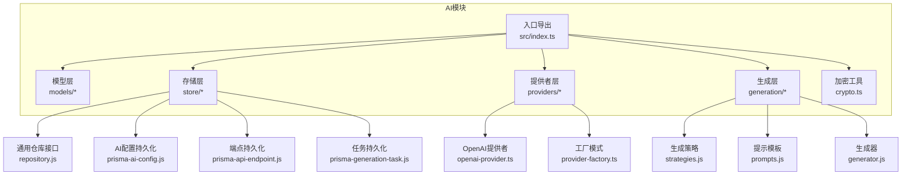
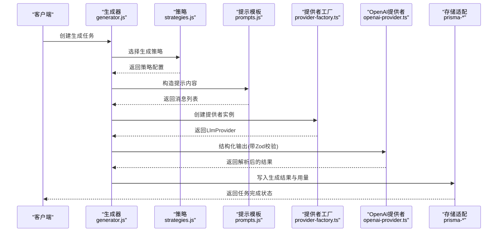
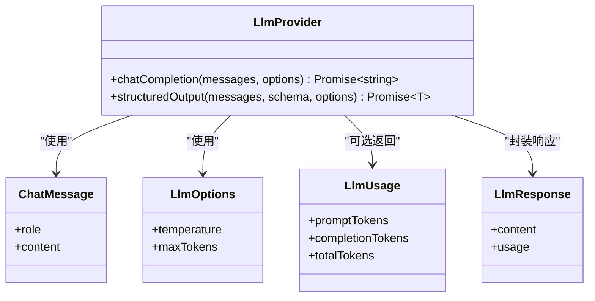
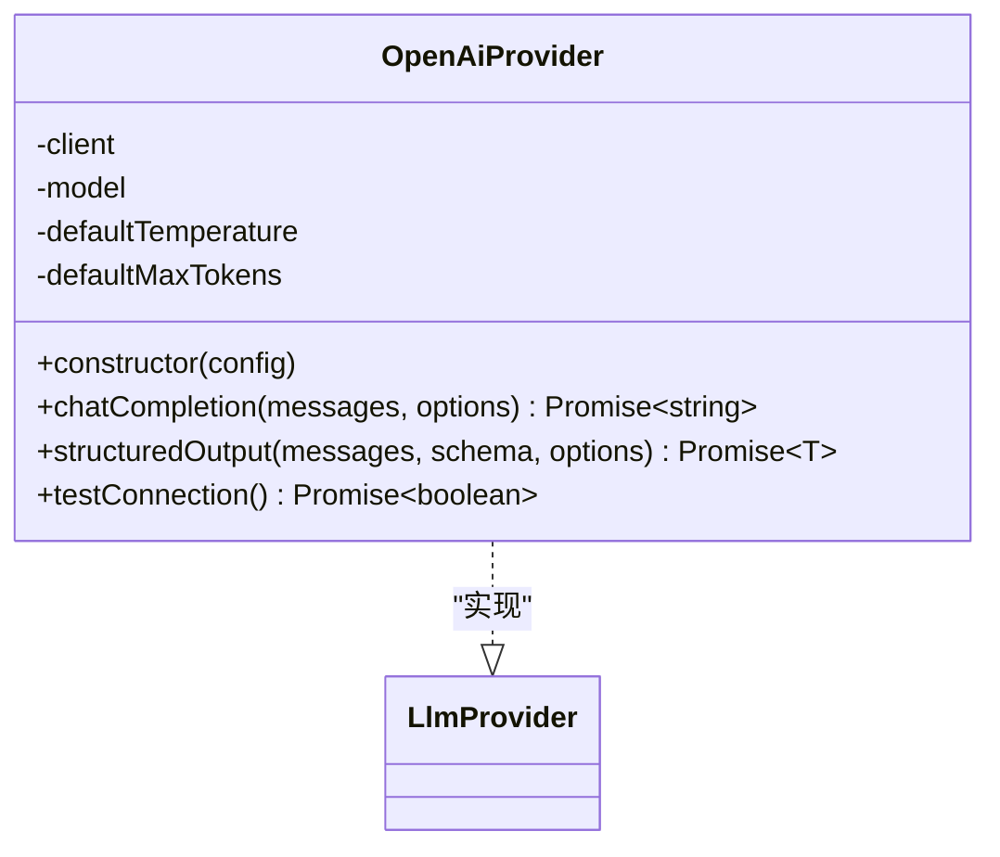
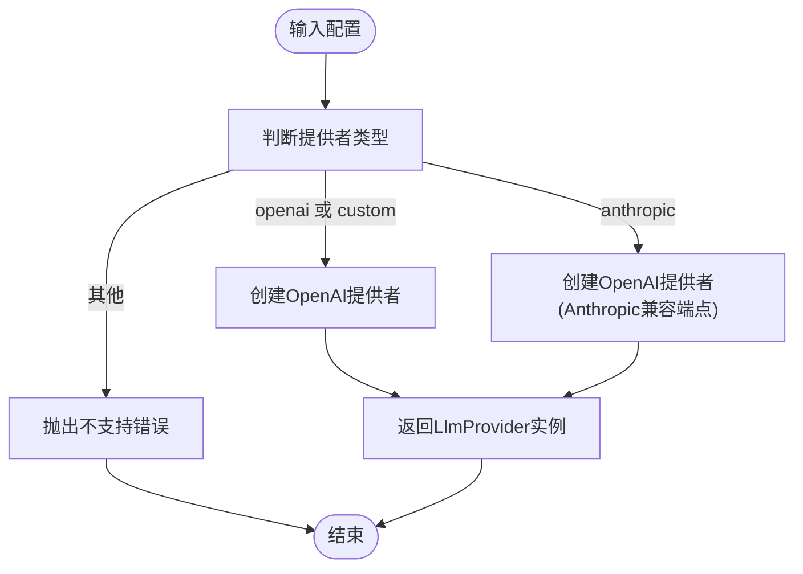
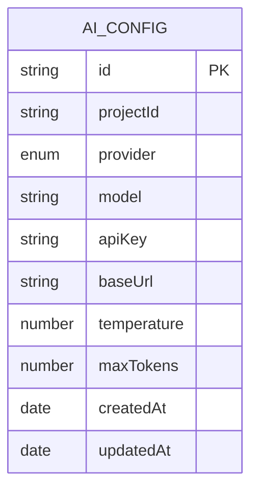
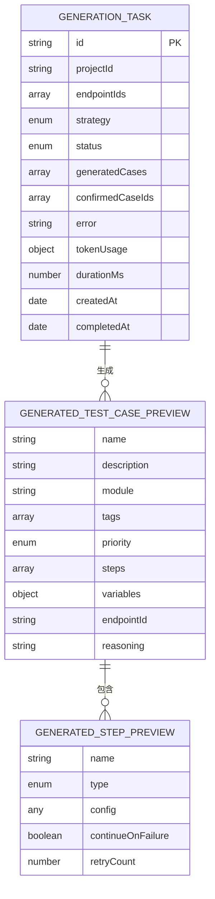
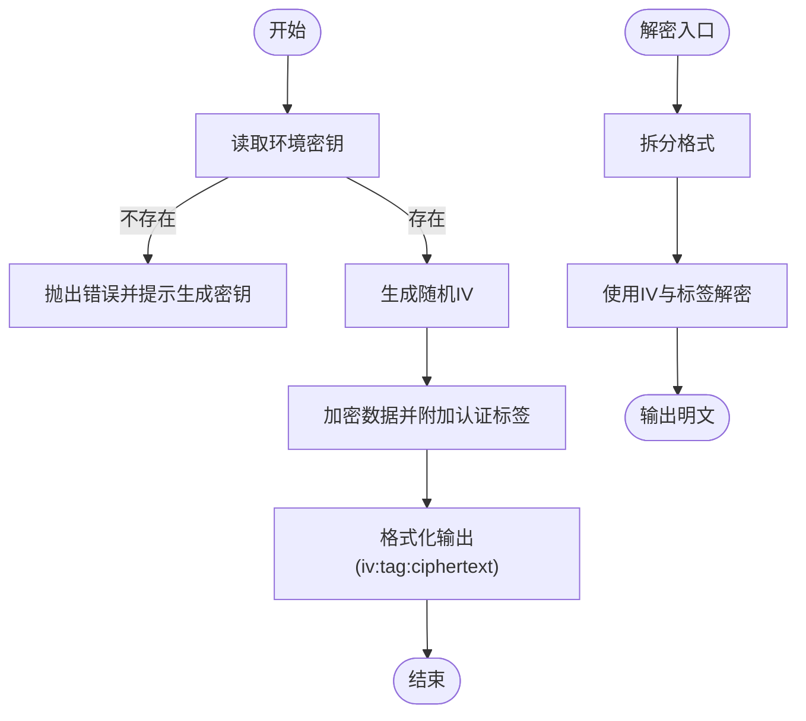
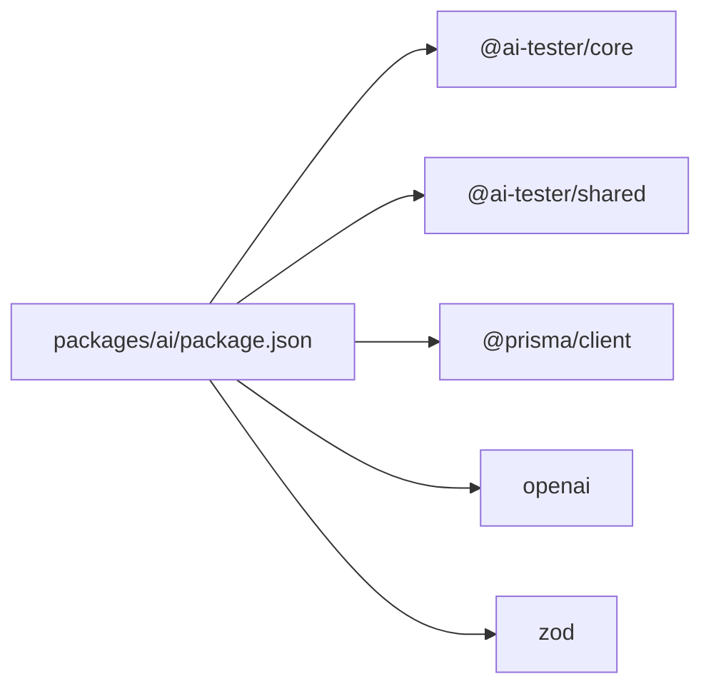

# AI智能集成

<cite>
**本文引用的文件**
- [packages/ai/package.json](file://packages/ai/package.json)
- [packages/ai/src/index.ts](file://packages/ai/src/index.ts)
- [packages/ai/src/crypto.ts](file://packages/ai/src/crypto.ts)
- [packages/ai/src/providers/types.ts](file://packages/ai/src/providers/types.ts)
- [packages/ai/src/providers/openai-provider.ts](file://packages/ai/src/providers/openai-provider.ts)
- [packages/ai/src/providers/provider-factory.ts](file://packages/ai/src/providers/provider-factory.ts)
- [packages/ai/src/models/ai-config.ts](file://packages/ai/src/models/ai-config.ts)
- [packages/ai/src/models/generation.ts](file://packages/ai/src/models/generation.ts)
- [packages/ai/src/store/repository.js](file://packages/ai/src/store/repository.js)
- [packages/ai/src/store/prisma-ai-config.js](file://packages/ai/src/store/prisma-ai-config.js)
- [packages/ai/src/store/prisma-api-endpoint.js](file://packages/ai/src/store/prisma-api-endpoint.js)
- [packages/ai/src/store/prisma-generation-task.js](file://packages/ai/src/store/prisma-generation-task.js)
- [packages/ai/src/generation/strategies.js](file://packages/ai/src/generation/strategies.js)
- [packages/ai/src/generation/prompts.js](file://packages/ai/src/generation/prompts.js)
- [packages/ai/src/generation/generator.js](file://packages/ai/src/generation/generator.js)
</cite>

## 目录
1. [简介](#简介)
2. [项目结构](#项目结构)
3. [核心组件](#核心组件)
4. [架构总览](#架构总览)
5. [详细组件分析](#详细组件分析)
6. [依赖关系分析](#依赖关系分析)
7. [性能考虑](#性能考虑)
8. [故障排查指南](#故障排查指南)
9. [结论](#结论)
10. [附录](#附录)

## 简介
本文件为“AI智能集成模块”的技术文档，聚焦于以下目标：
- 解释AI测试用例生成器的工作原理、生成策略与提示工程技巧
- 文档化AI提供者集成架构（OpenAI集成、Provider工厂模式、多提供者支持）
- 说明AI配置管理、API密钥加密存储与连接测试机制
- 提供模型选择指南、参数调优建议与性能优化策略
- 给出使用示例、最佳实践与常见问题解决方案
- 指导如何扩展新的AI提供者与自定义生成策略

## 项目结构
AI模块采用按职责分层的组织方式：对外统一入口导出模型、存储、提供者、解析器与生成器；内部通过Zod进行配置与任务数据的结构化校验；通过OpenAI SDK实现具体推理能力；通过Prisma适配器持久化配置与任务。

图表来源
- [packages/ai/src/index.ts:1-7](file://packages/ai/src/index.ts#L1-L7)
- [packages/ai/src/providers/openai-provider.ts:1-79](file://packages/ai/src/providers/openai-provider.ts#L1-L79)
- [packages/ai/src/providers/provider-factory.ts:1-56](file://packages/ai/src/providers/provider-factory.ts#L1-L56)
- [packages/ai/src/generation/strategies.js](file://packages/ai/src/generation/strategies.js)
- [packages/ai/src/generation/prompts.js](file://packages/ai/src/generation/prompts.js)
- [packages/ai/src/generation/generator.js](file://packages/ai/src/generation/generator.js)
- [packages/ai/src/store/repository.js](file://packages/ai/src/store/repository.js)
- [packages/ai/src/store/prisma-ai-config.js](file://packages/ai/src/store/prisma-ai-config.js)
- [packages/ai/src/store/prisma-api-endpoint.js](file://packages/ai/src/store/prisma-api-endpoint.js)
- [packages/ai/src/store/prisma-generation-task.js](file://packages/ai/src/store/prisma-generation-task.js)

章节来源
- [packages/ai/src/index.ts:1-7](file://packages/ai/src/index.ts#L1-L7)
- [packages/ai/package.json:1-34](file://packages/ai/package.json#L1-L34)

## 核心组件
- 提供者接口与类型：定义统一的聊天补全与结构化输出能力，以及消息、选项、用量与响应的数据契约。
- OpenAI提供者：基于OpenAI SDK实现聊天补全与结构化输出（Zod解析），并提供连接性测试。
- 工厂模式：根据配置动态创建不同提供者实例，当前支持openai/custom与anthropic（以OpenAI兼容端点代理）。
- 配置模型：使用Zod对AI配置（提供者、模型、基础URL、温度、最大令牌数等）进行严格校验。
- 生成任务模型：定义生成策略、状态、令牌用量、步骤预览与测试用例预览等结构。
- 加密工具：基于AES-256-GCM实现API密钥的加解密与掩码显示。
- 存储适配：Repository抽象与Prisma适配器，分别用于AI配置、API端点与生成任务的持久化。

章节来源
- [packages/ai/src/providers/types.ts:1-35](file://packages/ai/src/providers/types.ts#L1-L35)
- [packages/ai/src/providers/openai-provider.ts:1-79](file://packages/ai/src/providers/openai-provider.ts#L1-L79)
- [packages/ai/src/providers/provider-factory.ts:1-56](file://packages/ai/src/providers/provider-factory.ts#L1-L56)
- [packages/ai/src/models/ai-config.ts:1-34](file://packages/ai/src/models/ai-config.ts#L1-L34)
- [packages/ai/src/models/generation.ts:1-67](file://packages/ai/src/models/generation.ts#L1-L67)
- [packages/ai/src/crypto.ts:1-58](file://packages/ai/src/crypto.ts#L1-L58)
- [packages/ai/src/store/repository.js](file://packages/ai/src/store/repository.js)
- [packages/ai/src/store/prisma-ai-config.js](file://packages/ai/src/store/prisma-ai-config.js)
- [packages/ai/src/store/prisma-api-endpoint.js](file://packages/ai/src/store/prisma-api-endpoint.js)
- [packages/ai/src/store/prisma-generation-task.js](file://packages/ai/src/store/prisma-generation-task.js)

## 架构总览
下图展示从“生成任务”到“提供者调用”的端到端流程，包括策略选择、提示构造、结构化输出与结果回写。

图表来源
- [packages/ai/src/generation/generator.js](file://packages/ai/src/generation/generator.js)
- [packages/ai/src/generation/strategies.js](file://packages/ai/src/generation/strategies.js)
- [packages/ai/src/generation/prompts.js](file://packages/ai/src/generation/prompts.js)
- [packages/ai/src/providers/provider-factory.ts:1-56](file://packages/ai/src/providers/provider-factory.ts#L1-L56)
- [packages/ai/src/providers/openai-provider.ts:1-79](file://packages/ai/src/providers/openai-provider.ts#L1-L79)
- [packages/ai/src/store/prisma-generation-task.js](file://packages/ai/src/store/prisma-generation-task.js)

## 详细组件分析

### 提供者接口与类型
- 角色与消息：系统、用户、助手三类角色的消息体，统一用于对话历史。
- 选项参数：温度与最大令牌数，支持在调用时覆盖默认值。
- 统一接口：chatCompletion用于自由文本回复；structuredOutput用于结构化输出并通过Zod schema进行解析与校验。
- 用量与响应：封装prompt/completion/total tokens统计与返回内容。

图表来源
- [packages/ai/src/providers/types.ts:1-35](file://packages/ai/src/providers/types.ts#L1-L35)

章节来源
- [packages/ai/src/providers/types.ts:1-35](file://packages/ai/src/providers/types.ts#L1-L35)

### OpenAI提供者实现
- 初始化：接收API Key、模型名、可选基础URL与默认温度/最大令牌数。
- 聊天补全：将消息映射为SDK所需格式，按需覆盖温度与最大令牌数。
- 结构化输出：使用OpenAI的Zod响应格式能力，自动解析为指定schema对象。
- 连接测试：发送简短消息验证连通性，异常即判定失败。

图表来源
- [packages/ai/src/providers/openai-provider.ts:1-79](file://packages/ai/src/providers/openai-provider.ts#L1-L79)
- [packages/ai/src/providers/types.ts:1-35](file://packages/ai/src/providers/types.ts#L1-L35)

章节来源
- [packages/ai/src/providers/openai-provider.ts:1-79](file://packages/ai/src/providers/openai-provider.ts#L1-L79)

### 工厂模式与多提供者支持
- 输入参数：提供者类型、模型、已解密API Key、可选基础URL、温度、最大令牌数。
- 当前支持：
  - openai/custom：直接使用OpenAI SDK。
  - anthropic：通过OpenAI兼容端点代理（默认Anthropic v1端点），便于快速接入。
- 异常处理：不支持的提供者类型抛出错误。

图表来源
- [packages/ai/src/providers/provider-factory.ts:1-56](file://packages/ai/src/providers/provider-factory.ts#L1-L56)

章节来源
- [packages/ai/src/providers/provider-factory.ts:1-56](file://packages/ai/src/providers/provider-factory.ts#L1-L56)

### 配置管理与Zod校验
- 提供者枚举：支持openai、anthropic、custom。
- 完整配置：包含项目ID、提供者、模型、加密存储的API Key、基础URL、温度、最大令牌数及时间戳。
- 创建与更新：分别提供严格的创建与部分更新schema，确保输入安全与一致性。
- 默认值：温度范围0~2，默认0.7；最大令牌数为正整数，默认4096。

图表来源
- [packages/ai/src/models/ai-config.ts:1-34](file://packages/ai/src/models/ai-config.ts#L1-L34)

章节来源
- [packages/ai/src/models/ai-config.ts:1-34](file://packages/ai/src/models/ai-config.ts#L1-L34)

### 生成任务与数据模型
- 生成策略：happy_path、error_cases、auth_cases、comprehensive。
- 任务状态：pending、running、completed、failed。
- 步骤预览：名称、类型（http/assertion/extract）、配置、容错与重试。
- 测试用例预览：名称、描述、模块、标签、优先级、变量、关联端点与推理说明。
- 任务实体：包含端点集合、策略、生成结果、确认用例、错误信息、令牌用量、耗时与时间戳。

图表来源
- [packages/ai/src/models/generation.ts:1-67](file://packages/ai/src/models/generation.ts#L1-L67)

章节来源
- [packages/ai/src/models/generation.ts:1-67](file://packages/ai/src/models/generation.ts#L1-L67)

### 加密与安全
- 算法：AES-256-GCM，随机初始化向量与认证标签。
- 密钥来源：从环境变量读取32字节十六进制密钥，缺失时报错并提示生成方法。
- 接口：encrypt、decrypt与maskApiKey（仅保留前后四位）。
- 使用建议：生产环境务必设置强密钥；避免日志打印原始密钥；定期轮换密钥。

图表来源
- [packages/ai/src/crypto.ts:1-58](file://packages/ai/src/crypto.ts#L1-L58)

章节来源
- [packages/ai/src/crypto.ts:1-58](file://packages/ai/src/crypto.ts#L1-L58)

### 存储适配与持久化
- 仓库抽象：统一的Repository接口，屏蔽具体存储实现。
- Prisma适配器：
  - AI配置：持久化与查询AI提供者配置。
  - API端点：持久化API端点元数据。
  - 生成任务：持久化生成任务、结果与用量。
- 与生成器协作：生成完成后回写生成结果与token用量，便于审计与成本控制。

章节来源
- [packages/ai/src/store/repository.js](file://packages/ai/src/store/repository.js)
- [packages/ai/src/store/prisma-ai-config.js](file://packages/ai/src/store/prisma-ai-config.js)
- [packages/ai/src/store/prisma-api-endpoint.js](file://packages/ai/src/store/prisma-api-endpoint.js)
- [packages/ai/src/store/prisma-generation-task.js](file://packages/ai/src/store/prisma-generation-task.js)

### 生成器工作流与提示工程
- 策略选择：根据任务策略（如happy/error/auth/comprehensive）决定生成方向与边界条件。
- 提示构造：结合端点信息、业务上下文与策略要求，构建高质量提示。
- 结构化输出：通过Zod schema约束LLM输出，提升稳定性与可解析性。
- 回写与追踪：记录生成结果、token用量与执行耗时，支持后续优化与计费。

章节来源
- [packages/ai/src/generation/strategies.js](file://packages/ai/src/generation/strategies.js)
- [packages/ai/src/generation/prompts.js](file://packages/ai/src/generation/prompts.js)
- [packages/ai/src/generation/generator.js](file://packages/ai/src/generation/generator.js)

## 依赖关系分析
- 外部依赖：@prisma/client、openai、zod。
- 内部依赖：依赖core与shared包，通过workspace:*共享公共能力。
- 模块内聚：提供者与工厂高内聚，生成层与存储层通过接口解耦。

图表来源
- [packages/ai/package.json:1-34](file://packages/ai/package.json#L1-L34)

章节来源
- [packages/ai/package.json:1-34](file://packages/ai/package.json#L1-L34)

## 性能考虑
- 温度与最大令牌数：较低温度提升确定性，较高最大令牌数满足复杂场景但增加成本；建议在策略间权衡。
- 连接测试：在任务启动前进行轻量测试，提前发现鉴权或网络问题。
- 批量与并发：合理控制并发度，避免触发速率限制；必要时引入退避与重试。
- 输出解析：优先使用结构化输出与Zod校验，减少后处理开销与错误修复成本。
- 成本控制：记录token用量，设定阈值告警；对高频任务启用缓存或增量生成。

## 故障排查指南
- API密钥相关
  - 现象：运行时报缺少加密密钥或解密失败。
  - 处理：设置环境变量并确保为32字节十六进制字符串；检查格式为iv:tag:ciphertext。
- 连接失败
  - 现象：连接测试返回false或调用报网络错误。
  - 处理：检查基础URL、网络连通性与代理设置；确认API Key有效。
- 输出为空或无结构化结果
  - 现象：聊天补全返回空内容或结构化输出解析失败。
  - 处理：提高最大令牌数、调整温度；检查提示是否清晰且包含必要上下文；确认Zod schema与期望输出一致。
- 生成任务卡住
  - 现象：任务状态长期为pending或running。
  - 处理：查看错误字段与日志；检查端点集合与策略配置；确认存储可用性。

章节来源
- [packages/ai/src/crypto.ts:1-58](file://packages/ai/src/crypto.ts#L1-L58)
- [packages/ai/src/providers/openai-provider.ts:65-77](file://packages/ai/src/providers/openai-provider.ts#L65-L77)
- [packages/ai/src/models/generation.ts:1-67](file://packages/ai/src/models/generation.ts#L1-L67)

## 结论
该AI智能集成模块通过统一的提供者接口、工厂模式与Zod结构化校验，实现了OpenAI与Anthropic（兼容端点）的快速接入；配合加密存储、连接测试与生成任务持久化，形成从配置到产出的闭环。建议在实际落地中重视提示工程、参数调优与成本控制，并按需扩展新提供者与生成策略。

## 附录

### 使用示例（步骤说明）
- 配置管理
  - 创建AI配置：填写项目ID、提供者、模型、API Key（加密存储）、基础URL、温度与最大令牌数。
  - 更新配置：使用更新schema进行部分字段修改。
- 生成任务
  - 选择策略：happy_path/error_cases/auth_cases/comprehensive。
  - 指定端点：选择一个或多个API端点ID。
  - 启动生成：提交任务，等待完成并查看生成结果与token用量。
- 提示工程要点
  - 明确角色与目标：限定助手角色，强调输出格式与约束。
  - 上下文完备：包含端点路径、请求方法、鉴权方式与典型响应。
  - 边界与异常：显式要求错误场景与鉴权失败处理。
- 最佳实践
  - 先连接测试再批量生成。
  - 对关键输出使用结构化输出与Zod校验。
  - 记录并监控token用量与失败率。
  - 将策略与提示模板模块化，便于复用与迭代。
- 扩展新提供者
  - 实现LlmProvider接口（聊天补全与结构化输出）。
  - 在工厂中注册新提供者类型与默认行为。
  - 提供连接测试方法，确保可诊断性。
- 自定义生成策略
  - 在策略模块中新增策略枚举与分支逻辑。
  - 在提示模板中补充对应上下文与约束。
  - 在生成器中整合策略选择与结果回写。