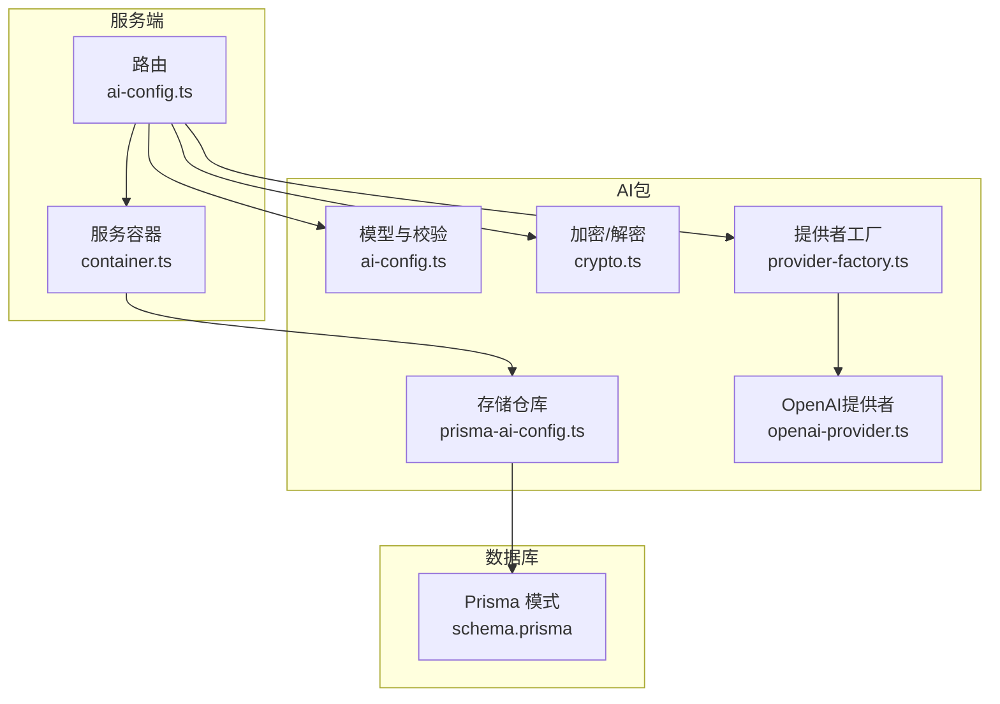
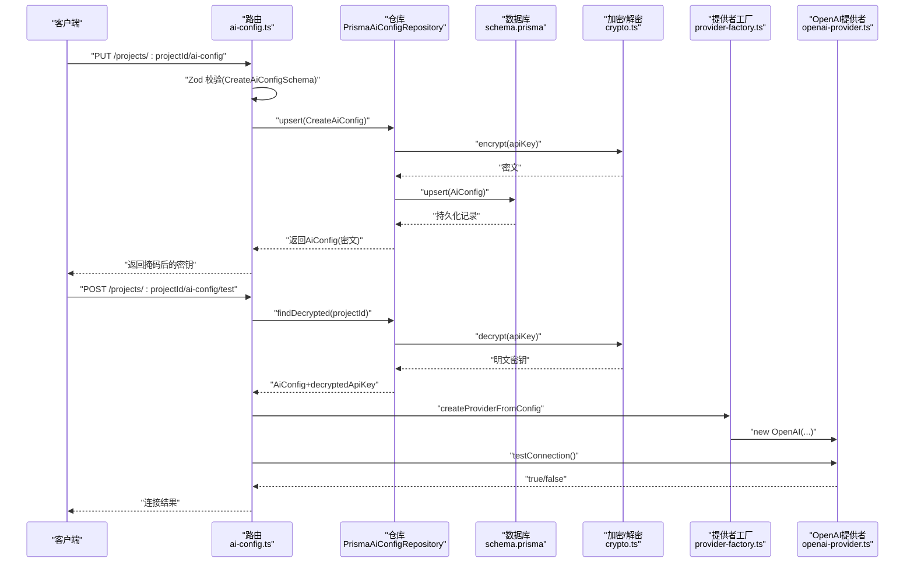
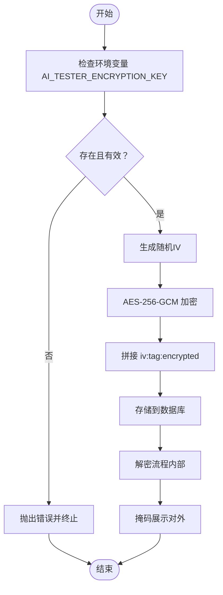
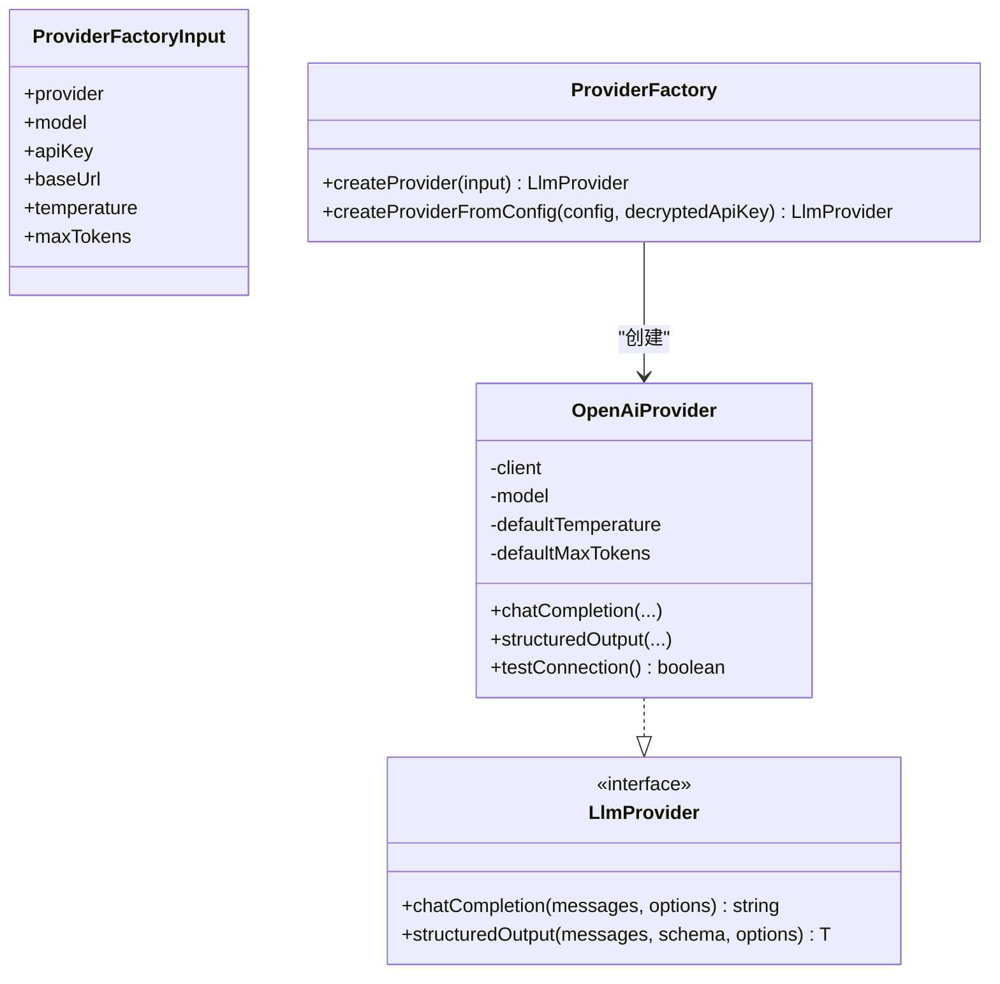
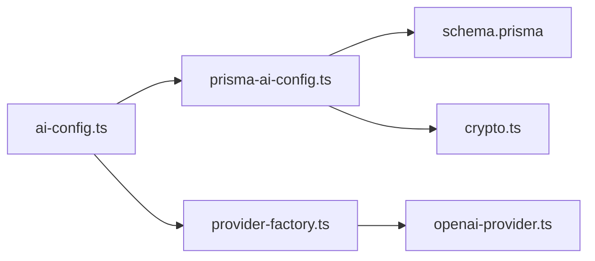

# AI配置管理

<cite>
**本文档引用的文件**
- [schema.prisma](file://prisma/schema.prisma)
- [ai-config.ts（模型）](file://packages/ai/src/models/ai-config.ts)
- [crypto.ts](file://packages/ai/src/crypto.ts)
- [prisma-ai-config.ts](file://packages/ai/src/store/prisma-ai-config.ts)
- [repository.ts](file://packages/ai/src/store/repository.ts)
- [ai-config.ts（服务端路由）](file://packages/server/src/routes/ai-config.ts)
- [container.ts](file://packages/server/src/services/container.ts)
- [provider-factory.ts](file://packages/ai/src/providers/provider-factory.ts)
- [openai-provider.ts](file://packages/ai/src/providers/openai-provider.ts)
- [types.ts（提供者类型）](file://packages/ai/src/providers/types.ts)
- [app.ts](file://packages/server/src/app.ts)
</cite>

## 目录
1. [简介](#简介)
2. [项目结构](#项目结构)
3. [核心组件](#核心组件)
4. [架构总览](#架构总览)
5. [详细组件分析](#详细组件分析)
6. [依赖关系分析](#依赖关系分析)
7. [性能考量](#性能考量)
8. [故障排查指南](#故障排查指南)
9. [结论](#结论)
10. [附录](#附录)

## 简介
本文件为“AI配置管理”模块的技术文档，聚焦于以下目标：
- 数据模型设计与字段定义、验证规则
- 配置存储机制：Prisma ORM、数据访问层、加密存储策略
- API密钥安全存储与解密机制：加密算法、密钥管理最佳实践
- 完整API接口：创建、更新、删除、查询、连接测试
- 配置验证、连接测试与错误处理实现细节
- 不同AI提供者的配置示例与使用场景

## 项目结构
该模块由多包协作构成，核心涉及：
- 数据模型与校验：packages/ai/src/models
- 加密与解密：packages/ai/src/crypto.ts
- 存储与仓库：packages/ai/src/store
- 提供者抽象与工厂：packages/ai/src/providers
- 服务端路由与容器：packages/server/src/routes 与 packages/server/src/services
- 数据库模式：prisma/schema.prisma



图表来源
- [ai-config.ts（服务端路由）:1-82](file://packages/server/src/routes/ai-config.ts#L1-L82)
- [container.ts:1-42](file://packages/server/src/services/container.ts#L1-L42)
- [prisma-ai-config.ts:1-82](file://packages/ai/src/store/prisma-ai-config.ts#L1-L82)
- [schema.prisma:141-154](file://prisma/schema.prisma#L141-L154)
- [ai-config.ts（模型）:1-34](file://packages/ai/src/models/ai-config.ts#L1-L34)
- [crypto.ts:1-58](file://packages/ai/src/crypto.ts#L1-L58)
- [provider-factory.ts:1-56](file://packages/ai/src/providers/provider-factory.ts#L1-L56)
- [openai-provider.ts:1-79](file://packages/ai/src/providers/openai-provider.ts#L1-L79)

章节来源
- [ai-config.ts（服务端路由）:1-82](file://packages/server/src/routes/ai-config.ts#L1-L82)
- [container.ts:1-42](file://packages/server/src/services/container.ts#L1-L42)
- [prisma-ai-config.ts:1-82](file://packages/ai/src/store/prisma-ai-config.ts#L1-L82)
- [schema.prisma:141-154](file://prisma/schema.prisma#L141-L154)

## 核心组件
- 数据模型与校验
  - AiConfigSchema/AiProviderEnum/CreateAiConfigSchema/UpdateAiConfigSchema 定义字段、类型、默认值与约束
  - 温度范围限制、最大Token正整数、必填项等
- 加密与解密
  - 使用 AES-256-GCM 对API密钥进行加密存储；解密仅在内部流程使用
  - 密钥通过环境变量注入，格式为十六进制字符串
- 存储与仓库
  - PrismaAiConfigRepository 实现 upsert/find/delete，并提供 findDecrypted/findMasked 辅助方法
- 提供者工厂
  - 根据配置动态创建 OpenAI 兼容提供者，支持自定义 base URL 与 Anthropic 代理
- 服务端路由
  - 提供 GET/PUT/DELETE/POST(/test) 接口，统一返回带掩码的密钥信息

章节来源
- [ai-config.ts（模型）:1-34](file://packages/ai/src/models/ai-config.ts#L1-L34)
- [crypto.ts:1-58](file://packages/ai/src/crypto.ts#L1-L58)
- [prisma-ai-config.ts:1-82](file://packages/ai/src/store/prisma-ai-config.ts#L1-L82)
- [provider-factory.ts:1-56](file://packages/ai/src/providers/provider-factory.ts#L1-L56)
- [ai-config.ts（服务端路由）:1-82](file://packages/server/src/routes/ai-config.ts#L1-L82)

## 架构总览
下图展示从HTTP请求到数据库与外部LLM服务的调用链路。



图表来源
- [ai-config.ts（服务端路由）:1-82](file://packages/server/src/routes/ai-config.ts#L1-L82)
- [prisma-ai-config.ts:1-82](file://packages/ai/src/store/prisma-ai-config.ts#L1-L82)
- [crypto.ts:1-58](file://packages/ai/src/crypto.ts#L1-L58)
- [provider-factory.ts:1-56](file://packages/ai/src/providers/provider-factory.ts#L1-L56)
- [openai-provider.ts:1-79](file://packages/ai/src/providers/openai-provider.ts#L1-L79)

## 详细组件分析

### 数据模型与验证规则
- 字段定义与约束
  - provider: 枚举 openai/anthropic/custom
  - model: 字符串，必填且非空
  - apiKey: 字符串，必填且非空（加密存储）
  - baseUrl: 可选URL字符串
  - temperature: 数字，范围[0,2]，默认0.7
  - maxTokens: 正整数，最小1，默认4096
  - createdAt/updatedAt: 自动维护
- 校验策略
  - 创建时使用 CreateAiConfigSchema，严格校验必填与范围
  - 更新时使用 UpdateAiConfigSchema（部分字段可选）
  - 查询响应通过 findMasked 返回掩码后的密钥，避免泄露

章节来源
- [ai-config.ts（模型）:1-34](file://packages/ai/src/models/ai-config.ts#L1-L34)
- [schema.prisma:141-154](file://prisma/schema.prisma#L141-L154)

### 加密存储与密钥管理
- 加密算法与格式
  - AES-256-GCM，随机初始化向量（IV），认证标签（Tag）随密文一起存储
  - 密文格式：iv:tag:encrypted（十六进制）
- 密钥来源
  - 通过环境变量 AI_TESTER_ENCRYPTION_KEY 注入，必须为32字节十六进制字符串
- 解密与掩码
  - 内部流程使用 decrypt 获取明文密钥
  - API响应使用 maskApiKey 对密钥进行掩码显示



图表来源
- [crypto.ts:1-58](file://packages/ai/src/crypto.ts#L1-L58)

章节来源
- [crypto.ts:1-58](file://packages/ai/src/crypto.ts#L1-L58)

### 存储与数据访问层
- PrismaAiConfigRepository
  - upsert：加密后写入数据库，支持按 projectId 唯一键更新
  - findByProjectId：按项目ID查询
  - delete：按项目ID删除
  - findDecrypted：内部使用，返回含明文密钥的对象
  - findMasked：对外返回掩码后的密钥对象
- 仓库接口
  - AiConfigRepository 定义标准CRUD能力

```mermaid
classDiagram
class PrismaAiConfigRepository {
+upsert(data) AiConfig
+findByProjectId(projectId) AiConfig|null
+delete(projectId) void
+findDecrypted(projectId) AiConfig&{decryptedApiKey}|null
+findMasked(projectId) AiConfig&{maskedApiKey}|null
}
class AiConfigRepository {
<<interface>>
+upsert(data) AiConfig
+findByProjectId(projectId) AiConfig|null
+delete(projectId) void
}
PrismaAiConfigRepository ..|> AiConfigRepository
```

图表来源
- [prisma-ai-config.ts:1-82](file://packages/ai/src/store/prisma-ai-config.ts#L1-L82)
- [repository.ts:1-39](file://packages/ai/src/store/repository.ts#L1-L39)

章节来源
- [prisma-ai-config.ts:1-82](file://packages/ai/src/store/prisma-ai-config.ts#L1-L82)
- [repository.ts:1-39](file://packages/ai/src/store/repository.ts#L1-L39)

### 提供者抽象与工厂
- 工厂输入
  - provider/model/apiKey(baseUrl/temperature/maxTokens)
- 支持的提供者
  - openai/custom：直接使用 OpenAI SDK
  - anthropic：通过代理或默认URL走 OpenAI 兼容接口
- 连接测试
  - OpenAiProvider.testConnection 发起一次极短请求以验证连通性



图表来源
- [provider-factory.ts:1-56](file://packages/ai/src/providers/provider-factory.ts#L1-L56)
- [openai-provider.ts:1-79](file://packages/ai/src/providers/openai-provider.ts#L1-L79)
- [types.ts（提供者类型）:1-35](file://packages/ai/src/providers/types.ts#L1-L35)

章节来源
- [provider-factory.ts:1-56](file://packages/ai/src/providers/provider-factory.ts#L1-L56)
- [openai-provider.ts:1-79](file://packages/ai/src/providers/openai-provider.ts#L1-L79)
- [types.ts（提供者类型）:1-35](file://packages/ai/src/providers/types.ts#L1-L35)

### API接口文档
- 获取配置（掩码密钥）
  - 方法与路径：GET /api/v1/projects/:projectId/ai-config
  - 返回：AiConfig（其中 apiKey 为固定占位符，maskedApiKey 为掩码）
- 创建/更新配置（Upsert）
  - 方法与路径：PUT /api/v1/projects/:projectId/ai-config
  - 请求体：CreateAiConfigSchema（含 projectId）
  - 返回：AiConfig（内部解密后返回 maskedApiKey）
- 删除配置
  - 方法与路径：DELETE /api/v1/projects/:projectId/ai-config
  - 返回：204 No Content
- 连接测试
  - 方法与路径：POST /api/v1/projects/:projectId/ai-config/test
  - 行为：若为 OpenAI 提供者，执行一次简短对话测试连通性；其他提供者返回“已配置”
  - 成功：{ success: true, message }
  - 失败：{ success: false, message }

章节来源
- [ai-config.ts（服务端路由）:1-82](file://packages/server/src/routes/ai-config.ts#L1-L82)

### 错误处理与全局异常
- 路由层
  - Zod 校验失败：返回 400，包含 VALIDATION_ERROR 与详情
  - 其他异常：记录日志并返回 500，包含 INTERNAL_ERROR
- 连接测试异常
  - 捕获异常并返回错误消息，不暴露敏感信息

章节来源
- [app.ts:1-77](file://packages/server/src/app.ts#L1-L77)
- [ai-config.ts（服务端路由）:1-82](file://packages/server/src/routes/ai-config.ts#L1-L82)

## 依赖关系分析
- 组件耦合
  - 路由依赖仓库与工厂；仓库依赖Prisma与加密模块；工厂依赖提供者实现
- 外部依赖
  - Prisma（SQLite）
  - OpenAI SDK
  - Node crypto（AES-256-GCM）



图表来源
- [ai-config.ts（服务端路由）:1-82](file://packages/server/src/routes/ai-config.ts#L1-L82)
- [prisma-ai-config.ts:1-82](file://packages/ai/src/store/prisma-ai-config.ts#L1-L82)
- [schema.prisma:141-154](file://prisma/schema.prisma#L141-L154)
- [crypto.ts:1-58](file://packages/ai/src/crypto.ts#L1-L58)
- [provider-factory.ts:1-56](file://packages/ai/src/providers/provider-factory.ts#L1-L56)
- [openai-provider.ts:1-79](file://packages/ai/src/providers/openai-provider.ts#L1-L79)

章节来源
- [ai-config.ts（服务端路由）:1-82](file://packages/server/src/routes/ai-config.ts#L1-L82)
- [prisma-ai-config.ts:1-82](file://packages/ai/src/store/prisma-ai-config.ts#L1-L82)
- [provider-factory.ts:1-56](file://packages/ai/src/providers/provider-factory.ts#L1-L56)

## 性能考量
- 加密/解密成本
  - 单次请求仅在写入与测试时发生，开销可忽略
- 数据库访问
  - 通过唯一索引（projectId）查询，读写均为单条记录，性能稳定
- 连接测试
  - 采用最小化请求参数，避免长耗时操作

## 故障排查指南
- “未找到AI配置”
  - 现象：连接测试返回 NOT_FOUND
  - 处理：先调用创建/更新接口保存配置
- “密钥未设置或格式错误”
  - 现象：启动时报错提示需要设置 AI_TESTER_ENCRYPTION_KEY
  - 处理：生成32字节十六进制密钥并设置环境变量
- “连接失败”
  - 现象：连接测试返回失败
  - 处理：检查 provider/model/baseUrl/apiKey 是否正确；确认网络可达性
- “返回明文密钥”
  - 现象：对外接口未返回明文
  - 处理：findMasked 会返回 maskedApiKey；仅内部流程可获取明文

章节来源
- [ai-config.ts（服务端路由）:1-82](file://packages/server/src/routes/ai-config.ts#L1-L82)
- [crypto.ts:1-58](file://packages/ai/src/crypto.ts#L1-L58)

## 结论
本模块通过严格的模型校验、安全的加密存储与清晰的仓库/工厂分层，提供了可靠的AI配置管理能力。结合连接测试与完善的错误处理，确保了配置的可用性与安全性。建议在生产环境中：
- 使用强随机密钥并妥善保管
- 限制对加密密钥的访问范围
- 在CI/CD中安全地注入环境变量

## 附录

### 数据模型与字段定义（摘要）
- AiConfig
  - id、projectId、provider、model、apiKey（加密）、baseUrl、temperature、maxTokens、createdAt、updatedAt
- CreateAiConfig
  - 与 AiConfig 类似，但字段为必填或有最小长度/范围约束
- UpdateAiConfig
  - 部分字段可选

章节来源
- [ai-config.ts（模型）:1-34](file://packages/ai/src/models/ai-config.ts#L1-L34)
- [schema.prisma:141-154](file://prisma/schema.prisma#L141-L154)

### API密钥安全存储与解密机制
- 加密算法：AES-256-GCM
- 密钥来源：环境变量 AI_TESTER_ENCRYPTION_KEY（32字节十六进制）
- 存储格式：iv:tag:encrypted
- 解密用途：仅内部流程（如连接测试）
- 掩码策略：maskApiKey 对密钥前后缀保留，中间掩码

章节来源
- [crypto.ts:1-58](file://packages/ai/src/crypto.ts#L1-L58)

### 配置示例与使用场景
- OpenAI
  - provider: openai
  - model: 例如 gpt-4o
  - baseUrl: 可选（默认官方地址）
  - apiKey: 从 OpenAI 获取
- Anthropic
  - provider: anthropic
  - model: 例如 claude-3-5-sonnet-20240620
  - baseUrl: 可选（默认官方兼容地址）
  - apiKey: 从 Anthropic 获取
- 自定义兼容服务
  - provider: custom
  - model: 自定义模型名称
  - baseUrl: 自定义兼容服务地址
  - apiKey: 服务提供的密钥

章节来源
- [provider-factory.ts:1-56](file://packages/ai/src/providers/provider-factory.ts#L1-L56)
- [openai-provider.ts:1-79](file://packages/ai/src/providers/openai-provider.ts#L1-L79)