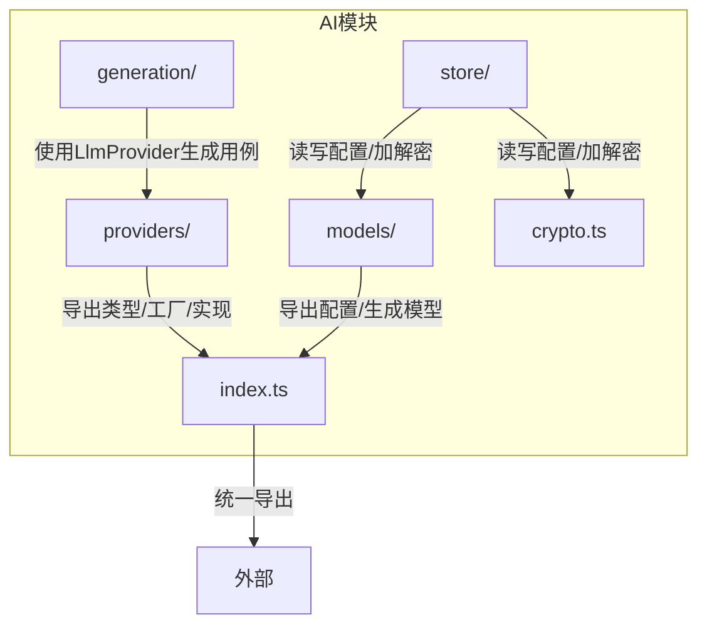
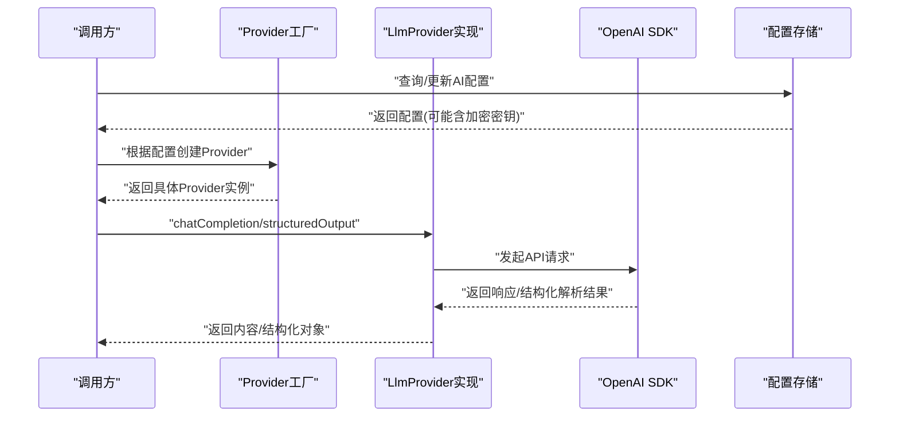
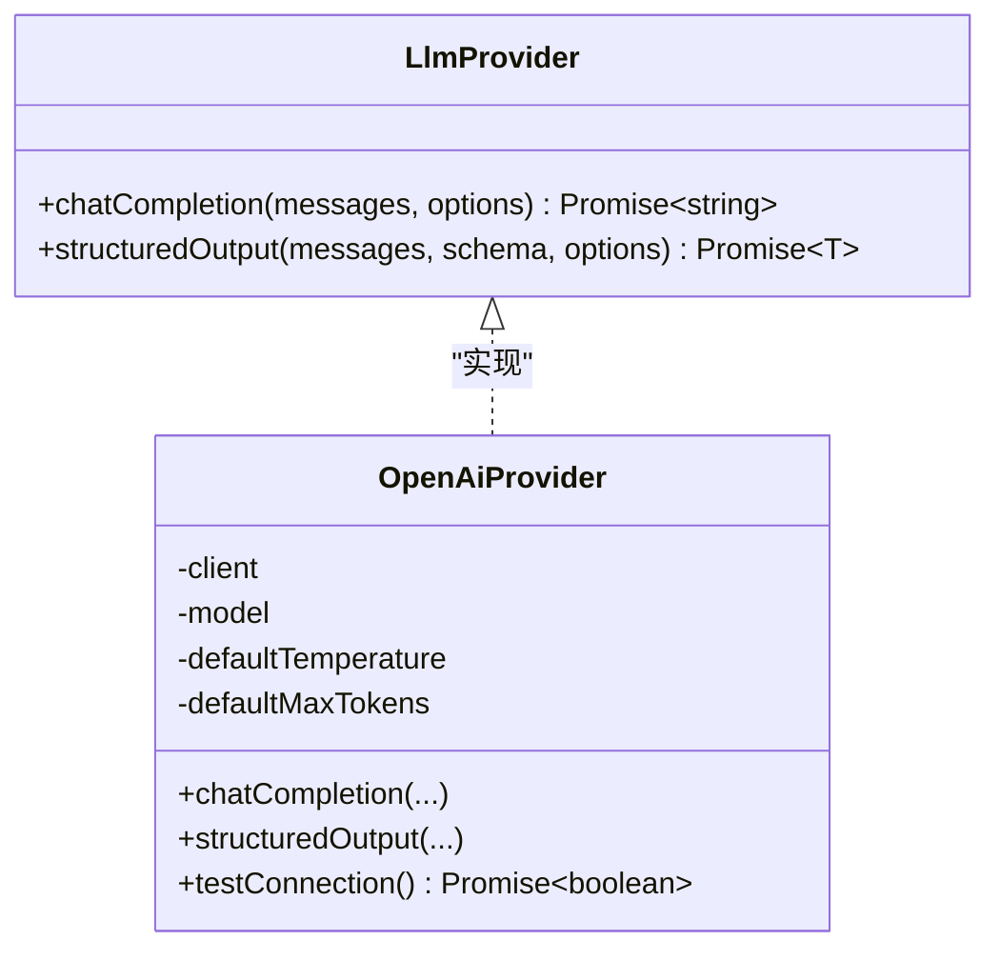
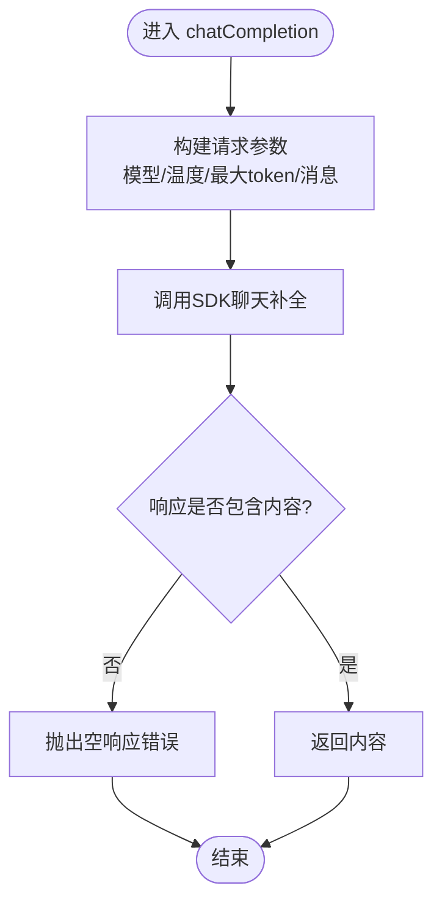
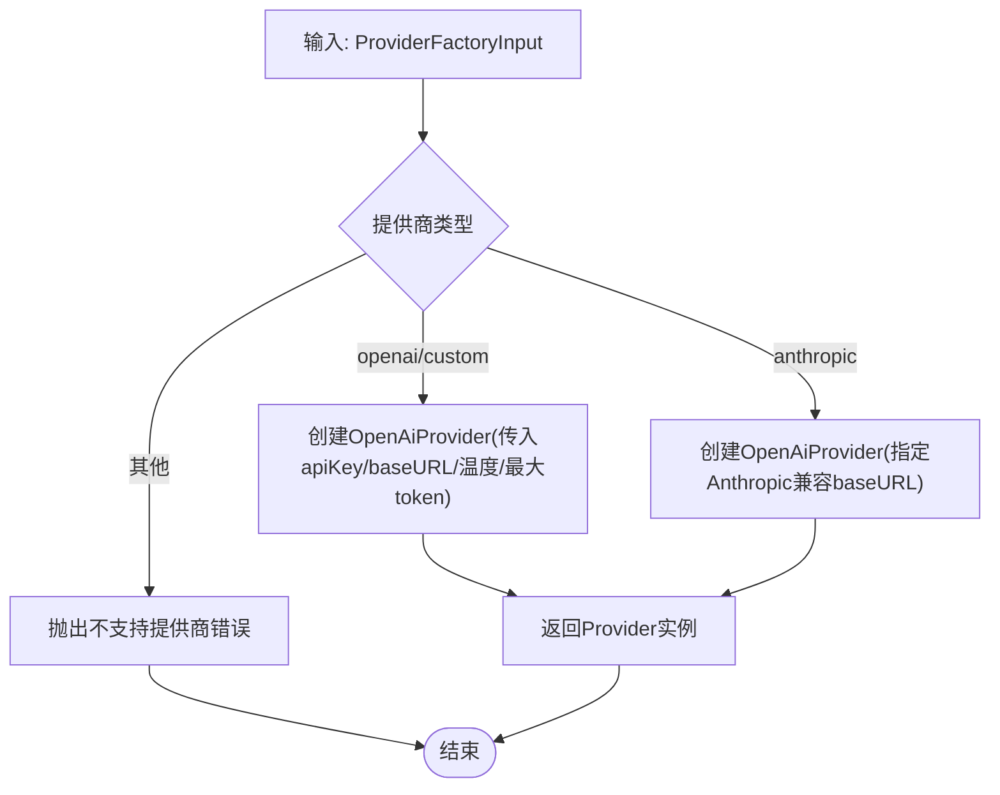
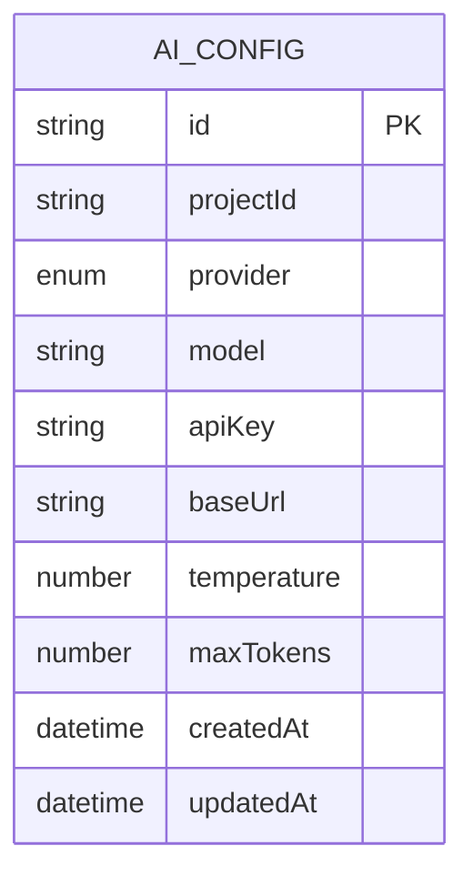
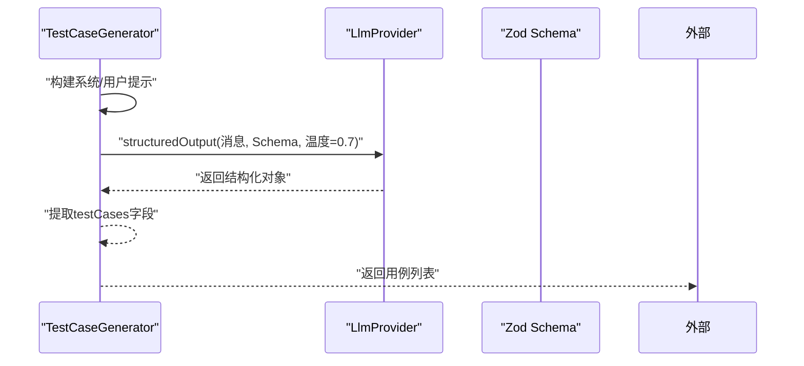
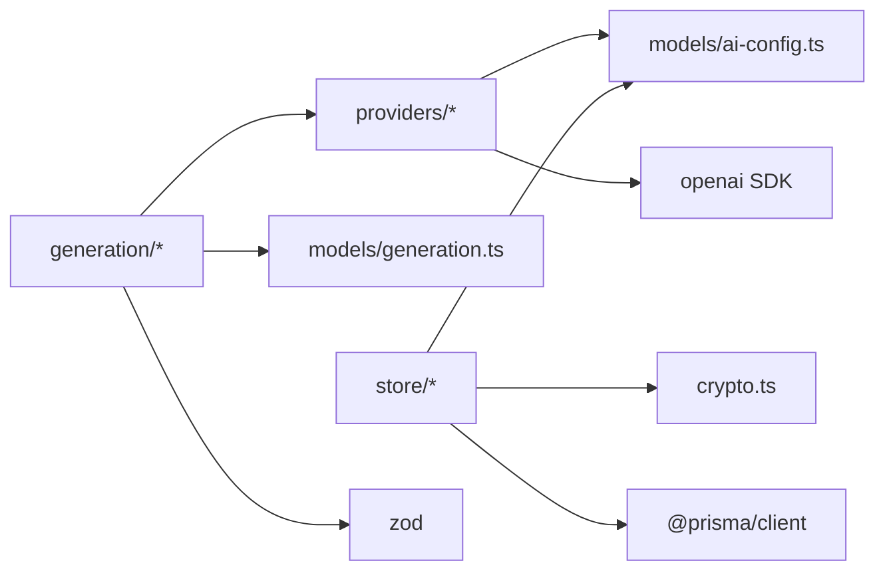

# LLM提供者集成

<cite>
**本文引用的文件**
- [packages/ai/src/index.ts](file://packages/ai/src/index.ts)
- [packages/ai/src/providers/types.ts](file://packages/ai/src/providers/types.ts)
- [packages/ai/src/providers/openai-provider.ts](file://packages/ai/src/providers/openai-provider.ts)
- [packages/ai/src/providers/provider-factory.ts](file://packages/ai/src/providers/provider-factory.ts)
- [packages/ai/src/providers/index.ts](file://packages/ai/src/providers/index.ts)
- [packages/ai/src/models/ai-config.ts](file://packages/ai/src/models/ai-config.ts)
- [packages/ai/src/models/generation.ts](file://packages/ai/src/models/generation.ts)
- [packages/ai/src/generation/generator.ts](file://packages/ai/src/generation/generator.ts)
- [packages/ai/src/store/prisma-ai-config.ts](file://packages/ai/src/store/prisma-ai-config.ts)
- [packages/ai/src/crypto.ts](file://packages/ai/src/crypto.ts)
- [packages/ai/package.json](file://packages/ai/package.json)
</cite>

## 目录
1. [简介](#简介)
2. [项目结构](#项目结构)
3. [核心组件](#核心组件)
4. [架构总览](#架构总览)
5. [详细组件分析](#详细组件分析)
6. [依赖分析](#依赖分析)
7. [性能考虑](#性能考虑)
8. [故障排查指南](#故障排查指南)
9. [结论](#结论)
10. [附录：扩展新AI提供者指南](#附录扩展新ai提供者指南)

## 简介
本文件面向“LLM提供者集成”模块，系统化阐述统一抽象接口设计、OpenAI提供者的具体实现、Provider工厂模式与配置管理、以及扩展新AI提供者的完整指南。文档同时给出生成流程中的数据模型、依赖关系与错误处理策略，并提供性能监控、速率限制与故障转移的实现建议。

## 项目结构
该模块位于 packages/ai，采用按功能域分层组织：
- providers：提供者抽象与实现（统一接口、OpenAI实现、工厂）
- models：配置与生成任务的数据模型
- generation：基于LLM的测试用例生成器
- store：持久化与加密存储
- crypto：密钥加解密与掩码工具
- index：对外导出入口

图表来源
- [packages/ai/src/index.ts:1-7](file://packages/ai/src/index.ts#L1-L7)
- [packages/ai/src/providers/index.ts:1-4](file://packages/ai/src/providers/index.ts#L1-L4)

章节来源
- [packages/ai/src/index.ts:1-7](file://packages/ai/src/index.ts#L1-L7)
- [packages/ai/src/providers/index.ts:1-4](file://packages/ai/src/providers/index.ts#L1-L4)

## 核心组件
- 统一接口 LlmProvider：定义通用聊天补全与结构化解析能力，支持温度与最大token等可选参数。
- OpenAI提供者 OpenAiProvider：基于官方SDK封装，支持结构化解析与连通性测试。
- Provider工厂 createProvider/createProviderFromConfig：根据配置动态创建具体提供者实例，支持多提供商映射。
- 配置模型 AiConfig/AiProvider：Zod校验的配置结构，含提供商枚举、模型名、基础URL、温度、最大token等。
- 生成器 TestCaseGenerator：以结构化输出方式从多个API端点生成测试用例。
- 存储 PrismaAiConfigRepository：对配置进行增删改查、加解密与掩码处理。
- 加密工具 crypto：提供密钥加密、解密与掩码能力。

章节来源
- [packages/ai/src/providers/types.ts:13-23](file://packages/ai/src/providers/types.ts#L13-L23)
- [packages/ai/src/providers/openai-provider.ts:14-79](file://packages/ai/src/providers/openai-provider.ts#L14-L79)
- [packages/ai/src/providers/provider-factory.ts:14-55](file://packages/ai/src/providers/provider-factory.ts#L14-L55)
- [packages/ai/src/models/ai-config.ts:3-34](file://packages/ai/src/models/ai-config.ts#L3-L34)
- [packages/ai/src/generation/generator.ts:20-56](file://packages/ai/src/generation/generator.ts#L20-L56)
- [packages/ai/src/store/prisma-ai-config.ts:22-81](file://packages/ai/src/store/prisma-ai-config.ts#L22-L81)
- [packages/ai/src/crypto.ts](file://packages/ai/src/crypto.ts)

## 架构总览
下图展示从配置到生成器再到具体提供者的调用链路与职责边界：

图表来源
- [packages/ai/src/providers/provider-factory.ts:14-55](file://packages/ai/src/providers/provider-factory.ts#L14-L55)
- [packages/ai/src/providers/openai-provider.ts:30-63](file://packages/ai/src/providers/openai-provider.ts#L30-L63)
- [packages/ai/src/store/prisma-ai-config.ts:49-68](file://packages/ai/src/store/prisma-ai-config.ts#L49-L68)
- [packages/ai/src/generation/generator.ts:45-54](file://packages/ai/src/generation/generator.ts#L45-L54)

## 详细组件分析

### 统一接口 LlmProvider
- 职责
  - 提供自由文本聊天补全能力 chatCompletion
  - 提供结构化解析能力 structuredOutput，结合Zod schema进行强类型输出
  - 支持可选参数：温度、最大token
- 数据契约
  - ChatMessage：角色与内容
  - LlmOptions：温度、最大token
  - LlmResponse/LlmUsage：响应内容与用量统计（可选）

图表来源
- [packages/ai/src/providers/types.ts:13-23](file://packages/ai/src/providers/types.ts#L13-L23)
- [packages/ai/src/providers/openai-provider.ts:14-79](file://packages/ai/src/providers/openai-provider.ts#L14-L79)

章节来源
- [packages/ai/src/providers/types.ts:3-35](file://packages/ai/src/providers/types.ts#L3-L35)

### OpenAI提供者 OpenAiProvider
- 关键特性
  - 基于官方SDK初始化客户端，支持自定义baseURL
  - chatCompletion：将消息数组转换为SDK期望格式并调用
  - structuredOutput：通过beta解析接口进行结构化解析
  - 连通性测试：最小化请求验证服务可用性
- 错误处理
  - 对空响应抛出明确异常，避免静默失败
- 可配置项
  - 模型名、默认温度、默认最大token、可选baseURL

图表来源
- [packages/ai/src/providers/openai-provider.ts:30-43](file://packages/ai/src/providers/openai-provider.ts#L30-L43)

章节来源
- [packages/ai/src/providers/openai-provider.ts:14-79](file://packages/ai/src/providers/openai-provider.ts#L14-L79)

### Provider工厂模式 createProvider
- 设计思想
  - 将“配置到实例”的映射逻辑集中在一个函数中，便于扩展与维护
  - 对未支持的提供商抛出明确错误，避免隐式失败
  - 支持Anthropic通过OpenAI兼容端点进行代理
- 生命周期
  - 工厂仅负责创建实例；上层负责持有与释放资源
- 输入参数
  - 提供商类型、模型、已解密的API Key、可选baseURL、温度、最大token

图表来源
- [packages/ai/src/providers/provider-factory.ts:14-40](file://packages/ai/src/providers/provider-factory.ts#L14-L40)

章节来源
- [packages/ai/src/providers/provider-factory.ts:5-55](file://packages/ai/src/providers/provider-factory.ts#L5-L55)

### 配置模型与存储
- 配置模型 AiConfig
  - 包含提供商枚举、模型名、API Key（加密存储）、可选baseURL、温度、最大token等
  - 使用Zod进行创建/更新/查询的严格校验
- 存储实现 PrismaAiConfigRepository
  - upsert：插入或更新配置，自动加密API Key
  - findByProjectId/findDecrypted/findMasked：按项目ID查询，支持解密与掩码
  - delete：删除配置

图表来源
- [packages/ai/src/models/ai-config.ts:5-16](file://packages/ai/src/models/ai-config.ts#L5-L16)
- [packages/ai/src/store/prisma-ai-config.ts:22-47](file://packages/ai/src/store/prisma-ai-config.ts#L22-L47)

章节来源
- [packages/ai/src/models/ai-config.ts:3-34](file://packages/ai/src/models/ai-config.ts#L3-L34)
- [packages/ai/src/store/prisma-ai-config.ts:22-81](file://packages/ai/src/store/prisma-ai-config.ts#L22-L81)

### 生成器 TestCaseGenerator
- 输入：API端点列表、生成策略、可选自定义提示
- 流程：构建系统提示、端点上下文与用户提示，调用Provider的结构化解析方法，返回标准化的测试用例预览
- 关键点：强制结构化输出，保证生成结果的一致性与可解析性

图表来源
- [packages/ai/src/generation/generator.ts:27-55](file://packages/ai/src/generation/generator.ts#L27-L55)

章节来源
- [packages/ai/src/generation/generator.ts:16-56](file://packages/ai/src/generation/generator.ts#L16-L56)
- [packages/ai/src/models/generation.ts:12-36](file://packages/ai/src/models/generation.ts#L12-L36)

## 依赖分析
- 内部依赖
  - providers 依赖 models 的配置类型
  - generation 依赖 providers 的统一接口与 models 的生成模型
  - store 依赖 models 的配置模型与 crypto 的加解密工具
- 外部依赖
  - openai 官方SDK用于OpenAI兼容服务
  - zod 用于运行时类型校验
  - @prisma/client 用于数据库访问

图表来源
- [packages/ai/src/providers/provider-factory.ts:1-3](file://packages/ai/src/providers/provider-factory.ts#L1-L3)
- [packages/ai/src/generation/generator.ts:1-11](file://packages/ai/src/generation/generator.ts#L1-L11)
- [packages/ai/src/store/prisma-ai-config.ts:1-6](file://packages/ai/src/store/prisma-ai-config.ts#L1-L6)
- [packages/ai/package.json:21-27](file://packages/ai/package.json#L21-L27)

章节来源
- [packages/ai/package.json:21-27](file://packages/ai/package.json#L21-L27)

## 性能考虑
- 请求批量化与并发控制
  - 在调用Provider前，对请求进行节流与并发上限控制，避免触发上游限流
- 缓存策略
  - 对静态提示与常用上下文进行缓存，减少重复计算与网络请求
- 超时与重试
  - 为SDK调用设置合理超时；对临时性错误进行指数退避重试
- 用量监控
  - 结合Provider返回的用量信息，记录prompt/completion/total token，用于成本与性能分析
- 速率限制
  - 根据提供商文档设置QPS与配额阈值，必要时引入本地队列与令牌桶算法
- 故障转移
  - 当主提供商不可用时，切换至备用baseURL或备选提供商实例；在工厂层增加健康检查与降级策略

## 故障排查指南
- 常见错误与定位
  - 空响应：当Provider返回无内容时会抛出异常，需检查消息格式与模型可用性
  - 不支持提供商：工厂对未知提供商抛错，确认配置中的提供商枚举值
  - 连接失败：可通过Provider的连通性测试快速判断服务端点与凭据有效性
  - 密钥问题：存储层对API Key进行加密保存，查询时需使用解密接口核验
- 排查步骤
  1) 使用Provider的连通性测试验证端点与凭据
  2) 检查AiConfig配置（模型、baseURL、温度、最大token）
  3) 查看存储层的解密与掩码结果，确认密钥状态
  4) 观察SDK返回的错误码与消息，结合日志定位

章节来源
- [packages/ai/src/providers/openai-provider.ts:66-77](file://packages/ai/src/providers/openai-provider.ts#L66-L77)
- [packages/ai/src/providers/provider-factory.ts:37-39](file://packages/ai/src/providers/provider-factory.ts#L37-L39)
- [packages/ai/src/store/prisma-ai-config.ts:61-68](file://packages/ai/src/store/prisma-ai-config.ts#L61-L68)

## 结论
本模块通过统一抽象接口与工厂模式实现了对多提供商的可插拔支持，OpenAI提供者作为首个实现展示了SDK集成、认证与结构化解析的关键路径。配合严格的配置模型、安全的加解密与存储策略，以及生成器的结构化输出，形成了从配置到生成的闭环。后续扩展新提供商只需遵循统一接口与工厂映射规则，并在存储与配置层面保持一致的约束即可。

## 附录：扩展新AI提供者指南
- 实现步骤
  1) 新建提供者类并实现 LlmProvider 接口（chatCompletion/structuredOutput）
  2) 在工厂中添加新的提供商分支，映射到新提供者构造函数
  3) 在配置模型中扩展提供商枚举与必要字段（如需要）
  4) 在存储层确保新增提供商的配置可被upsert与查询
  5) 编写连通性测试与错误处理策略
- 配置管理
  - 使用Zod Schema对新增字段进行校验
  - 在存储层对敏感字段进行加密保存
- 错误处理
  - 对空响应与解析失败抛出明确异常
  - 对不支持的提供商与无效配置统一报错
- 兼容性与差异性
  - 若新提供商API不完全兼容，可在Provider内部做适配（如参数映射、响应解析）
  - 在工厂层可为特定提供商设置默认baseURL或特殊行为
- 性能与监控
  - 为新提供者实现用量统计与错误计数
  - 引入超时、重试与限流策略，保障稳定性
- 集成示例
  - 参考 OpenAiProvider 的实现路径与工厂映射方式，快速完成新提供商接入

章节来源
- [packages/ai/src/providers/types.ts:13-23](file://packages/ai/src/providers/types.ts#L13-L23)
- [packages/ai/src/providers/provider-factory.ts:14-40](file://packages/ai/src/providers/provider-factory.ts#L14-L40)
- [packages/ai/src/models/ai-config.ts:3-16](file://packages/ai/src/models/ai-config.ts#L3-L16)
- [packages/ai/src/store/prisma-ai-config.ts:22-47](file://packages/ai/src/store/prisma-ai-config.ts#L22-L47)
- [packages/ai/src/providers/openai-provider.ts:14-79](file://packages/ai/src/providers/openai-provider.ts#L14-L79)