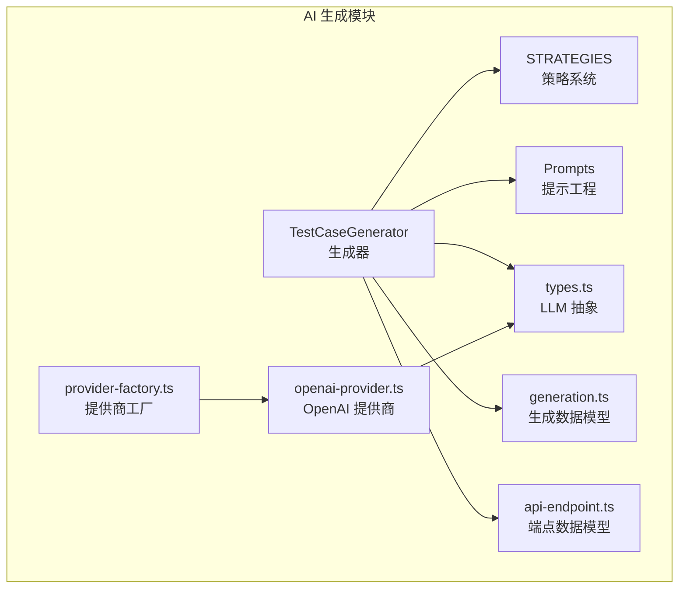
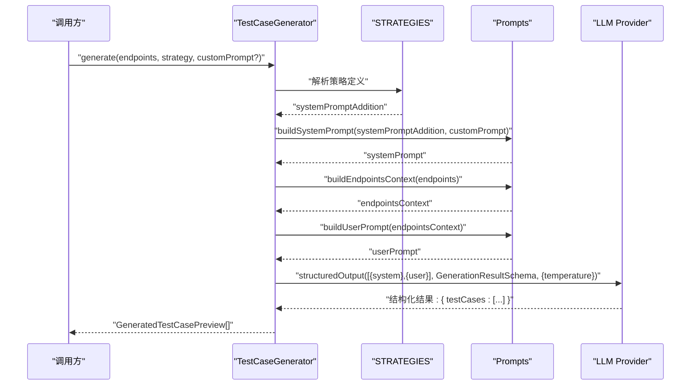
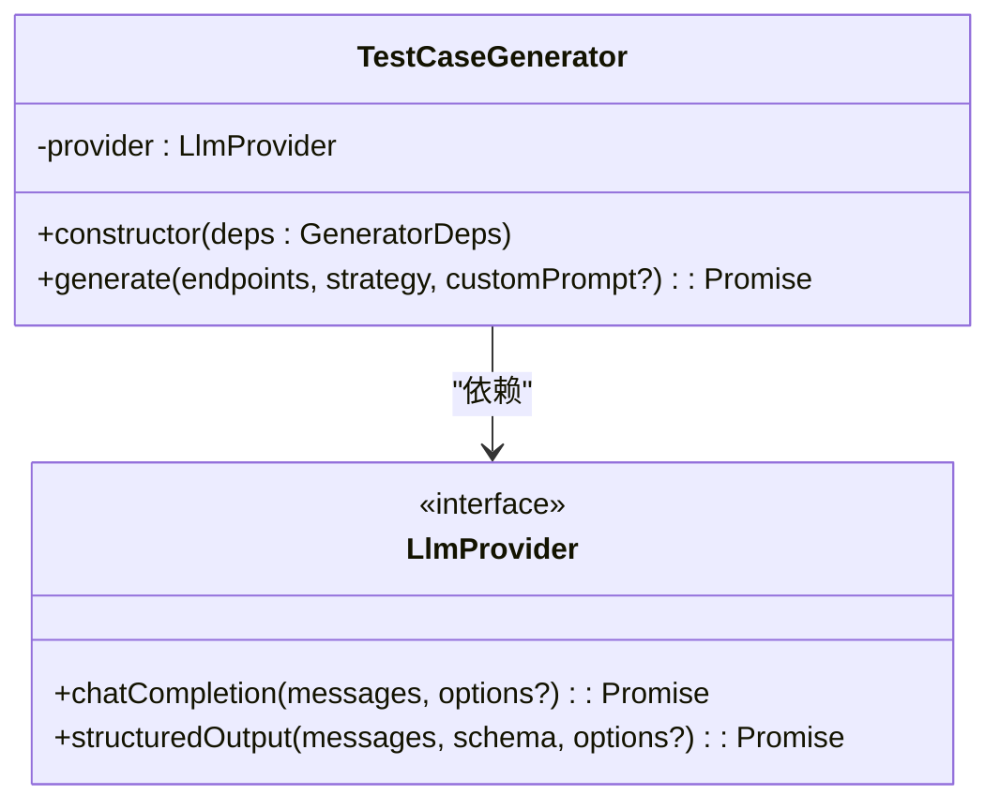
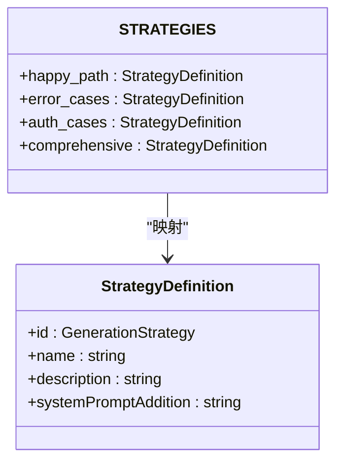
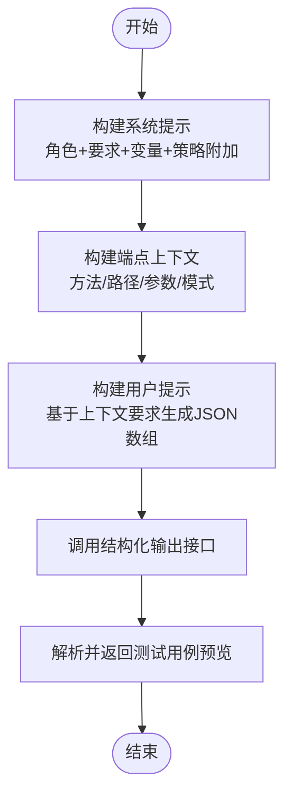
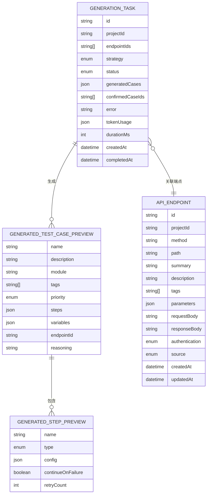
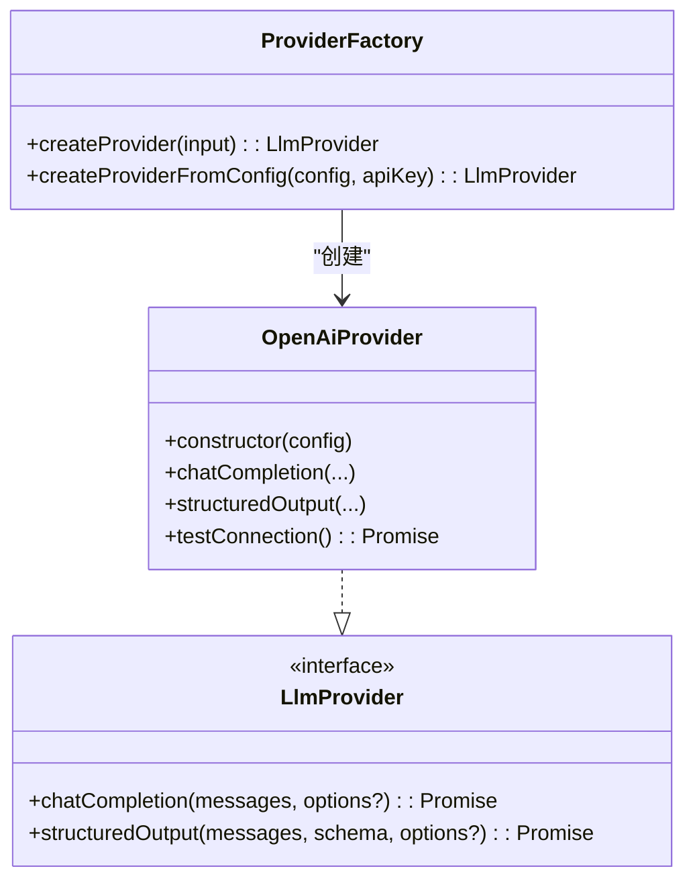
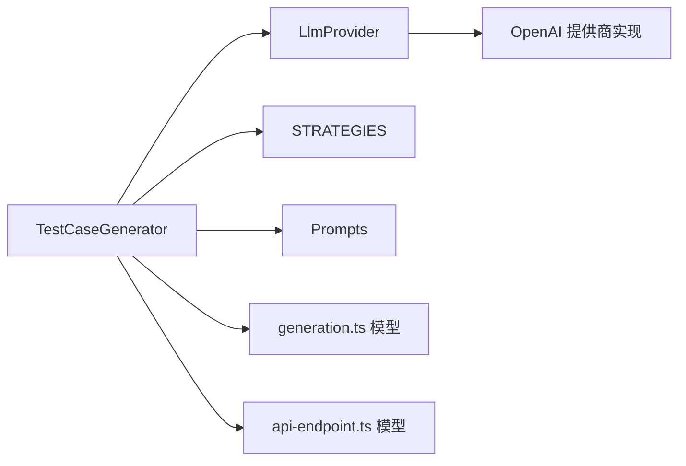

# 测试用例生成

<cite>
**本文引用的文件**
- [packages/ai/src/generation/generator.ts](file://packages/ai/src/generation/generator.ts)
- [packages/ai/src/generation/strategies.ts](file://packages/ai/src/generation/strategies.ts)
- [packages/ai/src/generation/prompts.ts](file://packages/ai/src/generation/prompts.ts)
- [packages/ai/src/models/generation.ts](file://packages/ai/src/models/generation.ts)
- [packages/ai/src/models/api-endpoint.ts](file://packages/ai/src/models/api-endpoint.ts)
- [packages/ai/src/providers/types.ts](file://packages/ai/src/providers/types.ts)
- [packages/ai/src/providers/openai-provider.ts](file://packages/ai/src/providers/openai-provider.ts)
- [packages/ai/src/providers/provider-factory.ts](file://packages/ai/src/providers/provider-factory.ts)
- [docs/review-report/specs-review-2026-04-24.md](file://docs/review-report/specs-review-2026-04-24.md)
</cite>

## 目录
1. [简介](#简介)
2. [项目结构](#项目结构)
3. [核心组件](#核心组件)
4. [架构总览](#架构总览)
5. [详细组件分析](#详细组件分析)
6. [依赖分析](#依赖分析)
7. [性能考量](#性能考量)
8. [故障排查指南](#故障排查指南)
9. [结论](#结论)
10. [附录](#附录)

## 简介
本文件为“测试用例生成”模块的技术文档，围绕 TestCaseGenerator 类展开，系统阐述其工作原理、生成流程、策略选择与输出格式，并对提示工程设计、数据结构定义、验证规则与预览功能进行文档化。同时提供针对不同 API 端点的使用示例、温度参数调优、生成质量控制与性能优化策略，帮助开发者与测试工程师高效、稳定地生成高质量的 API 测试用例。

## 项目结构
测试用例生成模块位于 packages/ai 包内，主要由以下子系统组成：
- 生成器：负责接收端点集合、策略与可选自定义提示，调用 LLM 提供商生成测试用例预览。
- 策略系统：定义多种生成策略（正常路径、错误用例、鉴权用例、综合覆盖），每种策略通过系统提示词附加指令引导 LLM。
- 提示工程：构建系统提示、端点上下文与用户提示，确保 LLM 在给定 API 信息下生成结构化、可执行的测试用例。
- 数据模型：定义生成结果、步骤、任务与端点的数据结构与校验规则。
- LLM 提供商抽象：统一 Chat Completion 与结构化输出能力，支持 OpenAI/Anthropic/自定义兼容端点。

图表来源
- [packages/ai/src/generation/generator.ts:20-56](file://packages/ai/src/generation/generator.ts#L20-L56)
- [packages/ai/src/generation/strategies.ts:10-49](file://packages/ai/src/generation/strategies.ts#L10-L49)
- [packages/ai/src/generation/prompts.ts:3-72](file://packages/ai/src/generation/prompts.ts#L3-L72)
- [packages/ai/src/models/generation.ts:1-67](file://packages/ai/src/models/generation.ts#L1-L67)
- [packages/ai/src/models/api-endpoint.ts:1-53](file://packages/ai/src/models/api-endpoint.ts#L1-L53)
- [packages/ai/src/providers/provider-factory.ts:14-55](file://packages/ai/src/providers/provider-factory.ts#L14-L55)
- [packages/ai/src/providers/types.ts:13-23](file://packages/ai/src/providers/types.ts#L13-L23)
- [packages/ai/src/providers/openai-provider.ts:45-63](file://packages/ai/src/providers/openai-provider.ts#L45-L63)

章节来源
- [packages/ai/src/generation/generator.ts:1-57](file://packages/ai/src/generation/generator.ts#L1-L57)
- [packages/ai/src/generation/strategies.ts:1-50](file://packages/ai/src/generation/strategies.ts#L1-L50)
- [packages/ai/src/generation/prompts.ts:1-73](file://packages/ai/src/generation/prompts.ts#L1-L73)
- [packages/ai/src/models/generation.ts:1-67](file://packages/ai/src/models/generation.ts#L1-L67)
- [packages/ai/src/models/api-endpoint.ts:1-53](file://packages/ai/src/models/api-endpoint.ts#L1-L53)
- [packages/ai/src/providers/types.ts:1-35](file://packages/ai/src/providers/types.ts#L1-L35)
- [packages/ai/src/providers/openai-provider.ts:45-78](file://packages/ai/src/providers/openai-provider.ts#L45-L78)
- [packages/ai/src/providers/provider-factory.ts:1-55](file://packages/ai/src/providers/provider-factory.ts#L1-L55)

## 核心组件
- TestCaseGenerator：对外暴露 generate 方法，接收端点数组、策略与可选自定义提示，返回测试用例预览列表。
- STRATEGIES：内置四种策略，分别面向正常路径、错误用例、鉴权用例与综合覆盖。
- Prompts：构建系统提示、端点上下文与用户提示，确保 LLM 生成符合预期的结构化测试用例。
- 数据模型：定义生成结果、步骤、任务与端点的数据结构与校验规则，保证生成物的结构化与可执行性。
- LLM Provider 抽象：统一聊天与结构化输出能力，支持 OpenAI/Anthropic/自定义兼容端点。

章节来源
- [packages/ai/src/generation/generator.ts:20-56](file://packages/ai/src/generation/generator.ts#L20-L56)
- [packages/ai/src/generation/strategies.ts:3-49](file://packages/ai/src/generation/strategies.ts#L3-L49)
- [packages/ai/src/generation/prompts.ts:3-72](file://packages/ai/src/generation/prompts.ts#L3-L72)
- [packages/ai/src/models/generation.ts:18-67](file://packages/ai/src/models/generation.ts#L18-L67)
- [packages/ai/src/models/api-endpoint.ts:6-29](file://packages/ai/src/models/api-endpoint.ts#L6-L29)
- [packages/ai/src/providers/types.ts:13-23](file://packages/ai/src/providers/types.ts#L13-L23)

## 架构总览
生成流程采用“策略 + 上下文 + 结构化输出”的设计：生成器根据策略拼装系统提示，结合端点上下文与用户提示，调用 LLM 提供商的结构化输出能力，最终返回结构化的测试用例预览列表。

图表来源
- [packages/ai/src/generation/generator.ts:27-54](file://packages/ai/src/generation/generator.ts#L27-L54)
- [packages/ai/src/generation/strategies.ts:10-49](file://packages/ai/src/generation/strategies.ts#L10-L49)
- [packages/ai/src/generation/prompts.ts:3-72](file://packages/ai/src/generation/prompts.ts#L3-L72)
- [packages/ai/src/providers/types.ts:18-22](file://packages/ai/src/providers/types.ts#L18-L22)

## 详细组件分析

### 生成器：TestCaseGenerator
- 输入
  - endpoints: ApiEndpoint[]（至少一个）
  - strategy: GenerationStrategy（枚举：happy_path、error_cases、auth_cases、comprehensive）
  - customPrompt?: string（可选，用于补充系统提示）
- 输出
  - GeneratedTestCasePreview[]（结构化测试用例预览）
- 关键行为
  - 校验端点数量与策略有效性
  - 组装系统提示、端点上下文与用户提示
  - 调用 LLM 提供商的结构化输出接口，返回标准化结果
  - 默认温度为 0.7，兼顾创造性与稳定性

图表来源
- [packages/ai/src/generation/generator.ts:16-25](file://packages/ai/src/generation/generator.ts#L16-L25)
- [packages/ai/src/providers/types.ts:13-23](file://packages/ai/src/providers/types.ts#L13-L23)

章节来源
- [packages/ai/src/generation/generator.ts:27-54](file://packages/ai/src/generation/generator.ts#L27-L54)

### 策略系统：内置策略与扩展
- 策略定义
  - happy_path：关注正常/预期使用场景，验证 2xx 成功响应与主用例
  - error_cases：关注错误处理与边界情况，验证 4xx/5xx 与有意义的错误消息
  - auth_cases：关注鉴权与授权场景，验证令牌缺失、过期、无效与权限不足
  - comprehensive：综合覆盖上述三类，力求每端点全面
- 策略扩展
  - 新增策略：在 STRATEGIES 中添加新的 StrategyDefinition，并在 GenerationStrategyEnum 中扩展枚举
  - 系统提示附加：通过 systemPromptAddition 控制 LLM 的关注重点与输出风格
- 策略参数配置
  - 通过 strategy 参数选择策略
  - 通过 customPrompt 传递额外指令，实现更细粒度的定制

图表来源
- [packages/ai/src/generation/strategies.ts:3-49](file://packages/ai/src/generation/strategies.ts#L3-L49)

章节来源
- [packages/ai/src/generation/strategies.ts:10-49](file://packages/ai/src/generation/strategies.ts#L10-L49)
- [packages/ai/src/models/generation.ts:3-8](file://packages/ai/src/models/generation.ts#L3-L8)

### 提示工程：系统提示、端点上下文与用户提示
- 系统提示构建
  - 基础角色与职责：指导 LLM 生成结构化测试用例
  - 输出要求：名称、描述、模块、标签、优先级、步骤等
  - 步骤类型：HTTP 请求步骤与断言步骤的字段规范
  - 变量约定：{{baseUrl}}、{{token}}、{{userId}} 等占位符
  - 策略附加：将策略的 systemPromptAddition 与可选 customPrompt 拼接
- 端点上下文构建
  - 将每个 ApiEndpoint 的方法、路径、摘要、描述、鉴权、参数、请求/响应模式等组织为结构化文本
  - 多端点以分隔线串联，便于 LLM 一次性理解上下文
- 用户提示构建
  - 基于端点上下文，要求 LLM 生成 JSON 数组形式的测试用例，强调实用与可执行性

图表来源
- [packages/ai/src/generation/prompts.ts:3-72](file://packages/ai/src/generation/prompts.ts#L3-L72)
- [packages/ai/src/models/api-endpoint.ts:14-29](file://packages/ai/src/models/api-endpoint.ts#L14-L29)

章节来源
- [packages/ai/src/generation/prompts.ts:3-72](file://packages/ai/src/generation/prompts.ts#L3-L72)
- [packages/ai/src/models/api-endpoint.ts:14-29](file://packages/ai/src/models/api-endpoint.ts#L14-L29)

### 数据结构与验证：生成结果、步骤与任务
- 生成结果数据结构
  - GeneratedTestCasePreview：包含 name、description、module、tags、priority、steps、variables、endpointId、reasoning 等字段
  - GeneratedStepPreview：包含 name、type（http/assertion/extract）、config、continueOnFailure、retryCount 等字段
- 生成任务数据结构
  - GenerationTask：包含 id、projectId、endpointIds、strategy、status、generatedCases、confirmedCaseIds、error、tokenUsage、durationMs、createdAt、completedAt 等字段
  - CreateGenerationTask：创建任务的输入校验
- 端点数据结构
  - ApiEndpoint：包含 method、path、summary、description、tags、parameters、requestBody、responseBody、authentication、source 等字段
- 校验规则
  - 使用 Zod 对输入输出进行严格校验，确保生成物结构化、可持久化与可查询

图表来源
- [packages/ai/src/models/generation.ts:18-67](file://packages/ai/src/models/generation.ts#L18-L67)
- [packages/ai/src/models/api-endpoint.ts:14-45](file://packages/ai/src/models/api-endpoint.ts#L14-L45)

章节来源
- [packages/ai/src/models/generation.ts:18-67](file://packages/ai/src/models/generation.ts#L18-L67)
- [packages/ai/src/models/api-endpoint.ts:14-45](file://packages/ai/src/models/api-endpoint.ts#L14-L45)

### LLM 提供商与结构化输出
- LlmProvider 抽象
  - chatCompletion：自由文本聊天
  - structuredOutput：基于 Zod Schema 的结构化输出，确保 LLM 返回符合预期的数据结构
- OpenAI 提供商实现
  - 使用 client.beta.chat.completions.parse 进行结构化解析
  - 支持默认温度与最大 token 配置
- 提供商工厂
  - 支持 openai、custom、anthropic 等提供商，统一创建与配置

图表来源
- [packages/ai/src/providers/types.ts:13-23](file://packages/ai/src/providers/types.ts#L13-L23)
- [packages/ai/src/providers/openai-provider.ts:45-78](file://packages/ai/src/providers/openai-provider.ts#L45-L78)
- [packages/ai/src/providers/provider-factory.ts:14-55](file://packages/ai/src/providers/provider-factory.ts#L14-L55)

章节来源
- [packages/ai/src/providers/types.ts:13-23](file://packages/ai/src/providers/types.ts#L13-L23)
- [packages/ai/src/providers/openai-provider.ts:45-78](file://packages/ai/src/providers/openai-provider.ts#L45-L78)
- [packages/ai/src/providers/provider-factory.ts:14-55](file://packages/ai/src/providers/provider-factory.ts#L14-L55)

### 使用示例：针对不同 API 端点生成测试用例
- 示例一：正常路径
  - 选择策略：happy_path
  - 适用场景：验证端点在合法输入与正确鉴权下的主用例
- 示例二：错误用例
  - 选择策略：error_cases
  - 适用场景：验证缺失字段、非法类型、边界值与错误响应
- 示例三：鉴权用例
  - 选择策略：auth_cases
  - 适用场景：验证令牌缺失、过期、无效与权限不足
- 示例四：综合覆盖
  - 选择策略：comprehensive
  - 适用场景：全面覆盖正常、错误与鉴权场景
- 自定义提示
  - 通过 customPrompt 传入额外约束（例如特定断言条件、业务域规则）

章节来源
- [packages/ai/src/generation/generator.ts:27-54](file://packages/ai/src/generation/generator.ts#L27-L54)
- [packages/ai/src/generation/strategies.ts:10-49](file://packages/ai/src/generation/strategies.ts#L10-L49)
- [packages/ai/src/generation/prompts.ts:3-35](file://packages/ai/src/generation/prompts.ts#L3-L35)

## 依赖分析
- 组件耦合
  - TestCaseGenerator 依赖 LlmProvider 抽象，解耦具体提供商实现
  - 生成器依赖策略系统与提示工程，形成“策略 + 上下文”的组合
  - 数据模型通过 Zod 校验，确保输入输出一致性
- 外部依赖
  - OpenAI/Anthropic/自定义端点的结构化输出能力
  - Prisma（在其他包中用于持久化，此处生成器返回内存结构化对象）

图表来源
- [packages/ai/src/generation/generator.ts:1-10](file://packages/ai/src/generation/generator.ts#L1-L10)
- [packages/ai/src/providers/types.ts:13-23](file://packages/ai/src/providers/types.ts#L13-L23)
- [packages/ai/src/providers/openai-provider.ts:45-63](file://packages/ai/src/providers/openai-provider.ts#L45-L63)
- [packages/ai/src/models/generation.ts:1-67](file://packages/ai/src/models/generation.ts#L1-L67)
- [packages/ai/src/models/api-endpoint.ts:1-53](file://packages/ai/src/models/api-endpoint.ts#L1-L53)

章节来源
- [packages/ai/src/generation/generator.ts:1-10](file://packages/ai/src/generation/generator.ts#L1-L10)
- [packages/ai/src/providers/types.ts:13-23](file://packages/ai/src/providers/types.ts#L13-L23)
- [packages/ai/src/providers/openai-provider.ts:45-63](file://packages/ai/src/providers/openai-provider.ts#L45-L63)
- [packages/ai/src/models/generation.ts:1-67](file://packages/ai/src/models/generation.ts#L1-L67)
- [packages/ai/src/models/api-endpoint.ts:1-53](file://packages/ai/src/models/api-endpoint.ts#L1-L53)

## 性能考量
- 温度参数调优
  - 默认温度 0.7 平衡创造性与稳定性；对于高度确定性的断言场景可适当降低温度
  - 对于需要更多样化用例的场景可适度提高温度，但需配合更强的提示约束
- 生成质量控制
  - 使用结构化输出与 Zod 校验，减少格式错误与字段缺失
  - 通过策略与自定义提示明确输出规范，降低歧义
- 性能优化策略
  - 批量端点生成时，尽量一次构建端点上下文，减少重复计算
  - 控制单次生成的端点数量，避免上下文过长导致截断或性能下降
  - 对于大规模生成，建议采用异步任务队列与分批处理（参考评审报告中的异步建议）

章节来源
- [packages/ai/src/generation/generator.ts:51-51](file://packages/ai/src/generation/generator.ts#L51-L51)
- [packages/ai/src/generation/prompts.ts:3-35](file://packages/ai/src/generation/prompts.ts#L3-L35)
- [docs/review-report/specs-review-2026-04-24.md:132-138](file://docs/review-report/specs-review-2026-04-24.md#L132-L138)

## 故障排查指南
- 常见错误
  - 至少需要一个端点：当 endpoints 为空时抛出异常
  - 未知策略：当 strategy 不在 STRATEGIES 中时抛出异常
  - LLM 无结构化输出：当提供商未返回解析结果时抛出异常
- 排查步骤
  - 确认端点集合非空且结构完整
  - 确认策略枚举值有效
  - 检查提供商配置（模型、API Key、基础 URL、温度与最大 token）
  - 校验网络连通性与提供商可用性
- 相关实现参考
  - 生成器异常处理与默认温度设置
  - 结构化输出失败的异常抛出
  - 提供商工厂的错误分支

章节来源
- [packages/ai/src/generation/generator.ts:32-39](file://packages/ai/src/generation/generator.ts#L32-L39)
- [packages/ai/src/providers/openai-provider.ts:59-62](file://packages/ai/src/providers/openai-provider.ts#L59-L62)
- [packages/ai/src/providers/provider-factory.ts:37-39](file://packages/ai/src/providers/provider-factory.ts#L37-L39)

## 结论
测试用例生成模块通过“策略 + 上下文 + 结构化输出”的设计，实现了对多种 API 场景的自动化测试用例生成。其优势在于：
- 策略系统灵活可扩展，满足不同测试目标
- 提示工程清晰，确保输出结构化与可执行
- 数据模型严格，便于后续入库与管理
- 提供商抽象统一，便于接入多家 LLM
建议在实际应用中结合评审报告的异步化与安全建议，进一步提升生成流程的稳定性与安全性。

## 附录
- 术语
  - 端点：API 的方法与路径组合，包含参数、请求/响应模式与鉴权信息
  - 策略：控制 LLM 关注重点与输出风格的系统提示附加
  - 预览：结构化的测试用例草稿，可在入库前进行人工确认
- 参考评审要点
  - 异步化生成以避免阻塞 HTTP 连接
  - 加密密钥管理与 Token 预算控制
  - Prompt 注入风险与结构化字段存储策略

章节来源
- [docs/review-report/specs-review-2026-04-24.md:132-138](file://docs/review-report/specs-review-2026-04-24.md#L132-L138)
- [docs/review-report/specs-review-2026-04-24.md:124-131](file://docs/review-report/specs-review-2026-04-24.md#L124-L131)
- [docs/review-report/specs-review-2026-04-24.md:45-48](file://docs/review-report/specs-review-2026-04-24.md#L45-L48)