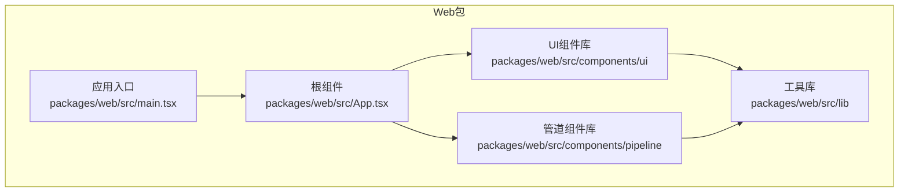
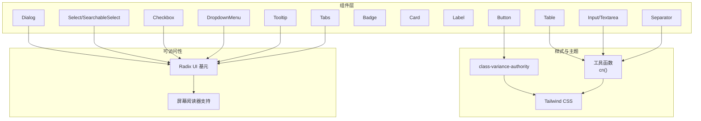
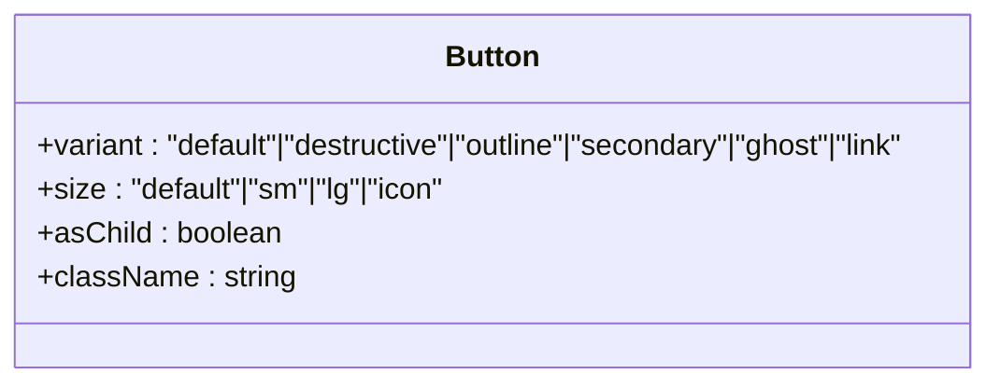
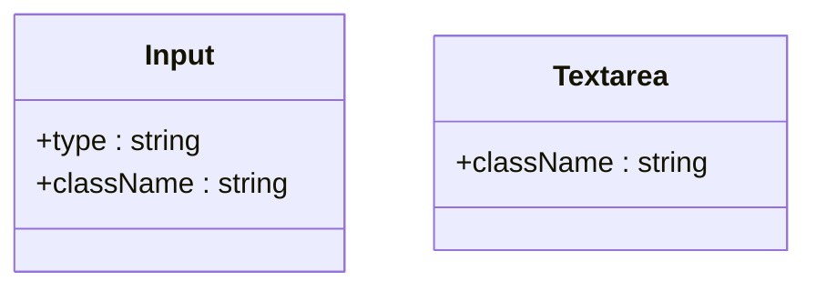
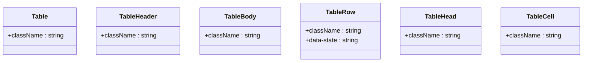
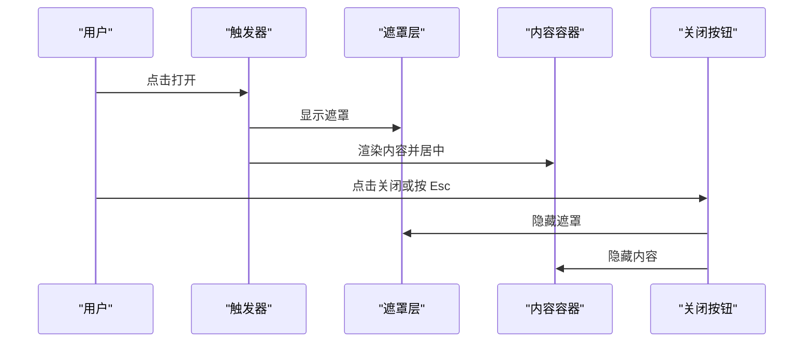
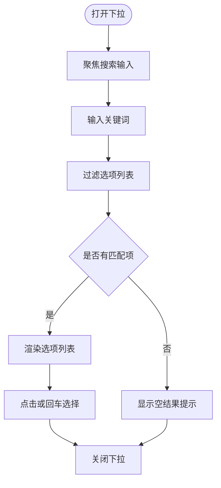
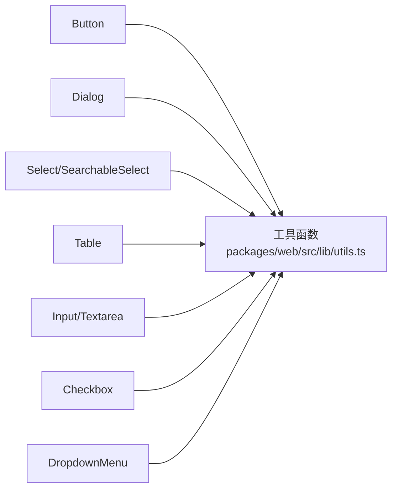

# UI组件库

<cite>
**本文引用的文件**
- [packages/web/src/components/ui/button.tsx](file://packages/web/src/components/ui/button.tsx)
- [packages/web/src/components/ui/input.tsx](file://packages/web/src/components/ui/input.tsx)
- [packages/web/src/components/ui/table.tsx](file://packages/web/src/components/ui/table.tsx)
- [packages/web/src/components/ui/dialog.tsx](file://packages/web/src/components/ui/dialog.tsx)
- [packages/web/src/components/ui/select.tsx](file://packages/web/src/components/ui/select.tsx)
- [packages/web/src/components/ui/searchable-select.tsx](file://packages/web/src/components/ui/searchable-select.tsx)
- [packages/web/src/components/ui/checkbox.tsx](file://packages/web/src/components/ui/checkbox.tsx)
- [packages/web/src/components/ui/badge.tsx](file://packages/web/src/components/ui/badge.tsx)
- [packages/web/src/components/ui/card.tsx](file://packages/web/src/components/ui/card.tsx)
- [packages/web/src/components/ui/textarea.tsx](file://packages/web/src/components/ui/textarea.tsx)
- [packages/web/src/components/ui/label.tsx](file://packages/web/src/components/ui/label.tsx)
- [packages/web/src/components/ui/dropdown-menu.tsx](file://packages/web/src/components/ui/dropdown-menu.tsx)
- [packages/web/src/components/ui/tooltip.tsx](file://packages/web/src/components/ui/tooltip.tsx)
- [packages/web/src/components/ui/tabs.tsx](file://packages/web/src/components/ui/tabs.tsx)
- [packages/web/src/components/ui/separator.tsx](file://packages/web/src/components/ui/separator.tsx)
- [packages/web/src/components/pipeline/PipelineView.tsx](file://packages/web/src/components/pipeline/PipelineView.tsx)
- [packages/web/src/components/pipeline/PipelineNode.tsx](file://packages/web/src/components/pipeline/PipelineNode.tsx)
- [packages/web/src/components/pipeline/PipelineConnector.tsx](file://packages/web/src/components/pipeline/PipelineConnector.tsx)
- [packages/web/src/components/pipeline/pipeline-utils.ts](file://packages/web/src/components/pipeline/pipeline-utils.ts)
- [packages/web/src/lib/utils.ts](file://packages/web/src/lib/utils.ts)
- [packages/web/src/main.tsx](file://packages/web/src/main.tsx)
- [packages/web/src/App.tsx](file://packages/web/src/App.tsx)
- [packages/web/src/index.css](file://packages/web/src/index.css)
- [packages/web/tailwind.config.ts](file://packages/web/tailwind.config.ts)
- [packages/web/postcss.config.js](file://packages/web/postcss.config.js)
- [packages/web/tsconfig.app.json](file://packages/web/tsconfig.app.json)
- [packages/web/vite.config.ts](file://packages/web/vite.config.ts)
- [package.json](file://package.json)
- [pnpm-workspace.yaml](file://pnpm-workspace.yaml)
</cite>

## 目录
1. [简介](#简介)
2. [项目结构](#项目结构)
3. [核心组件](#核心组件)
4. [架构总览](#架构总览)
5. [组件详解](#组件详解)
6. [依赖关系分析](#依赖关系分析)
7. [性能考量](#性能考量)
8. [故障排查指南](#故障排查指南)
9. [结论](#结论)
10. [附录](#附录)

## 简介
本文件为该项目前端UI组件库的技术文档，覆盖基础UI组件的设计原则、属性接口与使用示例，重点介绍按钮、输入框、表格、对话框、选择器等核心组件的功能特性与配置选项，并解释样式定制方案、主题适配与响应式设计实现。同时，文档涵盖事件处理机制、状态管理与无障碍访问支持，提供组件组合模式、性能优化策略与开发最佳实践。

## 项目结构
UI组件库位于 packages/web/src/components/ui 目录，采用“原子化组件 + 组合容器”的分层组织方式，配合 Tailwind CSS 提供的原子类与 class-variance-authority 实现变体风格，形成统一的视觉与交互语言。管道可视化组件位于 packages/web/src/components/pipeline，用于流程编排与节点交互。

图表来源
- [packages/web/src/main.tsx](file://packages/web/src/main.tsx)
- [packages/web/src/App.tsx](file://packages/web/src/App.tsx)
- [packages/web/src/components/ui/button.tsx](file://packages/web/src/components/ui/button.tsx)
- [packages/web/src/components/pipeline/PipelineView.tsx](file://packages/web/src/components/pipeline/PipelineView.tsx)

章节来源
- [packages/web/src/main.tsx](file://packages/web/src/main.tsx)
- [packages/web/src/App.tsx](file://packages/web/src/App.tsx)
- [packages/web/src/components/ui/button.tsx](file://packages/web/src/components/ui/button.tsx)
- [packages/web/src/components/pipeline/PipelineView.tsx](file://packages/web/src/components/pipeline/PipelineView.tsx)

## 核心组件
本节概述UI组件库中的关键组件及其职责与通用设计原则：
- 按钮 Button：提供多种视觉变体与尺寸，支持透传原生按钮属性与“asChild”渲染。
- 输入 Input/Textarea：提供基础输入与多行文本输入，统一焦点态与禁用态样式。
- 表格 Table：提供 Table/TableHeader/TableBody/TableRow/TableHead/TableCell 的组合，内置滚动容器与悬停态。
- 对话框 Dialog：基于 Radix UI 实现，提供 Overlay、Portal、Content、Header/Footer、Title/Description 等子组件。
- 选择器 Select/SearchableSelect：Select 提供受控/非受控选项，SearchableSelect 提供可搜索过滤与描述展示。
- 复选框 Checkbox：基于 Radix UI，提供受控状态与指示器。
- 徽章 Badge：用于标签化信息，支持多种语义变体。
- 卡片 Card：卡片容器，包含 Header/Title/Description/Content/Footer。
- 标签 Label：与表单控件配对使用，提供禁用态与可访问性支持。
- 下拉菜单 DropdownMenu：提供菜单、分组、子菜单、分隔符与插入缩进。
- 工具提示 Tooltip：提供轻量提示信息。
- 标签页 Tabs：提供标签页容器与项。
- 分隔线 Separator：提供水平/垂直分隔线。

章节来源
- [packages/web/src/components/ui/button.tsx](file://packages/web/src/components/ui/button.tsx)
- [packages/web/src/components/ui/input.tsx](file://packages/web/src/components/ui/input.tsx)
- [packages/web/src/components/ui/table.tsx](file://packages/web/src/components/ui/table.tsx)
- [packages/web/src/components/ui/dialog.tsx](file://packages/web/src/components/ui/dialog.tsx)
- [packages/web/src/components/ui/select.tsx](file://packages/web/src/components/ui/select.tsx)
- [packages/web/src/components/ui/searchable-select.tsx](file://packages/web/src/components/ui/searchable-select.tsx)
- [packages/web/src/components/ui/checkbox.tsx](file://packages/web/src/components/ui/checkbox.tsx)
- [packages/web/src/components/ui/badge.tsx](file://packages/web/src/components/ui/badge.tsx)
- [packages/web/src/components/ui/card.tsx](file://packages/web/src/components/ui/card.tsx)
- [packages/web/src/components/ui/textarea.tsx](file://packages/web/src/components/ui/textarea.tsx)
- [packages/web/src/components/ui/label.tsx](file://packages/web/src/components/ui/label.tsx)
- [packages/web/src/components/ui/dropdown-menu.tsx](file://packages/web/src/components/ui/dropdown-menu.tsx)
- [packages/web/src/components/ui/tooltip.tsx](file://packages/web/src/components/ui/tooltip.tsx)
- [packages/web/src/components/ui/tabs.tsx](file://packages/web/src/components/ui/tabs.tsx)
- [packages/web/src/components/ui/separator.tsx](file://packages/web/src/components/ui/separator.tsx)

## 架构总览
UI组件库遵循以下架构与设计原则：
- 基于 Radix UI 的可访问性与可组合性：通过原生语义与可访问属性保障键盘导航与屏幕阅读器支持。
- Tailwind 原子类与 class-variance-authority 变体：通过变体函数集中管理视觉状态，保证主题一致性。
- 组合优先：以小组件组合成容器组件，例如 Dialog/Select/Table 等。
- 透传与扩展：组件透传原生 HTML 属性，便于扩展与覆盖样式。
- 响应式与无障碍：统一的焦点环、禁用态与可访问性标签，确保跨设备与辅助技术可用。

图表来源
- [packages/web/src/components/ui/button.tsx](file://packages/web/src/components/ui/button.tsx)
- [packages/web/src/components/ui/dialog.tsx](file://packages/web/src/components/ui/dialog.tsx)
- [packages/web/src/components/ui/select.tsx](file://packages/web/src/components/ui/select.tsx)
- [packages/web/src/components/ui/table.tsx](file://packages/web/src/components/ui/table.tsx)
- [packages/web/src/components/ui/checkbox.tsx](file://packages/web/src/components/ui/checkbox.tsx)
- [packages/web/src/components/ui/dropdown-menu.tsx](file://packages/web/src/components/ui/dropdown-menu.tsx)
- [packages/web/src/components/ui/searchable-select.tsx](file://packages/web/src/components/ui/searchable-select.tsx)
- [packages/web/src/lib/utils.ts](file://packages/web/src/lib/utils.ts)

## 组件详解

### 按钮 Button
- 设计原则
  - 通过变体函数提供多种视觉风格与尺寸，支持禁用态与焦点态。
  - 支持 asChild 渲染，允许将按钮渲染为链接或其他元素。
- 关键属性
  - variant: default/destructive/outline/secondary/ghost/link
  - size: default/sm/lg/icon
  - asChild: 是否以子元素作为渲染根节点
  - 透传原生 button 属性（onClick、disabled、aria-* 等）
- 使用示例
  - 基础按钮：参考 [packages/web/src/components/ui/button.tsx](file://packages/web/src/components/ui/button.tsx)
  - 图标按钮：参考 [packages/web/src/components/ui/button.tsx](file://packages/web/src/components/ui/button.tsx)
- 样式定制
  - 通过变体函数与 Tailwind 类组合实现主题化，支持覆盖默认类名。
- 无障碍
  - 默认原生 button 语义，支持键盘激活与焦点环。

图表来源
- [packages/web/src/components/ui/button.tsx](file://packages/web/src/components/ui/button.tsx)

章节来源
- [packages/web/src/components/ui/button.tsx](file://packages/web/src/components/ui/button.tsx)

### 输入框 Input 与 Textarea
- 设计原则
  - 统一边框、内边距、占位符颜色与焦点态样式。
  - 支持禁用态与可访问性属性。
- 关键属性
  - Input: type、className、透传原生 input 属性
  - Textarea: className、透传原生 textarea 属性
- 使用示例
  - 基础输入：参考 [packages/web/src/components/ui/input.tsx](file://packages/web/src/components/ui/input.tsx)
  - 多行文本：参考 [packages/web/src/components/ui/textarea.tsx](file://packages/web/src/components/ui/textarea.tsx)
- 样式定制
  - 通过 className 覆盖默认样式，保持与主题一致。
- 无障碍
  - 与 Label 组合使用，提供关联的可访问名称。

图表来源
- [packages/web/src/components/ui/input.tsx](file://packages/web/src/components/ui/input.tsx)
- [packages/web/src/components/ui/textarea.tsx](file://packages/web/src/components/ui/textarea.tsx)

章节来源
- [packages/web/src/components/ui/input.tsx](file://packages/web/src/components/ui/input.tsx)
- [packages/web/src/components/ui/textarea.tsx](file://packages/web/src/components/ui/textarea.tsx)

### 表格 Table
- 设计原则
  - 提供 Table 容器与 TableHeader/TableBody/TableRow/TableHead/TableCell 组合。
  - 内置横向滚动容器，支持悬停态与选中态。
- 关键属性
  - Table: className、透传原生 table 属性
  - TableRow: className、data-state 与选择态
  - TableHead/TableCell: 对齐、内边距与可选复选框列宽处理
- 使用示例
  - 表格容器与滚动：参考 [packages/web/src/components/ui/table.tsx](file://packages/web/src/components/ui/table.tsx)
  - 表头与单元格：参考 [packages/web/src/components/ui/table.tsx](file://packages/web/src/components/ui/table.tsx)
- 样式定制
  - 通过 className 覆盖默认样式，保持与主题一致。
- 无障碍
  - 建议为表头添加 scope 与可访问名称，提升屏幕阅读器体验。

图表来源
- [packages/web/src/components/ui/table.tsx](file://packages/web/src/components/ui/table.tsx)

章节来源
- [packages/web/src/components/ui/table.tsx](file://packages/web/src/components/ui/table.tsx)

### 对话框 Dialog
- 设计原则
  - 基于 Radix UI，提供 Overlay、Portal、Content、Header/Footer、Title/Description 等子组件。
  - 支持键盘关闭（如 Escape）、点击遮罩关闭与动画过渡。
- 关键属性
  - DialogRoot/Trigger/Close/Portal：根组件、触发器与关闭器
  - DialogOverlay：遮罩层，支持开合动画
  - DialogContent：居中内容容器，支持定位与动画
  - DialogHeader/Footer：头部与底部布局
  - DialogTitle/DialogDescription：标题与描述
- 使用示例
  - 对话框容器与内容：参考 [packages/web/src/components/ui/dialog.tsx](file://packages/web/src/components/ui/dialog.tsx)
- 样式定制
  - 通过 className 覆盖默认样式，支持主题化尺寸与阴影。
- 无障碍
  - 自动管理焦点与隐藏背景，支持键盘导航与关闭。

图表来源
- [packages/web/src/components/ui/dialog.tsx](file://packages/web/src/components/ui/dialog.tsx)

章节来源
- [packages/web/src/components/ui/dialog.tsx](file://packages/web/src/components/ui/dialog.tsx)

### 选择器 Select 与 SearchableSelect
- 设计原则
  - Select：基于 Radix UI，提供触发器、内容、滚动按钮与选项项。
  - SearchableSelect：在 Select 基础上增加搜索输入与过滤逻辑，支持描述展示。
- 关键属性
  - SelectTrigger/SelectContent/SelectItem：触发器、内容与选项
  - SearchableSelect：value、onValueChange、options、placeholder、searchPlaceholder、emptyText
- 使用示例
  - Select 基础用法：参考 [packages/web/src/components/ui/select.tsx](file://packages/web/src/components/ui/select.tsx)
  - SearchableSelect：参考 [packages/web/src/components/ui/searchable-select.tsx](file://packages/web/src/components/ui/searchable-select.tsx)
- 样式定制
  - 通过 className 覆盖默认样式，支持主题化尺寸与滚动条。
- 无障碍
  - 选项具备可访问名称与选中指示，支持键盘导航与屏幕阅读器。

图表来源
- [packages/web/src/components/ui/searchable-select.tsx](file://packages/web/src/components/ui/searchable-select.tsx)

章节来源
- [packages/web/src/components/ui/select.tsx](file://packages/web/src/components/ui/select.tsx)
- [packages/web/src/components/ui/searchable-select.tsx](file://packages/web/src/components/ui/searchable-select.tsx)

### 复选框 Checkbox
- 设计原则
  - 基于 Radix UI，提供受控状态与指示器图标。
- 关键属性
  - className、受控 checked/disabled 状态
- 使用示例
  - 复选框：参考 [packages/web/src/components/ui/checkbox.tsx](file://packages/web/src/components/ui/checkbox.tsx)
- 样式定制
  - 通过 className 覆盖默认样式，支持主题化颜色与尺寸。
- 无障碍
  - 支持键盘切换与屏幕阅读器读取状态。

章节来源
- [packages/web/src/components/ui/checkbox.tsx](file://packages/web/src/components/ui/checkbox.tsx)

### 徽章 Badge
- 设计原则
  - 提供多种语义变体（默认/次要/破坏/描边/成功/警告）。
- 关键属性
  - variant: default/secondary/destructive/outline/success/warning
- 使用示例
  - 徽章：参考 [packages/web/src/components/ui/badge.tsx](file://packages/web/src/components/ui/badge.tsx)
- 样式定制
  - 通过变体函数与 Tailwind 类组合实现主题化。

章节来源
- [packages/web/src/components/ui/badge.tsx](file://packages/web/src/components/ui/badge.tsx)

### 卡片 Card
- 设计原则
  - 提供 Card/CardHeader/CardTitle/CardDescription/CardContent/CardFooter 组合。
- 关键属性
  - 透传 div/heading/paragraph 属性
- 使用示例
  - 卡片容器：参考 [packages/web/src/components/ui/card.tsx](file://packages/web/src/components/ui/card.tsx)
- 样式定制
  - 通过 className 覆盖默认样式，支持主题化阴影与边框。

章节来源
- [packages/web/src/components/ui/card.tsx](file://packages/web/src/components/ui/card.tsx)

### 标签 Label
- 设计原则
  - 与表单控件配对使用，提供禁用态与可访问性支持。
- 关键属性
  - className、透传原生 label 属性
- 使用示例
  - 标签：参考 [packages/web/src/components/ui/label.tsx](file://packages/web/src/components/ui/label.tsx)

章节来源
- [packages/web/src/components/ui/label.tsx](file://packages/web/src/components/ui/label.tsx)

### 下拉菜单 DropdownMenu
- 设计原则
  - 提供菜单、分组、子菜单、分隔符与插入缩进。
- 关键属性
  - DropdownMenuContent：侧偏移与动画
  - DropdownMenuItem：插入缩进 inset
  - DropdownMenuLabel：插入缩进 inset
- 使用示例
  - 下拉菜单：参考 [packages/web/src/components/ui/dropdown-menu.tsx](file://packages/web/src/components/ui/dropdown-menu.tsx)

章节来源
- [packages/web/src/components/ui/dropdown-menu.tsx](file://packages/web/src/components/ui/dropdown-menu.tsx)

### 工具提示 Tooltip
- 设计原则
  - 提供轻量提示信息，支持延迟与位置控制。
- 使用示例
  - 工具提示：参考 [packages/web/src/components/ui/tooltip.tsx](file://packages/web/src/components/ui/tooltip.tsx)

章节来源
- [packages/web/src/components/ui/tooltip.tsx](file://packages/web/src/components/ui/tooltip.tsx)

### 标签页 Tabs
- 设计原则
  - 提供标签页容器与项，支持内容切换。
- 使用示例
  - 标签页：参考 [packages/web/src/components/ui/tabs.tsx](file://packages/web/src/components/ui/tabs.tsx)

章节来源
- [packages/web/src/components/ui/tabs.tsx](file://packages/web/src/components/ui/tabs.tsx)

### 分隔线 Separator
- 设计原则
  - 提供水平/垂直分隔线，支持主题化颜色。
- 使用示例
  - 分隔线：参考 [packages/web/src/components/ui/separator.tsx](file://packages/web/src/components/ui/separator.tsx)

章节来源
- [packages/web/src/components/ui/separator.tsx](file://packages/web/src/components/ui/separator.tsx)

## 依赖关系分析
UI组件库与工具库、样式系统与构建配置之间的依赖关系如下：

图表来源
- [packages/web/src/lib/utils.ts](file://packages/web/src/lib/utils.ts)
- [packages/web/src/components/ui/button.tsx](file://packages/web/src/components/ui/button.tsx)
- [packages/web/src/components/ui/dialog.tsx](file://packages/web/src/components/ui/dialog.tsx)
- [packages/web/src/components/ui/select.tsx](file://packages/web/src/components/ui/select.tsx)
- [packages/web/src/components/ui/searchable-select.tsx](file://packages/web/src/components/ui/searchable-select.tsx)
- [packages/web/src/components/ui/table.tsx](file://packages/web/src/components/ui/table.tsx)
- [packages/web/src/components/ui/input.tsx](file://packages/web/src/components/ui/input.tsx)
- [packages/web/src/components/ui/textarea.tsx](file://packages/web/src/components/ui/textarea.tsx)
- [packages/web/src/components/ui/checkbox.tsx](file://packages/web/src/components/ui/checkbox.tsx)
- [packages/web/src/components/ui/dropdown-menu.tsx](file://packages/web/src/components/ui/dropdown-menu.tsx)

章节来源
- [packages/web/src/lib/utils.ts](file://packages/web/src/lib/utils.ts)
- [packages/web/src/components/ui/button.tsx](file://packages/web/src/components/ui/button.tsx)
- [packages/web/src/components/ui/dialog.tsx](file://packages/web/src/components/ui/dialog.tsx)
- [packages/web/src/components/ui/select.tsx](file://packages/web/src/components/ui/select.tsx)
- [packages/web/src/components/ui/searchable-select.tsx](file://packages/web/src/components/ui/searchable-select.tsx)
- [packages/web/src/components/ui/table.tsx](file://packages/web/src/components/ui/table.tsx)
- [packages/web/src/components/ui/input.tsx](file://packages/web/src/components/ui/input.tsx)
- [packages/web/src/components/ui/textarea.tsx](file://packages/web/src/components/ui/textarea.tsx)
- [packages/web/src/components/ui/checkbox.tsx](file://packages/web/src/components/ui/checkbox.tsx)
- [packages/web/src/components/ui/dropdown-menu.tsx](file://packages/web/src/components/ui/dropdown-menu.tsx)

## 性能考量
- 组件复用与最小化重绘
  - 使用透传属性与 className 覆盖减少不必要的包装层级。
  - 将高频更新的状态下沉至子组件，避免父组件整体重渲染。
- 动画与过渡
  - Dialog/Select/DropdownMenu 的动画通过 Radix UI 控制，建议在低端设备上谨慎使用复杂动画。
- 样式体积
  - Tailwind 原子类按需引入，避免全局样式污染；通过变体函数集中管理视觉状态，减少重复类名。
- 列表渲染
  - Table/Select/SearchableSelect 在大数据量时建议虚拟化或分页，避免一次性渲染过多节点。
- 事件处理
  - 使用 React.forwardRef 与透传属性，避免在事件处理器中创建新的函数对象，减少闭包开销。

## 故障排查指南
- 焦点与键盘导航
  - 若发现键盘无法激活或关闭，请检查是否正确使用了触发器与关闭器组件，并确保容器具有正确的可访问性属性。
- 样式冲突
  - 若出现样式异常，检查是否覆盖了关键类名或与第三方样式库发生冲突，建议使用 className 逐步定位。
- 动画卡顿
  - 若动画卡顿，尝试减少动画时长或移除复杂过渡效果，或在设备性能较低时禁用动画。
- 无障碍问题
  - 若屏幕阅读器无法读取内容，请为标题与描述添加可访问名称，并确保选项具备可访问文本。

## 结论
本UI组件库以 Radix UI 为基础，结合 Tailwind CSS 与 class-variance-authority，提供了统一、可组合、可访问的组件体系。通过清晰的属性接口、主题化与响应式设计，组件能够满足多样化的业务需求。建议在实际项目中遵循本文档的组合模式、性能优化策略与开发最佳实践，持续演进组件库以提升开发效率与用户体验。

## 附录
- 构建与配置
  - Vite 构建配置：参考 [packages/web/vite.config.ts](file://packages/web/vite.config.ts)
  - TypeScript 应用配置：参考 [packages/web/tsconfig.app.json](file://packages/web/tsconfig.app.json)
  - PostCSS 配置：参考 [packages/web/postcss.config.js](file://packages/web/postcss.config.js)
  - Tailwind 配置：参考 [packages/web/tailwind.config.ts](file://packages/web/tailwind.config.ts)
  - 根样式：参考 [packages/web/src/index.css](file://packages/web/src/index.css)
  - 工作空间：参考 [pnpm-workspace.yaml](file://pnpm-workspace.yaml)
  - 顶层脚本与依赖：参考 [package.json](file://package.json)