# 交互式组件

<cite>
**本文引用的文件**
- [packages/web/src/components/ui/button.tsx](file://packages/web/src/components/ui/button.tsx)
- [packages/web/src/components/ui/dialog.tsx](file://packages/web/src/components/ui/dialog.tsx)
- [packages/web/src/components/ui/tooltip.tsx](file://packages/web/src/components/ui/tooltip.tsx)
- [packages/web/src/components/ui/checkbox.tsx](file://packages/web/src/components/ui/checkbox.tsx)
- [packages/web/src/components/ui/select.tsx](file://packages/web/src/components/ui/select.tsx)
- [packages/web/src/components/ui/dropdown-menu.tsx](file://packages/web/src/components/ui/dropdown-menu.tsx)
- [packages/web/src/components/ui/tabs.tsx](file://packages/web/src/components/ui/tabs.tsx)
- [packages/web/src/components/ui/input.tsx](file://packages/web/src/components/ui/input.tsx)
- [packages/web/src/components/ui/searchable-select.tsx](file://packages/web/src/components/ui/searchable-select.tsx)
- [packages/web/src/lib/hooks.ts](file://packages/web/src/lib/hooks.ts)
</cite>

## 目录
1. [简介](#简介)
2. [项目结构](#项目结构)
3. [核心组件](#核心组件)
4. [架构总览](#架构总览)
5. [详细组件分析](#详细组件分析)
6. [依赖关系分析](#依赖关系分析)
7. [性能与内存优化](#性能与内存优化)
8. [可访问性与键盘交互](#可访问性与键盘交互)
9. [故障排查指南](#故障排查指南)
10. [结论](#结论)
11. [附录：常见交互场景与设计建议](#附录常见交互场景与设计建议)

## 简介
本技术文档聚焦于交互式组件的设计与实现，覆盖按钮、对话框、工具提示、复选框、选择器、下拉菜单、标签页、输入框以及可搜索选择器等。文档从事件处理机制、状态切换逻辑、用户反馈（动画与视觉）、可访问性支持（键盘与屏幕阅读器）到生命周期管理、内存优化与性能考量进行系统化阐述，并提供丰富的交互场景示例与用户体验设计建议。

## 项目结构
交互式组件主要位于 Web 包的 UI 组件目录中，采用“原子化 + 组合”的设计风格，使用 Radix UI 作为基础交互原语，结合 Tailwind CSS 类名与自定义动画类实现一致的视觉与交互体验；部分复杂组件通过 React 内置状态与副作用钩子实现交互逻辑。

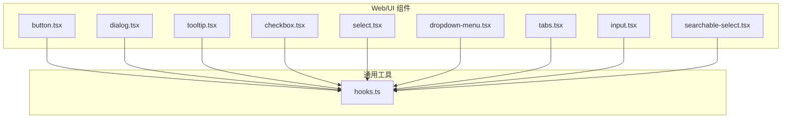

图示来源
- [packages/web/src/components/ui/button.tsx:1-47](file://packages/web/src/components/ui/button.tsx#L1-L47)
- [packages/web/src/components/ui/dialog.tsx:1-77](file://packages/web/src/components/ui/dialog.tsx#L1-L77)
- [packages/web/src/components/ui/tooltip.tsx:1-30](file://packages/web/src/components/ui/tooltip.tsx#L1-L30)
- [packages/web/src/components/ui/checkbox.tsx:1-26](file://packages/web/src/components/ui/checkbox.tsx#L1-L26)
- [packages/web/src/components/ui/select.tsx:1-84](file://packages/web/src/components/ui/select.tsx#L1-L84)
- [packages/web/src/components/ui/dropdown-menu.tsx:1-71](file://packages/web/src/components/ui/dropdown-menu.tsx#L1-L71)
- [packages/web/src/components/ui/tabs.tsx:1-47](file://packages/web/src/components/ui/tabs.tsx#L1-L47)
- [packages/web/src/components/ui/input.tsx:1-22](file://packages/web/src/components/ui/input.tsx#L1-L22)
- [packages/web/src/components/ui/searchable-select.tsx:1-132](file://packages/web/src/components/ui/searchable-select.tsx#L1-L132)
- [packages/web/src/lib/hooks.ts:1-29](file://packages/web/src/lib/hooks.ts#L1-L29)

章节来源
- [packages/web/src/components/ui/button.tsx:1-47](file://packages/web/src/components/ui/button.tsx#L1-L47)
- [packages/web/src/components/ui/dialog.tsx:1-77](file://packages/web/src/components/ui/dialog.tsx#L1-L77)
- [packages/web/src/components/ui/tooltip.tsx:1-30](file://packages/web/src/components/ui/tooltip.tsx#L1-L30)
- [packages/web/src/components/ui/checkbox.tsx:1-26](file://packages/web/src/components/ui/checkbox.tsx#L1-L26)
- [packages/web/src/components/ui/select.tsx:1-84](file://packages/web/src/components/ui/select.tsx#L1-L84)
- [packages/web/src/components/ui/dropdown-menu.tsx:1-71](file://packages/web/src/components/ui/dropdown-menu.tsx#L1-L71)
- [packages/web/src/components/ui/tabs.tsx:1-47](file://packages/web/src/components/ui/tabs.tsx#L1-L47)
- [packages/web/src/components/ui/input.tsx:1-22](file://packages/web/src/components/ui/input.tsx#L1-L22)
- [packages/web/src/components/ui/searchable-select.tsx:1-132](file://packages/web/src/components/ui/searchable-select.tsx#L1-L132)
- [packages/web/src/lib/hooks.ts:1-29](file://packages/web/src/lib/hooks.ts#L1-L29)

## 核心组件
- 按钮 Button：基于变体与尺寸的样式组合，支持透传 HTML 属性与“包裹子元素”模式，具备焦点可见性与禁用态样式。
- 对话框 Dialog：基于 Radix UI 的 Root/Trigger/Portal/Overlay/Content/Close/Title/Description 组合，内置开合动画与关闭按钮。
- 工具提示 Tooltip：基于 Tooltip Provider/Root/Trigger/Content，支持多方位定位与进入/退出动画。
- 复选框 Checkbox：基于 Radix UI Root，呈现勾选态与指示器，支持焦点环与禁用态。
- 选择器 Select：基于 Select Root/Trigger/Content/Viewport/Item 等，支持滚动按钮与多状态动画。
- 下拉菜单 Dropdown Menu：基于 Dropdown Root/Trigger/Content/Item/Separator/Label/Sub 等，支持嵌套与分组。
- 标签页 Tabs：基于 Tabs Root/List/Trigger/Content，支持激活态样式与焦点环。
- 输入框 Input：基础输入封装，统一边框、背景、占位符与焦点环样式。
- 可搜索选择器 SearchableSelect：自研组合组件，包含本地过滤、点击外部关闭、Esc 关闭、自动聚焦搜索输入等。

章节来源
- [packages/web/src/components/ui/button.tsx:32-47](file://packages/web/src/components/ui/button.tsx#L32-L47)
- [packages/web/src/components/ui/dialog.tsx:6-77](file://packages/web/src/components/ui/dialog.tsx#L6-L77)
- [packages/web/src/components/ui/tooltip.tsx:5-30](file://packages/web/src/components/ui/tooltip.tsx#L5-L30)
- [packages/web/src/components/ui/checkbox.tsx:6-26](file://packages/web/src/components/ui/checkbox.tsx#L6-L26)
- [packages/web/src/components/ui/select.tsx:6-84](file://packages/web/src/components/ui/select.tsx#L6-L84)
- [packages/web/src/components/ui/dropdown-menu.tsx:6-71](file://packages/web/src/components/ui/dropdown-menu.tsx#L6-L71)
- [packages/web/src/components/ui/tabs.tsx:5-47](file://packages/web/src/components/ui/tabs.tsx#L5-L47)
- [packages/web/src/components/ui/input.tsx:4-22](file://packages/web/src/components/ui/input.tsx#L4-L22)
- [packages/web/src/components/ui/searchable-select.tsx:11-132](file://packages/web/src/components/ui/searchable-select.tsx#L11-L132)

## 架构总览
交互式组件遵循“原语 + 组合 + 动画 + 可访问性”的统一架构：
- 原语层：Radix UI 提供可访问性与状态机能力（如 open/closed、active、checked 等）。
- 组合层：以 forwardRef/Slot/Portal 等组合原语，形成复合 UI。
- 动画层：通过 data-[state=...] 与动画类实现开合、淡入淡出、缩放与滑入滑出。
- 可访问性层：统一的焦点环、禁用态、键盘操作与 sr-only 文本支持。

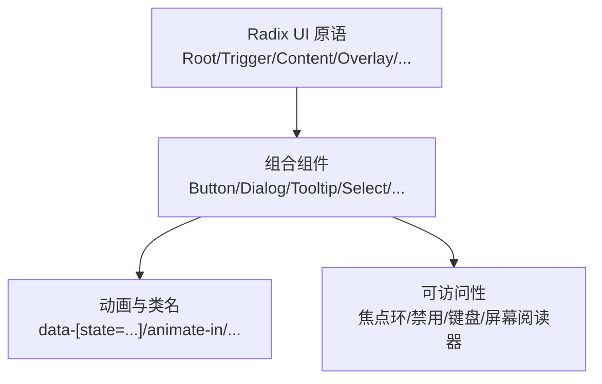

图示来源
- [packages/web/src/components/ui/dialog.tsx:11-47](file://packages/web/src/components/ui/dialog.tsx#L11-L47)
- [packages/web/src/components/ui/tooltip.tsx:11-26](file://packages/web/src/components/ui/tooltip.tsx#L11-L26)
- [packages/web/src/components/ui/select.tsx:30-58](file://packages/web/src/components/ui/select.tsx#L30-L58)
- [packages/web/src/components/ui/dropdown-menu.tsx:11-27](file://packages/web/src/components/ui/dropdown-menu.tsx#L11-L27)

## 详细组件分析

### 按钮 Button
- 设计要点
  - 使用变体与尺寸的样式工厂生成不同外观与尺寸。
  - 支持 asChild 以 Slot 包裹子元素，便于与路由或链接组合。
  - 统一的焦点可见性与禁用态样式，保证可访问性。
- 事件与状态
  - 透传原生 button 属性，交由父级处理 onClick 等事件。
  - 禁用态通过 pointer-events:none 与不透明度控制。
- 视觉反馈
  - hover/active/focus-ring 通过过渡类与 ring-offset 背景实现。
- 性能与内存
  - 无内部状态，纯展示组件，渲染成本低。

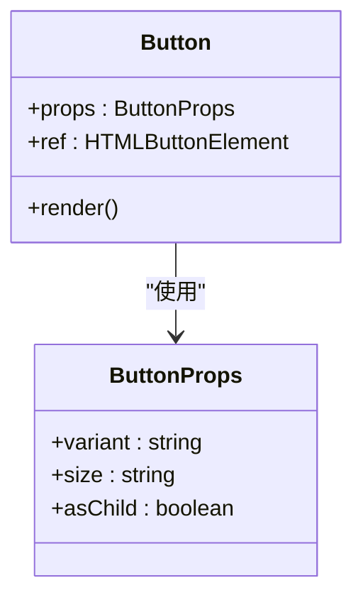

图示来源
- [packages/web/src/components/ui/button.tsx:32-47](file://packages/web/src/components/ui/button.tsx#L32-L47)

章节来源
- [packages/web/src/components/ui/button.tsx:6-47](file://packages/web/src/components/ui/button.tsx#L6-L47)

### 对话框 Dialog
- 设计要点
  - Portal 将内容挂载到全局，Overlay 提供遮罩与动画。
  - Content 固定居中并带缩放/滑入/淡入等动画。
  - Close 按钮带有 sr-only 文本，确保可访问性。
- 事件与状态
  - 基于 Radix UI 的 open/closed 状态驱动动画。
  - 支持 Esc 关闭（由上层触发），点击 Overlay 或 Close 可关闭。
- 视觉反馈
  - data-[state=...] 控制进入/退出动画序列，含 fade/zoom/slide 组合。
- 性能与内存
  - Portal 避免 DOM 结构复杂度上升；动画类为轻量 CSS 过渡。

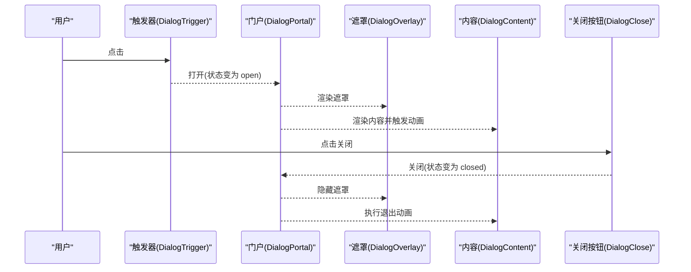

图示来源
- [packages/web/src/components/ui/dialog.tsx:6-47](file://packages/web/src/components/ui/dialog.tsx#L6-L47)

章节来源
- [packages/web/src/components/ui/dialog.tsx:6-77](file://packages/web/src/components/ui/dialog.tsx#L6-L77)

### 工具提示 Tooltip
- 设计要点
  - Provider 包裹上下文，Root/Trigger/Content 组合实现显示/隐藏。
  - Portal 渲染至全局，避免层级截断。
- 事件与状态
  - 基于 open/closed 状态与 sideOffset 定位。
  - 支持多方向 slide-in-from-* 动画。
- 视觉反馈
  - data-[state=...] 控制进入/退出动画，配合缩放与淡入淡出。

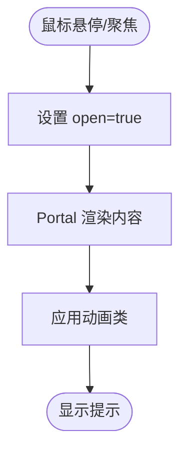

图示来源
- [packages/web/src/components/ui/tooltip.tsx:11-26](file://packages/web/src/components/ui/tooltip.tsx#L11-L26)

章节来源
- [packages/web/src/components/ui/tooltip.tsx:5-30](file://packages/web/src/components/ui/tooltip.tsx#L5-L30)

### 复选框 Checkbox
- 设计要点
  - 基于 Radix UI Root，Indicator 显示勾选图标。
  - data-[state=checked] 控制背景色与文本色。
- 事件与状态
  - 通过受控/非受控属性与父级 onChange 同步 checked 状态。
- 视觉反馈
  - 焦点环与禁用态通过 ring-offset 与 opacity 实现。

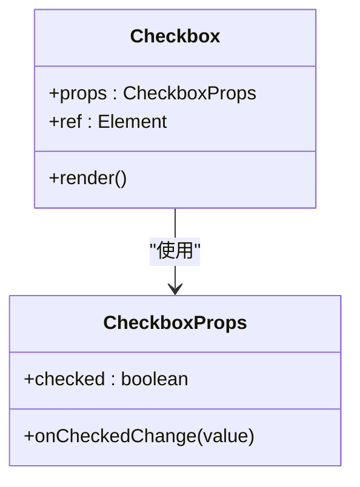

图示来源
- [packages/web/src/components/ui/checkbox.tsx:6-23](file://packages/web/src/components/ui/checkbox.tsx#L6-L23)

章节来源
- [packages/web/src/components/ui/checkbox.tsx:1-26](file://packages/web/src/components/ui/checkbox.tsx#L1-L26)

### 选择器 Select
- 设计要点
  - Trigger 统一样式与焦点环；Content 支持 popper 位置微调。
  - Viewport 内部滚动按钮与可视区域高度绑定。
- 事件与状态
  - Item 的 selected 与 disabled 状态通过 data-* 控制。
- 视觉反馈
  - 动画类组合 fade/zoom/slide，提升打开/关闭的自然感。

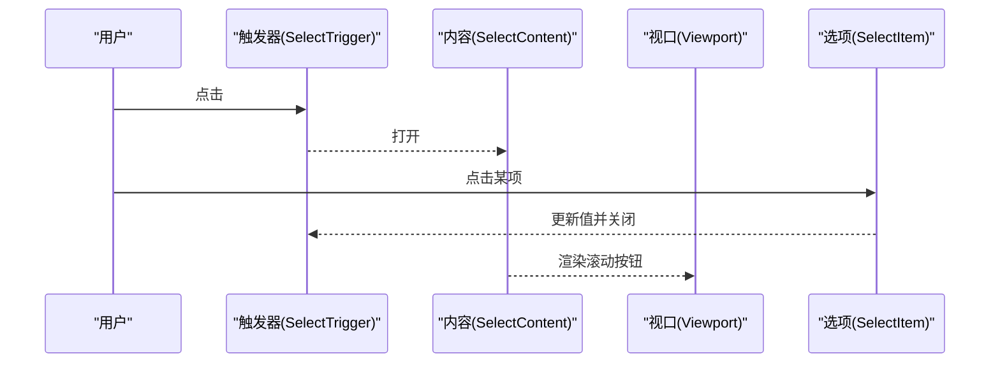

图示来源
- [packages/web/src/components/ui/select.tsx:10-58](file://packages/web/src/components/ui/select.tsx#L10-L58)

章节来源
- [packages/web/src/components/ui/select.tsx:1-84](file://packages/web/src/components/ui/select.tsx#L1-L84)

### 下拉菜单 Dropdown Menu
- 设计要点
  - 支持分组、标签、分隔线与子菜单。
  - Item 支持 inset 嵌套样式，Label 支持 inset 标题样式。
- 事件与状态
  - 基于 open/closed 状态与侧向 slide 动画。
- 视觉反馈
  - 统一的 hover/focus 背景色与禁用态透明度。

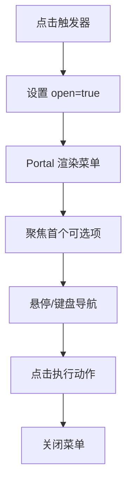

图示来源
- [packages/web/src/components/ui/dropdown-menu.tsx:11-43](file://packages/web/src/components/ui/dropdown-menu.tsx#L11-L43)

章节来源
- [packages/web/src/components/ui/dropdown-menu.tsx:1-71](file://packages/web/src/components/ui/dropdown-menu.tsx#L1-L71)

### 标签页 Tabs
- 设计要点
  - List/Trigger/Content 组合，Trigger 在激活态显示强调样式。
- 事件与状态
  - 通过 active 状态切换内容面板。
- 视觉反馈
  - 激活态阴影与文字颜色变化，配合焦点环。

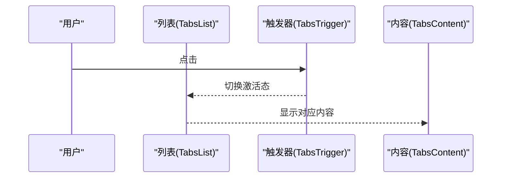

图示来源
- [packages/web/src/components/ui/tabs.tsx:19-44](file://packages/web/src/components/ui/tabs.tsx#L19-L44)

章节来源
- [packages/web/src/components/ui/tabs.tsx:1-47](file://packages/web/src/components/ui/tabs.tsx#L1-L47)

### 输入框 Input
- 设计要点
  - 统一样式、占位符、焦点环与禁用态。
- 事件与状态
  - 透传原生 input 属性，交由父级处理 onChange/onBlur 等。
- 视觉反馈
  - ring-offset 与 ring-* 类实现清晰的焦点反馈。

章节来源
- [packages/web/src/components/ui/input.tsx:1-22](file://packages/web/src/components/ui/input.tsx#L1-L22)

### 可搜索选择器 SearchableSelect
- 设计要点
  - 自研组合组件，包含本地过滤、点击外部关闭、Esc 关闭、自动聚焦搜索输入。
- 事件与状态
  - open/query/value 三状态驱动 UI；过滤逻辑基于 label/description。
- 生命周期与副作用
  - 打开时监听 mousedown 关闭；打开后异步聚焦搜索输入；Esc 关闭。
- 视觉反馈
  - 下拉区域带淡入与缩放动画；选中项高亮。

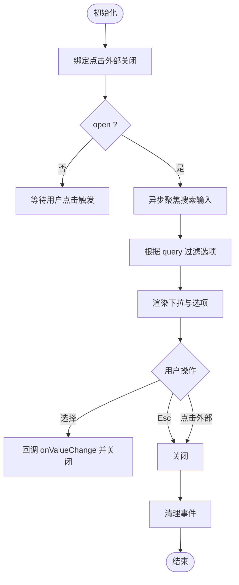

图示来源
- [packages/web/src/components/ui/searchable-select.tsx:35-59](file://packages/web/src/components/ui/searchable-select.tsx#L35-L59)
- [packages/web/src/components/ui/searchable-select.tsx:61-131](file://packages/web/src/components/ui/searchable-select.tsx#L61-L131)

章节来源
- [packages/web/src/components/ui/searchable-select.tsx:1-132](file://packages/web/src/components/ui/searchable-select.tsx#L1-L132)

## 依赖关系分析
- 组件间耦合
  - 复杂组件（Dialog/Tooltip/Select/Dropdown/Tabs）均依赖 Radix UI 原语，保持一致的状态机与可访问性。
  - 简单组件（Button/Input）仅依赖样式与透传属性，耦合度低。
- 外部依赖
  - Radix UI：提供可访问性与状态机。
  - Lucide React：提供图标。
  - class-variance-authority：提供变体样式工厂。
  - Tailwind CSS：提供原子化样式与动画类。
- 潜在循环依赖
  - 当前 UI 组件之间无直接相互导入，不存在循环依赖风险。

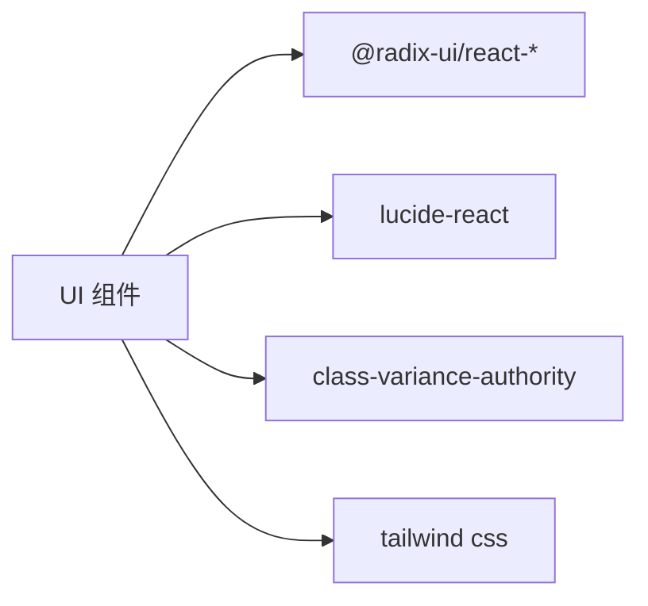

图示来源
- [packages/web/src/components/ui/dialog.tsx:1-4](file://packages/web/src/components/ui/dialog.tsx#L1-L4)
- [packages/web/src/components/ui/select.tsx:1-4](file://packages/web/src/components/ui/select.tsx#L1-L4)
- [packages/web/src/components/ui/button.tsx:1-4](file://packages/web/src/components/ui/button.tsx#L1-L4)

章节来源
- [packages/web/src/components/ui/dialog.tsx:1-77](file://packages/web/src/components/ui/dialog.tsx#L1-L77)
- [packages/web/src/components/ui/select.tsx:1-84](file://packages/web/src/components/ui/select.tsx#L1-L84)
- [packages/web/src/components/ui/button.tsx:1-47](file://packages/web/src/components/ui/button.tsx#L1-L47)

## 性能与内存优化
- 渲染路径
  - 纯展示组件（Button/Input）避免内部状态，减少重渲染。
  - 复杂组件（Dialog/Tooltip/Select/Dropdown/Tabs）通过 Portal 减少 DOM 深度，降低布局抖动。
- 动画与过渡
  - 使用 CSS 动画类而非 JavaScript 动画，避免主线程阻塞。
  - data-[state=...] 驱动的动画类，按需启用，避免不必要的计算。
- 状态与副作用
  - SearchableSelect 在打开时才挂载外部点击监听与聚焦逻辑，关闭时清理，避免常驻监听。
- Hook 使用
  - useAsync 提供加载/错误/数据三态与 refetch 能力，避免重复请求与未处理异常导致的内存泄漏。

章节来源
- [packages/web/src/components/ui/searchable-select.tsx:35-59](file://packages/web/src/components/ui/searchable-select.tsx#L35-L59)
- [packages/web/src/lib/hooks.ts:5-28](file://packages/web/src/lib/hooks.ts#L5-L28)

## 可访问性与键盘交互
- 焦点管理
  - 统一使用 focus-visible ring-* 类，确保键盘可达。
  - Dialog/Tooltip/Select/Dropdown/Tabs 在打开时将焦点移动到可交互元素。
- 键盘快捷键
  - Select/Dialog/Tooltip：Esc 关闭或取消。
  - SearchableSelect：Esc 关闭；Enter/Tab 导航与选择（由父级处理）。
  - Tabs：ArrowLeft/ArrowRight 切换标签。
- 屏幕阅读器
  - Close 按钮包含 sr-only 文本，确保读屏用户理解“关闭”含义。
  - Select/Checkbox/Dialog 等使用原生语义与 aria-* 属性，由 Radix UI 提供可访问性保障。
- 禁用态与对比度
  - 禁用态通过 pointer-events:none 与 opacity 降低，保证视觉一致性与对比度。

章节来源
- [packages/web/src/components/ui/dialog.tsx:40-44](file://packages/web/src/components/ui/dialog.tsx#L40-L44)
- [packages/web/src/components/ui/select.tsx:30-58](file://packages/web/src/components/ui/select.tsx#L30-L58)
- [packages/web/src/components/ui/tabs.tsx:19-32](file://packages/web/src/components/ui/tabs.tsx#L19-L32)
- [packages/web/src/components/ui/searchable-select.tsx:56-60](file://packages/web/src/components/ui/searchable-select.tsx#L56-L60)

## 故障排查指南
- 对话框无法关闭
  - 检查是否正确使用 DialogTrigger/DialogClose/Portal；确认状态切换逻辑。
  - 确认 Overlay/Close 是否被其他元素遮挡。
- 工具提示不显示
  - 确认 TooltipProvider 包裹范围；检查 Trigger 是否处于可见区域。
  - 确认 Portal 是否渲染到正确容器。
- 选择器滚动异常
  - 检查 Viewport 尺寸与 popper 位置；确认 ScrollUpButton/ScrollDownButton 是否可见。
- 下拉菜单层级问题
  - 确认 Portal 层级高于页面内容；必要时调整 z-index。
- 标签页切换无效
  - 检查 TabsTrigger 的 value 与 TabsContent 的 value 是否匹配。
- 输入框焦点丢失
  - 检查父级重渲染导致的 ref 失效；必要时使用稳定引用。
- 可搜索选择器无法过滤
  - 检查 options 数据结构与过滤条件；确认 query 是否更新。
- 异步加载错误
  - 使用 useAsync 的 error 字段捕获异常；确保 refetch 正确触发。

章节来源
- [packages/web/src/components/ui/dialog.tsx:6-77](file://packages/web/src/components/ui/dialog.tsx#L6-L77)
- [packages/web/src/components/ui/tooltip.tsx:5-30](file://packages/web/src/components/ui/tooltip.tsx#L5-L30)
- [packages/web/src/components/ui/select.tsx:30-58](file://packages/web/src/components/ui/select.tsx#L30-L58)
- [packages/web/src/components/ui/dropdown-menu.tsx:11-43](file://packages/web/src/components/ui/dropdown-menu.tsx#L11-L43)
- [packages/web/src/components/ui/tabs.tsx:19-44](file://packages/web/src/components/ui/tabs.tsx#L19-L44)
- [packages/web/src/components/ui/searchable-select.tsx:61-131](file://packages/web/src/components/ui/searchable-select.tsx#L61-L131)
- [packages/web/src/lib/hooks.ts:5-28](file://packages/web/src/lib/hooks.ts#L5-L28)

## 结论
本项目交互式组件以 Radix UI 为基础，结合 Tailwind CSS 与动画类，实现了高可访问性、一致的视觉与交互体验。复杂组件通过最小化的状态与副作用实现稳定运行，简单组件保持低耦合与高性能。建议在业务层补充键盘快捷键与国际化文案，进一步完善无障碍与全球化支持。

## 附录：常见交互场景与设计建议
- 按钮
  - 场景：主操作、危险操作、次级操作、链接式按钮。
  - 建议：区分 destructive 与 primary；在长流程中提供 loading 状态。
- 对话框
  - 场景：确认对话、表单弹窗、信息展示。
  - 建议：提供 Footer 操作区；确保 Esc 与点击 Overlay 关闭。
- 工具提示
  - 场景：图标说明、快捷键提示、辅助信息。
  - 建议：限制文本长度；避免遮挡主要内容。
- 复选框
  - 场景：批量选择、同意协议、偏好设置。
  - 建议：提供全选/反选；在表单中提供校验反馈。
- 选择器
  - 场景：单选、多选、分组选项。
  - 建议：提供清空与全选；对长列表使用虚拟滚动。
- 下拉菜单
  - 场景：操作菜单、设置项、分组导航。
  - 建议：支持键盘导航；避免过宽导致溢出。
- 标签页
  - 场景：分步骤流程、分类内容、设置面板。
  - 建议：固定激活态样式；避免内容高度差异过大。
- 输入框
  - 场景：搜索、表单、数值输入。
  - 建议：提供占位符与字数限制；在错误时给出明确提示。
- 可搜索选择器
  - 场景：远程搜索、本地过滤、多字段筛选。
  - 建议：提供空状态文案；优化过滤算法与防抖。