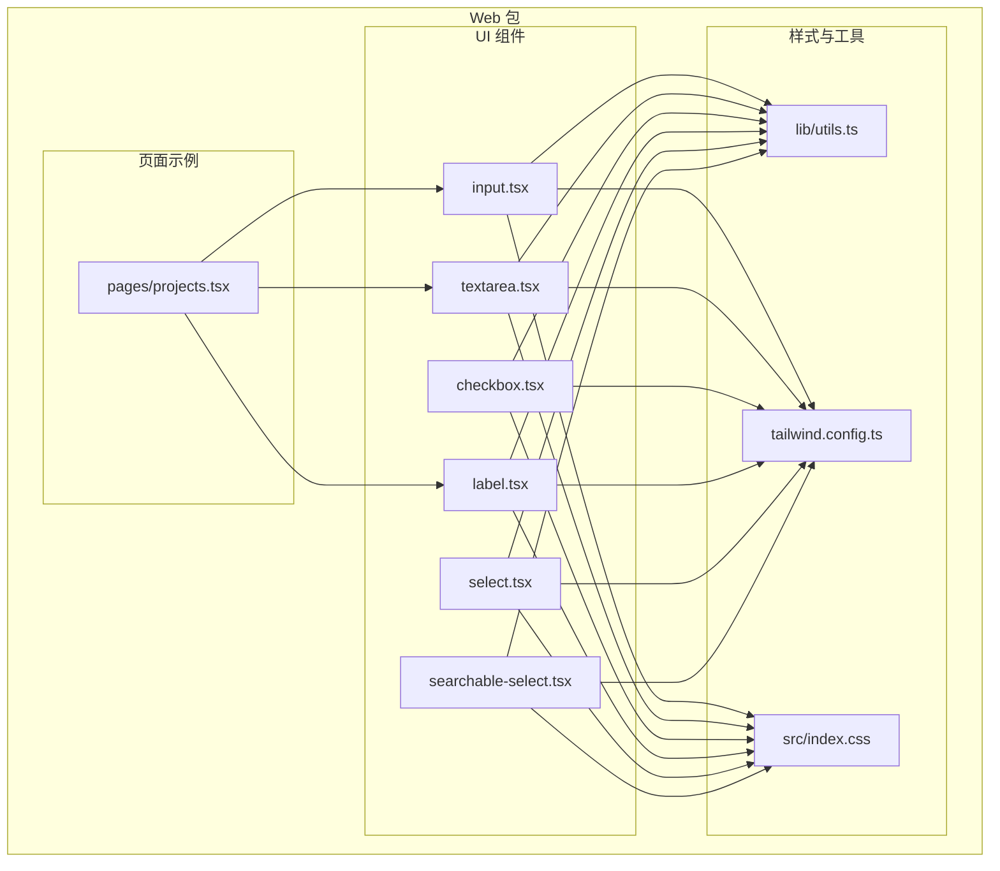
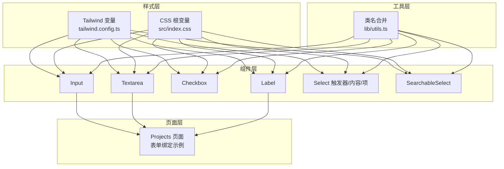
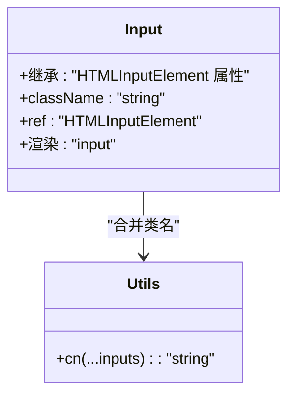
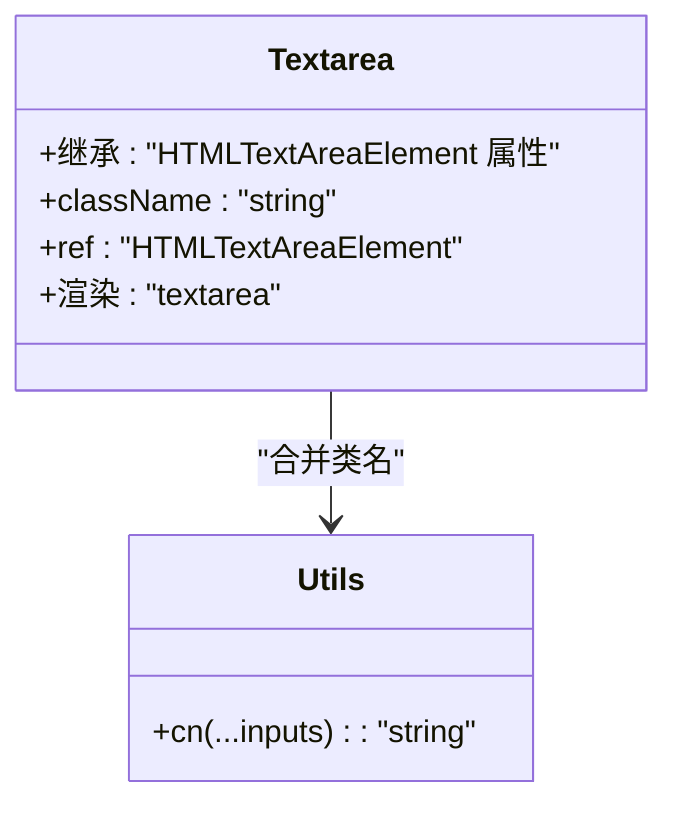
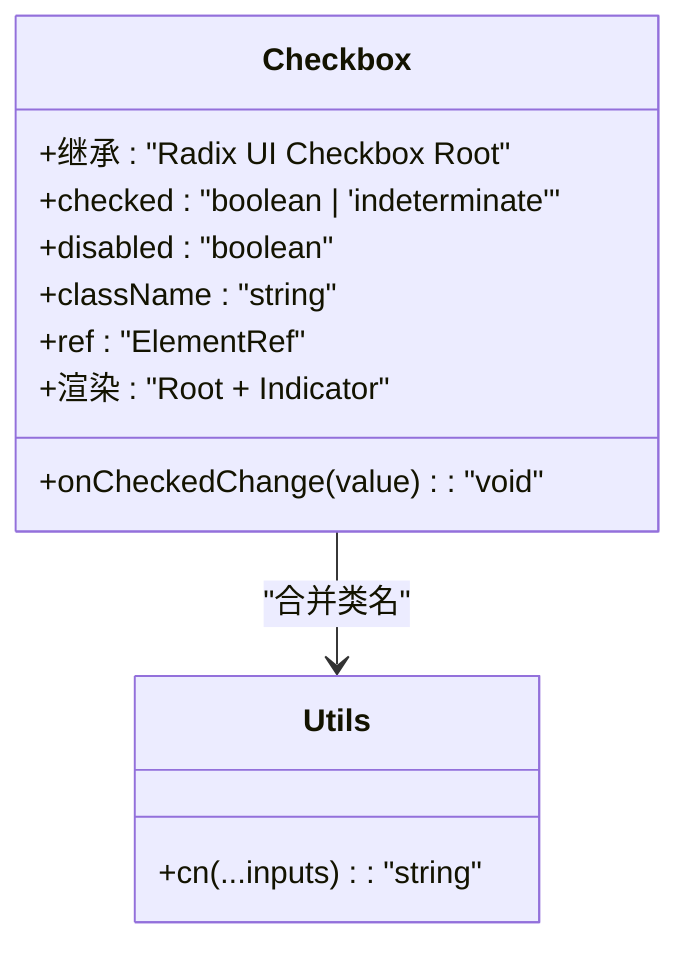
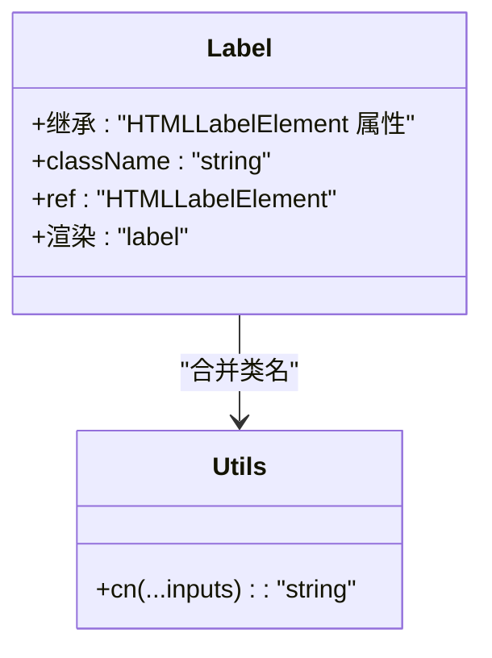
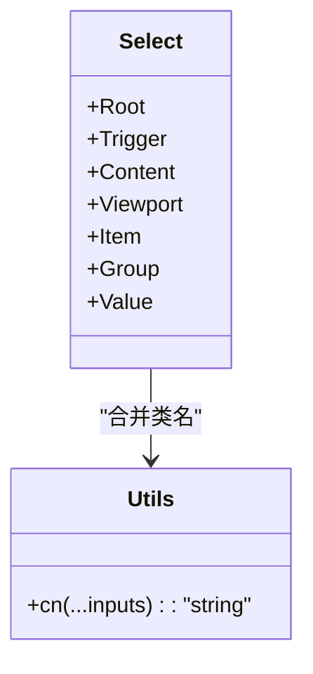
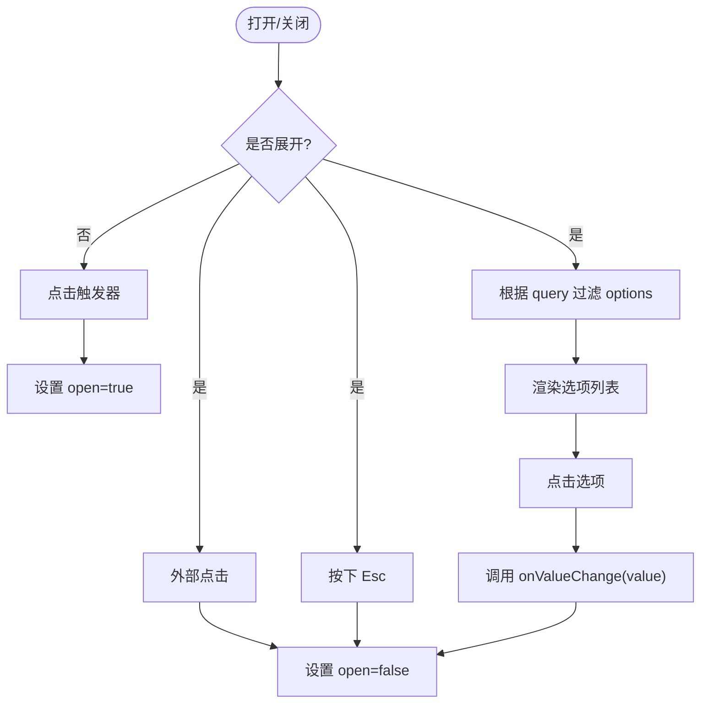
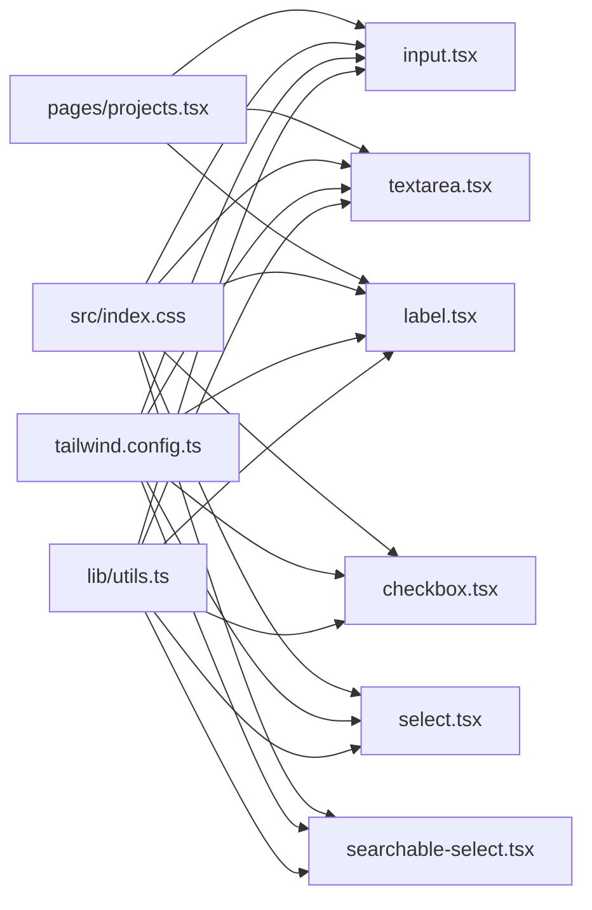

# 基础表单控件

<cite>
**本文引用的文件**
- [packages/web/src/components/ui/input.tsx](file://packages/web/src/components/ui/input.tsx)
- [packages/web/src/components/ui/textarea.tsx](file://packages/web/src/components/ui/textarea.tsx)
- [packages/web/src/components/ui/checkbox.tsx](file://packages/web/src/components/ui/checkbox.tsx)
- [packages/web/src/components/ui/label.tsx](file://packages/web/src/components/ui/label.tsx)
- [packages/web/src/components/ui/select.tsx](file://packages/web/src/components/ui/select.tsx)
- [packages/web/src/components/ui/searchable-select.tsx](file://packages/web/src/components/ui/searchable-select.tsx)
- [packages/web/src/lib/utils.ts](file://packages/web/src/lib/utils.ts)
- [packages/web/tailwind.config.ts](file://packages/web/tailwind.config.ts)
- [packages/web/src/index.css](file://packages/web/src/index.css)
- [packages/web/src/pages/projects.tsx](file://packages/web/src/pages/projects.tsx)
- [packages/web/src/lib/hooks.ts](file://packages/web/src/lib/hooks.ts)
</cite>

## 目录
1. [简介](#简介)
2. [项目结构](#项目结构)
3. [核心组件](#核心组件)
4. [架构总览](#架构总览)
5. [组件详解](#组件详解)
6. [依赖关系分析](#依赖关系分析)
7. [性能考量](#性能考量)
8. [故障排查指南](#故障排查指南)
9. [结论](#结论)
10. [附录](#附录)

## 简介
本文件面向基础表单控件（输入框、文本域、复选框、标签、可搜索选择器）的技术文档，系统阐述其设计原理、属性接口、状态管理、事件处理与数据绑定方式，并覆盖样式定制、主题适配与无障碍支持。同时给出与表单验证、错误状态显示及用户交互反馈的最佳实践与典型使用模式。

## 项目结构
基础表单控件位于 Web 包的 UI 组件目录中，采用按需组合与原子化样式设计，配合 Tailwind CSS 变量与暗色模式支持，形成统一的主题体系与可扩展的样式定制能力。

**图表来源**
- [packages/web/src/components/ui/input.tsx:1-22](file://packages/web/src/components/ui/input.tsx#L1-L22)
- [packages/web/src/components/ui/textarea.tsx:1-21](file://packages/web/src/components/ui/textarea.tsx#L1-L21)
- [packages/web/src/components/ui/checkbox.tsx:1-26](file://packages/web/src/components/ui/checkbox.tsx#L1-L26)
- [packages/web/src/components/ui/label.tsx:1-16](file://packages/web/src/components/ui/label.tsx#L1-L16)
- [packages/web/src/components/ui/select.tsx:1-84](file://packages/web/src/components/ui/select.tsx#L1-L84)
- [packages/web/src/components/ui/searchable-select.tsx:1-132](file://packages/web/src/components/ui/searchable-select.tsx#L1-L132)
- [packages/web/src/lib/utils.ts:1-7](file://packages/web/src/lib/utils.ts#L1-L7)
- [packages/web/tailwind.config.ts:1-92](file://packages/web/tailwind.config.ts#L1-L92)
- [packages/web/src/index.css:1-69](file://packages/web/src/index.css#L1-L69)
- [packages/web/src/pages/projects.tsx:1-171](file://packages/web/src/pages/projects.tsx#L1-L171)

**章节来源**
- [packages/web/src/components/ui/input.tsx:1-22](file://packages/web/src/components/ui/input.tsx#L1-L22)
- [packages/web/src/components/ui/textarea.tsx:1-21](file://packages/web/src/components/ui/textarea.tsx#L1-L21)
- [packages/web/src/components/ui/checkbox.tsx:1-26](file://packages/web/src/components/ui/checkbox.tsx#L1-L26)
- [packages/web/src/components/ui/label.tsx:1-16](file://packages/web/src/components/ui/label.tsx#L1-L16)
- [packages/web/src/components/ui/select.tsx:1-84](file://packages/web/src/components/ui/select.tsx#L1-L84)
- [packages/web/src/components/ui/searchable-select.tsx:1-132](file://packages/web/src/components/ui/searchable-select.tsx#L1-L132)
- [packages/web/src/lib/utils.ts:1-7](file://packages/web/src/lib/utils.ts#L1-L7)
- [packages/web/tailwind.config.ts:1-92](file://packages/web/tailwind.config.ts#L1-L92)
- [packages/web/src/index.css:1-69](file://packages/web/src/index.css#L1-L69)
- [packages/web/src/pages/projects.tsx:1-171](file://packages/web/src/pages/projects.tsx#L1-L171)

## 核心组件
- 输入框：用于接收单行文本输入，支持类型、禁用、占位符等原生属性透传，具备聚焦态与禁用态视觉反馈。
- 文本域：用于多行文本输入，支持最小高度、禁用、占位符等原生属性透传，具备聚焦态与禁用态视觉反馈。
- 复选框：基于 Radix UI 的语义化复选框，支持受控/非受控状态切换、禁用、指示器图标，具备聚焦态与选中态视觉反馈。
- 标签：用于为表单控件提供可点击的关联标签，支持禁用态样式与 peer 选择器联动。
- 选择器：基于 Radix UI 的下拉选择容器，包含触发器、内容区、滚动按钮、选项项等子组件，支持弹出动画与定位。
- 可搜索选择器：自定义实现的可搜索下拉选择器，支持查询过滤、空结果提示、焦点管理与外部点击关闭。

**章节来源**
- [packages/web/src/components/ui/input.tsx:1-22](file://packages/web/src/components/ui/input.tsx#L1-L22)
- [packages/web/src/components/ui/textarea.tsx:1-21](file://packages/web/src/components/ui/textarea.tsx#L1-L21)
- [packages/web/src/components/ui/checkbox.tsx:1-26](file://packages/web/src/components/ui/checkbox.tsx#L1-L26)
- [packages/web/src/components/ui/label.tsx:1-16](file://packages/web/src/components/ui/label.tsx#L1-L16)
- [packages/web/src/components/ui/select.tsx:1-84](file://packages/web/src/components/ui/select.tsx#L1-L84)
- [packages/web/src/components/ui/searchable-select.tsx:1-132](file://packages/web/src/components/ui/searchable-select.tsx#L1-L132)

## 架构总览
基础表单控件遵循“原子化样式 + 主题变量 + 动画过渡”的设计思路，通过工具函数合并类名，借助 Tailwind CSS 变量与暗色模式类，实现跨组件一致的外观与交互体验；页面层通过受控状态与事件回调完成数据绑定与交互反馈。

**图表来源**
- [packages/web/tailwind.config.ts:1-92](file://packages/web/tailwind.config.ts#L1-L92)
- [packages/web/src/index.css:1-69](file://packages/web/src/index.css#L1-L69)
- [packages/web/src/lib/utils.ts:1-7](file://packages/web/src/lib/utils.ts#L1-L7)
- [packages/web/src/components/ui/input.tsx:1-22](file://packages/web/src/components/ui/input.tsx#L1-L22)
- [packages/web/src/components/ui/textarea.tsx:1-21](file://packages/web/src/components/ui/textarea.tsx#L1-L21)
- [packages/web/src/components/ui/checkbox.tsx:1-26](file://packages/web/src/components/ui/checkbox.tsx#L1-L26)
- [packages/web/src/components/ui/label.tsx:1-16](file://packages/web/src/components/ui/label.tsx#L1-L16)
- [packages/web/src/components/ui/select.tsx:1-84](file://packages/web/src/components/ui/select.tsx#L1-L84)
- [packages/web/src/components/ui/searchable-select.tsx:1-132](file://packages/web/src/components/ui/searchable-select.tsx#L1-L132)
- [packages/web/src/pages/projects.tsx:1-171](file://packages/web/src/pages/projects.tsx#L1-L171)

## 组件详解

### 输入框（Input）
- 设计要点
  - 使用 forwardRef 暴露 DOM 引用，支持原生 input 属性透传。
  - 聚焦态添加环形高亮边框与偏移动画，禁用态调整光标与透明度。
  - 通过工具函数合并用户自定义样式，确保与主题变量一致。
- 属性接口
  - 继承原生 HTMLInputElement 属性，如 type、placeholder、disabled、value 等。
  - 支持 className 自定义扩展。
- 状态与事件
  - 通过受控值与 onChange 回调实现双向绑定；onBlur/onFocus 可用于校验时机与交互反馈。
- 样式与主题
  - 使用 border-input、bg-background、ring-ring、text-* 等变量，适配明/暗主题。
- 无障碍
  - 与 Label 配合时，建议通过 htmlFor 关联，提升可访问性。
- 典型用法
  - 在表单页中作为受控组件使用，结合表单验证与错误提示。

**图表来源**
- [packages/web/src/components/ui/input.tsx:1-22](file://packages/web/src/components/ui/input.tsx#L1-L22)
- [packages/web/src/lib/utils.ts:1-7](file://packages/web/src/lib/utils.ts#L1-L7)

**章节来源**
- [packages/web/src/components/ui/input.tsx:1-22](file://packages/web/src/components/ui/input.tsx#L1-L22)
- [packages/web/src/lib/utils.ts:1-7](file://packages/web/src/lib/utils.ts#L1-L7)
- [packages/web/src/index.css:1-69](file://packages/web/src/index.css#L1-L69)
- [packages/web/tailwind.config.ts:1-92](file://packages/web/tailwind.config.ts#L1-L92)

### 文本域（Textarea）
- 设计要点
  - 支持最小高度与多行文本输入，聚焦态与禁用态样式与 Input 保持一致。
  - 通过原生属性透传实现通用行为。
- 属性接口
  - 继承原生 HTMLTextAreaElement 属性，如 rows、placeholder、disabled、value 等。
  - 支持 className 自定义扩展。
- 状态与事件
  - 通过受控值与 onChange 实现数据绑定；可结合自动高度或手动高度策略。
- 样式与主题
  - 使用 border-input、bg-background、placeholder:text-* 等变量，适配明/暗主题。
- 无障碍
  - 与 Label 配合，提供清晰的上下文描述。

**图表来源**
- [packages/web/src/components/ui/textarea.tsx:1-21](file://packages/web/src/components/ui/textarea.tsx#L1-L21)
- [packages/web/src/lib/utils.ts:1-7](file://packages/web/src/lib/utils.ts#L1-L7)

**章节来源**
- [packages/web/src/components/ui/textarea.tsx:1-21](file://packages/web/src/components/ui/textarea.tsx#L1-L21)
- [packages/web/src/lib/utils.ts:1-7](file://packages/web/src/lib/utils.ts#L1-L7)
- [packages/web/src/index.css:1-69](file://packages/web/src/index.css#L1-L69)
- [packages/web/tailwind.config.ts:1-92](file://packages/web/tailwind.config.ts#L1-L92)

### 复选框（Checkbox）
- 设计要点
  - 基于 Radix UI Root，使用 peer 选择器与 data-state 属性驱动视觉状态。
  - 内置指示器图标，支持聚焦态与禁用态样式。
- 属性接口
  - 继承 Radix UI CheckboxPrimitive.Root 的属性，如 checked、disabled、onCheckedChange 等。
  - 支持 className 自定义扩展。
- 状态与事件
  - 通过受控/非受控两种模式切换；onCheckedChange 提供变更回调。
- 样式与主题
  - 使用 border-primary、bg-primary、text-primary-foreground 等变量，适配主题。
- 无障碍
  - 与 Label 配合时，建议将 Label htmlFor 指向复选框，提升可访问性。

**图表来源**
- [packages/web/src/components/ui/checkbox.tsx:1-26](file://packages/web/src/components/ui/checkbox.tsx#L1-L26)
- [packages/web/src/lib/utils.ts:1-7](file://packages/web/src/lib/utils.ts#L1-L7)

**章节来源**
- [packages/web/src/components/ui/checkbox.tsx:1-26](file://packages/web/src/components/ui/checkbox.tsx#L1-L26)
- [packages/web/src/lib/utils.ts:1-7](file://packages/web/src/lib/utils.ts#L1-L7)
- [packages/web/src/index.css:1-69](file://packages/web/src/index.css#L1-L69)
- [packages/web/tailwind.config.ts:1-92](file://packages/web/tailwind.config.ts#L1-L92)

### 标签（Label）
- 设计要点
  - 使用 forwardRef 暴露 DOM 引用，聚焦 peer 选择器联动禁用态样式。
  - 与 Input/Checkbox 等控件配合，提供可点击的关联标签。
- 属性接口
  - 继承原生 HTMLLabelElement 属性，如 htmlFor、disabled 等。
  - 支持 className 自定义扩展。
- 状态与事件
  - 点击标签可激活关联控件；禁用态下光标与透明度变化。
- 样式与主题
  - 使用 peer-disabled 与 peer-disabled:cursor-not-allowed 等伪类。
- 无障碍
  - 必须与对应控件建立 htmlFor 关联，确保键盘导航与屏幕阅读器友好。

**图表来源**
- [packages/web/src/components/ui/label.tsx:1-16](file://packages/web/src/components/ui/label.tsx#L1-L16)
- [packages/web/src/lib/utils.ts:1-7](file://packages/web/src/lib/utils.ts#L1-L7)

**章节来源**
- [packages/web/src/components/ui/label.tsx:1-16](file://packages/web/src/components/ui/label.tsx#L1-L16)
- [packages/web/src/lib/utils.ts:1-7](file://packages/web/src/lib/utils.ts#L1-L7)
- [packages/web/src/index.css:1-69](file://packages/web/src/index.css#L1-L69)
- [packages/web/tailwind.config.ts:1-92](file://packages/web/tailwind.config.ts#L1-L92)

### 选择器（Select）
- 设计要点
  - 由 Root、Trigger、Content、Viewport、Item 等子组件构成，支持弹出动画与滚动按钮。
  - 触发器支持禁用态与聚焦态样式，内容区支持 popper 定位与尺寸适配。
- 属性接口
  - Trigger/Content/Item 继承 Radix UI 对应组件属性，如 disabled、position、onSelect 等。
  - 支持 className 自定义扩展。
- 状态与事件
  - 通过受控/非受控 value 与 onValueChange 实现数据绑定；支持键盘导航与滚动控制。
- 样式与主题
  - 使用 border-input、bg-popover、text-popover-foreground 等变量，适配明/暗主题。
- 无障碍
  - 内置 ItemIndicator 与键盘交互，建议提供 aria-label 与 role 描述。

**图表来源**
- [packages/web/src/components/ui/select.tsx:1-84](file://packages/web/src/components/ui/select.tsx#L1-L84)
- [packages/web/src/lib/utils.ts:1-7](file://packages/web/src/lib/utils.ts#L1-L7)

**章节来源**
- [packages/web/src/components/ui/select.tsx:1-84](file://packages/web/src/components/ui/select.tsx#L1-L84)
- [packages/web/src/lib/utils.ts:1-7](file://packages/web/src/lib/utils.ts#L1-L7)
- [packages/web/src/index.css:1-69](file://packages/web/src/index.css#L1-L69)
- [packages/web/tailwind.config.ts:1-92](file://packages/web/tailwind.config.ts#L1-L92)

### 可搜索选择器（SearchableSelect）
- 设计要点
  - 自主实现下拉展开、外部点击关闭、Esc 键关闭、搜索过滤与空结果提示。
  - 支持自动聚焦搜索输入、键盘导航与高亮当前选中项。
- 属性接口
  - value、onValueChange、options、placeholder、searchPlaceholder、emptyText、className。
- 状态与事件
  - 内部维护 open、query 状态；通过回调通知上层值变更。
- 样式与主题
  - 使用 border-input、bg-popover、text-* 等变量，适配明/暗主题。
- 无障碍
  - 建议提供 aria-expanded、aria-controls 与键盘事件处理。

**图表来源**
- [packages/web/src/components/ui/searchable-select.tsx:1-132](file://packages/web/src/components/ui/searchable-select.tsx#L1-L132)

**章节来源**
- [packages/web/src/components/ui/searchable-select.tsx:1-132](file://packages/web/src/components/ui/searchable-select.tsx#L1-L132)
- [packages/web/src/lib/utils.ts:1-7](file://packages/web/src/lib/utils.ts#L1-L7)
- [packages/web/src/index.css:1-69](file://packages/web/src/index.css#L1-L69)
- [packages/web/tailwind.config.ts:1-92](file://packages/web/tailwind.config.ts#L1-L92)

## 依赖关系分析
- 组件到工具函数
  - 所有基础表单组件均依赖工具函数进行类名合并，保证样式一致性与可扩展性。
- 组件到样式系统
  - 组件样式依赖 Tailwind 变量与 CSS 根变量，实现明/暗主题切换与颜色语义化。
- 页面到组件
  - 页面通过受控状态与事件回调完成数据绑定，示例展示了输入框与文本域在对话框中的典型用法。

**图表来源**
- [packages/web/src/lib/utils.ts:1-7](file://packages/web/src/lib/utils.ts#L1-L7)
- [packages/web/tailwind.config.ts:1-92](file://packages/web/tailwind.config.ts#L1-L92)
- [packages/web/src/index.css:1-69](file://packages/web/src/index.css#L1-L69)
- [packages/web/src/components/ui/input.tsx:1-22](file://packages/web/src/components/ui/input.tsx#L1-L22)
- [packages/web/src/components/ui/textarea.tsx:1-21](file://packages/web/src/components/ui/textarea.tsx#L1-L21)
- [packages/web/src/components/ui/checkbox.tsx:1-26](file://packages/web/src/components/ui/checkbox.tsx#L1-L26)
- [packages/web/src/components/ui/label.tsx:1-16](file://packages/web/src/components/ui/label.tsx#L1-L16)
- [packages/web/src/components/ui/select.tsx:1-84](file://packages/web/src/components/ui/select.tsx#L1-L84)
- [packages/web/src/components/ui/searchable-select.tsx:1-132](file://packages/web/src/components/ui/searchable-select.tsx#L1-L132)
- [packages/web/src/pages/projects.tsx:1-171](file://packages/web/src/pages/projects.tsx#L1-L171)

**章节来源**
- [packages/web/src/lib/utils.ts:1-7](file://packages/web/src/lib/utils.ts#L1-L7)
- [packages/web/tailwind.config.ts:1-92](file://packages/web/tailwind.config.ts#L1-L92)
- [packages/web/src/index.css:1-69](file://packages/web/src/index.css#L1-L69)
- [packages/web/src/pages/projects.tsx:1-171](file://packages/web/src/pages/projects.tsx#L1-L171)

## 性能考量
- 类名合并
  - 工具函数对多个类名进行合并与去重，减少无效样式计算，建议在组件外部缓存静态类名。
- 动画与滚动
  - Select 的弹出动画与滚动按钮会引入额外渲染开销，建议在大量选项时启用虚拟滚动或分页加载。
- 受控组件更新
  - 输入框与文本域频繁 onChange 时，建议在页面层使用防抖或批量更新策略，避免过度重渲染。
- 主题切换
  - 暗色模式切换通过根元素类名切换，建议在大型应用中将主题变量抽离至独立模块以降低全局样式重绘成本。

[本节为通用指导，无需特定文件来源]

## 故障排查指南
- 样式不生效
  - 检查 Tailwind 配置与 CSS 根变量是否正确加载；确认组件未被覆盖样式破坏。
- 焦点与禁用态异常
  - 确认禁用态与聚焦态类名拼接顺序；检查 peer 选择器与 data-state 属性是否正确传递。
- 无障碍问题
  - 确保 Label 与控件建立 htmlFor 关联；为 Select/可搜索选择器提供 aria-label 或 role 描述。
- 表单验证与错误状态
  - 建议在页面层维护表单状态与错误消息，结合组件的受控值与 onChange 实现即时校验与错误提示。

**章节来源**
- [packages/web/src/lib/utils.ts:1-7](file://packages/web/src/lib/utils.ts#L1-L7)
- [packages/web/src/index.css:1-69](file://packages/web/src/index.css#L1-L69)
- [packages/web/tailwind.config.ts:1-92](file://packages/web/tailwind.config.ts#L1-L92)
- [packages/web/src/components/ui/label.tsx:1-16](file://packages/web/src/components/ui/label.tsx#L1-L16)
- [packages/web/src/components/ui/select.tsx:1-84](file://packages/web/src/components/ui/select.tsx#L1-L84)
- [packages/web/src/components/ui/searchable-select.tsx:1-132](file://packages/web/src/components/ui/searchable-select.tsx#L1-L132)

## 结论
基础表单控件通过统一的样式变量与工具函数，实现了跨组件一致的外观与交互体验；结合 Radix UI 与自定义实现，满足从简单输入到复杂选择场景的需求。在实际项目中，建议以受控组件为核心，配合防抖、虚拟滚动与无障碍最佳实践，构建高质量的表单体验。

[本节为总结性内容，无需特定文件来源]

## 附录

### 表单验证与错误状态最佳实践
- 数据绑定
  - 使用页面级状态管理受控值与错误消息；在 onChange 中执行轻量校验并在提交时执行完整校验。
- 错误状态显示
  - 将错误消息与组件结合，利用禁用态与聚焦态样式突出错误；必要时在标签旁添加图标提示。
- 用户反馈
  - 提供即时反馈（如输入后校验）与延迟反馈（提交后统一提示），结合动画与语义化提示增强可用性。

**章节来源**
- [packages/web/src/pages/projects.tsx:1-171](file://packages/web/src/pages/projects.tsx#L1-L171)
- [packages/web/src/lib/hooks.ts:1-29](file://packages/web/src/lib/hooks.ts#L1-L29)

### 样式定制与主题适配
- 主题变量
  - 通过 Tailwind 变量与 CSS 根变量定义颜色、圆角与动画；在明/暗主题下自动切换。
- 组件扩展
  - 通过 className 与工具函数合并类名实现局部定制；避免直接覆盖内部样式。
- 动画与过渡
  - 利用 Radix UI 动画与自定义动画类，确保交互流畅且可配置。

**章节来源**
- [packages/web/tailwind.config.ts:1-92](file://packages/web/tailwind.config.ts#L1-L92)
- [packages/web/src/index.css:1-69](file://packages/web/src/index.css#L1-L69)
- [packages/web/src/lib/utils.ts:1-7](file://packages/web/src/lib/utils.ts#L1-L7)

### 无障碍访问支持
- 关联标签
  - 使用 htmlFor 将 Label 与控件关联，确保键盘导航与屏幕阅读器识别。
- 状态提示
  - 为禁用态与错误态提供明确的视觉与语义提示；为复杂控件提供 aria-describedby。
- 键盘交互
  - 为可展开控件提供 Enter/Space 激活与 Esc 关闭；为选择器提供方向键导航与回车确认。

**章节来源**
- [packages/web/src/components/ui/label.tsx:1-16](file://packages/web/src/components/ui/label.tsx#L1-L16)
- [packages/web/src/components/ui/checkbox.tsx:1-26](file://packages/web/src/components/ui/checkbox.tsx#L1-L26)
- [packages/web/src/components/ui/select.tsx:1-84](file://packages/web/src/components/ui/select.tsx#L1-L84)
- [packages/web/src/components/ui/searchable-select.tsx:1-132](file://packages/web/src/components/ui/searchable-select.tsx#L1-L132)