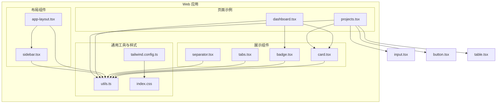
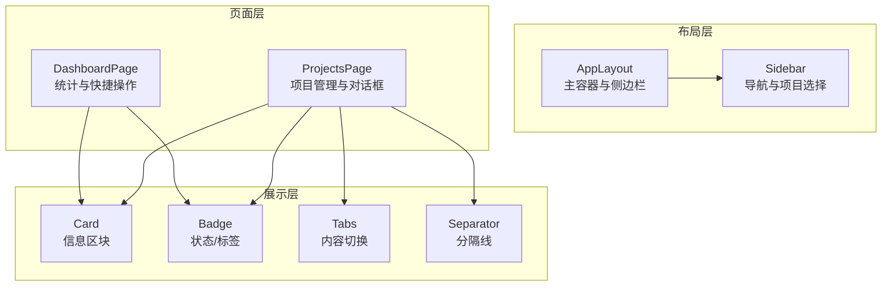
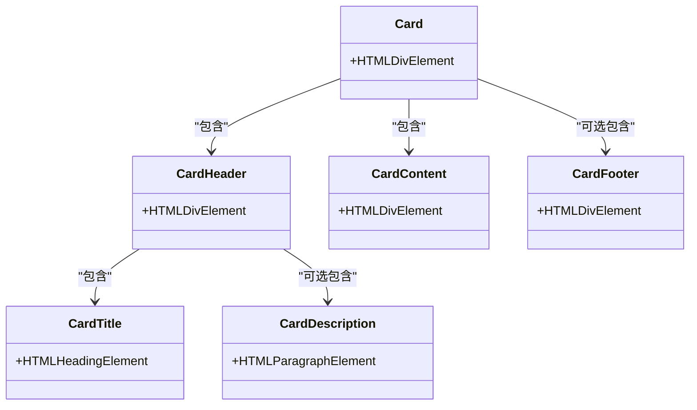
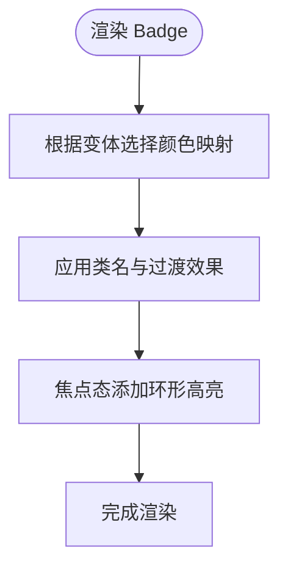
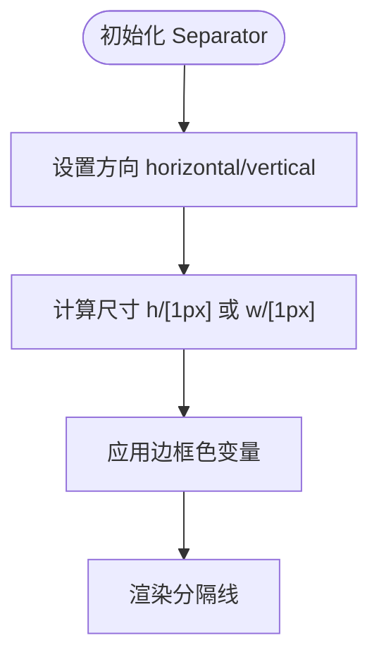
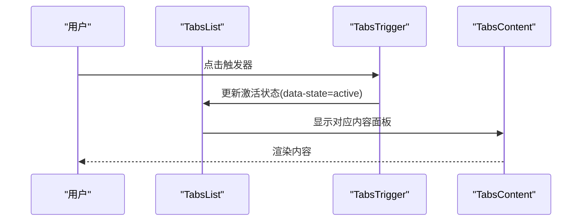
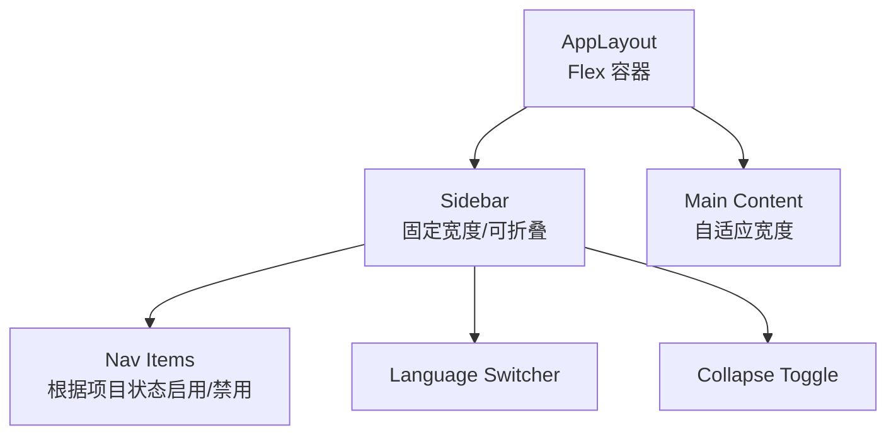
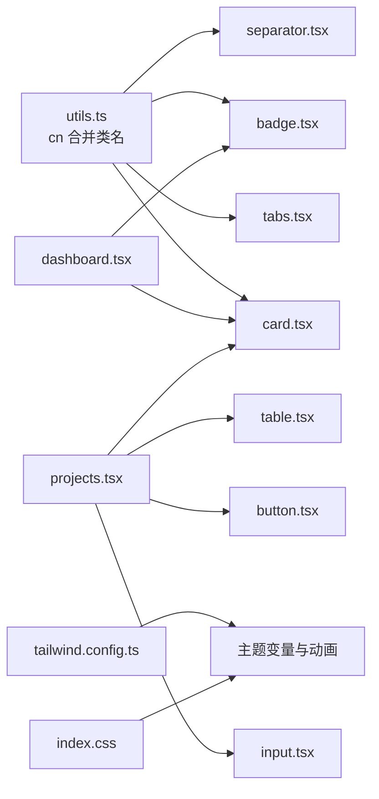

# 布局与展示组件

<cite>
**本文引用的文件**
- [packages/web/src/components/ui/card.tsx](file://packages/web/src/components/ui/card.tsx)
- [packages/web/src/components/ui/badge.tsx](file://packages/web/src/components/ui/badge.tsx)
- [packages/web/src/components/ui/separator.tsx](file://packages/web/src/components/ui/separator.tsx)
- [packages/web/src/components/ui/tabs.tsx](file://packages/web/src/components/ui/tabs.tsx)
- [packages/web/src/components/layout/app-layout.tsx](file://packages/web/src/components/layout/app-layout.tsx)
- [packages/web/src/components/layout/sidebar.tsx](file://packages/web/src/components/layout/sidebar.tsx)
- [packages/web/src/lib/utils.ts](file://packages/web/src/lib/utils.ts)
- [packages/web/tailwind.config.ts](file://packages/web/tailwind.config.ts)
- [packages/web/src/index.css](file://packages/web/src/index.css)
- [packages/web/src/pages/dashboard.tsx](file://packages/web/src/pages/dashboard.tsx)
- [packages/web/src/pages/projects.tsx](file://packages/web/src/pages/projects.tsx)
- [packages/web/src/components/ui/button.tsx](file://packages/web/src/components/ui/button.tsx)
- [packages/web/src/components/ui/input.tsx](file://packages/web/src/components/ui/input.tsx)
- [packages/web/src/components/ui/table.tsx](file://packages/web/src/components/ui/table.tsx)
</cite>

## 目录
1. [简介](#简介)
2. [项目结构](#项目结构)
3. [核心组件](#核心组件)
4. [架构总览](#架构总览)
5. [详细组件分析](#详细组件分析)
6. [依赖关系分析](#依赖关系分析)
7. [性能考量](#性能考量)
8. [故障排查指南](#故障排查指南)
9. [结论](#结论)
10. [附录](#附录)

## 简介
本文件聚焦于布局与展示类组件，系统性阐述卡片、徽章、分隔符、标签页等组件的设计理念、布局特性与视觉效果；说明内容组织方式、层级结构与视觉层次；文档化主题定制、尺寸规格与间距控制；解释响应式设计实现、动画效果与过渡机制；并给出组件组合模式、嵌套使用与布局优化策略，辅以实际使用场景与最佳实践。

## 项目结构
本项目采用基于功能域的组织方式，UI 组件集中在 web 包的 components/ui 与 components/layout 下，页面级组件位于 pages 目录，样式通过 TailwindCSS 与主题变量统一管理。

图表来源
- [packages/web/src/components/layout/app-layout.tsx:1-16](file://packages/web/src/components/layout/app-layout.tsx#L1-L16)
- [packages/web/src/components/layout/sidebar.tsx:1-107](file://packages/web/src/components/layout/sidebar.tsx#L1-L107)
- [packages/web/src/components/ui/card.tsx:1-45](file://packages/web/src/components/ui/card.tsx#L1-L45)
- [packages/web/src/components/ui/badge.tsx:1-29](file://packages/web/src/components/ui/badge.tsx#L1-L29)
- [packages/web/src/components/ui/separator.tsx:1-20](file://packages/web/src/components/ui/separator.tsx#L1-L20)
- [packages/web/src/components/ui/tabs.tsx:1-47](file://packages/web/src/components/ui/tabs.tsx#L1-L47)
- [packages/web/src/lib/utils.ts:1-7](file://packages/web/src/lib/utils.ts#L1-L7)
- [packages/web/tailwind.config.ts:1-92](file://packages/web/tailwind.config.ts#L1-L92)
- [packages/web/src/index.css:1-69](file://packages/web/src/index.css#L1-L69)
- [packages/web/src/pages/dashboard.tsx:1-168](file://packages/web/src/pages/dashboard.tsx#L1-L168)
- [packages/web/src/pages/projects.tsx:1-171](file://packages/web/src/pages/projects.tsx#L1-L171)

章节来源
- [packages/web/src/components/layout/app-layout.tsx:1-16](file://packages/web/src/components/layout/app-layout.tsx#L1-L16)
- [packages/web/src/components/layout/sidebar.tsx:1-107](file://packages/web/src/components/layout/sidebar.tsx#L1-L107)
- [packages/web/src/lib/utils.ts:1-7](file://packages/web/src/lib/utils.ts#L1-L7)
- [packages/web/tailwind.config.ts:1-92](file://packages/web/tailwind.config.ts#L1-L92)
- [packages/web/src/index.css:1-69](file://packages/web/src/index.css#L1-L69)

## 核心组件
本节对卡片、徽章、分隔符、标签页进行深入解析，涵盖设计理念、结构与样式、可定制点与使用建议。

- 卡片（Card）
  - 设计理念：用于承载一组相关内容，形成清晰的信息区块，强调视觉分组与层次感。
  - 结构组成：容器 Card、头部 CardHeader、标题 CardTitle、描述 CardDescription、内容 CardContent、底部 CardFooter。
  - 视觉与布局：圆角边框、背景色与前景色分离、阴影与边框统一；头部默认纵向堆叠并带有垂直间距；内容区默认上内边距清零以便与标题衔接；底部默认水平居中与对齐。
  - 主题与尺寸：通过 Tailwind 变量与组件类名组合实现；支持透传额外 className 进行覆盖。
  - 使用建议：在仪表盘与列表页中作为统计块、操作区与详情容器广泛使用；与图标、按钮、状态徽章组合提升信息密度。

- 徽章（Badge）
  - 设计理念：用于标识状态、类型或标签，强调可读性与语义化。
  - 变体与尺寸：通过变体（variant）区分默认、次要、破坏性、描边、成功、警告等；支持过渡动画与焦点环。
  - 主题与尺寸：基于主题色变量映射到不同前景/背景色；通过类名合并函数进行最终样式拼接。
  - 使用建议：与运行状态、优先级、分类等结合；注意对比度与可读性。

- 分隔符（Separator）
  - 设计理念：用于视觉分隔与层级提示，支持水平与垂直两种方向。
  - 实现要点：基于 Radix UI 的原生语义根节点，通过方向属性控制尺寸与方向；使用边框色变量保证与主题一致。
  - 使用建议：在列表项之间、导航与内容之间、表单分组之间合理使用，避免过度分割。

- 标签页（Tabs）
  - 设计理念：用于在有限空间内切换内容视图，强调清晰的状态指示与平滑过渡。
  - 结构组成：根容器 Tabs、标签列表 TabsList、触发器 TabsTrigger、内容面板 TabsContent。
  - 行为与样式：激活态通过数据属性切换背景与阴影；禁用态与焦点态具备明确反馈；内容区具备焦点可见轮廓。
  - 使用建议：配合路由或内部状态切换；确保标签文本简洁明确；注意内容区的最小高度与滚动处理。

章节来源
- [packages/web/src/components/ui/card.tsx:1-45](file://packages/web/src/components/ui/card.tsx#L1-L45)
- [packages/web/src/components/ui/badge.tsx:1-29](file://packages/web/src/components/ui/badge.tsx#L1-L29)
- [packages/web/src/components/ui/separator.tsx:1-20](file://packages/web/src/components/ui/separator.tsx#L1-L20)
- [packages/web/src/components/ui/tabs.tsx:1-47](file://packages/web/src/components/ui/tabs.tsx#L1-L47)

## 架构总览
整体采用“布局容器 + 展示组件 + 页面示例”的分层架构。布局组件负责全局骨架与导航，展示组件提供可复用的 UI 块，页面示例演示组合使用与交互流程。

图表来源
- [packages/web/src/components/layout/app-layout.tsx:1-16](file://packages/web/src/components/layout/app-layout.tsx#L1-L16)
- [packages/web/src/components/layout/sidebar.tsx:1-107](file://packages/web/src/components/layout/sidebar.tsx#L1-L107)
- [packages/web/src/pages/dashboard.tsx:1-168](file://packages/web/src/pages/dashboard.tsx#L1-L168)
- [packages/web/src/pages/projects.tsx:1-171](file://packages/web/src/pages/projects.tsx#L1-L171)
- [packages/web/src/components/ui/card.tsx:1-45](file://packages/web/src/components/ui/card.tsx#L1-L45)
- [packages/web/src/components/ui/badge.tsx:1-29](file://packages/web/src/components/ui/badge.tsx#L1-L29)
- [packages/web/src/components/ui/tabs.tsx:1-47](file://packages/web/src/components/ui/tabs.tsx#L1-L47)
- [packages/web/src/components/ui/separator.tsx:1-20](file://packages/web/src/components/ui/separator.tsx#L1-L20)

## 详细组件分析

### 卡片组件（Card）
- 设计与结构
  - 容器 Card 提供统一的圆角、边框与阴影；子元素按职责拆分，便于灵活组合。
  - CardHeader 默认纵向布局并设置垂直间距，适合放置标题与辅助图标。
  - CardTitle 与 CardDescription 提供字号与字重的语义化规范。
  - CardContent 与 CardFooter 支持上下文内联与底部操作区布局。
- 视觉层次与间距
  - 头部 pb-2 与内容 pt-0 形成紧凑连接；底部 flex 对齐与留白确保操作区清晰。
- 主题与定制
  - 通过 Tailwind 变量与组件类名组合实现主题一致性；可叠加自定义类名微调。
- 组合与嵌套
  - 在仪表盘中与图标、按钮、状态徽章组合；在项目页中与下拉菜单、输入框组合。
- 使用场景与最佳实践
  - 统计卡片：标题 + 图标 + 数值 + 描述。
  - 操作卡片：标题 + 描述 + 按钮。
  - 列表卡片：标题 + 描述 + 操作菜单。

图表来源
- [packages/web/src/components/ui/card.tsx:1-45](file://packages/web/src/components/ui/card.tsx#L1-L45)

章节来源
- [packages/web/src/components/ui/card.tsx:1-45](file://packages/web/src/components/ui/card.tsx#L1-L45)
- [packages/web/src/pages/dashboard.tsx:48-100](file://packages/web/src/pages/dashboard.tsx#L48-L100)
- [packages/web/src/pages/projects.tsx:119-166](file://packages/web/src/pages/projects.tsx#L119-L166)

### 徽章组件（Badge）
- 设计与变体
  - 通过变体映射到不同的前景/背景色，支持描边与非描边风格。
  - 内置过渡动画与焦点环，增强交互反馈。
- 主题与尺寸
  - 基于主题色变量；尺寸由字体大小与内边距控制。
- 组合与嵌套
  - 在运行状态、优先级、分类等场景中与卡片、列表项组合使用。
- 使用场景与最佳实践
  - 状态徽章：成功、失败、运行中、待定等。
  - 类型徽章：标签、分类、权限等。

图表来源
- [packages/web/src/components/ui/badge.tsx:1-29](file://packages/web/src/components/ui/badge.tsx#L1-L29)

章节来源
- [packages/web/src/components/ui/badge.tsx:1-29](file://packages/web/src/components/ui/badge.tsx#L1-L29)
- [packages/web/src/pages/dashboard.tsx:155-167](file://packages/web/src/pages/dashboard.tsx#L155-L167)

### 分隔符组件（Separator）
- 设计与行为
  - 基于 Radix UI，支持水平与垂直方向；通过方向属性控制尺寸与方向。
  - 使用边框色变量保持主题一致性。
- 使用场景与最佳实践
  - 列表项之间、导航与内容之间、表单分组之间；避免过度使用造成视觉噪音。

图表来源
- [packages/web/src/components/ui/separator.tsx:1-20](file://packages/web/src/components/ui/separator.tsx#L1-L20)

章节来源
- [packages/web/src/components/ui/separator.tsx:1-20](file://packages/web/src/components/ui/separator.tsx#L1-L20)

### 标签页组件（Tabs）
- 设计与结构
  - 根容器、标签列表、触发器、内容面板四部分协作，提供清晰的状态指示与切换体验。
  - 激活态通过数据属性切换背景与阴影；禁用态与焦点态具备明确反馈。
- 使用场景与最佳实践
  - 配合路由或内部状态切换；确保标签文本简洁明确；注意内容区的最小高度与滚动处理。

图表来源
- [packages/web/src/components/ui/tabs.tsx:1-47](file://packages/web/src/components/ui/tabs.tsx#L1-L47)

章节来源
- [packages/web/src/components/ui/tabs.tsx:1-47](file://packages/web/src/components/ui/tabs.tsx#L1-L47)
- [packages/web/src/pages/projects.tsx:1-171](file://packages/web/src/pages/projects.tsx#L1-L171)

### 布局容器与侧边栏
- 布局容器（AppLayout）
  - 采用 Flex 布局，左侧固定宽度侧边栏，右侧主内容区域自适应滚动。
  - 容器限制最大宽度并设置左右内边距，确保在大屏下的可读性。
- 侧边栏（Sidebar）
  - 支持折叠与展开，动态调整宽度与文字显示；导航项根据当前项目状态启用/禁用。
  - 顶部展示品牌信息与当前项目名称；底部提供语言切换与折叠按钮。

图表来源
- [packages/web/src/components/layout/app-layout.tsx:1-16](file://packages/web/src/components/layout/app-layout.tsx#L1-L16)
- [packages/web/src/components/layout/sidebar.tsx:1-107](file://packages/web/src/components/layout/sidebar.tsx#L1-L107)

章节来源
- [packages/web/src/components/layout/app-layout.tsx:1-16](file://packages/web/src/components/layout/app-layout.tsx#L1-L16)
- [packages/web/src/components/layout/sidebar.tsx:1-107](file://packages/web/src/components/layout/sidebar.tsx#L1-L107)

## 依赖关系分析
- 组件间依赖
  - 展示组件均依赖工具函数进行类名合并，确保样式可组合与覆盖。
  - 页面示例依赖多个展示组件进行组合使用，体现组件复用与组合能力。
- 样式与主题
  - Tailwind 配置扩展了颜色、圆角半径与关键帧动画；CSS 变量定义明暗主题色板。
  - 组件类名直接引用主题变量，保证跨组件一致性。

图表来源
- [packages/web/src/lib/utils.ts:1-7](file://packages/web/src/lib/utils.ts#L1-L7)
- [packages/web/src/components/ui/card.tsx:1-45](file://packages/web/src/components/ui/card.tsx#L1-L45)
- [packages/web/src/components/ui/badge.tsx:1-29](file://packages/web/src/components/ui/badge.tsx#L1-L29)
- [packages/web/src/components/ui/tabs.tsx:1-47](file://packages/web/src/components/ui/tabs.tsx#L1-L47)
- [packages/web/src/components/ui/separator.tsx:1-20](file://packages/web/src/components/ui/separator.tsx#L1-L20)
- [packages/web/tailwind.config.ts:1-92](file://packages/web/tailwind.config.ts#L1-L92)
- [packages/web/src/index.css:1-69](file://packages/web/src/index.css#L1-L69)
- [packages/web/src/pages/dashboard.tsx:1-168](file://packages/web/src/pages/dashboard.tsx#L1-L168)
- [packages/web/src/pages/projects.tsx:1-171](file://packages/web/src/pages/projects.tsx#L1-L171)

章节来源
- [packages/web/src/lib/utils.ts:1-7](file://packages/web/src/lib/utils.ts#L1-L7)
- [packages/web/tailwind.config.ts:1-92](file://packages/web/tailwind.config.ts#L1-L92)
- [packages/web/src/index.css:1-69](file://packages/web/src/index.css#L1-L69)

## 性能考量
- 组件渲染
  - 卡片与徽章均为轻量结构，渲染开销低；分隔符与标签页依赖原生 DOM 与少量数据属性，性能稳定。
- 动画与过渡
  - 使用 CSS 关键帧与过渡类，避免 JavaScript 动画带来的主线程压力；在大列表中谨慎使用复杂动画。
- 响应式布局
  - 通过 Tailwind 断点与网格系统实现自适应；在移动端优先时，优先保证关键信息与交互路径的可用性。
- 样式合并
  - 使用类名合并函数减少重复样式与冲突，提升样式计算效率。

## 故障排查指南
- 样式不生效
  - 检查是否正确引入基础样式与主题变量；确认 Tailwind 配置的 content 路径包含组件目录。
- 主题色异常
  - 检查明暗主题变量是否完整；确认组件类名引用的颜色变量存在且未被覆盖。
- 动画无效
  - 检查关键帧定义与动画类是否正确；确认未被全局样式覆盖。
- 组合错位
  - 检查容器类名与间距类名的叠加顺序；避免相互覆盖导致布局异常。
- 交互无反馈
  - 检查激活态与焦点态类名；确认未被禁用态样式覆盖。

章节来源
- [packages/web/src/lib/utils.ts:1-7](file://packages/web/src/lib/utils.ts#L1-L7)
- [packages/web/tailwind.config.ts:1-92](file://packages/web/tailwind.config.ts#L1-L92)
- [packages/web/src/index.css:1-69](file://packages/web/src/index.css#L1-L69)

## 结论
本项目通过模块化的布局与展示组件，构建了清晰的视觉层次与一致的主题风格。卡片、徽章、分隔符、标签页等组件在页面示例中得到充分组合与验证，体现了良好的可复用性与可维护性。建议在后续迭代中持续完善主题变量与断点策略，并在复杂场景中引入更细粒度的动画与过渡，以进一步提升用户体验。

## 附录
- 使用场景与最佳实践
  - 仪表盘：使用卡片承载统计信息，配合徽章标识状态；通过网格布局自适应不同屏幕尺寸。
  - 项目管理：卡片作为项目条目容器，结合输入框、按钮与下拉菜单实现编辑与删除；使用分隔符提升列表可读性。
  - 内容切换：使用标签页在有限空间内切换视图；确保标签文案简洁明确，内容区具备足够的最小高度。
- 组合模式与嵌套策略
  - 卡片内部可嵌套徽章、按钮、输入框、表格等；注意内边距与间距的协调。
  - 侧边栏与主内容区通过 Flex 布局实现自适应；在移动端优先时，优先保证导航与关键操作的可达性。
- 响应式设计与动画
  - 使用 Tailwind 断点与网格系统实现多端适配；动画以轻量 CSS 过渡为主，避免影响交互流畅性。