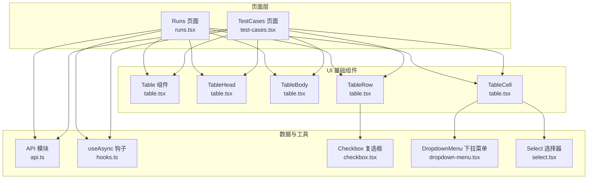
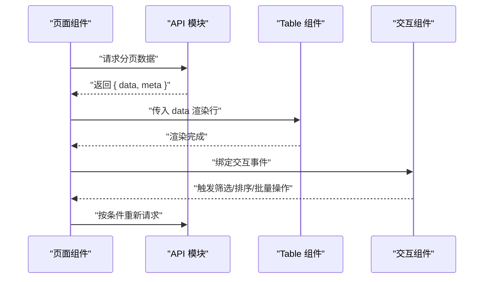
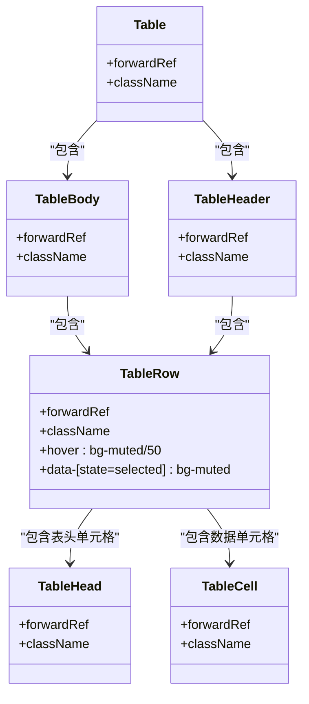
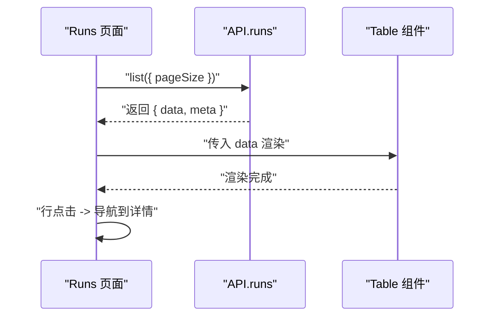
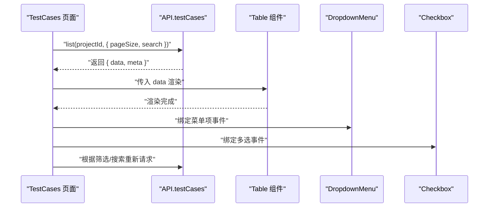
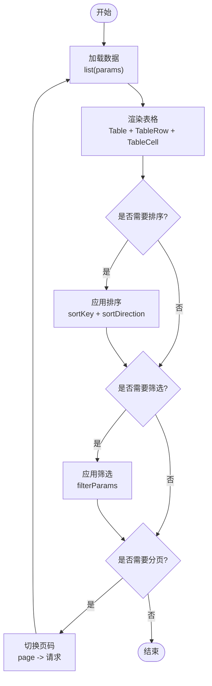
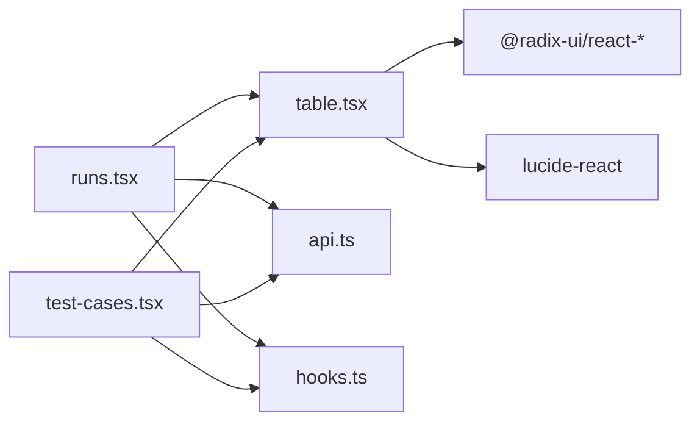

# 数据展示组件

<cite>
**本文引用的文件**
- [packages/web/src/components/ui/table.tsx](file://packages/web/src/components/ui/table.tsx)
- [packages/web/src/pages/runs.tsx](file://packages/web/src/pages/runs.tsx)
- [packages/web/src/pages/test-cases.tsx](file://packages/web/src/pages/test-cases.tsx)
- [packages/web/src/lib/api.ts](file://packages/web/src/lib/api.ts)
- [packages/web/src/lib/hooks.ts](file://packages/web/src/lib/hooks.ts)
- [packages/web/src/components/ui/checkbox.tsx](file://packages/web/src/components/ui/checkbox.tsx)
- [packages/web/src/components/ui/select.tsx](file://packages/web/src/components/ui/select.tsx)
- [packages/web/src/components/ui/dropdown-menu.tsx](file://packages/web/src/components/ui/dropdown-menu.tsx)
</cite>

## 目录
1. [简介](#简介)
2. [项目结构](#项目结构)
3. [核心组件](#核心组件)
4. [架构总览](#架构总览)
5. [详细组件分析](#详细组件分析)
6. [依赖关系分析](#依赖关系分析)
7. [性能考量](#性能考量)
8. [故障排查指南](#故障排查指南)
9. [结论](#结论)
10. [附录](#附录)

## 简介
本文件面向“数据展示组件”的技术文档，聚焦于表格组件的设计架构、数据渲染机制与交互功能。当前仓库中的表格组件为轻量级基础 UI 组件，主要负责表格容器、表头、表体、行与单元格的基础样式与可访问性；实际的数据加载、分页、排序、筛选等能力由页面层与 API 层协作实现。本文将从系统架构、组件关系、数据流、处理逻辑、集成点、错误处理与性能特性等方面进行深入解析，并给出在复杂数据场景下的实现方案与最佳实践。

## 项目结构
表格组件位于 UI 基础组件层，页面层通过引入该组件并结合 API 调用完成数据展示与交互。关键文件如下：
- 表格基础组件：packages/web/src/components/ui/table.tsx
- 页面使用示例（运行记录）：packages/web/src/pages/runs.tsx
- 页面使用示例（测试用例）：packages/web/src/pages/test-cases.tsx
- API 定义与分页返回结构：packages/web/src/lib/api.ts
- 通用异步钩子：packages/web/src/lib/hooks.ts
- 行内交互组件（复选框、下拉菜单、选择器）：packages/web/src/components/ui/checkbox.tsx、packages/web/src/components/ui/dropdown-menu.tsx、packages/web/src/components/ui/select.tsx

图表来源
- [packages/web/src/components/ui/table.tsx](file://packages/web/src/components/ui/table.tsx)
- [packages/web/src/pages/runs.tsx](file://packages/web/src/pages/runs.tsx)
- [packages/web/src/pages/test-cases.tsx](file://packages/web/src/pages/test-cases.tsx)
- [packages/web/src/lib/api.ts](file://packages/web/src/lib/api.ts)
- [packages/web/src/lib/hooks.ts](file://packages/web/src/lib/hooks.ts)
- [packages/web/src/components/ui/checkbox.tsx](file://packages/web/src/components/ui/checkbox.tsx)
- [packages/web/src/components/ui/dropdown-menu.tsx](file://packages/web/src/components/ui/dropdown-menu.tsx)
- [packages/web/src/components/ui/select.tsx](file://packages/web/src/components/ui/select.tsx)

章节来源
- [packages/web/src/components/ui/table.tsx](file://packages/web/src/components/ui/table.tsx)
- [packages/web/src/pages/runs.tsx](file://packages/web/src/pages/runs.tsx)
- [packages/web/src/pages/test-cases.tsx](file://packages/web/src/pages/test-cases.tsx)
- [packages/web/src/lib/api.ts](file://packages/web/src/lib/api.ts)
- [packages/web/src/lib/hooks.ts](file://packages/web/src/lib/hooks.ts)

## 核心组件
- Table：表格容器，提供相对定位与横向溢出滚动，确保在小屏设备上可横向滚动。
- TableHeader/TableBody：分别包裹表头与表体，统一边框与间距规则。
- TableRow：行元素，内置悬停态与选中态样式，支持通过 data 属性控制状态。
- TableHead/TableCell：表头与单元格，统一高度、内边距与对齐方式，表头包含可访问性角色的复选框时自动调整右侧内边距。

这些组件通过组合形成标准的表格布局，页面层负责数据绑定与交互事件。

章节来源
- [packages/web/src/components/ui/table.tsx](file://packages/web/src/components/ui/table.tsx)

## 架构总览
表格组件采用“基础 UI 组件 + 页面层数据绑定 + API 分页”的分层架构。页面层通过 API 获取分页数据，渲染 Table 子组件；交互层通过下拉菜单、选择器、复选框等控件实现筛选、排序与批量操作。

图表来源
- [packages/web/src/pages/runs.tsx](file://packages/web/src/pages/runs.tsx)
- [packages/web/src/pages/test-cases.tsx](file://packages/web/src/pages/test-cases.tsx)
- [packages/web/src/lib/api.ts](file://packages/web/src/lib/api.ts)
- [packages/web/src/components/ui/table.tsx](file://packages/web/src/components/ui/table.tsx)
- [packages/web/src/components/ui/dropdown-menu.tsx](file://packages/web/src/components/ui/dropdown-menu.tsx)
- [packages/web/src/components/ui/select.tsx](file://packages/web/src/components/ui/select.tsx)
- [packages/web/src/components/ui/checkbox.tsx](file://packages/web/src/components/ui/checkbox.tsx)

## 详细组件分析

### 表格基础组件族（Table、TableHeader、TableBody、TableRow、TableHead、TableCell）
- 设计要点
  - 使用 forwardRef 将 DOM 引用透传给父组件，便于外部控制或测量。
  - 通过 className 合并与 Tailwind 类名，保证主题一致性。
  - TableRow 提供 hover 与选中态，配合 data 属性实现状态切换。
  - Table 容器提供横向滚动，适配窄屏与长列表。
- 适用场景
  - 作为任何数据表格的基础布局单元，无需额外复杂逻辑即可满足大多数展示需求。
- 可扩展点
  - 当前未内置排序、筛选、分页逻辑，需在页面层自行实现。
  - 如需虚拟滚动，可在现有容器基础上引入虚拟化库（见“性能考量”）。

图表来源
- [packages/web/src/components/ui/table.tsx](file://packages/web/src/components/ui/table.tsx)

章节来源
- [packages/web/src/components/ui/table.tsx](file://packages/web/src/components/ui/table.tsx)

### 页面层数据绑定与交互（以“运行记录”为例）
- 数据获取
  - 通过 API 模块的 runs.list 获取分页数据，返回结构包含 data 与 meta。
  - 页面使用 useState 管理列表与加载状态，首次挂载时发起请求。
- 列定义与行渲染
  - 列头由 TableHeader + TableRow + TableHead 组成，列内容由 TableBody + TableRow + TableCell 组成。
  - 行点击事件用于导航到详情页，单元格内嵌入 Badge、图标与格式化文本。
- 排序与筛选
  - 当前页面未实现前端排序/筛选；如需，可在页面层维护本地状态并在渲染前对 data 进行排序/过滤。
- 分页处理
  - API 返回 meta 包含 total/page/pageSize；页面可基于此构建分页控件（当前页面使用固定 pageSize）。

图表来源
- [packages/web/src/pages/runs.tsx](file://packages/web/src/pages/runs.tsx)
- [packages/web/src/lib/api.ts](file://packages/web/src/lib/api.ts)
- [packages/web/src/components/ui/table.tsx](file://packages/web/src/components/ui/table.tsx)

章节来源
- [packages/web/src/pages/runs.tsx](file://packages/web/src/pages/runs.tsx)
- [packages/web/src/lib/api.ts](file://packages/web/src/lib/api.ts)

### 页面层数据绑定与交互（以“测试用例”为例）
- 数据获取
  - 通过 API 模块的 testCases.list 获取分页数据，支持搜索参数。
  - 使用 useCallback 与 useEffect 控制加载时机，避免重复请求。
- 列定义与行渲染
  - 列头包含名称、模块、优先级、步骤数、标签等字段。
  - 行内提供下拉菜单，支持编辑、复制、删除等操作。
- 批量操作
  - 当前页面未实现多选与批量操作；可通过在 TableRow 内加入复选框并维护选中集合实现。
- 搜索与筛选
  - 支持关键词搜索，搜索参数随请求传递至后端。

图表来源
- [packages/web/src/pages/test-cases.tsx](file://packages/web/src/pages/test-cases.tsx)
- [packages/web/src/lib/api.ts](file://packages/web/src/lib/api.ts)
- [packages/web/src/components/ui/table.tsx](file://packages/web/src/components/ui/table.tsx)
- [packages/web/src/components/ui/dropdown-menu.tsx](file://packages/web/src/components/ui/dropdown-menu.tsx)
- [packages/web/src/components/ui/checkbox.tsx](file://packages/web/src/components/ui/checkbox.tsx)

章节来源
- [packages/web/src/pages/test-cases.tsx](file://packages/web/src/pages/test-cases.tsx)
- [packages/web/src/lib/api.ts](file://packages/web/src/lib/api.ts)

### 单元格自定义渲染与行选择机制
- 单元格自定义渲染
  - 在 TableCell 内部可自由嵌套 Badge、图标、按钮等组件，实现状态徽标、操作入口等。
  - 示例：运行记录页面在单元格内使用 Badge 与图标展示状态；测试用例页面使用下拉菜单与按钮组合。
- 行选择机制
  - 当前基础组件未内置复选框；可在 TableRow 内侧添加 Checkbox 并维护选中集合，实现单选/多选。
  - 建议在行元素上绑定 data 属性以标识选中状态，配合 TableRow 的选中样式类实现视觉反馈。

章节来源
- [packages/web/src/pages/runs.tsx](file://packages/web/src/pages/runs.tsx)
- [packages/web/src/pages/test-cases.tsx](file://packages/web/src/pages/test-cases.tsx)
- [packages/web/src/components/ui/checkbox.tsx](file://packages/web/src/components/ui/checkbox.tsx)
- [packages/web/src/components/ui/table.tsx](file://packages/web/src/components/ui/table.tsx)

### 排序、筛选与分页处理（页面层实现建议）
- 排序
  - 在页面层维护 sortKey 与 sortDirection，渲染前对 data 进行排序。
  - 可在 TableHead 上绑定点击事件，切换排序方向并重新渲染。
- 筛选
  - 维护 filterParams 对象，结合 Select/DropdownMenu 等组件收集筛选条件。
  - 请求时将筛选参数拼接到查询字符串中。
- 分页
  - 使用 meta 中的 total/page/pageSize 计算页码与边界，结合 useAsync 钩子实现按页切换。
  - 建议在页面顶部放置分页控件，点击后更新 page 参数并重新请求。

图表来源
- [packages/web/src/lib/api.ts](file://packages/web/src/lib/api.ts)
- [packages/web/src/lib/hooks.ts](file://packages/web/src/lib/hooks.ts)
- [packages/web/src/components/ui/table.tsx](file://packages/web/src/components/ui/table.tsx)
- [packages/web/src/components/ui/select.tsx](file://packages/web/src/components/ui/select.tsx)
- [packages/web/src/components/ui/dropdown-menu.tsx](file://packages/web/src/components/ui/dropdown-menu.tsx)

章节来源
- [packages/web/src/lib/api.ts](file://packages/web/src/lib/api.ts)
- [packages/web/src/lib/hooks.ts](file://packages/web/src/lib/hooks.ts)

### 响应式设计、列宽调整与拖拽排序支持
- 响应式设计
  - Table 容器提供横向滚动，适合在窄屏设备上展示长列表。
  - 建议为关键列设置最小宽度与断点策略，避免内容被压缩。
- 列宽调整
  - 可通过 CSS Grid 或自适应布局实现列宽分配；对于固定表头与滚动区域，需注意同步滚动与对齐。
- 拖拽排序
  - 可在列头或行侧添加拖拽手柄，结合 HTML5 Drag and Drop 或第三方库实现列/行顺序调整。
  - 注意：当前基础组件未内置拖拽逻辑，需在页面层实现并保持与数据源一致。

章节来源
- [packages/web/src/components/ui/table.tsx](file://packages/web/src/components/ui/table.tsx)

### 大数据量处理与性能优化策略
- 渲染优化
  - 使用 React.memo 或 useMemo 缓存行组件，减少不必要的重渲染。
  - 将重型单元格内容延迟渲染（如懒加载图片、延迟计算），仅在可见区域渲染。
- 虚拟滚动
  - 引入虚拟滚动库（如 react-window 或 @tanstack/react-virtual），仅渲染可视区域内的行。
  - 保持 Table 容器的滚动容器属性不变，将虚拟化容器置于 TableBody 内部。
- 请求与缓存
  - 使用 useAsync 钩子管理请求生命周期，避免重复请求。
  - 对高频查询结果进行内存缓存，必要时结合服务端分页与增量更新。

章节来源
- [packages/web/src/lib/hooks.ts](file://packages/web/src/lib/hooks.ts)
- [packages/web/src/components/ui/table.tsx](file://packages/web/src/components/ui/table.tsx)

## 依赖关系分析
- 组件耦合
  - 页面层对 UI 组件的依赖为弱耦合：仅通过 props 传入数据与事件。
  - API 模块与页面层存在直接依赖，页面层负责组装查询参数与处理响应。
- 外部依赖
  - UI 组件依赖 Radix UI 与 Lucide 图标库，保证可访问性与一致性。
  - 页面层依赖路由与国际化库，用于导航与文案展示。

图表来源
- [packages/web/src/pages/runs.tsx](file://packages/web/src/pages/runs.tsx)
- [packages/web/src/pages/test-cases.tsx](file://packages/web/src/pages/test-cases.tsx)
- [packages/web/src/components/ui/table.tsx](file://packages/web/src/components/ui/table.tsx)
- [packages/web/src/lib/api.ts](file://packages/web/src/lib/api.ts)
- [packages/web/src/lib/hooks.ts](file://packages/web/src/lib/hooks.ts)

章节来源
- [packages/web/src/pages/runs.tsx](file://packages/web/src/pages/runs.tsx)
- [packages/web/src/pages/test-cases.tsx](file://packages/web/src/pages/test-cases.tsx)
- [packages/web/src/components/ui/table.tsx](file://packages/web/src/components/ui/table.tsx)
- [packages/web/src/lib/api.ts](file://packages/web/src/lib/api.ts)
- [packages/web/src/lib/hooks.ts](file://packages/web/src/lib/hooks.ts)

## 性能考量
- 渲染层面
  - 将每行渲染拆分为独立组件，利用 React.memo 缓存。
  - 对单元格内的复杂组件（如图表、富文本）采用懒加载策略。
- 数据层面
  - 服务端分页与无限滚动相结合，避免一次性加载全部数据。
  - 对高频交互（如搜索、筛选）增加防抖，降低请求频率。
- 视觉与交互
  - 使用骨架屏或占位符提升感知性能。
  - 控制动画与过渡效果，避免在低端设备上造成卡顿。

## 故障排查指南
- 加载失败
  - 检查 API 返回的状态码与错误信息，确认网络与鉴权配置。
  - 使用 useAsync 钩子捕获错误并显示提示。
- 数据不一致
  - 确认分页参数与服务端约定一致，避免 page/pageSize 错误导致数据错位。
- 交互异常
  - 检查事件绑定与状态更新是否正确，避免闭包陷阱。
  - 对于下拉菜单与选择器，确认 Portal 渲染目标与层级关系。

章节来源
- [packages/web/src/lib/hooks.ts](file://packages/web/src/lib/hooks.ts)
- [packages/web/src/lib/api.ts](file://packages/web/src/lib/api.ts)

## 结论
当前仓库的表格组件提供了简洁、可复用的基础布局能力，页面层通过 API 与交互组件实现排序、筛选、分页与批量操作等高级功能。对于大规模数据场景，建议引入虚拟滚动与缓存策略，并在页面层完善状态管理与事件处理，以获得更好的用户体验与性能表现。

## 附录
- 最佳实践清单
  - 明确分层职责：基础组件只负责布局与样式，业务逻辑放在页面层。
  - 统一数据结构：前后端分页返回结构保持一致，便于复用。
  - 可访问性：为表头与交互元素提供语义化标签与键盘支持。
  - 性能优先：在大数据量场景下优先考虑虚拟滚动与懒加载。
  - 可扩展性：为排序、筛选、列宽调整预留接口，避免硬编码。