# 选择类组件

<cite>
**本文档引用的文件**
- [select.tsx](file://packages/web/src/components/ui/select.tsx)
- [searchable-select.tsx](file://packages/web/src/components/ui/searchable-select.tsx)
- [dropdown-menu.tsx](file://packages/web/src/components/ui/dropdown-menu.tsx)
- [step-editor.tsx](file://packages/web/src/components/step-editor.tsx)
- [ai-settings.tsx](file://packages/web/src/pages/ai-settings.tsx)
- [utils.ts](file://packages/web/src/lib/utils.ts)
- [package.json](file://packages/web/package.json)
</cite>

## 目录
1. [简介](#简介)
2. [项目结构](#项目结构)
3. [核心组件](#核心组件)
4. [架构概览](#架构概览)
5. [详细组件分析](#详细组件分析)
6. [依赖关系分析](#依赖关系分析)
7. [性能考虑](#性能考虑)
8. [故障排除指南](#故障排除指南)
9. [结论](#结论)

## 简介

本项目提供了完整的前端选择类组件解决方案，包括基础下拉选择器、可搜索选择器和下拉菜单组件。这些组件基于Radix UI构建，具有现代化的设计和良好的可访问性支持。

选择类组件广泛应用于测试用例编辑器、AI设置配置、数据集管理和各种表单场景中。组件支持多种交互模式，包括单选、键盘导航、搜索过滤和动态加载等功能。

## 项目结构

选择类组件位于Web包的UI组件目录中，采用模块化设计，每个组件都是独立的功能单元。

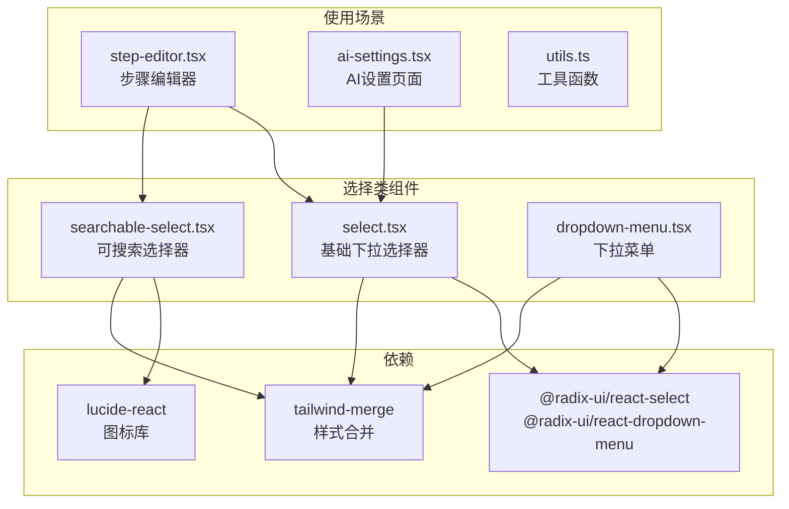

**图表来源**
- [select.tsx:1-84](file://packages/web/src/components/ui/select.tsx#L1-L84)
- [searchable-select.tsx:1-132](file://packages/web/src/components/ui/searchable-select.tsx#L1-L132)
- [dropdown-menu.tsx:1-71](file://packages/web/src/components/ui/dropdown-menu.tsx#L1-L71)

**章节来源**
- [select.tsx:1-84](file://packages/web/src/components/ui/select.tsx#L1-L84)
- [searchable-select.tsx:1-132](file://packages/web/src/components/ui/searchable-select.tsx#L1-L132)
- [dropdown-menu.tsx:1-71](file://packages/web/src/components/ui/dropdown-menu.tsx#L1-L71)

## 核心组件

### 基础下拉选择器 (Select)

基础下拉选择器提供了标准的单选功能，支持键盘导航和无障碍访问。

**主要特性：**
- 基于Radix UI的可访问性设计
- 支持键盘操作（上下键导航、Enter选择）
- 动画过渡效果
- 自适应尺寸和位置
- 禁用状态处理

**组件结构：**
- Select Root：选择器根容器
- SelectTrigger：触发器按钮
- SelectContent：内容面板
- SelectItem：选项项
- SelectValue：当前值显示

### 可搜索选择器 (SearchableSelect)

可搜索选择器扩展了基础选择器，增加了实时搜索和过滤功能。

**主要特性：**
- 实时搜索过滤
- 自动聚焦搜索输入框
- 点击外部关闭
- 键盘快捷键支持
- 空结果状态处理

**搜索功能：**
- 支持标签和描述的双重搜索
- 不区分大小写的匹配
- 实时过滤结果显示

### 下拉菜单 (DropdownMenu)

下拉菜单提供了更通用的菜单功能，支持复杂的菜单项组织。

**主要特性：**
- 多级菜单支持
- 分隔符和标签
- 内边距和插入样式
- 子菜单嵌套
- 现代动画效果

**章节来源**
- [select.tsx:6-83](file://packages/web/src/components/ui/select.tsx#L6-L83)
- [searchable-select.tsx:5-131](file://packages/web/src/components/ui/searchable-select.tsx#L5-L131)
- [dropdown-menu.tsx:6-70](file://packages/web/src/components/ui/dropdown-menu.tsx#L6-L70)

## 架构概览

选择类组件采用分层架构设计，确保组件间的松耦合和高内聚。

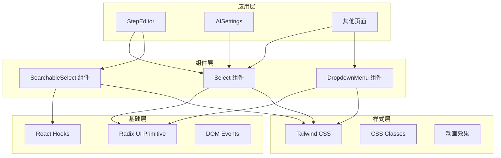

**图表来源**
- [select.tsx:1-84](file://packages/web/src/components/ui/select.tsx#L1-L84)
- [searchable-select.tsx:1-132](file://packages/web/src/components/ui/searchable-select.tsx#L1-L132)
- [dropdown-menu.tsx:1-71](file://packages/web/src/components/ui/dropdown-menu.tsx#L1-L71)

## 详细组件分析

### 基础下拉选择器 (Select) 详细分析

#### 组件类图

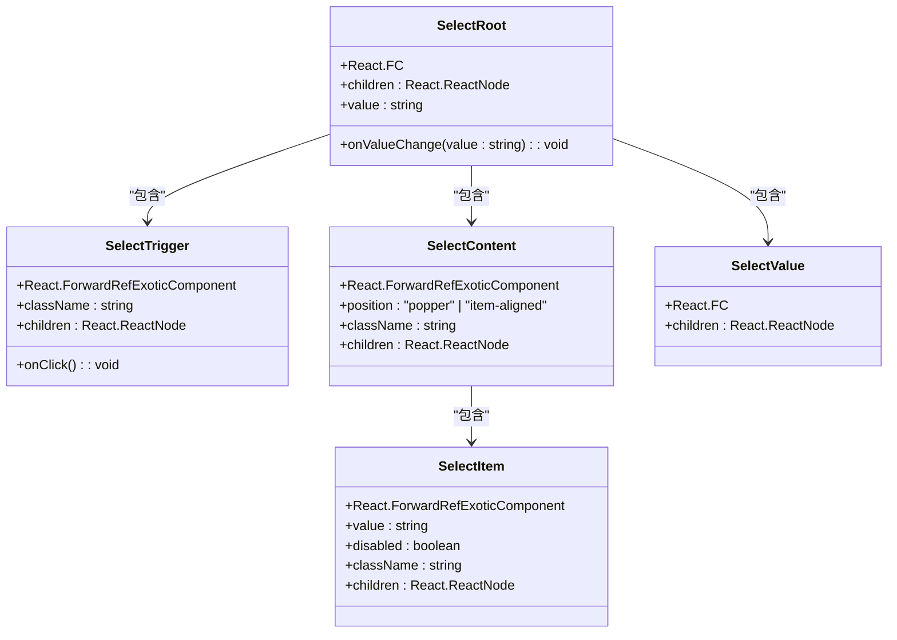

**图表来源**
- [select.tsx:6-83](file://packages/web/src/components/ui/select.tsx#L6-L83)

#### 数据流分析

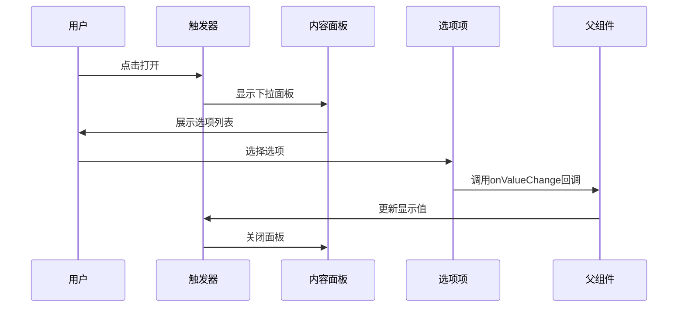

**图表来源**
- [select.tsx:10-28](file://packages/web/src/components/ui/select.tsx#L10-L28)
- [select.tsx:30-59](file://packages/web/src/components/ui/select.tsx#L30-L59)
- [select.tsx:61-81](file://packages/web/src/components/ui/select.tsx#L61-L81)

#### 使用示例

在步骤编辑器中的应用：

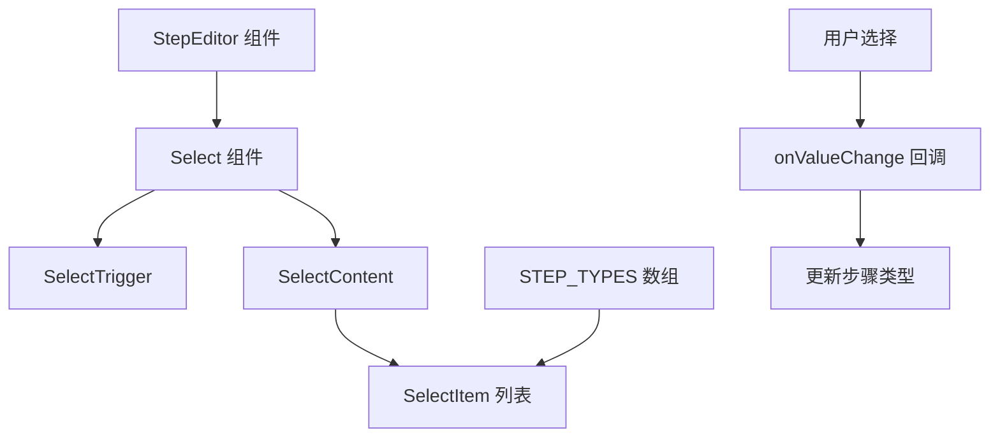

**图表来源**
- [step-editor.tsx:113-129](file://packages/web/src/components/step-editor.tsx#L113-L129)

**章节来源**
- [select.tsx:10-83](file://packages/web/src/components/ui/select.tsx#L10-L83)
- [step-editor.tsx:113-129](file://packages/web/src/components/step-editor.tsx#L113-L129)

### 可搜索选择器 (SearchableSelect) 详细分析

#### 组件类图

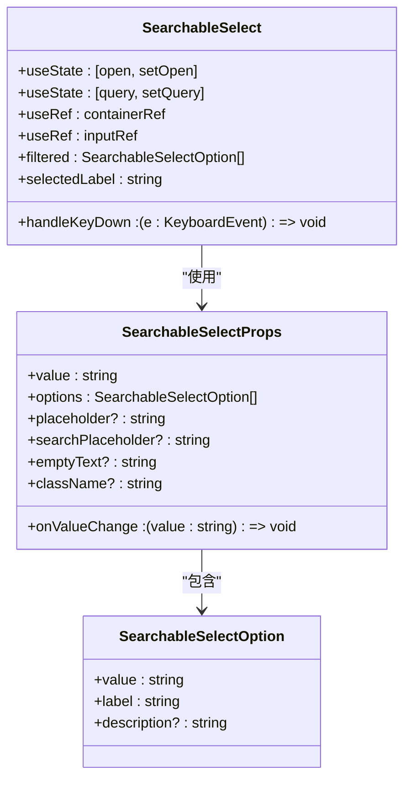

**图表来源**
- [searchable-select.tsx:5-29](file://packages/web/src/components/ui/searchable-select.tsx#L5-L29)

#### 搜索算法流程

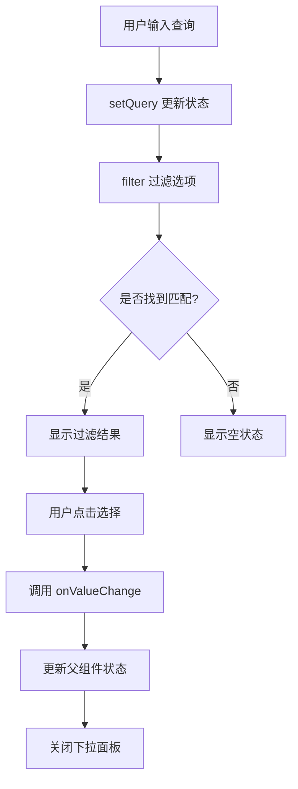

**图表来源**
- [searchable-select.tsx:61-65](file://packages/web/src/components/ui/searchable-select.tsx#L61-L65)
- [searchable-select.tsx:106-124](file://packages/web/src/components/ui/searchable-select.tsx#L106-L124)

#### 交互逻辑分析

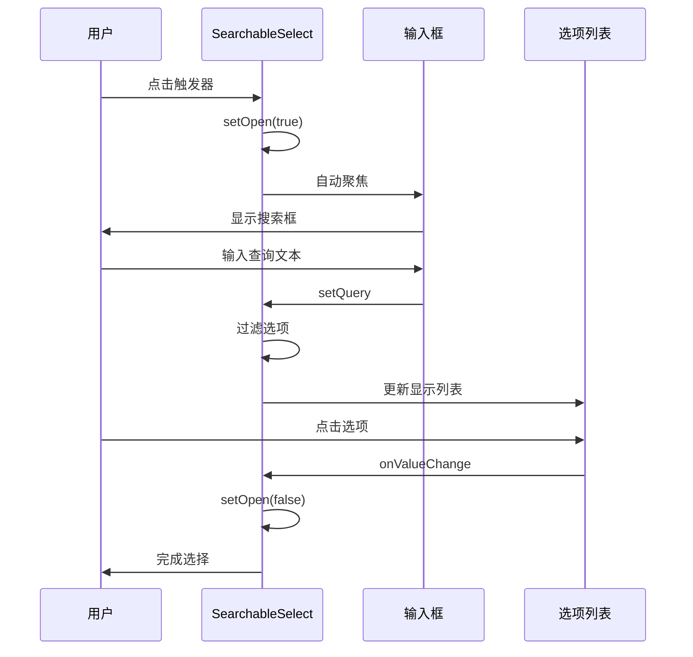

**图表来源**
- [searchable-select.tsx:30-54](file://packages/web/src/components/ui/searchable-select.tsx#L30-L54)
- [searchable-select.tsx:61-65](file://packages/web/src/components/ui/searchable-select.tsx#L61-L65)

#### 使用场景示例

在步骤编辑器中的实际应用：

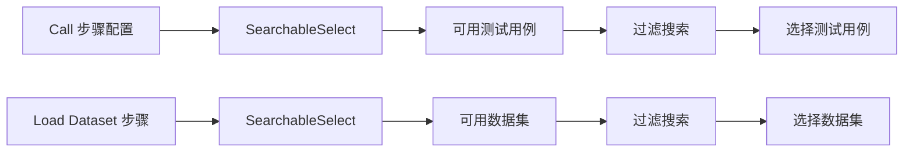

**图表来源**
- [step-editor.tsx:328-341](file://packages/web/src/components/step-editor.tsx#L328-L341)
- [step-editor.tsx:349-361](file://packages/web/src/components/step-editor.tsx#L349-L361)

**章节来源**
- [searchable-select.tsx:21-131](file://packages/web/src/components/ui/searchable-select.tsx#L21-L131)
- [step-editor.tsx:328-361](file://packages/web/src/components/step-editor.tsx#L328-L361)

### 下拉菜单 (DropdownMenu) 详细分析

#### 组件类图

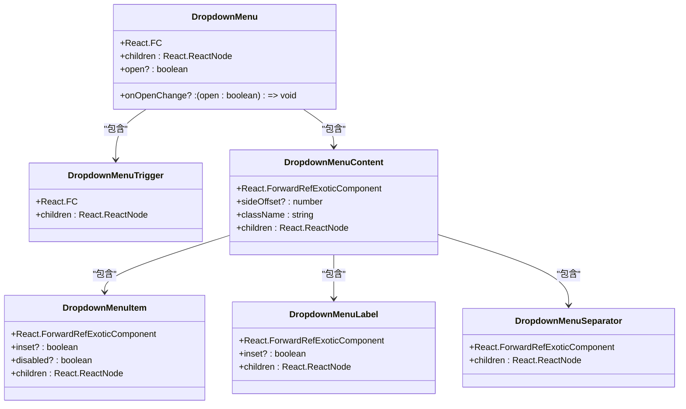

**图表来源**
- [dropdown-menu.tsx:6-70](file://packages/web/src/components/ui/dropdown-menu.tsx#L6-L70)

#### 应用场景

下拉菜单在项目中的使用主要用于：

- **步骤编辑器**：提供移动、删除等操作选项
- **设置页面**：配置AI提供商和模型选择
- **通用菜单**：各种上下文菜单和操作面板

**章节来源**
- [dropdown-menu.tsx:11-70](file://packages/web/src/components/ui/dropdown-menu.tsx#L11-L70)

## 依赖关系分析

### 外部依赖

选择类组件依赖以下关键库：

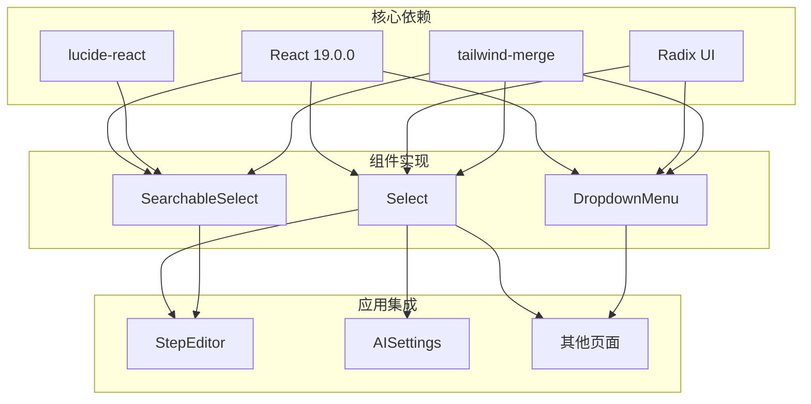

**图表来源**
- [package.json:13-32](file://packages/web/package.json#L13-L32)

### 内部依赖关系

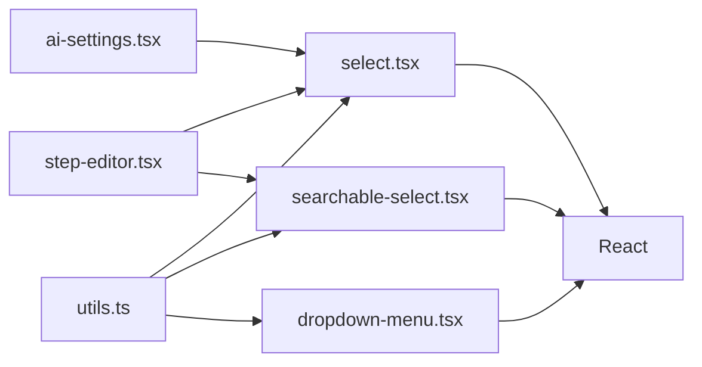

**图表来源**
- [utils.ts:1-7](file://packages/web/src/lib/utils.ts#L1-L7)
- [select.tsx:1-4](file://packages/web/src/components/ui/select.tsx#L1-L4)
- [searchable-select.tsx:1-3](file://packages/web/src/components/ui/searchable-select.tsx#L1-L3)
- [dropdown-menu.tsx:1-4](file://packages/web/src/components/ui/dropdown-menu.tsx#L1-L4)

**章节来源**
- [package.json:13-32](file://packages/web/package.json#L13-L32)
- [utils.ts:4-6](file://packages/web/src/lib/utils.ts#L4-L6)

## 性能考虑

### 渲染优化策略

1. **虚拟滚动支持**
   - 可搜索选择器已实现基础的滚动优化
   - 建议对大量选项使用虚拟滚动
   - 限制最大显示高度（默认48个选项）

2. **状态管理优化**
   - 使用React.memo避免不必要的重渲染
   - 合理的useState拆分
   - 防抖搜索功能

3. **内存管理**
   - 组件卸载时清理事件监听器
   - 及时释放DOM引用

### 大数据量处理方案

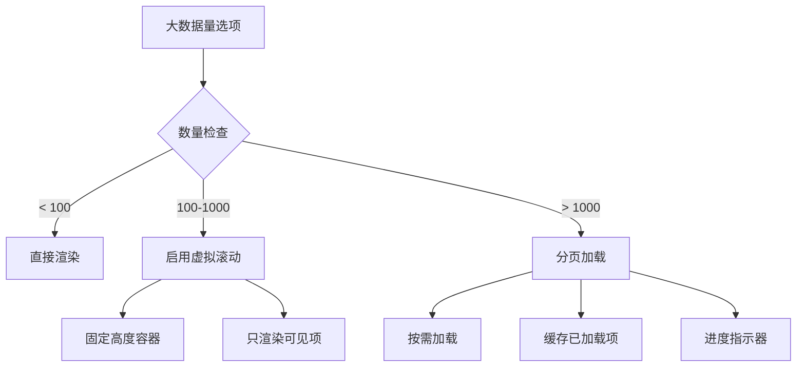

### 性能监控建议

- 监控组件渲染时间
- 检查内存使用情况
- 优化搜索算法复杂度
- 实施防抖和节流机制

## 故障排除指南

### 常见问题及解决方案

#### 1. 选择器不显示或显示异常

**症状：** 选择器无法打开或显示位置错误

**可能原因：**
- 样式冲突
- 容器定位问题
- z-index 层级问题

**解决方案：**
- 检查父容器的定位属性
- 确认 z-index 设置
- 验证样式类名冲突

#### 2. 搜索功能失效

**症状：** 可搜索选择器无法过滤选项

**可能原因：**
- 选项数据格式不正确
- 搜索逻辑错误
- 状态更新问题

**解决方案：**
- 验证 SearchableSelectOption 接口
- 检查过滤算法
- 确认状态同步

#### 3. 键盘导航问题

**症状：** 无法通过键盘操作选择器

**可能原因：**
- 键盘事件未正确绑定
- 焦点管理问题
- 可访问性属性缺失

**解决方案：**
- 检查键盘事件处理器
- 验证焦点状态管理
- 确认 aria 属性设置

### 调试技巧

1. **开发者工具检查**
   - 检查元素层级和样式
   - 验证事件监听器
   - 监控组件状态变化

2. **日志调试**
   - 添加关键路径的日志输出
   - 监控状态变更
   - 跟踪用户交互

3. **单元测试**
   - 测试核心功能
   - 验证边界条件
   - 模拟用户操作

**章节来源**
- [searchable-select.tsx:35-45](file://packages/web/src/components/ui/searchable-select.tsx#L35-L45)
- [searchable-select.tsx:56-59](file://packages/web/src/components/ui/searchable-select.tsx#L56-L59)

## 结论

选择类组件提供了完整且灵活的用户界面解决方案，具有以下优势：

1. **模块化设计**：每个组件都是独立的功能单元，易于维护和扩展
2. **可访问性支持**：基于Radix UI，提供完整的键盘导航和屏幕阅读器支持
3. **现代样式**：使用Tailwind CSS，提供一致的视觉设计
4. **灵活配置**：丰富的配置选项满足不同使用场景
5. **性能优化**：内置的优化策略支持大数据量处理

这些组件在项目中得到了广泛应用，从简单的设置配置到复杂的步骤编辑器都有其身影。通过合理使用这些组件，可以快速构建高质量的用户界面。

未来可以考虑的改进方向：
- 实现完整的虚拟滚动支持
- 增加更多的自定义主题选项
- 扩展多选功能支持
- 提供更丰富的动画效果