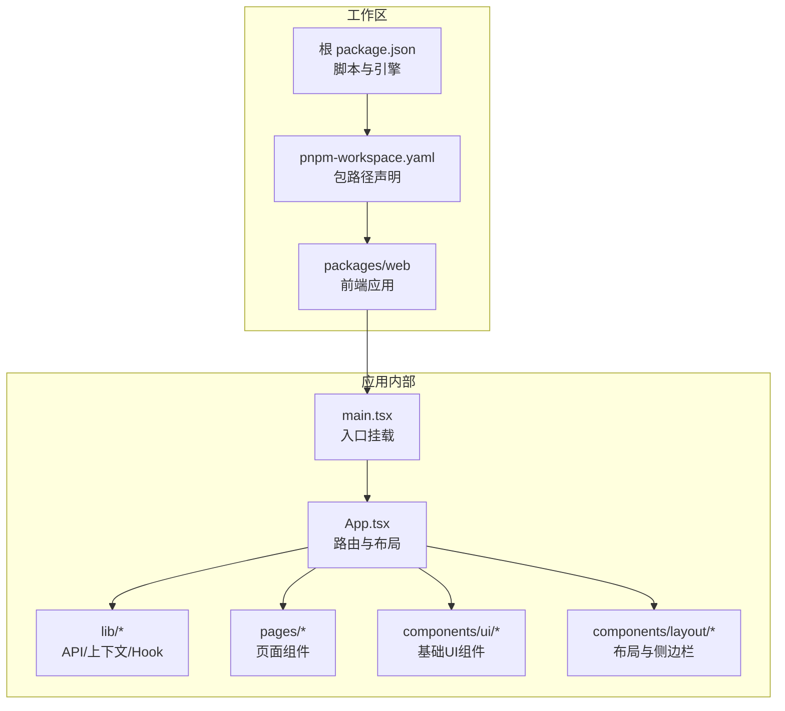
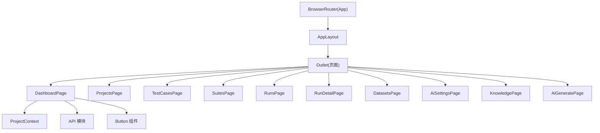
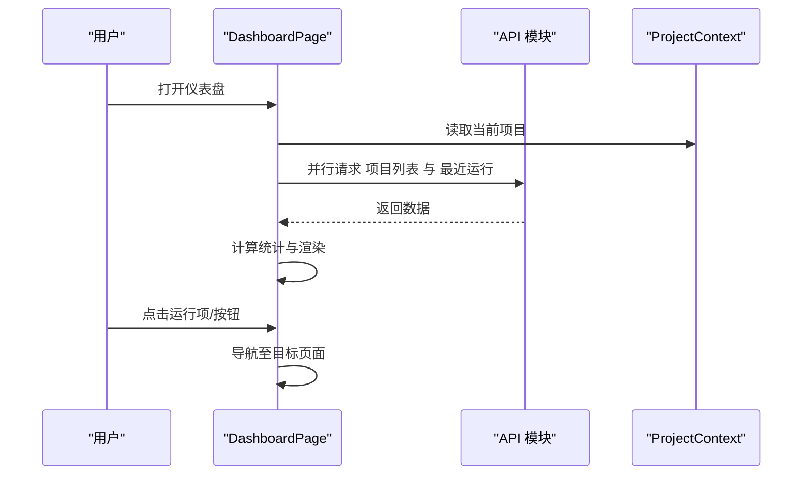
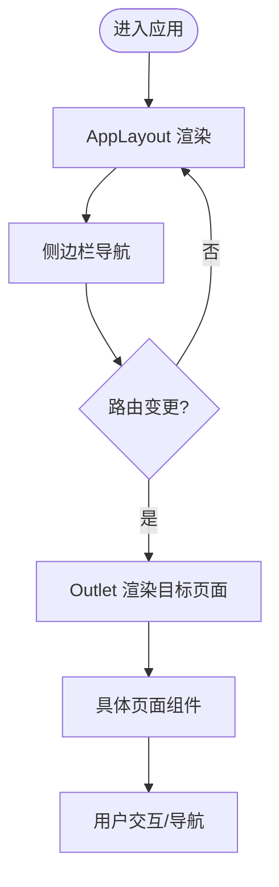
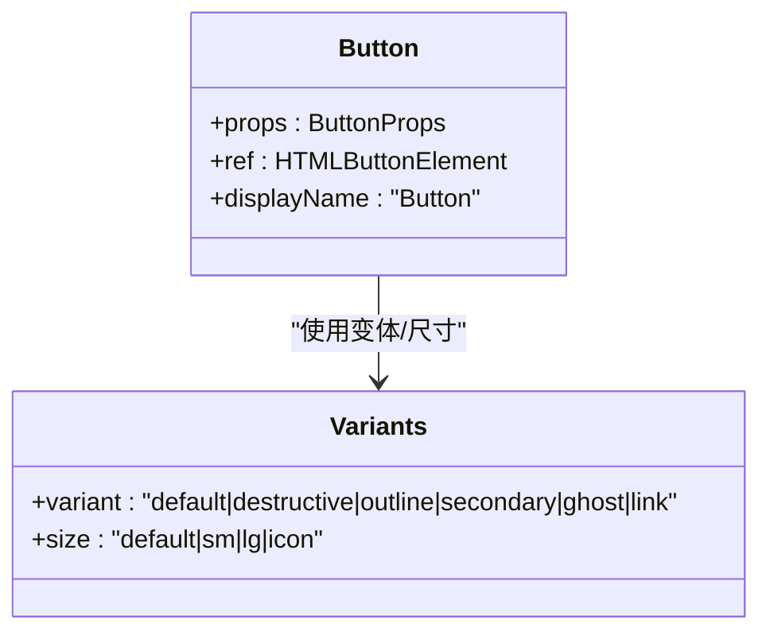
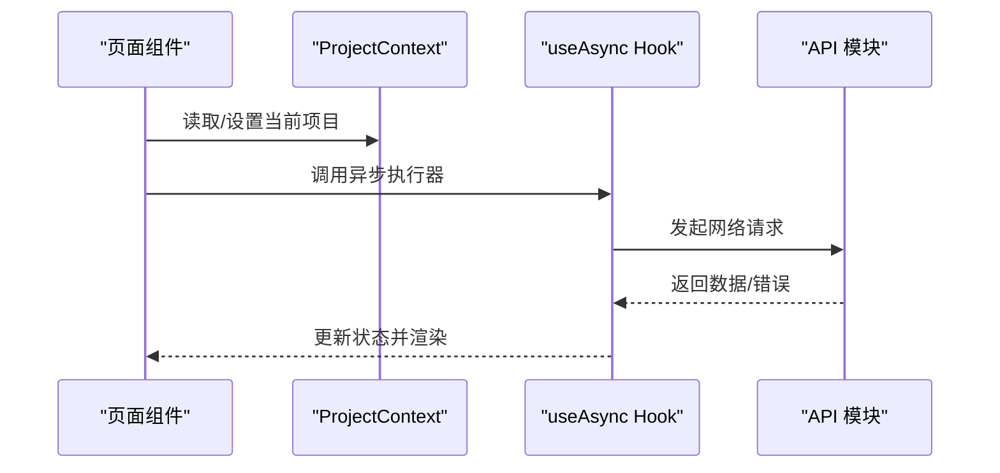
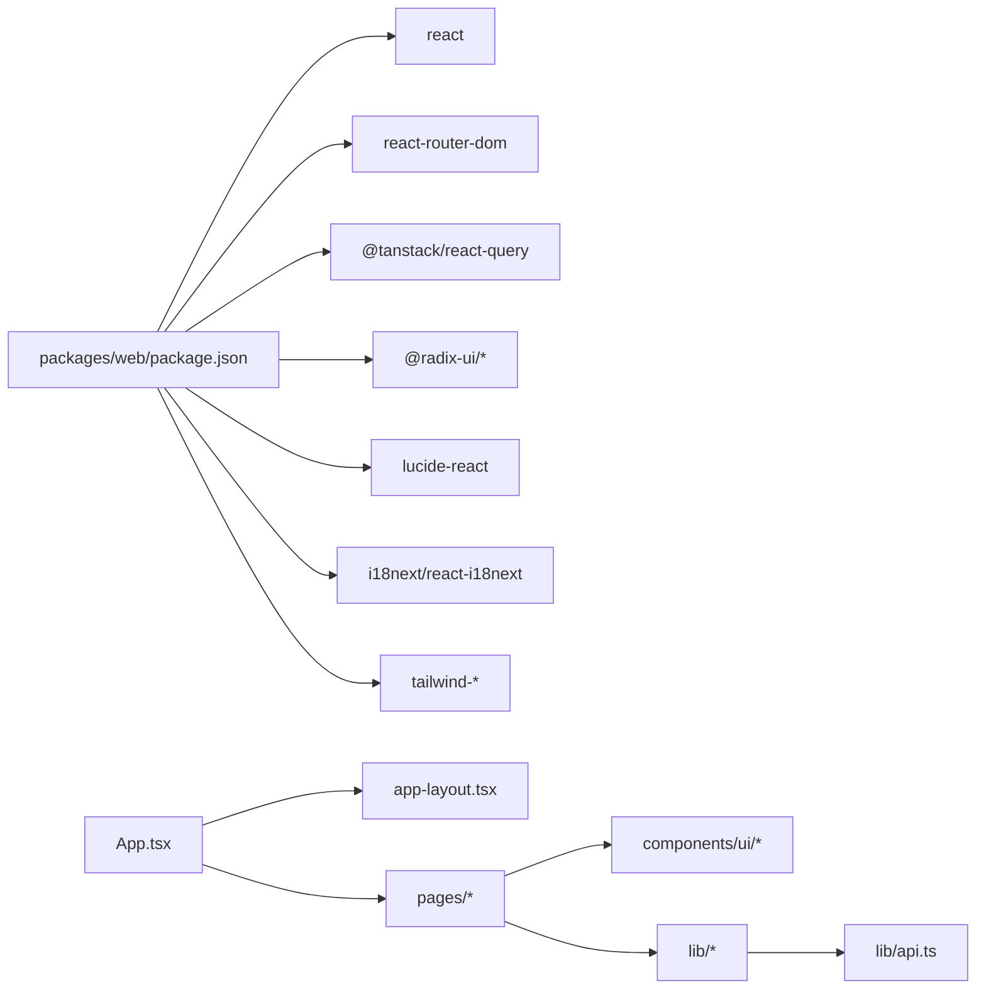

# 前端Web应用

<cite>
**本文引用的文件**
- [package.json](file://package.json)
- [pnpm-workspace.yaml](file://pnpm-workspace.yaml)
- [packages/web/package.json](file://packages/web/package.json)
- [packages/web/src/main.tsx](file://packages/web/src/main.tsx)
- [packages/web/src/App.tsx](file://packages/web/src/App.tsx)
- [packages/web/src/lib/api.ts](file://packages/web/src/lib/api.ts)
- [packages/web/src/lib/hooks.ts](file://packages/web/src/lib/hooks.ts)
- [packages/web/src/lib/project-context.tsx](file://packages/web/src/lib/project-context.tsx)
- [packages/web/src/components/layout/app-layout.tsx](file://packages/web/src/components/layout/app-layout.tsx)
- [packages/web/src/components/layout/sidebar.tsx](file://packages/web/src/components/layout/sidebar.tsx)
- [packages/web/src/components/ui/button.tsx](file://packages/web/src/components/ui/button.tsx)
- [packages/web/src/pages/dashboard.tsx](file://packages/web/src/pages/dashboard.tsx)
</cite>

## 目录
1. [简介](#简介)
2. [项目结构](#项目结构)
3. [核心组件](#核心组件)
4. [架构总览](#架构总览)
5. [详细组件分析](#详细组件分析)
6. [依赖关系分析](#依赖关系分析)
7. [性能考虑](#性能考虑)
8. [故障排查指南](#故障排查指南)
9. [结论](#结论)
10. [附录](#附录)

## 简介
本技术文档面向前端Web应用（基于React 19），系统性阐述应用架构、组件设计模式与状态管理策略；文档化主要页面组件的功能、路由配置与用户交互流程；详解UI组件库的设计原则、组件属性与使用示例；解释React Query在当前代码中的替代方案、数据缓存策略与实时状态同步机制；提供组件开发指南、样式定制方案与响应式设计实现；并包含用户体验优化、无障碍访问支持与性能监控策略。

## 项目结构
该仓库采用多包工作区（pnpm workspace）组织，核心前端应用位于 packages/web。应用通过Vite构建，使用Tailwind CSS进行样式管理，并引入Radix UI组件与Lucide React图标库。国际化通过i18n与react-i18next实现；路由由react-router-dom v7提供；状态管理以本地上下文与自定义Hook为主，未直接使用React Query。

图表来源
- [packages/web/src/main.tsx:1-12](file://packages/web/src/main.tsx#L1-L12)
- [packages/web/src/App.tsx:1-37](file://packages/web/src/App.tsx#L1-L37)

章节来源
- [package.json:1-31](file://package.json#L1-L31)
- [pnpm-workspace.yaml:1-3](file://pnpm-workspace.yaml#L1-L3)
- [packages/web/package.json:1-45](file://packages/web/package.json#L1-L45)

## 核心组件
- 应用入口与挂载：应用通过入口文件创建根节点并渲染顶层组件，启用严格模式。
- 路由与布局：顶层路由配置了多个页面，并以统一布局包裹；布局组件负责侧边栏与主内容区域。
- 项目上下文：提供项目级状态的全局存储与持久化（localStorage），便于跨页面共享当前项目信息。
- 自定义Hook：提供通用异步执行Hook，封装加载、错误与重试逻辑。
- API模块：集中定义后端接口类型与调用方法，统一处理请求、响应与错误。

章节来源
- [packages/web/src/main.tsx:1-12](file://packages/web/src/main.tsx#L1-L12)
- [packages/web/src/App.tsx:1-37](file://packages/web/src/App.tsx#L1-L37)
- [packages/web/src/lib/project-context.tsx:1-33](file://packages/web/src/lib/project-context.tsx#L1-L33)
- [packages/web/src/lib/hooks.ts:1-29](file://packages/web/src/lib/hooks.ts#L1-L29)
- [packages/web/src/lib/api.ts:1-325](file://packages/web/src/lib/api.ts#L1-L325)

## 架构总览
应用采用“路由驱动的页面层 + 组件层 + 服务层”的分层架构。顶层路由负责页面切换，布局组件提供一致的导航与容器；页面组件通过上下文与API模块获取数据；UI组件库遵循变体与尺寸约定，统一风格与可组合性；国际化与主题通过工具类与Tailwind配置实现。

图表来源
- [packages/web/src/App.tsx:1-37](file://packages/web/src/App.tsx#L1-L37)
- [packages/web/src/components/layout/app-layout.tsx:1-16](file://packages/web/src/components/layout/app-layout.tsx#L1-L16)
- [packages/web/src/pages/dashboard.tsx:1-168](file://packages/web/src/pages/dashboard.tsx#L1-L168)
- [packages/web/src/lib/project-context.tsx:1-33](file://packages/web/src/lib/project-context.tsx#L1-L33)
- [packages/web/src/lib/api.ts:1-325](file://packages/web/src/lib/api.ts#L1-L325)
- [packages/web/src/components/ui/button.tsx:1-47](file://packages/web/src/components/ui/button.tsx#L1-L47)

## 详细组件分析

### 页面组件：仪表盘（Dashboard）
- 功能概述：展示项目统计、最近测试运行列表与快速操作入口；根据语言环境显示国际化文案；支持点击跳转到详情页。
- 数据来源：通过API模块并行拉取项目列表与最近运行记录；使用本地项目上下文决定是否提示选择项目。
- 用户交互：卡片点击进入对应页面；运行项点击进入详情页；按钮触发导航。
- 性能与体验：加载态占位；按需渲染最近运行列表；状态徽标与图标直观表达运行状态。

图表来源
- [packages/web/src/pages/dashboard.tsx:1-168](file://packages/web/src/pages/dashboard.tsx#L1-L168)
- [packages/web/src/lib/api.ts:1-325](file://packages/web/src/lib/api.ts#L1-L325)
- [packages/web/src/lib/project-context.tsx:1-33](file://packages/web/src/lib/project-context.tsx#L1-L33)

章节来源
- [packages/web/src/pages/dashboard.tsx:1-168](file://packages/web/src/pages/dashboard.tsx#L1-L168)

### 路由与布局
- 路由配置：顶层路由定义了首页、项目、用例、套件、运行、数据集、AI设置、知识库与AI生成等页面；所有页面均包裹在统一布局中。
- 布局组件：左侧侧边栏与右侧主内容区域，主内容容器限定最大宽度并提供内边距；使用Outlet承载具体页面。
- 交互流程：侧边栏导航触发路由切换；页面组件通过useNavigate实现内部跳转。

图表来源
- [packages/web/src/App.tsx:1-37](file://packages/web/src/App.tsx#L1-L37)
- [packages/web/src/components/layout/app-layout.tsx:1-16](file://packages/web/src/components/layout/app-layout.tsx#L1-L16)

章节来源
- [packages/web/src/App.tsx:1-37](file://packages/web/src/App.tsx#L1-L37)
- [packages/web/src/components/layout/app-layout.tsx:1-16](file://packages/web/src/components/layout/app-layout.tsx#L1-L16)

### UI组件库：Button
- 设计原则：基于变体与尺寸的组合，通过工具类统一风格；支持作为语义标签或透传子元素（Slot）。
- 属性与行为：支持多种变体（默认、破坏性、描边、次级、幽灵、链接）与尺寸（默认、小、大、图标）；支持禁用与焦点可见性。
- 使用示例：在页面中用于导航、操作确认与状态指示等场景。

图表来源
- [packages/web/src/components/ui/button.tsx:1-47](file://packages/web/src/components/ui/button.tsx#L1-L47)

章节来源
- [packages/web/src/components/ui/button.tsx:1-47](file://packages/web/src/components/ui/button.tsx#L1-L47)

### 状态管理策略
- 项目上下文：通过React Context与localStorage实现项目级状态的持久化与跨组件共享；提供setter以更新当前项目并同步到本地存储。
- 自定义Hook：useAsync封装异步函数执行，返回数据、加载与错误状态，并提供refetch能力；适合轻量数据获取与简单缓存控制。
- API模块：集中定义类型与请求方法，统一错误处理与响应格式；页面组件通过API模块与上下文协作完成数据流。

图表来源
- [packages/web/src/lib/project-context.tsx:1-33](file://packages/web/src/lib/project-context.tsx#L1-L33)
- [packages/web/src/lib/hooks.ts:1-29](file://packages/web/src/lib/hooks.ts#L1-L29)
- [packages/web/src/lib/api.ts:1-325](file://packages/web/src/lib/api.ts#L1-L325)

章节来源
- [packages/web/src/lib/project-context.tsx:1-33](file://packages/web/src/lib/project-context.tsx#L1-L33)
- [packages/web/src/lib/hooks.ts:1-29](file://packages/web/src/lib/hooks.ts#L1-L29)
- [packages/web/src/lib/api.ts:1-325](file://packages/web/src/lib/api.ts#L1-L325)

### 数据流与缓存策略
- 当前实现：页面组件在挂载时发起一次性数据请求；部分页面通过Promise.all并行获取多个资源；未使用集中式缓存库。
- 缓存建议：对于频繁访问且不常变化的数据（如项目列表、静态字典），可在Hook层增加内存缓存与失效策略；对长列表可采用分页与增量加载。
- 错误处理：API模块统一抛出错误；页面组件捕获并渲染错误状态；建议增加重试与降级策略。

章节来源
- [packages/web/src/pages/dashboard.tsx:1-168](file://packages/web/src/pages/dashboard.tsx#L1-L168)
- [packages/web/src/lib/api.ts:1-325](file://packages/web/src/lib/api.ts#L1-L325)

### 实时状态同步机制
- 当前实现：未发现WebSocket或订阅机制；页面通过手动刷新或导航后重新请求数据。
- 同步建议：对运行状态等需要实时性的数据，可引入轮询或事件推送；结合本地状态与缓存策略，减少重复请求与抖动。

章节来源
- [packages/web/src/pages/dashboard.tsx:1-168](file://packages/web/src/pages/dashboard.tsx#L1-L168)
- [packages/web/src/lib/api.ts:1-325](file://packages/web/src/lib/api.ts#L1-L325)

## 依赖关系分析
- 外部依赖：React 19、react-router-dom v7、@tanstack/react-query（已声明但未在当前代码中使用）、Radix UI组件、Lucide React图标、i18n与react-i18next、Tailwind CSS生态。
- 内部依赖：页面组件依赖布局、UI组件与API模块；API模块依赖类型定义；上下文与Hook为跨组件共享与复用提供支撑。

图表来源
- [packages/web/package.json:1-45](file://packages/web/package.json#L1-L45)
- [packages/web/src/App.tsx:1-37](file://packages/web/src/App.tsx#L1-L37)
- [packages/web/src/components/layout/app-layout.tsx:1-16](file://packages/web/src/components/layout/app-layout.tsx#L1-L16)
- [packages/web/src/lib/api.ts:1-325](file://packages/web/src/lib/api.ts#L1-L325)

章节来源
- [packages/web/package.json:1-45](file://packages/web/package.json#L1-L45)

## 性能考虑
- 首屏与懒加载：对非首屏页面与重型组件可采用动态导入与Suspense；避免阻塞主线程。
- 列表渲染：对长列表使用虚拟滚动与分页；仅渲染可视区域内的元素。
- 缓存与去抖：对高频查询增加防抖与缓存；合并多次请求为批量请求。
- 图标与样式：使用矢量图标与原子化CSS，减少体积与重绘；避免不必要的类名拼接。
- 监控与分析：集成性能指标采集（如CLS、FCP、INP），在开发与生产环境分别配置采样率。

## 故障排查指南
- 路由无法匹配：检查路由路径与嵌套层级，确保页面组件正确注册在顶层路由下。
- 国际化文案缺失：确认i18n初始化与命名空间配置；检查翻译键是否存在。
- 项目上下文异常：检查localStorage读写权限与JSON序列化；确认上下文Provider包裹范围。
- 请求失败：查看API模块错误处理分支；核对后端接口路径与鉴权头；在网络面板中定位具体错误码。
- UI样式错乱：检查Tailwind配置与变体类名；确认组件尺寸与变体参数一致。

章节来源
- [packages/web/src/App.tsx:1-37](file://packages/web/src/App.tsx#L1-L37)
- [packages/web/src/lib/project-context.tsx:1-33](file://packages/web/src/lib/project-context.tsx#L1-L33)
- [packages/web/src/lib/api.ts:1-325](file://packages/web/src/lib/api.ts#L1-L325)

## 结论
该前端应用以清晰的分层架构与模块化组件实现业务功能，路由与布局统一、UI组件库规范一致。当前状态管理与数据流以上下文与自定义Hook为主，API模块集中化处理请求与类型定义。建议后续引入React Query或类似库以完善缓存与并发控制；对实时性需求引入轮询或事件推送；持续优化性能与可观测性，提升用户体验与可维护性。

## 附录
- 组件开发指南
  - 变体与尺寸：优先使用UI组件库提供的变体与尺寸，保持一致性。
  - 可组合性：利用Slot与className扩展，避免过度封装。
  - 可访问性：为交互元素提供aria-label与键盘导航；为图片与图标提供替代文本。
- 样式定制方案
  - Tailwind：通过变体类名与工具类组合实现样式；必要时扩展配置文件。
  - 主题：通过CSS变量与暗色模式开关实现主题切换。
- 响应式设计
  - 移动优先：使用断点与网格系统适配不同屏幕；保证触摸目标尺寸与间距。
- 无障碍访问
  - 语义化标签：使用正确的HTML语义与ARIA属性。
  - 键盘可达：Tab顺序合理，焦点可见，快捷键提示。
- 性能监控
  - 指标采集：FID/LCP/CLS/TTFB等；区分开发与生产环境采样。
  - 分析与告警：建立阈值与告警规则，定期回顾性能趋势。