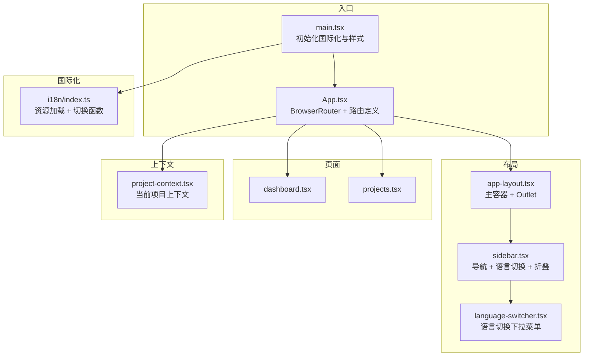
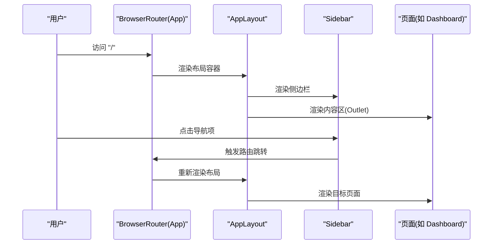
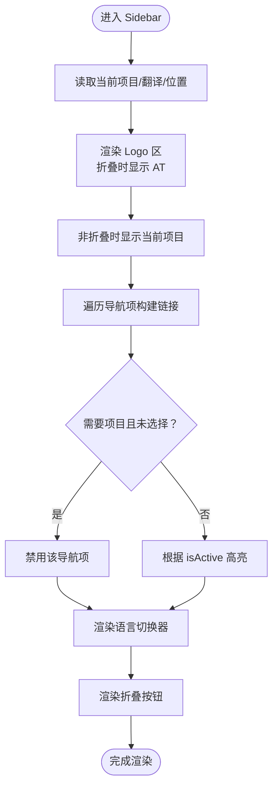
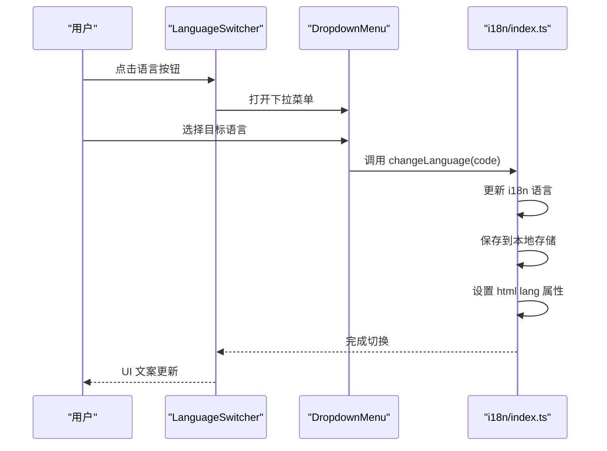
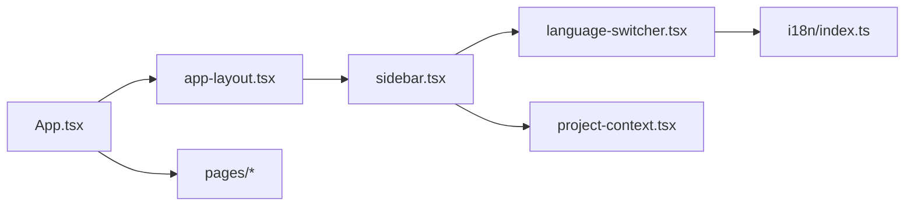

# 布局与导航

<cite>
**本文引用的文件**
- [packages/web/src/components/layout/app-layout.tsx](file://packages/web/src/components/layout/app-layout.tsx)
- [packages/web/src/components/layout/sidebar.tsx](file://packages/web/src/components/layout/sidebar.tsx)
- [packages/web/src/components/layout/language-switcher.tsx](file://packages/web/src/components/layout/language-switcher.tsx)
- [packages/web/src/App.tsx](file://packages/web/src/App.tsx)
- [packages/web/src/main.tsx](file://packages/web/src/main.tsx)
- [packages/web/src/i18n/index.ts](file://packages/web/src/i18n/index.ts)
- [packages/web/src/lib/project-context.tsx](file://packages/web/src/lib/project-context.tsx)
- [packages/web/src/lib/hooks.ts](file://packages/web/src/lib/hooks.ts)
- [packages/web/src/pages/dashboard.tsx](file://packages/web/src/pages/dashboard.tsx)
- [packages/web/src/pages/projects.tsx](file://packages/web/src/pages/projects.tsx)
</cite>

## 目录
1. [简介](#简介)
2. [项目结构](#项目结构)
3. [核心组件](#核心组件)
4. [架构总览](#架构总览)
5. [组件详解](#组件详解)
6. [依赖关系分析](#依赖关系分析)
7. [性能考量](#性能考量)
8. [故障排查指南](#故障排查指南)
9. [结论](#结论)
10. [附录](#附录)

## 简介
本文件面向布局与导航系统，系统性阐述应用的整体布局设计、导航结构与用户体验优化。重点覆盖以下方面：
- 响应式布局与容器划分：主容器、内容区、滚动与尺寸控制
- 侧边栏导航的展开/收起机制与交互细节
- 多语言切换功能与国际化初始化
- 导航状态管理（激活态、禁用态）与面包屑生成思路
- 页面标题动态更新机制
- 嵌套关系与移动端适配策略
- 性能优化建议、CSS 变量与主题切换方案

## 项目结构
Web 应用采用分层组织方式：
- 组件层：布局组件位于 layout 目录，包含应用级布局、侧边栏与语言切换器
- 页面层：各业务页面位于 pages 目录，通过路由挂载在布局之下
- 国际化：i18n 目录提供资源与切换逻辑
- 上下文：项目上下文用于跨组件共享当前项目选择
- 入口：main.tsx 初始化国际化与样式后挂载根组件 App

图表来源
- [packages/web/src/main.tsx:1-12](file://packages/web/src/main.tsx#L1-L12)
- [packages/web/src/App.tsx:15-36](file://packages/web/src/App.tsx#L15-L36)
- [packages/web/src/components/layout/app-layout.tsx:4-15](file://packages/web/src/components/layout/app-layout.tsx#L4-L15)
- [packages/web/src/components/layout/sidebar.tsx:33-106](file://packages/web/src/components/layout/sidebar.tsx#L33-L106)
- [packages/web/src/components/layout/language-switcher.tsx:18-50](file://packages/web/src/components/layout/language-switcher.tsx#L18-L50)
- [packages/web/src/i18n/index.ts:10-26](file://packages/web/src/i18n/index.ts#L10-L26)
- [packages/web/src/lib/project-context.tsx:11-28](file://packages/web/src/lib/project-context.tsx#L11-L28)

章节来源
- [packages/web/src/main.tsx:1-12](file://packages/web/src/main.tsx#L1-L12)
- [packages/web/src/App.tsx:15-36](file://packages/web/src/App.tsx#L15-L36)

## 核心组件
- 应用布局 AppLayout：提供全屏横向布局，左侧为侧边栏，右侧为主内容区，使用容器约束最大宽度并内边距
- 侧边栏 Sidebar：包含 Logo 区、当前项目指示、导航项列表、语言切换器与折叠按钮；支持根据状态切换宽度与文本显示
- 语言切换 LanguageSwitcher：基于下拉菜单展示可用语言，点击切换并持久化到本地存储
- 项目上下文 ProjectContext：提供当前项目选择的全局状态与持久化
- 国际化 i18n：初始化资源、默认语言、切换函数与 HTML lang 属性设置

章节来源
- [packages/web/src/components/layout/app-layout.tsx:4-15](file://packages/web/src/components/layout/app-layout.tsx#L4-L15)
- [packages/web/src/components/layout/sidebar.tsx:33-106](file://packages/web/src/components/layout/sidebar.tsx#L33-L106)
- [packages/web/src/components/layout/language-switcher.tsx:18-50](file://packages/web/src/components/layout/language-switcher.tsx#L18-L50)
- [packages/web/src/lib/project-context.tsx:11-28](file://packages/web/src/lib/project-context.tsx#L11-L28)
- [packages/web/src/i18n/index.ts:10-26](file://packages/web/src/i18n/index.ts#L10-L26)

## 架构总览
应用采用“布局 + 页面”的路由嵌套模式：
- App 根组件包裹 BrowserRouter，注册所有页面路由
- 所有页面路由均以 AppLayout 作为父级容器，内部渲染 Outlet
- 侧边栏在布局中固定存在，随路由变化仅改变内容区

图表来源
- [packages/web/src/App.tsx:15-36](file://packages/web/src/App.tsx#L15-L36)
- [packages/web/src/components/layout/app-layout.tsx:4-15](file://packages/web/src/components/layout/app-layout.tsx#L4-L15)
- [packages/web/src/components/layout/sidebar.tsx:33-106](file://packages/web/src/components/layout/sidebar.tsx#L33-L106)

## 组件详解

### 应用布局 AppLayout
- 结构职责
  - 主容器：全屏高度、横向布局、溢出隐藏
  - 内容区：flex-1 占满剩余空间，垂直滚动，容器约束最大宽度与内边距
  - Outlet：承载当前路由页面
- 响应式与滚动
  - 通过容器约束内容宽度，避免在超宽屏下内容过散
  - 内容区单独滚动，不影响侧边栏
- 与页面的关系
  - 所有页面路由均包裹在 AppLayout 下，形成统一的导航与内容结构

章节来源
- [packages/web/src/components/layout/app-layout.tsx:4-15](file://packages/web/src/components/layout/app-layout.tsx#L4-L15)

### 侧边栏 Sidebar
- 导航项配置
  - 使用数组集中声明导航项，包含目标路径、图标、文案键值与“需要项目”条件
  - 通过 needsProject 字段控制是否启用
- 激活态与禁用态
  - 使用 NavLink 的 isActive 状态高亮当前页
  - 当需要项目但未选择时，禁用导航项并提示不可用
- 折叠机制
  - 通过本地状态控制 collapsed，影响宽度与文字显示
  - 折叠时仅保留图标与紧凑布局，节省空间
- 项目指示
  - 在非折叠状态下显示当前项目名称
- 语言切换器
  - 将 LanguageSwitcher 注入到侧边栏底部，支持折叠状态下的图标显示
- 交互细节
  - 折叠按钮使用图标切换方向
  - 使用过渡动画平滑宽度变化

图表来源
- [packages/web/src/components/layout/sidebar.tsx:33-106](file://packages/web/src/components/layout/sidebar.tsx#L33-L106)

章节来源
- [packages/web/src/components/layout/sidebar.tsx:21-31](file://packages/web/src/components/layout/sidebar.tsx#L21-L31)
- [packages/web/src/components/layout/sidebar.tsx:67-90](file://packages/web/src/components/layout/sidebar.tsx#L67-L90)
- [packages/web/src/components/layout/sidebar.tsx:97-103](file://packages/web/src/components/layout/sidebar.tsx#L97-L103)

### 语言切换 LanguageSwitcher
- 功能要点
  - 下拉菜单展示可用语言，当前语言高亮
  - 点击切换语言，调用 changeLanguage 并持久化到本地存储
  - 根据侧边栏折叠状态调整按钮布局（紧凑或展开）
- 国际化初始化
  - i18n 资源包含中英文两套
  - 默认语言从本地存储恢复，未设置则回退英文
  - 切换语言时同步设置 document.documentElement.lang

图表来源
- [packages/web/src/components/layout/language-switcher.tsx:18-50](file://packages/web/src/components/layout/language-switcher.tsx#L18-L50)
- [packages/web/src/i18n/index.ts:22-26](file://packages/web/src/i18n/index.ts#L22-L26)

章节来源
- [packages/web/src/components/layout/language-switcher.tsx:13-16](file://packages/web/src/components/layout/language-switcher.tsx#L13-L16)
- [packages/web/src/components/layout/language-switcher.tsx:22-48](file://packages/web/src/components/layout/language-switcher.tsx#L22-L48)
- [packages/web/src/i18n/index.ts:10-26](file://packages/web/src/i18n/index.ts#L10-L26)

### 导航状态管理与面包屑生成
- 激活态管理
  - 通过 NavLink 的 isActive 自动高亮当前页
  - 禁用态通过条件判断阻止跳转并显示不可用样式
- 面包屑生成思路
  - 当前导航项来源于路由层级与侧边栏配置
  - 可扩展：基于路由路径与页面标题映射生成面包屑
  - 建议：在页面层维护标题映射表，结合 useLocation 动态生成
- 页面标题动态更新
  - 页面组件可使用 useTranslation 获取标题文案
  - 建议：在页面组件中设置 document.title 或使用第三方库统一管理

章节来源
- [packages/web/src/components/layout/sidebar.tsx:71-83](file://packages/web/src/components/layout/sidebar.tsx#L71-L83)
- [packages/web/src/pages/dashboard.tsx:41-46](file://packages/web/src/pages/dashboard.tsx#L41-L46)
- [packages/web/src/pages/projects.tsx:69-74](file://packages/web/src/pages/projects.tsx#L69-L74)

### 嵌套关系与移动端适配
- 嵌套关系
  - AppLayout -> Sidebar + Outlet
  - 所有页面路由均挂载在 AppLayout 下
- 移动端适配策略
  - 侧边栏支持折叠，适合窄屏设备
  - 内容区容器限制最大宽度，避免在小屏下过度拉伸
  - 建议：在更小屏幕下可考虑将导航改为顶部抽屉或汉堡菜单

章节来源
- [packages/web/src/components/layout/app-layout.tsx:8-12](file://packages/web/src/components/layout/app-layout.tsx#L8-L12)
- [packages/web/src/components/layout/sidebar.tsx:40-44](file://packages/web/src/components/layout/sidebar.tsx#L40-L44)

### 项目上下文与导航联动
- 项目上下文
  - 提供 current 与 setCurrent，支持本地持久化
  - 导航项中的 needsProject 条件会根据 current 是否为空决定启用/禁用
- 用户体验
  - 未选择项目时，部分需要项目的导航项被禁用，避免无效跳转
  - 选择项目后自动启用相关导航项

章节来源
- [packages/web/src/lib/project-context.tsx:11-28](file://packages/web/src/lib/project-context.tsx#L11-L28)
- [packages/web/src/components/layout/sidebar.tsx:68-75](file://packages/web/src/components/layout/sidebar.tsx#L68-L75)

## 依赖关系分析
- 组件耦合
  - AppLayout 依赖 Sidebar 与 Outlet
  - Sidebar 依赖 i18n、项目上下文与语言切换器
  - LanguageSwitcher 依赖 i18n 切换函数
- 外部依赖
  - react-router-dom：路由与导航
  - lucide-react：图标
  - i18next：国际化
  - Tailwind CSS：样式与响应式

图表来源
- [packages/web/src/App.tsx:15-36](file://packages/web/src/App.tsx#L15-L36)
- [packages/web/src/components/layout/app-layout.tsx:1-2](file://packages/web/src/components/layout/app-layout.tsx#L1-L2)
- [packages/web/src/components/layout/sidebar.tsx:1-18](file://packages/web/src/components/layout/sidebar.tsx#L1-L18)
- [packages/web/src/components/layout/language-switcher.tsx:1-11](file://packages/web/src/components/layout/language-switcher.tsx#L1-L11)
- [packages/web/src/lib/project-context.tsx:1-32](file://packages/web/src/lib/project-context.tsx#L1-L32)
- [packages/web/src/i18n/index.ts:1-31](file://packages/web/src/i18n/index.ts#L1-L31)

## 性能考量
- 渲染优化
  - 侧边栏折叠使用本地状态，避免不必要的重渲染
  - 导航项列表按需渲染，禁用态不绑定事件处理器
- 资源加载
  - 国际化资源在应用启动时一次性初始化，减少运行时切换成本
- 滚动与布局
  - 内容区独立滚动，减少布局抖动
  - 容器限制最大宽度，降低大屏下的绘制压力
- 建议
  - 对导航项进行虚拟化（当数量增长时）
  - 将语言切换器置于懒加载模块中（如需进一步优化）

## 故障排查指南
- 语言切换无效
  - 检查 changeLanguage 是否正确调用并写入本地存储
  - 确认 document.documentElement.lang 已更新
- 导航项无法点击
  - 检查 needsProject 条件与当前项目状态
  - 确认禁用态逻辑未误判
- 侧边栏宽度异常
  - 检查 collapsed 状态与过渡类名
  - 确认容器宽度计算与 Tailwind 类组合无冲突
- 页面标题未更新
  - 确认页面组件已设置 document.title 或使用统一标题管理方案

章节来源
- [packages/web/src/i18n/index.ts:22-26](file://packages/web/src/i18n/index.ts#L22-L26)
- [packages/web/src/components/layout/sidebar.tsx:68-75](file://packages/web/src/components/layout/sidebar.tsx#L68-L75)
- [packages/web/src/components/layout/sidebar.tsx:40-44](file://packages/web/src/components/layout/sidebar.tsx#L40-L44)

## 结论
该布局与导航系统以简洁的嵌套路由与组件化设计实现了清晰的结构与良好的可维护性。侧边栏的折叠机制与语言切换功能提升了多场景下的可用性。建议后续在页面标题管理与面包屑生成上引入统一方案，并在导航项数量增长时考虑虚拟化与懒加载策略。

## 附录
- 主题切换实现建议
  - 使用 CSS 变量统一管理颜色与阴影
  - 在根节点切换类名或变量集合，实现明暗主题快速切换
  - 将主题偏好持久化到本地存储并在应用启动时恢复
- CSS 变量使用
  - 在全局样式中定义变量，组件中通过变量引用
  - 避免硬编码颜色，提升主题一致性与可扩展性