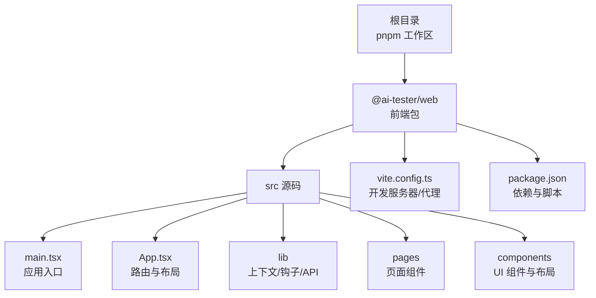
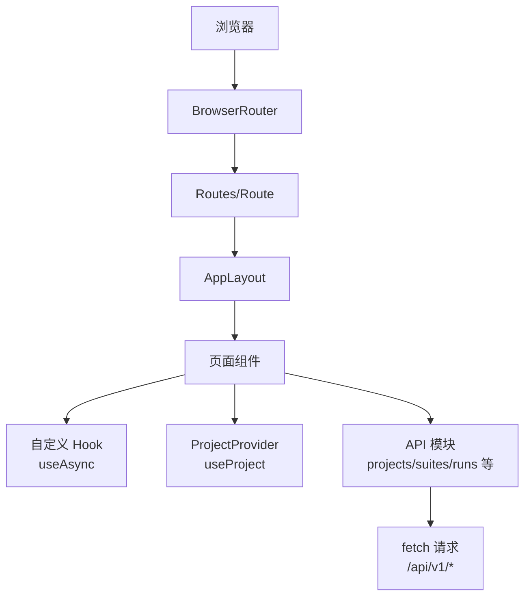
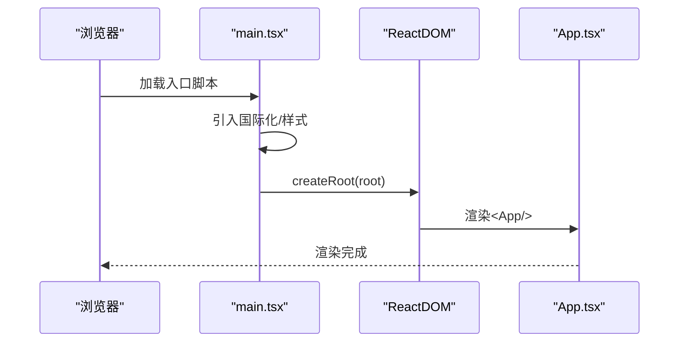
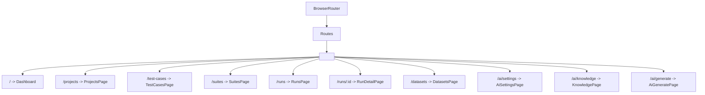
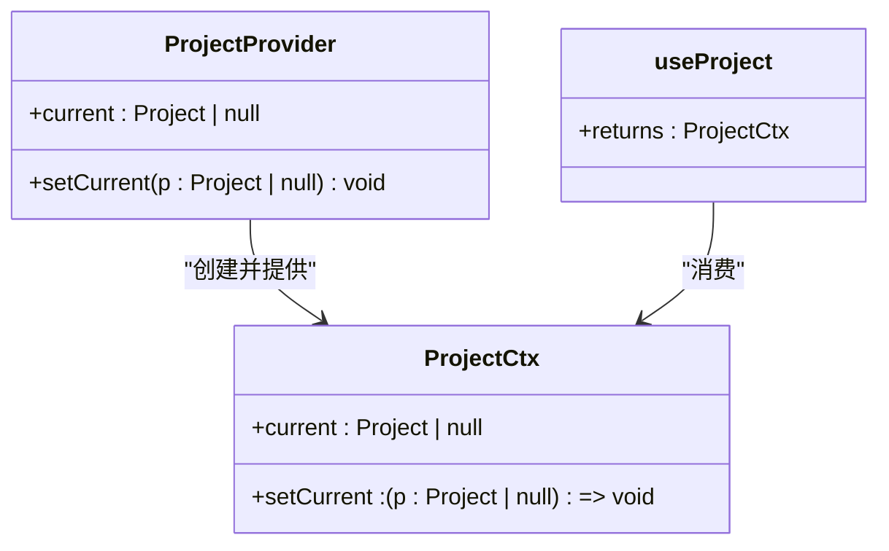
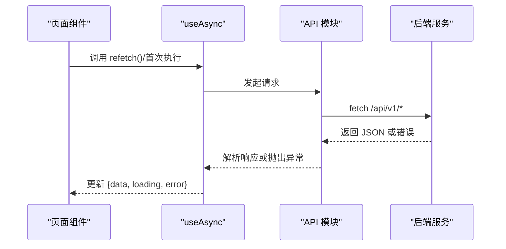
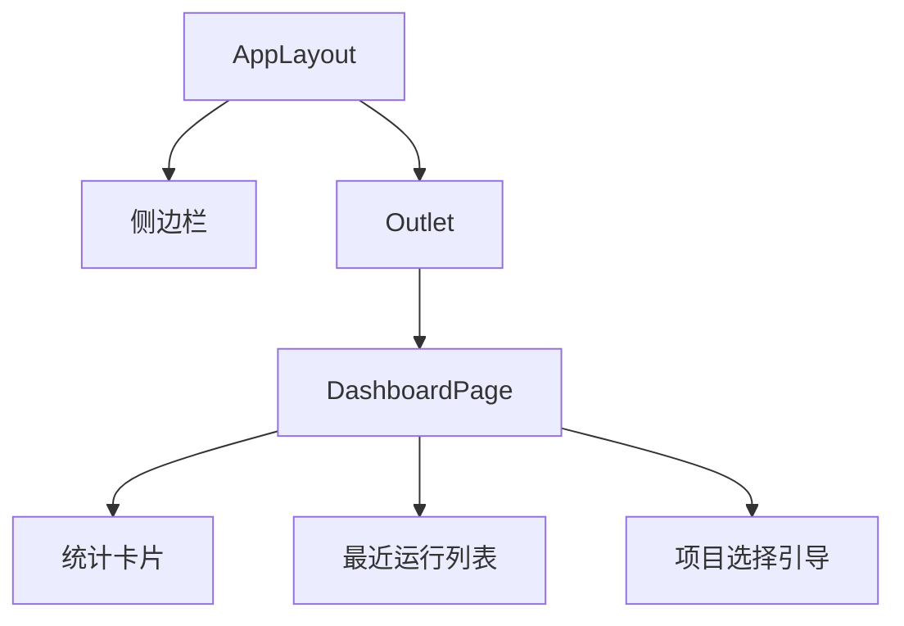
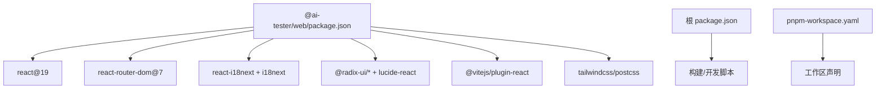

# 应用架构

<cite>
**本文引用的文件**
- [packages/web/src/main.tsx](file://packages/web/src/main.tsx)
- [packages/web/src/App.tsx](file://packages/web/src/App.tsx)
- [packages/web/src/lib/project-context.tsx](file://packages/web/src/lib/project-context.tsx)
- [packages/web/src/lib/hooks.ts](file://packages/web/src/lib/hooks.ts)
- [packages/web/src/lib/api.ts](file://packages/web/src/lib/api.ts)
- [packages/web/src/components/layout/app-layout.tsx](file://packages/web/src/components/layout/app-layout.tsx)
- [packages/web/src/pages/dashboard.tsx](file://packages/web/src/pages/dashboard.tsx)
- [packages/web/vite.config.ts](file://packages/web/vite.config.ts)
- [packages/web/package.json](file://packages/web/package.json)
- [package.json](file://package.json)
- [pnpm-workspace.yaml](file://pnpm-workspace.yaml)
</cite>

## 目录
1. [简介](#简介)
2. [项目结构](#项目结构)
3. [核心组件](#核心组件)
4. [架构总览](#架构总览)
5. [详细组件分析](#详细组件分析)
6. [依赖分析](#依赖分析)
7. [性能考虑](#性能考虑)
8. [故障排查指南](#故障排查指南)
9. [结论](#结论)
10. [附录](#附录)

## 简介
本技术文档面向一个基于 React 19 的 Web 应用，系统性阐述其整体架构设计、组件层次结构与状态管理模式。文档重点覆盖以下方面：
- 应用入口点配置与初始化流程
- 路由系统设计与页面组织
- 上下文提供者与作用域管理（项目上下文）
- 全局状态共享与依赖注入机制
- 错误边界处理与性能优化策略
- 组件生命周期管理与内存泄漏防护
- 开发工具与构建配置集成

该应用采用多包工作区（pnpm workspaces）组织，前端位于 packages/web，后端服务通过本地代理访问。

## 项目结构
应用采用“多包工作区 + 单页前端”的组织方式：
- 根目录通过 pnpm 工作区声明所有子包
- 前端包 @ai-tester/web 包含页面、组件、国际化、API 封装与构建配置
- 构建与开发工具链：Vite + React 19 + TypeScript；TailwindCSS 作为样式基础

图表来源
- [pnpm-workspace.yaml:1-3](file://pnpm-workspace.yaml#L1-L3)
- [packages/web/src/main.tsx:1-12](file://packages/web/src/main.tsx#L1-L12)
- [packages/web/src/App.tsx:1-37](file://packages/web/src/App.tsx#L1-L37)
- [packages/web/vite.config.ts:1-22](file://packages/web/vite.config.ts#L1-L22)
- [packages/web/package.json:1-45](file://packages/web/package.json#L1-L45)

章节来源
- [pnpm-workspace.yaml:1-3](file://pnpm-workspace.yaml#L1-L3)
- [package.json:1-31](file://package.json#L1-L31)
- [packages/web/package.json:1-45](file://packages/web/package.json#L1-L45)

## 核心组件
本节聚焦应用的关键构件及其职责：
- 应用入口与初始化：负责挂载根节点、引入国际化与样式
- 应用根组件：集中定义路由、布局与上下文提供者
- 项目上下文：提供当前项目选择与持久化存储
- 自定义 Hook：封装异步数据加载与重试逻辑
- API 层：统一请求封装与类型定义
- 页面组件：业务页面，组合 UI 组件与上下文
- 布局组件：页面容器与侧边栏组织

章节来源
- [packages/web/src/main.tsx:1-12](file://packages/web/src/main.tsx#L1-L12)
- [packages/web/src/App.tsx:1-37](file://packages/web/src/App.tsx#L1-L37)
- [packages/web/src/lib/project-context.tsx:1-33](file://packages/web/src/lib/project-context.tsx#L1-L33)
- [packages/web/src/lib/hooks.ts:1-29](file://packages/web/src/lib/hooks.ts#L1-L29)
- [packages/web/src/lib/api.ts:1-325](file://packages/web/src/lib/api.ts#L1-L325)
- [packages/web/src/pages/dashboard.tsx:1-168](file://packages/web/src/pages/dashboard.tsx#L1-L168)
- [packages/web/src/components/layout/app-layout.tsx:1-16](file://packages/web/src/components/layout/app-layout.tsx#L1-L16)

## 架构总览
应用采用“路由驱动 + 上下文提供者 + API 封装”的分层架构：
- 视图层：页面组件与 UI 组件
- 路由层：BrowserRouter + Routes 定义页面路径
- 上下文层：ProjectProvider 提供项目级作用域状态
- 数据层：API 模块封装请求与类型，页面通过自定义 Hook 触发数据加载

图表来源
- [packages/web/src/App.tsx:1-37](file://packages/web/src/App.tsx#L1-L37)
- [packages/web/src/components/layout/app-layout.tsx:1-16](file://packages/web/src/components/layout/app-layout.tsx#L1-L16)
- [packages/web/src/lib/project-context.tsx:1-33](file://packages/web/src/lib/project-context.tsx#L1-L33)
- [packages/web/src/lib/hooks.ts:1-29](file://packages/web/src/lib/hooks.ts#L1-L29)
- [packages/web/src/lib/api.ts:1-325](file://packages/web/src/lib/api.ts#L1-L325)

## 详细组件分析

### 应用入口与初始化
- 入口文件负责：
  - 引入国际化与全局样式
  - 使用 ReactDOM.createRoot 渲染根组件
  - 在严格模式下运行以捕获潜在问题
- 初始化流程：
  - 启动 Vite 开发服务器（默认端口），并配置 /api 前缀代理到后端服务
  - 通过别名 @ 指向 src，简化导入路径

图表来源
- [packages/web/src/main.tsx:1-12](file://packages/web/src/main.tsx#L1-L12)
- [packages/web/vite.config.ts:12-21](file://packages/web/vite.config.ts#L12-L21)

章节来源
- [packages/web/src/main.tsx:1-12](file://packages/web/src/main.tsx#L1-L12)
- [packages/web/vite.config.ts:1-22](file://packages/web/vite.config.ts#L1-L22)

### 路由系统设计
- 路由采用 React Router v7 的 BrowserRouter + Routes/Route 结构
- 根路由包裹在 AppLayout 中，统一侧边栏与主内容区域
- 页面路径覆盖仪表盘、项目、测试用例、套件、运行记录、数据集、AI 设置与知识库等
- 运行详情页支持动态参数 id

图表来源
- [packages/web/src/App.tsx:15-36](file://packages/web/src/App.tsx#L15-L36)
- [packages/web/src/components/layout/app-layout.tsx:4-15](file://packages/web/src/components/layout/app-layout.tsx#L4-L15)

章节来源
- [packages/web/src/App.tsx:1-37](file://packages/web/src/App.tsx#L1-L37)
- [packages/web/src/components/layout/app-layout.tsx:1-16](file://packages/web/src/components/layout/app-layout.tsx#L1-L16)

### 上下文提供者与作用域管理
- 项目上下文（ProjectProvider）：
  - 使用 React createContext/useState 实现
  - 支持设置当前项目，并持久化到 localStorage
  - 提供 useProject 钩子供页面使用
- 作用域与依赖注入：
  - App 根组件内提供上下文，页面通过 useProject 获取当前项目信息
  - 用于控制页面行为（如未选项目时引导跳转）

图表来源
- [packages/web/src/lib/project-context.tsx:1-33](file://packages/web/src/lib/project-context.tsx#L1-L33)

章节来源
- [packages/web/src/lib/project-context.tsx:1-33](file://packages/web/src/lib/project-context.tsx#L1-L33)
- [packages/web/src/App.tsx:17-34](file://packages/web/src/App.tsx#L17-L34)

### 全局状态共享与数据流
- 页面通过自定义 Hook useAsync 执行异步操作，统一处理 loading/error/data/refetch
- API 层以模块化方式导出各资源的 CRUD 方法，统一请求封装与错误处理
- 页面组件在 useEffect 中触发数据加载，避免重复请求

图表来源
- [packages/web/src/lib/hooks.ts:5-28](file://packages/web/src/lib/hooks.ts#L5-L28)
- [packages/web/src/lib/api.ts:3-12](file://packages/web/src/lib/api.ts#L3-L12)
- [packages/web/src/pages/dashboard.tsx:19-28](file://packages/web/src/pages/dashboard.tsx#L19-L28)

章节来源
- [packages/web/src/lib/hooks.ts:1-29](file://packages/web/src/lib/hooks.ts#L1-L29)
- [packages/web/src/lib/api.ts:1-325](file://packages/web/src/lib/api.ts#L1-L325)
- [packages/web/src/pages/dashboard.tsx:1-168](file://packages/web/src/pages/dashboard.tsx#L1-L168)

### 页面与布局
- AppLayout 提供统一布局：左侧侧边栏 + 右侧主内容区域，主内容通过 Outlet 渲染当前路由页面
- DashboardPage 展示统计卡片、最近运行列表与项目选择引导，演示上下文与 API 的协同使用

图表来源
- [packages/web/src/components/layout/app-layout.tsx:4-15](file://packages/web/src/components/layout/app-layout.tsx#L4-L15)
- [packages/web/src/pages/dashboard.tsx:11-139](file://packages/web/src/pages/dashboard.tsx#L11-L139)

章节来源
- [packages/web/src/components/layout/app-layout.tsx:1-16](file://packages/web/src/components/layout/app-layout.tsx#L1-L16)
- [packages/web/src/pages/dashboard.tsx:1-168](file://packages/web/src/pages/dashboard.tsx#L1-L168)

## 依赖分析
- 前端依赖（React 19 + 生态）：
  - 路由：react-router-dom
  - 国际化：react-i18next + i18next
  - UI：@radix-ui/* 系列组件
  - 图标：lucide-react
  - 状态与查询：@tanstack/react-query（声明于依赖中）
- 构建与工具：
  - Vite 插件：@vitejs/plugin-react
  - 样式：TailwindCSS + PostCSS
- 工作区与脚本：
  - pnpm workspaces 声明所有包
  - 根与前端包分别提供 dev/build/typecheck 等脚本

图表来源
- [packages/web/package.json:13-33](file://packages/web/package.json#L13-L33)
- [packages/web/package.json:34-43](file://packages/web/package.json#L34-L43)
- [package.json:6-12](file://package.json#L6-L12)
- [pnpm-workspace.yaml:1-3](file://pnpm-workspace.yaml#L1-L3)

章节来源
- [packages/web/package.json:1-45](file://packages/web/package.json#L1-L45)
- [package.json:1-31](file://package.json#L1-L31)
- [pnpm-workspace.yaml:1-3](file://pnpm-workspace.yaml#L1-L3)

## 性能考虑
- 资源加载与懒加载：
  - 页面组件按需渲染，减少初始负载
  - 可结合 React.lazy 与 Suspense 对重型页面进行懒加载（建议）
- 状态与重渲染：
  - 使用 useMemo/useCallback 降低子组件重渲染（建议）
  - 将不随路由变化的状态上提至上下文 Provider（已实现）
- 请求与缓存：
  - API 层统一错误处理与空响应处理，避免无效重试
  - 可引入缓存策略（如 react-query 的缓存/失效策略，已在依赖中声明）
- 样式与体积：
  - TailwindCSS 按需引入，避免全量样式
  - Vite 构建优化与 Tree-shaking（由工具链保证）

## 故障排查指南
- 路由与导航：
  - 确认路由路径与页面组件映射一致
  - 检查 AppLayout 是否正确包裹页面
- 上下文与数据：
  - 若 useProject 返回空值，检查 localStorage 中的键是否存在且可解析
  - 确保 ProjectProvider 在 App 根部提供
- API 请求：
  - 检查 /api 前缀代理是否指向正确的后端地址
  - 关注 API 模块对非 2xx 响应的错误抛出与提示
- 开发工具：
  - 使用 React DevTools 检查组件树与上下文值
  - 使用网络面板确认 /api/v1/* 请求是否成功

章节来源
- [packages/web/src/App.tsx:17-34](file://packages/web/src/App.tsx#L17-L34)
- [packages/web/src/lib/project-context.tsx:11-28](file://packages/web/src/lib/project-context.tsx#L11-L28)
- [packages/web/src/lib/api.ts:3-12](file://packages/web/src/lib/api.ts#L3-L12)
- [packages/web/vite.config.ts:14-19](file://packages/web/vite.config.ts#L14-L19)

## 结论
该 React 19 应用采用清晰的分层架构：路由驱动视图、上下文提供者承载项目作用域状态、API 模块统一数据访问。配合 Vite 开发体验与 pnpm 工作区，具备良好的可维护性与扩展性。后续可在状态缓存、组件懒加载与内存泄漏防护方面进一步优化。

## 附录
- 开发与构建
  - 开发：在 @ai-tester/web 内执行开发命令启动 Vite
  - 构建：先类型检查，再打包构建
- 代理配置
  - /api 前缀代理到本地后端服务，便于前后端联调
- 国际化
  - 已引入 i18n 与 react-i18next，页面组件通过 useTranslation 使用多语言文案

章节来源
- [packages/web/package.json:6-12](file://packages/web/package.json#L6-L12)
- [packages/web/vite.config.ts:12-21](file://packages/web/vite.config.ts#L12-L21)
- [packages/web/src/main.tsx:3](file://packages/web/src/main.tsx#L3)