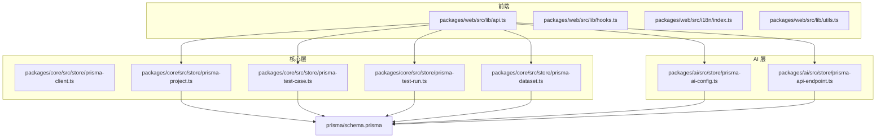
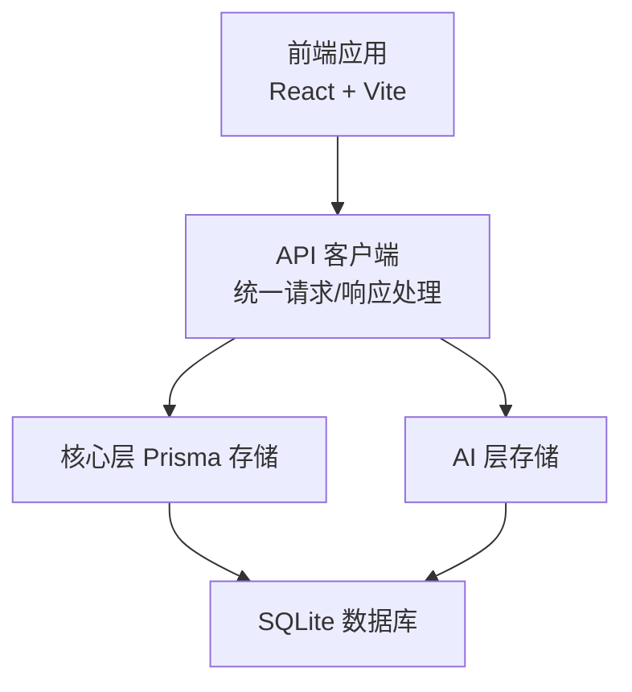
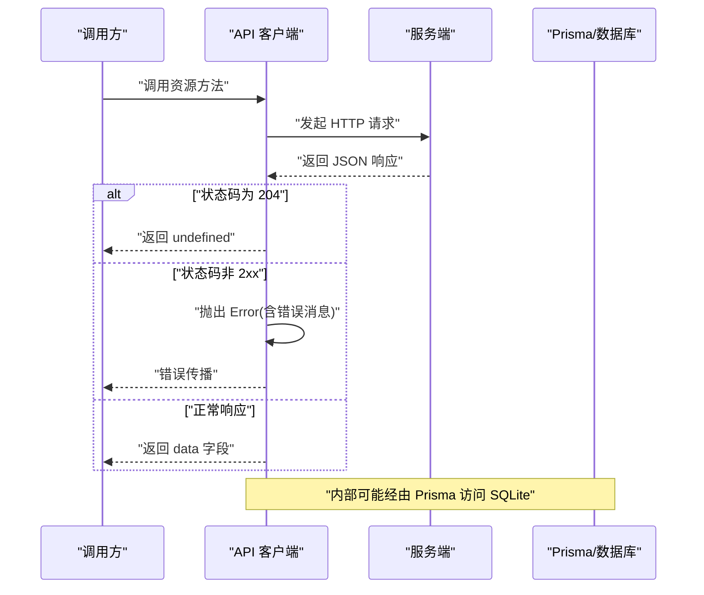
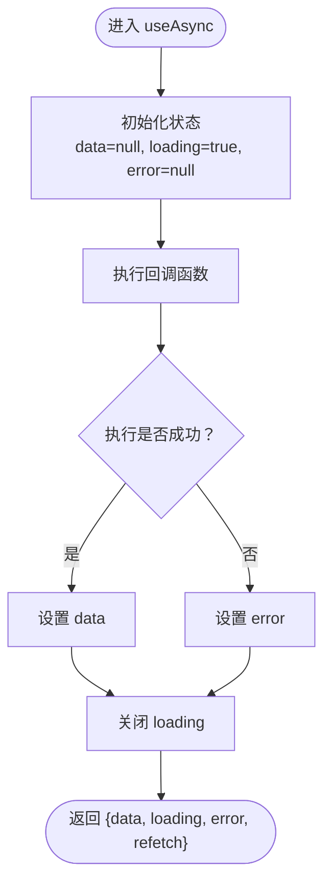
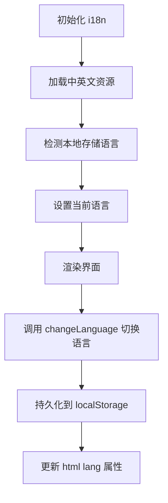
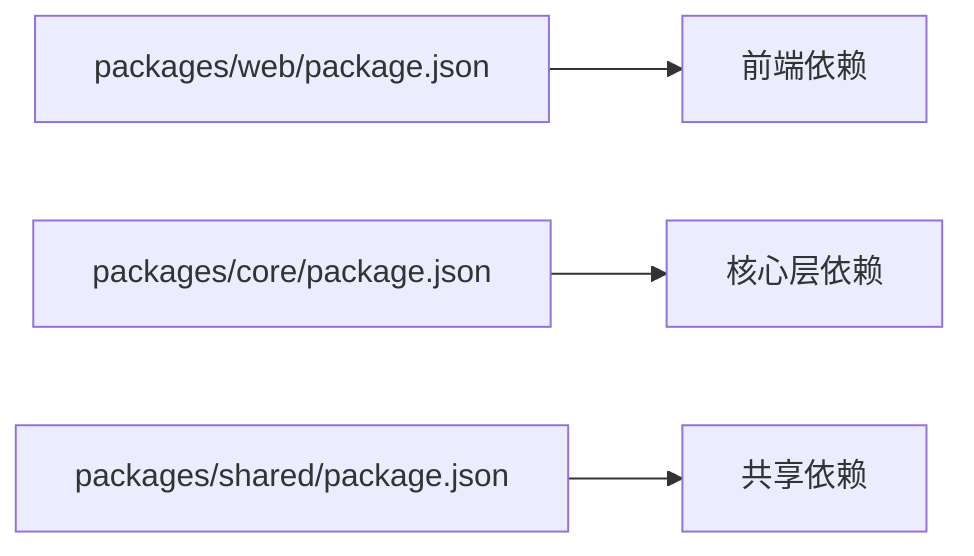

# 数据管理

<cite>
**本文引用的文件**
- [packages/web/src/lib/api.ts](file://packages/web/src/lib/api.ts)
- [packages/web/src/lib/hooks.ts](file://packages/web/src/lib/hooks.ts)
- [packages/web/src/lib/utils.ts](file://packages/web/src/lib/utils.ts)
- [packages/web/src/i18n/index.ts](file://packages/web/src/i18n/index.ts)
- [packages/web/src/i18n/locales/en.ts](file://packages/web/src/i18n/locales/en.ts)
- [packages/web/src/i18n/locales/zh-CN.ts](file://packages/web/src/i18n/locales/zh-CN.ts)
- [packages/core/src/store/prisma-client.ts](file://packages/core/src/store/prisma-client.ts)
- [packages/core/src/store/prisma-project.ts](file://packages/core/src/store/prisma-project.ts)
- [packages/core/src/store/prisma-test-case.ts](file://packages/core/src/store/prisma-test-case.ts)
- [packages/core/src/store/prisma-test-run.ts](file://packages/core/src/store/prisma-test-run.ts)
- [packages/core/src/store/prisma-dataset.ts](file://packages/core/src/store/prisma-dataset.ts)
- [packages/ai/src/store/prisma-ai-config.ts](file://packages/ai/src/store/prisma-ai-config.ts)
- [packages/ai/src/store/prisma-api-endpoint.ts](file://packages/ai/src/store/prisma-api-endpoint.ts)
- [prisma/schema.prisma](file://prisma/schema.prisma)
- [packages/web/package.json](file://packages/web/package.json)
- [packages/core/package.json](file://packages/core/package.json)
- [packages/shared/package.json](file://packages/shared/package.json)
</cite>

## 目录
1. [简介](#简介)
2. [项目结构](#项目结构)
3. [核心组件](#核心组件)
4. [架构总览](#架构总览)
5. [详细组件分析](#详细组件分析)
6. [依赖关系分析](#依赖关系分析)
7. [性能考虑](#性能考虑)
8. [故障排查指南](#故障排查指南)
9. [结论](#结论)
10. [附录](#附录)

## 简介
本技术文档面向“数据管理系统”的前端与核心层，系统性阐述以下主题：
- API 客户端封装设计、请求/响应处理与错误管理机制
- 自定义 Hooks 的设计模式、数据缓存策略与状态同步实现
- 数据验证规则、类型安全保证与异步数据处理流程
- 实时数据更新、WebSocket 连接管理与离线数据处理策略
- 数据格式化工具、国际化支持与性能监控实现方案

本系统采用多包工作区（pnpm workspaces）组织，前端使用 React + Vite，核心层基于 Prisma 访问 SQLite 数据库，AI 层提供测试用例生成能力。

## 项目结构
项目采用分层与按功能模块划分的组织方式：
- packages/web：前端应用，包含 API 客户端、自定义 Hooks、国际化资源与 UI 工具函数
- packages/core：核心业务逻辑与数据访问层，基于 Prisma 访问 SQLite
- packages/ai：AI 生成与知识库相关模型与存储
- prisma/schema.prisma：数据库模型定义
- packages/shared：共享工具与日志

图表来源
- [packages/web/src/lib/api.ts](file://packages/web/src/lib/api.ts)
- [packages/web/src/lib/hooks.ts](file://packages/web/src/lib/hooks.ts)
- [packages/web/src/i18n/index.ts](file://packages/web/src/i18n/index.ts)
- [packages/web/src/lib/utils.ts](file://packages/web/src/lib/utils.ts)
- [packages/core/src/store/prisma-client.ts](file://packages/core/src/store/prisma-client.ts)
- [packages/core/src/store/prisma-project.ts](file://packages/core/src/store/prisma-project.ts)
- [packages/core/src/store/prisma-test-case.ts](file://packages/core/src/store/prisma-test-case.ts)
- [packages/core/src/store/prisma-test-run.ts](file://packages/core/src/store/prisma-test-run.ts)
- [packages/core/src/store/prisma-dataset.ts](file://packages/core/src/store/prisma-dataset.ts)
- [packages/ai/src/store/prisma-ai-config.ts](file://packages/ai/src/store/prisma-ai-config.ts)
- [packages/ai/src/store/prisma-api-endpoint.ts](file://packages/ai/src/store/prisma-api-endpoint.ts)
- [prisma/schema.prisma](file://prisma/schema.prisma)

章节来源
- [packages/web/package.json](file://packages/web/package.json)
- [packages/core/package.json](file://packages/core/package.json)
- [packages/shared/package.json](file://packages/shared/package.json)

## 核心组件
本节聚焦于数据管理的关键构件：API 客户端、自定义 Hooks、数据模型与国际化。

- API 客户端封装
  - 统一基础路径、请求头与错误处理
  - 针对不同资源（项目、用例、套件、运行、数据集、AI 配置、API 端点）提供模块化方法
  - 对 204 无内容与非 2xx 响应进行专门处理
  - 分页结果统一为包含 data 与 meta 的结构

- 自定义 Hooks
  - useAsync 提供异步执行、加载状态、错误捕获与重试能力
  - 通过依赖数组控制执行时机，返回 refetch 以支持手动刷新

- 国际化
  - 使用 i18next 与 react-i18next，支持中英文切换
  - 语言持久化到 localStorage，并设置 html lang 属性
  - 提供 changeLanguage 方法动态切换语言

- 数据模型与类型安全
  - Prisma schema 定义了项目、用例、套件、运行、结果、数据集、AI 配置、API 端点等实体
  - 前端 API 模块导出强类型接口，确保调用侧类型安全

章节来源
- [packages/web/src/lib/api.ts](file://packages/web/src/lib/api.ts)
- [packages/web/src/lib/hooks.ts](file://packages/web/src/lib/hooks.ts)
- [packages/web/src/i18n/index.ts](file://packages/web/src/i18n/index.ts)
- [prisma/schema.prisma](file://prisma/schema.prisma)

## 架构总览
系统采用“前端 API 客户端 → 核心层 Prisma → SQLite”三层架构；AI 层与知识库独立但共享底层数据模型。

图表来源
- [packages/web/src/lib/api.ts](file://packages/web/src/lib/api.ts)
- [packages/core/src/store/prisma-client.ts](file://packages/core/src/store/prisma-client.ts)
- [prisma/schema.prisma](file://prisma/schema.prisma)

## 详细组件分析

### API 客户端封装与错误管理
- 设计要点
  - 统一前缀 BASE 与 Content-Type 头
  - 对 204 无内容返回特殊处理，返回 undefined
  - 非 ok 响应抛出 Error，消息来源于后端 error.message 或回退至状态文本
  - 资源模块化：projects、testCases、suites、runs、datasets、aiConfig、endpoints、aiGeneration
  - 分页列表返回结构化 meta 信息

- 错误管理机制
  - 在请求失败时抛出 Error，便于上层 Hook 或组件统一处理
  - 建议在调用侧结合 useAsync 的 error 字段进行用户提示与重试

- 类型安全
  - 所有资源接口均导出 TypeScript 接口，确保编译期校验
  - 分页返回类型 Paginated<T> 明确数据与元信息

图表来源
- [packages/web/src/lib/api.ts](file://packages/web/src/lib/api.ts)
- [packages/core/src/store/prisma-client.ts](file://packages/core/src/store/prisma-client.ts)

章节来源
- [packages/web/src/lib/api.ts](file://packages/web/src/lib/api.ts)

### 自定义 Hooks：useAsync 设计模式与状态同步
- 设计模式
  - 将异步执行封装为可复用 Hook，集中处理 loading、error、data 三态
  - 通过 useCallback 包装执行函数，避免不必要的重渲染
  - 通过 useEffect 触发首次执行，依赖数组控制重新执行时机

- 状态同步与缓存策略
  - 初始加载状态 loading=true，成功后设置 data，失败设置 error
  - 支持 refetch 手动刷新，实现轻量级“本地缓存失效与重新拉取”
  - 适合与 React Query 等缓存库配合，实现更完善的缓存与并发控制

图表来源
- [packages/web/src/lib/hooks.ts](file://packages/web/src/lib/hooks.ts)

章节来源
- [packages/web/src/lib/hooks.ts](file://packages/web/src/lib/hooks.ts)

### 数据验证规则与类型安全
- Prisma 模型层面
  - 使用字段约束（如 @id、@default、@unique）、索引（@@index）与关系（@relation）
  - JSON 字段用于复杂对象序列化（如 tags、variables、steps 等）

- 前端类型层面
  - API 模块导出完整接口，覆盖请求体、响应体与分页结构
  - 使用字面量联合类型（如 status、priority、provider）提升表达力与安全性

- 建议补充
  - 可引入 Zod 在运行时进行参数与响应校验，进一步增强健壮性
  - 对 JSON 字段（如 steps、variables）增加解析与校验流程

章节来源
- [prisma/schema.prisma](file://prisma/schema.prisma)
- [packages/web/src/lib/api.ts](file://packages/web/src/lib/api.ts)

### 异步数据处理流程
- 典型流程
  - 组件调用 useAsync 包裹的异步函数
  - 函数内部通过 API 客户端发起请求
  - 成功后更新本地状态，失败则记录错误
  - 结合分页与筛选参数，实现增量加载与条件查询

- 与分页的协作
  - 列表接口返回 { data, meta }，前端可据此实现分页 UI 与无限滚动

章节来源
- [packages/web/src/lib/api.ts](file://packages/web/src/lib/api.ts)
- [packages/web/src/lib/hooks.ts](file://packages/web/src/lib/hooks.ts)

### 实时数据更新与 WebSocket 管理
- 当前实现
  - 前端未发现显式 WebSocket 连接管理代码
  - API 客户端与存储层均为同步请求/响应

- 建议方案
  - 在服务端引入 WebSocket 广播（如运行状态变更），前端通过 useAsync 或 React Query 的查询订阅实现自动刷新
  - 对关键资源（如 TestRun、TestCaseResult）建立轮询或长连接，结合本地缓存策略减少重复请求

[本节为概念性建议，不直接分析具体文件，故无章节来源]

### 离线数据处理策略
- 当前实现
  - 未发现离线存储或缓存持久化逻辑

- 建议方案
  - 使用浏览器存储（localStorage/sessionStorage）缓存常用列表与详情
  - 结合 useAsync 的 refetch 与错误重试，实现弱网络下的可用性
  - 对关键写操作（新增/更新）采用乐观更新与回滚策略

[本节为概念性建议，不直接分析具体文件，故无章节来源]

### 数据格式化工具
- 工具函数
  - cn：基于 clsx 与 tailwind-merge 的类名合并工具，简化样式拼接

- 建议扩展
  - 添加日期格式化、数值格式化、枚举显示映射等通用格式化函数
  - 对 JSON 字段（如 steps、variables）提供解析与美化展示

章节来源
- [packages/web/src/lib/utils.ts](file://packages/web/src/lib/utils.ts)

### 国际化支持
- 实现概览
  - i18next 初始化中英文资源，支持回退语言
  - changeLanguage 动态切换语言并持久化到 localStorage
  - 设置 html lang 属性，提升 SEO 与可访问性

- 本地化资源
  - 英文与中文词条覆盖通用、导航、状态、页面标题与对话框文案
  - 通过占位符与复数形式参数化文案，便于多语言适配

图表来源
- [packages/web/src/i18n/index.ts](file://packages/web/src/i18n/index.ts)
- [packages/web/src/i18n/locales/en.ts](file://packages/web/src/i18n/locales/en.ts)
- [packages/web/src/i18n/locales/zh-CN.ts](file://packages/web/src/i18n/locales/zh-CN.ts)

章节来源
- [packages/web/src/i18n/index.ts](file://packages/web/src/i18n/index.ts)
- [packages/web/src/i18n/locales/en.ts](file://packages/web/src/i18n/locales/en.ts)
- [packages/web/src/i18n/locales/zh-CN.ts](file://packages/web/src/i18n/locales/zh-CN.ts)

### 性能监控实现方案
- 建议指标
  - 请求耗时（从发起到响应完成）
  - 错误率与错误分类统计
  - 缓存命中率与回源比例
  - 关键页面首屏时间与交互延迟

- 建议手段
  - 在 API 客户端包装一层监控拦截器，采集请求元数据与耗时
  - 使用浏览器 Performance API 或第三方 SDK（如 Sentry、LogRocket）进行埋点
  - 对高频请求与大列表分页场景进行节流与去抖优化

[本节为概念性建议，不直接分析具体文件，故无章节来源]

## 依赖关系分析
- 前端依赖
  - React、react-router-dom、@tanstack/react-query（用于缓存与并发控制）
  - i18next、react-i18next（国际化）
  - radix ui、lucide-react（UI 组件库）

- 核心层依赖
  - @prisma/client、jsonpath-plus、zod（Prisma 客户端、JSON 查询、类型校验）

- 共享依赖
  - @paralleldrive/cuid2、pino（ID 生成、日志）

图表来源
- [packages/web/package.json](file://packages/web/package.json)
- [packages/core/package.json](file://packages/core/package.json)
- [packages/shared/package.json](file://packages/shared/package.json)

章节来源
- [packages/web/package.json](file://packages/web/package.json)
- [packages/core/package.json](file://packages/core/package.json)
- [packages/shared/package.json](file://packages/shared/package.json)

## 性能考虑
- 请求与缓存
  - 合理使用 useAsync 的 refetch 与依赖数组，避免不必要的重复请求
  - 对高频列表与详情采用本地缓存与增量更新策略

- 渲染优化
  - 使用 React.memo、useMemo、useCallback 降低渲染成本
  - 将大型列表虚拟化，减少 DOM 节点数量

- 网络与容错
  - 对慢请求设置超时与重试，提升用户体验
  - 在弱网环境下提供占位与骨架屏

[本节提供一般性指导，不直接分析具体文件，故无章节来源]

## 故障排查指南
- 常见问题定位
  - 请求失败：检查 API 返回的错误消息与状态码，确认后端路由与鉴权配置
  - 类型不匹配：核对 Prisma 模型与前端接口定义，确保字段一致
  - 国际化异常：确认 changeLanguage 是否正确持久化语言并更新 html lang

- 建议的日志与监控
  - 在 API 客户端添加请求/响应日志开关
  - 对关键错误（如鉴权失败、网络异常）进行统一上报

章节来源
- [packages/web/src/lib/api.ts](file://packages/web/src/lib/api.ts)
- [packages/web/src/i18n/index.ts](file://packages/web/src/i18n/index.ts)

## 结论
本系统在前端与核心层之间建立了清晰的职责边界：前端负责请求封装、状态管理与国际化，核心层通过 Prisma 提供稳定的数据库访问。建议后续在以下方面持续演进：
- 引入 WebSocket 或轮询机制实现运行状态的实时更新
- 增加运行时数据校验与缓存持久化策略
- 补充性能监控与错误追踪体系
- 扩展数据格式化工具与国际化词条覆盖

[本节为总结性内容，不直接分析具体文件，故无章节来源]

## 附录
- 数据模型概览（部分）
  - 项目、测试用例、套件、运行、结果、步骤结果、数据集、AI 配置、API 端点
  - JSON 字段用于复杂对象序列化，便于灵活扩展

章节来源
- [prisma/schema.prisma](file://prisma/schema.prisma)