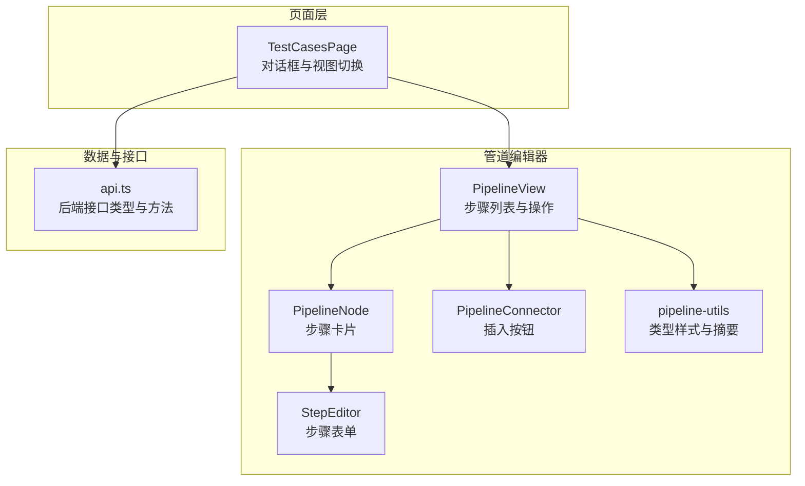
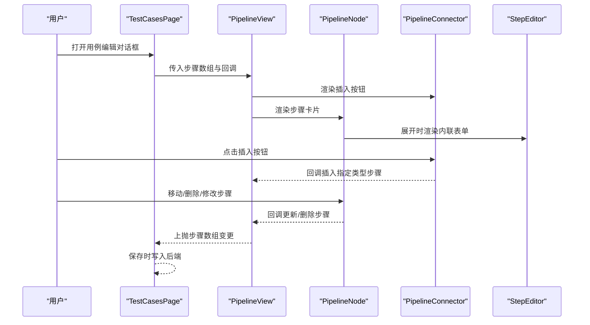
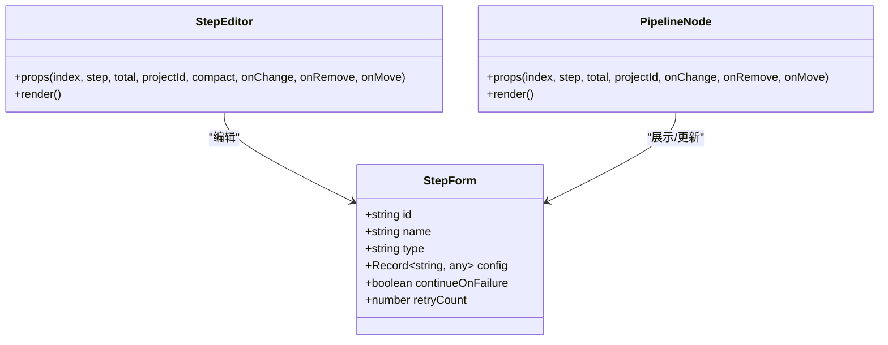
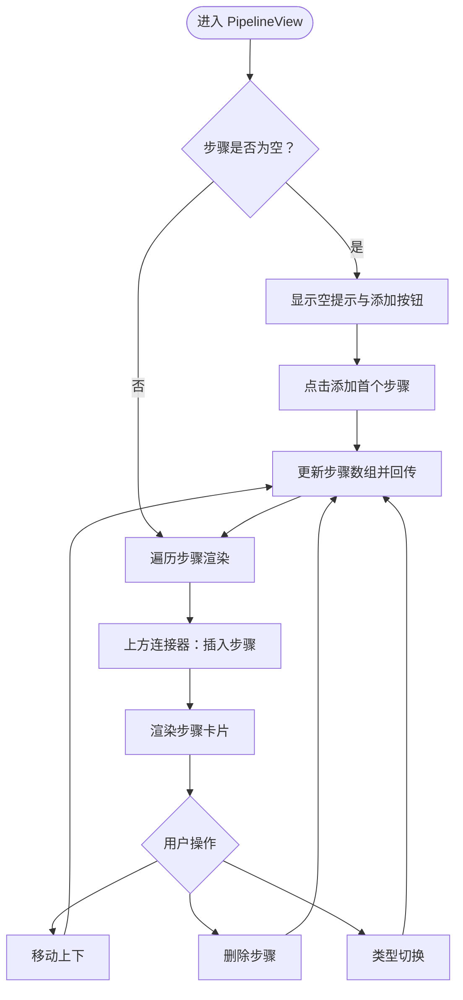
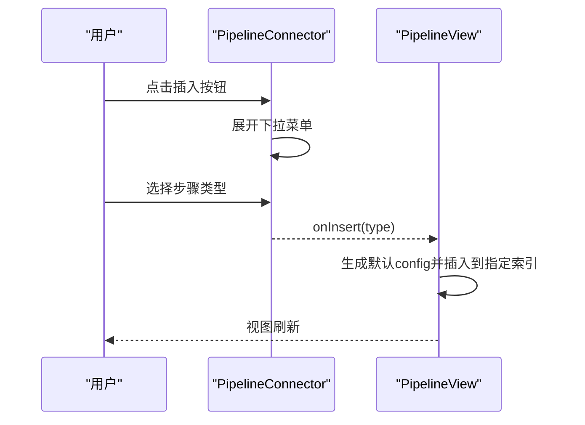
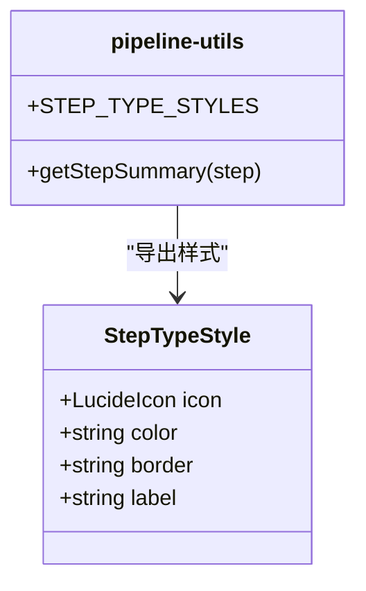
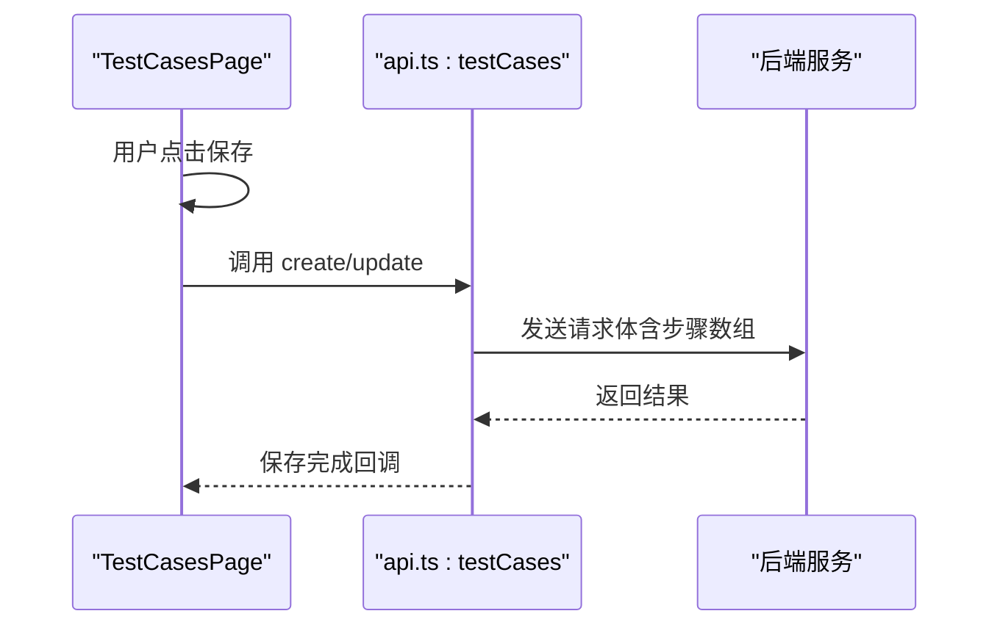
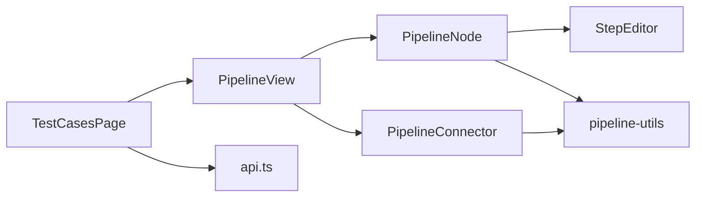

# 管道编辑器

<cite>
**本文引用的文件**
- [packages/web/src/components/pipeline/PipelineView.tsx](file://packages/web/src/components/pipeline/PipelineView.tsx)
- [packages/web/src/components/pipeline/PipelineNode.tsx](file://packages/web/src/components/pipeline/PipelineNode.tsx)
- [packages/web/src/components/pipeline/PipelineConnector.tsx](file://packages/web/src/components/pipeline/PipelineConnector.tsx)
- [packages/web/src/components/pipeline/pipeline-utils.ts](file://packages/web/src/components/pipeline/pipeline-utils.ts)
- [packages/web/src/components/step-editor.tsx](file://packages/web/src/components/step-editor.tsx)
- [packages/web/src/pages/test-cases.tsx](file://packages/web/src/pages/test-cases.tsx)
- [packages/web/src/lib/api.ts](file://packages/web/src/lib/api.ts)
</cite>

## 目录
1. [引言](#引言)
2. [项目结构](#项目结构)
3. [核心组件](#核心组件)
4. [架构总览](#架构总览)
5. [详细组件分析](#详细组件分析)
6. [依赖关系分析](#依赖关系分析)
7. [性能考量](#性能考量)
8. [故障排查指南](#故障排查指南)
9. [结论](#结论)
10. [附录](#附录)

## 引言
本文件面向“管道编辑器”的技术文档，聚焦于可视化测试流程编辑器的设计与实现。内容涵盖：
- 节点拖拽交互与连接线插入机制
- 管道节点类型定义、属性配置与状态管理
- 连接器的自动吸附、路径与视觉反馈
- 撤销/重做、数据序列化与导入导出
- 画布缩放、平移控制与节点碰撞检测的实现方案

当前仓库中已实现的编辑器以“表单视图”和“管道视图”两种模式呈现步骤（Step）编辑能力，并通过统一的步骤类型与配置模型支撑不同类型的测试步骤（HTTP、断言、提取、调用用例、加载数据集）。后续如需扩展为真正的“画布拖拽+连线”编辑器，可基于现有类型与配置体系进行增量开发。

## 项目结构
管道编辑器相关代码主要位于 Web 前端工程 packages/web 中，采用按功能模块划分的方式组织：
- 步骤编辑器：StepEditor 提供步骤配置的表单控件与动态字段
- 管道视图：PipelineView 负责步骤列表渲染与插入/移动/删除操作
- 管道节点：PipelineNode 封装步骤卡片的展示与展开/收起
- 连接器：PipelineConnector 提供步骤之间的插入入口
- 工具函数：pipeline-utils 定义步骤类型样式与摘要生成
- 页面容器：TestCasesPage 作为入口页面，承载对话框与两种视图切换
- API 层：api.ts 定义测试用例、套件、运行等后端接口类型与方法

图表来源
- [packages/web/src/pages/test-cases.tsx:190-351](file://packages/web/src/pages/test-cases.tsx#L190-L351)
- [packages/web/src/components/pipeline/PipelineView.tsx:14-91](file://packages/web/src/components/pipeline/PipelineView.tsx#L14-L91)
- [packages/web/src/components/pipeline/PipelineNode.tsx:19-139](file://packages/web/src/components/pipeline/PipelineNode.tsx#L19-L139)
- [packages/web/src/components/pipeline/PipelineConnector.tsx:13-47](file://packages/web/src/components/pipeline/PipelineConnector.tsx#L13-L47)
- [packages/web/src/components/step-editor.tsx:54-377](file://packages/web/src/components/step-editor.tsx#L54-L377)
- [packages/web/src/components/pipeline/pipeline-utils.ts:7-47](file://packages/web/src/components/pipeline/pipeline-utils.ts#L7-L47)
- [packages/web/src/lib/api.ts:149-165](file://packages/web/src/lib/api.ts#L149-L165)

章节来源
- [packages/web/src/pages/test-cases.tsx:190-351](file://packages/web/src/pages/test-cases.tsx#L190-L351)
- [packages/web/src/components/pipeline/PipelineView.tsx:14-91](file://packages/web/src/components/pipeline/PipelineView.tsx#L14-L91)
- [packages/web/src/components/pipeline/PipelineNode.tsx:19-139](file://packages/web/src/components/pipeline/PipelineNode.tsx#L19-L139)
- [packages/web/src/components/pipeline/PipelineConnector.tsx:13-47](file://packages/web/src/components/pipeline/PipelineConnector.tsx#L13-L47)
- [packages/web/src/components/step-editor.tsx:54-377](file://packages/web/src/components/step-editor.tsx#L54-L377)
- [packages/web/src/components/pipeline/pipeline-utils.ts:7-47](file://packages/web/src/components/pipeline/pipeline-utils.ts#L7-L47)
- [packages/web/src/lib/api.ts:149-165](file://packages/web/src/lib/api.ts#L149-L165)

## 核心组件
- 步骤类型与配置
  - 步骤类型：http、assertion、extract、call、load-dataset
  - 公共字段：id（可选）、name、type、config（任意键值对）、continueOnFailure、retryCount
  - 默认配置：根据类型提供初始 config，例如 HTTP 的 method/url/headers/timeout，断言的 source/operator/expected 等
- 步骤编辑器（StepEditor）
  - 支持动态字段与表达式提示
  - 支持继续执行与重试次数设置
  - 支持类型切换并重置对应 config
- 管道视图（PipelineView）
  - 渲染开始/结束节点与步骤卡片
  - 提供插入、移动、删除步骤的操作入口
  - 维护步骤数组的变更并通过回调上抛
- 管道节点（PipelineNode）
  - 展示步骤名称、摘要、类型徽标与重试/失败标志
  - 支持展开/收起以显示内联 StepEditor
- 连接器（PipelineConnector）
  - 在步骤之间提供插入新步骤的入口
  - 下拉菜单展示所有步骤类型
- 工具函数（pipeline-utils）
  - 定义每种步骤类型的样式（图标、颜色、边框、标签）
  - 生成步骤摘要用于节点卡片显示

章节来源
- [packages/web/src/components/step-editor.tsx:19-30](file://packages/web/src/components/step-editor.tsx#L19-L30)
- [packages/web/src/components/step-editor.tsx:32-38](file://packages/web/src/components/step-editor.tsx#L32-L38)
- [packages/web/src/components/pipeline/PipelineView.tsx:17-43](file://packages/web/src/components/pipeline/PipelineView.tsx#L17-L43)
- [packages/web/src/components/pipeline/PipelineNode.tsx:19-26](file://packages/web/src/components/pipeline/PipelineNode.tsx#L19-L26)
- [packages/web/src/components/pipeline/PipelineConnector.tsx:13-47](file://packages/web/src/components/pipeline/PipelineConnector.tsx#L13-L47)
- [packages/web/src/components/pipeline/pipeline-utils.ts:7-20](file://packages/web/src/components/pipeline/pipeline-utils.ts#L7-L20)
- [packages/web/src/components/pipeline/pipeline-utils.ts:25-47](file://packages/web/src/components/pipeline/pipeline-utils.ts#L25-L47)

## 架构总览
管道编辑器采用“页面容器 + 视图组件 + 工具函数”的分层设计：
- 页面容器负责数据加载、对话框与视图切换
- 视图组件负责渲染与交互，内部通过回调将变更传递给容器
- 工具函数提供类型样式与摘要生成，保持视图层与业务逻辑解耦

图表来源
- [packages/web/src/pages/test-cases.tsx:332-338](file://packages/web/src/pages/test-cases.tsx#L332-L338)
- [packages/web/src/components/pipeline/PipelineView.tsx:66-78](file://packages/web/src/components/pipeline/PipelineView.tsx#L66-L78)
- [packages/web/src/components/pipeline/PipelineNode.tsx:109-118](file://packages/web/src/components/pipeline/PipelineNode.tsx#L109-L118)
- [packages/web/src/components/pipeline/PipelineConnector.tsx:35-35](file://packages/web/src/components/pipeline/PipelineConnector.tsx#L35-L35)

## 详细组件分析

### 步骤类型与属性配置
- 类型定义与默认配置
  - http：包含 method、url、headers、body、timeout 等字段
  - assertion：包含 source（status/header/body/jsonpath/variable）、operator、expected、expression 等
  - extract：包含 source（body/jsonpath/header/status/regex）、expression、variableName 等
  - call：包含 testCaseId
  - load-dataset：包含 datasetId、variableName
- 表单行为
  - 类型切换时重置对应 config
  - 支持继续执行与重试次数设置
  - 断言/提取支持表达式占位与提示

图表来源
- [packages/web/src/components/step-editor.tsx:19-30](file://packages/web/src/components/step-editor.tsx#L19-L30)
- [packages/web/src/components/pipeline/PipelineNode.tsx:9-17](file://packages/web/src/components/pipeline/PipelineNode.tsx#L9-L17)

章节来源
- [packages/web/src/components/step-editor.tsx:19-30](file://packages/web/src/components/step-editor.tsx#L19-L30)
- [packages/web/src/components/step-editor.tsx:113-122](file://packages/web/src/components/step-editor.tsx#L113-L122)
- [packages/web/src/components/step-editor.tsx:227-279](file://packages/web/src/components/step-editor.tsx#L227-L279)
- [packages/web/src/components/step-editor.tsx:282-322](file://packages/web/src/components/step-editor.tsx#L282-L322)
- [packages/web/src/components/step-editor.tsx:325-342](file://packages/web/src/components/step-editor.tsx#L325-L342)
- [packages/web/src/components/step-editor.tsx:345-373](file://packages/web/src/components/step-editor.tsx#L345-L373)

### 管道视图与节点交互
- 插入步骤
  - 在指定索引位置插入新步骤，使用类型对应的默认 config
- 移动步骤
  - 交换相邻索引元素，限制边界
- 删除步骤
  - 过滤掉目标索引元素
- 空状态
  - 当步骤为空时，提供添加首个步骤的入口

图表来源
- [packages/web/src/components/pipeline/PipelineView.tsx:45-55](file://packages/web/src/components/pipeline/PipelineView.tsx#L45-L55)
- [packages/web/src/components/pipeline/PipelineView.tsx:31-43](file://packages/web/src/components/pipeline/PipelineView.tsx#L31-L43)
- [packages/web/src/components/pipeline/PipelineView.tsx:23-29](file://packages/web/src/components/pipeline/PipelineView.tsx#L23-L29)
- [packages/web/src/components/pipeline/PipelineView.tsx:20-21](file://packages/web/src/components/pipeline/PipelineView.tsx#L20-L21)

章节来源
- [packages/web/src/components/pipeline/PipelineView.tsx:17-43](file://packages/web/src/components/pipeline/PipelineView.tsx#L17-L43)
- [packages/web/src/components/pipeline/PipelineView.tsx:45-55](file://packages/web/src/components/pipeline/PipelineView.tsx#L45-L55)

### 连接器与插入机制
- 连接器在步骤上方/下方提供插入入口
- 下拉菜单列出所有步骤类型，点击后触发插入回调
- 插入时使用类型默认 config 初始化新步骤

图表来源
- [packages/web/src/components/pipeline/PipelineConnector.tsx:21-41](file://packages/web/src/components/pipeline/PipelineConnector.tsx#L21-L41)
- [packages/web/src/components/pipeline/PipelineView.tsx:31-43](file://packages/web/src/components/pipeline/PipelineView.tsx#L31-L43)

章节来源
- [packages/web/src/components/pipeline/PipelineConnector.tsx:13-47](file://packages/web/src/components/pipeline/PipelineConnector.tsx#L13-L47)
- [packages/web/src/components/pipeline/PipelineView.tsx:31-43](file://packages/web/src/components/pipeline/PipelineView.tsx#L31-L43)

### 节点样式与摘要
- 类型样式
  - 每个步骤类型绑定图标、背景色、边框色与 i18n 标签
- 摘要生成
  - 根据类型与配置生成简短摘要，用于节点卡片显示

图表来源
- [packages/web/src/components/pipeline/pipeline-utils.ts:7-20](file://packages/web/src/components/pipeline/pipeline-utils.ts#L7-L20)
- [packages/web/src/components/pipeline/pipeline-utils.ts:25-47](file://packages/web/src/components/pipeline/pipeline-utils.ts#L25-L47)

章节来源
- [packages/web/src/components/pipeline/pipeline-utils.ts:7-20](file://packages/web/src/components/pipeline/pipeline-utils.ts#L7-L20)
- [packages/web/src/components/pipeline/pipeline-utils.ts:25-47](file://packages/web/src/components/pipeline/pipeline-utils.ts#L25-L47)

### 数据序列化与导入导出
- 保存流程
  - 对外暴露的保存函数会将步骤数组写入后端
  - 步骤顺序通过 order 字段体现
- 导入导出
  - 未在当前实现中发现专用的导入/导出按钮或动作
  - 可通过后端接口进行数据读取与写入

图表来源
- [packages/web/src/pages/test-cases.tsx:226-240](file://packages/web/src/pages/test-cases.tsx#L226-L240)
- [packages/web/src/lib/api.ts:158-165](file://packages/web/src/lib/api.ts#L158-L165)

章节来源
- [packages/web/src/pages/test-cases.tsx:226-240](file://packages/web/src/pages/test-cases.tsx#L226-L240)
- [packages/web/src/lib/api.ts:149-165](file://packages/web/src/lib/api.ts#L149-L165)

## 依赖关系分析
- 组件依赖
  - TestCasesPage 依赖 PipelineView 与 StepEditor
  - PipelineView 依赖 PipelineNode 与 PipelineConnector
  - PipelineNode 依赖 StepEditor 与 pipeline-utils
  - PipelineConnector 依赖 pipeline-utils 与 STEP_TYPES
- 外部依赖
  - 使用 i18n、UI 组件库（Button、Select、DropdownMenu 等）
  - 使用 lucide-react 图标库
  - 使用 api.ts 提供的后端接口

图表来源
- [packages/web/src/pages/test-cases.tsx:332-338](file://packages/web/src/pages/test-cases.tsx#L332-L338)
- [packages/web/src/components/pipeline/PipelineView.tsx:66-78](file://packages/web/src/components/pipeline/PipelineView.tsx#L66-L78)
- [packages/web/src/components/pipeline/PipelineNode.tsx:109-118](file://packages/web/src/components/pipeline/PipelineNode.tsx#L109-L118)
- [packages/web/src/components/pipeline/PipelineConnector.tsx:35-35](file://packages/web/src/components/pipeline/PipelineConnector.tsx#L35-L35)
- [packages/web/src/components/pipeline/pipeline-utils.ts:7-20](file://packages/web/src/components/pipeline/pipeline-utils.ts#L7-L20)
- [packages/web/src/lib/api.ts:149-165](file://packages/web/src/lib/api.ts#L149-L165)

章节来源
- [packages/web/src/pages/test-cases.tsx:332-338](file://packages/web/src/pages/test-cases.tsx#L332-L338)
- [packages/web/src/components/pipeline/PipelineView.tsx:66-78](file://packages/web/src/components/pipeline/PipelineView.tsx#L66-L78)
- [packages/web/src/components/pipeline/PipelineNode.tsx:109-118](file://packages/web/src/components/pipeline/PipelineNode.tsx#L109-L118)
- [packages/web/src/components/pipeline/PipelineConnector.tsx:35-35](file://packages/web/src/components/pipeline/PipelineConnector.tsx#L35-L35)
- [packages/web/src/components/pipeline/pipeline-utils.ts:7-20](file://packages/web/src/components/pipeline/pipeline-utils.ts#L7-L20)
- [packages/web/src/lib/api.ts:149-165](file://packages/web/src/lib/api.ts#L149-L165)

## 性能考量
- 渲染优化
  - 使用 React 的不可变更新策略（复制数组/对象），避免不必要的重渲染
  - 仅在步骤数量变化或索引变更时触发局部更新
- 计算复杂度
  - 插入/删除/移动为 O(n) 操作，n 为步骤数量
  - 摘要生成为 O(1) 或 O(k)（k 为配置键数）
- UI 交互
  - 下拉菜单与弹窗在需要时才渲染，减少初始负载
  - 表单控件按需懒加载外部资源（如测试用例列表）

## 故障排查指南
- 无法插入步骤
  - 检查 PipelineConnector 的 onInsert 回调是否正确传递至 PipelineView
  - 确认 STEP_TYPES 与 STEP_TYPE_STYLES 是否一致
- 步骤类型切换后配置未重置
  - 检查 StepEditor 与 PipelineNode 中的类型切换逻辑
  - 确认默认 config 映射是否完整覆盖所有类型
- 保存失败
  - 检查 TestCasesPage 的保存流程与 api.ts 的 create/update 方法
  - 确认步骤数组是否包含 order 字段（保存时会写入）

章节来源
- [packages/web/src/components/pipeline/PipelineConnector.tsx:35-35](file://packages/web/src/components/pipeline/PipelineConnector.tsx#L35-L35)
- [packages/web/src/components/pipeline/PipelineView.tsx:31-43](file://packages/web/src/components/pipeline/PipelineView.tsx#L31-L43)
- [packages/web/src/components/step-editor.tsx:113-122](file://packages/web/src/components/step-editor.tsx#L113-L122)
- [packages/web/src/pages/test-cases.tsx:226-240](file://packages/web/src/pages/test-cases.tsx#L226-L240)
- [packages/web/src/lib/api.ts:158-165](file://packages/web/src/lib/api.ts#L158-L165)

## 结论
当前实现提供了完整的“表单视图 + 管道视图”双模式编辑体验，具备清晰的步骤类型与配置体系、良好的交互与状态管理。若需进一步增强为“画布拖拽+连线”编辑器，可在现有类型与配置基础上扩展：
- 画布缩放与平移：引入 SVG/Canvas 或第三方库（如 react-flow、mxGraph）实现视口变换
- 节点拖拽：基于 HTML5 拖拽 API 或第三方库实现节点拖放
- 连接线绘制：实现自动吸附、正交/曲线路径与实时预览
- 撤销/重做：维护操作历史栈，支持时间旅行式状态回退
- 数据序列化：提供 JSON 导入/导出，兼容版本升级与迁移

## 附录
- 关键类型与接口
  - StepForm：步骤基础模型
  - TestStep/TestSuite/TestCase：用例与套件模型
- 常用操作
  - 插入/移动/删除步骤
  - 类型切换与配置重置
  - 保存用例（含步骤数组）

章节来源
- [packages/web/src/components/step-editor.tsx:19-30](file://packages/web/src/components/step-editor.tsx#L19-L30)
- [packages/web/src/lib/api.ts:30-53](file://packages/web/src/lib/api.ts#L30-L53)
- [packages/web/src/pages/test-cases.tsx:226-240](file://packages/web/src/pages/test-cases.tsx#L226-L240)