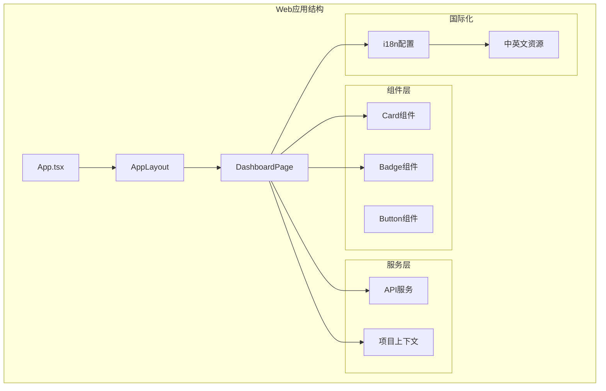
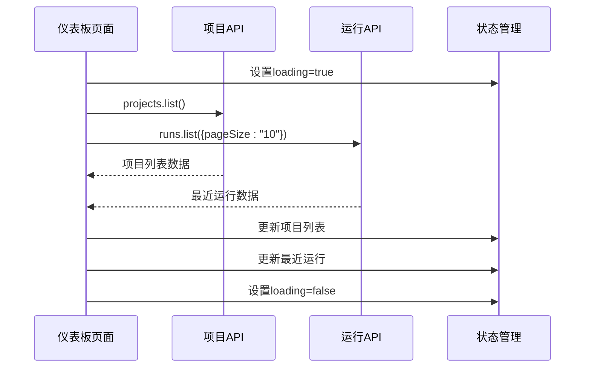
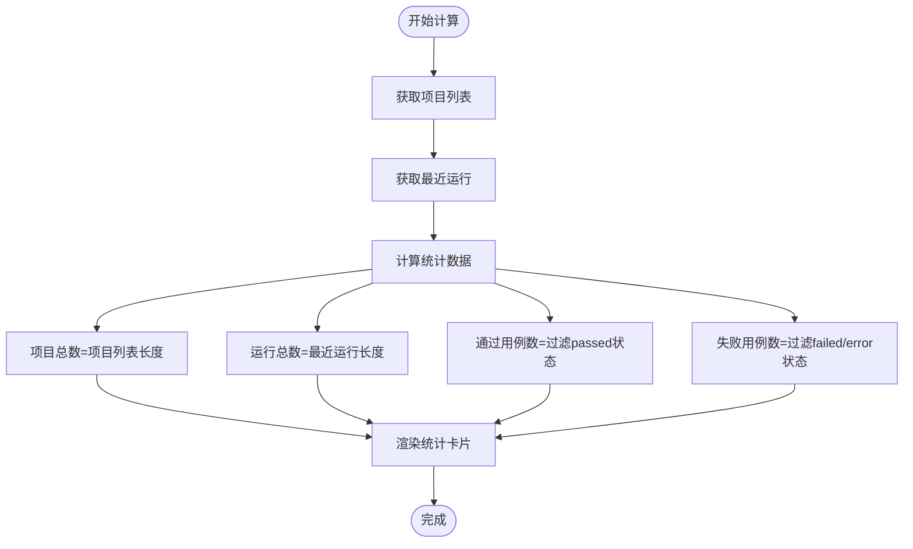
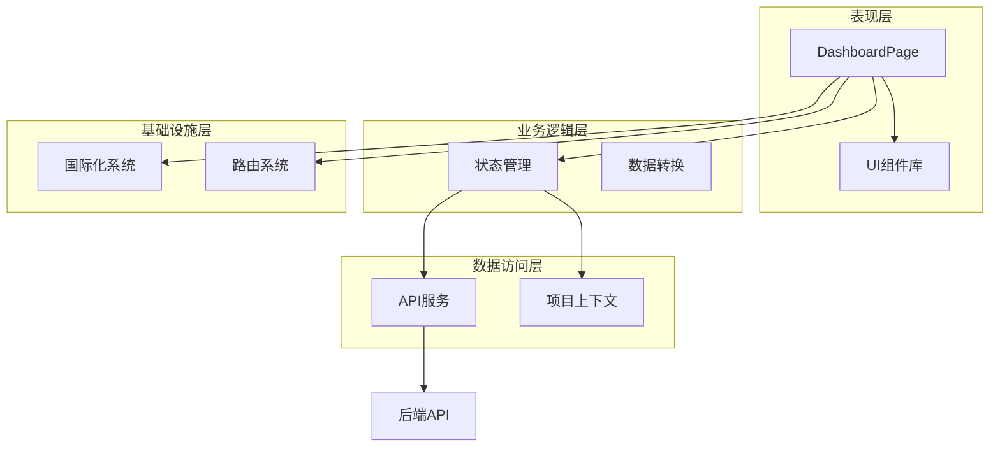
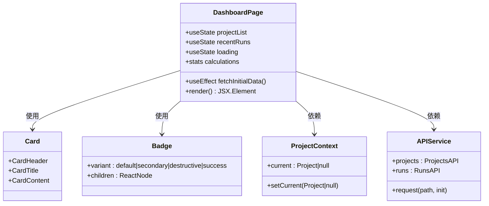
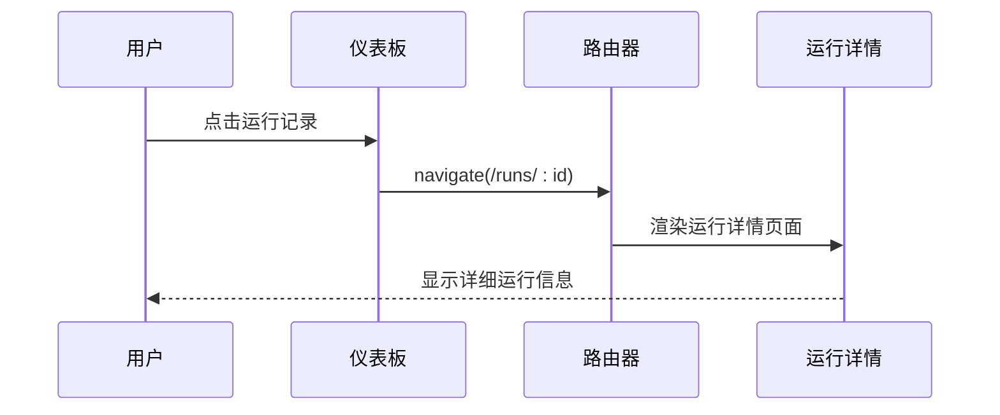
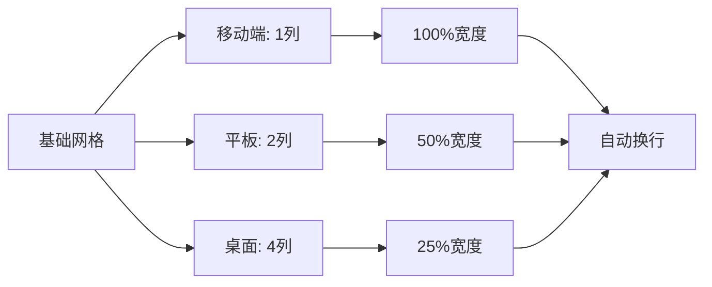
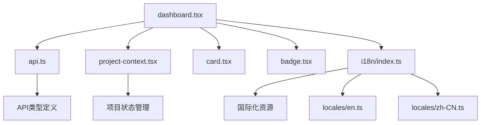
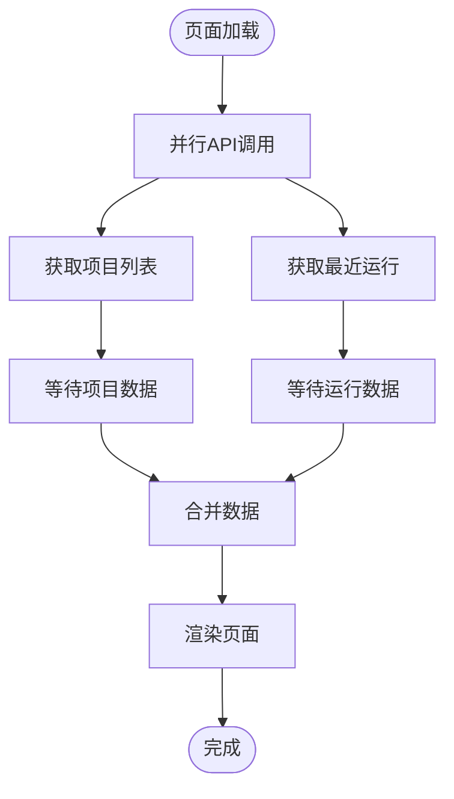

# 仪表板页面

<cite>
**本文档引用的文件**
- [packages/web/src/pages/dashboard.tsx](file://packages/web/src/pages/dashboard.tsx)
- [packages/web/src/lib/api.ts](file://packages/web/src/lib/api.ts)
- [packages/web/src/i18n/index.ts](file://packages/web/src/i18n/index.ts)
- [packages/web/src/i18n/locales/en.ts](file://packages/web/src/i18n/locales/en.ts)
- [packages/web/src/i18n/locales/zh-CN.ts](file://packages/web/src/i18n/locales/zh-CN.ts)
- [packages/web/src/lib/project-context.tsx](file://packages/web/src/lib/project-context.tsx)
- [packages/web/src/components/ui/card.tsx](file://packages/web/src/components/ui/card.tsx)
- [packages/web/src/components/ui/badge.tsx](file://packages/web/src/components/ui/badge.tsx)
- [packages/web/src/components/layout/app-layout.tsx](file://packages/web/src/components/layout/app-layout.tsx)
- [packages/web/src/App.tsx](file://packages/web/src/App.tsx)
- [packages/web/src/main.tsx](file://packages/web/src/main.tsx)
- [packages/web/src/pages/runs.tsx](file://packages/web/src/pages/runs.tsx)
- [packages/web/src/pages/run-detail.tsx](file://packages/web/src/pages/run-detail.tsx)
</cite>

## 目录
1. [简介](#简介)
2. [项目结构](#项目结构)
3. [核心组件](#核心组件)
4. [架构概览](#架构概览)
5. [详细组件分析](#详细组件分析)
6. [依赖关系分析](#依赖关系分析)
7. [性能考虑](#性能考虑)
8. [故障排除指南](#故障排除指南)
9. [结论](#结论)

## 简介

仪表板页面是 AI-Tester 测试平台的核心入口界面，为用户提供项目统计、测试运行状态概览和快速操作入口。该页面采用现代化的响应式设计，支持中英文国际化，并实现了高效的并行数据获取和状态管理。

仪表板主要包含四个核心功能模块：
- **项目统计卡片**：显示项目总数、最近运行数量、通过用例数和失败用例数
- **测试运行状态概览**：展示最近的测试运行记录
- **快速操作入口**：提供项目选择和导航功能
- **响应式布局**：适配不同屏幕尺寸的设备

## 项目结构

仪表板页面位于前端 Web 应用的页面层，采用模块化组织结构：

**图表来源**
- [packages/web/src/App.tsx:15-36](file://packages/web/src/App.tsx#L15-L36)
- [packages/web/src/components/layout/app-layout.tsx:4-15](file://packages/web/src/components/layout/app-layout.tsx#L4-L15)
- [packages/web/src/pages/dashboard.tsx:11-139](file://packages/web/src/pages/dashboard.tsx#L11-L139)

**章节来源**
- [packages/web/src/App.tsx:15-36](file://packages/web/src/App.tsx#L15-L36)
- [packages/web/src/components/layout/app-layout.tsx:4-15](file://packages/web/src/components/layout/app-layout.tsx#L4-L15)
- [packages/web/src/pages/dashboard.tsx:11-139](file://packages/web/src/pages/dashboard.tsx#L11-L139)

## 核心组件

### 数据获取与状态管理

仪表板采用并行 API 调用模式，通过 Promise.all 实现高效的数据获取：

**图表来源**
- [packages/web/src/pages/dashboard.tsx:19-28](file://packages/web/src/pages/dashboard.tsx#L19-L28)
- [packages/web/src/lib/api.ts:139-147](file://packages/web/src/lib/api.ts#L139-L147)
- [packages/web/src/lib/api.ts:179-189](file://packages/web/src/lib/api.ts#L179-L189)

### 统计计算逻辑

仪表板实现了实时的统计数据计算，包括项目总数、运行总数、通过用例数和失败用例数：

**图表来源**
- [packages/web/src/pages/dashboard.tsx:30-35](file://packages/web/src/pages/dashboard.tsx#L30-L35)

### 用户交互行为

仪表板提供了多种用户交互功能：

1. **项目选择**：当用户未选择项目时，显示项目选择提示和导航按钮
2. **运行详情导航**：点击运行记录可跳转到对应的运行详情页面
3. **国际化切换**：支持中英文语言切换

**章节来源**
- [packages/web/src/pages/dashboard.tsx:89-100](file://packages/web/src/pages/dashboard.tsx#L89-L100)
- [packages/web/src/pages/dashboard.tsx:110-136](file://packages/web/src/pages/dashboard.tsx#L110-L136)
- [packages/web/src/pages/dashboard.tsx:141-167](file://packages/web/src/pages/dashboard.tsx#L141-L167)

## 架构概览

仪表板页面采用分层架构设计，各层职责明确：

**图表来源**
- [packages/web/src/pages/dashboard.tsx:11-139](file://packages/web/src/pages/dashboard.tsx#L11-L139)
- [packages/web/src/lib/api.ts:1-325](file://packages/web/src/lib/api.ts#L1-L325)
- [packages/web/src/lib/project-context.tsx:1-33](file://packages/web/src/lib/project-context.tsx#L1-L33)

### 组件关系图

**图表来源**
- [packages/web/src/pages/dashboard.tsx:11-139](file://packages/web/src/pages/dashboard.tsx#L11-L139)
- [packages/web/src/components/ui/card.tsx:4-44](file://packages/web/src/components/ui/card.tsx#L4-L44)
- [packages/web/src/components/ui/badge.tsx:5-28](file://packages/web/src/components/ui/badge.tsx#L5-L28)
- [packages/web/src/lib/project-context.tsx:4-32](file://packages/web/src/lib/project-context.tsx#L4-L32)
- [packages/web/src/lib/api.ts:139-189](file://packages/web/src/lib/api.ts#L139-L189)

## 详细组件分析

### 项目统计卡片组件

项目统计卡片是仪表板的核心数据可视化组件，包含四个关键指标：

| 指标类型 | 图标 | 颜色方案 | 计算逻辑 |
|---------|------|----------|----------|
| 项目总数 | 📁 FolderOpen | 默认配色 | 项目列表长度 |
| 最近运行 | ▶️ Play | 默认配色 | 最近运行长度 |
| 通过用例 | ✅ CheckCircle | 成功绿色 | 状态为"passed"的运行数 |
| 失败用例 | ❌ XCircle | 错误红色 | 状态为"failed"或"error"的运行数 |

**章节来源**
- [packages/web/src/pages/dashboard.tsx:49-86](file://packages/web/src/pages/dashboard.tsx#L49-L86)

### 测试运行状态概览

最近运行记录展示组件提供了运行历史的快速浏览功能：

**图表来源**
- [packages/web/src/pages/dashboard.tsx:110-136](file://packages/web/src/pages/dashboard.tsx#L110-L136)
- [packages/web/src/pages/run-detail.tsx:29-42](file://packages/web/src/pages/run-detail.tsx#L29-L42)

### 快速操作入口

快速操作入口根据用户的项目选择状态动态显示：

- **未选择项目时**：显示项目选择提示和"前往项目"按钮
- **已选择项目时**：隐藏快速操作入口

**章节来源**
- [packages/web/src/pages/dashboard.tsx:89-100](file://packages/web/src/pages/dashboard.tsx#L89-L100)

### 响应式布局实现

仪表板采用 Tailwind CSS 实现响应式设计：

**图表来源**
- [packages/web/src/pages/dashboard.tsx:49](file://packages/web/src/pages/dashboard.tsx#L49)

**章节来源**
- [packages/web/src/pages/dashboard.tsx:49](file://packages/web/src/pages/dashboard.tsx#L49)

## 依赖关系分析

### 外部依赖

仪表板页面依赖以下关键外部库：

| 依赖库 | 版本 | 用途 |
|--------|------|------|
| react | 最新 | 核心框架 |
| react-router-dom | 最新 | 路由管理 |
| lucide-react | 最新 | 图标库 |
| react-i18next | 最新 | 国际化支持 |
| class-variance-authority | 最新 | 组件变体系统 |

### 内部依赖关系

**图表来源**
- [packages/web/src/pages/dashboard.tsx:1-10](file://packages/web/src/pages/dashboard.tsx#L1-L10)
- [packages/web/src/lib/api.ts:14-136](file://packages/web/src/lib/api.ts#L14-L136)
- [packages/web/src/lib/project-context.tsx:1-33](file://packages/web/src/lib/project-context.tsx#L1-L33)
- [packages/web/src/i18n/index.ts:1-32](file://packages/web/src/i18n/index.ts#L1-L32)

**章节来源**
- [packages/web/src/pages/dashboard.tsx:1-10](file://packages/web/src/pages/dashboard.tsx#L1-L10)
- [packages/web/src/lib/api.ts:14-136](file://packages/web/src/lib/api.ts#L14-L136)

## 性能考虑

### 并行数据获取优化

仪表板采用 Promise.all 实现并行数据获取，避免了串行等待导致的性能问题：

**图表来源**
- [packages/web/src/pages/dashboard.tsx:20-27](file://packages/web/src/pages/dashboard.tsx#L20-L27)

### 缓存机制

虽然仪表板当前未实现专门的缓存机制，但可以通过以下方式优化：

1. **浏览器缓存**：利用 HTTP 缓存头控制数据缓存
2. **状态持久化**：使用 localStorage 存储用户偏好设置
3. **组件缓存**：对不频繁变化的数据进行内存缓存

### 加载状态处理

仪表板实现了完整的加载状态管理：

- **初始加载**：显示加载指示器
- **数据获取中**：保持加载状态
- **数据获取完成**：渲染实际内容
- **错误处理**：优雅降级到空状态

**章节来源**
- [packages/web/src/pages/dashboard.tsx:37-39](file://packages/web/src/pages/dashboard.tsx#L37-L39)

## 故障排除指南

### 常见问题及解决方案

| 问题类型 | 症状 | 可能原因 | 解决方案 |
|----------|------|----------|----------|
| 数据加载失败 | 页面空白或显示加载状态 | API网络错误 | 检查网络连接，重试加载 |
| 统计数据异常 | 统计数字不正确 | 数据格式错误 | 验证API响应格式 |
| 国际化失效 | 文本显示异常 | 语言包加载失败 | 检查i18n配置，重新初始化 |
| 响应式布局问题 | 移动端显示异常 | CSS类名冲突 | 检查Tailwind配置 |

### 错误处理策略

仪表板采用了健壮的错误处理机制：

1. **API调用错误处理**：使用 `.catch(() => [])` 和 `.catch(() => ({data: [], meta: {total: 0, page: 1, pageSize: 10}}))` 确保即使API失败也能正常渲染
2. **状态管理保护**：在数据获取失败时提供默认值
3. **用户反馈**：通过加载状态和错误消息改善用户体验

**章节来源**
- [packages/web/src/pages/dashboard.tsx:20-27](file://packages/web/src/pages/dashboard.tsx#L20-L27)

## 结论

仪表板页面作为 AI-Tester 的核心入口，展现了现代前端开发的最佳实践。通过合理的架构设计、高效的并行数据获取、完善的国际化支持和响应式布局，为用户提供了优秀的使用体验。

### 主要优势

1. **高性能**：并行API调用确保快速数据加载
2. **用户体验**：完整的状态管理和错误处理
3. **可扩展性**：模块化设计便于功能扩展
4. **国际化**：完整的中英文支持
5. **响应式**：适配各种设备和屏幕尺寸

### 改进建议

1. **增加缓存机制**：实现数据缓存减少重复请求
2. **增强错误处理**：提供更详细的错误诊断信息
3. **性能监控**：集成性能指标监控
4. **主题支持**：添加深色模式支持