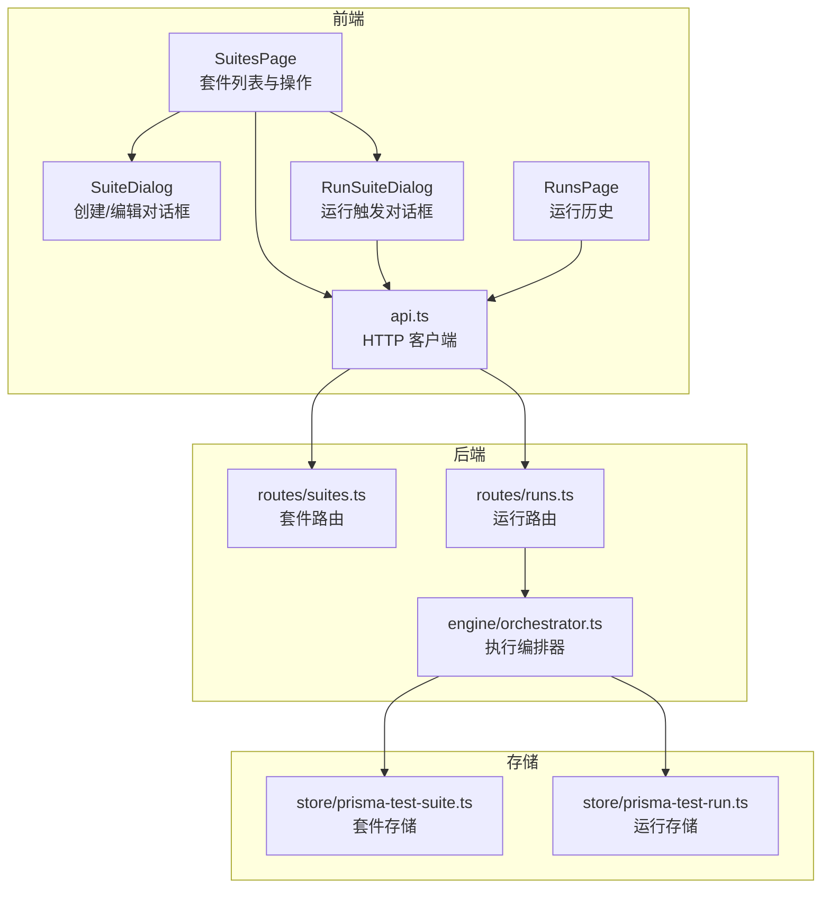
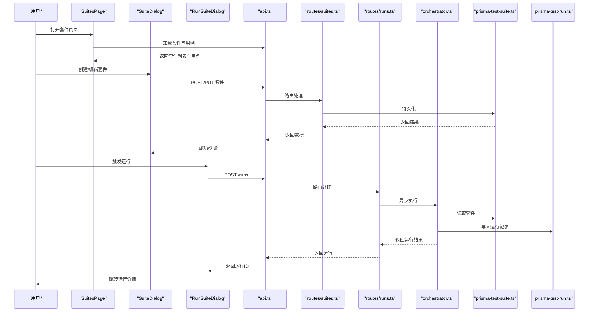
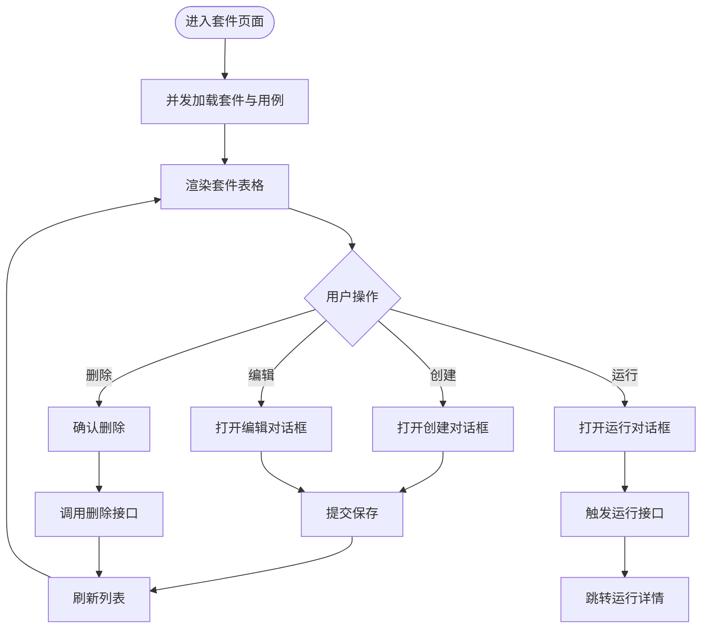
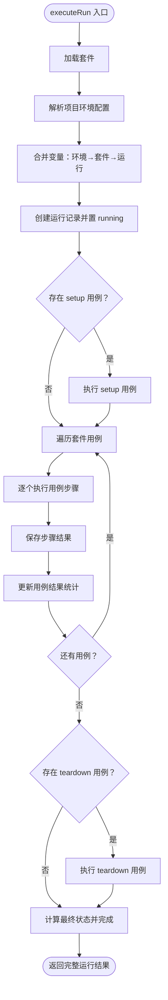
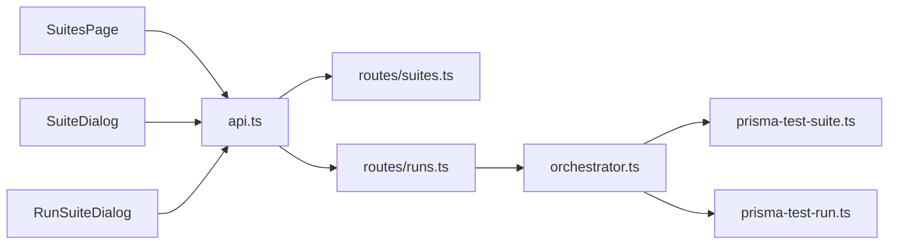

# 测试套件页面

<cite>
**本文引用的文件**
- [packages/web/src/pages/suites.tsx](file://packages/web/src/pages/suites.tsx)
- [packages/web/src/lib/api.ts](file://packages/web/src/lib/api.ts)
- [packages/core/src/models/test-suite.ts](file://packages/core/src/models/test-suite.ts)
- [packages/core/src/store/prisma-test-suite.ts](file://packages/core/src/store/prisma-test-suite.ts)
- [packages/server/src/routes/suites.ts](file://packages/server/src/routes/suites.ts)
- [packages/server/src/routes/runs.ts](file://packages/server/src/routes/runs.ts)
- [packages/core/src/engine/orchestrator.ts](file://packages/core/src/engine/orchestrator.ts)
- [packages/core/src/store/prisma-test-run.ts](file://packages/core/src/store/prisma-test-run.ts)
- [packages/web/src/pages/runs.tsx](file://packages/web/src/pages/runs.tsx)
- [packages/web/src/i18n/locales/zh-CN.ts](file://packages/web/src/i18n/locales/zh-CN.ts)
</cite>

## 目录
1. [简介](#简介)
2. [项目结构](#项目结构)
3. [核心组件](#核心组件)
4. [架构总览](#架构总览)
5. [详细组件分析](#详细组件分析)
6. [依赖关系分析](#依赖关系分析)
7. [性能考量](#性能考量)
8. [故障排查指南](#故障排查指南)
9. [结论](#结论)
10. [附录](#附录)

## 简介
本文件面向“测试套件页面”的技术文档，系统性阐述测试套件的组织结构、创建/编辑/复制/删除流程、并行执行配置、环境变量与执行参数管理、执行历史与进度跟踪、结果分析、模板使用、批量操作以及性能监控实现。文档以仓库现有代码为依据，结合前端页面、后端路由、核心引擎与存储层，给出清晰的架构图与流程图，并提供可操作的排障建议。

## 项目结构
测试套件页面位于 Web 前端工程中，围绕页面组件、API 客户端、服务端路由与核心引擎/存储层协同工作。关键模块包括：
- 页面组件：负责展示套件列表、创建/编辑对话框、运行触发对话框
- API 客户端：封装对后端接口的调用，统一错误处理
- 服务端路由：暴露套件与运行的 REST 接口
- 核心引擎：编排执行流程，合并变量，产出运行结果
- 存储层：持久化测试套件与运行结果

图表来源
- [packages/web/src/pages/suites.tsx:26-151](file://packages/web/src/pages/suites.tsx#L26-L151)
- [packages/web/src/pages/suites.tsx:155-323](file://packages/web/src/pages/suites.tsx#L155-L323)
- [packages/web/src/lib/api.ts:167-189](file://packages/web/src/lib/api.ts#L167-L189)
- [packages/server/src/routes/suites.ts:5-48](file://packages/server/src/routes/suites.ts#L5-L48)
- [packages/server/src/routes/runs.ts:5-44](file://packages/server/src/routes/runs.ts#L5-L44)
- [packages/core/src/engine/orchestrator.ts:25-140](file://packages/core/src/engine/orchestrator.ts#L25-L140)
- [packages/core/src/store/prisma-test-suite.ts:23-77](file://packages/core/src/store/prisma-test-suite.ts#L23-L77)
- [packages/core/src/store/prisma-test-run.ts:64-194](file://packages/core/src/store/prisma-test-run.ts#L64-L194)
- [packages/web/src/pages/runs.tsx:29-119](file://packages/web/src/pages/runs.tsx#L29-L119)

章节来源
- [packages/web/src/pages/suites.tsx:26-151](file://packages/web/src/pages/suites.tsx#L26-L151)
- [packages/web/src/lib/api.ts:167-189](file://packages/web/src/lib/api.ts#L167-L189)
- [packages/server/src/routes/suites.ts:5-48](file://packages/server/src/routes/suites.ts#L5-L48)
- [packages/server/src/routes/runs.ts:5-44](file://packages/server/src/routes/runs.ts#L5-L44)
- [packages/core/src/engine/orchestrator.ts:25-140](file://packages/core/src/engine/orchestrator.ts#L25-L140)
- [packages/core/src/store/prisma-test-suite.ts:23-77](file://packages/core/src/store/prisma-test-suite.ts#L23-L77)
- [packages/core/src/store/prisma-test-run.ts:64-194](file://packages/core/src/store/prisma-test-run.ts#L64-L194)
- [packages/web/src/pages/runs.tsx:29-119](file://packages/web/src/pages/runs.tsx#L29-L119)

## 核心组件
- 套件模型与校验：定义套件字段、创建与更新的 Zod 校验规则，确保前后端一致的数据契约
- 套件存储：基于 Prisma 的 CRUD 实现，负责序列化/反序列化 JSON 字段
- 套件页面：加载套件与用例、渲染表格、弹窗创建/编辑、触发运行
- 运行触发：选择环境并发起运行，跳转到运行详情页
- 运行历史：分页列出运行记录，计算通过率与耗时
- 执行编排：解析环境变量合并策略，执行用例步骤，产出结果与统计

章节来源
- [packages/core/src/models/test-suite.ts:3-43](file://packages/core/src/models/test-suite.ts#L3-L43)
- [packages/core/src/store/prisma-test-suite.ts:23-77](file://packages/core/src/store/prisma-test-suite.ts#L23-L77)
- [packages/web/src/pages/suites.tsx:26-151](file://packages/web/src/pages/suites.tsx#L26-L151)
- [packages/web/src/pages/suites.tsx:155-323](file://packages/web/src/pages/suites.tsx#L155-L323)
- [packages/web/src/pages/runs.tsx:29-119](file://packages/web/src/pages/runs.tsx#L29-L119)
- [packages/core/src/engine/orchestrator.ts:25-140](file://packages/core/src/engine/orchestrator.ts#L25-L140)

## 架构总览
下图展示了从前端页面到后端路由再到核心引擎与存储的整体交互：

图表来源
- [packages/web/src/pages/suites.tsx:26-151](file://packages/web/src/pages/suites.tsx#L26-L151)
- [packages/web/src/pages/suites.tsx:155-323](file://packages/web/src/pages/suites.tsx#L155-L323)
- [packages/web/src/lib/api.ts:167-189](file://packages/web/src/lib/api.ts#L167-L189)
- [packages/server/src/routes/suites.ts:5-48](file://packages/server/src/routes/suites.ts#L5-L48)
- [packages/server/src/routes/runs.ts:5-44](file://packages/server/src/routes/runs.ts#L5-L44)
- [packages/core/src/engine/orchestrator.ts:25-140](file://packages/core/src/engine/orchestrator.ts#L25-L140)
- [packages/core/src/store/prisma-test-suite.ts:23-77](file://packages/core/src/store/prisma-test-suite.ts#L23-L77)
- [packages/core/src/store/prisma-test-run.ts:64-194](file://packages/core/src/store/prisma-test-run.ts#L64-L194)

## 详细组件分析

### 套件页面组件（SuitesPage）
- 功能要点
  - 加载当前项目下的套件与用例列表
  - 渲染套件表格，显示名称、用例数量、环境、并行度等
  - 支持创建新套件、编辑现有套件、删除套件
  - 触发运行：选择环境后异步执行，完成后跳转到运行详情页
- 关键交互
  - 列表加载：并发获取套件与用例，避免阻塞
  - 删除确认：二次确认防止误删
  - 对话框联动：创建/编辑与运行触发对话框独立但共享环境列表

图表来源
- [packages/web/src/pages/suites.tsx:37-49](file://packages/web/src/pages/suites.tsx#L37-L49)
- [packages/web/src/pages/suites.tsx:51-55](file://packages/web/src/pages/suites.tsx#L51-L55)
- [packages/web/src/pages/suites.tsx:113-125](file://packages/web/src/pages/suites.tsx#L113-L125)
- [packages/web/src/pages/suites.tsx:143-148](file://packages/web/src/pages/suites.tsx#L143-L148)

章节来源
- [packages/web/src/pages/suites.tsx:26-151](file://packages/web/src/pages/suites.tsx#L26-L151)
- [packages/web/src/pages/suites.tsx:155-323](file://packages/web/src/pages/suites.tsx#L155-L323)

### 套件创建/编辑对话框（SuiteDialog）
- 功能要点
  - 名称必填校验
  - 描述、环境、用例多选
  - 保存时根据是否存在 id 决定创建或更新
- 数据绑定
  - 使用 useState 维护表单状态
  - 用例勾选通过 toggleCase 切换集合

章节来源
- [packages/web/src/pages/suites.tsx:155-323](file://packages/web/src/pages/suites.tsx#L155-L323)

### 运行触发对话框（RunSuiteDialog）
- 功能要点
  - 选择环境并触发运行
  - 触发后立即返回运行 ID 并跳转详情页
- 参数
  - 触发来源标记为 manual

章节来源
- [packages/web/src/pages/suites.tsx:266-323](file://packages/web/src/pages/suites.tsx#L266-L323)
- [packages/web/src/lib/api.ts:178-189](file://packages/web/src/lib/api.ts#L178-L189)

### 套件模型与存储
- 模型定义
  - 包含 id、projectId、name、description、testCaseIds、parallelism、environment、variables、setupCaseId、teardownCaseId、createdAt、updatedAt
  - 创建/更新使用 Zod 校验，保证字段约束
- 存储实现
  - JSON 序列化/反序列化 testCaseIds 与 variables
  - 提供按项目查询、按 ID 查询、更新、删除等操作

章节来源
- [packages/core/src/models/test-suite.ts:3-43](file://packages/core/src/models/test-suite.ts#L3-L43)
- [packages/core/src/store/prisma-test-suite.ts:23-77](file://packages/core/src/store/prisma-test-suite.ts#L23-L77)

### 后端路由与 API 客户端
- 套件路由
  - POST /projects/:projectId/suites 创建
  - GET /projects/:projectId/suites 列表
  - GET /suites/:id 获取
  - PUT /suites/:id 更新
  - DELETE /suites/:id 删除
- 运行路由
  - POST /runs 触发运行
  - GET /runs 列表
  - GET /runs/:id 详情
- API 客户端
  - 统一封装请求与错误处理
  - 提供 suites、runs、testCases 等模块化接口

章节来源
- [packages/server/src/routes/suites.ts:5-48](file://packages/server/src/routes/suites.ts#L5-L48)
- [packages/server/src/routes/runs.ts:5-44](file://packages/server/src/routes/runs.ts#L5-L44)
- [packages/web/src/lib/api.ts:167-189](file://packages/web/src/lib/api.ts#L167-L189)

### 执行编排与变量合并
- 变量合并顺序
  - 环境变量 → 套件变量 → 运行级变量
- 执行流程
  - 初始化运行记录并置为 running
  - 可选执行 setup 用例
  - 逐个执行套件中的用例，记录步骤结果与统计
  - 可选执行 teardown 用例
  - 更新运行状态与统计，发出事件通知

图表来源
- [packages/core/src/engine/orchestrator.ts:25-140](file://packages/core/src/engine/orchestrator.ts#L25-L140)

章节来源
- [packages/core/src/engine/orchestrator.ts:25-140](file://packages/core/src/engine/orchestrator.ts#L25-L140)

### 运行历史与结果分析
- 运行历史页面
  - 分页加载最近运行
  - 展示状态、环境、用例总数/通过数、通过率、耗时、触发来源、时间
- 结果统计
  - 通过率按 totalCases/ passedCases 计算
  - 耗时以秒为单位展示

章节来源
- [packages/web/src/pages/runs.tsx:29-119](file://packages/web/src/pages/runs.tsx#L29-L119)
- [packages/core/src/store/prisma-test-run.ts:91-131](file://packages/core/src/store/prisma-test-run.ts#L91-L131)

### 套件模板使用与批量操作
- 模板使用
  - 通过“复制”用例实现模板复用（复制用例后可在创建套件时选择）
- 批量操作
  - 在套件创建/编辑对话框中多选用例，一次性加入套件
  - 删除套件为单条操作，可通过筛选后批量选择实现

章节来源
- [packages/web/src/pages/suites.tsx:155-323](file://packages/web/src/pages/suites.tsx#L155-L323)
- [packages/web/src/lib/api.ts:150-165](file://packages/web/src/lib/api.ts#L150-L165)

### 性能监控实现
- 运行耗时
  - 运行记录包含 durationMs，页面按秒展示
- 步骤耗时
  - 步骤结果包含 durationMs，便于定位慢步骤
- 并发度
  - 套件模型包含 parallelism 字段，用于配置并行度（当前页面未直接使用该字段，后续可扩展）

章节来源
- [packages/core/src/store/prisma-test-run.ts:11-27](file://packages/core/src/store/prisma-test-run.ts#L11-L27)
- [packages/core/src/models/test-suite.ts:9](file://packages/core/src/models/test-suite.ts#L9)
- [packages/web/src/pages/runs.tsx:100-102](file://packages/web/src/pages/runs.tsx#L100-L102)

## 依赖关系分析
- 前端依赖
  - SuitesPage 依赖 api.ts、i18n、UI 组件库
  - SuiteDialog/RunSuiteDialog 依赖 api.ts 与项目上下文
- 后端依赖
  - routes/suites.ts 依赖 testSuiteRepo
  - routes/runs.ts 依赖 orchestrator 与 testRunRepo
- 核心依赖
  - orchestrator 依赖多个仓库与插件注册表
  - 存储层依赖 Prisma 客户端

图表来源
- [packages/web/src/pages/suites.tsx:26-151](file://packages/web/src/pages/suites.tsx#L26-L151)
- [packages/web/src/pages/suites.tsx:155-323](file://packages/web/src/pages/suites.tsx#L155-L323)
- [packages/web/src/lib/api.ts:167-189](file://packages/web/src/lib/api.ts#L167-L189)
- [packages/server/src/routes/suites.ts:5-48](file://packages/server/src/routes/suites.ts#L5-L48)
- [packages/server/src/routes/runs.ts:5-44](file://packages/server/src/routes/runs.ts#L5-L44)
- [packages/core/src/engine/orchestrator.ts:25-140](file://packages/core/src/engine/orchestrator.ts#L25-L140)
- [packages/core/src/store/prisma-test-suite.ts:23-77](file://packages/core/src/store/prisma-test-suite.ts#L23-L77)
- [packages/core/src/store/prisma-test-run.ts:64-194](file://packages/core/src/store/prisma-test-run.ts#L64-L194)

章节来源
- [packages/web/src/pages/suites.tsx:26-151](file://packages/web/src/pages/suites.tsx#L26-L151)
- [packages/web/src/lib/api.ts:167-189](file://packages/web/src/lib/api.ts#L167-L189)
- [packages/server/src/routes/suites.ts:5-48](file://packages/server/src/routes/suites.ts#L5-L48)
- [packages/server/src/routes/runs.ts:5-44](file://packages/server/src/routes/runs.ts#L5-L44)
- [packages/core/src/engine/orchestrator.ts:25-140](file://packages/core/src/engine/orchestrator.ts#L25-L140)
- [packages/core/src/store/prisma-test-suite.ts:23-77](file://packages/core/src/store/prisma-test-suite.ts#L23-L77)
- [packages/core/src/store/prisma-test-run.ts:64-194](file://packages/core/src/store/prisma-test-run.ts#L64-L194)

## 性能考量
- 前端
  - 并发加载套件与用例，减少首屏等待
  - 对话框内表单状态本地化，避免频繁网络请求
- 后端
  - 运行触发立即返回，后台异步执行，提升响应速度
  - 存储层使用分页查询，限制默认页大小
- 执行层面
  - 变量合并与运行记录写入采用最小必要字段更新
  - 步骤结果按序写入，便于增量分析

## 故障排查指南
- 套件创建/编辑失败
  - 检查名称是否为空、用例是否正确选择
  - 查看 API 返回的错误信息，确认字段校验
- 运行无法触发
  - 确认选择了环境；检查触发接口返回
  - 查看运行历史是否出现 pending/running 状态
- 结果缺失或统计异常
  - 检查运行记录是否成功写入
  - 核对步骤结果是否全部保存
- 变量未生效
  - 确认环境变量、套件变量、运行变量的合并顺序
  - 检查变量名是否重复覆盖

章节来源
- [packages/web/src/lib/api.ts:3-12](file://packages/web/src/lib/api.ts#L3-L12)
- [packages/web/src/pages/suites.tsx:193-205](file://packages/web/src/pages/suites.tsx#L193-L205)
- [packages/server/src/routes/runs.ts:7-19](file://packages/server/src/routes/runs.ts#L7-L19)
- [packages/core/src/engine/orchestrator.ts:34-46](file://packages/core/src/engine/orchestrator.ts#L34-L46)
- [packages/core/src/store/prisma-test-run.ts:117-131](file://packages/core/src/store/prisma-test-run.ts#L117-L131)

## 结论
测试套件页面以清晰的组件划分与完善的前后端协作实现了从套件管理到运行执行的闭环。通过标准化的模型与存储、可组合的执行编排以及直观的结果展示，用户可以高效地组织测试、批量选择用例、灵活配置环境变量与执行参数，并通过运行历史与结果分析持续优化测试质量。后续可考虑在页面层引入并行度配置与实时进度反馈，进一步提升用户体验。

## 附录
- 国际化词条
  - 套件列表与对话框标题、描述、占位符等均在 i18n 中维护，便于多语言支持

章节来源
- [packages/web/src/i18n/locales/zh-CN.ts:240-257](file://packages/web/src/i18n/locales/zh-CN.ts#L240-L257)