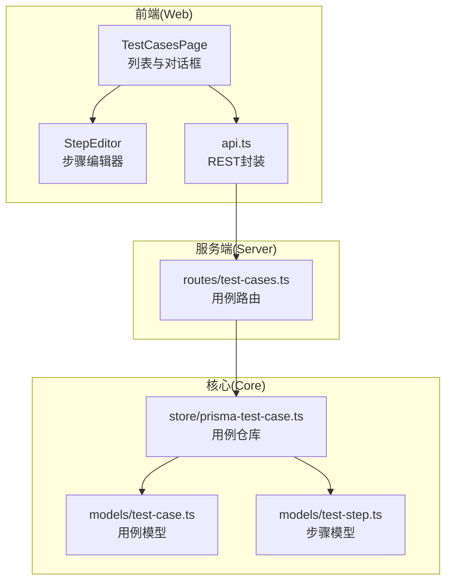
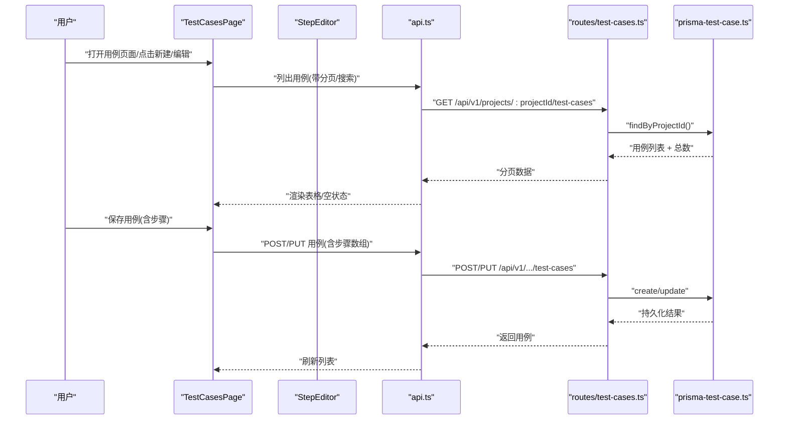
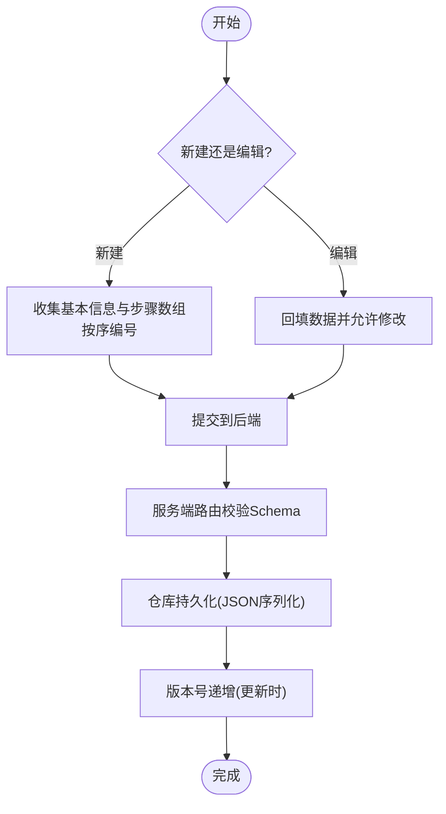
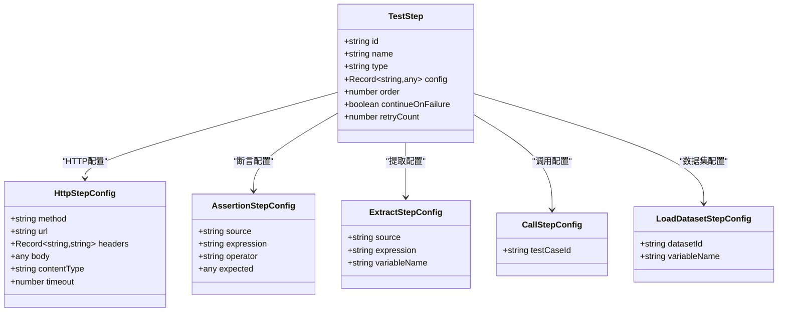
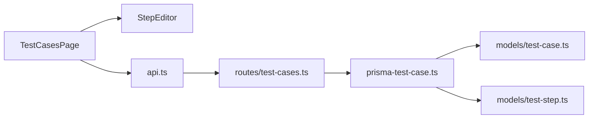

# 测试用例页面

<cite>
**本文引用的文件**
- [packages/web/src/pages/test-cases.tsx](file://packages/web/src/pages/test-cases.tsx)
- [packages/web/src/components/step-editor.tsx](file://packages/web/src/components/step-editor.tsx)
- [packages/web/src/lib/api.ts](file://packages/web/src/lib/api.ts)
- [packages/server/src/routes/test-cases.ts](file://packages/server/src/routes/test-cases.ts)
- [packages/core/src/models/test-case.ts](file://packages/core/src/models/test-case.ts)
- [packages/core/src/models/test-step.ts](file://packages/core/src/models/test-step.ts)
- [packages/core/src/store/prisma-test-case.ts](file://packages/core/src/store/prisma-test-case.ts)
- [docs/review-report/specs-review-2026-04-24.md](file://docs/review-report/specs-review-2026-04-24.md)
</cite>

## 目录
1. [简介](#简介)
2. [项目结构](#项目结构)
3. [核心组件](#核心组件)
4. [架构总览](#架构总览)
5. [详细组件分析](#详细组件分析)
6. [依赖分析](#依赖分析)
7. [性能考量](#性能考量)
8. [故障排查指南](#故障排查指南)
9. [结论](#结论)
10. [附录](#附录)

## 简介
本文件面向“测试用例页面”的技术文档，围绕用例编辑器、步骤管理、数据驱动测试、模板与批量编辑、版本管理、导入导出与AI辅助生成等主题进行系统化说明。文档同时提供可视化架构图、序列图与流程图，帮助开发者与测试工程师快速理解并高效使用测试用例页面。

## 项目结构
测试用例页面位于前端工程中，采用分层组织：
- 页面层：负责列表展示、对话框交互、步骤视图切换（表单/流水线）。
- 组件层：步骤编辑器（StepEditor）提供HTTP/断言/提取/调用/加载数据集五类步骤的可视化配置。
- API层：封装REST接口，统一请求与响应结构。
- 服务端路由：提供用例的增删改查与复制能力。
- 核心模型与存储：定义用例与步骤的数据结构、校验规则以及持久化实现。

图表来源
- [packages/web/src/pages/test-cases.tsx:1-354](file://packages/web/src/pages/test-cases.tsx#L1-L354)
- [packages/web/src/components/step-editor.tsx:1-378](file://packages/web/src/components/step-editor.tsx#L1-L378)
- [packages/web/src/lib/api.ts:149-165](file://packages/web/src/lib/api.ts#L149-L165)
- [packages/server/src/routes/test-cases.ts:1-69](file://packages/server/src/routes/test-cases.ts#L1-L69)
- [packages/core/src/models/test-case.ts:1-46](file://packages/core/src/models/test-case.ts#L1-L46)
- [packages/core/src/models/test-step.ts:1-102](file://packages/core/src/models/test-step.ts#L1-L102)
- [packages/core/src/store/prisma-test-case.ts:1-148](file://packages/core/src/store/prisma-test-case.ts#L1-L148)

章节来源
- [packages/web/src/pages/test-cases.tsx:1-354](file://packages/web/src/pages/test-cases.tsx#L1-L354)
- [packages/web/src/components/step-editor.tsx:1-378](file://packages/web/src/components/step-editor.tsx#L1-L378)
- [packages/web/src/lib/api.ts:149-165](file://packages/web/src/lib/api.ts#L149-L165)
- [packages/server/src/routes/test-cases.ts:1-69](file://packages/server/src/routes/test-cases.ts#L1-L69)
- [packages/core/src/models/test-case.ts:1-46](file://packages/core/src/models/test-case.ts#L1-L46)
- [packages/core/src/models/test-step.ts:1-102](file://packages/core/src/models/test-step.ts#L1-L102)
- [packages/core/src/store/prisma-test-case.ts:1-148](file://packages/core/src/store/prisma-test-case.ts#L1-L148)

## 核心组件
- 测试用例页面(TestCasesPage)
  - 功能：项目上下文下的用例列表、搜索、新建/编辑对话框、复制、删除。
  - 关键交互：分页加载、标签过滤、优先级徽标、步骤数量显示。
- 步骤编辑器(StepEditor)
  - 功能：支持五种步骤类型（HTTP/断言/提取/调用/加载数据集）的可视化配置，支持拖拽排序、失败继续、重试次数等通用属性。
  - 关键特性：按步骤类型动态渲染配置面板；懒加载可用用例与数据集；表达式占位与提示。
- API封装(api.ts)
  - 功能：统一REST客户端，封装用例、套件、运行、数据集、AI生成等接口。
  - 关键点：统一错误处理、分页响应结构、版本前缀路径。
- 服务端路由(routes/test-cases.ts)
  - 功能：提供用例的创建、查询、更新、删除、复制接口，参数解析与分页元信息返回。
- 核心模型与存储
  - 用例模型：名称、模块、标签、优先级、步骤数组、变量、版本号、时间戳。
  - 步骤模型：名称、类型、配置、顺序、失败继续、重试次数。
  - 仓库实现：JSON序列化持久化、分页查询、标签后置过滤、版本递增更新、复制逻辑。

章节来源
- [packages/web/src/pages/test-cases.tsx:35-188](file://packages/web/src/pages/test-cases.tsx#L35-L188)
- [packages/web/src/components/step-editor.tsx:43-378](file://packages/web/src/components/step-editor.tsx#L43-L378)
- [packages/web/src/lib/api.ts:149-165](file://packages/web/src/lib/api.ts#L149-L165)
- [packages/server/src/routes/test-cases.ts:5-68](file://packages/server/src/routes/test-cases.ts#L5-L68)
- [packages/core/src/models/test-case.ts:7-46](file://packages/core/src/models/test-case.ts#L7-L46)
- [packages/core/src/models/test-step.ts:74-102](file://packages/core/src/models/test-step.ts#L74-L102)
- [packages/core/src/store/prisma-test-case.ts:23-148](file://packages/core/src/store/prisma-test-case.ts#L23-L148)

## 架构总览
测试用例页面从前端到后端的关键交互如下：

图表来源
- [packages/web/src/pages/test-cases.tsx:44-52](file://packages/web/src/pages/test-cases.tsx#L44-L52)
- [packages/web/src/lib/api.ts:151-165](file://packages/web/src/lib/api.ts#L151-L165)
- [packages/server/src/routes/test-cases.ts:20-52](file://packages/server/src/routes/test-cases.ts#L20-L52)
- [packages/core/src/store/prisma-test-case.ts:24-126](file://packages/core/src/store/prisma-test-case.ts#L24-L126)

## 详细组件分析

### 用例创建、编辑、复制与删除
- 创建
  - 前端：TestCasesPage弹出对话框，收集基本信息与步骤数组，按顺序编号后提交。
  - 后端：路由接收projectId并校验创建Schema，仓库创建时为每个步骤生成唯一ID并写入数据库。
- 编辑
  - 前端：编辑对话框回填现有数据，支持步骤增删、移动、配置变更。
  - 后端：路由接收更新Schema，仓库更新时版本号递增，步骤数组重新编号并持久化。
- 复制
  - 前端：调用duplicate接口，仓库克隆现有用例并追加后缀。
  - 后端：路由转发至仓库duplicate实现。
- 删除
  - 前端：二次确认后调用delete接口。
  - 后端：路由删除对应记录。

图表来源
- [packages/web/src/pages/test-cases.tsx:192-240](file://packages/web/src/pages/test-cases.tsx#L192-L240)
- [packages/server/src/routes/test-cases.ts:7-17](file://packages/server/src/routes/test-cases.ts#L7-L17)
- [packages/core/src/store/prisma-test-case.ts:24-45](file://packages/core/src/store/prisma-test-case.ts#L24-L45)
- [packages/core/src/store/prisma-test-case.ts:101-126](file://packages/core/src/store/prisma-test-case.ts#L101-L126)
- [packages/server/src/routes/test-cases.ts:61-67](file://packages/server/src/routes/test-cases.ts#L61-L67)
- [packages/core/src/store/prisma-test-case.ts:132-146](file://packages/core/src/store/prisma-test-case.ts#L132-L146)

章节来源
- [packages/web/src/pages/test-cases.tsx:54-63](file://packages/web/src/pages/test-cases.tsx#L54-L63)
- [packages/server/src/routes/test-cases.ts:54-58](file://packages/server/src/routes/test-cases.ts#L54-L58)
- [packages/core/src/store/prisma-test-case.ts:128-130](file://packages/core/src/store/prisma-test-case.ts#L128-L130)

### 步骤类型定义与配置
- 步骤类型
  - HTTP：方法、URL、请求头、请求体、内容类型、超时。
  - 断言：来源（状态/头/体/JSONPath/变量）、运算符、期望值、表达式。
  - 提取：来源（体/JSONPath/头/状态/正则）、表达式、变量名。
  - 调用：目标用例ID。
  - 加载数据集：数据集ID、变量名。
- 通用属性
  - 名称、顺序、失败继续、重试次数。
- 表单行为
  - StepEditor根据类型动态渲染配置项；懒加载可用用例与数据集；表达式输入具备占位与提示。

图表来源
- [packages/core/src/models/test-step.ts:10-102](file://packages/core/src/models/test-step.ts#L10-L102)
- [packages/web/src/components/step-editor.tsx:19-378](file://packages/web/src/components/step-editor.tsx#L19-L378)

章节来源
- [packages/core/src/models/test-step.ts:5-102](file://packages/core/src/models/test-step.ts#L5-L102)
- [packages/web/src/components/step-editor.tsx:184-373](file://packages/web/src/components/step-editor.tsx#L184-L373)

### 变量引用与条件逻辑
- 变量引用
  - 用例级variables：键值对，可在断言/提取等步骤中被引用。
  - 提取步骤：将上游响应结果抽取到变量，供后续步骤使用。
- 条件逻辑
  - 断言步骤支持多种运算符与来源，可组合复杂断言。
  - 失败继续：单步失败不影响后续步骤执行（适用于容错场景）。
  - 重试次数：单步失败时自动重试，提升稳定性。

章节来源
- [packages/core/src/models/test-case.ts:16](file://packages/core/src/models/test-case.ts#L16)
- [packages/web/src/components/step-editor.tsx:158-182](file://packages/web/src/components/step-editor.tsx#L158-L182)
- [packages/core/src/models/test-step.ts:38-43](file://packages/core/src/models/test-step.ts#L38-L43)

### 数据驱动测试支持
- 加载数据集步骤
  - 通过“加载数据集”步骤将数据集行注入为变量，配合断言/提取形成数据驱动场景。
- 表达式与来源
  - JSONPath/正则/头/状态等多来源表达式，满足不同断言需求。
- 懒加载与可搜索选择
  - StepEditor在切换到相关类型时才加载可用数据集与用例，减少初始开销。

章节来源
- [packages/core/src/models/test-step.ts:57-60](file://packages/core/src/models/test-step.ts#L57-L60)
- [packages/web/src/components/step-editor.tsx:67-73](file://packages/web/src/components/step-editor.tsx#L67-L73)
- [packages/web/src/components/step-editor.tsx:344-373](file://packages/web/src/components/step-editor.tsx#L344-L373)

### 用例模板系统、批量编辑与版本管理
- 模板系统
  - 通过“复制用例”实现模板复用，复制后可快速调整步骤与变量。
- 批量编辑
  - 前端支持步骤增删、移动、配置变更，适合批量微调。
- 版本管理
  - 更新用例时版本号递增，便于审计与回溯。

章节来源
- [packages/server/src/routes/test-cases.ts:61-67](file://packages/server/src/routes/test-cases.ts#L61-L67)
- [packages/core/src/store/prisma-test-case.ts:105](file://packages/core/src/store/prisma-test-case.ts#L105)
- [packages/web/src/pages/test-cases.tsx:162](file://packages/web/src/pages/test-cases.tsx#L162)

### 用例导入导出、AI辅助生成与最佳实践
- 导入导出
  - 服务端提供用例的增删改查与复制接口，结合前端分页与搜索，可实现“导出”（下载列表）与“导入”（批量创建）的协作流程。
- AI辅助生成
  - 项目提供了AI生成相关规范与接口（生成任务、确认入库等），可用于将自然语言描述转化为用例草稿，再由人工确认入库。
- 最佳实践
  - 使用“失败继续”与“重试次数”提升稳定性。
  - 将公共变量集中于用例级variables，减少重复配置。
  - 使用“加载数据集”实现参数化测试，提高覆盖率。
  - 通过复制用例构建模板，统一团队规范。

章节来源
- [packages/web/src/lib/api.ts:149-165](file://packages/web/src/lib/api.ts#L149-L165)
- [packages/web/src/lib/api.ts:313-324](file://packages/web/src/lib/api.ts#L313-L324)
- [docs/review-report/specs-review-2026-04-24.md:33-53](file://docs/review-report/specs-review-2026-04-24.md#L33-L53)

## 依赖分析
- 前端页面依赖步骤编辑器与API封装，后者对接服务端路由。
- 服务端路由依赖用例仓库，仓库使用Prisma进行JSON序列化存储。
- 核心模型提供类型与校验，保证前后端契约一致。

图表来源
- [packages/web/src/pages/test-cases.tsx:192-351](file://packages/web/src/pages/test-cases.tsx#L192-L351)
- [packages/web/src/components/step-editor.tsx:54-378](file://packages/web/src/components/step-editor.tsx#L54-L378)
- [packages/web/src/lib/api.ts:149-165](file://packages/web/src/lib/api.ts#L149-L165)
- [packages/server/src/routes/test-cases.ts:1-69](file://packages/server/src/routes/test-cases.ts#L1-L69)
- [packages/core/src/models/test-case.ts:1-46](file://packages/core/src/models/test-case.ts#L1-L46)
- [packages/core/src/models/test-step.ts:1-102](file://packages/core/src/models/test-step.ts#L1-L102)
- [packages/core/src/store/prisma-test-case.ts:1-148](file://packages/core/src/store/prisma-test-case.ts#L1-L148)

章节来源
- [packages/web/src/pages/test-cases.tsx:192-351](file://packages/web/src/pages/test-cases.tsx#L192-L351)
- [packages/server/src/routes/test-cases.ts:1-69](file://packages/server/src/routes/test-cases.ts#L1-L69)
- [packages/core/src/store/prisma-test-case.ts:1-148](file://packages/core/src/store/prisma-test-case.ts#L1-L148)

## 性能考量
- 列表查询
  - 支持分页与搜索，标签过滤在内存中后置处理，建议在数据量较大时优化为服务端过滤。
- 步骤编辑
  - 懒加载用例与数据集，避免不必要的网络请求。
- JSON序列化
  - 用例与步骤以JSON字符串存储，注意字段大小限制与查询性能，必要时拆分或建立索引。

## 故障排查指南
- 404未找到
  - GET用例详情时若返回404，检查ID是否正确或已被删除。
- 保存失败
  - 校验前端必填项（名称），后端Schema校验失败会抛出错误；检查请求体结构与字段类型。
- 复制异常
  - 确认源用例存在，仓库实现会抛出“未找到”错误。
- 搜索/标签过滤无效
  - 标签过滤为后置过滤，建议在服务端实现更高效的过滤策略。

章节来源
- [packages/server/src/routes/test-cases.ts:40-44](file://packages/server/src/routes/test-cases.ts#L40-L44)
- [packages/web/src/lib/api.ts:3-12](file://packages/web/src/lib/api.ts#L3-L12)
- [packages/core/src/store/prisma-test-case.ts:132-146](file://packages/core/src/store/prisma-test-case.ts#L132-L146)

## 结论
测试用例页面提供了完整的用例生命周期管理：从创建、编辑、复制到删除，辅以强大的步骤编辑器与数据驱动能力。结合版本管理与模板复用，能够有效支撑团队协作与持续维护。建议在后续迭代中完善服务端过滤、异步AI生成与认证授权，进一步提升可用性与安全性。

## 附录
- 接口一览（与用例相关）
  - 列表：GET /api/v1/projects/:projectId/test-cases
  - 获取：GET /api/v1/test-cases/:id
  - 新建：POST /api/v1/projects/:projectId/test-cases
  - 更新：PUT /api/v1/test-cases/:id
  - 删除：DELETE /api/v1/test-cases/:id
  - 复制：POST /api/v1/test-cases/:id/duplicate

章节来源
- [packages/web/src/lib/api.ts:151-165](file://packages/web/src/lib/api.ts#L151-L165)
- [packages/server/src/routes/test-cases.ts:20-67](file://packages/server/src/routes/test-cases.ts#L20-L67)