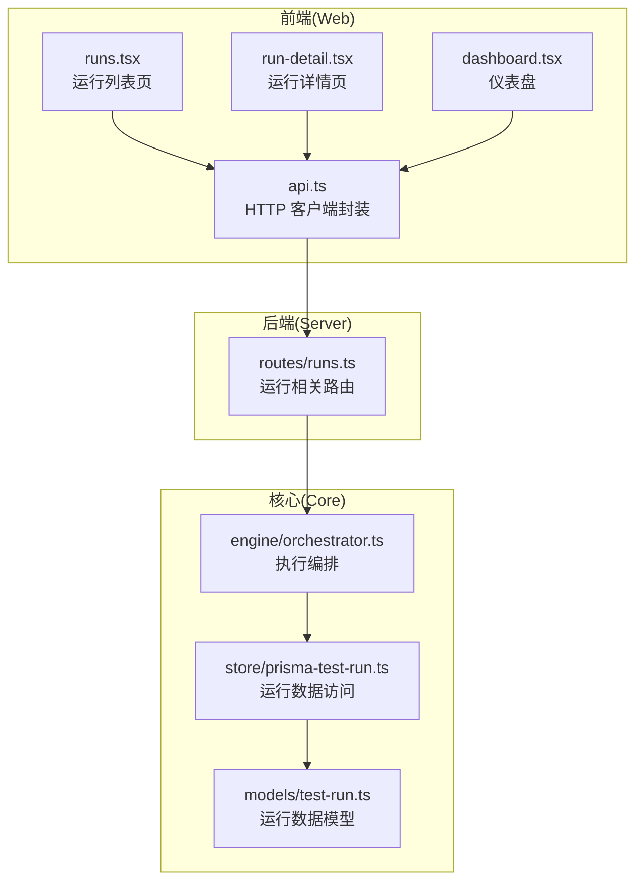
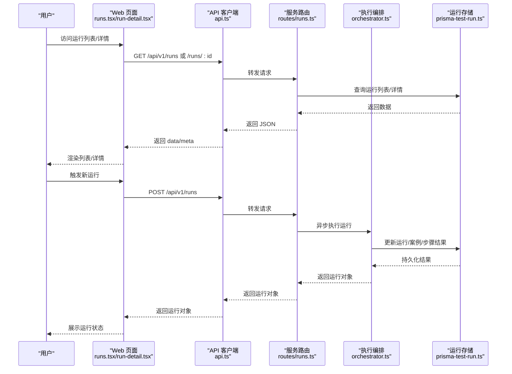
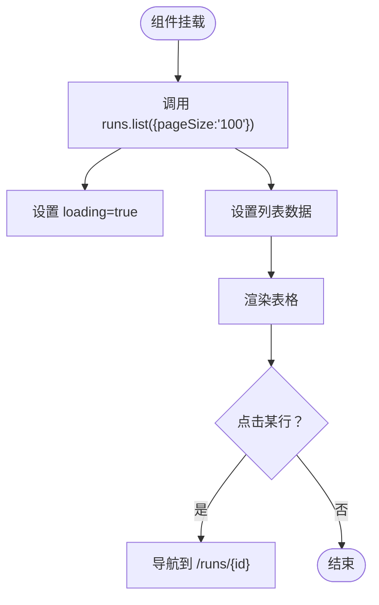
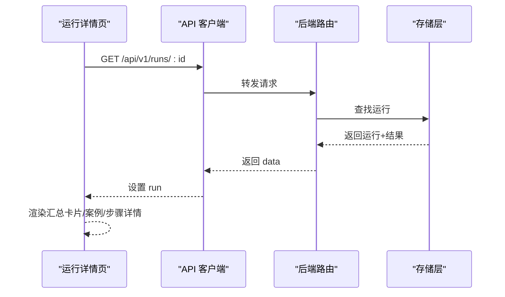
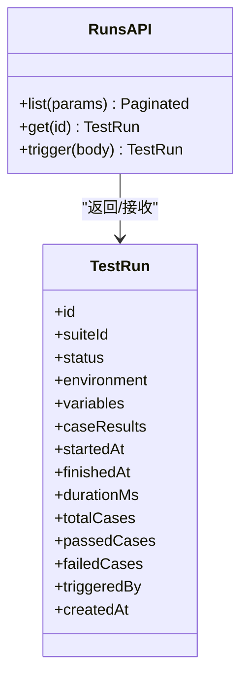
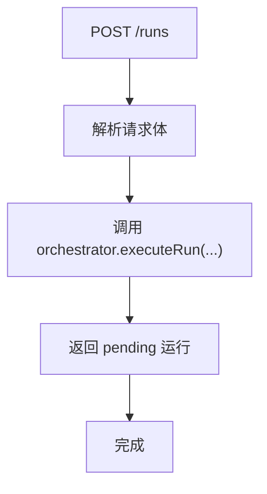
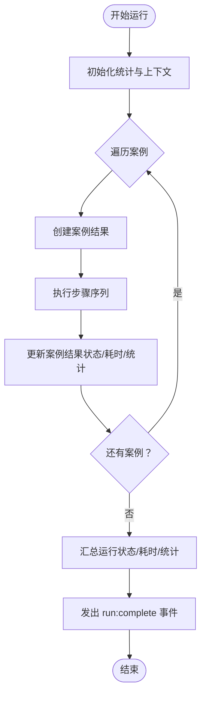
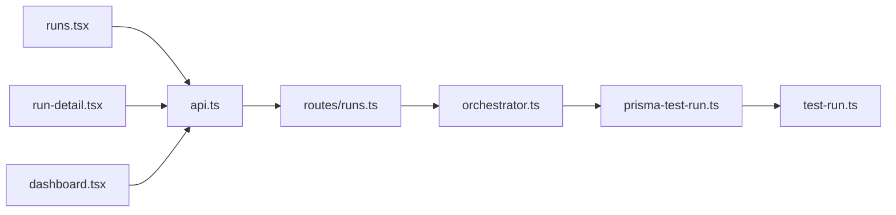

# 测试运行页面

<cite>
**本文引用的文件**
- [packages/web/src/pages/runs.tsx](file://packages/web/src/pages/runs.tsx)
- [packages/web/src/pages/run-detail.tsx](file://packages/web/src/pages/run-detail.tsx)
- [packages/web/src/lib/api.ts](file://packages/web/src/lib/api.ts)
- [packages/server/src/routes/runs.ts](file://packages/server/src/routes/runs.ts)
- [packages/core/src/store/prisma-test-run.ts](file://packages/core/src/store/prisma-test-run.ts)
- [packages/core/src/models/test-run.ts](file://packages/core/src/models/test-run.ts)
- [packages/core/src/engine/orchestrator.ts](file://packages/core/src/engine/orchestrator.ts)
- [packages/web/src/pages/dashboard.tsx](file://packages/web/src/pages/dashboard.tsx)
</cite>

## 目录
1. [简介](#简介)
2. [项目结构](#项目结构)
3. [核心组件](#核心组件)
4. [架构总览](#架构总览)
5. [详细组件分析](#详细组件分析)
6. [依赖分析](#依赖分析)
7. [性能考虑](#性能考虑)
8. [故障排查指南](#故障排查指南)
9. [结论](#结论)
10. [附录](#附录)

## 简介
本技术文档聚焦“测试运行页面”的实现与使用，涵盖以下能力：
- 运行列表：执行状态、实时监控与结果概览
- 历史查询：过滤条件（套件、状态）与排序（按创建时间倒序）
- 运行详情：案例与步骤结果查看、请求/响应/断言/错误信息展示
- 统计与趋势：通过仪表盘卡片与运行详情汇总进行可视化
- 结果导出与报告：当前仓库未提供直接导出/报告生成接口，建议通过运行详情页截图或二次开发扩展

## 项目结构
测试运行页面由前端页面组件与后端 API 路由共同组成，数据模型在核心层定义并持久化存储。



**图示来源**
- [packages/web/src/pages/runs.tsx:1-103](file://packages/web/src/pages/runs.tsx#L1-L103)
- [packages/web/src/pages/run-detail.tsx:1-227](file://packages/web/src/pages/run-detail.tsx#L1-L227)
- [packages/web/src/pages/dashboard.tsx:1-139](file://packages/web/src/pages/dashboard.tsx#L1-L139)
- [packages/web/src/lib/api.ts:178-189](file://packages/web/src/lib/api.ts#L178-L189)
- [packages/server/src/routes/runs.ts:1-45](file://packages/server/src/routes/runs.ts#L1-L45)
- [packages/core/src/engine/orchestrator.ts:71-170](file://packages/core/src/engine/orchestrator.ts#L71-L170)
- [packages/core/src/store/prisma-test-run.ts:91-131](file://packages/core/src/store/prisma-test-run.ts#L91-L131)
- [packages/core/src/models/test-run.ts:88-103](file://packages/core/src/models/test-run.ts#L88-L103)

**章节来源**
- [packages/web/src/pages/runs.tsx:1-103](file://packages/web/src/pages/runs.tsx#L1-L103)
- [packages/web/src/pages/run-detail.tsx:1-227](file://packages/web/src/pages/run-detail.tsx#L1-L227)
- [packages/web/src/pages/dashboard.tsx:1-139](file://packages/web/src/pages/dashboard.tsx#L1-L139)
- [packages/web/src/lib/api.ts:178-189](file://packages/web/src/lib/api.ts#L178-L189)
- [packages/server/src/routes/runs.ts:1-45](file://packages/server/src/routes/runs.ts#L1-L45)
- [packages/core/src/store/prisma-test-run.ts:91-131](file://packages/core/src/store/prisma-test-run.ts#L91-L131)
- [packages/core/src/models/test-run.ts:88-103](file://packages/core/src/models/test-run.ts#L88-L103)
- [packages/core/src/engine/orchestrator.ts:71-170](file://packages/core/src/engine/orchestrator.ts#L71-L170)

## 核心组件
- 运行列表页（runs.tsx）
  - 功能：加载最近运行记录，展示运行 ID、状态、环境、用例数与通过率、时长、触发方式、时间等；点击进入详情。
  - 关键点：分页参数默认 pageSize=100；状态图标与徽章根据状态映射；通过率计算为 passedCases/totalCases*100。
- 运行详情页（run-detail.tsx）
  - 功能：展示运行元信息（环境、触发方式、时长、开始时间）、汇总卡片（总数、通过、失败、通过率），以及每个案例的结果卡片与步骤明细。
  - 关键点：支持展开/折叠案例与步骤；步骤详情包含概览、请求、响应、断言、错误等标签页。
- API 客户端（api.ts）
  - 功能：封装 /api/v1/runs 的 list/get/trigger 接口；返回分页数据结构（data/meta）。
- 后端路由（routes/runs.ts）
  - 功能：POST /runs 触发运行；GET /runs 列表（支持 suiteId/status 分页筛选）；GET /runs/:id 获取详情。
- 数据模型与存储（models/test-run.ts、store/prisma-test-run.ts）
  - 功能：定义运行状态、触发方式、字段约束；提供 findAll/update 等仓储方法，按创建时间倒序。
- 执行编排（engine/orchestrator.ts）
  - 功能：异步执行测试套件，逐案例执行步骤，更新案例与运行结果，最终汇总运行状态与耗时。

**章节来源**
- [packages/web/src/pages/runs.tsx:29-103](file://packages/web/src/pages/runs.tsx#L29-L103)
- [packages/web/src/pages/run-detail.tsx:12-91](file://packages/web/src/pages/run-detail.tsx#L12-L91)
- [packages/web/src/lib/api.ts:178-189](file://packages/web/src/lib/api.ts#L178-L189)
- [packages/server/src/routes/runs.ts:5-44](file://packages/server/src/routes/runs.ts#L5-L44)
- [packages/core/src/models/test-run.ts:88-103](file://packages/core/src/models/test-run.ts#L88-L103)
- [packages/core/src/store/prisma-test-run.ts:91-131](file://packages/core/src/store/prisma-test-run.ts#L91-L131)
- [packages/core/src/engine/orchestrator.ts:71-170](file://packages/core/src/engine/orchestrator.ts#L71-L170)

## 架构总览
从前端到后端的数据流如下：



**图示来源**
- [packages/web/src/pages/runs.tsx:35-37](file://packages/web/src/pages/runs.tsx#L35-L37)
- [packages/web/src/pages/run-detail.tsx:19-22](file://packages/web/src/pages/run-detail.tsx#L19-L22)
- [packages/web/src/lib/api.ts:178-189](file://packages/web/src/lib/api.ts#L178-L189)
- [packages/server/src/routes/runs.ts:7-19](file://packages/server/src/routes/runs.ts#L7-L19)
- [packages/core/src/engine/orchestrator.ts:71-170](file://packages/core/src/engine/orchestrator.ts#L71-L170)
- [packages/core/src/store/prisma-test-run.ts:117-131](file://packages/core/src/store/prisma-test-run.ts#L117-L131)

## 详细组件分析

### 组件一：运行列表页（runs.tsx）
- 数据加载
  - 首次挂载调用 runs.list({ pageSize: "100" })，设置 loading 并渲染表格。
- 表格列
  - 运行 ID（截断显示）、状态徽章、环境、用例统计（通过/总数）、通过率、时长、触发方式、时间。
- 状态映射
  - 图标与变体根据状态映射，支持 passed/failed/error/running/pending/cancelled。
- 交互
  - 点击行跳转至运行详情页。



**图示来源**
- [packages/web/src/pages/runs.tsx:35-37](file://packages/web/src/pages/runs.tsx#L35-L37)
- [packages/web/src/pages/runs.tsx:70-79](file://packages/web/src/pages/runs.tsx#L70-L79)

**章节来源**
- [packages/web/src/pages/runs.tsx:29-103](file://packages/web/src/pages/runs.tsx#L29-L103)

### 组件二：运行详情页（run-detail.tsx）
- 数据加载
  - 从 URL 参数获取运行 ID，调用 runs.get(id)，设置 loading 并渲染详情。
- 汇总卡片
  - 总数、通过数、失败数、通过率；通过率颜色随阈值变化。
- 元信息卡片
  - 环境、触发方式、时长、开始时间。
- 案例结果
  - 每个案例卡片可展开，展示步骤结果；步骤详情包含：
    - 概览：类型、状态、耗时、提取变量
    - 请求：请求体（JSON）
    - 响应：状态码、响应时间、响应体（JSON）
    - 断言：运算符、期望值、实际值、断言结果
    - 错误：错误消息与堆栈



**图示来源**
- [packages/web/src/pages/run-detail.tsx:12-22](file://packages/web/src/pages/run-detail.tsx#L12-L22)
- [packages/web/src/lib/api.ts:178-189](file://packages/web/src/lib/api.ts#L178-L189)
- [packages/server/src/routes/runs.ts:38-43](file://packages/server/src/routes/runs.ts#L38-L43)

**章节来源**
- [packages/web/src/pages/run-detail.tsx:12-91](file://packages/web/src/pages/run-detail.tsx#L12-L91)
- [packages/web/src/pages/run-detail.tsx:93-209](file://packages/web/src/pages/run-detail.tsx#L93-L209)

### 组件三：API 客户端（api.ts）
- 运行相关接口
  - runs.list(params?)：返回分页数据（data/meta）
  - runs.get(id)：获取单个运行详情
  - runs.trigger(body)：触发运行（异步执行，立即返回 pending 运行）



**图示来源**
- [packages/web/src/lib/api.ts:178-189](file://packages/web/src/lib/api.ts#L178-L189)
- [packages/web/src/lib/api.ts:100-115](file://packages/web/src/lib/api.ts#L100-L115)

**章节来源**
- [packages/web/src/lib/api.ts:178-189](file://packages/web/src/lib/api.ts#L178-L189)

### 组件四：后端路由（routes/runs.ts）
- POST /api/v1/runs：解析请求体，调用编排器异步执行运行，立即返回 pending 运行。
- GET /api/v1/runs：支持 suiteId、status、page、pageSize 查询，按创建时间倒序。
- GET /api/v1/runs/:id：返回指定运行详情。



**图示来源**
- [packages/server/src/routes/runs.ts:7-19](file://packages/server/src/routes/runs.ts#L7-L19)

**章节来源**
- [packages/server/src/routes/runs.ts:5-44](file://packages/server/src/routes/runs.ts#L5-L44)

### 组件五：数据模型与存储（models/test-run.ts、store/prisma-test-run.ts）
- 数据模型
  - TestRun：包含状态枚举、触发方式枚举、时间戳、统计字段等。
- 存储层
  - findAll(filters)：支持 suiteId/status 过滤，按 createdAt 倒序，分页。
  - update(id, partial)：更新运行状态、完成时间、耗时与统计字段。

```mermaid
classDiagram
class TestRunModel {
+id
+suiteId
+status
+environment
+variables
+caseResults
+startedAt
+finishedAt
+durationMs
+totalCases
+passedCases
+failedCases
+triggeredBy
+createdAt
}
class TestRunStore {
+findAll(filters) {items,total}
+update(id,data) TestRun
}
TestRunStore --> TestRunModel : "读写"
```

**图示来源**
- [packages/core/src/models/test-run.ts:88-103](file://packages/core/src/models/test-run.ts#L88-L103)
- [packages/core/src/store/prisma-test-run.ts:91-131](file://packages/core/src/store/prisma-test-run.ts#L91-L131)

**章节来源**
- [packages/core/src/models/test-run.ts:82-103](file://packages/core/src/models/test-run.ts#L82-L103)
- [packages/core/src/store/prisma-test-run.ts:91-131](file://packages/core/src/store/prisma-test-run.ts#L91-L131)

### 组件六：执行编排（engine/orchestrator.ts）
- 执行流程
  - 为每个测试案例创建案例结果，执行步骤序列，收集步骤结果，更新案例结果与运行统计。
  - 最终根据失败数量确定运行状态，更新完成时间与总耗时。
- 事件与状态
  - 发出 case:start/case:complete/run:complete 事件，便于外部监听。



**图示来源**
- [packages/core/src/engine/orchestrator.ts:71-170](file://packages/core/src/engine/orchestrator.ts#L71-L170)
- [packages/core/src/engine/orchestrator.ts:117-139](file://packages/core/src/engine/orchestrator.ts#L117-L139)

**章节来源**
- [packages/core/src/engine/orchestrator.ts:71-170](file://packages/core/src/engine/orchestrator.ts#L71-L170)

## 依赖分析
- 前端依赖
  - runs.tsx 依赖 runs.list 与状态图标映射
  - run-detail.tsx 依赖 runs.get 与多标签页展示逻辑
  - dashboard.tsx 依赖 runs.list 用于最近运行展示
- 后端依赖
  - routes/runs.ts 依赖 orchestrator 与 testRunRepo
- 核心依赖
  - orchestrator 依赖 testRunRepo 以持久化运行/案例/步骤结果
  - testRunRepo 基于 Prisma 实现，提供 findAll/update



**图示来源**
- [packages/web/src/pages/runs.tsx](file://packages/web/src/pages/runs.tsx#L8)
- [packages/web/src/pages/run-detail.tsx](file://packages/web/src/pages/run-detail.tsx#L9)
- [packages/web/src/pages/dashboard.tsx](file://packages/web/src/pages/dashboard.tsx#L7)
- [packages/web/src/lib/api.ts:178-189](file://packages/web/src/lib/api.ts#L178-L189)
- [packages/server/src/routes/runs.ts:1-45](file://packages/server/src/routes/runs.ts#L1-L45)
- [packages/core/src/engine/orchestrator.ts:1-20](file://packages/core/src/engine/orchestrator.ts#L1-L20)
- [packages/core/src/store/prisma-test-run.ts:1-20](file://packages/core/src/store/prisma-test-run.ts#L1-L20)
- [packages/core/src/models/test-run.ts:1-20](file://packages/core/src/models/test-run.ts#L1-L20)

**章节来源**
- [packages/web/src/pages/runs.tsx:1-103](file://packages/web/src/pages/runs.tsx#L1-L103)
- [packages/web/src/pages/run-detail.tsx:1-227](file://packages/web/src/pages/run-detail.tsx#L1-L227)
- [packages/web/src/pages/dashboard.tsx:1-139](file://packages/web/src/pages/dashboard.tsx#L1-L139)
- [packages/web/src/lib/api.ts:178-189](file://packages/web/src/lib/api.ts#L178-L189)
- [packages/server/src/routes/runs.ts:1-45](file://packages/server/src/routes/runs.ts#L1-L45)
- [packages/core/src/store/prisma-test-run.ts:91-131](file://packages/core/src/store/prisma-test-run.ts#L91-L131)
- [packages/core/src/models/test-run.ts:88-103](file://packages/core/src/models/test-run.ts#L88-L103)
- [packages/core/src/engine/orchestrator.ts:71-170](file://packages/core/src/engine/orchestrator.ts#L71-L170)

## 性能考虑
- 列表分页
  - 默认 pageSize=100，避免一次性加载过多运行导致前端卡顿。
- 排序策略
  - 按创建时间倒序，利于快速查看最新运行。
- 展开/折叠
  - 详情页采用按需展开，减少 DOM 体积与渲染压力。
- 异步执行
  - 触发运行后立即返回 pending，后台异步执行，提升用户体验。

[本节为通用指导，无需特定文件引用]

## 故障排查指南
- 无法加载运行列表
  - 检查 runs.list 是否正确传入 pageSize；确认网络与 /api/v1/runs 可达性。
- 运行详情为空
  - 确认 runs.get(id) 返回的运行是否存在；检查 ID 是否正确。
- 状态异常
  - 核对后端编排器是否正确更新运行状态；检查存储层 update 是否生效。
- 性能问题
  - 减少 pageSize；避免同时展开过多案例/步骤；检查前端组件渲染次数。

**章节来源**
- [packages/web/src/lib/api.ts:178-189](file://packages/web/src/lib/api.ts#L178-L189)
- [packages/server/src/routes/runs.ts:21-43](file://packages/server/src/routes/runs.ts#L21-L43)
- [packages/core/src/store/prisma-test-run.ts:117-131](file://packages/core/src/store/prisma-test-run.ts#L117-L131)
- [packages/core/src/engine/orchestrator.ts:117-139](file://packages/core/src/engine/orchestrator.ts#L117-L139)

## 结论
测试运行页面通过清晰的前后端职责划分，实现了运行列表、详情查看、状态展示与历史查询能力。执行编排与存储层确保了运行过程的可观测性与持久化。当前仓库未提供运行结果导出与报告生成功能，可在现有详情页基础上扩展导出能力。

[本节为总结性内容，无需特定文件引用]

## 附录

### 运行历史查询与排序
- 支持的过滤条件
  - suiteId：按测试套件过滤
  - status：按运行状态过滤
- 排序规则
  - 按创建时间 createdAt 倒序
- 分页参数
  - page、pageSize（默认 50）

**章节来源**
- [packages/server/src/routes/runs.ts:22-36](file://packages/server/src/routes/runs.ts#L22-L36)
- [packages/core/src/store/prisma-test-run.ts:91-115](file://packages/core/src/store/prisma-test-run.ts#L91-L115)

### 运行重试机制
- 当前实现
  - 未发现针对单个运行或案例的“重试”按钮或接口。
- 建议
  - 在运行详情页增加“重试失败案例”入口，调用后端重新执行失败案例并更新运行结果。

[本节为建议性内容，无需特定文件引用]

### 结果导出与报告生成
- 当前状态
  - 未发现直接导出/报告生成接口。
- 建议
  - 在运行详情页增加“导出报告”按钮，将当前运行的汇总与步骤详情导出为 JSON/PDF；或提供“复制链接”以便分享。

[本节为建议性内容，无需特定文件引用]