# 页面组件

<cite>
**本文引用的文件**
- [packages/web/src/App.tsx](file://packages/web/src/App.tsx)
- [packages/web/src/main.tsx](file://packages/web/src/main.tsx)
- [packages/web/src/components/layout/app-layout.tsx](file://packages/web/src/components/layout/app-layout.tsx)
- [packages/web/src/components/layout/sidebar.tsx](file://packages/web/src/components/layout/sidebar.tsx)
- [packages/web/src/lib/project-context.tsx](file://packages/web/src/lib/project-context.tsx)
- [packages/web/src/lib/api.ts](file://packages/web/src/lib/api.ts)
- [packages/web/src/pages/dashboard.tsx](file://packages/web/src/pages/dashboard.tsx)
- [packages/web/src/pages/projects.tsx](file://packages/web/src/pages/projects.tsx)
- [packages/web/src/pages/test-cases.tsx](file://packages/web/src/pages/test-cases.tsx)
- [packages/web/src/pages/suites.tsx](file://packages/web/src/pages/suites.tsx)
- [packages/web/src/pages/runs.tsx](file://packages/web/src/pages/runs.tsx)
- [packages/web/src/pages/run-detail.tsx](file://packages/web/src/pages/run-detail.tsx)
- [packages/web/src/pages/datasets.tsx](file://packages/web/src/pages/datasets.tsx)
- [packages/web/src/pages/ai-settings.tsx](file://packages/web/src/pages/ai-settings.tsx)
- [packages/web/src/pages/knowledge.tsx](file://packages/web/src/pages/knowledge.tsx)
- [packages/web/src/pages/ai-generate.tsx](file://packages/web/src/pages/ai-generate.tsx)
</cite>

## 目录
1. [简介](#简介)
2. [项目结构](#项目结构)
3. [核心组件](#核心组件)
4. [架构总览](#架构总览)
5. [详细组件分析](#详细组件分析)
6. [依赖分析](#依赖分析)
7. [性能考虑](#性能考虑)
8. [故障排查指南](#故障排查指南)
9. [结论](#结论)
10. [附录](#附录)

## 简介
本文件系统性梳理前端页面组件的设计与实现，覆盖仪表板、项目管理、测试用例、测试套件、测试运行列表与详情、数据集、AI设置、知识库与AI生成等页面。内容包括：各页面的功能职责、数据需求与用户交互流程；页面间导航关系、数据传递机制与权限控制；生命周期管理、状态持久化与错误处理策略；以及性能优化、懒加载与SEO友好路由配置建议。

## 项目结构
- 路由入口在应用根组件中定义，采用嵌套路由与布局容器组合，统一承载侧边栏与主内容区。
- 页面按功能域划分（仪表板、项目、用例、套件、运行、数据集、AI设置、知识库、AI生成）。
- 布局层提供全局侧边栏导航、语言切换与项目上下文选择；页面层负责具体业务逻辑与UI交互。
- 数据访问通过统一API模块封装，类型定义集中于API模块，便于跨页面复用与约束。

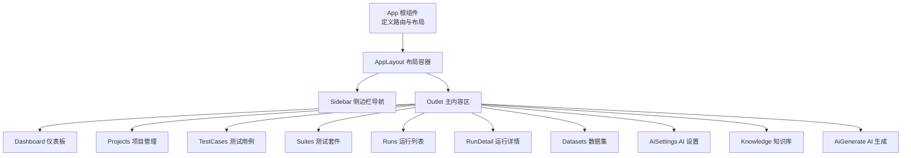

图表来源
- [packages/web/src/App.tsx:1-37](file://packages/web/src/App.tsx#L1-L37)
- [packages/web/src/components/layout/app-layout.tsx:1-16](file://packages/web/src/components/layout/app-layout.tsx#L1-L16)
- [packages/web/src/components/layout/sidebar.tsx:1-107](file://packages/web/src/components/layout/sidebar.tsx#L1-L107)

章节来源
- [packages/web/src/App.tsx:1-37](file://packages/web/src/App.tsx#L1-L37)
- [packages/web/src/main.tsx:1-12](file://packages/web/src/main.tsx#L1-L12)

## 核心组件
- 应用根组件与路由
  - 定义BrowserRouter、项目上下文Provider与所有页面路由，统一挂载AppLayout作为页面容器。
- 布局组件
  - AppLayout：提供侧边栏与主内容区容器，Outlet承载当前页面。
  - Sidebar：根据当前项目状态动态启用/禁用导航项，支持折叠与语言切换。
- 项目上下文
  - ProjectProvider：在本地存储中持久化当前项目，并提供读写接口，用于页面间共享项目上下文。
- API模块
  - 统一封装HTTP请求、响应解析与错误抛出，导出项目、用例、套件、运行、数据集、AI配置与知识库等资源的CRUD与查询方法。

章节来源
- [packages/web/src/App.tsx:1-37](file://packages/web/src/App.tsx#L1-L37)
- [packages/web/src/components/layout/app-layout.tsx:1-16](file://packages/web/src/components/layout/app-layout.tsx#L1-L16)
- [packages/web/src/components/layout/sidebar.tsx:1-107](file://packages/web/src/components/layout/sidebar.tsx#L1-L107)
- [packages/web/src/lib/project-context.tsx:1-33](file://packages/web/src/lib/project-context.tsx#L1-L33)
- [packages/web/src/lib/api.ts:1-325](file://packages/web/src/lib/api.ts#L1-L325)

## 架构总览
- 路由与导航
  - 根路由下以AppLayout为父级容器，子路由直接渲染对应页面组件。
  - Sidebar基于当前项目存在性决定导航项可用性，未选中项目时禁用部分页面入口。
- 数据流
  - 页面通过API模块发起请求，使用useEffect在挂载时拉取数据；编辑/新增/删除后触发重新加载或局部更新。
  - 项目上下文在多个页面之间共享，影响页面可见性与数据范围。
- 错误处理
  - API封装统一抛错，页面内通过try/catch或Promise.catch捕获并提示；部分页面使用确认对话框进行危险操作的二次确认。

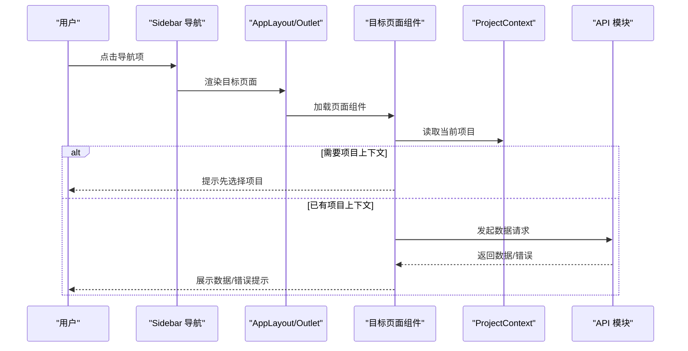

图表来源
- [packages/web/src/components/layout/sidebar.tsx:1-107](file://packages/web/src/components/layout/sidebar.tsx#L1-L107)
- [packages/web/src/components/layout/app-layout.tsx:1-16](file://packages/web/src/components/layout/app-layout.tsx#L1-L16)
- [packages/web/src/lib/project-context.tsx:1-33](file://packages/web/src/lib/project-context.tsx#L1-L33)
- [packages/web/src/lib/api.ts:1-325](file://packages/web/src/lib/api.ts#L1-L325)

## 详细组件分析

### 仪表板页面（Dashboard）
- 功能职责
  - 展示项目数量、最近运行统计（通过/失败）、快速进入项目管理、最近运行列表跳转。
- 数据需求
  - 列表：项目列表、最近测试运行（分页参数pageSize=10）。
  - 计算：通过/失败计数，用于统计卡片与趋势展示。
- 用户交互
  - 无项目时引导前往项目管理；点击最近运行项跳转到运行详情。
- 生命周期与状态
  - 首次挂载并行请求两个列表，完成后关闭加载态。
- 错误处理
  - 请求失败时回退为空数组并继续渲染，避免阻塞。
- 性能与SEO
  - 首屏渲染轻量，可结合懒加载策略延迟非关键区域渲染。

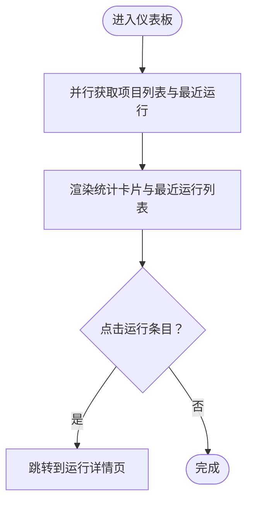

图表来源
- [packages/web/src/pages/dashboard.tsx:1-168](file://packages/web/src/pages/dashboard.tsx#L1-L168)

章节来源
- [packages/web/src/pages/dashboard.tsx:1-168](file://packages/web/src/pages/dashboard.tsx#L1-L168)

### 项目管理页面（Projects）
- 功能职责
  - 项目列表展示、创建/编辑/删除、设置当前项目并跳转至用例页面。
- 数据需求
  - 列表：项目列表（含环境数量、更新时间）。
  - 表单：名称、描述、环境列表（由API类型定义）。
- 用户交互
  - 对话框创建/编辑；下拉菜单操作（编辑、删除）；点击卡片设置当前项目并跳转。
- 生命周期与状态
  - 首次挂载加载列表；提交后关闭对话框并刷新列表。
- 权限控制
  - 通过项目上下文控制页面可用性；删除当前项目时同步清除上下文。
- 错误处理
  - 删除前二次确认；异常时保持对话框打开以便重试。

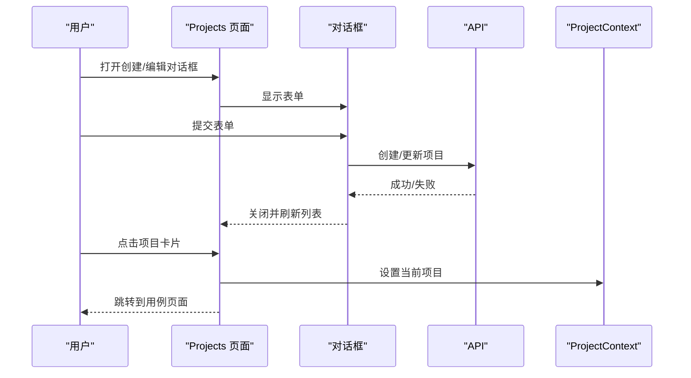

图表来源
- [packages/web/src/pages/projects.tsx:1-171](file://packages/web/src/pages/projects.tsx#L1-L171)
- [packages/web/src/lib/api.ts:138-147](file://packages/web/src/lib/api.ts#L138-L147)
- [packages/web/src/lib/project-context.tsx:1-33](file://packages/web/src/lib/project-context.tsx#L1-L33)

章节来源
- [packages/web/src/pages/projects.tsx:1-171](file://packages/web/src/pages/projects.tsx#L1-L171)
- [packages/web/src/lib/api.ts:138-147](file://packages/web/src/lib/api.ts#L138-L147)
- [packages/web/src/lib/project-context.tsx:1-33](file://packages/web/src/lib/project-context.tsx#L1-L33)

### 测试用例页面（TestCases）
- 功能职责
  - 用例列表展示、搜索过滤、创建/编辑/复制/删除、步骤编辑（表单与流水线视图）。
- 数据需求
  - 列表：分页查询（pageSize=200），支持关键词搜索。
  - 表单：名称、描述、模块、优先级、标签、步骤数组（有序）。
- 用户交互
  - 表格操作菜单；搜索输入；步骤编辑器支持增删移动与两种视图切换。
- 生命周期与状态
  - 首次挂载加载列表；搜索变更触发重新加载；保存后刷新。
- 性能优化
  - 列表分页与搜索参数化，避免一次性加载过多数据。

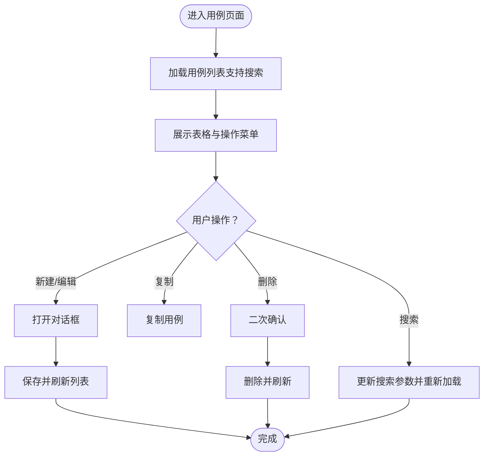

图表来源
- [packages/web/src/pages/test-cases.tsx:1-354](file://packages/web/src/pages/test-cases.tsx#L1-L354)
- [packages/web/src/lib/api.ts:149-165](file://packages/web/src/lib/api.ts#L149-L165)

章节来源
- [packages/web/src/pages/test-cases.tsx:1-354](file://packages/web/src/pages/test-cases.tsx#L1-L354)
- [packages/web/src/lib/api.ts:149-165](file://packages/web/src/lib/api.ts#L149-L165)

### 测试套件页面（Suites）
- 功能职责
  - 套件列表展示、创建/编辑/删除、触发运行（选择环境）、套件内用例选择。
- 数据需求
  - 列表：套件列表（含环境、并行度、用例数量）。
  - 表单：名称、描述、环境、用例集合（多选）。
  - 触发：传入套件ID与环境，返回运行ID并跳转详情。
- 用户交互
  - 表格操作菜单；对话框创建/编辑；运行触发对话框。
- 生命周期与状态
  - 首次挂载并行加载套件与用例；保存后刷新；触发成功后跳转详情。
- 权限控制
  - 未选中项目时提示先选择项目。

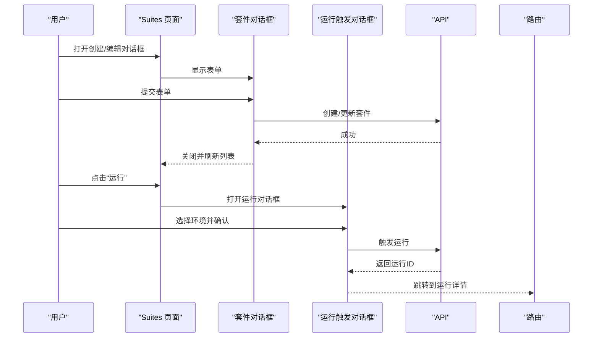

图表来源
- [packages/web/src/pages/suites.tsx:1-323](file://packages/web/src/pages/suites.tsx#L1-L323)
- [packages/web/src/lib/api.ts:167-176](file://packages/web/src/lib/api.ts#L167-L176)
- [packages/web/src/lib/api.ts:178-189](file://packages/web/src/lib/api.ts#L178-L189)

章节来源
- [packages/web/src/pages/suites.tsx:1-323](file://packages/web/src/pages/suites.tsx#L1-L323)
- [packages/web/src/lib/api.ts:167-176](file://packages/web/src/lib/api.ts#L167-L176)
- [packages/web/src/lib/api.ts:178-189](file://packages/web/src/lib/api.ts#L178-L189)

### 测试运行列表页面（Runs）
- 功能职责
  - 运行列表展示（状态、环境、用例数、通过率、耗时、触发方式、时间）。
- 数据需求
  - 列表：分页查询（pageSize=100）。
  - 状态图标与变体映射，计算通过率。
- 用户交互
  - 点击行跳转到运行详情。
- 生命周期与状态
  - 首次挂载加载列表，完成后关闭加载态。

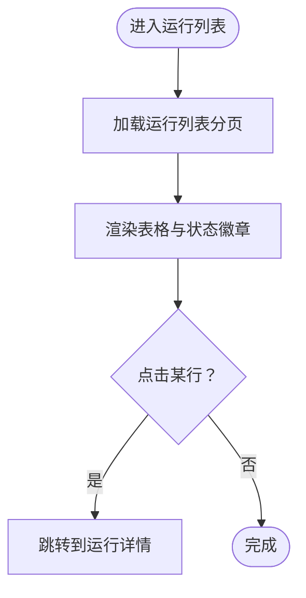

图表来源
- [packages/web/src/pages/runs.tsx:1-119](file://packages/web/src/pages/runs.tsx#L1-L119)
- [packages/web/src/lib/api.ts:178-185](file://packages/web/src/lib/api.ts#L178-L185)

章节来源
- [packages/web/src/pages/runs.tsx:1-119](file://packages/web/src/pages/runs.tsx#L1-L119)
- [packages/web/src/lib/api.ts:178-185](file://packages/web/src/lib/api.ts#L178-L185)

### 运行详情页面（RunDetail）
- 功能职责
  - 运行概览（总用例、通过/失败、通过率）、元信息（环境、触发方式、耗时、开始时间）、用例结果与步骤详情（可展开）。
- 数据需求
  - 单个运行详情（含用例结果与步骤结果）。
- 用户交互
  - 用例卡片与步骤卡片可展开/收起；步骤详情包含概览、请求、响应、断言、错误等Tab。
- 生命周期与状态
  - 参数变化时重新加载；加载中显示占位；未找到时提示。
- 错误处理
  - 参数缺失或请求失败时分别提示。

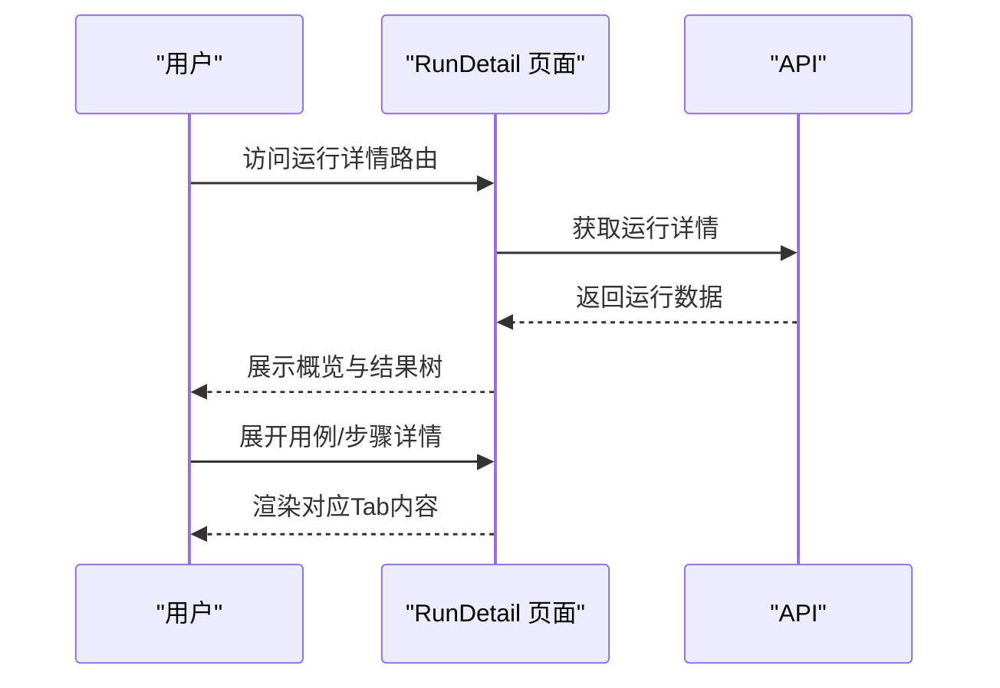

图表来源
- [packages/web/src/pages/run-detail.tsx:1-227](file://packages/web/src/pages/run-detail.tsx#L1-L227)
- [packages/web/src/lib/api.ts:178-189](file://packages/web/src/lib/api.ts#L178-L189)

章节来源
- [packages/web/src/pages/run-detail.tsx:1-227](file://packages/web/src/pages/run-detail.tsx#L1-L227)
- [packages/web/src/lib/api.ts:178-189](file://packages/web/src/lib/api.ts#L178-L189)

### 数据集页面（Datasets）
- 功能职责
  - 数据集列表展示、创建/编辑/删除；数据以JSON结构维护字段与行。
- 数据需求
  - 列表：数据集列表（字段数、行数、更新时间）。
  - 表单：名称、描述、JSON结构（fields/rows）。
- 用户交互
  - 表格操作菜单；对话框创建/编辑；JSON格式校验。
- 生命周期与状态
  - 首次挂载加载列表；保存后刷新；JSON解析失败给出错误提示。

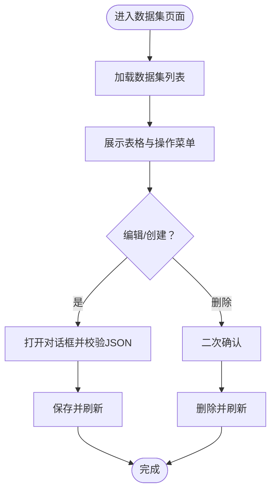

图表来源
- [packages/web/src/pages/datasets.tsx:1-212](file://packages/web/src/pages/datasets.tsx#L1-L212)
- [packages/web/src/lib/api.ts:191-200](file://packages/web/src/lib/api.ts#L191-L200)

章节来源
- [packages/web/src/pages/datasets.tsx:1-212](file://packages/web/src/pages/datasets.tsx#L1-L212)
- [packages/web/src/lib/api.ts:191-200](file://packages/web/src/lib/api.ts#L191-L200)

### AI设置页面（AiSettings）
- 功能职责
  - 配置AI提供商、模型、API Key、基础URL、温度与最大Token；连接测试与删除配置。
- 数据需求
  - 当前项目AI配置的读取、保存、测试与删除。
- 用户交互
  - 下拉选择提供商与模型；输入API Key与可选基础URL；测试连接；删除配置清空表单。
- 生命周期与状态
  - 首次挂载读取现有配置；保存后清空敏感字段；测试成功/失败反馈消息。

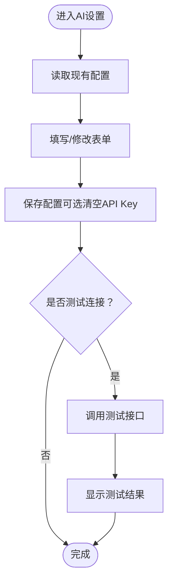

图表来源
- [packages/web/src/pages/ai-settings.tsx:1-241](file://packages/web/src/pages/ai-settings.tsx#L1-L241)
- [packages/web/src/lib/api.ts:217-224](file://packages/web/src/lib/api.ts#L217-L224)

章节来源
- [packages/web/src/pages/ai-settings.tsx:1-241](file://packages/web/src/pages/ai-settings.tsx#L1-L241)
- [packages/web/src/lib/api.ts:217-224](file://packages/web/src/lib/api.ts#L217-L224)

### 知识库页面（Knowledge）
- 功能职责
  - API端点列表展示、手动创建/编辑、导入OpenAPI、解析cURL、解析文本（AI）。
- 数据需求
  - 端点列表（方法、路径、摘要、认证、来源）；导入/解析返回端点预览。
- 用户交互
  - 表格操作菜单；多种导入/解析对话框；解析文本支持多选后批量添加。
- 生命周期与状态
  - 首次挂载加载列表；导入/解析成功后刷新；解析文本支持预览与二次确认。

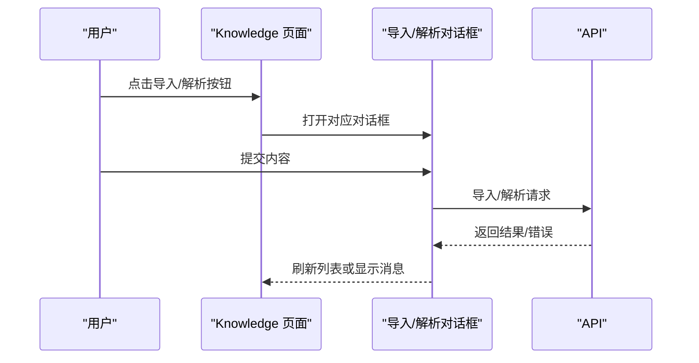

图表来源
- [packages/web/src/pages/knowledge.tsx:1-436](file://packages/web/src/pages/knowledge.tsx#L1-L436)
- [packages/web/src/lib/api.ts:252-275](file://packages/web/src/lib/api.ts#L252-L275)

章节来源
- [packages/web/src/pages/knowledge.tsx:1-436](file://packages/web/src/pages/knowledge.tsx#L1-L436)
- [packages/web/src/lib/api.ts:252-275](file://packages/web/src/lib/api.ts#L252-L275)

### AI生成页面（AiGenerate）
- 功能职责
  - 步骤式工作流：1）选择端点；2）选择策略与自定义提示；3）预览生成用例并确认。
- 数据需求
  - 端点列表；生成任务创建与确认；生成用例预览。
- 用户交互
  - 多步向导；端点全选/反选；策略卡片选择；生成预览卡片可展开查看步骤；确认后跳转用例页面。
- 生命周期与状态
  - 步骤状态机；生成与确认过程中的加载态；错误提示；成功后显示确认结果。

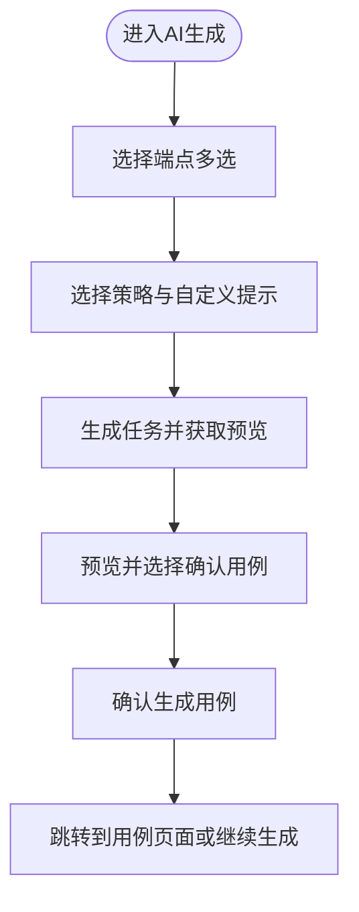

图表来源
- [packages/web/src/pages/ai-generate.tsx:1-369](file://packages/web/src/pages/ai-generate.tsx#L1-L369)
- [packages/web/src/lib/api.ts:313-324](file://packages/web/src/lib/api.ts#L313-L324)

章节来源
- [packages/web/src/pages/ai-generate.tsx:1-369](file://packages/web/src/pages/ai-generate.tsx#L1-L369)
- [packages/web/src/lib/api.ts:313-324](file://packages/web/src/lib/api.ts#L313-L324)

## 依赖分析
- 组件耦合
  - 页面组件对API模块与项目上下文存在直接依赖；Sidebar依赖项目上下文以控制导航可用性。
- 外部依赖
  - 路由：react-router-dom；UI：Radix UI组件与Tailwind样式；国际化：i18next；数据请求：@tanstack/react-query（在API模块中未直接使用，但可配合使用）。
- 循环依赖
  - 未发现文件级循环依赖；页面与布局、API模块之间为单向依赖。

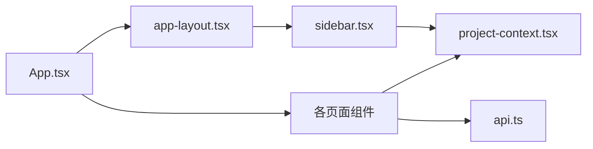

图表来源
- [packages/web/src/App.tsx:1-37](file://packages/web/src/App.tsx#L1-L37)
- [packages/web/src/components/layout/app-layout.tsx:1-16](file://packages/web/src/components/layout/app-layout.tsx#L1-L16)
- [packages/web/src/components/layout/sidebar.tsx:1-107](file://packages/web/src/components/layout/sidebar.tsx#L1-L107)
- [packages/web/src/lib/project-context.tsx:1-33](file://packages/web/src/lib/project-context.tsx#L1-L33)
- [packages/web/src/lib/api.ts:1-325](file://packages/web/src/lib/api.ts#L1-L325)

章节来源
- [packages/web/src/App.tsx:1-37](file://packages/web/src/App.tsx#L1-L37)
- [packages/web/src/lib/api.ts:1-325](file://packages/web/src/lib/api.ts#L1-L325)

## 性能考虑
- 首屏与列表加载
  - 使用分页参数（如pageSize=100/200/500）限制一次性数据量，降低首屏压力。
  - 并行请求减少等待时间（仪表板并行获取项目与运行列表）。
- 懒加载与虚拟化
  - 列表较长场景可引入虚拟滚动（例如用例/套件/运行列表）以提升滚动性能。
  - 非关键区域（如运行详情的展开面板）可按需渲染。
- 缓存与去抖
  - 搜索输入建议加入防抖，避免频繁请求。
  - 可结合React Query进行缓存与并发请求去重。
- 图标与样式
  - 使用矢量图标与CSS类名，避免大体积图片资源。
- SEO与路由
  - 路由为SPA模式，建议服务端配置历史模式回退与静态预渲染（SSG）策略，确保爬虫可索引关键页面（如仪表板、运行详情）。
  - 为关键页面提供简短稳定的路径与语义化标题，增强可发现性。

## 故障排查指南
- 通用错误处理
  - API封装统一抛错，页面内通过Promise.catch或try/catch捕获并提示；对话框类操作使用确认框防止误删。
- 项目上下文问题
  - 未选择项目导致页面不可用：检查ProjectProvider初始化与localStorage持久化；确保Sidebar导航项禁用逻辑生效。
- 数据不一致
  - 新建/编辑/删除后立即刷新列表，避免UI与后端状态不一致。
- 运行详情空白
  - 参数缺失或请求失败时分别提示；检查路由参数与API返回结构。
- AI生成失败
  - 生成任务失败时显示错误信息；确认端点选择、策略与自定义提示合法。

章节来源
- [packages/web/src/lib/api.ts:1-12](file://packages/web/src/lib/api.ts#L1-L12)
- [packages/web/src/pages/projects.tsx:49-54](file://packages/web/src/pages/projects.tsx#L49-L54)
- [packages/web/src/pages/run-detail.tsx:19-25](file://packages/web/src/pages/run-detail.tsx#L19-L25)
- [packages/web/src/pages/ai-generate.tsx:73-92](file://packages/web/src/pages/ai-generate.tsx#L73-L92)

## 结论
该页面组件体系以清晰的路由与布局分层、明确的项目上下文与API抽象为核心，实现了从仪表板概览到用例/套件/运行的完整测试工作流，并扩展了数据集、AI设置、知识库与AI生成等能力。通过分页、并行加载、确认对话与统一错误处理等策略，提升了用户体验与系统稳定性。建议后续引入虚拟化、缓存与SSG等技术进一步优化性能与SEO。

## 附录
- 页面与导航关系
  - 仪表板：首页概览，可跳转项目管理与运行详情。
  - 项目管理：创建/编辑项目，设置当前项目后跳转用例。
  - 用例：列表、搜索、编辑、复制、删除；支持流水线视图。
  - 套件：列表、编辑、删除；触发运行并跳转详情。
  - 运行：列表展示与详情跳转。
  - 运行详情：用例与步骤详情展开。
  - 数据集：列表、创建/编辑、删除。
  - AI设置：配置与测试连接。
  - 知识库：端点管理与导入/解析。
  - AI生成：三步工作流，生成并确认用例。
- 数据传递机制
  - 路由参数：运行详情通过ID参数获取；页面间通过路由跳转传递。
  - 上下文：项目上下文在多个页面共享，影响可用性与数据范围。
  - 对话框：创建/编辑通过受控表单与回调刷新列表。
- 权限控制
  - Sidebar根据是否存在当前项目禁用导航项；部分页面在无项目时提示先选择项目。
- 生命周期管理
  - 首次挂载加载数据；提交后刷新；参数变化重新加载。
- 状态持久化
  - 项目上下文持久化到localStorage，刷新后恢复。
- 错误处理策略
  - 统一错误抛出与提示；二次确认；失败回退为空数据继续渲染。
- 性能优化
  - 分页与并行加载；可选虚拟化与按需渲染；防抖与缓存。
- 懒加载与SEO
  - 建议引入虚拟化与SSG策略，提升长列表性能与搜索引擎可见性。