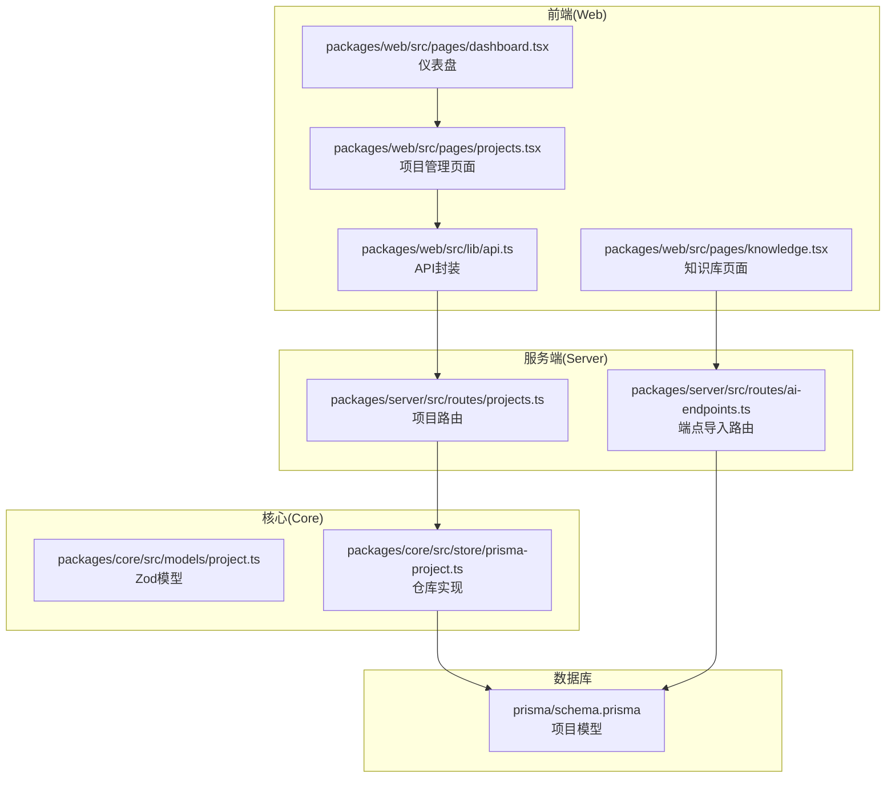
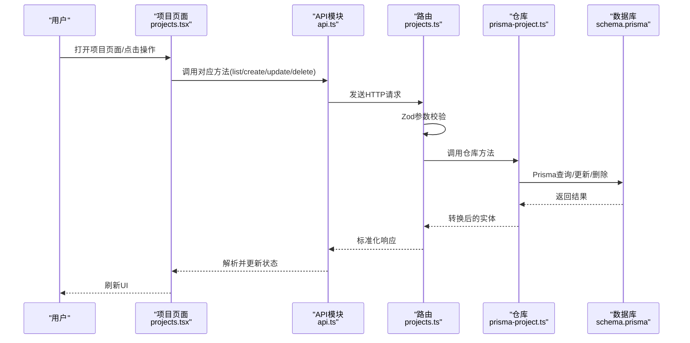
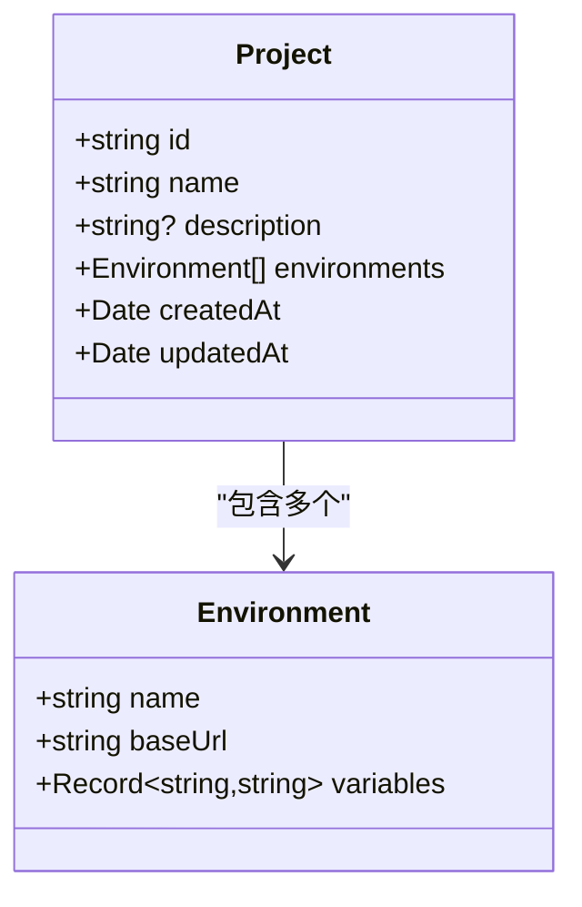
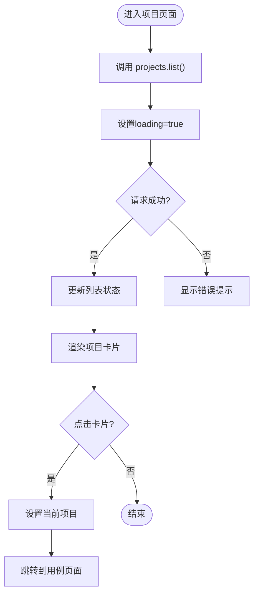
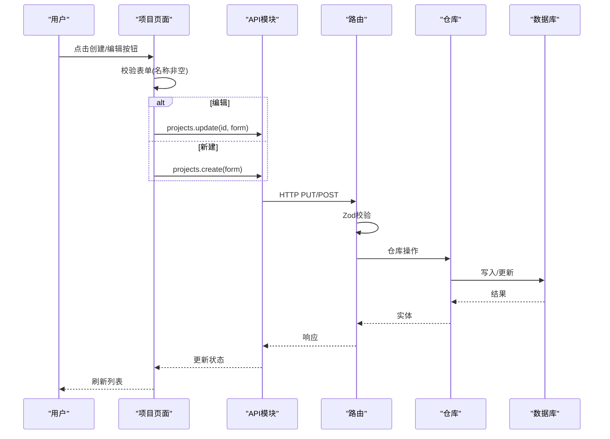
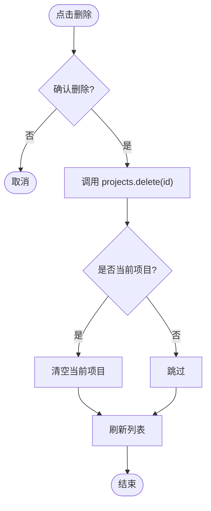
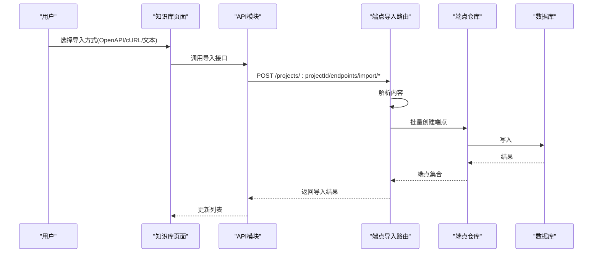
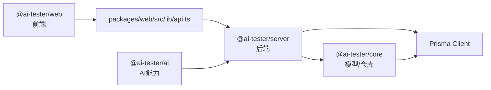

# 项目管理页面

<cite>
**本文档引用的文件**
- [packages/web/src/pages/projects.tsx](file://packages/web/src/pages/projects.tsx)
- [packages/web/src/lib/api.ts](file://packages/web/src/lib/api.ts)
- [packages/core/src/store/prisma-project.ts](file://packages/core/src/store/prisma-project.ts)
- [packages/core/src/models/project.ts](file://packages/core/src/models/project.ts)
- [packages/server/src/routes/projects.ts](file://packages/server/src/routes/projects.ts)
- [prisma/schema.prisma](file://prisma/schema.prisma)
- [packages/web/src/pages/dashboard.tsx](file://packages/web/src/pages/dashboard.tsx)
- [packages/web/src/pages/knowledge.tsx](file://packages/web/src/pages/knowledge.tsx)
- [packages/server/src/routes/ai-endpoints.ts](file://packages/server/src/routes/ai-endpoints.ts)
- [packages/ai/src/store/prisma-api-endpoint.ts](file://packages/ai/src/store/prisma-api-endpoint.ts)
- [packages/web/package.json](file://packages/web/package.json)
- [packages/server/package.json](file://packages/server/package.json)
</cite>

## 目录
1. [简介](#简介)
2. [项目结构](#项目结构)
3. [核心组件](#核心组件)
4. [架构总览](#架构总览)
5. [详细组件分析](#详细组件分析)
6. [依赖关系分析](#依赖关系分析)
7. [性能考虑](#性能考虑)
8. [故障排除指南](#故障排除指南)
9. [结论](#结论)
10. [附录](#附录)

## 简介
本技术文档围绕“项目管理页面”的完整CRUD操作进行深入解析，涵盖项目列表展示、创建、编辑与删除流程；项目数据模型与表单验证规则；用户输入处理与状态管理；权限控制与数据同步机制；搜索过滤、排序与批量操作的实现思路；以及项目导入导出、模板使用与最佳实践建议。文档以实际代码为依据，提供可视化图示与分层讲解，帮助开发者与产品人员快速理解与维护。

## 项目结构
项目采用前后端分离的多包工作区结构，前端通过React + Vite构建，后端基于Fastify + Prisma，核心数据模型在Prisma中定义，前端通过统一的API模块调用后端接口。

图表来源
- [packages/web/src/pages/projects.tsx:1-170](file://packages/web/src/pages/projects.tsx#L1-L170)
- [packages/web/src/lib/api.ts:138-147](file://packages/web/src/lib/api.ts#L138-L147)
- [packages/server/src/routes/projects.ts:1-40](file://packages/server/src/routes/projects.ts#L1-L40)
- [packages/core/src/store/prisma-project.ts:17-57](file://packages/core/src/store/prisma-project.ts#L17-L57)
- [prisma/schema.prisma:10-24](file://prisma/schema.prisma#L10-L24)

章节来源
- [packages/web/package.json:1-45](file://packages/web/package.json#L1-L45)
- [packages/server/package.json:1-36](file://packages/server/package.json#L1-L36)

## 核心组件
- 前端页面组件：负责UI渲染、用户交互、状态管理与调用API模块。
- API模块：封装HTTP请求、错误处理与响应解析，统一REST风格接口。
- 服务端路由：接收请求、参数校验（Zod）、调用仓库层并返回标准化响应。
- 仓库层：封装Prisma访问逻辑，完成数据持久化与转换。
- 数据模型：使用Zod定义项目实体及创建/更新的校验规则。
- 数据库模型：Prisma定义的Project模型及其关联实体。

章节来源
- [packages/web/src/pages/projects.tsx:19-170](file://packages/web/src/pages/projects.tsx#L19-L170)
- [packages/web/src/lib/api.ts:138-147](file://packages/web/src/lib/api.ts#L138-L147)
- [packages/server/src/routes/projects.ts:6-39](file://packages/server/src/routes/projects.ts#L6-L39)
- [packages/core/src/store/prisma-project.ts:17-57](file://packages/core/src/store/prisma-project.ts#L17-L57)
- [packages/core/src/models/project.ts:1-30](file://packages/core/src/models/project.ts#L1-L30)
- [prisma/schema.prisma:10-24](file://prisma/schema.prisma#L10-L24)

## 架构总览
项目管理页面的CRUD流程从UI触发，经由API模块发送HTTP请求到服务端路由，服务端使用Zod进行参数校验，再调用仓库层执行数据库操作，最终返回标准化JSON响应。

图表来源
- [packages/web/src/pages/projects.tsx:29-66](file://packages/web/src/pages/projects.tsx#L29-L66)
- [packages/web/src/lib/api.ts:138-147](file://packages/web/src/lib/api.ts#L138-L147)
- [packages/server/src/routes/projects.ts:6-39](file://packages/server/src/routes/projects.ts#L6-L39)
- [packages/core/src/store/prisma-project.ts:17-57](file://packages/core/src/store/prisma-project.ts#L17-L57)
- [prisma/schema.prisma:10-24](file://prisma/schema.prisma#L10-L24)

## 详细组件分析

### 1) 项目数据模型与表单验证
- 数据模型
  - Project：包含唯一标识、名称、描述、环境数组、创建/更新时间等字段。
  - Environment：包含环境名、基础URL、变量字典。
- 表单验证规则
  - 名称：必填且长度限制；描述：可选字符串。
  - 环境数组：默认为空数组，每个元素需满足环境Schema。
- 类型定义
  - 使用Zod定义ProjectSchema、CreateProjectSchema、UpdateProjectSchema，确保运行时类型安全。

图表来源
- [packages/core/src/models/project.ts:1-30](file://packages/core/src/models/project.ts#L1-L30)
- [prisma/schema.prisma:10-24](file://prisma/schema.prisma#L10-L24)

章节来源
- [packages/core/src/models/project.ts:1-30](file://packages/core/src/models/project.ts#L1-L30)
- [prisma/schema.prisma:10-24](file://prisma/schema.prisma#L10-L24)

### 2) 项目列表展示
- 前端加载：组件挂载时调用API模块的list方法，设置loading状态，成功后更新列表。
- 渲染：无数据时显示引导按钮；有数据时网格布局展示卡片，包含名称、描述、环境数量与更新时间。
- 选择项目：点击卡片可设置当前项目上下文并跳转至用例页面。

图表来源
- [packages/web/src/pages/projects.tsx:29-34](file://packages/web/src/pages/projects.tsx#L29-L34)
- [packages/web/src/pages/projects.tsx:116-167](file://packages/web/src/pages/projects.tsx#L116-L167)
- [packages/web/src/pages/dashboard.tsx:89-100](file://packages/web/src/pages/dashboard.tsx#L89-L100)

章节来源
- [packages/web/src/pages/projects.tsx:19-170](file://packages/web/src/pages/projects.tsx#L19-L170)
- [packages/web/src/pages/dashboard.tsx:74-100](file://packages/web/src/pages/dashboard.tsx#L74-L100)

### 3) 项目创建与编辑
- 表单处理：表单包含名称与描述两个字段，编辑模式下预填充当前值。
- 提交逻辑：名称非空才允许提交；编辑模式调用更新接口，新建模式调用创建接口。
- 成功后：关闭对话框、清空表单、刷新列表；若当前项目被删除则清除上下文。

图表来源
- [packages/web/src/pages/projects.tsx:36-47](file://packages/web/src/pages/projects.tsx#L36-L47)
- [packages/web/src/lib/api.ts:138-147](file://packages/web/src/lib/api.ts#L138-L147)
- [packages/server/src/routes/projects.ts:7-32](file://packages/server/src/routes/projects.ts#L7-L32)
- [packages/core/src/store/prisma-project.ts:17-52](file://packages/core/src/store/prisma-project.ts#L17-L52)

章节来源
- [packages/web/src/pages/projects.tsx:36-66](file://packages/web/src/pages/projects.tsx#L36-L66)
- [packages/web/src/lib/api.ts:138-147](file://packages/web/src/lib/api.ts#L138-L147)
- [packages/server/src/routes/projects.ts:6-39](file://packages/server/src/routes/projects.ts#L6-L39)
- [packages/core/src/store/prisma-project.ts:17-57](file://packages/core/src/store/prisma-project.ts#L17-L57)

### 4) 项目删除
- 删除确认：弹窗确认后才执行删除。
- 删除流程：调用API删除，若当前项目被删除则清除上下文，最后刷新列表。

图表来源
- [packages/web/src/pages/projects.tsx:49-54](file://packages/web/src/pages/projects.tsx#L49-L54)
- [packages/web/src/lib/api.ts:138-147](file://packages/web/src/lib/api.ts#L138-L147)

章节来源
- [packages/web/src/pages/projects.tsx:49-54](file://packages/web/src/pages/projects.tsx#L49-L54)
- [packages/web/src/lib/api.ts:138-147](file://packages/web/src/lib/api.ts#L138-L147)

### 5) 搜索过滤、排序与批量操作
- 搜索与过滤
  - 当前项目列表页未直接实现搜索/过滤UI与参数传递。
  - 测试用例列表支持通过查询参数传入过滤条件，可作为项目层面扩展的参考。
- 排序
  - 项目列表按创建时间倒序返回，仓库层已配置排序。
- 批量操作
  - 当前未实现批量勾选与批量删除功能，可在现有单条删除基础上扩展。

章节来源
- [packages/web/src/lib/api.ts:150-156](file://packages/web/src/lib/api.ts#L150-L156)
- [packages/core/src/store/prisma-project.ts:35-38](file://packages/core/src/store/prisma-project.ts#L35-L38)

### 6) 权限控制与数据同步
- 权限控制
  - 服务端路由对请求进行参数校验，未发现显式的鉴权中间件或RBAC逻辑。
- 数据同步
  - 前端通过API模块统一请求，服务端返回标准化响应，前端在成功回调后主动刷新列表，保证UI与后端一致。

章节来源
- [packages/server/src/routes/projects.ts:6-39](file://packages/server/src/routes/projects.ts#L6-L39)
- [packages/web/src/lib/api.ts:138-147](file://packages/web/src/lib/api.ts#L138-L147)
- [packages/web/src/pages/projects.tsx:31-32](file://packages/web/src/pages/projects.tsx#L31-L32)

### 7) 项目导入导出与模板使用
- 导入能力
  - 服务端提供OpenAPI与cURL导入端点，支持将外部内容解析为API端点并批量创建。
  - 前端知识库页面提供导入对话框与文本解析入口。
- 导出与模板
  - 项目层面未发现专门的“项目导出/模板”接口；可结合现有端点导入能力与项目内资源（如测试套件、数据集）设计导出方案。

图表来源
- [packages/web/src/pages/knowledge.tsx:37-64](file://packages/web/src/pages/knowledge.tsx#L37-L64)
- [packages/web/src/lib/api.ts:252-275](file://packages/web/src/lib/api.ts#L252-L275)
- [packages/server/src/routes/ai-endpoints.ts:75-120](file://packages/server/src/routes/ai-endpoints.ts#L75-L120)
- [packages/ai/src/store/prisma-api-endpoint.ts:29-71](file://packages/ai/src/store/prisma-api-endpoint.ts#L29-L71)

章节来源
- [packages/server/src/routes/ai-endpoints.ts:75-120](file://packages/server/src/routes/ai-endpoints.ts#L75-L120)
- [packages/web/src/lib/api.ts:252-275](file://packages/web/src/lib/api.ts#L252-L275)
- [packages/ai/src/store/prisma-api-endpoint.ts:29-71](file://packages/ai/src/store/prisma-api-endpoint.ts#L29-L71)

## 依赖关系分析
- 前端依赖
  - React生态、Radix UI组件库、TanStack React Query（用于状态管理与缓存，虽未在项目页面直接使用，但已在依赖中声明）。
- 后端依赖
  - Fastify框架、Swagger文档、Zod类型校验、Prisma客户端。
- 多包协作
  - Web包仅负责UI与API封装；Server包负责路由与业务；Core包提供模型与仓库抽象；AI包提供解析与生成能力。

图表来源
- [packages/web/package.json:13-32](file://packages/web/package.json#L13-L32)
- [packages/server/package.json:16-27](file://packages/server/package.json#L16-L27)
- [packages/web/src/lib/api.ts:1-12](file://packages/web/src/lib/api.ts#L1-L12)

章节来源
- [packages/web/package.json:1-45](file://packages/web/package.json#L1-L45)
- [packages/server/package.json:1-36](file://packages/server/package.json#L1-L36)

## 性能考虑
- 列表加载
  - 项目列表按创建时间倒序，避免全量扫描；建议在大数据量场景增加分页与索引优化。
- 请求与重试
  - 前端未内置重试策略，建议在API模块中引入重试与错误边界，提升稳定性。
- UI渲染
  - 卡片网格渲染较为轻量，建议在移动端使用虚拟滚动优化长列表性能。

## 故障排除指南
- 常见问题
  - 创建失败：检查名称是否为空、网络请求是否成功、服务端Zod校验是否通过。
  - 删除失败：确认是否有外键约束导致删除失败（如存在关联的用例/套件/数据集）。
  - 列表不刷新：确认前端在成功回调后调用了刷新逻辑。
- 错误处理
  - API模块统一捕获非2xx响应并抛出错误，前端应在调用处添加try/catch与用户提示。

章节来源
- [packages/web/src/lib/api.ts:3-12](file://packages/web/src/lib/api.ts#L3-L12)
- [packages/web/src/pages/projects.tsx:36-47](file://packages/web/src/pages/projects.tsx#L36-L47)

## 结论
项目管理页面实现了完整的CRUD闭环：从前端UI交互到API封装、服务端路由校验、仓库层持久化，最终回到前端状态更新。数据模型与验证规则清晰，具备良好的扩展性。后续可在搜索过滤、排序、批量操作、权限控制与项目导出模板等方面进一步完善，以满足更复杂的项目管理需求。

## 附录
- 最佳实践
  - 在前端统一错误处理与加载态管理，提升用户体验。
  - 对于大列表场景，优先采用分页与服务端过滤，减少前端渲染压力。
  - 引入鉴权中间件与最小权限原则，确保数据安全。
  - 为项目层面增加导出/导入能力，便于团队协作与迁移。