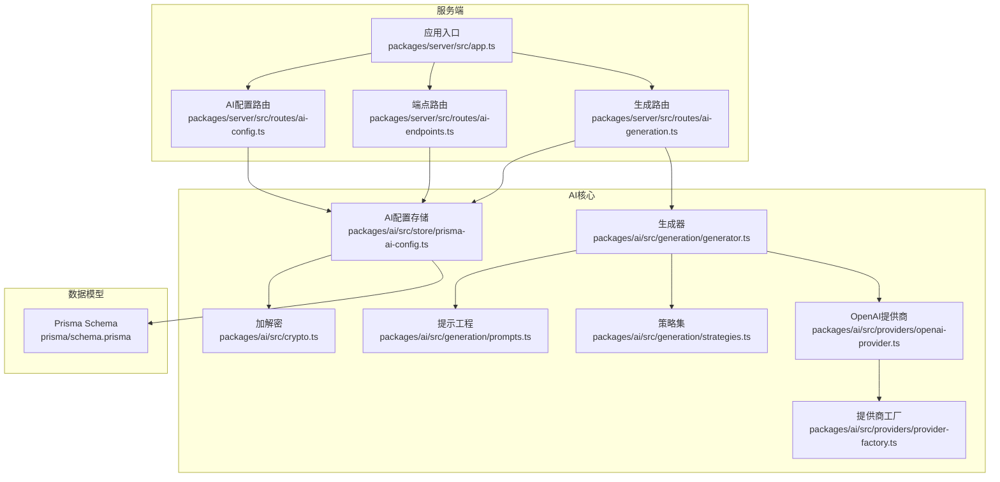
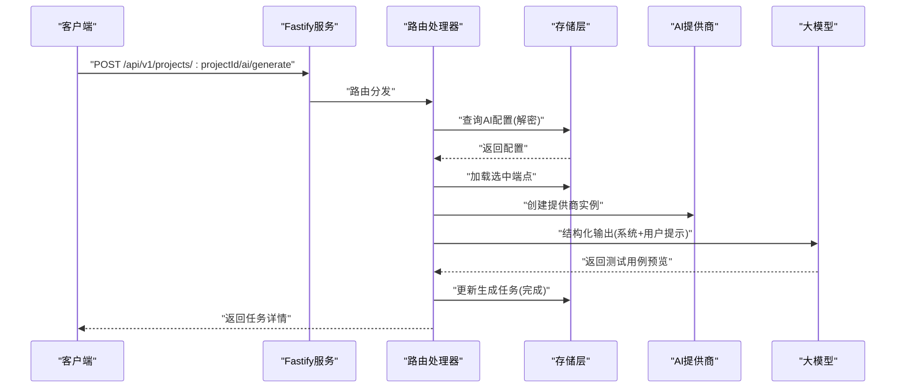
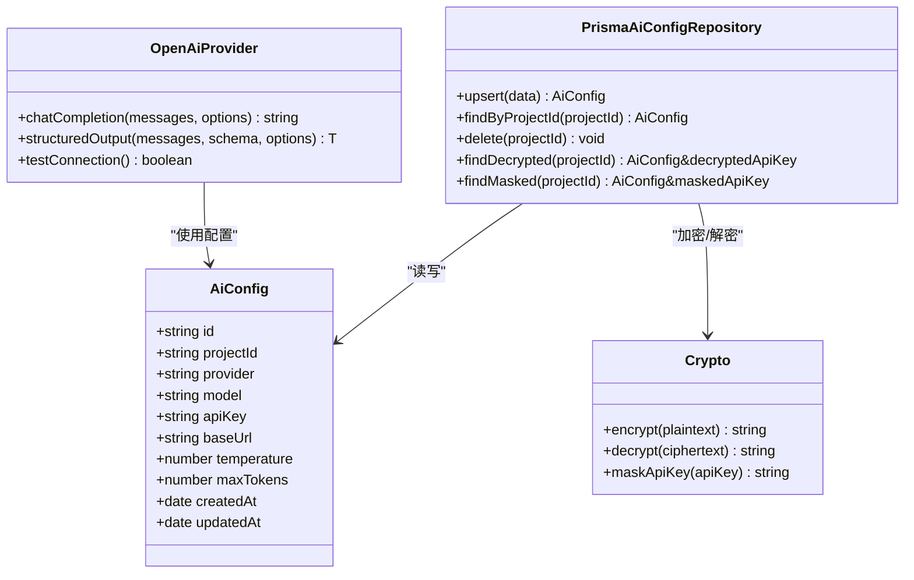
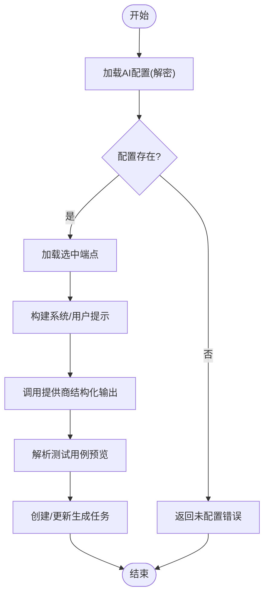
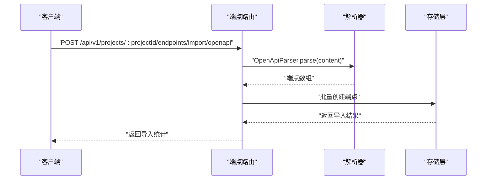
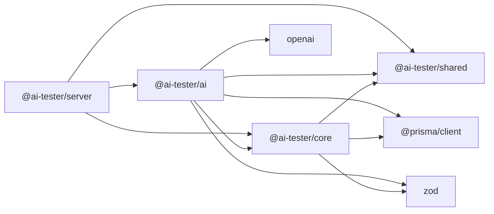

# AI相关API

<cite>
**本文档引用的文件**
- [packages/ai/src/index.ts](file://packages/ai/src/index.ts)
- [packages/ai/src/generation/generator.ts](file://packages/ai/src/generation/generator.ts)
- [packages/ai/src/generation/prompts.ts](file://packages/ai/src/generation/prompts.ts)
- [packages/ai/src/generation/strategies.ts](file://packages/ai/src/generation/strategies.ts)
- [packages/ai/src/providers/openai-provider.ts](file://packages/ai/src/providers/openai-provider.ts)
- [packages/ai/src/providers/provider-factory.ts](file://packages/ai/src/providers/provider-factory.ts)
- [packages/ai/src/providers/types.ts](file://packages/ai/src/providers/types.ts)
- [packages/ai/src/store/prisma-ai-config.ts](file://packages/ai/src/store/prisma-ai-config.ts)
- [packages/ai/src/crypto.ts](file://packages/ai/src/crypto.ts)
- [packages/ai/src/models/ai-config.ts](file://packages/ai/src/models/ai-config.ts)
- [packages/ai/src/models/api-endpoint.ts](file://packages/ai/src/models/api-endpoint.ts)
- [packages/ai/src/models/generation.ts](file://packages/ai/src/models/generation.ts)
- [packages/server/src/app.ts](file://packages/server/src/app.ts)
- [packages/server/src/routes/ai-config.ts](file://packages/server/src/routes/ai-config.ts)
- [packages/server/src/routes/ai-endpoints.ts](file://packages/server/src/routes/ai-endpoints.ts)
- [packages/server/src/routes/ai-generation.ts](file://packages/server/src/routes/ai-generation.ts)
- [prisma/schema.prisma](file://prisma/schema.prisma)
</cite>

## 目录
1. [简介](#简介)
2. [项目结构](#项目结构)
3. [核心组件](#核心组件)
4. [架构总览](#架构总览)
5. [详细组件分析](#详细组件分析)
6. [依赖关系分析](#依赖关系分析)
7. [性能考虑](#性能考虑)
8. [故障排查指南](#故障排查指南)
9. [结论](#结论)
10. [附录](#附录)

## 简介
本项目提供一套完整的AI驱动的测试用例生成与管理能力，围绕以下目标构建：
- AI配置管理：支持多种AI提供商（OpenAI等）、模型选择、温度与最大令牌数配置，并对API密钥进行加密存储与安全传输。
- 测试用例生成：基于API端点信息与策略（如“正常路径”、“错误场景”、“鉴权场景”等），通过结构化提示工程生成高质量测试用例预览。
- API端点分析：支持手动录入、OpenAPI导入、cURL解析以及文本描述解析，自动抽取HTTP方法、路径、参数、请求/响应模式与鉴权方式。
- 安全与访问控制：环境变量驱动的AES-256-GCM加密、密钥掩码返回、仅在内部使用时解密、严格的输入校验与错误处理。
- 质量评估与迭代：生成任务状态跟踪、耗时统计、失败回退、结果确认与持久化，支持人工审核与二次优化。

## 项目结构
项目采用多包工作区结构，核心模块分布如下：
- packages/ai：AI能力核心（生成器、提示工程、提供商抽象、存储适配、加解密）。
- packages/server：Fastify服务端，提供REST API路由与Swagger文档集成。
- packages/core：测试域模型与运行引擎（测试用例、套件、执行上下文等）。
- packages/shared：共享工具（ID生成、日志、错误定义）。
- prisma/schema.prisma：数据库模型定义（项目、端点、生成任务、测试用例等）。

**图表来源**
- [packages/server/src/app.ts:1-78](file://packages/server/src/app.ts#L1-L78)
- [packages/server/src/routes/ai-config.ts:1-82](file://packages/server/src/routes/ai-config.ts#L1-L82)
- [packages/server/src/routes/ai-endpoints.ts:1-183](file://packages/server/src/routes/ai-endpoints.ts#L1-L183)
- [packages/server/src/routes/ai-generation.ts:1-180](file://packages/server/src/routes/ai-generation.ts#L1-L180)
- [packages/ai/src/generation/generator.ts:1-57](file://packages/ai/src/generation/generator.ts#L1-L57)
- [packages/ai/src/providers/openai-provider.ts:1-79](file://packages/ai/src/providers/openai-provider.ts#L1-L79)
- [packages/ai/src/store/prisma-ai-config.ts:1-82](file://packages/ai/src/store/prisma-ai-config.ts#L1-L82)
- [packages/ai/src/crypto.ts:1-58](file://packages/ai/src/crypto.ts#L1-L58)
- [prisma/schema.prisma:1-196](file://prisma/schema.prisma#L1-L196)

**章节来源**
- [packages/server/src/app.ts:1-78](file://packages/server/src/app.ts#L1-L78)
- [prisma/schema.prisma:1-196](file://prisma/schema.prisma#L1-L196)

## 核心组件
- AI配置管理
  - 存储模型：AiConfig（项目唯一关联，包含提供商、模型、密钥、基础URL、温度、最大令牌数）。
  - 加密存储：API密钥以AES-256-GCM加密后入库；对外返回时掩码显示；仅在内部使用时解密。
  - 提供商抽象：统一的LlmProvider接口，当前实现为OpenAI提供商，支持结构化输出与连通性测试。
- 测试用例生成
  - 生成器：根据端点集合与策略构建系统提示与用户提示，调用LLM结构化输出，返回测试用例预览列表。
  - 策略集：内置多种生成策略（如正常路径、错误场景、鉴权场景、全面覆盖等）。
  - 结果确认：支持选择性确认生成的用例预览并持久化为正式测试用例。
- API端点分析
  - 手动录入：支持设置方法、路径、摘要、描述、标签、参数、请求/响应模式与鉴权类型。
  - 自动导入：OpenAPI文档解析、cURL命令解析，批量生成端点。
  - 文本解析：通过LLM从自然语言描述中抽取端点信息，返回预览（不持久化）。
- 数据模型与存储
  - Prisma模型：Project、ApiEndpoint、GenerationTask、TestCase等，支持JSON字段存储复杂结构。
  - 存储适配：PrismaAiConfigRepository负责Upsert、查询、删除、解密与掩码返回。

**章节来源**
- [packages/ai/src/models/ai-config.ts:1-34](file://packages/ai/src/models/ai-config.ts#L1-L34)
- [packages/ai/src/store/prisma-ai-config.ts:1-82](file://packages/ai/src/store/prisma-ai-config.ts#L1-L82)
- [packages/ai/src/providers/openai-provider.ts:1-79](file://packages/ai/src/providers/openai-provider.ts#L1-L79)
- [packages/ai/src/generation/generator.ts:1-57](file://packages/ai/src/generation/generator.ts#L1-L57)
- [packages/ai/src/generation/strategies.ts](file://packages/ai/src/generation/strategies.ts)
- [packages/ai/src/generation/prompts.ts](file://packages/ai/src/generation/prompts.ts)
- [packages/ai/src/models/api-endpoint.ts](file://packages/ai/src/models/api-endpoint.ts)
- [packages/ai/src/models/generation.ts](file://packages/ai/src/models/generation.ts)
- [prisma/schema.prisma:141-175](file://prisma/schema.prisma#L141-L175)

## 架构总览
下图展示从HTTP请求到AI生成与持久化的完整链路，包括安全与错误处理：

**图表来源**
- [packages/server/src/routes/ai-generation.ts:18-92](file://packages/server/src/routes/ai-generation.ts#L18-L92)
- [packages/ai/src/generation/generator.ts:27-55](file://packages/ai/src/generation/generator.ts#L27-L55)
- [packages/ai/src/providers/openai-provider.ts:45-63](file://packages/ai/src/providers/openai-provider.ts#L45-L63)
- [packages/ai/src/store/prisma-ai-config.ts:60-68](file://packages/ai/src/store/prisma-ai-config.ts#L60-L68)

## 详细组件分析

### AI配置管理
- 配置模型与校验
  - 支持提供商枚举（openai、anthropic、custom），必填模型名与密钥，可选基础URL、温度与最大令牌数。
  - 创建与更新使用Zod Schema进行严格校验。
- 加密存储与安全
  - 入库前对API密钥进行AES-256-GCM加密，格式包含IV、认证标签与密文。
  - 对外返回时掩码显示，仅在内部使用时解密。
  - 环境变量AI_TESTER_ENCRYPTION_KEY用于密钥材料，缺失时报错。
- 连接测试
  - OpenAI提供商提供轻量级连通性测试，用于快速验证配置有效性。

**图表来源**
- [packages/ai/src/models/ai-config.ts:5-26](file://packages/ai/src/models/ai-config.ts#L5-L26)
- [packages/ai/src/store/prisma-ai-config.ts:22-82](file://packages/ai/src/store/prisma-ai-config.ts#L22-L82)
- [packages/ai/src/crypto.ts:18-58](file://packages/ai/src/crypto.ts#L18-L58)
- [packages/ai/src/providers/openai-provider.ts:14-79](file://packages/ai/src/providers/openai-provider.ts#L14-L79)

**章节来源**
- [packages/ai/src/models/ai-config.ts:1-34](file://packages/ai/src/models/ai-config.ts#L1-L34)
- [packages/ai/src/store/prisma-ai-config.ts:1-82](file://packages/ai/src/store/prisma-ai-config.ts#L1-L82)
- [packages/ai/src/crypto.ts:1-58](file://packages/ai/src/crypto.ts#L1-L58)
- [packages/ai/src/providers/openai-provider.ts:1-79](file://packages/ai/src/providers/openai-provider.ts#L1-L79)

### 测试用例生成流程
- 输入
  - 项目ID、端点ID数组、生成策略、可选自定义提示。
- 处理
  - 读取AI配置并创建提供商实例。
  - 构建系统提示（策略附加与自定义提示）、端点上下文与用户提示。
  - 调用提供商的结构化输出能力，约束返回格式为测试用例预览数组。
- 输出
  - 返回生成任务记录（含预览、状态、耗时、错误信息）。
  - 支持后续“确认”操作，将选定预览持久化为正式测试用例。

**图表来源**
- [packages/server/src/routes/ai-generation.ts:18-92](file://packages/server/src/routes/ai-generation.ts#L18-L92)
- [packages/ai/src/generation/generator.ts:27-55](file://packages/ai/src/generation/generator.ts#L27-L55)
- [packages/ai/src/generation/prompts.ts](file://packages/ai/src/generation/prompts.ts)
- [packages/ai/src/generation/strategies.ts](file://packages/ai/src/generation/strategies.ts)

**章节来源**
- [packages/server/src/routes/ai-generation.ts:1-180](file://packages/server/src/routes/ai-generation.ts#L1-L180)
- [packages/ai/src/generation/generator.ts:1-57](file://packages/ai/src/generation/generator.ts#L1-L57)

### API端点分析与导入
- 手动录入
  - 设置HTTP方法、路径、摘要、描述、标签、参数、请求/响应模式与鉴权类型。
- OpenAPI导入
  - 解析OpenAPI文档，批量生成端点并入库。
- cURL解析
  - 将cURL命令转换为端点定义，批量导入。
- 文本解析
  - 使用LLM从自然语言描述中抽取端点信息，返回预览（不持久化）。

**图表来源**
- [packages/server/src/routes/ai-endpoints.ts:75-91](file://packages/server/src/routes/ai-endpoints.ts#L75-L91)
- [packages/server/src/routes/ai-endpoints.ts:93-109](file://packages/server/src/routes/ai-endpoints.ts#L93-L109)
- [packages/server/src/routes/ai-endpoints.ts:111-181](file://packages/server/src/routes/ai-endpoints.ts#L111-L181)

**章节来源**
- [packages/server/src/routes/ai-endpoints.ts:1-183](file://packages/server/src/routes/ai-endpoints.ts#L1-L183)

### 数据模型与存储
- 关键实体
  - Project：项目，包含环境、测试套件、数据集、AI配置、API端点、生成任务。
  - ApiEndpoint：API端点，包含方法、路径、参数、请求/响应模式、鉴权类型、来源。
  - GenerationTask：生成任务，记录策略、状态、生成预览、确认ID、耗时与错误。
  - TestCase：测试用例，包含步骤、变量、优先级、标签等。
- JSON字段设计
  - 多处使用JSON字符串存储数组或对象，便于灵活扩展与跨模型复用。

```mermaid
erDiagram
PROJECT ||--o{ API_ENDPOINT : "拥有"
PROJECT ||--o{ GENERATION_TASK : "拥有"
PROJECT ||--o{ TEST_CASE : "拥有"
GENERATION_TASK ||--o{ TEST_CASE : "确认生成"
```

**图表来源**
- [prisma/schema.prisma:10-44](file://prisma/schema.prisma#L10-L44)
- [prisma/schema.prisma:156-175](file://prisma/schema.prisma#L156-L175)
- [prisma/schema.prisma:177-195](file://prisma/schema.prisma#L177-L195)

**章节来源**
- [prisma/schema.prisma:1-196](file://prisma/schema.prisma#L1-L196)

## 依赖关系分析
- 包间依赖
  - server依赖ai、core、shared、plugin-api，提供路由与Swagger集成。
  - ai依赖core、shared、@prisma/client、openai、zod，封装生成器、提供商与存储。
  - core依赖shared、zod、@prisma/client，提供测试域模型与仓库。
  - shared提供ID生成、日志与通用错误。
- 组件耦合
  - 服务端路由通过容器注入的仓库访问数据层，避免直接依赖具体实现。
  - 生成器与提供商通过工厂/抽象接口解耦，便于扩展其他提供商。

**图表来源**
- [packages/server/package.json:16-27](file://packages/server/package.json#L16-L27)
- [packages/ai/package.json:21-26](file://packages/ai/package.json#L21-L26)
- [packages/core/package.json:21-25](file://packages/core/package.json#L21-L25)

**章节来源**
- [packages/server/package.json:1-36](file://packages/server/package.json#L1-L36)
- [packages/ai/package.json:1-34](file://packages/ai/package.json#L1-L34)
- [packages/core/package.json:1-34](file://packages/core/package.json#L1-L34)
- [packages/shared/package.json:1-28](file://packages/shared/package.json#L1-L28)

## 性能考虑
- LLM调用成本控制
  - 合理设置温度与最大令牌数，避免过长上下文导致延迟与费用上升。
  - 仅在必要时进行结构化输出解析，减少重复调用。
- 并发与批处理
  - 导入OpenAPI与cURL时采用批量创建，降低数据库往返次数。
  - 生成任务异步化，避免阻塞请求线程。
- 缓存与掩码
  - 对外部返回的密钥进行掩码，避免敏感信息泄露。
- 监控与可观测性
  - 记录生成任务耗时与状态，便于性能分析与容量规划。

## 故障排查指南
- 常见错误与定位
  - AI未配置：生成或端点文本解析前需先保存AI配置，否则返回未配置错误。
  - 参数校验失败：Zod校验会返回详细错误位置与原因，检查请求体字段类型与范围。
  - 连接测试失败：检查提供商配置、模型名、基础URL与网络连通性。
  - 解密失败：确认环境变量AI_TESTER_ENCRYPTION_KEY格式正确且长度符合要求。
- 排查步骤
  - 通过“测试连接”端点快速验证提供商可用性。
  - 检查生成任务状态与错误信息，定位具体失败环节。
  - 对比OpenAPI/cURL解析结果与预期，调整提示或解析逻辑。

**章节来源**
- [packages/server/src/routes/ai-config.ts:53-80](file://packages/server/src/routes/ai-config.ts#L53-L80)
- [packages/server/src/routes/ai-generation.ts:26-32](file://packages/server/src/routes/ai-generation.ts#L26-L32)
- [packages/ai/src/crypto.ts:7-16](file://packages/ai/src/crypto.ts#L7-L16)

## 结论
本项目通过模块化设计实现了从AI配置管理、端点分析到测试用例生成的完整闭环。借助Prisma的数据模型与Zod的严格校验，结合AES-256-GCM的安全存储与提供商抽象，既保证了易用性也兼顾了安全性与可扩展性。建议在生产环境中：
- 明确密钥轮换与审计策略，定期审查生成任务与用例质量。
- 引入更多提供商与策略，持续优化提示工程与评估指标。
- 增强对大规模端点与高并发场景的性能监控与资源治理。

## 附录

### API端点一览（按功能分组）
- AI配置管理
  - 获取配置：GET /api/v1/projects/:projectId/ai-config
  - 更新配置：PUT /api/v1/projects/:projectId/ai-config
  - 删除配置：DELETE /api/v1/projects/:projectId/ai-config
  - 测试连接：POST /api/v1/projects/:projectId/ai-config/test
- API端点管理
  - 手动创建端点：POST /api/v1/projects/:projectId/endpoints
  - 列出端点：GET /api/v1/projects/:projectId/endpoints
  - 获取端点：GET /api/v1/endpoints/:id
  - 更新端点：PUT /api/v1/endpoints/:id
  - 删除端点：DELETE /api/v1/endpoints/:id
  - 导入OpenAPI：POST /api/v1/projects/:projectId/endpoints/import/openapi
  - 导入cURL：POST /api/v1/projects/:projectId/endpoints/import/curl
  - 文本解析端点：POST /api/v1/projects/:projectId/endpoints/parse-text
- 生成任务与用例确认
  - 触发生成：POST /api/v1/projects/:projectId/ai/generate
  - 列出任务：GET /api/v1/projects/:projectId/ai/tasks
  - 获取任务：GET /api/v1/ai/tasks/:id
  - 确认用例：POST /api/v1/ai/tasks/:id/confirm

**章节来源**
- [packages/server/src/routes/ai-config.ts:11-82](file://packages/server/src/routes/ai-config.ts#L11-L82)
- [packages/server/src/routes/ai-endpoints.ts:12-183](file://packages/server/src/routes/ai-endpoints.ts#L12-L183)
- [packages/server/src/routes/ai-generation.ts:16-180](file://packages/server/src/routes/ai-generation.ts#L16-L180)