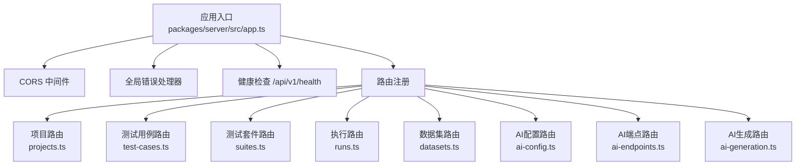
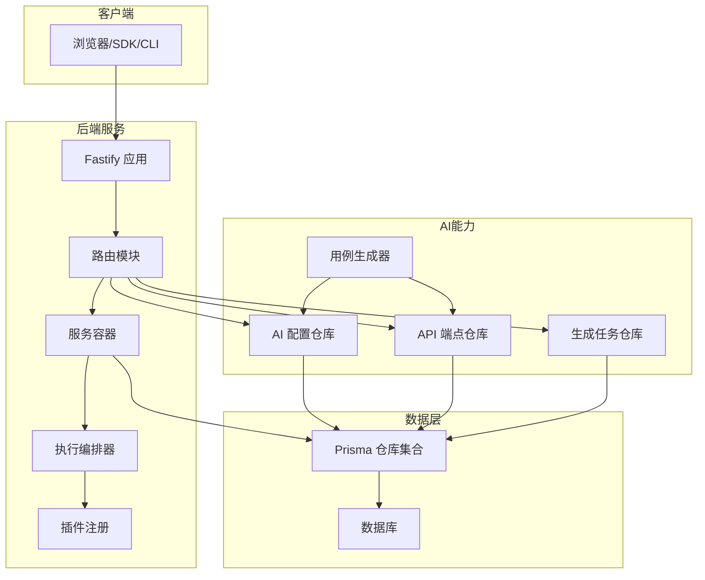
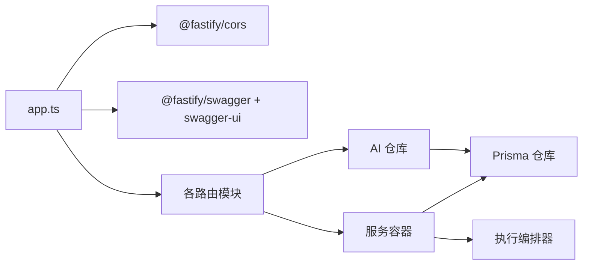

# 后端API服务

<cite>
**本文引用的文件**
- [packages/server/src/app.ts](file://packages/server/src/app.ts)
- [packages/server/src/routes/projects.ts](file://packages/server/src/routes/projects.ts)
- [packages/server/src/routes/test-cases.ts](file://packages/server/src/routes/test-cases.ts)
- [packages/server/src/routes/suites.ts](file://packages/server/src/routes/suites.ts)
- [packages/server/src/routes/runs.ts](file://packages/server/src/routes/runs.ts)
- [packages/server/src/routes/datasets.ts](file://packages/server/src/routes/datasets.ts)
- [packages/server/src/routes/ai-config.ts](file://packages/server/src/routes/ai-config.ts)
- [packages/server/src/routes/ai-endpoints.ts](file://packages/server/src/routes/ai-endpoints.ts)
- [packages/server/src/routes/ai-generation.ts](file://packages/server/src/routes/ai-generation.ts)
- [packages/server/src/services/container.ts](file://packages/server/src/services/container.ts)
- [packages/server/package.json](file://packages/server/package.json)
- [prisma/schema.prisma](file://prisma/schema.prisma)
</cite>

## 目录
1. [简介](#简介)
2. [项目结构](#项目结构)
3. [核心组件](#核心组件)
4. [架构总览](#架构总览)
5. [详细组件分析](#详细组件分析)
6. [依赖关系分析](#依赖关系分析)
7. [性能与可扩展性](#性能与可扩展性)
8. [故障排查指南](#故障排查指南)
9. [结论](#结论)
10. [附录：API清单与示例](#附录api清单与示例)

## 简介
本文件为后端API服务的完整技术文档，覆盖以下能力域：
- 项目管理API：创建、查询、更新、删除项目
- 测试用例管理API：创建、查询、更新、删除、复制测试用例
- 测试套件管理API：创建、查询、更新、删除测试套件
- 测试套件执行API：触发执行、分页查询执行记录、查看执行详情
- 数据集管理API：创建、查询、更新、删除数据集
- AI配置管理API：查询/创建/更新/删除AI配置；测试连接
- AI端点导入与解析API：手动创建、导入OpenAPI/cURL、文本解析
- AI生成测试用例API：触发生成、查询任务、确认并持久化用例
- WebSocket实时通信：用于执行过程中的事件推送（说明）
- 错误处理与状态码：统一错误响应结构与常见错误码
- 安全与认证：当前未内置鉴权中间件，建议在网关或反向代理层接入鉴权
- 版本管理与速率限制：API以v1版本路径提供，未内置速率限制，建议在网关层实施

## 项目结构
后端基于Fastify框架，采用模块化路由注册方式，核心入口负责：
- 初始化日志级别
- 注册CORS
- 全局错误处理器（Zod校验错误与通用错误）
- 健康检查端点
- 路由注册（项目/用例/套件/执行/数据集/AI配置/AI端点/AI生成）

图表来源
- [packages/server/src/app.ts:13-63](file://packages/server/src/app.ts#L13-L63)
- [packages/server/src/routes/projects.ts:6-39](file://packages/server/src/routes/projects.ts#L6-L39)
- [packages/server/src/routes/test-cases.ts:5-68](file://packages/server/src/routes/test-cases.ts#L5-L68)
- [packages/server/src/routes/suites.ts:5-48](file://packages/server/src/routes/suites.ts#L5-L48)
- [packages/server/src/routes/runs.ts:5-44](file://packages/server/src/routes/runs.ts#L5-L44)
- [packages/server/src/routes/datasets.ts:5-48](file://packages/server/src/routes/datasets.ts#L5-L48)
- [packages/server/src/routes/ai-config.ts:11-81](file://packages/server/src/routes/ai-config.ts#L11-L81)
- [packages/server/src/routes/ai-endpoints.ts:12-182](file://packages/server/src/routes/ai-endpoints.ts#L12-L182)
- [packages/server/src/routes/ai-generation.ts:16-179](file://packages/server/src/routes/ai-generation.ts#L16-L179)

章节来源
- [packages/server/src/app.ts:13-63](file://packages/server/src/app.ts#L13-L63)
- [packages/server/src/services/container.ts:17-41](file://packages/server/src/services/container.ts#L17-L41)

## 核心组件
- 应用入口与中间件
  - 日志级别通过环境变量控制
  - CORS允许跨域访问
  - 全局错误处理器区分Zod校验错误与通用错误，返回统一结构
  - 健康检查端点返回服务状态、时间戳与版本号
- 服务容器
  - 统一注入各仓库单例（Prisma实现）
  - 插件注册与插件API集成
  - 执行编排器（Orchestrator）负责执行流程调度
- 数据模型与仓库
  - 项目、测试用例、测试套件、测试执行、数据集
  - AI配置、API端点、生成任务
  - 通过Prisma仓库实现数据持久化

章节来源
- [packages/server/src/app.ts:14-50](file://packages/server/src/app.ts#L14-L50)
- [packages/server/src/services/container.ts:17-41](file://packages/server/src/services/container.ts#L17-L41)

## 架构总览
下图展示从客户端到路由、服务容器与仓库的调用链路，以及AI相关流程。

图表来源
- [packages/server/src/app.ts:13-63](file://packages/server/src/app.ts#L13-L63)
- [packages/server/src/services/container.ts:17-41](file://packages/server/src/services/container.ts#L17-L41)
- [packages/server/src/routes/ai-generation.ts:16-92](file://packages/server/src/routes/ai-generation.ts#L16-L92)
- [packages/server/src/routes/ai-endpoints.ts:12-182](file://packages/server/src/routes/ai-endpoints.ts#L12-L182)
- [packages/server/src/routes/ai-config.ts:11-81](file://packages/server/src/routes/ai-config.ts#L11-L81)

## 详细组件分析

### 项目管理API
- 创建项目
  - 方法与路径：POST /api/v1/projects
  - 请求体：符合创建项目Schema
  - 响应：201 Created，返回新建项目对象
- 查询项目列表
  - 方法与路径：GET /api/v1/projects
  - 响应：返回项目数组
- 获取项目详情
  - 方法与路径：GET /api/v1/projects/:id
  - 响应：返回项目对象；不存在时返回404
- 更新项目
  - 方法与路径：PUT /api/v1/projects/:id
  - 请求体：符合更新项目Schema
  - 响应：返回更新后的项目对象
- 删除项目
  - 方法与路径：DELETE /api/v1/projects/:id
  - 响应：204 No Content

章节来源
- [packages/server/src/routes/projects.ts:6-39](file://packages/server/src/routes/projects.ts#L6-L39)

### 测试用例管理API
- 创建测试用例
  - 方法与路径：POST /api/v1/projects/:projectId/test-cases
  - 请求体：包含项目ID与用例字段，符合创建Schema
  - 响应：201 Created，返回新建用例对象
- 分页查询用例
  - 方法与路径：GET /api/v1/projects/:projectId/test-cases
  - 查询参数：module、tags、priority、search、page、pageSize
  - 响应：返回用例列表与分页元信息
- 获取用例详情
  - 方法与路径：GET /api/v1/test-cases/:id
  - 响应：返回用例对象；不存在时返回404
- 更新用例
  - 方法与路径：PUT /api/v1/test-cases/:id
  - 请求体：符合更新Schema
  - 响应：返回更新后的用例对象
- 删除用例
  - 方法与路径：DELETE /api/v1/test-cases/:id
  - 响应：204 No Content
- 复制用例
  - 方法与路径：POST /api/v1/test-cases/:id/duplicate
  - 响应：201 Created，返回复制出的新用例对象

章节来源
- [packages/server/src/routes/test-cases.ts:5-68](file://packages/server/src/routes/test-cases.ts#L5-L68)

### 测试套件管理API
- 创建套件
  - 方法与路径：POST /api/v1/projects/:projectId/suites
  - 请求体：包含项目ID与套件字段，符合创建Schema
  - 响应：201 Created，返回新建套件对象
- 查询套件列表
  - 方法与路径：GET /api/v1/projects/:projectId/suites
  - 响应：返回套件数组
- 获取套件详情
  - 方法与路径：GET /api/v1/suites/:id
  - 响应：返回套件对象；不存在时返回404
- 更新套件
  - 方法与路径：PUT /api/v1/suites/:id
  - 请求体：符合更新Schema
  - 响应：返回更新后的套件对象
- 删除套件
  - 方法与路径：DELETE /api/v1/suites/:id
  - 响应：204 No Content

章节来源
- [packages/server/src/routes/suites.ts:5-48](file://packages/server/src/routes/suites.ts#L5-L48)

### 测试套件执行API
- 触发执行
  - 方法与路径：POST /api/v1/runs
  - 请求体：包含套件ID、环境、变量、触发者等，符合创建Schema
  - 响应：201 Created，立即返回执行记录（异步执行）
- 分页查询执行记录
  - 方法与路径：GET /api/v1/runs
  - 查询参数：suiteId、status、page、pageSize
  - 响应：返回执行记录列表与分页元信息
- 查看执行详情
  - 方法与路径：GET /api/v1/runs/:id
  - 响应：返回执行详情；不存在时返回404

章节来源
- [packages/server/src/routes/runs.ts:5-44](file://packages/server/src/routes/runs.ts#L5-L44)

### 数据集管理API
- 创建数据集
  - 方法与路径：POST /api/v1/projects/:projectId/datasets
  - 请求体：包含项目ID与数据集字段，符合创建Schema
  - 响应：201 Created，返回新建数据集对象
- 查询数据集列表
  - 方法与路径：GET /api/v1/projects/:projectId/datasets
  - 响应：返回数据集数组
- 获取数据集详情
  - 方法与路径：GET /api/v1/datasets/:id
  - 响应：返回数据集对象；不存在时返回404
- 更新数据集
  - 方法与路径：PUT /api/v1/datasets/:id
  - 请求体：符合更新Schema
  - 响应：返回更新后的数据集对象
- 删除数据集
  - 方法与路径：DELETE /api/v1/datasets/:id
  - 响应：204 No Content

章节来源
- [packages/server/src/routes/datasets.ts:5-48](file://packages/server/src/routes/datasets.ts#L5-L48)

### AI配置管理API
- 获取AI配置（密钥掩码）
  - 方法与路径：GET /api/v1/projects/:projectId/ai-config
  - 响应：返回配置对象（密钥已掩码）；无配置返回null
- 创建/更新AI配置（Upsert）
  - 方法与路径：PUT /api/v1/projects/:projectId/ai-config
  - 请求体：符合创建Schema
  - 响应：返回配置对象（密钥以星号显示与掩码展示）
- 删除AI配置
  - 方法与路径：DELETE /api/v1/projects/:projectId/ai-config
  - 响应：204 No Content
- 测试LLM连接
  - 方法与路径：POST /api/v1/projects/:projectId/ai-config/test
  - 响应：返回成功/失败与消息；未配置返回404

章节来源
- [packages/server/src/routes/ai-config.ts:11-81](file://packages/server/src/routes/ai-config.ts#L11-L81)

### AI端点导入与解析API
- 手动创建端点
  - 方法与路径：POST /api/v1/projects/:projectId/endpoints
  - 请求体：符合创建Schema（source=manual）
  - 响应：201 Created，返回新建端点对象
- 查询端点列表
  - 方法与路径：GET /api/v1/projects/:projectId/endpoints
  - 查询参数：method、search
  - 响应：返回端点数组
- 获取端点详情
  - 方法与路径：GET /api/v1/endpoints/:id
  - 响应：返回端点对象；不存在时返回404
- 更新端点
  - 方法与路径：PUT /api/v1/endpoints/:id
  - 请求体：符合更新Schema
  - 响应：返回更新后的端点对象
- 删除端点
  - 方法与路径：DELETE /api/v1/endpoints/:id
  - 响应：204 No Content
- 导入OpenAPI文档
  - 方法与路径：POST /api/v1/projects/:projectId/endpoints/import/openapi
  - 请求体：包含content字段
  - 响应：201 Created，返回导入的端点数组与导入数量
- 导入cURL命令
  - 方法与路径：POST /api/v1/projects/:projectId/endpoints/import/curl
  - 请求体：包含content字段
  - 响应：201 Created，返回导入的端点数组与导入数量
- 文本解析（预览，不持久化）
  - 方法与路径：POST /api/v1/projects/:projectId/endpoints/parse-text
  - 请求体：包含content字段
  - 响应：返回解析出的端点预览数组；未配置AI返回400

章节来源
- [packages/server/src/routes/ai-endpoints.ts:12-182](file://packages/server/src/routes/ai-endpoints.ts#L12-L182)

### AI生成测试用例API
- 触发生成
  - 方法与路径：POST /api/v1/projects/:projectId/ai/generate
  - 请求体：包含endpointIds、strategy、customPrompt等
  - 响应：返回生成任务对象；未配置AI返回400；无有效端点返回400；异常返回500
- 查询生成任务
  - 方法与路径：GET /api/v1/projects/:projectId/ai/tasks
  - 响应：返回任务数组
- 获取任务详情
  - 方法与路径：GET /api/v1/ai/tasks/:id
  - 响应：返回任务详情；不存在返回404
- 确认并持久化用例
  - 方法与路径：POST /api/v1/ai/tasks/:id/confirm
  - 请求体：包含selectedIndices数组
  - 响应：返回确认计数与新创建用例ID数组；任务非completed返回400

章节来源
- [packages/server/src/routes/ai-generation.ts:16-179](file://packages/server/src/routes/ai-generation.ts#L16-L179)

### WebSocket实时通信协议（说明）
- 当前路由中未发现WebSocket端点注册
- 若需实现实时事件推送，可在现有应用中引入WebSocket中间件并在执行编排器中推送事件
- 消息格式建议采用JSON，包含事件类型、数据负载与时间戳
- 事件类型可参考执行状态变更、生成进度、任务完成等

[本节为概念性说明，未直接分析具体源文件]

## 依赖关系分析
- 应用入口依赖Fastify、CORS与Zod错误处理
- 路由模块依赖服务容器中的仓库与编排器
- 服务容器依赖Prisma仓库与插件注册
- AI相关路由依赖AI配置仓库、API端点仓库与生成任务仓库
- 数据模型与仓库通过Prisma schema定义实体关系

图表来源
- [packages/server/src/app.ts:13-63](file://packages/server/src/app.ts#L13-L63)
- [packages/server/src/services/container.ts:17-41](file://packages/server/src/services/container.ts#L17-L41)
- [packages/server/package.json:16-27](file://packages/server/package.json#L16-L27)

章节来源
- [packages/server/src/app.ts:13-63](file://packages/server/src/app.ts#L13-L63)
- [packages/server/src/services/container.ts:17-41](file://packages/server/src/services/container.ts#L17-L41)
- [packages/server/package.json:16-27](file://packages/server/package.json#L16-L27)

## 性能与可扩展性
- 异步执行：执行API立即返回，实际执行在后台进行，有利于降低请求延迟
- 分页查询：用例、套件、执行记录均支持分页，避免一次性返回大量数据
- 并行解析：生成任务阶段对多个端点并行处理，缩短生成耗时
- 可扩展点：可通过插件注册机制扩展执行引擎与适配器

[本节提供一般性指导，未直接分析具体源文件]

## 故障排查指南
- 统一错误响应
  - Zod校验失败：返回400，包含错误码与细节
  - 服务器内部错误：返回500，包含错误码与消息
- 常见错误场景
  - 资源不存在：返回404与错误码
  - AI未配置：AI相关接口返回400与特定错误码
  - 任务状态不符：确认用例接口要求任务必须为completed
- 排查步骤
  - 检查请求体是否满足对应Schema
  - 确认AI配置已保存且连接正常
  - 核对资源ID是否存在
  - 查看服务日志（日志级别可通过环境变量调整）

章节来源
- [packages/server/src/app.ts:24-43](file://packages/server/src/app.ts#L24-L43)
- [packages/server/src/routes/ai-generation.ts:118-178](file://packages/server/src/routes/ai-generation.ts#L118-L178)
- [packages/server/src/routes/ai-config.ts:54-80](file://packages/server/src/routes/ai-config.ts#L54-L80)

## 结论
该API服务以Fastify为核心，围绕项目、用例、套件、执行、数据集与AI能力构建了完整的REST API体系。通过服务容器与Prisma仓库实现清晰的分层与可扩展性。建议在生产环境中补充鉴权与速率限制，并结合插件机制扩展更多执行与适配能力。

[本节为总结性内容，未直接分析具体源文件]

## 附录：API清单与示例

### API版本管理
- 所有REST端点均位于 /api/v1 路径下，当前版本为 0.1.0

章节来源
- [packages/server/src/app.ts:46-50](file://packages/server/src/app.ts#L46-L50)

### 认证与安全
- 当前未内置认证中间件
- 建议在网关或反向代理层接入认证（如Bearer Token、API Key）
- 对敏感字段（如密钥）仅在必要时返回掩码形式

[本节为通用建议，未直接分析具体源文件]

### 速率限制
- 未内置速率限制
- 建议在网关层按IP/用户维度实施限流策略

[本节为通用建议，未直接分析具体源文件]

### 客户端实现指南与SDK使用
- SDK建议封装
  - 统一封装HTTP客户端与错误处理
  - 提供分页工具函数与重试策略
  - 将AI配置与端点导入封装为便捷方法
- 最佳实践
  - 使用分页遍历列表类接口
  - 在执行类接口中轮询状态或订阅事件（若启用WebSocket）
  - 对AI相关接口增加超时与重试

[本节为通用建议，未直接分析具体源文件]

### 健康检查
- GET /api/v1/health
- 返回字段：status、timestamp、version

章节来源
- [packages/server/src/app.ts:46-50](file://packages/server/src/app.ts#L46-L50)

### 项目管理
- POST /api/v1/projects
- GET /api/v1/projects
- GET /api/v1/projects/:id
- PUT /api/v1/projects/:id
- DELETE /api/v1/projects/:id

章节来源
- [packages/server/src/routes/projects.ts:6-39](file://packages/server/src/routes/projects.ts#L6-L39)

### 测试用例管理
- POST /api/v1/projects/:projectId/test-cases
- GET /api/v1/projects/:projectId/test-cases
- GET /api/v1/test-cases/:id
- PUT /api/v1/test-cases/:id
- DELETE /api/v1/test-cases/:id
- POST /api/v1/test-cases/:id/duplicate

章节来源
- [packages/server/src/routes/test-cases.ts:5-68](file://packages/server/src/routes/test-cases.ts#L5-L68)

### 测试套件管理
- POST /api/v1/projects/:projectId/suites
- GET /api/v1/projects/:projectId/suites
- GET /api/v1/suites/:id
- PUT /api/v1/suites/:id
- DELETE /api/v1/suites/:id

章节来源
- [packages/server/src/routes/suites.ts:5-48](file://packages/server/src/routes/suites.ts#L5-L48)

### 测试套件执行
- POST /api/v1/runs
- GET /api/v1/runs
- GET /api/v1/runs/:id

章节来源
- [packages/server/src/routes/runs.ts:5-44](file://packages/server/src/routes/runs.ts#L5-L44)

### 数据集管理
- POST /api/v1/projects/:projectId/datasets
- GET /api/v1/projects/:projectId/datasets
- GET /api/v1/datasets/:id
- PUT /api/v1/datasets/:id
- DELETE /api/v1/datasets/:id

章节来源
- [packages/server/src/routes/datasets.ts:5-48](file://packages/server/src/routes/datasets.ts#L5-L48)

### AI配置管理
- GET /api/v1/projects/:projectId/ai-config
- PUT /api/v1/projects/:projectId/ai-config
- DELETE /api/v1/projects/:projectId/ai-config
- POST /api/v1/projects/:projectId/ai-config/test

章节来源
- [packages/server/src/routes/ai-config.ts:11-81](file://packages/server/src/routes/ai-config.ts#L11-L81)

### AI端点导入与解析
- POST /api/v1/projects/:projectId/endpoints
- GET /api/v1/projects/:projectId/endpoints
- GET /api/v1/endpoints/:id
- PUT /api/v1/endpoints/:id
- DELETE /api/v1/endpoints/:id
- POST /api/v1/projects/:projectId/endpoints/import/openapi
- POST /api/v1/projects/:projectId/endpoints/import/curl
- POST /api/v1/projects/:projectId/endpoints/parse-text

章节来源
- [packages/server/src/routes/ai-endpoints.ts:12-182](file://packages/server/src/routes/ai-endpoints.ts#L12-L182)

### AI生成测试用例
- POST /api/v1/projects/:projectId/ai/generate
- GET /api/v1/projects/:projectId/ai/tasks
- GET /api/v1/ai/tasks/:id
- POST /api/v1/ai/tasks/:id/confirm

章节来源
- [packages/server/src/routes/ai-generation.ts:16-179](file://packages/server/src/routes/ai-generation.ts#L16-L179)

### 数据模型与实体关系（概览）
- 项目、测试用例、测试套件、测试执行、数据集
- AI配置、API端点、生成任务
- 实体关系由Prisma schema定义

章节来源
- [prisma/schema.prisma](file://prisma/schema.prisma)