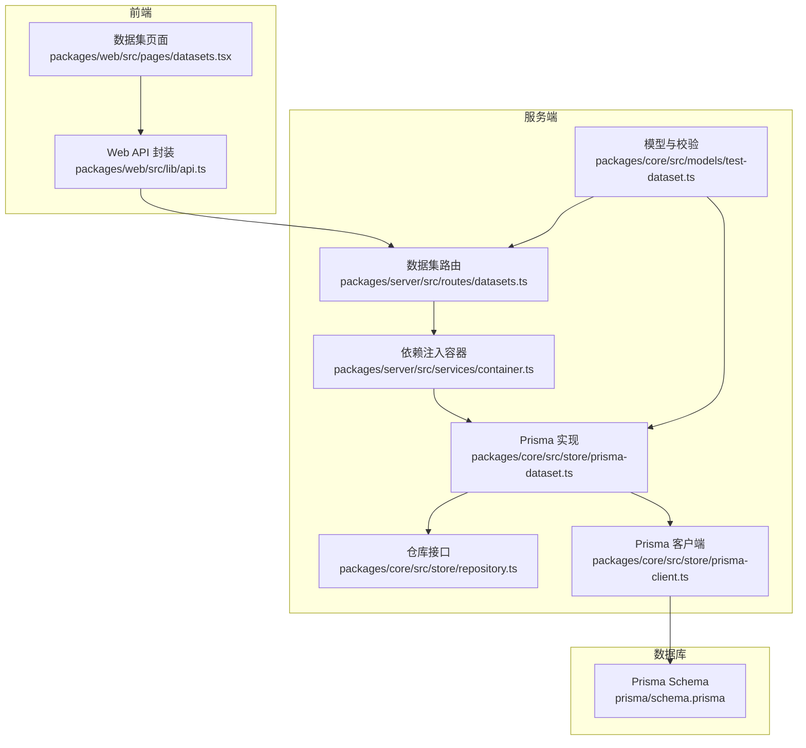
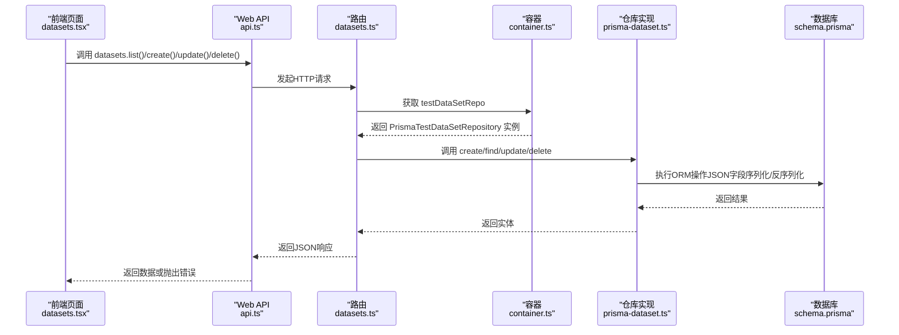
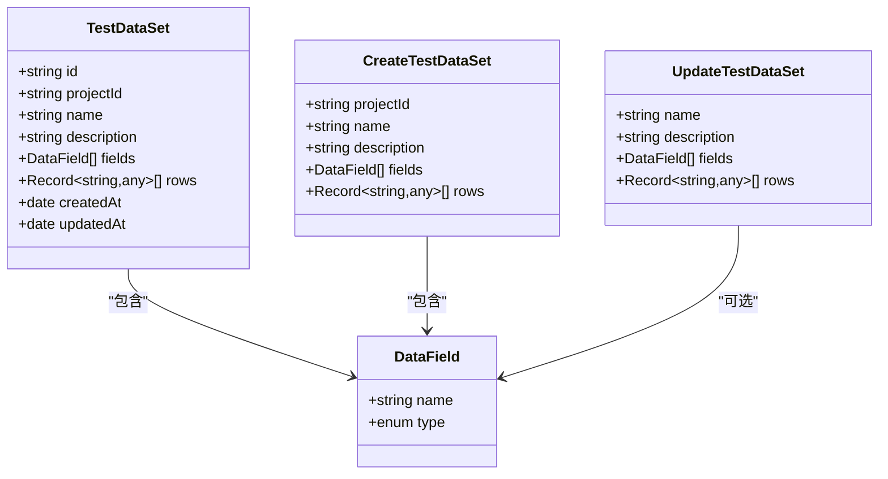
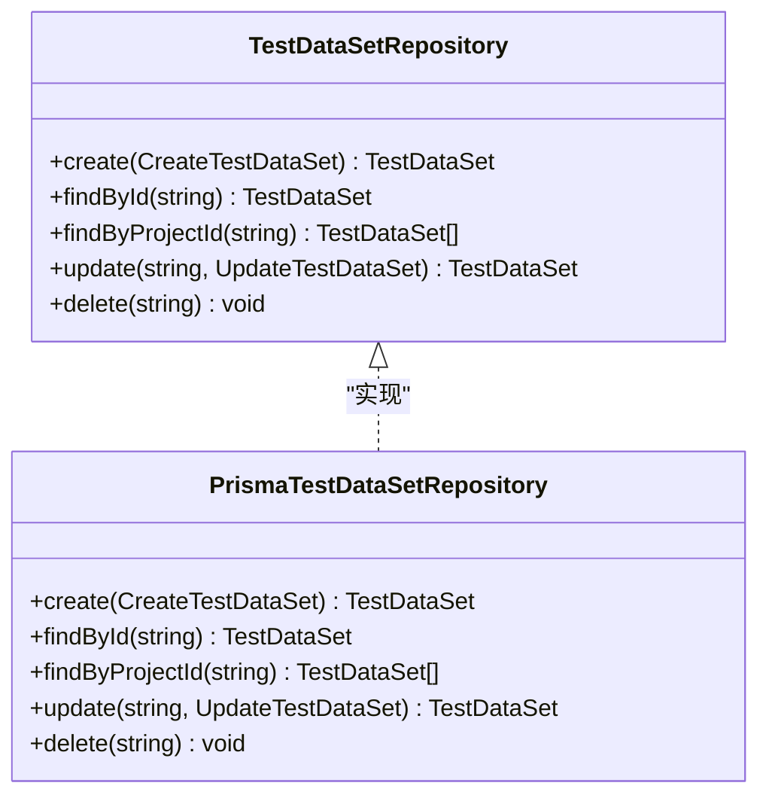
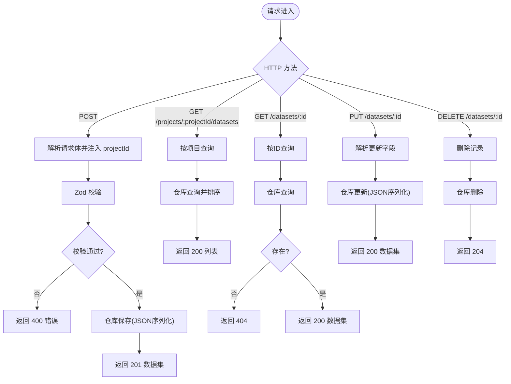
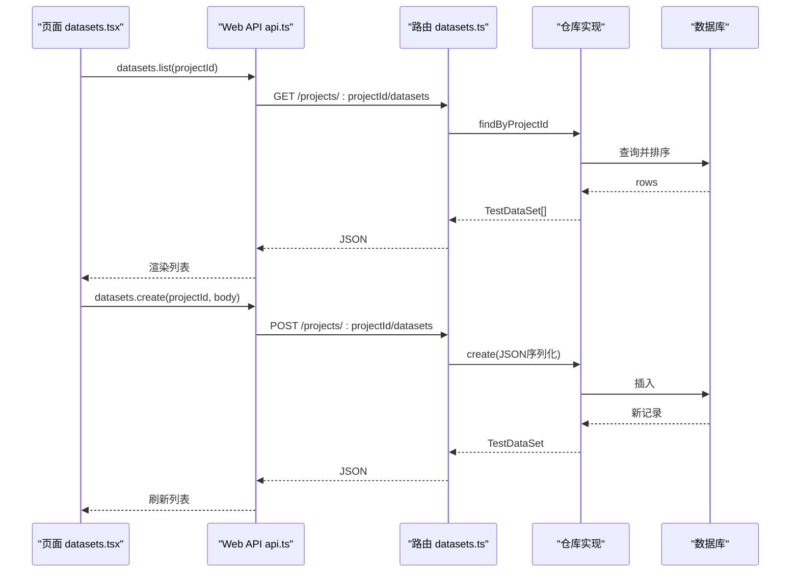
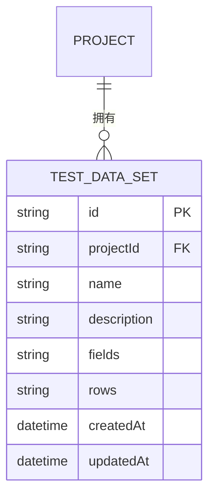
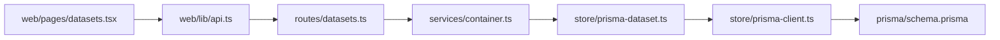

# 数据集API

<cite>
**本文引用的文件**
- [packages/server/src/routes/datasets.ts](file://packages/server/src/routes/datasets.ts)
- [packages/core/src/models/test-dataset.ts](file://packages/core/src/models/test-dataset.ts)
- [packages/core/src/store/prisma-dataset.ts](file://packages/core/src/store/prisma-dataset.ts)
- [packages/core/src/store/repository.ts](file://packages/core/src/store/repository.ts)
- [packages/core/src/store/prisma-client.ts](file://packages/core/src/store/prisma-client.ts)
- [prisma/schema.prisma](file://prisma/schema.prisma)
- [packages/web/src/lib/api.ts](file://packages/web/src/lib/api.ts)
- [packages/web/src/pages/datasets.tsx](file://packages/web/src/pages/datasets.tsx)
- [packages/server/src/services/container.ts](file://packages/server/src/services/container.ts)
- [packages/shared/src/errors.ts](file://packages/shared/src/errors.ts)
</cite>

## 目录
1. [简介](#简介)
2. [项目结构](#项目结构)
3. [核心组件](#核心组件)
4. [架构总览](#架构总览)
5. [详细组件分析](#详细组件分析)
6. [依赖分析](#依赖分析)
7. [性能考虑](#性能考虑)
8. [故障排查指南](#故障排查指南)
9. [结论](#结论)
10. [附录](#附录)

## 简介
本文件为“数据集API”的完整技术文档，覆盖数据集的创建、查询、更新、删除等REST端点；数据集的行列结构、字段类型定义与校验规则；前端交互与数据展示；以及与测试用例的关系、参数化测试支持、数据隔离机制、权限与审计、缓存策略与性能优化、大数据集处理方案等。本文所有技术细节均来自仓库现有源码与模型定义。

## 项目结构
围绕数据集API的关键模块分布如下：
- 服务端路由：定义REST接口与请求解析
- 核心模型与校验：定义数据集字段类型、请求/响应结构与Zod校验
- 存储层：Prisma仓库实现，负责JSON字段序列化/反序列化与数据库交互
- 前端API封装与页面组件：提供列表、编辑、保存等UI能力
- 容器与依赖注入：统一注册仓库与编排器
- 数据库Schema：定义表结构、索引与外键关系

图表来源
- [packages/server/src/routes/datasets.ts:1-48](file://packages/server/src/routes/datasets.ts#L1-L48)
- [packages/core/src/models/test-dataset.ts:1-47](file://packages/core/src/models/test-dataset.ts#L1-L47)
- [packages/core/src/store/prisma-dataset.ts:1-69](file://packages/core/src/store/prisma-dataset.ts#L1-L69)
- [packages/core/src/store/repository.ts:89-95](file://packages/core/src/store/repository.ts#L89-L95)
- [packages/core/src/store/prisma-client.ts:1-17](file://packages/core/src/store/prisma-client.ts#L1-L17)
- [prisma/schema.prisma:126-139](file://prisma/schema.prisma#L126-L139)
- [packages/web/src/lib/api.ts:191-200](file://packages/web/src/lib/api.ts#L191-L200)
- [packages/web/src/pages/datasets.tsx:1-212](file://packages/web/src/pages/datasets.tsx#L1-L212)
- [packages/server/src/services/container.ts:1-42](file://packages/server/src/services/container.ts#L1-L42)

章节来源
- [packages/server/src/routes/datasets.ts:1-48](file://packages/server/src/routes/datasets.ts#L1-L48)
- [packages/core/src/models/test-dataset.ts:1-47](file://packages/core/src/models/test-dataset.ts#L1-L47)
- [packages/core/src/store/prisma-dataset.ts:1-69](file://packages/core/src/store/prisma-dataset.ts#L1-L69)
- [packages/core/src/store/repository.ts:89-95](file://packages/core/src/store/repository.ts#L89-L95)
- [packages/core/src/store/prisma-client.ts:1-17](file://packages/core/src/store/prisma-client.ts#L1-L17)
- [prisma/schema.prisma:126-139](file://prisma/schema.prisma#L126-L139)
- [packages/web/src/lib/api.ts:191-200](file://packages/web/src/lib/api.ts#L191-L200)
- [packages/web/src/pages/datasets.tsx:1-212](file://packages/web/src/pages/datasets.tsx#L1-L212)
- [packages/server/src/services/container.ts:1-42](file://packages/server/src/services/container.ts#L1-L42)

## 核心组件
- 数据集模型与校验
  - 字段类型：字符串、数字、布尔、邮箱、UUID、日期、自定义
  - 结构：名称、描述、字段数组（含名称与类型）、行数组（每行是键值映射）
  - 请求/响应校验：创建、更新、完整实体
- 仓库接口与实现
  - 接口：创建、按ID查找、按项目查找、更新、删除
  - 实现：JSON序列化/反序列化字段，Prisma ORM调用
- 路由与控制器
  - REST端点：创建、列表、详情、更新、删除
  - 参数与路径：项目ID、数据集ID
  - 错误处理：未找到、校验错误
- 前端API与页面
  - API封装：统一请求、错误抛出
  - 页面：列表展示、对话框编辑、JSON输入校验

章节来源
- [packages/core/src/models/test-dataset.ts:1-47](file://packages/core/src/models/test-dataset.ts#L1-L47)
- [packages/core/src/store/repository.ts:89-95](file://packages/core/src/store/repository.ts#L89-L95)
- [packages/core/src/store/prisma-dataset.ts:1-69](file://packages/core/src/store/prisma-dataset.ts#L1-L69)
- [packages/server/src/routes/datasets.ts:1-48](file://packages/server/src/routes/datasets.ts#L1-L48)
- [packages/web/src/lib/api.ts:191-200](file://packages/web/src/lib/api.ts#L191-L200)
- [packages/web/src/pages/datasets.tsx:1-212](file://packages/web/src/pages/datasets.tsx#L1-L212)

## 架构总览
数据集API采用分层架构：
- 表现层：前端页面与API封装
- 控制层：Fastify路由与请求解析
- 应用层：仓库接口与实现
- 持久层：Prisma ORM与SQLite数据库

图表来源
- [packages/web/src/pages/datasets.tsx:1-212](file://packages/web/src/pages/datasets.tsx#L1-L212)
- [packages/web/src/lib/api.ts:191-200](file://packages/web/src/lib/api.ts#L191-L200)
- [packages/server/src/routes/datasets.ts:1-48](file://packages/server/src/routes/datasets.ts#L1-L48)
- [packages/server/src/services/container.ts:1-42](file://packages/server/src/services/container.ts#L1-L42)
- [packages/core/src/store/prisma-dataset.ts:1-69](file://packages/core/src/store/prisma-dataset.ts#L1-L69)
- [prisma/schema.prisma:126-139](file://prisma/schema.prisma#L126-L139)

## 详细组件分析

### 数据集模型与数据结构
- 字段类型枚举：string、number、boolean、email、uuid、date、custom
- 数据结构要点：
  - fields：每个元素包含name与type
  - rows：每行是一个键值映射，键对应fields中name，值类型由type约束
- 校验规则：
  - 名称长度限制与必填
  - fields与rows默认为空数组
  - 更新时可选字段，允许部分更新

图表来源
- [packages/core/src/models/test-dataset.ts:1-47](file://packages/core/src/models/test-dataset.ts#L1-L47)

章节来源
- [packages/core/src/models/test-dataset.ts:1-47](file://packages/core/src/models/test-dataset.ts#L1-L47)

### 仓库接口与实现
- 接口职责：定义数据集的CRUD契约
- 实现要点：
  - JSON序列化：fields与rows在入库前转为字符串，在出库时解析回对象
  - 查询排序：按创建时间倒序返回
  - 更新策略：仅更新传入字段，未传字段保持不变

图表来源
- [packages/core/src/store/repository.ts:89-95](file://packages/core/src/store/repository.ts#L89-L95)
- [packages/core/src/store/prisma-dataset.ts:1-69](file://packages/core/src/store/prisma-dataset.ts#L1-L69)

章节来源
- [packages/core/src/store/repository.ts:89-95](file://packages/core/src/store/repository.ts#L89-L95)
- [packages/core/src/store/prisma-dataset.ts:1-69](file://packages/core/src/store/prisma-dataset.ts#L1-L69)

### 路由与端点
- 创建数据集
  - 方法：POST
  - 路径：/api/v1/projects/:projectId/datasets
  - 请求体：包含projectId、name、description、fields、rows
  - 响应：201 Created，返回新建数据集
- 列表数据集
  - 方法：GET
  - 路径：/api/v1/projects/:projectId/datasets
  - 响应：200 OK，返回数组
- 获取数据集
  - 方法：GET
  - 路径：/api/v1/datasets/:id
  - 响应：200 OK 或 404
- 更新数据集
  - 方法：PUT
  - 路径：/api/v1/datasets/:id
  - 请求体：可选字段name/description/fields/rows
  - 响应：200 OK
- 删除数据集
  - 方法：DELETE
  - 路径：/api/v1/datasets/:id
  - 响应：204 No Content

图表来源
- [packages/server/src/routes/datasets.ts:1-48](file://packages/server/src/routes/datasets.ts#L1-L48)
- [packages/core/src/models/test-dataset.ts:29-42](file://packages/core/src/models/test-dataset.ts#L29-L42)
- [packages/core/src/store/prisma-dataset.ts:24-67](file://packages/core/src/store/prisma-dataset.ts#L24-L67)

章节来源
- [packages/server/src/routes/datasets.ts:1-48](file://packages/server/src/routes/datasets.ts#L1-L48)
- [packages/core/src/models/test-dataset.ts:1-47](file://packages/core/src/models/test-dataset.ts#L1-L47)
- [packages/core/src/store/prisma-dataset.ts:1-69](file://packages/core/src/store/prisma-dataset.ts#L1-L69)

### 前端交互与数据展示
- API封装：统一请求、状态码处理、错误抛出
- 页面逻辑：
  - 列表加载：按当前项目ID拉取数据集列表
  - 编辑对话框：支持新增与编辑，JSON文本输入，前端简单校验
  - 保存流程：解析JSON，构造请求体，调用API，刷新列表

图表来源
- [packages/web/src/pages/datasets.tsx:1-212](file://packages/web/src/pages/datasets.tsx#L1-L212)
- [packages/web/src/lib/api.ts:191-200](file://packages/web/src/lib/api.ts#L191-L200)
- [packages/server/src/routes/datasets.ts:1-48](file://packages/server/src/routes/datasets.ts#L1-L48)
- [packages/core/src/store/prisma-dataset.ts:24-36](file://packages/core/src/store/prisma-dataset.ts#L24-L36)

章节来源
- [packages/web/src/pages/datasets.tsx:1-212](file://packages/web/src/pages/datasets.tsx#L1-L212)
- [packages/web/src/lib/api.ts:191-200](file://packages/web/src/lib/api.ts#L191-L200)

### 数据库Schema与关系
- 数据集表：包含id、projectId、name、description、fields（JSON数组）、rows（JSON数组）、createdAt、updatedAt，并对projectId建立索引
- 外键关系：数据集属于项目（Cascade删除）

图表来源
- [prisma/schema.prisma:126-139](file://prisma/schema.prisma#L126-L139)

章节来源
- [prisma/schema.prisma:126-139](file://prisma/schema.prisma#L126-L139)

### 数据集与测试用例的关联关系
- 当前仓库未发现数据集与测试用例直接的显式关联字段或关系
- 测试步骤类型包含“load-dataset”，表明测试执行阶段可加载数据集，但具体加载与参数化机制未在现有代码中体现
- 若需实现参数化测试，建议在测试步骤中扩展对数据集ID与列名的引用，并在执行器中实现行迭代与变量替换

章节来源
- [packages/web/src/lib/api.ts](file://packages/web/src/lib/api.ts#L33)
- [prisma/schema.prisma:126-139](file://prisma/schema.prisma#L126-L139)

### CSV导入/导出与数据验证
- 导入/导出能力
  - 仓库与路由未提供CSV导入/导出端点
  - 前端页面支持以JSON形式编辑fields与rows
- 数据验证
  - 后端：Zod校验请求体字段与长度
  - 前端：JSON文本格式校验，提示无效JSON
- 建议
  - 在路由层增加CSV导入/导出端点
  - 在仓库层实现CSV解析/生成与字段类型校验
  - 在前端提供CSV上传与预览

章节来源
- [packages/server/src/routes/datasets.ts:1-48](file://packages/server/src/routes/datasets.ts#L1-L48)
- [packages/core/src/models/test-dataset.ts:29-42](file://packages/core/src/models/test-dataset.ts#L29-L42)
- [packages/web/src/pages/datasets.tsx:154-174](file://packages/web/src/pages/datasets.tsx#L154-L174)

### 模板、批量操作与版本管理
- 模板
  - 未发现数据集模板相关实现
- 批量操作
  - 未发现批量创建/更新/删除端点
- 版本管理
  - 数据集实体未包含version字段
  - 测试用例实体包含version字段，可作为参考设计

章节来源
- [prisma/schema.prisma:26-44](file://prisma/schema.prisma#L26-L44)
- [prisma/schema.prisma:126-139](file://prisma/schema.prisma#L126-L139)

### 权限控制与访问审计
- 权限控制
  - 未在路由层发现鉴权中间件或权限校验逻辑
- 访问审计
  - 未发现审计日志或访问追踪字段
- 建议
  - 在路由层引入鉴权与授权中间件
  - 引入审计日志表，记录关键操作与变更

章节来源
- [packages/server/src/routes/datasets.ts:1-48](file://packages/server/src/routes/datasets.ts#L1-L48)

### 数据隔离机制
- 项目维度隔离：数据集通过projectId进行查询与创建
- 外键约束：删除项目时级联删除其下数据集

章节来源
- [prisma/schema.prisma:126-139](file://prisma/schema.prisma#L126-L139)

## 依赖分析
- 组件耦合
  - 路由依赖容器提供的仓库实例
  - 仓库实现依赖Prisma客户端与Schema定义
  - 前端API封装与路由通过统一BASE路径通信
- 可能的循环依赖
  - 当前文件未见循环导入
- 外部依赖
  - Fastify（路由框架）
  - Zod（请求校验）
  - Prisma（ORM）
  - SQLite（数据库）

图表来源
- [packages/server/src/routes/datasets.ts:1-48](file://packages/server/src/routes/datasets.ts#L1-L48)
- [packages/server/src/services/container.ts:1-42](file://packages/server/src/services/container.ts#L1-L42)
- [packages/core/src/store/prisma-dataset.ts:1-69](file://packages/core/src/store/prisma-dataset.ts#L1-L69)
- [packages/core/src/store/prisma-client.ts:1-17](file://packages/core/src/store/prisma-client.ts#L1-L17)
- [prisma/schema.prisma:126-139](file://prisma/schema.prisma#L126-L139)
- [packages/web/src/lib/api.ts:1-325](file://packages/web/src/lib/api.ts#L1-L325)
- [packages/web/src/pages/datasets.tsx:1-212](file://packages/web/src/pages/datasets.tsx#L1-L212)

章节来源
- [packages/server/src/routes/datasets.ts:1-48](file://packages/server/src/routes/datasets.ts#L1-L48)
- [packages/server/src/services/container.ts:1-42](file://packages/server/src/services/container.ts#L1-L42)
- [packages/core/src/store/prisma-dataset.ts:1-69](file://packages/core/src/store/prisma-dataset.ts#L1-L69)
- [packages/core/src/store/prisma-client.ts:1-17](file://packages/core/src/store/prisma-client.ts#L1-L17)
- [prisma/schema.prisma:126-139](file://prisma/schema.prisma#L126-L139)
- [packages/web/src/lib/api.ts:1-325](file://packages/web/src/lib/api.ts#L1-L325)
- [packages/web/src/pages/datasets.tsx:1-212](file://packages/web/src/pages/datasets.tsx#L1-L212)

## 性能考虑
- 数据序列化开销
  - fields与rows以JSON字符串存储，读写时需要序列化/反序列化
  - 对于超大表格，建议分页查询与懒加载
- 查询性能
  - findByProjectId已按createdAt降序，适合按时间浏览
  - 建议在fields/rows上增加全文检索或专用索引（如需搜索特定字段值）
- 内存占用
  - 前端一次性渲染大量行可能导致内存压力
  - 建议采用虚拟滚动与分页
- 并发与一致性
  - 更新时仅更新传入字段，避免全量覆盖
  - 对于大批量导入，建议事务与分批写入

## 故障排查指南
- 常见错误
  - 400 VALIDATION_ERROR：请求体不满足Zod校验（如name长度、JSON格式）
  - 404 NOT_FOUND：数据集不存在
- 定位方法
  - 查看路由中的错误处理与状态码返回
  - 检查仓库实现的JSON序列化是否异常
  - 核对Prisma Schema字段类型与默认值
- 建议
  - 在容器层捕获并转换为统一错误格式
  - 前端显示明确的错误信息与重试机制

章节来源
- [packages/server/src/routes/datasets.ts:1-48](file://packages/server/src/routes/datasets.ts#L1-L48)
- [packages/shared/src/errors.ts:1-25](file://packages/shared/src/errors.ts#L1-L25)
- [packages/core/src/store/prisma-dataset.ts:10-21](file://packages/core/src/store/prisma-dataset.ts#L10-L21)

## 结论
数据集API提供了完整的CRUD能力与基础校验，数据结构清晰且易于扩展。当前缺少CSV导入导出、模板/批量操作、版本管理、权限控制与审计、参数化测试支持等功能。建议在路由层补充导入导出端点与鉴权控制，在仓库层完善CSV解析与字段校验，并在测试步骤中实现数据集参数化加载。

## 附录

### API定义（端点与参数）
- 创建数据集
  - 方法：POST
  - 路径：/api/v1/projects/:projectId/datasets
  - 请求体字段：projectId、name、description、fields、rows
  - 响应：201 Created，返回数据集对象
- 列表数据集
  - 方法：GET
  - 路径：/api/v1/projects/:projectId/datasets
  - 响应：200 OK，返回数组
- 获取数据集
  - 方法：GET
  - 路径：/api/v1/datasets/:id
  - 响应：200 OK 或 404
- 更新数据集
  - 方法：PUT
  - 路径：/api/v1/datasets/:id
  - 请求体字段：name、description、fields、rows（可选）
  - 响应：200 OK
- 删除数据集
  - 方法：DELETE
  - 路径：/api/v1/datasets/:id
  - 响应：204 No Content

章节来源
- [packages/server/src/routes/datasets.ts:1-48](file://packages/server/src/routes/datasets.ts#L1-L48)
- [packages/web/src/lib/api.ts:191-200](file://packages/web/src/lib/api.ts#L191-L200)