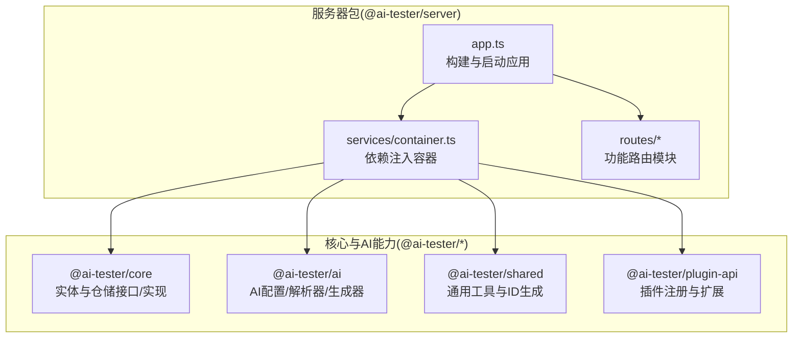
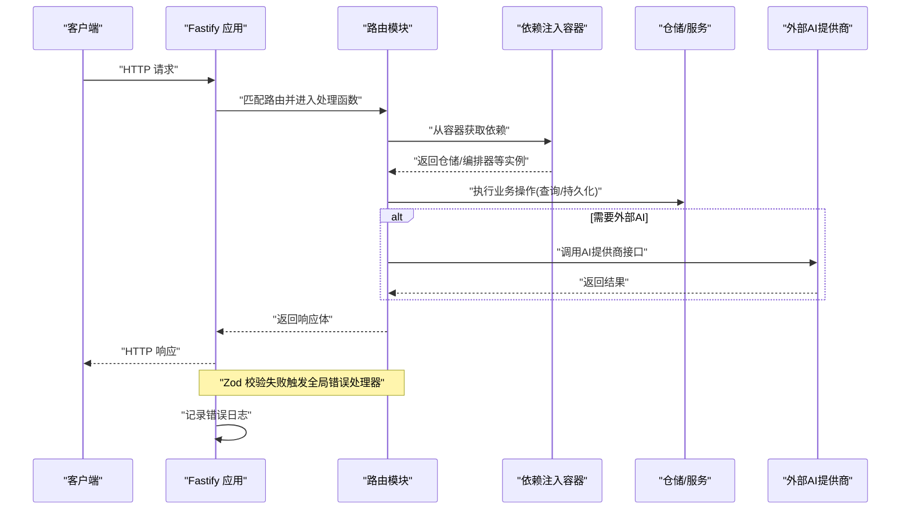
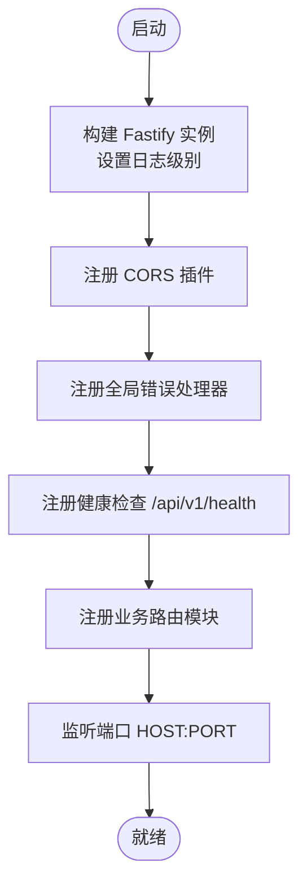
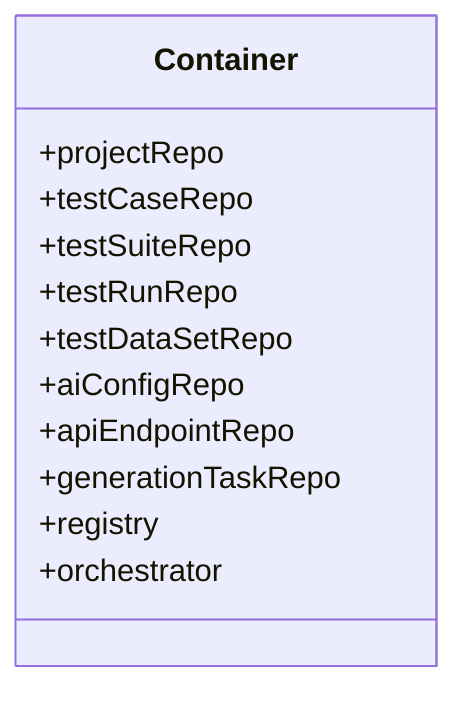
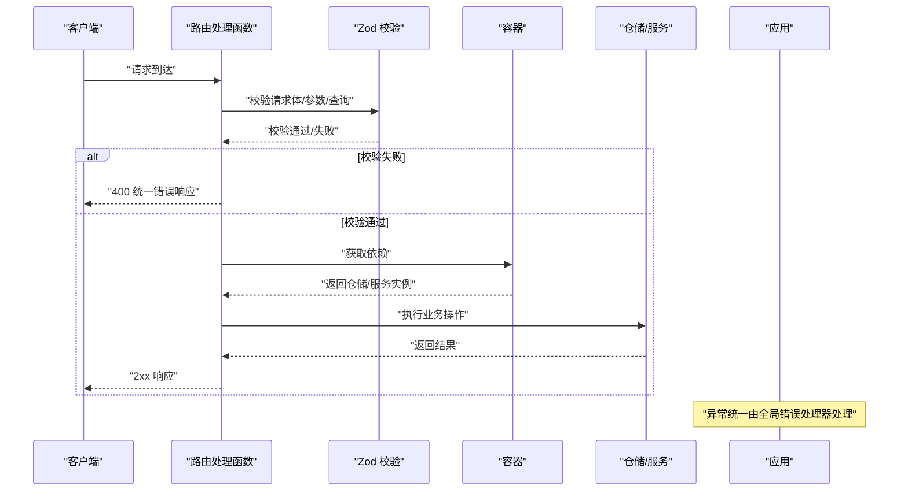
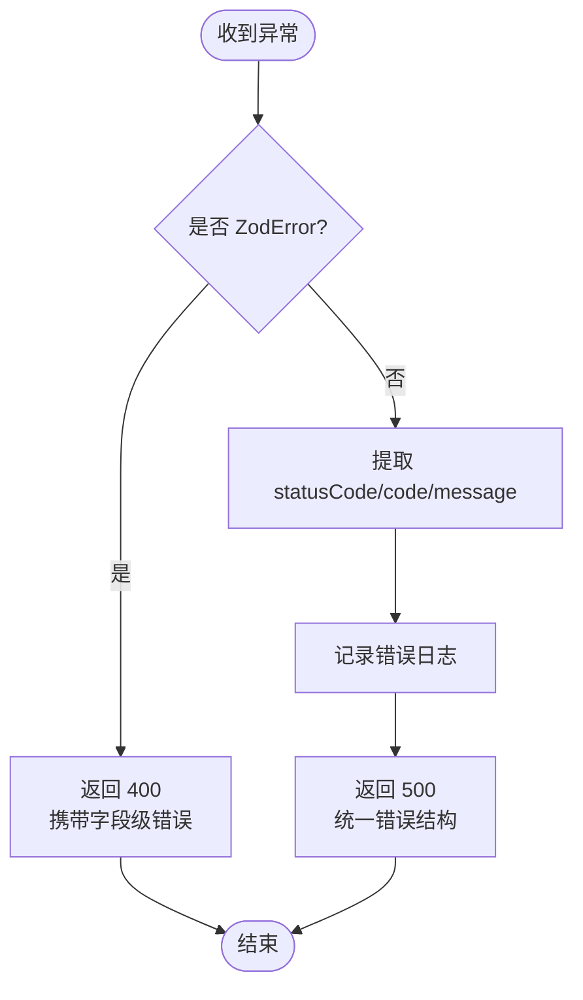
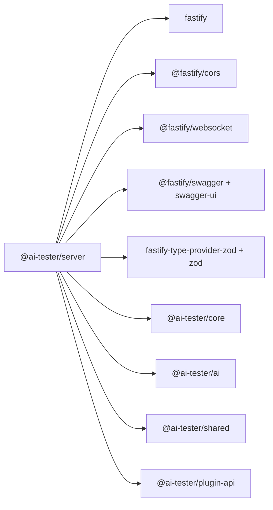

# 服务器架构

<cite>
**本文引用的文件**
- [packages/server/src/app.ts](file://packages/server/src/app.ts)
- [packages/server/src/services/container.ts](file://packages/server/src/services/container.ts)
- [packages/server/src/routes/projects.ts](file://packages/server/src/routes/projects.ts)
- [packages/server/src/routes/test-cases.ts](file://packages/server/src/routes/test-cases.ts)
- [packages/server/src/routes/suites.ts](file://packages/server/src/routes/suites.ts)
- [packages/server/src/routes/runs.ts](file://packages/server/src/routes/runs.ts)
- [packages/server/src/routes/datasets.ts](file://packages/server/src/routes/datasets.ts)
- [packages/server/src/routes/ai-config.ts](file://packages/server/src/routes/ai-config.ts)
- [packages/server/src/routes/ai-endpoints.ts](file://packages/server/src/routes/ai-endpoints.ts)
- [packages/server/src/routes/ai-generation.ts](file://packages/server/src/routes/ai-generation.ts)
- [packages/server/package.json](file://packages/server/package.json)
- [package.json](file://package.json)
</cite>

## 目录
1. [简介](#简介)
2. [项目结构](#项目结构)
3. [核心组件](#核心组件)
4. [架构总览](#架构总览)
5. [详细组件分析](#详细组件分析)
6. [依赖关系分析](#依赖关系分析)
7. [性能考虑](#性能考虑)
8. [故障排除指南](#故障排除指南)
9. [结论](#结论)
10. [附录](#附录)

## 简介
本文件面向服务器架构，围绕基于 Fastify 的后端服务进行系统性说明。内容涵盖应用初始化与启动、中间件与插件（含 CORS）、全局错误处理、路由组织与请求生命周期、依赖注入容器、日志与健康检查、以及性能优化与监控建议。文档同时提供关键流程的时序图与类图，帮助读者快速理解代码结构与交互。

## 项目结构
该仓库采用多包工作区（pnpm workspace）组织，服务器相关逻辑集中在 @ai-tester/server 包中，核心业务能力由 @ai-tester/core、@ai-tester/ai、@ai-tester/shared、@ai-tester/plugin-api 等包提供。服务器入口通过 Fastify 构建应用实例，注册 CORS、全局错误处理器、健康检查端点，并按模块化方式注册各路由模块。

图表来源
- [packages/server/src/app.ts:1-78](file://packages/server/src/app.ts#L1-L78)
- [packages/server/src/services/container.ts:1-42](file://packages/server/src/services/container.ts#L1-L42)
- [packages/server/src/routes/projects.ts:1-40](file://packages/server/src/routes/projects.ts#L1-L40)
- [packages/server/src/routes/test-cases.ts:1-69](file://packages/server/src/routes/test-cases.ts#L1-L69)
- [packages/server/src/routes/suites.ts:1-49](file://packages/server/src/routes/suites.ts#L1-L49)
- [packages/server/src/routes/runs.ts:1-45](file://packages/server/src/routes/runs.ts#L1-L45)
- [packages/server/src/routes/datasets.ts:1-49](file://packages/server/src/routes/datasets.ts#L1-L49)
- [packages/server/src/routes/ai-config.ts:1-82](file://packages/server/src/routes/ai-config.ts#L1-L82)
- [packages/server/src/routes/ai-endpoints.ts:1-183](file://packages/server/src/routes/ai-endpoints.ts#L1-L183)
- [packages/server/src/routes/ai-generation.ts:1-180](file://packages/server/src/routes/ai-generation.ts#L1-L180)

章节来源
- [packages/server/src/app.ts:1-78](file://packages/server/src/app.ts#L1-L78)
- [packages/server/src/services/container.ts:1-42](file://packages/server/src/services/container.ts#L1-L42)
- [packages/server/package.json:1-36](file://packages/server/package.json#L1-L36)
- [package.json:1-31](file://package.json#L1-L31)

## 核心组件
- 应用构建与启动：通过工厂函数构建 Fastify 实例，设置日志级别，注册 CORS 插件，定义全局错误处理器，挂载健康检查端点，最后注册所有业务路由模块并启动监听。
- 中间件与插件：使用 @fastify/cors 提供跨域支持；使用 fastify-type-provider-zod 与 zod schema 进行请求体校验；Swagger 文档由 @fastify/swagger 与 @fastify/swagger-ui 提供（在依赖中声明）。
- 全局错误处理：对 Zod 校验错误与通用错误分别处理，统一返回标准化错误结构，并记录日志。
- 路由组织：按领域拆分路由模块（项目、测试用例、套件、运行、数据集、AI 配置、AI 端点、AI 生成），每个模块导出异步函数用于注册路径。
- 依赖注入容器：集中管理仓储、插件注册表、编排器等单例对象，路由层通过导入容器获取依赖，避免在路由内直接构造复杂对象。
- 健康检查：提供 /api/v1/health 快速探测服务可用性。
- 日志：通过 Fastify 内置日志器输出，日志级别可由环境变量控制。

章节来源
- [packages/server/src/app.ts:13-63](file://packages/server/src/app.ts#L13-L63)
- [packages/server/src/services/container.ts:1-42](file://packages/server/src/services/container.ts#L1-L42)
- [packages/server/src/routes/projects.ts:1-40](file://packages/server/src/routes/projects.ts#L1-L40)
- [packages/server/src/routes/test-cases.ts:1-69](file://packages/server/src/routes/test-cases.ts#L1-L69)
- [packages/server/src/routes/suites.ts:1-49](file://packages/server/src/routes/suites.ts#L1-L49)
- [packages/server/src/routes/runs.ts:1-45](file://packages/server/src/routes/runs.ts#L1-L45)
- [packages/server/src/routes/datasets.ts:1-49](file://packages/server/src/routes/datasets.ts#L1-L49)
- [packages/server/src/routes/ai-config.ts:1-82](file://packages/server/src/routes/ai-config.ts#L1-L82)
- [packages/server/src/routes/ai-endpoints.ts:1-183](file://packages/server/src/routes/ai-endpoints.ts#L1-L183)
- [packages/server/src/routes/ai-generation.ts:1-180](file://packages/server/src/routes/ai-generation.ts#L1-L180)

## 架构总览
下图展示从客户端到路由处理、仓储调用与外部 AI 服务的典型调用链，以及错误处理与日志记录的位置。

图表来源
- [packages/server/src/app.ts:24-43](file://packages/server/src/app.ts#L24-L43)
- [packages/server/src/routes/ai-generation.ts:18-92](file://packages/server/src/routes/ai-generation.ts#L18-L92)
- [packages/server/src/routes/ai-endpoints.ts:112-181](file://packages/server/src/routes/ai-endpoints.ts#L112-L181)
- [packages/server/src/services/container.ts:34-41](file://packages/server/src/services/container.ts#L34-L41)

## 详细组件分析

### 应用构建与启动（app.ts）
- 初始化 Fastify 并设置日志级别（默认 info，可通过环境变量 LOG_LEVEL 调整）。
- 注册 CORS 插件，允许跨域访问。
- 定义全局错误处理器：对 Zod 校验错误返回 400 并携带字段级错误；对其他异常记录错误日志并返回 500。
- 挂载健康检查端点 /api/v1/health，返回服务状态、时间戳与版本信息。
- 依次注册各路由模块（项目、测试用例、套件、运行、数据集、AI 配置、AI 端点、AI 生成）。
- 从环境变量读取 HOST 与 PORT，默认监听 0.0.0.0:3100。

图表来源
- [packages/server/src/app.ts:13-78](file://packages/server/src/app.ts#L13-L78)

章节来源
- [packages/server/src/app.ts:13-78](file://packages/server/src/app.ts#L13-L78)

### 依赖注入容器（services/container.ts）
- 单例仓储：项目、测试用例、套件、运行、数据集仓储实例。
- AI 专属仓储：AI 配置、API 端点、生成任务仓储实例。
- 插件注册表：创建插件注册表并注册 API 插件。
- 编排器：以注册表与各类仓储为依赖构造编排器，负责协调测试运行流程。
- 导出容器中的实例，供路由模块按需导入使用。

图表来源
- [packages/server/src/services/container.ts:17-42](file://packages/server/src/services/container.ts#L17-L42)

章节来源
- [packages/server/src/services/container.ts:1-42](file://packages/server/src/services/container.ts#L1-L42)

### 路由组织与请求生命周期
- 路由模块均导出异步函数，接收 Fastify 实例作为参数，在内部注册路径与处理函数。
- 处理函数通常先进行 Zod Schema 校验，再从容器获取仓储或服务实例，执行业务逻辑，最后返回标准化响应体。
- 对于不存在的资源，返回 404 并携带统一错误结构；对于无效输入，返回 400 并携带字段级错误。
- 异常在路由层捕获后统一交由全局错误处理器处理，保证响应格式一致。

图表来源
- [packages/server/src/routes/projects.ts:8-38](file://packages/server/src/routes/projects.ts#L8-L38)
- [packages/server/src/routes/test-cases.ts:7-67](file://packages/server/src/routes/test-cases.ts#L7-L67)
- [packages/server/src/routes/suites.ts:7-47](file://packages/server/src/routes/suites.ts#L7-L47)
- [packages/server/src/routes/runs.ts:7-43](file://packages/server/src/routes/runs.ts#L7-L43)
- [packages/server/src/routes/datasets.ts:7-47](file://packages/server/src/routes/datasets.ts#L7-L47)
- [packages/server/src/routes/ai-config.ts:13-80](file://packages/server/src/routes/ai-config.ts#L13-L80)
- [packages/server/src/routes/ai-endpoints.ts:14-109](file://packages/server/src/routes/ai-endpoints.ts#L14-L109)
- [packages/server/src/routes/ai-generation.ts:18-178](file://packages/server/src/routes/ai-generation.ts#L18-L178)
- [packages/server/src/app.ts:24-43](file://packages/server/src/app.ts#L24-L43)

章节来源
- [packages/server/src/routes/projects.ts:1-40](file://packages/server/src/routes/projects.ts#L1-L40)
- [packages/server/src/routes/test-cases.ts:1-69](file://packages/server/src/routes/test-cases.ts#L1-L69)
- [packages/server/src/routes/suites.ts:1-49](file://packages/server/src/routes/suites.ts#L1-L49)
- [packages/server/src/routes/runs.ts:1-45](file://packages/server/src/routes/runs.ts#L1-L45)
- [packages/server/src/routes/datasets.ts:1-49](file://packages/server/src/routes/datasets.ts#L1-L49)
- [packages/server/src/routes/ai-config.ts:1-82](file://packages/server/src/routes/ai-config.ts#L1-L82)
- [packages/server/src/routes/ai-endpoints.ts:1-183](file://packages/server/src/routes/ai-endpoints.ts#L1-L183)
- [packages/server/src/routes/ai-generation.ts:1-180](file://packages/server/src/routes/ai-generation.ts#L1-L180)

### 错误处理机制
- Zod 校验错误：当请求体不符合 schema 时，返回 400，携带错误码与字段级 details。
- 通用错误：提取 statusCode 与 code 字段，若无则默认 500 与 INTERNAL_ERROR；记录错误日志并返回统一错误结构。
- 路由内显式错误：如资源不存在、AI 未配置、任务状态不合法等，返回相应 4xx 错误码与消息。

图表来源
- [packages/server/src/app.ts:24-43](file://packages/server/src/app.ts#L24-L43)

章节来源
- [packages/server/src/app.ts:24-43](file://packages/server/src/app.ts#L24-L43)

### CORS 配置
- 使用 @fastify/cors 插件，origin 设置为 true，允许浏览器动态来源访问。
- 该配置适用于开发与本地联调场景；生产环境可根据需要收紧来源白名单。

章节来源
- [packages/server/src/app.ts](file://packages/server/src/app.ts#L21)

### 健康检查机制
- 路径：/api/v1/health
- 返回内容包含服务状态、当前时间戳与版本号，便于探活与可观测性集成。

章节来源
- [packages/server/src/app.ts:46-50](file://packages/server/src/app.ts#L46-L50)

### 日志记录
- 日志级别由环境变量 LOG_LEVEL 控制，默认 info。
- 全局错误处理器会调用 app.log.error 记录异常堆栈，便于问题定位。

章节来源
- [packages/server/src/app.ts:14-18](file://packages/server/src/app.ts#L14-L18)
- [packages/server/src/app.ts](file://packages/server/src/app.ts#L36)

### 配置管理与环境变量
- 启动参数：HOST、PORT（默认 0.0.0.0:3100）。
- 日志级别：LOG_LEVEL（默认 info）。
- Swagger 文档相关依赖已在服务器包中声明，可用于生成 API 文档。

章节来源
- [packages/server/src/app.ts:66-77](file://packages/server/src/app.ts#L66-L77)
- [packages/server/src/app.ts:15-17](file://packages/server/src/app.ts#L15-L17)
- [packages/server/package.json:24-26](file://packages/server/package.json#L24-L26)

## 依赖关系分析
- 服务器包依赖 Fastify 与若干官方插件（CORS、WebSocket、Swagger/Swagger-UI、Zod 类型提供器）。
- 业务能力来自 @ai-tester/core、@ai-tester/ai、@ai-tester/shared、@ai-tester/plugin-api。
- 工作区脚本统一管理构建、开发、测试与清理流程。

图表来源
- [packages/server/package.json:16-28](file://packages/server/package.json#L16-L28)

章节来源
- [packages/server/package.json:1-36](file://packages/server/package.json#L1-L36)
- [package.json:6-12](file://package.json#L6-L12)

## 性能考虑
- 中间件与插件：仅启用必要插件，避免不必要的序列化/反序列化开销；CORS 在生产环境建议限制 origin 白名单。
- 路由与校验：利用 Zod schema 在入口处快速失败，减少后续处理成本；批量导入与生成任务建议异步执行并返回任务 ID，前端轮询结果。
- 依赖注入：容器中仓储与服务均为单例，避免重复初始化；编排器与插件注册表集中管理，降低耦合。
- 日志：在高并发场景适当提高日志级别，减少低价值日志输出；错误日志保留关键上下文但避免大对象 dump。
- 数据库与外部服务：批量写入时使用事务或批处理；对外部 AI 服务调用增加超时与重试策略，避免阻塞请求线程。
- 监控指标：建议接入基础指标（请求量、响应时间、错误率、并发数）与业务指标（生成任务耗时、导入数量、运行成功率）。

## 故障排除指南
- 400 校验错误：检查请求体是否符合对应 schema，关注错误 details 中的字段提示。
- 404 资源不存在：确认资源 ID 是否正确，或查询条件是否匹配预期。
- 500 服务器错误：查看日志中的错误堆栈，定位具体路由与仓储调用；检查外部 AI 服务连通性与配额。
- CORS 跨域失败：确认浏览器来源是否在白名单内；生产环境建议明确指定 origin。
- 健康检查失败：检查 /api/v1/health 是否可达，确认监听地址与端口配置正确。
- AI 配置问题：确认已保存 AI 配置并通过测试接口验证连通性；检查密钥解密与掩码逻辑是否正常。

章节来源
- [packages/server/src/app.ts:24-43](file://packages/server/src/app.ts#L24-L43)
- [packages/server/src/routes/ai-config.ts:54-80](file://packages/server/src/routes/ai-config.ts#L54-L80)
- [packages/server/src/routes/ai-generation.ts:27-32](file://packages/server/src/routes/ai-generation.ts#L27-L32)

## 结论
该服务器采用模块化路由与集中式依赖注入容器，结合 Fastify 的高性能特性与插件体系，实现了清晰的职责分离与可维护的扩展性。通过统一的错误处理与健康检查机制，提升了系统的可观测性与稳定性。建议在生产环境中进一步完善 CORS 白名单、日志采样与监控告警，并对高并发场景进行压测与容量规划。

## 附录
- 启动命令与脚本：工作区统一脚本支持并行开发与构建；服务器包提供 dev、start、build 等脚本。
- 依赖清单：服务器包依赖 Fastify、CORS、WebSocket、Swagger/Swagger-UI、Zod 类型提供器及业务相关包。

章节来源
- [package.json:6-12](file://package.json#L6-L12)
- [packages/server/package.json:7-15](file://packages/server/package.json#L7-L15)