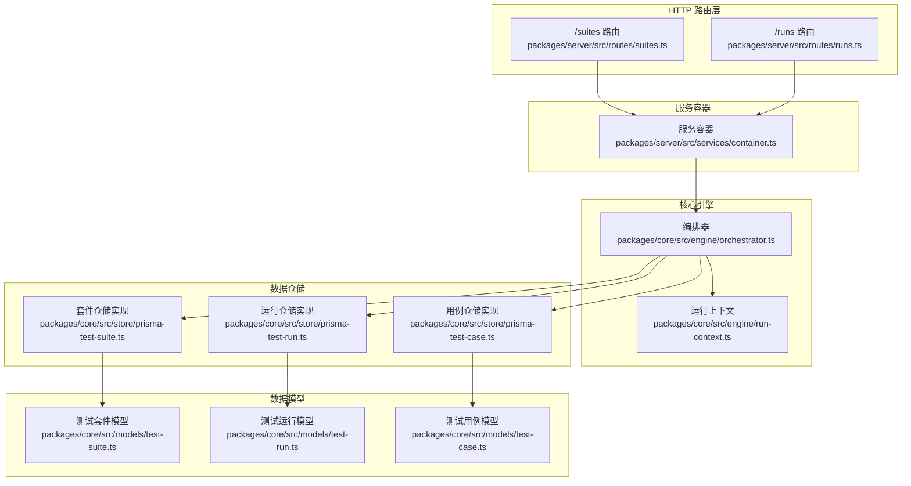
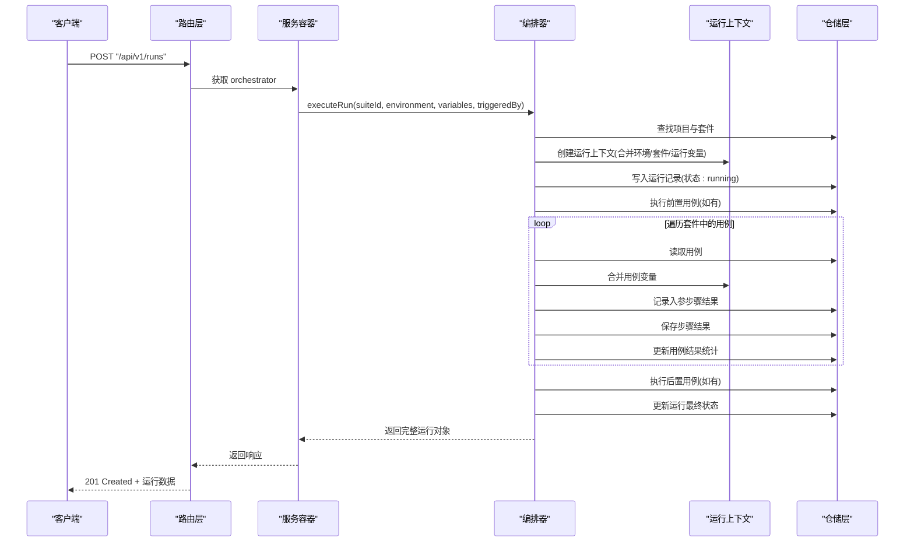
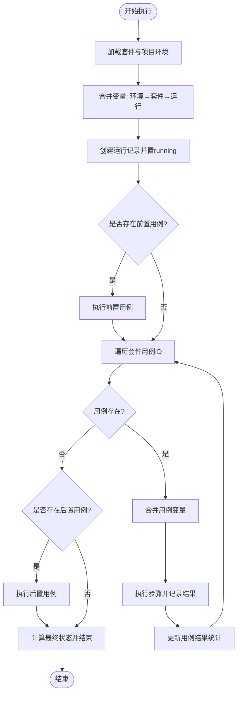
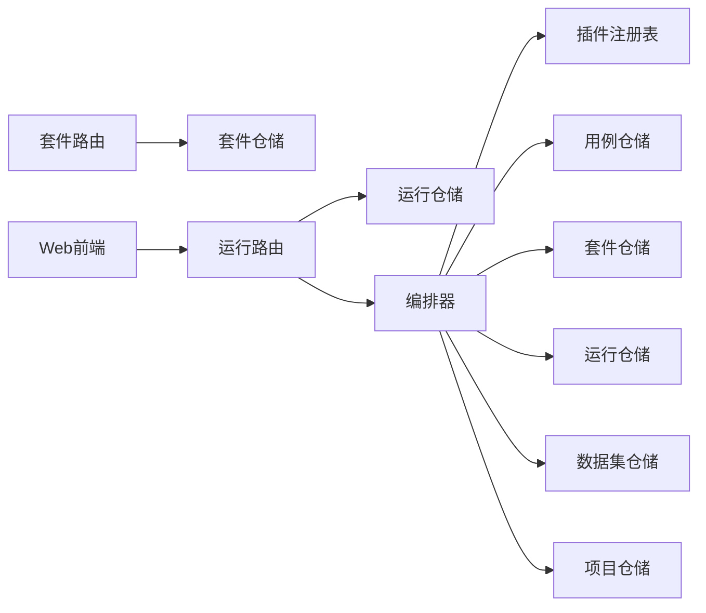

# 测试套件API

<cite>
**本文引用的文件**
- [packages/server/src/routes/suites.ts](file://packages/server/src/routes/suites.ts)
- [packages/core/src/models/test-suite.ts](file://packages/core/src/models/test-suite.ts)
- [packages/core/src/store/prisma-test-suite.ts](file://packages/core/src/store/prisma-test-suite.ts)
- [packages/server/src/routes/runs.ts](file://packages/server/src/routes/runs.ts)
- [packages/core/src/models/test-run.ts](file://packages/core/src/models/test-run.ts)
- [packages/core/src/engine/orchestrator.ts](file://packages/core/src/engine/orchestrator.ts)
- [packages/core/src/engine/run-context.ts](file://packages/core/src/engine/run-context.ts)
- [packages/core/src/store/prisma-test-run.ts](file://packages/core/src/store/prisma-test-run.ts)
- [packages/server/src/services/container.ts](file://packages/server/src/services/container.ts)
- [packages/core/src/models/test-case.ts](file://packages/core/src/models/test-case.ts)
- [packages/core/src/store/prisma-test-case.ts](file://packages/core/src/store/prisma-test-case.ts)
- [packages/web/src/pages/suites.tsx](file://packages/web/src/pages/suites.tsx)
</cite>

## 目录
1. [简介](#简介)
2. [项目结构](#项目结构)
3. [核心组件](#核心组件)
4. [架构总览](#架构总览)
5. [详细组件分析](#详细组件分析)
6. [依赖分析](#依赖分析)
7. [性能考虑](#性能考虑)
8. [故障排查指南](#故障排查指南)
9. [结论](#结论)
10. [附录](#附录)

## 简介
本文件为测试套件API的权威文档，覆盖测试套件的组织、配置与执行控制端点；详细说明套件成员（测试用例）管理、执行顺序控制与并行配置；文档化套件模板、继承机制与复用策略；包含套件级变量、环境配置与条件过滤；提供套件执行API、暂停/恢复与中断控制能力；解释套件与测试用例的关联关系、依赖解析与执行计划生成。

## 项目结构
后端采用分层设计：HTTP路由层负责暴露REST API；服务容器负责装配仓储与编排器；核心引擎负责执行计划与事件驱动；数据层通过Prisma访问数据库。

图表来源
- [packages/server/src/routes/suites.ts:1-49](file://packages/server/src/routes/suites.ts#L1-L49)
- [packages/server/src/routes/runs.ts:1-44](file://packages/server/src/routes/runs.ts#L1-L44)
- [packages/server/src/services/container.ts:1-42](file://packages/server/src/services/container.ts#L1-L42)
- [packages/core/src/engine/orchestrator.ts:1-149](file://packages/core/src/engine/orchestrator.ts#L1-L149)
- [packages/core/src/engine/run-context.ts:1-80](file://packages/core/src/engine/run-context.ts#L1-L80)
- [packages/core/src/store/prisma-test-suite.ts:1-77](file://packages/core/src/store/prisma-test-suite.ts#L1-L77)
- [packages/core/src/store/prisma-test-run.ts:91-131](file://packages/core/src/store/prisma-test-run.ts#L91-L131)
- [packages/core/src/store/prisma-test-case.ts:1-148](file://packages/core/src/store/prisma-test-case.ts#L1-L148)
- [packages/core/src/models/test-suite.ts:1-44](file://packages/core/src/models/test-suite.ts#L1-L44)
- [packages/core/src/models/test-run.ts:1-118](file://packages/core/src/models/test-run.ts#L1-L118)
- [packages/core/src/models/test-case.ts:1-46](file://packages/core/src/models/test-case.ts#L1-L46)

章节来源
- [packages/server/src/routes/suites.ts:1-49](file://packages/server/src/routes/suites.ts#L1-L49)
- [packages/server/src/routes/runs.ts:1-44](file://packages/server/src/routes/runs.ts#L1-L44)
- [packages/server/src/services/container.ts:1-42](file://packages/server/src/services/container.ts#L1-L42)

## 核心组件
- 套件资源：提供创建、查询、更新、删除套件的REST接口，支持按项目维度聚合。
- 运行资源：触发测试运行、列出运行历史、查询运行详情。
- 编排器：负责解析环境与变量合并、执行前置/后置用例、遍历套件内用例并生成结果。
- 运行上下文：提供模板变量解析、事件发射器、环境变量注入。
- 数据模型：定义套件、运行、用例的数据结构与校验规则。
- 仓储实现：基于Prisma的持久化读写，支持JSON字段序列化与复杂查询。

章节来源
- [packages/core/src/models/test-suite.ts:1-44](file://packages/core/src/models/test-suite.ts#L1-L44)
- [packages/core/src/store/prisma-test-suite.ts:1-77](file://packages/core/src/store/prisma-test-suite.ts#L1-L77)
- [packages/core/src/models/test-run.ts:1-118](file://packages/core/src/models/test-run.ts#L1-L118)
- [packages/core/src/store/prisma-test-run.ts:91-131](file://packages/core/src/store/prisma-test-run.ts#L91-L131)
- [packages/core/src/models/test-case.ts:1-46](file://packages/core/src/models/test-case.ts#L1-L46)
- [packages/core/src/store/prisma-test-case.ts:1-148](file://packages/core/src/store/prisma-test-case.ts#L1-L148)
- [packages/core/src/engine/orchestrator.ts:1-149](file://packages/core/src/engine/orchestrator.ts#L1-L149)
- [packages/core/src/engine/run-context.ts:1-80](file://packages/core/src/engine/run-context.ts#L1-L80)

## 架构总览
下图展示从HTTP请求到执行引擎再到数据持久化的完整链路。

图表来源
- [packages/server/src/routes/runs.ts:7-19](file://packages/server/src/routes/runs.ts#L7-L19)
- [packages/server/src/services/container.ts:33-41](file://packages/server/src/services/container.ts#L33-L41)
- [packages/core/src/engine/orchestrator.ts:25-140](file://packages/core/src/engine/orchestrator.ts#L25-L140)
- [packages/core/src/engine/run-context.ts:11-33](file://packages/core/src/engine/run-context.ts#L11-L33)
- [packages/core/src/store/prisma-test-run.ts:117-131](file://packages/core/src/store/prisma-test-run.ts#L117-L131)

## 详细组件分析

### 套件资源（创建/查询/更新/删除）
- 路径与方法
  - POST "/api/v1/projects/:projectId/suites"：创建套件，自动注入projectId
  - GET "/api/v1/projects/:projectId/suites"：按项目查询套件列表
  - GET "/api/v1/suites/:id"：按ID查询套件详情
  - PUT "/api/v1/suites/:id"：更新套件
  - DELETE "/api/v1/suites/:id"：删除套件
- 关键字段
  - 名称、描述、用例ID数组、并行度、环境名、套件级变量、前置/后置用例ID
- 变量与环境
  - 套件级变量在运行时与环境变量合并，形成最终执行上下文
- 并行度
  - 当前路由未直接暴露并行度设置；并行度在套件模型中存在，实际并发控制由执行引擎决定
- 前置/后置用例
  - 支持通过setupCaseId与teardownCaseId引用独立用例作为全局准备/收尾

章节来源
- [packages/server/src/routes/suites.ts:5-48](file://packages/server/src/routes/suites.ts#L5-L48)
- [packages/core/src/models/test-suite.ts:3-39](file://packages/core/src/models/test-suite.ts#L3-L39)
- [packages/core/src/store/prisma-test-suite.ts:23-76](file://packages/core/src/store/prisma-test-suite.ts#L23-L76)

### 运行资源（触发/查询）
- 路径与方法
  - POST "/api/v1/runs"：触发一次测试运行
  - GET "/api/v1/runs"：分页查询运行列表（可按套件ID与状态过滤）
  - GET "/api/v1/runs/:id"：查询运行详情
- 触发参数
  - suiteId、environment、variables、triggeredBy
- 查询参数
  - suiteId、status、page、pageSize
- 返回结构
  - 列表返回items与meta（total、page、pageSize）

章节来源
- [packages/server/src/routes/runs.ts:5-44](file://packages/server/src/routes/runs.ts#L5-L44)
- [packages/core/src/models/test-run.ts:105-110](file://packages/core/src/models/test-run.ts#L105-L110)
- [packages/core/src/store/prisma-test-run.ts:91-131](file://packages/core/src/store/prisma-test-run.ts#L91-L131)

### 执行引擎与上下文
- 变量合并优先级
  - 环境变量 → 套件变量 → 运行时传入变量
- 执行流程
  - 解析项目环境，合并变量
  - 创建运行记录并置为running
  - 可选执行前置用例
  - 按套件中用例ID顺序执行
  - 每个用例执行完成后写入步骤结果与用例结果统计
  - 可选执行后置用例
  - 更新运行最终状态与统计
- 上下文能力
  - 模板变量解析（支持嵌套路径与数组索引）
  - 注入环境baseUrl与环境变量
  - 事件发射（用例开始/完成、运行完成）

图表来源
- [packages/core/src/engine/orchestrator.ts:25-140](file://packages/core/src/engine/orchestrator.ts#L25-L140)
- [packages/core/src/engine/run-context.ts:11-33](file://packages/core/src/engine/run-context.ts#L11-L33)

章节来源
- [packages/core/src/engine/orchestrator.ts:17-149](file://packages/core/src/engine/orchestrator.ts#L17-L149)
- [packages/core/src/engine/run-context.ts:11-80](file://packages/core/src/engine/run-context.ts#L11-L80)

### 套件与用例的关联与依赖
- 关联方式
  - 套件通过testCaseIds维护有序成员列表
  - 执行顺序严格遵循该列表顺序
- 依赖解析
  - 通过用例ID引用其他用例作为前置/后置
  - 执行引擎对单次运行内的调用深度进行限制，防止循环依赖
- 步骤执行
  - 每个用例内部按step.order升序执行
  - 若中途失败，后续步骤标记为skipped

章节来源
- [packages/core/src/models/test-suite.ts:8](file://packages/core/src/models/test-suite.ts#L8)
- [packages/core/src/engine/orchestrator.ts:60-110](file://packages/core/src/engine/orchestrator.ts#L60-L110)
- [packages/core/src/store/prisma-test-case.ts:101-126](file://packages/core/src/store/prisma-test-case.ts#L101-L126)

### 变量系统与模板解析
- 变量层级
  - 环境变量（来自项目配置）
  - 套件变量
  - 用例变量（逐用例合并）
  - 运行时变量（触发时传入）
- 模板语法
  - 使用双花括号表达式，支持点号与数组索引路径
  - 未匹配的占位符保留原样

章节来源
- [packages/core/src/engine/orchestrator.ts:34-35](file://packages/core/src/engine/orchestrator.ts#L34-L35)
- [packages/core/src/engine/run-context.ts:35-54](file://packages/core/src/engine/run-context.ts#L35-L54)

### 条件过滤与查询
- 套件查询
  - 按项目ID过滤
- 运行查询
  - 支持按suiteId与status过滤，分页参数page/pageSize
- 用例查询
  - 支持module/priority/search/tags过滤，分页与排序

章节来源
- [packages/server/src/routes/suites.ts:20-25](file://packages/server/src/routes/suites.ts#L20-L25)
- [packages/server/src/routes/runs.ts:22-36](file://packages/server/src/routes/runs.ts#L22-L36)
- [packages/core/src/store/prisma-test-case.ts:52-99](file://packages/core/src/store/prisma-test-case.ts#L52-L99)

### 套件模板、继承与复用
- 模板与复用
  - 套件通过testCaseIds复用已有用例
  - 套件可引用前置/后置用例实现“模板化”准备/收尾
- 继承机制
  - 通过变量合并体现“继承”语义：环境→套件→运行时
- 复用策略
  - 将通用步骤封装为独立用例，被多个套件引用
  - 通过环境配置与变量实现差异化复用

章节来源
- [packages/core/src/models/test-suite.ts:12-13](file://packages/core/src/models/test-suite.ts#L12-L13)
- [packages/core/src/engine/orchestrator.ts:34-35](file://packages/core/src/engine/orchestrator.ts#L34-L35)

### 执行控制：暂停/恢复/中断
- 当前实现
  - 提供触发运行与查询运行的API
  - 执行引擎内部具备步骤级失败处理与跳过逻辑
- 暂停/恢复/中断
  - 当前仓库未发现显式的暂停/恢复/中断端点或状态流转
  - 如需扩展，可在运行状态中引入中间态，并在执行引擎中增加中断检查点

章节来源
- [packages/server/src/routes/runs.ts:7-19](file://packages/server/src/routes/runs.ts#L7-L19)
- [packages/core/src/engine/orchestrator.ts:158-169](file://packages/core/src/engine/orchestrator.ts#L158-L169)

## 依赖分析
- 路由依赖
  - 套件路由依赖套件仓储
  - 运行路由依赖运行仓储与编排器
- 编排器依赖
  - 依赖插件注册表、用例/套件/运行/数据集/项目仓储
- 仓储依赖
  - 基于Prisma客户端，JSON字段序列化/反序列化
- 客户端集成
  - Web前端页面通过runs.trigger触发运行

图表来源
- [packages/server/src/routes/suites.ts:1-49](file://packages/server/src/routes/suites.ts#L1-L49)
- [packages/server/src/routes/runs.ts:1-44](file://packages/server/src/routes/runs.ts#L1-L44)
- [packages/server/src/services/container.ts:17-41](file://packages/server/src/services/container.ts#L17-L41)
- [packages/core/src/engine/orchestrator.ts:8-15](file://packages/core/src/engine/orchestrator.ts#L8-L15)

章节来源
- [packages/server/src/services/container.ts:17-41](file://packages/server/src/services/container.ts#L17-L41)

## 性能考虑
- 查询优化
  - 分页查询与计数并行执行，减少往返
  - 用例标签过滤在内存中进行（SQLite JSON不支持原生数组查询）
- 序列化成本
  - JSON字段用于存储数组/对象，注意序列化/反序列化开销
- 并发控制
  - 套件内用例按顺序执行；如需并发，建议拆分为多个套件或在执行引擎中引入队列/调度
- 变量解析
  - 模板解析为线性扫描，避免复杂嵌套以降低开销

章节来源
- [packages/core/src/store/prisma-test-case.ts:93-96](file://packages/core/src/store/prisma-test-case.ts#L93-L96)
- [packages/core/src/store/prisma-test-run.ts:104-114](file://packages/core/src/store/prisma-test-run.ts#L104-L114)
- [packages/core/src/engine/run-context.ts:35-54](file://packages/core/src/engine/run-context.ts#L35-L54)

## 故障排查指南
- 常见错误
  - 套件不存在：触发运行时报错提示套件不存在
  - 用例不存在：遍历时跳过并继续执行下一个
  - 循环调用：超过最大调用深度抛出异常
  - 运行失败：运行状态置为error并记录结束时间
- 排查步骤
  - 确认套件ID与项目ID正确
  - 检查环境名称是否存在于项目配置
  - 核对用例ID是否存在于项目中
  - 查看运行详情中的步骤结果定位失败步骤
- 监控指标
  - 运行状态、用例/步骤统计、持续时间

章节来源
- [packages/core/src/engine/orchestrator.ts:27-27](file://packages/core/src/engine/orchestrator.ts#L27-L27)
- [packages/core/src/engine/orchestrator.ts:147-149](file://packages/core/src/engine/orchestrator.ts#L147-L149)
- [packages/core/src/store/prisma-test-run.ts:117-131](file://packages/core/src/store/prisma-test-run.ts#L117-L131)

## 结论
本API提供了完整的测试套件生命周期管理与执行控制能力：从套件的创建、配置与成员管理，到按顺序执行与结果回写；从环境与变量的多层合并，到前置/后置用例的模板化复用。当前未提供显式的暂停/恢复/中断端点，但可通过扩展运行状态与执行引擎的中断检查点实现。建议在生产环境中结合分页查询与标签过滤提升大规模用例场景下的可操作性。

## 附录

### API定义概览
- 套件资源
  - POST "/api/v1/projects/:projectId/suites"：创建套件
  - GET "/api/v1/projects/:projectId/suites"：按项目查询套件
  - GET "/api/v1/suites/:id"：按ID查询套件
  - PUT "/api/v1/suites/:id"：更新套件
  - DELETE "/api/v1/suites/:id"：删除套件
- 运行资源
  - POST "/api/v1/runs"：触发运行
  - GET "/api/v1/runs"：分页查询运行
  - GET "/api/v1/runs/:id"：查询运行详情

章节来源
- [packages/server/src/routes/suites.ts:7-47](file://packages/server/src/routes/suites.ts#L7-L47)
- [packages/server/src/routes/runs.ts:7-43](file://packages/server/src/routes/runs.ts#L7-L43)

### 套件字段说明
- 字段
  - id、projectId、name、description、testCaseIds、parallelism、environment、variables、setupCaseId、teardownCaseId、createdAt、updatedAt
- 说明
  - testCaseIds决定执行顺序
  - environment与variables参与变量合并
  - setupCaseId/teardownCaseId用于全局准备/收尾

章节来源
- [packages/core/src/models/test-suite.ts:3-39](file://packages/core/src/models/test-suite.ts#L3-L39)

### 运行字段说明
- 字段
  - id、suiteId、status、environment、variables、caseResults、startedAt、finishedAt、durationMs、totalCases、passedCases、failedCases、triggeredBy、createdAt
- 状态
  - pending、running、passed、failed、error、cancelled

章节来源
- [packages/core/src/models/test-run.ts:82-110](file://packages/core/src/models/test-run.ts#L82-L110)

### 前端触发示例
- Web前端通过runs.trigger触发运行，传入suiteId、environment与triggeredBy

章节来源
- [packages/web/src/pages/suites.tsx:282-291](file://packages/web/src/pages/suites.tsx#L282-L291)