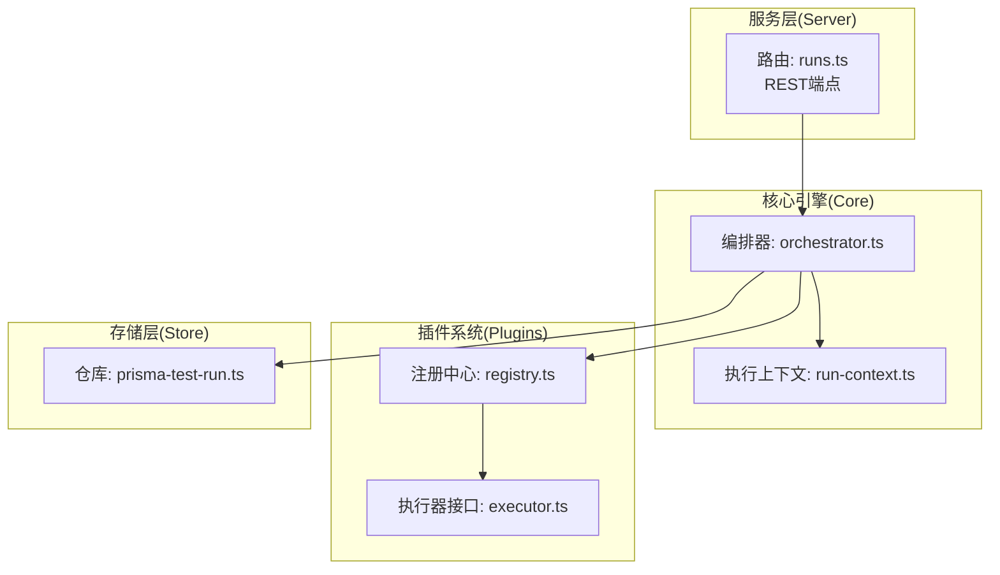
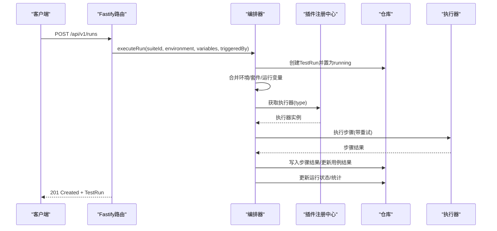
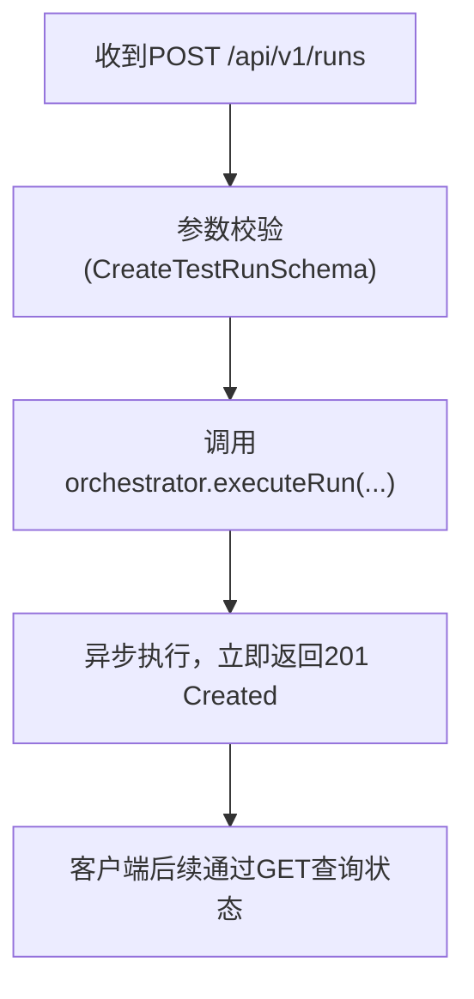
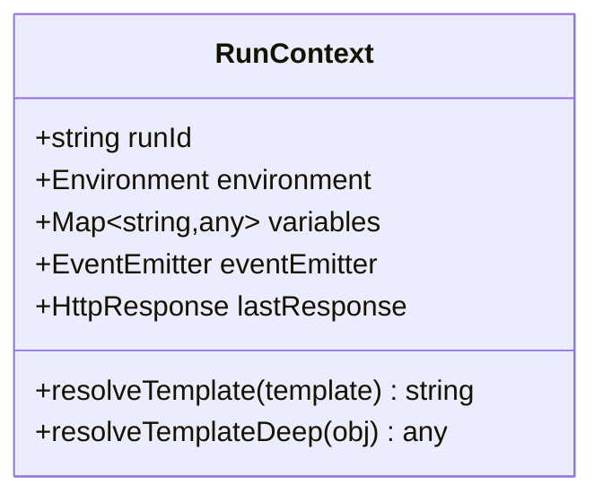
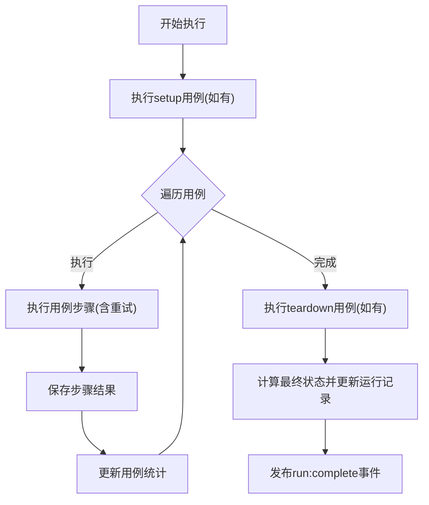
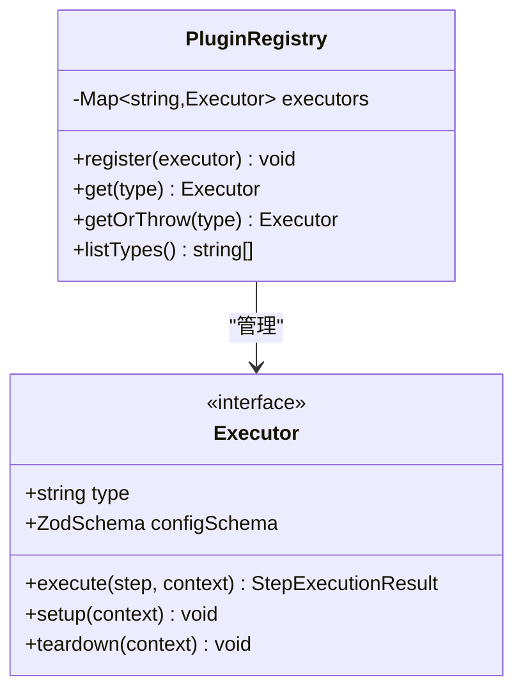
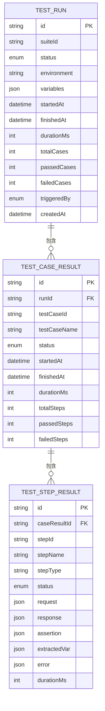
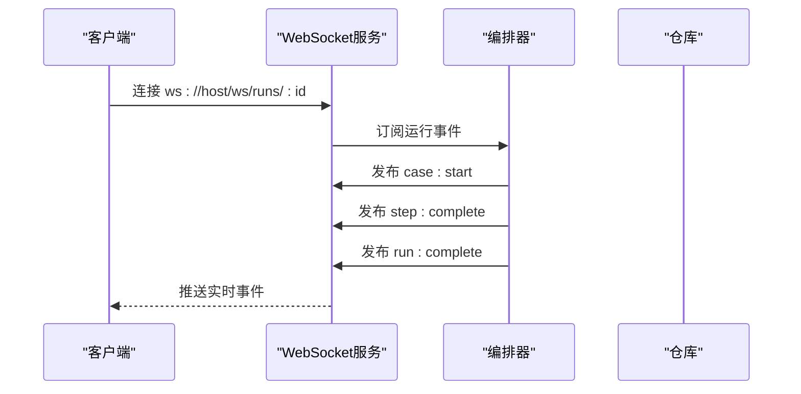
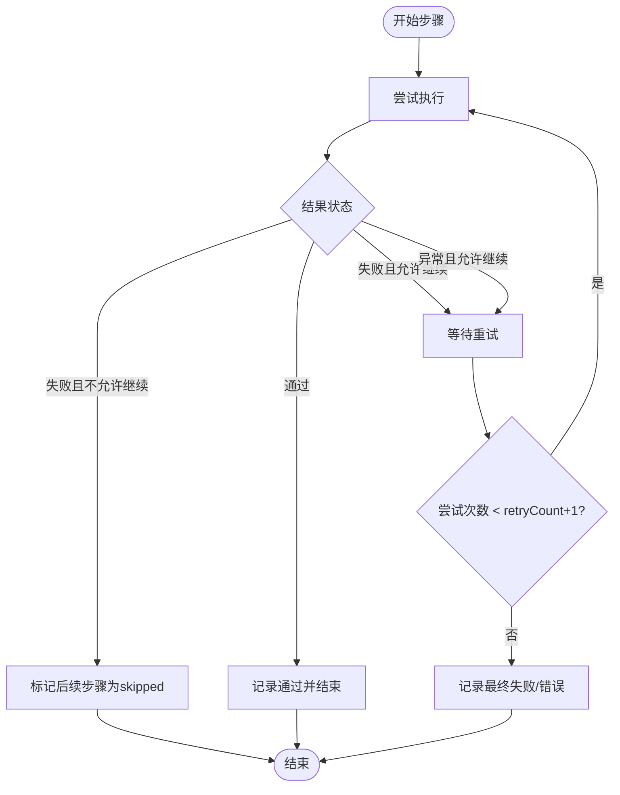
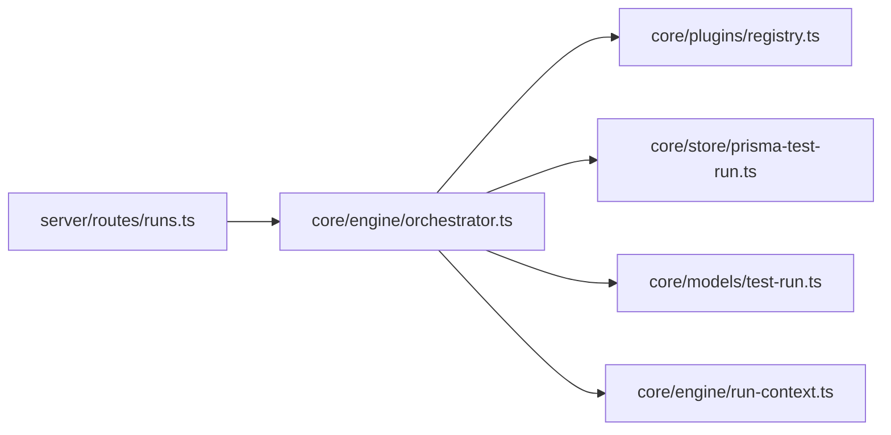

# 测试执行API

<cite>
**本文档引用的文件**
- [packages/server/src/routes/runs.ts](file://packages/server/src/routes/runs.ts)
- [packages/core/src/engine/orchestrator.ts](file://packages/core/src/engine/orchestrator.ts)
- [packages/core/src/engine/run-context.ts](file://packages/core/src/engine/run-context.ts)
- [packages/core/src/models/test-run.ts](file://packages/core/src/models/test-run.ts)
- [packages/core/src/plugins/executor.ts](file://packages/core/src/plugins/executor.ts)
- [packages/core/src/plugins/registry.ts](file://packages/core/src/plugins/registry.ts)
- [packages/core/src/store/prisma-test-run.ts](file://packages/core/src/store/prisma-test-run.ts)
- [packages/server/src/services/container.ts](file://packages/server/src/services/container.ts)
- [package.json](file://package.json)
- [docs/review-report/specs-review-2026-04-24.md](file://docs/review-report/specs-review-2026-04-24.md)
</cite>

## 目录
1. [简介](#简介)
2. [项目结构](#项目结构)
3. [核心组件](#核心组件)
4. [架构总览](#架构总览)
5. [详细组件分析](#详细组件分析)
6. [依赖分析](#依赖分析)
7. [性能考量](#性能考量)
8. [故障排查指南](#故障排查指南)
9. [结论](#结论)
10. [附录](#附录)

## 简介
本文件为测试执行API的权威技术文档，面向后端工程师与平台集成者，系统化阐述测试运行的启动、监控与控制端点，详尽说明实时状态推送、WebSocket连接管理与事件订阅机制，以及执行上下文、变量解析与结果收集流程。文档还涵盖执行历史、重试机制与失败处理策略，并提供执行进度查询、中断控制与结果导出的实现思路。最后解释执行器生命周期、插件集成与性能监控指标。

## 项目结构
测试执行API位于后端服务层，采用三层架构：
- 服务层（Server）：暴露REST路由，接收请求并委派给编排器
- 核心引擎（Core）：编排器负责执行流程、事件发布与状态更新
- 存储层（Store）：持久化测试运行、用例与步骤结果
- 插件层（Plugins）：执行器抽象与注册中心，支持扩展不同步骤类型

图表来源
- [packages/server/src/routes/runs.ts:1-45](file://packages/server/src/routes/runs.ts#L1-L45)
- [packages/core/src/engine/orchestrator.ts:1-296](file://packages/core/src/engine/orchestrator.ts#L1-L296)
- [packages/core/src/engine/run-context.ts:1-80](file://packages/core/src/engine/run-context.ts#L1-L80)
- [packages/core/src/plugins/executor.ts:1-23](file://packages/core/src/plugins/executor.ts#L1-L23)
- [packages/core/src/plugins/registry.ts:1-29](file://packages/core/src/plugins/registry.ts#L1-L29)
- [packages/core/src/store/prisma-test-run.ts:47-89](file://packages/core/src/store/prisma-test-run.ts#L47-L89)

章节来源
- [packages/server/src/routes/runs.ts:1-45](file://packages/server/src/routes/runs.ts#L1-L45)
- [packages/core/src/engine/orchestrator.ts:1-296](file://packages/core/src/engine/orchestrator.ts#L1-L296)
- [packages/core/src/engine/run-context.ts:1-80](file://packages/core/src/engine/run-context.ts#L1-L80)
- [packages/core/src/plugins/executor.ts:1-23](file://packages/core/src/plugins/executor.ts#L1-L23)
- [packages/core/src/plugins/registry.ts:1-29](file://packages/core/src/plugins/registry.ts#L1-L29)
- [packages/core/src/store/prisma-test-run.ts:47-89](file://packages/core/src/store/prisma-test-run.ts#L47-L89)

## 核心组件
- REST路由：提供运行创建、列表查询与详情查询端点
- 编排器：解析环境与变量、创建运行记录、驱动执行、事件发布与状态更新
- 执行上下文：模板变量解析、HTTP响应缓存与事件发射器
- 插件系统：执行器接口与注册中心，支持扩展步骤类型
- 存储层：持久化测试运行、用例与步骤结果，支持JSON字段序列化

章节来源
- [packages/server/src/routes/runs.ts:1-45](file://packages/server/src/routes/runs.ts#L1-L45)
- [packages/core/src/engine/orchestrator.ts:1-296](file://packages/core/src/engine/orchestrator.ts#L1-L296)
- [packages/core/src/engine/run-context.ts:1-80](file://packages/core/src/engine/run-context.ts#L1-L80)
- [packages/core/src/plugins/executor.ts:1-23](file://packages/core/src/plugins/executor.ts#L1-L23)
- [packages/core/src/plugins/registry.ts:1-29](file://packages/core/src/plugins/registry.ts#L1-L29)
- [packages/core/src/store/prisma-test-run.ts:47-89](file://packages/core/src/store/prisma-test-run.ts#L47-L89)

## 架构总览
测试执行API的端到端流程如下：

图表来源
- [packages/server/src/routes/runs.ts:7-18](file://packages/server/src/routes/runs.ts#L7-L18)
- [packages/core/src/engine/orchestrator.ts:25-140](file://packages/core/src/engine/orchestrator.ts#L25-L140)
- [packages/core/src/plugins/registry.ts:13-23](file://packages/core/src/plugins/registry.ts#L13-L23)
- [packages/core/src/store/prisma-test-run.ts:64-89](file://packages/core/src/store/prisma-test-run.ts#L64-L89)

## 详细组件分析

### REST端点与控制流
- POST /api/v1/runs：异步触发测试运行，立即返回201与新建的TestRun对象
- GET /api/v1/runs：分页查询测试运行，支持suiteId与status过滤
- GET /api/v1/runs/:id：获取测试运行详情，包含用例与步骤结果

图表来源
- [packages/server/src/routes/runs.ts:7-18](file://packages/server/src/routes/runs.ts#L7-L18)

章节来源
- [packages/server/src/routes/runs.ts:1-45](file://packages/server/src/routes/runs.ts#L1-L45)

### 执行上下文与变量解析
- 执行上下文封装运行期环境与变量，提供模板解析能力
- 支持深层路径访问（对象属性、数组索引），用于变量注入
- 维护最近一次HTTP响应，便于断言与提取

图表来源
- [packages/core/src/engine/run-context.ts:11-79](file://packages/core/src/engine/run-context.ts#L11-L79)

章节来源
- [packages/core/src/engine/run-context.ts:1-80](file://packages/core/src/engine/run-context.ts#L1-L80)

### 编排器：执行生命周期与事件
- 生命周期：创建运行 → 设置为running → setup用例 → 逐用例执行 → teardown用例 → 更新最终状态
- 事件发布：case:start/case:complete/run:complete，供实时推送与订阅
- 失败策略：遇到失败且continueOnFailure=false时，后续步骤被跳过

图表来源
- [packages/core/src/engine/orchestrator.ts:50-139](file://packages/core/src/engine/orchestrator.ts#L50-L139)

章节来源
- [packages/core/src/engine/orchestrator.ts:1-296](file://packages/core/src/engine/orchestrator.ts#L1-L296)

### 插件系统：执行器与注册中心
- 执行器接口定义类型、配置Schema与执行方法
- 注册中心负责注册、查找与列出可用执行器类型
- 支持扩展新的步骤类型（如http、assertion、extract、call、load-dataset）

图表来源
- [packages/core/src/plugins/executor.ts:15-22](file://packages/core/src/plugins/executor.ts#L15-L22)
- [packages/core/src/plugins/registry.ts:3-28](file://packages/core/src/plugins/registry.ts#L3-L28)

章节来源
- [packages/core/src/plugins/executor.ts:1-23](file://packages/core/src/plugins/executor.ts#L1-L23)
- [packages/core/src/plugins/registry.ts:1-29](file://packages/core/src/plugins/registry.ts#L1-L29)

### 数据模型与结果收集
- TestRun：包含运行状态、环境、变量、用例结果与统计
- TestCaseResult：包含步骤结果数组、开始/结束时间与统计
- TestStepResult：包含请求/响应、断言、变量提取、错误信息与耗时
- 存储层将复杂对象序列化为JSON字段，便于灵活扩展

图表来源
- [packages/core/src/models/test-run.ts:88-118](file://packages/core/src/models/test-run.ts#L88-L118)
- [packages/core/src/store/prisma-test-run.ts:47-89](file://packages/core/src/store/prisma-test-run.ts#L47-L89)

章节来源
- [packages/core/src/models/test-run.ts:1-118](file://packages/core/src/models/test-run.ts#L1-L118)
- [packages/core/src/store/prisma-test-run.ts:47-89](file://packages/core/src/store/prisma-test-run.ts#L47-L89)

### 实时状态推送与WebSocket机制
- 事件发布：编排器在关键节点发布事件（如case:start、case:complete、run:complete）
- WebSocket连接管理：建议在服务端建立ws路由，订阅指定运行ID的事件通道
- 事件订阅机制：客户端通过查询参数携带运行ID进行订阅，服务端按运行ID推送到对应连接
- 安全与限流：建议对接入的WebSocket连接进行认证、速率限制与连接数限制

图表来源
- [packages/core/src/engine/orchestrator.ts:83-129](file://packages/core/src/engine/orchestrator.ts#L83-L129)

章节来源
- [packages/core/src/engine/orchestrator.ts:83-129](file://packages/core/src/engine/orchestrator.ts#L83-L129)
- [docs/review-report/specs-review-2026-04-24.md:21-22](file://docs/review-report/specs-review-2026-04-24.md#L21-L22)

### 执行历史、重试机制与失败处理
- 执行历史：通过TestRun/TestCaseResult/TestStepResult模型记录完整历史
- 重试机制：每个步骤根据retryCount进行最多retryCount+1次尝试，失败时可继续或终止
- 失败处理：遇到错误或失败且continueOnFailure=false时，后续步骤跳过；最终汇总用例与运行状态

图表来源
- [packages/core/src/engine/orchestrator.ts:242-266](file://packages/core/src/engine/orchestrator.ts#L242-L266)

章节来源
- [packages/core/src/engine/orchestrator.ts:242-294](file://packages/core/src/engine/orchestrator.ts#L242-L294)

### 执行进度查询、中断控制与结果导出
- 进度查询：通过GET /api/v1/runs/:id获取实时状态与统计
- 中断控制：当前实现未提供运行中止端点，可在编排器中引入取消令牌与中断信号
- 结果导出：建议提供CSV/JSON导出端点，聚合TestRun/TestCaseResult/TestStepResult数据

章节来源
- [packages/server/src/routes/runs.ts:38-43](file://packages/server/src/routes/runs.ts#L38-L43)
- [packages/core/src/models/test-run.ts:88-118](file://packages/core/src/models/test-run.ts#L88-L118)

### 执行器生命周期与插件集成
- 生命周期：注册 → 初始化(setup) → 执行(execute) → 清理(teardown)
- 插件集成：通过注册中心集中管理执行器，按步骤类型动态分发
- 性能监控：执行器返回的durationMs可用于统计与告警

章节来源
- [packages/core/src/plugins/executor.ts:15-22](file://packages/core/src/plugins/executor.ts#L15-L22)
- [packages/core/src/plugins/registry.ts:6-11](file://packages/core/src/plugins/registry.ts#L6-L11)

## 依赖分析
- 服务层依赖核心引擎与容器注入的服务
- 核心引擎依赖插件注册中心与各类仓库
- 存储层依赖Prisma客户端，将复杂对象序列化为JSON

图表来源
- [packages/server/src/routes/runs.ts:1-45](file://packages/server/src/routes/runs.ts#L1-L45)
- [packages/core/src/engine/orchestrator.ts:1-23](file://packages/core/src/engine/orchestrator.ts#L1-L23)
- [packages/core/src/plugins/registry.ts:1-29](file://packages/core/src/plugins/registry.ts#L1-L29)
- [packages/core/src/store/prisma-test-run.ts:64-89](file://packages/core/src/store/prisma-test-run.ts#L64-L89)
- [packages/core/src/models/test-run.ts:88-118](file://packages/core/src/models/test-run.ts#L88-L118)
- [packages/core/src/engine/run-context.ts:1-80](file://packages/core/src/engine/run-context.ts#L1-L80)

章节来源
- [packages/server/src/routes/runs.ts:1-45](file://packages/server/src/routes/runs.ts#L1-L45)
- [packages/core/src/engine/orchestrator.ts:1-23](file://packages/core/src/engine/orchestrator.ts#L1-L23)
- [packages/core/src/plugins/registry.ts:1-29](file://packages/core/src/plugins/registry.ts#L1-L29)
- [packages/core/src/store/prisma-test-run.ts:64-89](file://packages/core/src/store/prisma-test-run.ts#L64-L89)
- [packages/core/src/models/test-run.ts:88-118](file://packages/core/src/models/test-run.ts#L88-L118)
- [packages/core/src/engine/run-context.ts:1-80](file://packages/core/src/engine/run-context.ts#L1-L80)

## 性能考量
- 异步执行：运行创建即返回，避免阻塞HTTP连接
- 事件驱动：通过事件发布减少轮询开销，提升实时性
- JSON序列化：复杂对象以JSON存储，便于扩展但需关注查询限制
- 并发与重试：建议在编排器层面引入并发控制与重试退避策略

## 故障排查指南
- 认证与授权：当前REST API未内置认证，建议接入API Key或JWT机制
- WebSocket安全：WebSocket连接需复用相同认证机制，防止未授权访问
- 存储策略：TestRun.caseResults采用JSON字段存储，需明确查询与分页策略
- 递归深度：编排器限制最大调用深度，避免无限递归导致栈溢出
- 并发控制：未定义并发执行时的变量竞争与上下文隔离策略

章节来源
- [docs/review-report/specs-review-2026-04-24.md:14-27](file://docs/review-report/specs-review-2026-04-24.md#L14-L27)

## 结论
测试执行API以编排器为核心，结合插件系统与事件机制，实现了可扩展、可观测的测试运行能力。通过REST端点与WebSocket推送，平台可实现高效的运行控制与实时反馈。建议尽快补齐认证授权与WebSocket安全机制，并完善并发控制与结果导出能力，以满足生产环境需求。

## 附录
- 项目根脚本与依赖：用于构建、开发与测试的统一入口
- 规范文档：评审报告明确了安全与并发方面的风险与改进建议

章节来源
- [package.json:6-12](file://package.json#L6-L12)
- [docs/review-report/specs-review-2026-04-24.md:1-175](file://docs/review-report/specs-review-2026-04-24.md#L1-L175)