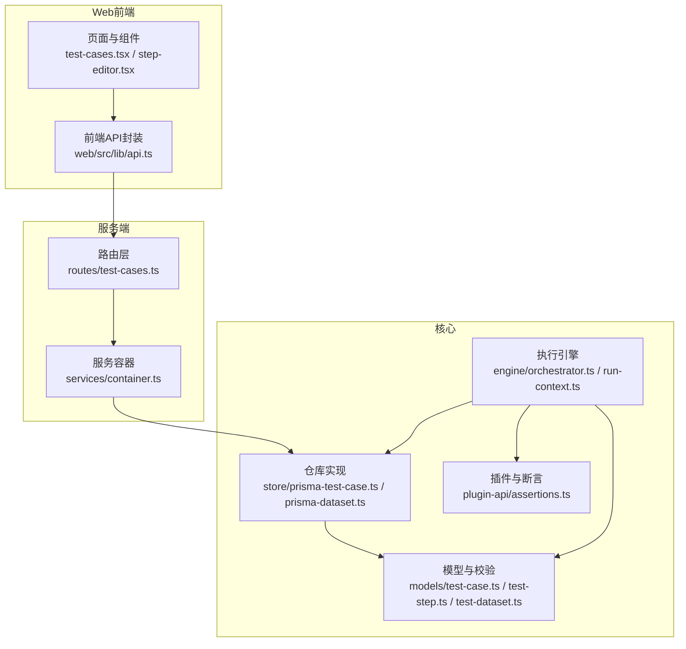
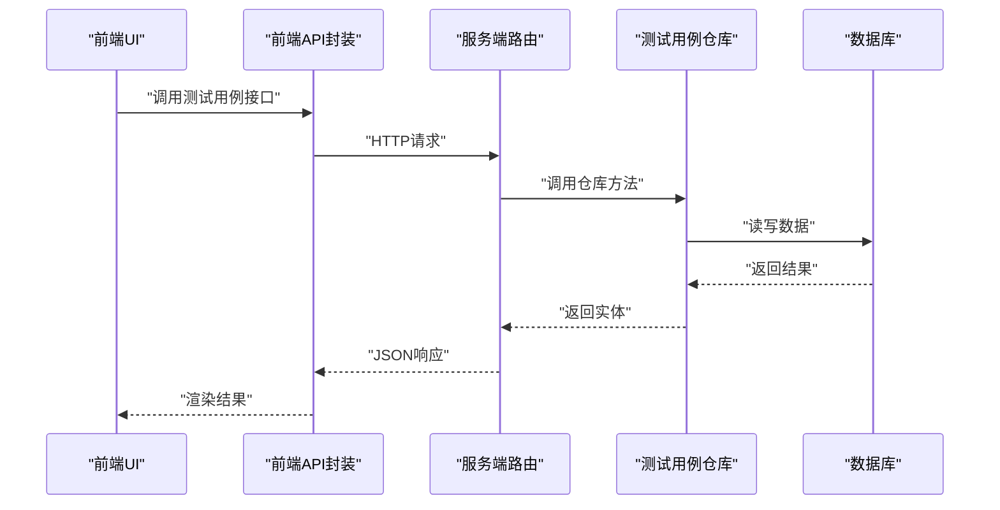
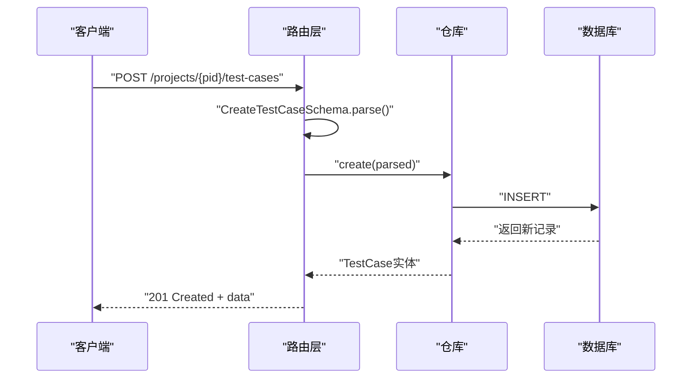
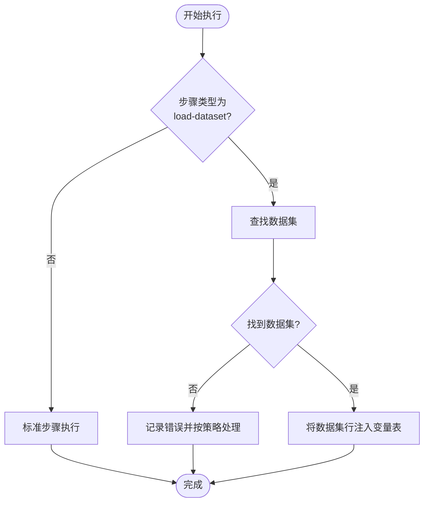
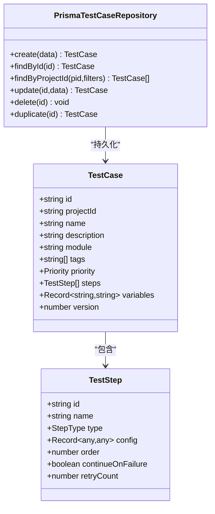

# 测试用例API

<cite>
**本文档引用的文件**
- [packages/server/src/routes/test-cases.ts](file://packages/server/src/routes/test-cases.ts)
- [packages/core/src/models/test-case.ts](file://packages/core/src/models/test-case.ts)
- [packages/core/src/store/prisma-test-case.ts](file://packages/core/src/store/prisma-test-case.ts)
- [packages/server/src/services/container.ts](file://packages/server/src/services/container.ts)
- [packages/web/src/lib/api.ts](file://packages/web/src/lib/api.ts)
- [packages/web/src/pages/test-cases.tsx](file://packages/web/src/pages/test-cases.tsx)
- [packages/web/src/components/step-editor.tsx](file://packages/web/src/components/step-editor.tsx)
- [packages/core/src/models/test-step.ts](file://packages/core/src/models/test-step.ts)
- [packages/core/src/engine/orchestrator.ts](file://packages/core/src/engine/orchestrator.ts)
- [packages/core/src/engine/run-context.ts](file://packages/core/src/engine/run-context.ts)
- [packages/plugin-api/src/assertions.ts](file://packages/plugin-api/src/assertions.ts)
- [packages/server/src/routes/datasets.ts](file://packages/server/src/routes/datasets.ts)
- [packages/core/src/models/test-dataset.ts](file://packages/core/src/models/test-dataset.ts)
- [packages/core/src/store/prisma-dataset.ts](file://packages/core/src/store/prisma-dataset.ts)
</cite>

## 目录
1. [简介](#简介)
2. [项目结构](#项目结构)
3. [核心组件](#核心组件)
4. [架构总览](#架构总览)
5. [详细组件分析](#详细组件分析)
6. [依赖关系分析](#依赖关系分析)
7. [性能考虑](#性能考虑)
8. [故障排除指南](#故障排除指南)
9. [结论](#结论)
10. [附录](#附录)

## 简介
本文件为测试用例API的详细技术文档，覆盖测试用例的完整生命周期管理（创建、查询、更新、删除、复制），测试步骤结构与配置校验、变量替换与条件断言逻辑、测试用例模板与批量操作、导入导出能力、数据验证规则、依赖关系管理与执行优先级设置，并提供测试用例编辑器API、步骤验证与自动补全功能说明，以及测试用例与数据集的关联与参数化测试支持。

## 项目结构
该系统采用多包工作区结构，测试用例API主要涉及以下模块：
- 服务端路由：定义REST接口，负责请求解析与响应返回
- 核心模型与仓库：定义数据模型、Zod校验、持久化仓库
- 执行引擎：编排步骤执行、变量解析、重试与失败处理
- Web前端：提供测试用例与步骤编辑器、数据集管理界面

**图表来源**
- [packages/server/src/routes/test-cases.ts:1-68](file://packages/server/src/routes/test-cases.ts#L1-L68)
- [packages/server/src/services/container.ts:17-42](file://packages/server/src/services/container.ts#L17-L42)
- [packages/core/src/models/test-case.ts:1-46](file://packages/core/src/models/test-case.ts#L1-L46)
- [packages/core/src/store/prisma-test-case.ts:23-148](file://packages/core/src/store/prisma-test-case.ts#L23-L148)
- [packages/core/src/engine/orchestrator.ts:205-266](file://packages/core/src/engine/orchestrator.ts#L205-L266)
- [packages/plugin-api/src/assertions.ts:42-64](file://packages/plugin-api/src/assertions.ts#L42-L64)

**章节来源**
- [packages/server/src/routes/test-cases.ts:1-68](file://packages/server/src/routes/test-cases.ts#L1-L68)
- [packages/server/src/services/container.ts:17-42](file://packages/server/src/services/container.ts#L17-L42)

## 核心组件
- 测试用例模型与校验：定义名称、模块、标签、优先级、步骤数组、变量映射等字段及长度与类型约束
- 测试步骤模型与校验：定义步骤类型（HTTP、断言、提取、调用、加载数据集）、各类型配置的字段与约束
- 数据集模型与校验：定义字段类型枚举、字段定义数组、行数据数组等
- 仓库实现：基于Prisma的持久化，支持创建、查询、更新、删除、复制测试用例；支持分页与多维过滤
- 执行引擎：按顺序执行步骤，支持重试、失败继续或中断、变量注入与模板替换、断言解析与错误收集
- 前端API与编辑器：提供列表、获取、创建、更新、删除、复制接口；步骤编辑器支持断言表达式提示、提取表达式提示与占位符

**章节来源**
- [packages/core/src/models/test-case.ts:7-41](file://packages/core/src/models/test-case.ts#L7-L41)
- [packages/core/src/models/test-step.ts:5-101](file://packages/core/src/models/test-step.ts#L5-L101)
- [packages/core/src/models/test-dataset.ts:18-42](file://packages/core/src/models/test-dataset.ts#L18-L42)
- [packages/core/src/store/prisma-test-case.ts:23-148](file://packages/core/src/store/prisma-test-case.ts#L23-L148)
- [packages/core/src/engine/orchestrator.ts:205-266](file://packages/core/src/engine/orchestrator.ts#L205-L266)
- [packages/web/src/lib/api.ts:149-165](file://packages/web/src/lib/api.ts#L149-L165)

## 架构总览
测试用例API的调用链路如下：
- Web前端通过API封装发起请求
- 服务端Fastify路由接收请求，使用Zod Schema进行入参校验
- 路由调用仓库方法完成数据库操作
- 执行引擎在运行时解析变量模板、执行步骤、处理断言与重试

**图表来源**
- [packages/web/src/lib/api.ts:149-165](file://packages/web/src/lib/api.ts#L149-L165)
- [packages/server/src/routes/test-cases.ts:7-67](file://packages/server/src/routes/test-cases.ts#L7-L67)
- [packages/core/src/store/prisma-test-case.ts:23-148](file://packages/core/src/store/prisma-test-case.ts#L23-L148)

## 详细组件分析

### 测试用例模型与验证规则
- 字段与约束
  - 名称：必填且长度限制
  - 模块：默认空字符串
  - 标签：字符串数组，默认空数组
  - 优先级：枚举值（critical/high/medium/low），默认中
  - 步骤：TestStep 数组，默认空数组
  - 变量：键值对映射，默认空对象
  - 版本：整数，最小为1，默认1
- 创建与更新Schema
  - 创建：包含项目ID、名称、描述、模块、标签、优先级、步骤、变量
  - 更新：各字段可选，支持部分更新
- 关键复杂度
  - 步骤数组的序列化/反序列化为JSON，更新时重新生成步骤ID并保持顺序

**章节来源**
- [packages/core/src/models/test-case.ts:7-41](file://packages/core/src/models/test-case.ts#L7-L41)
- [packages/core/src/store/prisma-test-case.ts:24-44](file://packages/core/src/store/prisma-test-case.ts#L24-L44)
- [packages/core/src/store/prisma-test-case.ts:101-126](file://packages/core/src/store/prisma-test-case.ts#L101-L126)

### 测试步骤结构与配置校验
- 步骤类型
  - http、assertion、extract、call、load-dataset
- 配置校验
  - HTTP：方法枚举、URL必填、内容类型默认、超时默认
  - 断言：源（状态/头/body/jsonpath/变量）、运算符枚举、期望值可选
  - 提取：源（body/jsonpath/header/status/regex）、表达式必填、变量名必填
  - 调用：被调用测试用例ID
  - 加载数据集：数据集ID、变量名
- 复杂度与性能
  - 使用Zod联合Schema按类型分发校验，避免运行时类型判断开销

**章节来源**
- [packages/core/src/models/test-step.ts:5-101](file://packages/core/src/models/test-step.ts#L5-L101)

### 变量替换与模板解析
- 运行上下文
  - 支持模板字符串中的变量占位符解析，递归深度解析对象/数组
  - 支持路径访问（如 a.b[0].c）
- 执行引擎集成
  - 在执行前对请求体、URL、头等进行模板替换
  - 将环境变量预注入到变量表

**章节来源**
- [packages/core/src/engine/run-context.ts:35-79](file://packages/core/src/engine/run-context.ts#L35-L79)

### 条件断言与表达式解析
- 断言源与表达式
  - 状态码、响应头、响应体、JSONPath、变量
- 表达式解析
  - JSONPath用于从响应体提取值
  - 变量名直接从变量表取值
- 错误处理
  - 缺少表达式时报错，未知源时报错

**章节来源**
- [packages/plugin-api/src/assertions.ts:42-64](file://packages/plugin-api/src/assertions.ts#L42-L64)

### 执行优先级与重试控制
- 顺序执行
  - 按步骤order字段升序执行
- 继续/中断策略
  - 支持continueOnFailure，失败是否继续
- 重试机制
  - retryCount决定最大尝试次数，每次尝试后根据结果决定是否重试

**章节来源**
- [packages/core/src/models/test-step.ts:74-82](file://packages/core/src/models/test-step.ts#L74-L82)
- [packages/core/src/engine/orchestrator.ts:242-266](file://packages/core/src/engine/orchestrator.ts#L242-L266)

### 测试用例生命周期API
- 接口定义
  - 创建：POST /api/v1/projects/:projectId/test-cases
  - 列表：GET /api/v1/projects/:projectId/test-cases（支持模块、标签、优先级、关键词搜索、分页）
  - 获取：GET /api/v1/test-cases/:id
  - 更新：PUT /api/v1/test-cases/:id
  - 删除：DELETE /api/v1/test-cases/:id
  - 复制：POST /api/v1/test-cases/:id/duplicate
- 请求/响应
  - 入参使用Zod Schema解析与校验
  - 返回标准结构，列表包含分页元信息

**图表来源**
- [packages/server/src/routes/test-cases.ts:7-17](file://packages/server/src/routes/test-cases.ts#L7-L17)
- [packages/core/src/models/test-case.ts:22-31](file://packages/core/src/models/test-case.ts#L22-L31)
- [packages/core/src/store/prisma-test-case.ts:24-44](file://packages/core/src/store/prisma-test-case.ts#L24-L44)

**章节来源**
- [packages/server/src/routes/test-cases.ts:7-67](file://packages/server/src/routes/test-cases.ts#L7-L67)
- [packages/web/src/lib/api.ts:149-165](file://packages/web/src/lib/api.ts#L149-L165)

### 测试用例编辑器API与自动补全
- 前端页面
  - 列表加载、删除确认、复制操作
  - 对话框内保存时将步骤按顺序重排并提交
- 步骤编辑器
  - 断言表达式提示（JSONPath、Header、变量）
  - 提取表达式提示与占位符（JSONPath、Header、正则）
  - 类型切换时初始化默认配置
- 自动补全与提示
  - 根据源类型动态显示表达式输入框与提示文本
  - 加载数据集时懒加载可用数据集列表

**章节来源**
- [packages/web/src/pages/test-cases.tsx:44-188](file://packages/web/src/pages/test-cases.tsx#L44-L188)
- [packages/web/src/components/step-editor.tsx:67-95](file://packages/web/src/components/step-editor.tsx#L67-L95)
- [packages/web/src/components/step-editor.tsx:226-279](file://packages/web/src/components/step-editor.tsx#L226-L279)

### 测试用例与数据集的关联与参数化
- 关联方式
  - load-dataset步骤：指定数据集ID与变量名，执行时将数据集行数组注入变量表
- 参数化测试
  - 变量表支持模板解析，可在后续步骤中引用
  - 数据集字段类型枚举支持多种类型，便于参数化构造
- 执行流程
  - 加载数据集步骤成功后返回行数统计作为提取变量值
  - 若未找到数据集或执行异常，按continueOnFailure策略决定是否中断

**图表来源**
- [packages/core/src/engine/orchestrator.ts:205-237](file://packages/core/src/engine/orchestrator.ts#L205-L237)
- [packages/core/src/models/test-step.ts:57-60](file://packages/core/src/models/test-step.ts#L57-L60)

**章节来源**
- [packages/core/src/engine/orchestrator.ts:205-237](file://packages/core/src/engine/orchestrator.ts#L205-L237)
- [packages/core/src/models/test-dataset.ts:18-42](file://packages/core/src/models/test-dataset.ts#L18-L42)
- [packages/core/src/store/prisma-dataset.ts:23-49](file://packages/core/src/store/prisma-dataset.ts#L23-L49)

### 数据验证规则与过滤
- 测试用例
  - 支持模块前缀匹配、优先级精确匹配、关键词模糊匹配（名称/描述）
  - 标签过滤：在内存中按交集过滤（SQLite不支持JSON数组原生查询）
- 数据集
  - 字段类型枚举校验，字段与行数据结构校验
- 步骤
  - 各类型配置字段严格校验，确保运行期安全

**章节来源**
- [packages/core/src/store/prisma-test-case.ts:52-99](file://packages/core/src/store/prisma-test-case.ts#L52-L99)
- [packages/core/src/models/test-dataset.ts:13-42](file://packages/core/src/models/test-dataset.ts#L13-L42)
- [packages/core/src/models/test-step.ts:12-51](file://packages/core/src/models/test-step.ts#L12-L51)

### 导入导出与批量操作
- 当前实现
  - 测试用例：提供复制接口（POST /test-cases/:id/duplicate）
  - 数据集：提供创建/更新/删除接口，前端提供JSON导入对话框
- 扩展建议
  - 批量删除：基于ID集合的删除接口
  - 导出：按项目导出测试用例JSON（含步骤与变量）
  - 导入：支持OpenAPI/Postman等格式导入为测试用例模板

**章节来源**
- [packages/server/src/routes/test-cases.ts:60-67](file://packages/server/src/routes/test-cases.ts#L60-L67)
- [packages/web/src/pages/datasets.tsx:154-174](file://packages/web/src/pages/datasets.tsx#L154-L174)

## 依赖关系分析

**图表来源**
- [packages/core/src/models/test-case.ts:7-20](file://packages/core/src/models/test-case.ts#L7-L20)
- [packages/core/src/models/test-step.ts:74-82](file://packages/core/src/models/test-step.ts#L74-L82)
- [packages/core/src/store/prisma-test-case.ts:23-148](file://packages/core/src/store/prisma-test-case.ts#L23-L148)

**章节来源**
- [packages/core/src/models/test-case.ts:7-20](file://packages/core/src/models/test-case.ts#L7-L20)
- [packages/core/src/models/test-step.ts:74-82](file://packages/core/src/models/test-step.ts#L74-L82)
- [packages/core/src/store/prisma-test-case.ts:23-148](file://packages/core/src/store/prisma-test-case.ts#L23-L148)

## 性能考虑
- 查询优化
  - 列表查询支持分页与多维过滤，标签过滤在应用侧进行，建议在数据量大时增加索引或改用更强大的数据库
- 序列化成本
  - 步骤与变量以JSON存储，频繁序列化/反序列化可能成为瓶颈，建议在热点路径减少重复转换
- 执行效率
  - JSONPath在大响应体上可能较慢，建议在断言中尽量缩小目标范围或使用更精确的表达式
- 并发与事务
  - 更新时版本号自增，避免并发覆盖；建议在高并发场景下引入乐观锁或队列化更新

## 故障排除指南
- 常见错误与定位
  - 测试用例不存在：查询返回404，检查ID或权限
  - 断言缺少表达式：当源为header/jsonpath/variable时必须提供表达式
  - 加载数据集失败：数据集ID无效或不存在
- 日志与可观测性
  - 执行引擎在每步开始与完成时触发事件，可用于追踪执行轨迹
  - 异常包含消息与堆栈，便于定位问题

**章节来源**
- [packages/server/src/routes/test-cases.ts:40-44](file://packages/server/src/routes/test-cases.ts#L40-L44)
- [packages/plugin-api/src/assertions.ts:49-60](file://packages/plugin-api/src/assertions.ts#L49-L60)
- [packages/core/src/engine/orchestrator.ts:210-235](file://packages/core/src/engine/orchestrator.ts#L210-L235)

## 结论
测试用例API围绕Zod模型与Prisma仓库构建，具备完善的生命周期管理、步骤配置校验、变量模板解析与断言表达式解析能力。执行引擎提供了重试与失败继续策略，编辑器提供了良好的用户体验与自动补全。建议在未来增强批量操作、导入导出与索引优化，以进一步提升可扩展性与性能。

## 附录

### API定义概览
- 创建测试用例
  - 方法：POST
  - 路径：/api/v1/projects/{projectId}/test-cases
  - 请求体：CreateTestCaseSchema
  - 响应：201 Created + data
- 列出测试用例
  - 方法：GET
  - 路径：/api/v1/projects/{projectId}/test-cases
  - 查询参数：module、tags、priority、search、page、pageSize
  - 响应：data、meta(total、page、pageSize)
- 获取测试用例
  - 方法：GET
  - 路径：/api/v1/test-cases/{id}
  - 响应：200 OK + data 或 404
- 更新测试用例
  - 方法：PUT
  - 路径：/api/v1/test-cases/{id}
  - 请求体：UpdateTestCaseSchema
  - 响应：200 OK + data
- 删除测试用例
  - 方法：DELETE
  - 路径：/api/v1/test-cases/{id}
  - 响应：204 No Content
- 复制测试用例
  - 方法：POST
  - 路径：/api/v1/test-cases/{id}/duplicate
  - 响应：201 Created + data

**章节来源**
- [packages/server/src/routes/test-cases.ts:7-67](file://packages/server/src/routes/test-cases.ts#L7-L67)
- [packages/web/src/lib/api.ts:149-165](file://packages/web/src/lib/api.ts#L149-L165)