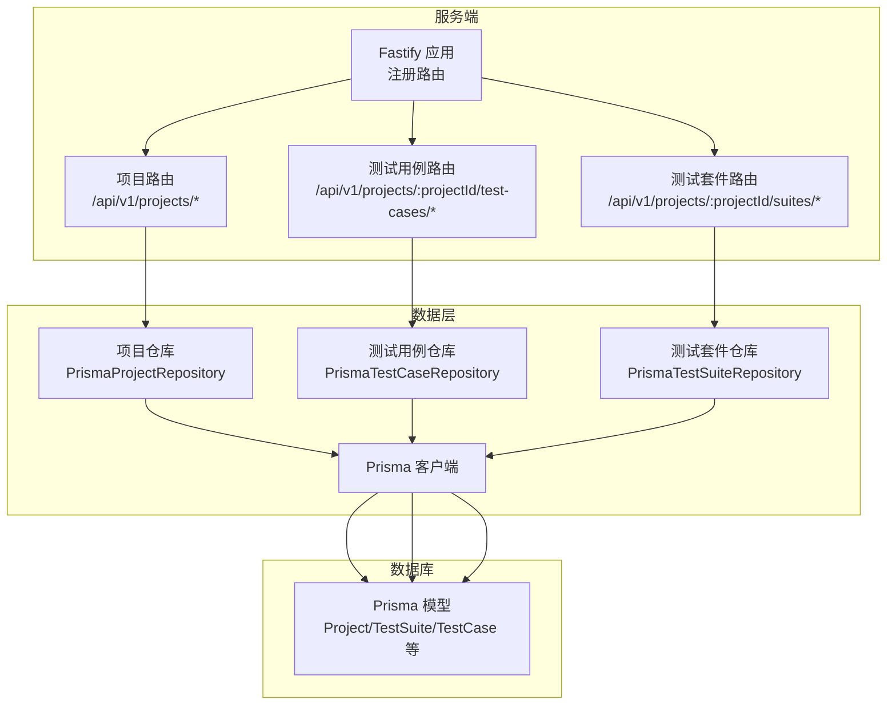
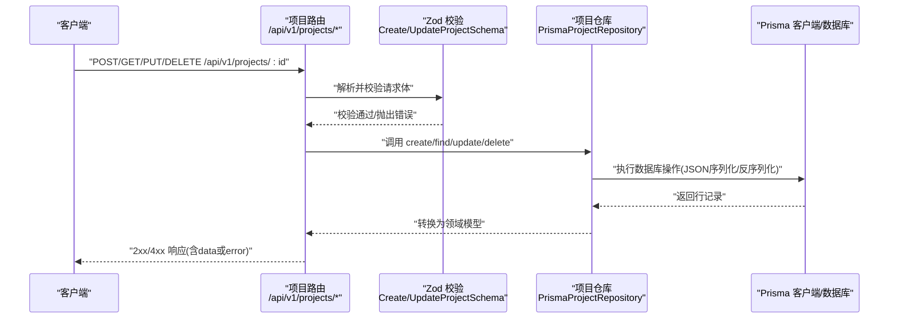
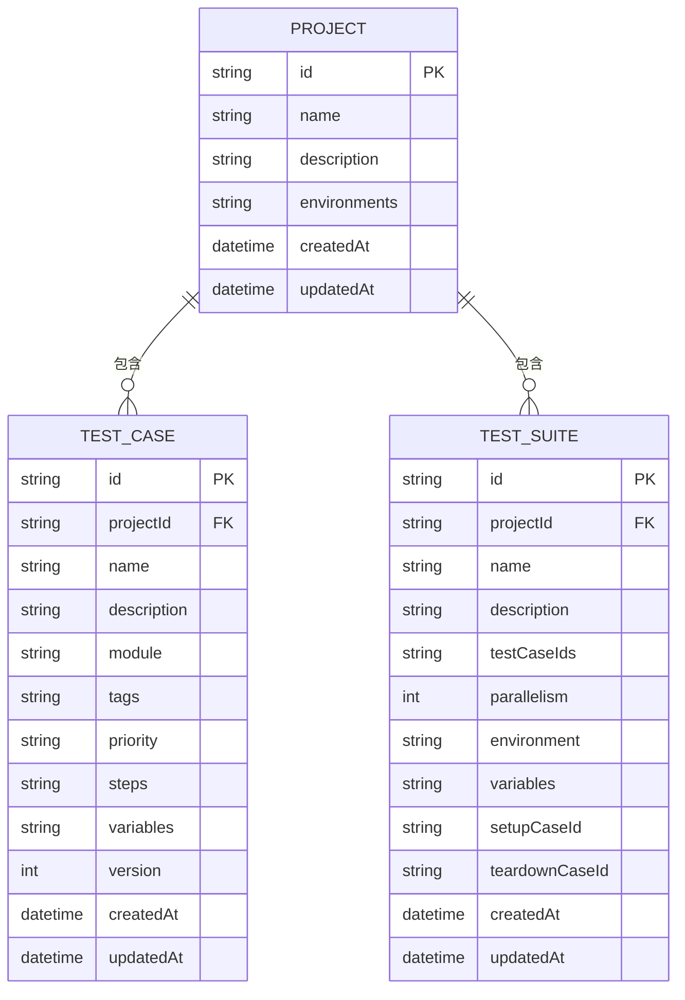
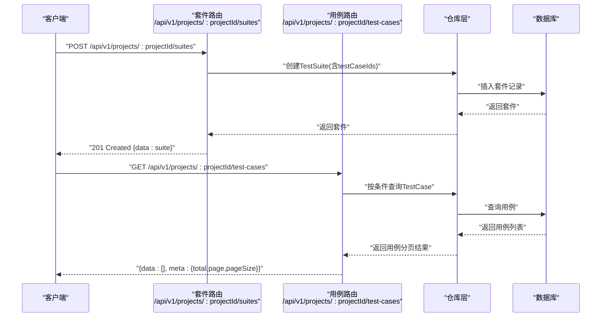
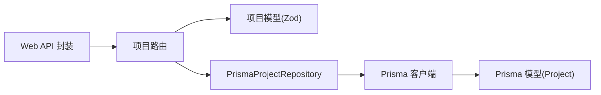

# 项目管理API

<cite>
**本文档引用的文件**
- [packages/server/src/routes/projects.ts](file://packages/server/src/routes/projects.ts)
- [packages/core/src/models/project.ts](file://packages/core/src/models/project.ts)
- [packages/core/src/store/prisma-project.ts](file://packages/core/src/store/prisma-project.ts)
- [prisma/schema.prisma](file://prisma/schema.prisma)
- [packages/server/src/routes/test-cases.ts](file://packages/server/src/routes/test-cases.ts)
- [packages/server/src/routes/suites.ts](file://packages/server/src/routes/suites.ts)
- [packages/core/src/models/test-case.ts](file://packages/core/src/models/test-case.ts)
- [packages/core/src/models/test-suite.ts](file://packages/core/src/models/test-suite.ts)
- [packages/shared/src/errors.ts](file://packages/shared/src/errors.ts)
- [packages/web/src/lib/api.ts](file://packages/web/src/lib/api.ts)
- [packages/server/src/app.ts](file://packages/server/src/app.ts)
</cite>

## 目录
1. [简介](#简介)
2. [项目结构](#项目结构)
3. [核心组件](#核心组件)
4. [架构总览](#架构总览)
5. [详细组件分析](#详细组件分析)
6. [依赖关系分析](#依赖关系分析)
7. [性能考虑](#性能考虑)
8. [故障排除指南](#故障排除指南)
9. [结论](#结论)
10. [附录](#附录)

## 简介
本文件为“项目管理API”的完整技术文档，覆盖项目CRUD（创建、读取、更新、删除）端点、项目配置字段、环境变量管理、多项目支持、权限与验证规则、错误处理、批量操作与导入导出能力，以及项目与测试用例、测试套件之间的关系与数据一致性保障。文档同时提供API调用示例路径与最佳实践建议。

## 项目结构
后端采用Fastify框架，通过路由模块化组织API；数据层使用Prisma ORM，模型定义在schema.prisma中；前端通过统一的API封装进行调用。项目管理API位于服务端路由模块中，并由Prisma仓库实现持久化。

图表来源
- [packages/server/src/app.ts:52-62](file://packages/server/src/app.ts#L52-L62)
- [packages/server/src/routes/projects.ts:6-39](file://packages/server/src/routes/projects.ts#L6-L39)
- [packages/server/src/routes/test-cases.ts:5-68](file://packages/server/src/routes/test-cases.ts#L5-L68)
- [packages/server/src/routes/suites.ts:5-48](file://packages/server/src/routes/suites.ts#L5-L48)
- [prisma/schema.prisma:10-64](file://prisma/schema.prisma#L10-L64)

章节来源
- [packages/server/src/app.ts:52-62](file://packages/server/src/app.ts#L52-L62)
- [packages/server/src/routes/projects.ts:6-39](file://packages/server/src/routes/projects.ts#L6-L39)
- [prisma/schema.prisma:10-64](file://prisma/schema.prisma#L10-L64)

## 核心组件
- 项目模型与校验：定义项目名称、描述、环境数组等字段及长度限制，使用Zod进行输入校验。
- 项目仓库：基于Prisma实现项目数据的增删改查，负责JSON序列化/反序列化environments字段。
- 项目路由：暴露REST端点，对请求体进行Zod解析，返回标准响应结构或错误对象。
- 错误体系：统一的AppError基类、NotFound与ValidationError子类，便于前端一致处理。
- 前端API封装：提供项目、测试用例、测试套件等API方法，便于Web应用调用。

章节来源
- [packages/core/src/models/project.ts:3-24](file://packages/core/src/models/project.ts#L3-L24)
- [packages/core/src/store/prisma-project.ts:17-57](file://packages/core/src/store/prisma-project.ts#L17-L57)
- [packages/server/src/routes/projects.ts:8-38](file://packages/server/src/routes/projects.ts#L8-L38)
- [packages/shared/src/errors.ts:1-25](file://packages/shared/src/errors.ts#L1-L25)
- [packages/web/src/lib/api.ts:149-165](file://packages/web/src/lib/api.ts#L149-L165)

## 架构总览
下图展示项目管理API从HTTP请求到数据库的完整流程，包括路由、校验、仓库与数据库交互。

图表来源
- [packages/server/src/routes/projects.ts:8-38](file://packages/server/src/routes/projects.ts#L8-L38)
- [packages/core/src/models/project.ts:18-24](file://packages/core/src/models/project.ts#L18-L24)
- [packages/core/src/store/prisma-project.ts:18-56](file://packages/core/src/store/prisma-project.ts#L18-L56)
- [prisma/schema.prisma:10-24](file://prisma/schema.prisma#L10-L24)

## 详细组件分析

### 项目CRUD端点规范
- 创建项目
  - 方法与路径：POST /api/v1/projects
  - 请求体字段：name（必填，1-100字符）、description（可选）、environments（可选，数组）
  - 成功响应：201 Created，返回{ data: Project }
  - 失败响应：400 Validation Error（如字段不合法）

- 获取项目列表
  - 方法与路径：GET /api/v1/projects
  - 成功响应：200 OK，返回{ data: Project[] }

- 获取单个项目
  - 方法与路径：GET /api/v1/projects/:id
  - 成功响应：200 OK，返回{ data: Project }
  - 失败响应：404 Not Found（项目不存在）

- 更新项目
  - 方法与路径：PUT /api/v1/projects/:id
  - 请求体字段：name、description、environments（均为可选，部分更新）
  - 成功响应：200 OK，返回{ data: Project }
  - 失败响应：400 Validation Error 或 404 Not Found

- 删除项目
  - 方法与路径：DELETE /api/v1/projects/:id
  - 成功响应：204 No Content
  - 失败响应：404 Not Found

请求参数与响应格式
- 请求体使用Zod模式进行严格校验，确保name长度、environments结构等约束。
- 响应统一包装为{ data: ... }或{ error: { code, message } }。
- environments字段以JSON数组形式存储于数据库，仓库负责序列化/反序列化。

状态码
- 200：成功获取或更新
- 201：成功创建
- 204：删除成功（无内容）
- 400：请求体校验失败
- 404：资源未找到

章节来源
- [packages/server/src/routes/projects.ts:8-38](file://packages/server/src/routes/projects.ts#L8-L38)
- [packages/core/src/models/project.ts:18-24](file://packages/core/src/models/project.ts#L18-L24)

### 项目配置字段与环境变量管理
- 字段定义
  - id：字符串，唯一标识
  - name：字符串，1-100字符，必填
  - description：字符串，可选
  - environments：数组，每项包含name、baseUrl（URL格式）、variables（键值对）
  - createdAt/updatedAt：时间戳

- 环境变量管理
  - environments数组用于为不同环境（开发/测试/生产）配置baseUrl与变量集
  - variables为键值对，可在运行时注入到测试用例或套件中

- 数据存储
  - environments以JSON字符串存储于数据库，仓库在读写时进行序列化/反序列化

章节来源
- [packages/core/src/models/project.ts:3-16](file://packages/core/src/models/project.ts#L3-L16)
- [packages/core/src/store/prisma-project.ts:6-14](file://packages/core/src/store/prisma-project.ts#L6-L14)
- [prisma/schema.prisma:10-24](file://prisma/schema.prisma#L10-L24)

### 多项目支持与数据一致性
- 多项目支持
  - 项目作为根实体，测试用例与测试套件均通过projectId关联
  - 删除项目会级联删除其下的测试用例、测试套件、数据集、API端点等

- 关系与一致性
  - 测试套件包含testCaseIds数组（JSON存储），用于维护用例集合
  - 运行结果与步骤结果通过外键级联删除，避免悬挂数据

图表来源
- [prisma/schema.prisma:10-64](file://prisma/schema.prisma#L10-L64)

章节来源
- [prisma/schema.prisma:10-64](file://prisma/schema.prisma#L10-L64)
- [packages/core/src/store/prisma-project.ts:30-37](file://packages/core/src/store/prisma-project.ts#L30-L37)

### 权限控制、数据验证与错误处理
- 权限控制
  - 当前路由未显式实现鉴权逻辑，建议在路由层或中间件中加入鉴权与项目访问控制
  - 可结合用户上下文与项目归属进行授权校验

- 数据验证
  - 使用Zod模式对请求体进行强类型校验，确保字段完整性与格式正确性
  - 项目与测试相关模型均定义了严格的Create/Update模式

- 错误处理
  - 统一的AppError基类，派生出NotFoundError与ValidationError
  - 路由层捕获校验错误并返回标准化错误响应

章节来源
- [packages/shared/src/errors.ts:1-25](file://packages/shared/src/errors.ts#L1-L25)
- [packages/core/src/models/project.ts:18-24](file://packages/core/src/models/project.ts#L18-L24)
- [packages/server/src/routes/projects.ts:8-38](file://packages/server/src/routes/projects.ts#L8-L38)

### 批量操作与导入导出
- 批量导入API端点（知识库）
  - 支持从OpenAPI、curl文本、纯文本解析并批量创建API端点
  - Web端提供对话框触发导入，成功后返回生成的端点列表数量

- 项目内批量操作建议
  - 可扩展项目维度的批量导入/导出接口（例如：批量创建测试用例、批量生成套件）
  - 导入时建议先进行预检校验，失败时返回具体错误信息

章节来源
- [packages/web/src/lib/api.ts:252-275](file://packages/web/src/lib/api.ts#L252-L275)
- [packages/server/src/routes/ai-endpoints.ts:75-84](file://packages/server/src/routes/ai-endpoints.ts#L75-L84)

### 项目与测试用例、套件的关系
- 项目是根实体，测试用例与测试套件均通过projectId关联
- 测试套件内部维护testCaseIds数组，用于表达“套件包含哪些用例”
- 运行时根据套件配置（environment、variables、parallelism）执行用例集合

图表来源
- [packages/server/src/routes/suites.ts:7-26](file://packages/server/src/routes/suites.ts#L7-L26)
- [packages/server/src/routes/test-cases.ts:19-37](file://packages/server/src/routes/test-cases.ts#L19-L37)
- [prisma/schema.prisma:46-64](file://prisma/schema.prisma#L46-L64)

章节来源
- [packages/server/src/routes/suites.ts:7-26](file://packages/server/src/routes/suites.ts#L7-L26)
- [packages/server/src/routes/test-cases.ts:19-37](file://packages/server/src/routes/test-cases.ts#L19-L37)
- [prisma/schema.prisma:46-64](file://prisma/schema.prisma#L46-L64)

## 依赖关系分析
- 路由依赖模型校验：路由在处理请求前使用Zod模式解析请求体
- 仓库依赖Prisma客户端：统一通过getPrisma()访问数据库
- 前端API封装依赖后端路由：Web应用通过统一的API函数调用后端接口

图表来源
- [packages/server/src/routes/projects.ts:3-4](file://packages/server/src/routes/projects.ts#L3-L4)
- [packages/core/src/models/project.ts:18-24](file://packages/core/src/models/project.ts#L18-L24)
- [packages/core/src/store/prisma-project.ts](file://packages/core/src/store/prisma-project.ts#L4)
- [packages/web/src/lib/api.ts:149-165](file://packages/web/src/lib/api.ts#L149-L165)

章节来源
- [packages/server/src/routes/projects.ts:3-4](file://packages/server/src/routes/projects.ts#L3-L4)
- [packages/core/src/models/project.ts:18-24](file://packages/core/src/models/project.ts#L18-L24)
- [packages/core/src/store/prisma-project.ts](file://packages/core/src/store/prisma-project.ts#L4)
- [packages/web/src/lib/api.ts:149-165](file://packages/web/src/lib/api.ts#L149-L165)

## 性能考虑
- 查询优化：项目列表按创建时间倒序，适合新项目优先展示；建议在高频查询场景增加索引或分页参数
- JSON字段处理：environments、tags、steps、variables等以JSON存储，注意避免过度嵌套与冗余字段
- 批量导入：建议在服务端进行并发控制与事务包裹，确保导入过程的一致性与原子性
- 缓存策略：对只读列表与详情可引入缓存，降低数据库压力

## 故障排除指南
常见问题与排查要点
- 400 Validation Error
  - 检查请求体是否符合Zod模式（如name长度、environments结构）
  - 确认JSON字段格式正确（如environments、tags、steps、variables）

- 404 Not Found
  - 确认项目ID是否存在；删除项目后其下资源也会被级联删除

- 导入失败
  - 检查导入内容格式（OpenAPI、curl、文本）是否符合预期
  - 查看服务端返回的错误信息，定位具体字段或格式问题

章节来源
- [packages/shared/src/errors.ts:13-24](file://packages/shared/src/errors.ts#L13-L24)
- [packages/server/src/routes/projects.ts:21-24](file://packages/server/src/routes/projects.ts#L21-L24)
- [packages/server/src/routes/ai-endpoints.ts:75-84](file://packages/server/src/routes/ai-endpoints.ts#L75-L84)

## 结论
项目管理API提供了清晰的CRUD接口与严格的输入校验，配合Prisma实现的多项目与多实体关系管理，能够满足测试工程中的项目配置、环境变量与批量导入需求。建议在现有基础上补充鉴权与项目访问控制、完善批量导出与更细粒度的权限控制，并持续优化查询与导入性能。

## 附录

### API调用示例（示例路径）
- 创建项目
  - POST /api/v1/projects
  - 请求体参考：[packages/core/src/models/project.ts:18-22](file://packages/core/src/models/project.ts#L18-L22)
  - 成功响应：[packages/server/src/routes/projects.ts](file://packages/server/src/routes/projects.ts#L11)

- 获取项目列表
  - GET /api/v1/projects
  - 成功响应：[packages/server/src/routes/projects.ts](file://packages/server/src/routes/projects.ts#L17)

- 获取单个项目
  - GET /api/v1/projects/:id
  - 成功/失败响应：[packages/server/src/routes/projects.ts:21-25](file://packages/server/src/routes/projects.ts#L21-L25)

- 更新项目
  - PUT /api/v1/projects/:id
  - 请求体参考：[packages/core/src/models/project.ts](file://packages/core/src/models/project.ts#L24)
  - 成功响应：[packages/server/src/routes/projects.ts](file://packages/server/src/routes/projects.ts#L31)

- 删除项目
  - DELETE /api/v1/projects/:id
  - 成功响应：[packages/server/src/routes/projects.ts](file://packages/server/src/routes/projects.ts#L37)

- 项目内测试用例与套件
  - 用例列表/创建/更新/删除：[packages/server/src/routes/test-cases.ts:6-68](file://packages/server/src/routes/test-cases.ts#L6-L68)
  - 套件列表/创建/更新/删除：[packages/server/src/routes/suites.ts:6-48](file://packages/server/src/routes/suites.ts#L6-L48)

- 前端调用封装
  - 项目/用例/套件API方法：[packages/web/src/lib/api.ts:149-165](file://packages/web/src/lib/api.ts#L149-L165)