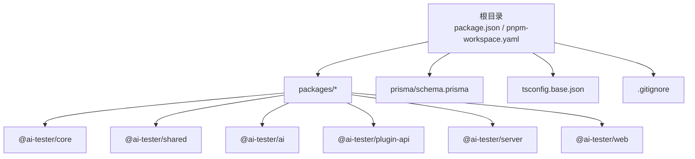
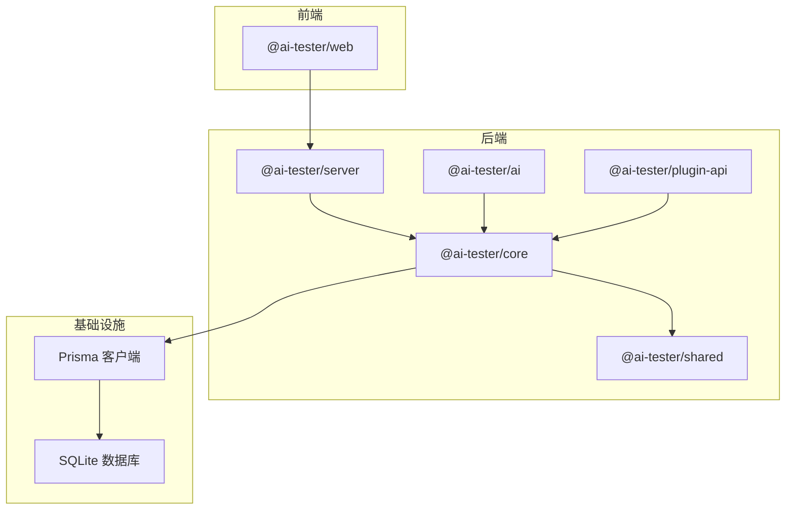
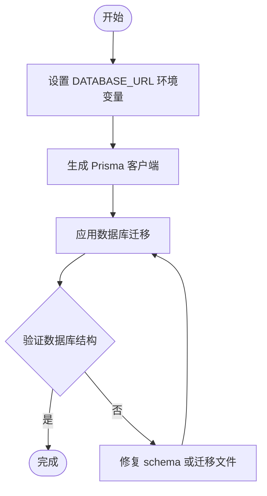
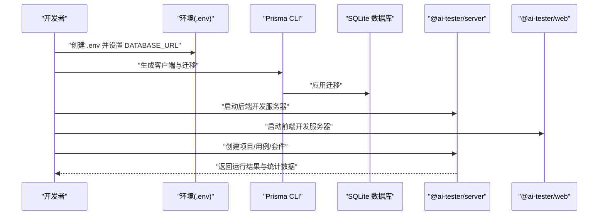
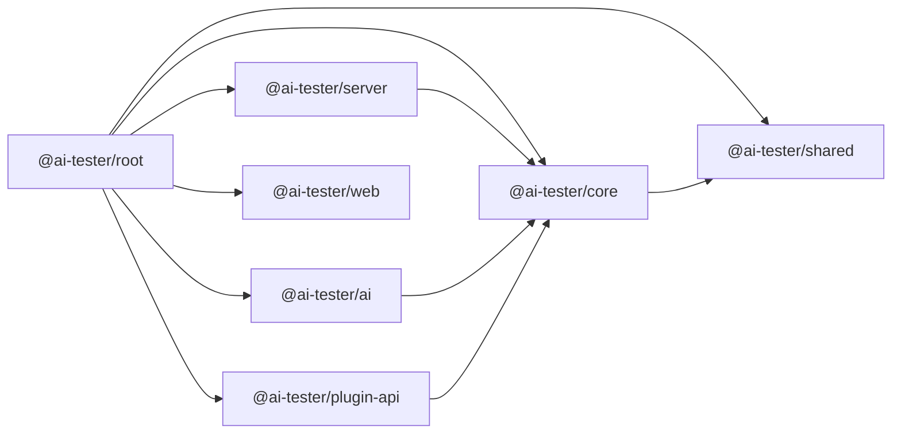

# 快速开始

<cite>
**本文引用的文件**
- [package.json](file://package.json)
- [pnpm-workspace.yaml](file://pnpm-workspace.yaml)
- [tsconfig.base.json](file://tsconfig.base.json)
- [.gitignore](file://.gitignore)
- [prisma/schema.prisma](file://prisma/schema.prisma)
- [packages/server/package.json](file://packages/server/package.json)
- [packages/core/package.json](file://packages/core/package.json)
- [packages/shared/package.json](file://packages/shared/package.json)
- [packages/ai/package.json](file://packages/ai/package.json)
- [packages/plugin-api/package.json](file://packages/plugin-api/package.json)
- [packages/web/package.json](file://packages/web/package.json)
</cite>

## 目录
1. [简介](#简介)
2. [项目结构](#项目结构)
3. [核心组件](#核心组件)
4. [架构总览](#架构总览)
5. [详细组件分析](#详细组件分析)
6. [依赖分析](#依赖分析)
7. [性能考虑](#性能考虑)
8. [故障排除指南](#故障排除指南)
9. [结论](#结论)
10. [附录](#附录)

## 简介
本指南面向首次接触 AI 测试器项目的开发者，帮助你在最短时间内完成环境准备、依赖安装与数据库初始化，并成功启动第一个项目。你将学到：
- 环境要求与工具链（Node.js、pnpm 工作空间）
- 数据库初始化与 Prisma 迁移
- 本地开发与构建命令
- 第一个项目创建的完整示例（项目配置、环境变量、基本使用流程）
- 常见安装问题与故障排除

## 项目结构
该项目采用 pnpm 工作空间组织多包（monorepo）结构，核心包位于 packages 目录下，数据库模式由 Prisma 管理。

图表来源
- [pnpm-workspace.yaml:1-3](file://pnpm-workspace.yaml#L1-L3)
- [package.json:1-31](file://package.json#L1-L31)
- [prisma/schema.prisma:1-196](file://prisma/schema.prisma#L1-L196)
- [tsconfig.base.json:1-20](file://tsconfig.base.json#L1-L20)
- [.gitignore:1-10](file://.gitignore#L1-L10)

章节来源
- [pnpm-workspace.yaml:1-3](file://pnpm-workspace.yaml#L1-L3)
- [package.json:1-31](file://package.json#L1-L31)
- [tsconfig.base.json:1-20](file://tsconfig.base.json#L1-L20)
- [.gitignore:1-10](file://.gitignore#L1-L10)

## 核心组件
- 工作空间与脚本
  - 根级 package.json 定义了统一的构建、开发、类型检查、测试与清理脚本，支持并行执行。
  - pnpm-workspace.yaml 指定工作空间范围为 packages/*。
- TypeScript 基础配置
  - tsconfig.base.json 提供统一编译选项，包含模块系统、严格模式、声明输出等。
- 数据库与模型
  - prisma/schema.prisma 使用 SQLite 作为默认数据源，定义了 Project、TestCase、TestSuite、TestRun、TestCaseResult、TestStepResult、TestDataSet、AiConfig、ApiEndpoint、GenerationTask 等核心模型及索引关系。

章节来源
- [package.json:6-12](file://package.json#L6-L12)
- [pnpm-workspace.yaml:1-3](file://pnpm-workspace.yaml#L1-L3)
- [tsconfig.base.json:2-18](file://tsconfig.base.json#L2-L18)
- [prisma/schema.prisma:1-196](file://prisma/schema.prisma#L1-L196)

## 架构总览
整体架构围绕“服务端 API + 前端界面 + 多个业务与共享包”的分层设计展开。核心包负责领域逻辑与数据访问，AI 包负责大模型集成，插件 API 提供扩展能力，服务端通过 Fastify 暴露接口，前端基于 React 与 Vite 构建。

图表来源
- [packages/server/package.json:16-28](file://packages/server/package.json#L16-L28)
- [packages/core/package.json:21-26](file://packages/core/package.json#L21-L26)
- [packages/ai/package.json:21-27](file://packages/ai/package.json#L21-L27)
- [packages/plugin-api/package.json:21-26](file://packages/plugin-api/package.json#L21-L26)
- [prisma/schema.prisma:1-8](file://prisma/schema.prisma#L1-L8)

## 详细组件分析

### 环境要求与工具链
- Node.js 版本要求：根级 engines 字段要求 Node.js >= 20.0.0。
- 包管理器：使用 pnpm 作为包管理与工作空间工具。
- TypeScript：统一的 tsconfig.base.json 配置，确保各包一致的编译行为。
- 开发工具：Vitest 用于单元测试；ESLint + Prettier 用于代码质量与格式化；Prisma 用于数据库建模与迁移。

章节来源
- [package.json:24-26](file://package.json#L24-L26)
- [pnpm-workspace.yaml:1-3](file://pnpm-workspace.yaml#L1-L3)
- [tsconfig.base.json:2-18](file://tsconfig.base.json#L2-L18)
- [package.json:14-22](file://package.json#L14-L22)

### 依赖安装与初始化
- 克隆仓库后，先安装根级依赖（含 Prisma、TypeScript、ESLint、Prettier 等）。
- 在根目录执行安装命令以安装所有工作空间包的依赖。
- 初始化数据库：
  - 设置 DATABASE_URL 环境变量指向 SQLite 文件路径（建议在项目根目录下创建 .env 文件）。
  - 执行 Prisma 初始化与迁移命令，生成客户端并应用数据库变更。
- 启动开发：
  - 使用根级 dev 脚本并行启动所有包的开发进程。
  - 或分别进入各包目录执行其 dev 脚本进行独立开发。

章节来源
- [package.json:6-12](file://package.json#L6-L12)
- [prisma/schema.prisma:5-8](file://prisma/schema.prisma#L5-L8)
- [packages/server/package.json:7-14](file://packages/server/package.json#L7-L14)

### 数据库初始化与 Prisma 迁移
- 数据源配置：schema.prisma 中 datasource db 使用 sqlite 提供者，并从环境变量 DATABASE_URL 读取连接字符串。
- 迁移与客户端生成：
  - 生成 Prisma 客户端代码。
  - 应用数据库迁移，创建或更新表结构。
  - 可选：生成数据库文档或预览迁移。
- 常见迁移场景：
  - 新增字段：在 schema.prisma 中修改模型，重新生成迁移并应用。
  - 删除字段：谨慎处理外键与索引，必要时先迁移相关字段再删除。
  - 关系变更：调整关系与索引，确保迁移顺序正确。

图表来源
- [prisma/schema.prisma:5-8](file://prisma/schema.prisma#L5-L8)
- [package.json:20](file://package.json#L20)

章节来源
- [prisma/schema.prisma:1-196](file://prisma/schema.prisma#L1-L196)
- [package.json:20](file://package.json#L20)

### 第一个项目创建的完整示例
以下为“创建第一个项目”的端到端流程，涵盖项目配置、环境变量设置与基本使用步骤：

- 步骤 1：准备环境
  - 确认 Node.js 版本满足要求。
  - 安装 pnpm 并启用工作空间。
- 步骤 2：安装依赖
  - 在根目录执行安装命令，拉取所有包依赖。
- 步骤 3：配置数据库
  - 在项目根目录创建 .env 文件，设置 DATABASE_URL 指向本地 SQLite 文件。
  - 执行 Prisma 客户端生成与迁移命令。
- 步骤 4：启动开发
  - 在根目录执行开发脚本，启动所有包的开发服务器。
  - 打开浏览器访问前端页面，或调用后端 API 进行测试。
- 步骤 5：创建项目与用例
  - 通过前端界面或后端 API 创建 Project。
  - 在项目下创建 TestCase、TestSuite，并触发 TestRun。
  - 查看 TestRun 的结果与统计信息。

图表来源
- [prisma/schema.prisma:5-8](file://prisma/schema.prisma#L5-L8)
- [package.json:6-12](file://package.json#L6-L12)
- [packages/server/package.json:7-14](file://packages/server/package.json#L7-L14)
- [packages/web/package.json:6-12](file://packages/web/package.json#L6-L12)

章节来源
- [prisma/schema.prisma:1-196](file://prisma/schema.prisma#L1-L196)
- [package.json:6-12](file://package.json#L6-L12)
- [packages/server/package.json:7-14](file://packages/server/package.json#L7-L14)
- [packages/web/package.json:6-12](file://packages/web/package.json#L6-L12)

### 包与脚本概览
- 根级脚本
  - build：并行构建所有包。
  - dev：并行启动所有包的开发模式。
  - lint/typecheck/test/clean：统一执行代码检查、类型检查、测试与清理。
- 各包脚本
  - @ai-tester/server：Fastify 服务端，包含 Swagger 文档与 WebSocket 支持。
  - @ai-tester/core：核心业务逻辑与数据访问。
  - @ai-tester/shared：共享工具与日志。
  - @ai-tester/ai：AI 相关集成（OpenAI 等）。
  - @ai-tester/plugin-api：插件扩展接口。
  - @ai-tester/web：React 前端应用，使用 Vite 构建。

章节来源
- [package.json:6-12](file://package.json#L6-L12)
- [packages/server/package.json:7-14](file://packages/server/package.json#L7-L14)
- [packages/core/package.json:13-20](file://packages/core/package.json#L13-L20)
- [packages/shared/package.json:13-18](file://packages/shared/package.json#L13-L18)
- [packages/ai/package.json:13-20](file://packages/ai/package.json#L13-L20)
- [packages/plugin-api/package.json:13-20](file://packages/plugin-api/package.json#L13-L20)
- [packages/web/package.json:6-12](file://packages/web/package.json#L6-L12)

## 依赖分析
- 工作空间与包导出
  - 各包通过 workspace:* 引用彼此，确保开发期可直接共享代码。
  - 根级 package.json 的 scripts 统一调度各包的构建与开发任务。
- 外部依赖要点
  - 服务端：Fastify 生态（CORS、Swagger、WebSocket、类型提供器）。
  - 核心与 AI：Zod 类型校验、Prisma 客户端、JSONPath。
  - 插件 API：Undici HTTP 客户端。
  - 前端：React 19、TanStack React Query、TailwindCSS、Radix UI 组件库。

图表来源
- [packages/server/package.json:16-28](file://packages/server/package.json#L16-L28)
- [packages/core/package.json:21-26](file://packages/core/package.json#L21-L26)
- [packages/ai/package.json:21-27](file://packages/ai/package.json#L21-L27)
- [packages/plugin-api/package.json:21-26](file://packages/plugin-api/package.json#L21-L26)
- [packages/web/package.json:13-44](file://packages/web/package.json#L13-L44)

章节来源
- [packages/server/package.json:16-28](file://packages/server/package.json#L16-L28)
- [packages/core/package.json:21-26](file://packages/core/package.json#L21-L26)
- [packages/ai/package.json:21-27](file://packages/ai/package.json#L21-L27)
- [packages/plugin-api/package.json:21-26](file://packages/plugin-api/package.json#L21-L26)
- [packages/web/package.json:13-44](file://packages/web/package.json#L13-L44)

## 性能考虑
- 并行开发：根级 dev 脚本并行启动所有包，缩短等待时间。
- 类型与构建：统一的 tsconfig.base.json 有助于减少重复配置带来的构建差异。
- 数据库：SQLite 适合本地开发，生产建议使用更稳定的数据库并配合连接池与索引优化。
- 前端：Vite 的热更新与按需打包提升开发体验；生产构建时注意资源体积与懒加载策略。

## 故障排除指南
- Node.js 版本不匹配
  - 症状：安装或运行时报错，提示 Node 版本过低。
  - 解决：升级 Node.js 至 20+。
- pnpm 安装失败或依赖冲突
  - 症状：安装阶段报错或构建阶段找不到模块。
  - 解决：清理缓存与锁文件后重装；确认 pnpm 版本与工作空间配置一致。
- 数据库连接失败
  - 症状：启动时无法连接 SQLite 或迁移失败。
  - 解决：检查 .env 中 DATABASE_URL 是否指向有效路径；确保目录存在且有写权限；重新生成客户端与迁移。
- Prisma 客户端未生成
  - 症状：TypeScript 报告找不到 Prisma 客户端类型。
  - 解决：执行 Prisma 客户端生成命令；确认 schema.prisma 无语法错误。
- 端口占用或跨域问题
  - 症状：服务端或前端无法启动；浏览器出现跨域错误。
  - 解决：更换端口；确认 CORS 配置；检查防火墙与代理设置。
- 类型检查或 ESLint 报错
  - 症状：typecheck 或 lint 报错阻塞提交。
  - 解决：根据提示修复类型或格式问题；必要时暂时跳过规则但需尽快修正。

章节来源
- [package.json:24-26](file://package.json#L24-L26)
- [prisma/schema.prisma:5-8](file://prisma/schema.prisma#L5-L8)
- [package.json:14-22](file://package.json#L14-L22)
- [packages/server/package.json:22-26](file://packages/server/package.json#L22-L26)

## 结论
通过本快速开始指南，你已掌握环境准备、依赖安装、数据库初始化与开发启动的全流程。建议在完成基础环境搭建后，逐步探索各包的功能边界与扩展点，结合实际业务场景完善项目配置与用例设计。

## 附录
- 常用命令速查
  - 安装依赖：在根目录执行安装命令。
  - 生成客户端与迁移：执行 Prisma 客户端生成与迁移命令。
  - 并行开发：执行根级 dev 脚本。
  - 类型检查：执行根级 typecheck 脚本。
  - 单元测试：执行根级 test 脚本。
- 文件与目录清单
  - 根级配置：package.json、pnpm-workspace.yaml、tsconfig.base.json、.gitignore。
  - 数据库：prisma/schema.prisma。
  - 包：packages/server、packages/core、packages/shared、packages/ai、packages/plugin-api、packages/web。