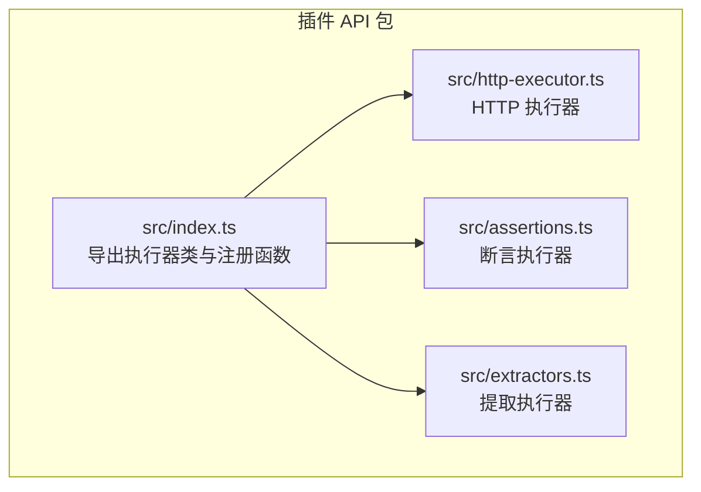
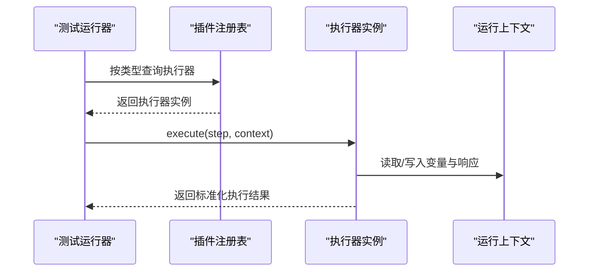
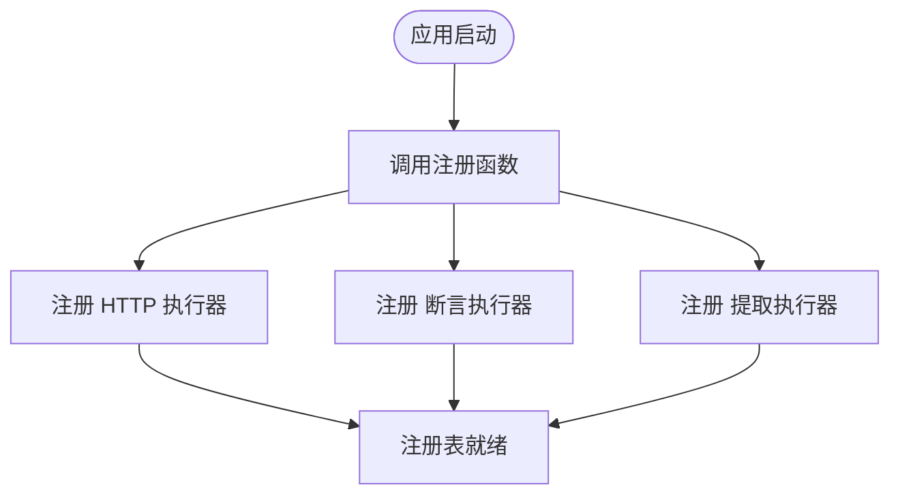
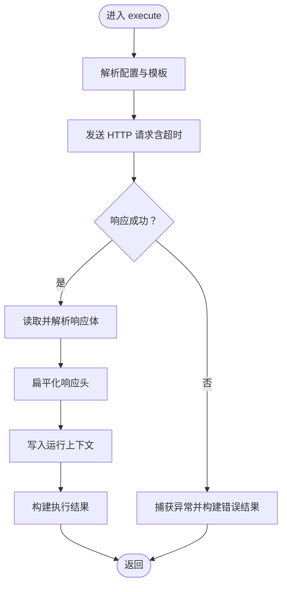
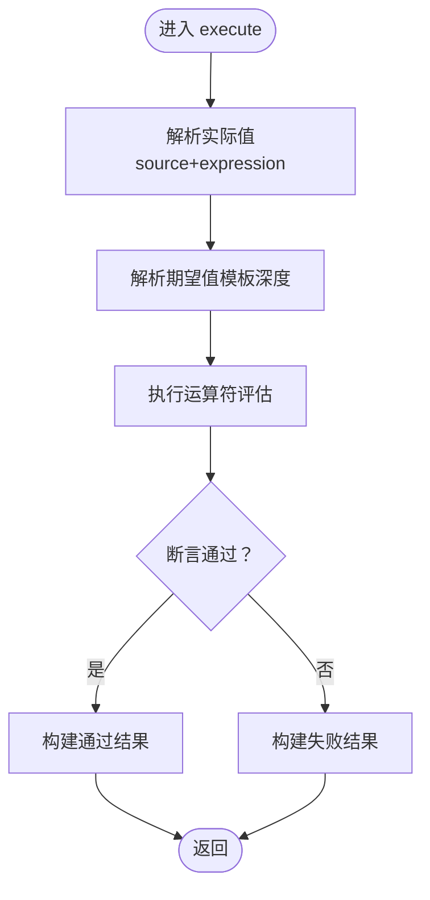
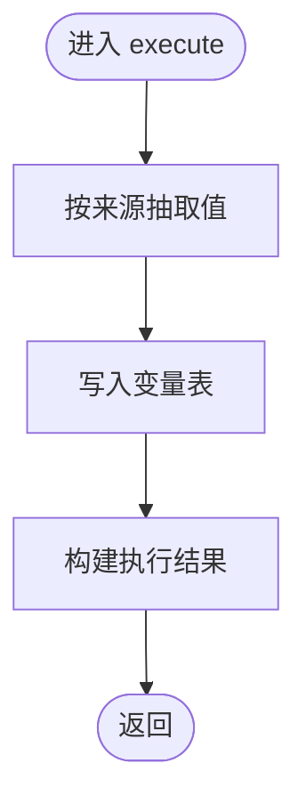
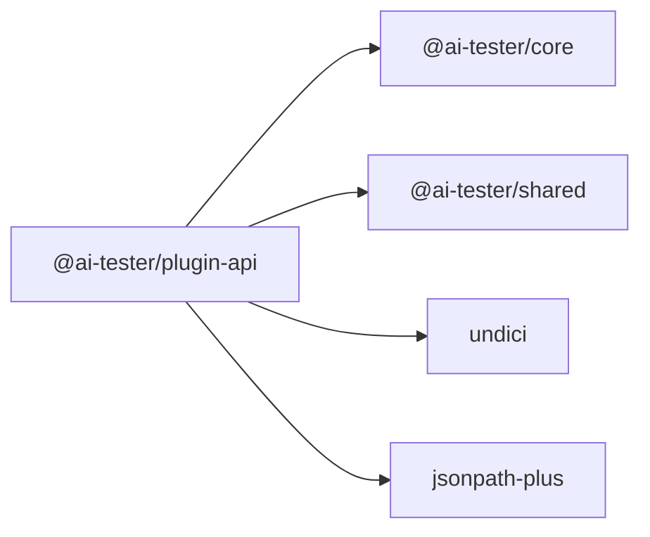

# 插件系统

<cite>
**本文引用的文件**
- [packages/plugin-api/package.json](file://packages/plugin-api/package.json)
- [packages/plugin-api/src/index.ts](file://packages/plugin-api/src/index.ts)
- [packages/plugin-api/src/http-executor.ts](file://packages/plugin-api/src/http-executor.ts)
- [packages/plugin-api/src/assertions.ts](file://packages/plugin-api/src/assertions.ts)
- [packages/plugin-api/src/extractors.ts](file://packages/plugin-api/src/extractors.ts)
</cite>

## 目录
1. [简介](#简介)
2. [项目结构](#项目结构)
3. [核心组件](#核心组件)
4. [架构总览](#架构总览)
5. [详细组件分析](#详细组件分析)
6. [依赖分析](#依赖分析)
7. [性能考虑](#性能考虑)
8. [故障排查指南](#故障排查指南)
9. [结论](#结论)
10. [附录](#附录)

## 简介
本文件面向插件系统的技术文档，聚焦于插件架构设计、接口定义与扩展机制，系统性阐述插件注册表的实现原理、生命周期管理与动态加载机制；同时文档化插件执行器的工作流程、上下文传递与结果收集方式，并提供插件开发指南、API参考、最佳实践、模板与示例思路、调试技巧、安全机制与权限控制、资源管理策略，以及发布、版本管理与兼容性保障方法。

## 项目结构
插件系统以“插件 API 包”为核心，提供默认插件集合（HTTP 执行器、断言执行器、提取执行器），并通过统一的注册函数将这些插件注册到全局插件注册表中，供测试运行器在执行阶段按类型调度。

图表来源
- [packages/plugin-api/src/index.ts:1-15](file://packages/plugin-api/src/index.ts#L1-L15)
- [packages/plugin-api/src/http-executor.ts:1-95](file://packages/plugin-api/src/http-executor.ts#L1-L95)
- [packages/plugin-api/src/assertions.ts:1-112](file://packages/plugin-api/src/assertions.ts#L1-L112)
- [packages/plugin-api/src/extractors.ts:1-68](file://packages/plugin-api/src/extractors.ts#L1-L68)

章节来源
- [packages/plugin-api/package.json:1-33](file://packages/plugin-api/package.json#L1-L33)
- [packages/plugin-api/src/index.ts:1-15](file://packages/plugin-api/src/index.ts#L1-L15)

## 核心组件
- 插件注册表：由核心包提供的全局注册表对象承载，负责接收并登记各类执行器实例，按类型进行索引与分发。
- 执行器接口：所有插件均实现统一的执行器接口，具备类型标识与配置校验模式，并提供异步执行方法。
- 默认插件集合：
  - HTTP 执行器：基于 HTTP 客户端发起请求，解析响应，写入运行上下文并返回标准化执行结果。
  - 断言执行器：从运行上下文或变量中解析实际值，使用多种比较运算符进行断言评估。
  - 提取执行器：从响应中抽取指定字段或表达式结果，写入变量表，供后续步骤使用。

章节来源
- [packages/plugin-api/src/index.ts:10-14](file://packages/plugin-api/src/index.ts#L10-L14)
- [packages/plugin-api/src/http-executor.ts:7-95](file://packages/plugin-api/src/http-executor.ts#L7-L95)
- [packages/plugin-api/src/assertions.ts:7-112](file://packages/plugin-api/src/assertions.ts#L7-L112)
- [packages/plugin-api/src/extractors.ts:7-68](file://packages/plugin-api/src/extractors.ts#L7-L68)

## 架构总览
下图展示插件注册与执行的整体流程：测试运行器通过注册表获取对应类型的执行器，将测试步骤与运行上下文传入执行器，执行器完成业务处理后返回标准化结果，运行器据此推进流程并更新上下文。

图表来源
- [packages/plugin-api/src/index.ts:10-14](file://packages/plugin-api/src/index.ts#L10-L14)
- [packages/plugin-api/src/http-executor.ts:11-95](file://packages/plugin-api/src/http-executor.ts#L11-L95)
- [packages/plugin-api/src/assertions.ts:11-40](file://packages/plugin-api/src/assertions.ts#L11-L40)
- [packages/plugin-api/src/extractors.ts:11-34](file://packages/plugin-api/src/extractors.ts#L11-L34)

## 详细组件分析

### 注册表与动态加载机制
- 注册入口：插件 API 包提供统一注册函数，将默认执行器实例注册到全局注册表。
- 动态加载：通过在应用启动时调用该注册函数，即可将默认插件注入运行时；若需扩展，可在同一注册函数中追加自定义执行器实例。
- 类型分发：注册表内部按执行器类型进行索引，运行时根据步骤类型选择对应执行器。

图表来源
- [packages/plugin-api/src/index.ts:10-14](file://packages/plugin-api/src/index.ts#L10-L14)

章节来源
- [packages/plugin-api/src/index.ts:10-14](file://packages/plugin-api/src/index.ts#L10-L14)

### HTTP 执行器
- 职责：根据测试步骤配置发起 HTTP 请求，解析响应体与头信息，写入运行上下文，并返回标准化执行结果。
- 关键流程：
  - 配置解析与模板渲染：对 URL、头部与请求体进行模板解析。
  - 请求发送与超时控制：使用带超时信号的客户端请求。
  - 响应处理：尝试解析 JSON，否则保留文本；扁平化响应头。
  - 结果写入：将状态码、头、体与耗时写入上下文，便于后续断言/提取步骤使用。
- 错误处理：捕获异常并返回错误状态与堆栈信息，记录请求与耗时。

图表来源
- [packages/plugin-api/src/http-executor.ts:11-95](file://packages/plugin-api/src/http-executor.ts#L11-L95)

章节来源
- [packages/plugin-api/src/http-executor.ts:7-95](file://packages/plugin-api/src/http-executor.ts#L7-L95)

### 断言执行器
- 职责：从运行上下文或变量中解析“实际值”，结合期望值与运算符进行断言评估，输出断言结果。
- 关键流程：
  - 解析实际值：支持从状态码、响应头、响应体、JSONPath 表达式、变量等来源解析。
  - 期望值处理：对期望值进行模板深度解析。
  - 运算符评估：内置多类运算符（等于/不等于、包含/不包含、数值比较、正则匹配、存在性、类型判断等）。
  - 结果返回：根据断言是否通过返回不同状态。
- 错误处理：解析失败或未知源/运算符时抛出错误并返回错误状态。

图表来源
- [packages/plugin-api/src/assertions.ts:11-40](file://packages/plugin-api/src/assertions.ts#L11-L40)
- [packages/plugin-api/src/assertions.ts:42-112](file://packages/plugin-api/src/assertions.ts#L42-L112)

章节来源
- [packages/plugin-api/src/assertions.ts:7-112](file://packages/plugin-api/src/assertions.ts#L7-L112)

### 提取执行器
- 职责：从响应中抽取指定字段或表达式结果，写入变量表，供后续步骤使用。
- 关键流程：
  - 解析来源：支持状态码、响应头、响应体、JSONPath 表达式、正则表达式等。
  - 抽取与存储：将抽取值写入运行上下文的变量表。
  - 错误处理：当无可用响应或表达式无效时抛出错误并返回错误状态。

图表来源
- [packages/plugin-api/src/extractors.ts:11-34](file://packages/plugin-api/src/extractors.ts#L11-L34)
- [packages/plugin-api/src/extractors.ts:36-68](file://packages/plugin-api/src/extractors.ts#L36-L68)

章节来源
- [packages/plugin-api/src/extractors.ts:7-68](file://packages/plugin-api/src/extractors.ts#L7-L68)

### 上下文传递与结果收集
- 运行上下文职责：
  - 存储最近一次 HTTP 响应（状态码、头、体、耗时）。
  - 维护变量表，用于跨步骤的数据传递。
  - 提供模板解析能力，支持在执行前对 URL、头、体等进行变量替换。
- 结果收集：
  - 执行器返回标准化执行结果，包含状态、耗时、请求与响应详情（如适用）、断言详情或变量抽取详情。
  - 测试运行器根据结果推进流程并更新上下文。

章节来源
- [packages/plugin-api/src/http-executor.ts:56-80](file://packages/plugin-api/src/http-executor.ts#L56-L80)
- [packages/plugin-api/src/assertions.ts:22-32](file://packages/plugin-api/src/assertions.ts#L22-L32)
- [packages/plugin-api/src/extractors.ts:19-26](file://packages/plugin-api/src/extractors.ts#L19-L26)

## 依赖分析
- 插件 API 包依赖核心包与共享包，提供统一的执行器类型与配置模式；同时依赖 HTTP 客户端与 JSONPath 工具，支撑 HTTP 请求与表达式抽取。
- 依赖关系清晰，模块边界明确，便于扩展与维护。

图表来源
- [packages/plugin-api/package.json:21-31](file://packages/plugin-api/package.json#L21-L31)

章节来源
- [packages/plugin-api/package.json:1-33](file://packages/plugin-api/package.json#L1-L33)

## 性能考虑
- 超时控制：HTTP 执行器在请求阶段设置超时信号，避免长时间阻塞影响整体执行效率。
- 响应体处理：优先尝试 JSON 解析，失败回退为文本，减少不必要的解析开销。
- 模板解析：仅在必要时进行深度模板解析，避免重复计算。
- 并发与批处理：建议在运行器层面进行步骤级并发控制，避免过多并发导致外部服务压力过大。

## 故障排查指南
- HTTP 执行器常见问题
  - 超时或网络异常：检查超时配置与目标服务可达性；查看错误结果中的消息与堆栈。
  - 响应体非 JSON：确认 Content-Type 与响应体格式；必要时在断言或提取阶段进行字符串处理。
  - 头部大小写：响应头键名统一转小写后访问，避免大小写差异导致的取值失败。
- 断言执行器常见问题
  - 未知源或表达式缺失：确保断言来源与表达式正确；对于 JSONPath，确认路径有效。
  - 类型不匹配：使用类型判断运算符或在提取阶段进行类型转换。
- 提取执行器常见问题
  - 无可用响应：确认前置 HTTP 步骤已成功执行并写入上下文。
  - 正则未命中：检查正则表达式与响应体内容，优先使用捕获组以稳定取值。

章节来源
- [packages/plugin-api/src/http-executor.ts:80-92](file://packages/plugin-api/src/http-executor.ts#L80-L92)
- [packages/plugin-api/src/assertions.ts:42-64](file://packages/plugin-api/src/assertions.ts#L42-L64)
- [packages/plugin-api/src/extractors.ts:36-66](file://packages/plugin-api/src/extractors.ts#L36-L66)

## 结论
本插件系统通过统一的注册表与执行器接口，实现了可扩展、可组合的测试执行框架。默认插件覆盖了常见的 HTTP 请求、断言与数据提取场景，配合运行上下文与标准化结果，能够满足大多数测试工作流需求。通过遵循本文档的开发指南、最佳实践与安全策略，开发者可以快速扩展新的插件类型并安全地集成到现有系统中。

## 附录

### 插件开发指南
- 实现执行器接口
  - 定义类型标识与配置模式，确保与核心包的模式一致。
  - 在 execute 方法中完成业务逻辑，严格遵守输入校验与错误处理规范。
- 注册与加载
  - 在应用启动阶段调用注册函数，将执行器实例注册到全局注册表。
  - 如需动态加载，可在运行时根据配置或环境变量决定是否注册额外插件。
- 上下文与结果
  - 合理使用运行上下文进行数据传递与状态记录。
  - 返回标准化执行结果，包含状态、耗时与必要的上下文信息。

### API 参考
- 执行器接口要点
  - 类型标识：用于注册表分发与运行器调度。
  - 配置模式：使用核心包提供的模式进行参数校验。
  - 执行方法：返回标准化执行结果，包含状态、耗时与请求/响应详情（如适用）。
- 运行上下文要点
  - 最近响应：包含状态码、头、体与耗时，供断言/提取步骤使用。
  - 变量表：用于跨步骤的数据传递。
  - 模板解析：支持在执行前对 URL、头、体等进行变量替换。

### 最佳实践
- 配置校验：始终使用核心包提供的配置模式进行参数校验，避免运行期异常。
- 错误处理：捕获并包装异常，返回错误状态与堆栈信息，便于定位问题。
- 资源管理：合理设置超时与重试策略，避免资源泄露与外部依赖抖动。
- 安全控制：限制可执行的表达式与变量来源，避免注入风险；对敏感数据进行脱敏处理。
- 版本与兼容：遵循语义化版本，保持配置模式与接口的向后兼容；在升级时提供迁移指南。

### 插件模板与示例思路
- 模板结构
  - 定义执行器类，实现类型标识、配置模式与执行方法。
  - 在注册函数中将实例注册到注册表。
- 示例思路
  - 新增一个自定义执行器（如数据库查询、文件上传等），复用运行上下文与结果格式，确保与现有流程无缝衔接。

### 调试技巧
- 开启详细日志：在执行器中记录关键输入与中间状态，便于定位问题。
- 使用最小化配置：先用简单步骤验证插件功能，再逐步增加复杂度。
- 分步验证：将长流程拆分为多个短步骤，分别验证每个步骤的输入、输出与上下文变化。

### 安全机制与权限控制
- 输入校验：严格校验所有外部输入，防止恶意配置导致的安全问题。
- 权限隔离：限制插件对系统资源的访问范围，避免越权操作。
- 数据脱敏：对敏感字段进行脱敏处理，避免在日志与结果中泄露。

### 发布、版本管理与兼容性
- 版本策略：采用语义化版本，主版本变更时提供迁移指南与兼容层。
- 兼容性保证：核心包的配置模式与接口保持向后兼容，新增功能以可选参数形式提供。
- 发布流程：在 CI 中执行类型检查、单元测试与集成测试，确保质量与稳定性。