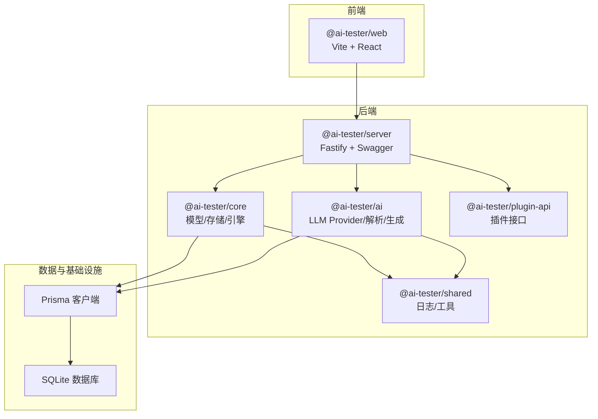
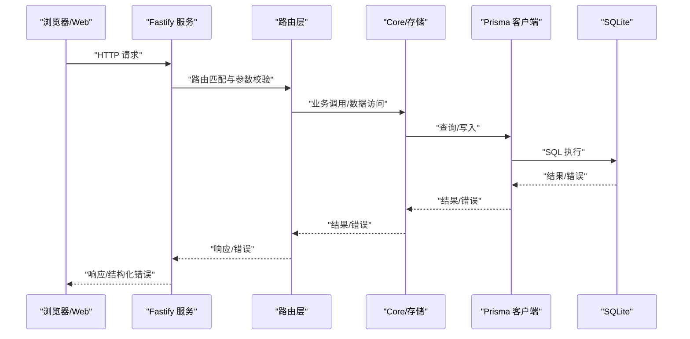
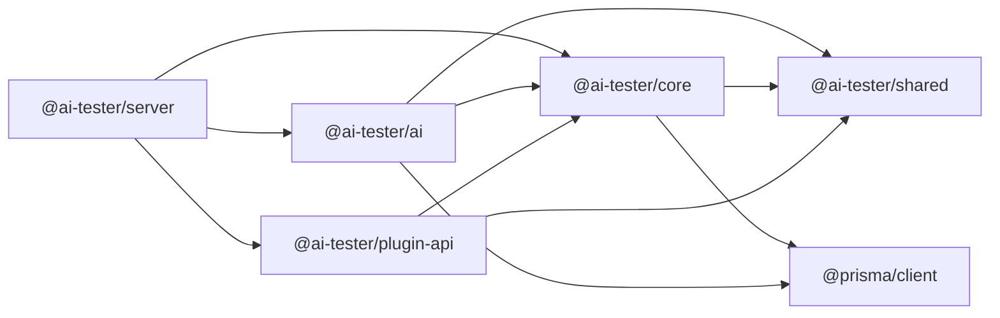

# 故障排除

<cite>
**本文引用的文件**
- [package.json](file://package.json)
- [pnpm-workspace.yaml](file://pnpm-workspace.yaml)
- [prisma/schema.prisma](file://prisma/schema.prisma)
- [packages/ai/package.json](file://packages/ai/package.json)
- [packages/core/package.json](file://packages/core/package.json)
- [packages/server/package.json](file://packages/server/package.json)
- [packages/web/package.json](file://packages/web/package.json)
- [packages/shared/package.json](file://packages/shared/package.json)
- [packages/plugin-api/package.json](file://packages/plugin-api/package.json)
- [packages/server/src/app.ts](file://packages/server/src/app.ts)
- [packages/server/src/routes/projects.ts](file://packages/server/src/routes/projects.ts)
- [packages/ai/src/providers/openai-provider.ts](file://packages/ai/src/providers/openai-provider.ts)
- [packages/shared/src/logger.ts](file://packages/shared/src/logger.ts)
- [packages/core/src/store/index.ts](file://packages/core/src/store/index.ts)
- [packages/core/src/index.ts](file://packages/core/src/index.ts)
- [packages/ai/src/index.ts](file://packages/ai/src/index.ts)
</cite>

## 目录
1. [简介](#简介)
2. [项目结构](#项目结构)
3. [核心组件](#核心组件)
4. [架构总览](#架构总览)
5. [详细组件分析](#详细组件分析)
6. [依赖分析](#依赖分析)
7. [性能考虑](#性能考虑)
8. [故障排除指南](#故障排除指南)
9. [结论](#结论)
10. [附录](#附录)

## 简介
本故障排除文档面向AI测试器项目的开发者与运维人员，聚焦于开发环境搭建、运行时错误、性能问题、日志分析、调试工具使用、问题定位技巧、错误码对照、异常处理策略与恢复机制、网络与数据库连接排查、API调用错误诊断、性能监控指标与优化建议，以及社区支持与升级修复流程。文档基于仓库现有代码与配置进行梳理，确保可操作性与可追溯性。

## 项目结构
项目采用多包工作区（pnpm workspaces）组织，核心模块包括服务端（Fastify）、前端（Vite + React）、核心引擎与存储（Prisma）、AI能力（OpenAI集成）、共享日志与工具等。整体采用分层设计：Web UI 负责交互；Server 提供 REST API；Core 聚合模型、存储与执行引擎；AI 模块负责大模型生成与解析；Shared 统一日志与通用工具；Plugin API 提供扩展能力。

图表来源
- [pnpm-workspace.yaml:1-3](file://pnpm-workspace.yaml#L1-L3)
- [packages/server/package.json:1-36](file://packages/server/package.json#L1-L36)
- [packages/core/package.json:1-34](file://packages/core/package.json#L1-L34)
- [packages/ai/package.json:1-34](file://packages/ai/package.json#L1-L34)
- [packages/shared/package.json:1-28](file://packages/shared/package.json#L1-L28)
- [packages/plugin-api/package.json:1-33](file://packages/plugin-api/package.json#L1-L33)
- [prisma/schema.prisma:1-196](file://prisma/schema.prisma#L1-L196)

章节来源
- [pnpm-workspace.yaml:1-3](file://pnpm-workspace.yaml#L1-L3)
- [package.json:1-31](file://package.json#L1-L31)

## 核心组件
- 服务端应用（Fastify）
  - 全局错误处理器统一返回结构化错误
  - 健康检查端点
  - 路由注册（项目、用例、套件、运行、数据集、AI配置、AI端点、AI生成）
- 日志系统（Pino）
  - 支持通过环境变量控制日志级别
  - 开发环境输出到标准输出
- 存储与模型（Prisma）
  - 项目、用例、套件、运行、结果、数据集、AI配置、API端点、生成任务等模型
  - 多处索引提升查询性能
- AI能力（OpenAI Provider）
  - 支持聊天补全与结构化输出
  - 连通性测试方法
- 插件与扩展（Plugin API）
  - 基于 Undici 的 HTTP 客户端抽象
- Web 前端
  - Vite + React + Radix UI + React Query 等生态

章节来源
- [packages/server/src/app.ts:1-78](file://packages/server/src/app.ts#L1-L78)
- [packages/shared/src/logger.ts:1-15](file://packages/shared/src/logger.ts#L1-L15)
- [prisma/schema.prisma:1-196](file://prisma/schema.prisma#L1-L196)
- [packages/ai/src/providers/openai-provider.ts:1-79](file://packages/ai/src/providers/openai-provider.ts#L1-L79)
- [packages/plugin-api/package.json:1-33](file://packages/plugin-api/package.json#L1-L33)
- [packages/web/package.json:1-45](file://packages/web/package.json#L1-L45)

## 架构总览
下图展示从浏览器到后端、再到数据库的关键路径与错误处理位置，帮助快速定位问题来源。

图表来源
- [packages/server/src/app.ts:1-78](file://packages/server/src/app.ts#L1-L78)
- [packages/server/src/routes/projects.ts:1-40](file://packages/server/src/routes/projects.ts#L1-L40)
- [packages/core/src/store/index.ts:1-8](file://packages/core/src/store/index.ts#L1-L8)
- [prisma/schema.prisma:1-196](file://prisma/schema.prisma#L1-L196)

## 详细组件分析

### 服务端全局错误处理与健康检查
- 错误处理
  - 对 Zod 校验错误返回 400 并携带字段级错误详情
  - 其他错误记录日志并返回统一内部错误结构
- 健康检查
  - 提供 /api/v1/health 返回状态、时间戳与版本信息
- 调试要点
  - 检查 LOG_LEVEL 与监听地址/端口
  - 关注错误堆栈与结构化错误字段

章节来源
- [packages/server/src/app.ts:1-78](file://packages/server/src/app.ts#L1-L78)

### 项目路由与数据访问
- 路由行为
  - 创建、列出、按ID读取、更新、删除项目
  - 使用 Zod Schema 校验请求体
  - 未找到资源时返回 404 结构化错误
- 存储访问
  - 通过仓库对象执行持久化操作
- 排错关注点
  - 请求体是否符合 Schema
  - 数据库连接字符串与权限
  - ID 合法性与外键约束

章节来源
- [packages/server/src/routes/projects.ts:1-40](file://packages/server/src/routes/projects.ts#L1-L40)
- [packages/core/src/store/index.ts:1-8](file://packages/core/src/store/index.ts#L1-L8)

### 日志系统与日志级别
- 日志构造
  - 通过工厂函数创建命名日志实例
  - 支持通过环境变量设置日志级别
  - 非生产环境默认输出到标准输出
- 排错建议
  - 将 LOG_LEVEL 调整为 debug 或 trace 以获取更细粒度日志
  - 在容器或进程管理器中查看标准输出日志

章节来源
- [packages/shared/src/logger.ts:1-15](file://packages/shared/src/logger.ts#L1-L15)

### AI Provider（OpenAI）连通性与结构化输出
- 能力
  - 聊天补全与结构化输出解析
  - 提供 testConnection 方法用于连通性检测
- 排错关注点
  - API 密钥、模型名、自定义 base URL
  - 网络可达性与超时设置
  - LLM 返回为空或未解析的场景

章节来源
- [packages/ai/src/providers/openai-provider.ts:1-79](file://packages/ai/src/providers/openai-provider.ts#L1-L79)

### Prisma 模型与索引
- 模型概览
  - Project、TestCase、TestSuite、TestRun、TestCaseResult、TestStepResult、TestDataSet、AiConfig、ApiEndpoint、GenerationTask
- 索引
  - 多个模型存在索引字段，有助于查询性能
- 排错关注点
  - 数据迁移与同步
  - JSON 字段的序列化/反序列化一致性
  - 外键级联删除对数据完整性的影响

章节来源
- [prisma/schema.prisma:1-196](file://prisma/schema.prisma#L1-L196)

### 插件与 HTTP 客户端
- 插件 API
  - 基于 Undici 的 HTTP 抽象，便于扩展与替换
- 排错关注点
  - 端点可达性、认证方式、超时与重试策略

章节来源
- [packages/plugin-api/package.json:1-33](file://packages/plugin-api/package.json#L1-L33)

## 依赖分析
- 工作区与脚本
  - 使用 pnpm workspaces 管理多包
  - 顶层脚本支持构建、开发、类型检查、测试与清理
- 包间依赖
  - server 依赖 core、shared、ai、plugin-api
  - ai 依赖 core、shared、@prisma/client、openai、zod
  - core 依赖 shared、zod、jsonpath-plus、@prisma/client
  - plugin-api 依赖 core、shared、jsonpath-plus、undici
  - shared 依赖 @paralleldrive/cuid2、pino
- 潜在耦合与风险
  - server 与 ai、core 的强耦合体现在路由与业务调用
  - 插件 API 作为扩展点，需注意接口稳定性

图表来源
- [packages/server/package.json:1-36](file://packages/server/package.json#L1-L36)
- [packages/ai/package.json:1-34](file://packages/ai/package.json#L1-L34)
- [packages/core/package.json:1-34](file://packages/core/package.json#L1-L34)
- [packages/plugin-api/package.json:1-33](file://packages/plugin-api/package.json#L1-L33)
- [packages/shared/package.json:1-28](file://packages/shared/package.json#L1-L28)

章节来源
- [package.json:1-31](file://package.json#L1-L31)
- [pnpm-workspace.yaml:1-3](file://pnpm-workspace.yaml#L1-L3)

## 性能考虑
- 日志级别
  - 生产环境建议使用 info 或更高，避免过多 debug 输出影响吞吐
- 数据库与索引
  - 利用模型上的索引字段（如项目ID、状态、名称等）减少慢查询
- LLM 调用
  - 控制温度与最大 token 数，避免过长上下文导致延迟与成本上升
- 并行与并发
  - 测试套件的并行度配置应结合硬件与 LLM 速率限制进行调整
- 缓存与批处理
  - 对重复的外部请求与 LLM 调用进行缓存与批处理（视具体实现）

## 故障排除指南

### 开发环境问题
- Node 版本不满足要求
  - 顶层 engines 指定最低版本，需确保本地/CI 使用满足条件的 Node 版本
- 工作区安装失败
  - 清理锁文件与 node_modules 后重新安装，确认 pnpm 版本与工作区配置一致
- 类型检查与 ESLint 报错
  - 使用顶层脚本进行统一类型检查与格式化，修复报错后再启动服务

章节来源
- [package.json:24-26](file://package.json#L24-L26)
- [package.json:9-12](file://package.json#L9-L12)

### 运行时错误

#### 服务器启动与监听
- 症状
  - 启动时报错退出
- 排查步骤
  - 检查端口占用与 HOST/PORT 环境变量
  - 查看日志输出（LOG_LEVEL），确认监听地址与端口
- 相关实现
  - 服务器监听逻辑与错误处理

章节来源
- [packages/server/src/app.ts:65-78](file://packages/server/src/app.ts#L65-L78)

#### 路由与参数校验
- 症状
  - 请求返回 400，并提示校验失败
- 排查步骤
  - 对照路由使用的 Zod Schema，修正请求体字段与类型
  - 关注错误详情中的字段与原因
- 相关实现
  - 项目路由的请求体解析与 404 处理

章节来源
- [packages/server/src/app.ts:23-43](file://packages/server/src/app.ts#L23-L43)
- [packages/server/src/routes/projects.ts:8-38](file://packages/server/src/routes/projects.ts#L8-L38)

#### 健康检查
- 症状
  - /api/v1/health 返回非 200
- 排查步骤
  - 检查服务是否正常监听
  - 查看日志中是否有启动阶段的异常
- 相关实现
  - 健康检查端点

章节来源
- [packages/server/src/app.ts:45-50](file://packages/server/src/app.ts#L45-L50)

### 数据库与存储问题

#### 数据库连接
- 症状
  - 查询/写入失败，出现连接或权限相关错误
- 排查步骤
  - 检查 DATABASE_URL 环境变量是否正确
  - 确认 SQLite 文件路径与权限
  - 如涉及迁移，确认 Prisma 客户端与数据库版本兼容
- 相关实现
  - Prisma 数据源配置与模型定义

章节来源
- [prisma/schema.prisma:5-8](file://prisma/schema.prisma#L5-L8)
- [prisma/schema.prisma:10-196](file://prisma/schema.prisma#L10-L196)

#### JSON 字段一致性
- 症状
  - 读取/写入 JSON 字段时出现解析异常
- 排查步骤
  - 确保序列化/反序列化的一致性
  - 检查字段默认值与空值处理
- 相关实现
  - 多个模型包含 JSON 字段（如环境、标签、变量、请求/响应等）

章节来源
- [prisma/schema.prisma:10-196](file://prisma/schema.prisma#L10-L196)

### 网络与 API 调用错误

#### LLM 连接问题（OpenAI Provider）
- 症状
  - LLM 返回空内容或无法解析结构化输出
- 排查步骤
  - 使用 Provider 的连通性测试方法验证
  - 检查 API 密钥、模型名、自定义 base URL
  - 观察网络超时与限流情况
- 相关实现
  - Provider 的聊天补全与结构化输出方法

章节来源
- [packages/ai/src/providers/openai-provider.ts:30-63](file://packages/ai/src/providers/openai-provider.ts#L30-L63)
- [packages/ai/src/providers/openai-provider.ts:65-77](file://packages/ai/src/providers/openai-provider.ts#L65-L77)

#### 插件 HTTP 客户端
- 症状
  - 外部 API 调用失败或超时
- 排查步骤
  - 检查认证方式（Bearer/API-Key/Basic/None）
  - 确认端点可达性与 TLS 配置
  - 设置合理的超时与重试策略
- 相关实现
  - 基于 Undici 的 HTTP 抽象

章节来源
- [packages/plugin-api/package.json:25-25](file://packages/plugin-api/package.json#L25-L25)

### 日志分析与调试工具

#### 日志级别与输出
- 建议
  - 开发阶段将 LOG_LEVEL 设为 debug 或 trace
  - 生产环境保持 info 或更高，避免日志风暴
- 工具
  - 使用标准输出收集日志，配合容器日志系统或进程管理器查看

章节来源
- [packages/shared/src/logger.ts:4-11](file://packages/shared/src/logger.ts#L4-L11)

#### 调试技巧
- 分层定位
  - 从前端到服务端、再到存储与外部 LLM 的链路逐步缩小范围
- 关键点
  - 请求体校验、路由映射、仓库调用、Prisma SQL、LLM 响应
- 可观测性
  - 结合健康检查、错误码与日志时间戳进行交叉验证

章节来源
- [packages/server/src/app.ts:1-78](file://packages/server/src/app.ts#L1-L78)
- [packages/server/src/routes/projects.ts:1-40](file://packages/server/src/routes/projects.ts#L1-L40)

### 错误码对照与异常处理策略

#### 错误码对照
- VALIDATION_ERROR
  - 触发场景：Zod 校验失败
  - 行为：返回 400，携带字段级错误详情
- INTERNAL_ERROR
  - 触发场景：未捕获的服务器内部错误
  - 行为：记录日志并返回统一错误结构
- NOT_FOUND
  - 触发场景：资源不存在
  - 行为：返回 404，携带统一错误结构

章节来源
- [packages/server/src/app.ts:23-43](file://packages/server/src/app.ts#L23-L43)
- [packages/server/src/routes/projects.ts:21-24](file://packages/server/src/routes/projects.ts#L21-L24)

#### 异常处理策略
- 输入校验
  - 在路由层使用 Zod Schema，尽早失败
- 统一错误响应
  - 使用全局错误处理器，保证错误结构一致
- 日志记录
  - 记录错误堆栈与上下文，便于追踪
- 恢复机制
  - 对瞬时网络错误进行指数退避重试
  - 对 LLM 限流采取等待与降速策略

章节来源
- [packages/server/src/app.ts:23-43](file://packages/server/src/app.ts#L23-L43)
- [packages/shared/src/logger.ts:1-15](file://packages/shared/src/logger.ts#L1-L15)

### 性能监控指标、瓶颈识别与优化建议

#### 监控指标建议
- 服务端
  - QPS、P95/P99 延迟、错误率、内存/CPU 使用
- 数据库
  - 慢查询数量、连接数、锁等待
- LLM
  - 调用次数、平均/最大耗时、Token 使用量、错误率
- 前端
  - 首屏时间、交互延迟、错误上报

#### 瓶颈识别
- 路由与校验
  - 大量小请求导致校验开销占比高，可考虑批量接口或缓存校验结果
- 存储
  - 无索引或索引不当导致慢查询，结合模型索引字段优化
- LLM
  - 上下文过长、并发过高、限流触发，需控制参数与并发

#### 优化建议
- 调整日志级别与采样
- 合理设置 LLM 温度与最大 token
- 使用连接池与查询缓存
- 对热点数据进行预热与缓存

章节来源
- [prisma/schema.prisma:42-44](file://prisma/schema.prisma#L42-L44)
- [prisma/schema.prisma:63-64](file://prisma/schema.prisma#L63-L64)
- [prisma/schema.prisma:84-86](file://prisma/schema.prisma#L84-L86)
- [prisma/schema.prisma:138-139](file://prisma/schema.prisma#L138-L139)
- [prisma/schema.prisma:193-195](file://prisma/schema.prisma#L193-L195)

### 社区支持、问题反馈与升级修复

#### 社区支持渠道
- GitHub Issues
  - 在仓库提交问题，附带环境信息、日志片段与最小复现步骤
- 讨论区
  - 使用 Discussions 进行技术交流与经验分享

#### 问题反馈流程
- 步骤
  - 确认问题是否可复现
  - 收集日志与错误码
  - 提供环境信息（Node 版本、操作系统、数据库类型）
  - 附上相关路由与模型信息以便定位

#### 升级与修复指南
- 依赖升级
  - 使用 pnpm 更新依赖，先在本地验证再合并
- 数据迁移
  - 修改 Prisma 模型后，生成并运行迁移，确保回滚策略完备
- 发布流程
  - 通过 CI 进行类型检查、测试与构建，确保质量门禁

章节来源
- [package.json:1-31](file://package.json#L1-L31)
- [pnpm-workspace.yaml:1-3](file://pnpm-workspace.yaml#L1-L3)
- [prisma/schema.prisma:1-196](file://prisma/schema.prisma#L1-L196)

## 结论
本故障排除文档围绕开发环境、运行时错误、网络与数据库连接、日志与调试、错误码与异常处理、性能监控与优化、以及社区支持与升级流程进行了系统化梳理。建议在日常维护中结合日志与健康检查，遵循统一的错误处理与恢复策略，并持续优化存储索引与 LLM 调用参数，以获得稳定高效的系统表现。

## 附录

### 快速排障清单
- 环境
  - Node 版本满足要求
  - pnpm 工作区安装成功
- 服务
  - LOG_LEVEL、HOST、PORT 正确
  - /api/v1/health 可访问
- 数据
  - DATABASE_URL 正确且可连接
  - JSON 字段序列化一致
- LLM
  - API 密钥有效、模型可用、网络可达
- 插件
  - 认证方式正确、超时与重试合理