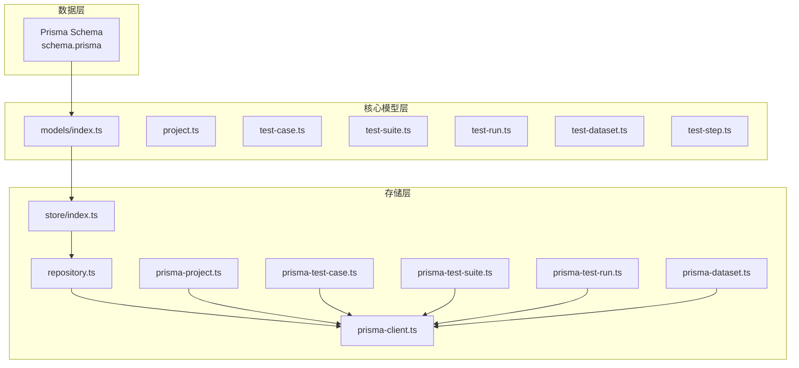
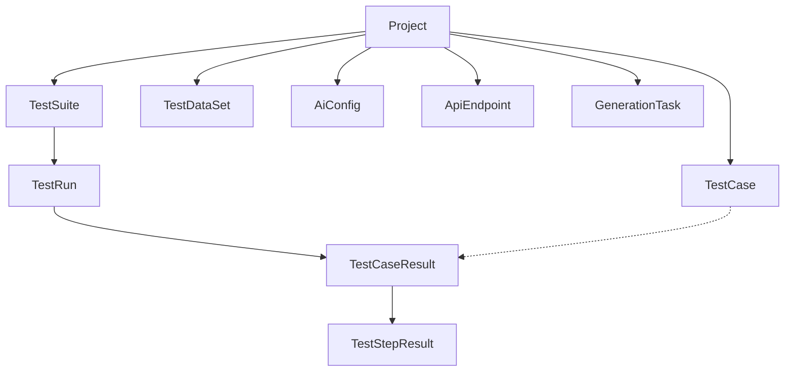
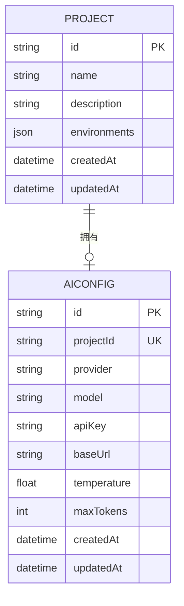
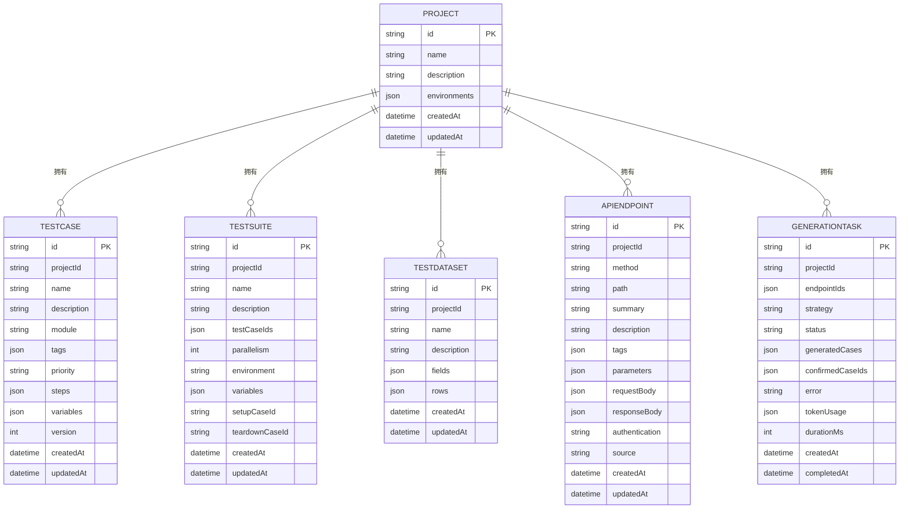
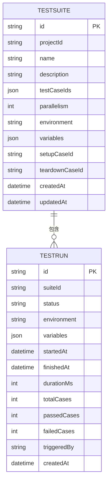
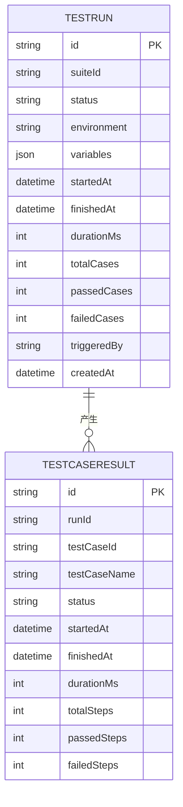
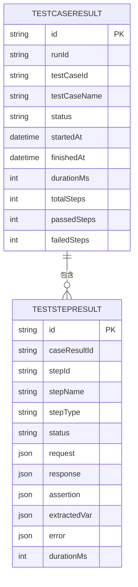
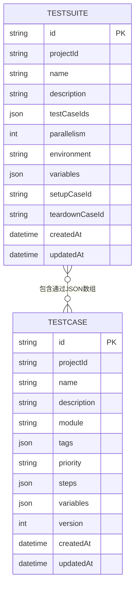
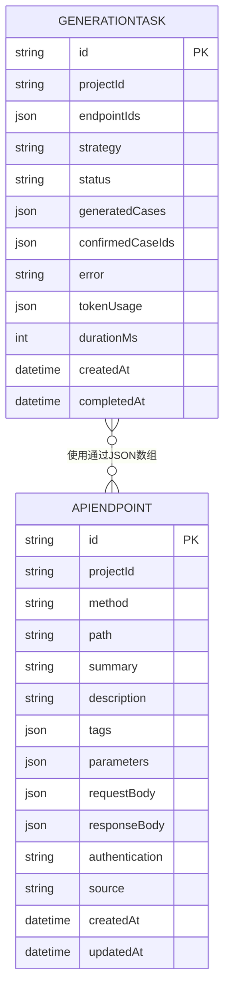
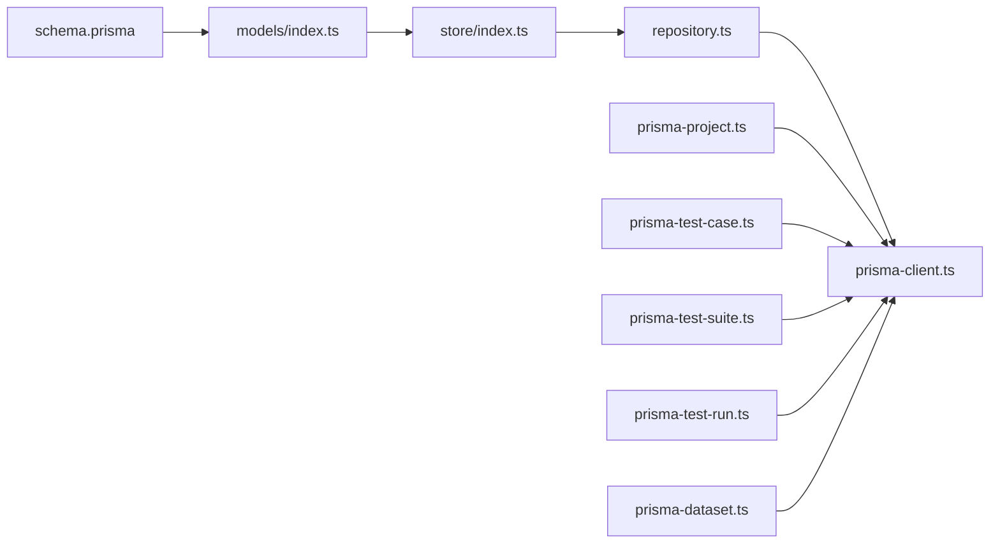

# 实体关系设计

<cite>
**本文档引用的文件**
- [schema.prisma](file://prisma/schema.prisma)
- [index.ts](file://packages/core/src/models/index.ts)
- [project.ts](file://packages/core/src/models/project.ts)
- [test-case.ts](file://packages/core/src/models/test-case.ts)
- [test-suite.ts](file://packages/core/src/models/test-suite.ts)
- [test-run.ts](file://packages/core/src/models/test-run.ts)
- [test-dataset.ts](file://packages/core/src/models/test-dataset.ts)
- [test-step.ts](file://packages/core/src/models/test-step.ts)
- [index.ts](file://packages/core/src/store/index.ts)
- [repository.ts](file://packages/core/src/store/repository.ts)
- [prisma-client.ts](file://packages/core/src/store/prisma-client.ts)
- [prisma-project.ts](file://packages/core/src/store/prisma-project.ts)
- [prisma-test-case.ts](file://packages/core/src/store/prisma-test-case.ts)
- [prisma-test-suite.ts](file://packages/core/src/store/prisma-test-suite.ts)
- [prisma-test-run.ts](file://packages/core/src/store/prisma-test-run.ts)
- [prisma-dataset.ts](file://packages/core/src/store/prisma-dataset.ts)
</cite>

## 目录
1. [简介](#简介)
2. [项目结构](#项目结构)
3. [核心组件](#核心组件)
4. [架构总览](#架构总览)
5. [详细组件分析](#详细组件分析)
6. [依赖分析](#依赖分析)
7. [性能考虑](#性能考虑)
8. [故障排除指南](#故障排除指南)
9. [结论](#结论)
10. [附录](#附录)

## 简介
本文件围绕实体关系设计进行系统性架构文档化，重点覆盖以下方面：
- 实体间的一对一、一对多、多对多关系设计与实现
- 外键约束、级联删除与引用完整性的Prisma配置
- 关系查询、预加载策略与N+1问题的解决方案
- 实体关系图与ERD图表
- 关系设计对性能的影响及优化策略
- 数据完整性检查与约束验证机制

## 项目结构
该代码库采用分层与模块化的组织方式：
- Prisma定义了统一的数据模型与关系约束
- 核心包（packages/core）提供领域模型与存储层抽象
- 存储层通过Prisma客户端进行数据库访问，并在各领域模型上提供仓储模式封装

**图表来源**
- [schema.prisma:10-196](file://prisma/schema.prisma#L10-L196)
- [index.ts:1-7](file://packages/core/src/models/index.ts#L1-L7)
- [index.ts:1-8](file://packages/core/src/store/index.ts#L1-L8)

**章节来源**
- [schema.prisma:10-196](file://prisma/schema.prisma#L10-L196)
- [index.ts:1-7](file://packages/core/src/models/index.ts#L1-L7)
- [index.ts:1-8](file://packages/core/src/store/index.ts#L1-L8)

## 核心组件
本节聚焦于Prisma数据模型中的核心实体及其关系，明确一对一、一对多、多对多关系的设计与约束。

- Project（项目）
  - 一对多：一个项目拥有多个测试用例、测试套件、测试数据集、AI配置、API端点、生成任务
  - 一对一：一个项目对应一个AI配置（唯一约束）
- TestCase（测试用例）
  - 多对一：测试用例属于一个项目
  - 一对多：测试用例可参与多个测试运行结果
- TestSuite（测试套件）
  - 多对一：测试套件属于一个项目
  - 一对多：测试套件可包含多个测试运行
- TestRun（测试运行）
  - 多对一：测试运行属于一个测试套件
  - 一对多：测试运行包含多个测试用例结果
- TestCaseResult（测试用例结果）
  - 多对一：测试用例结果属于一个测试运行
  - 一对多：测试用例结果包含多个测试步骤结果
- TestStepResult（测试步骤结果）
  - 多对一：测试步骤结果属于一个测试用例结果
- TestDataSet（测试数据集）
  - 多对一：测试数据集属于一个项目
- AiConfig（AI配置）
  - 多对一：AI配置属于一个项目（项目ID唯一）
- ApiEndpoint（API端点）
  - 多对一：API端点属于一个项目
- GenerationTask（生成任务）
  - 多对一：生成任务属于一个项目

**章节来源**
- [schema.prisma:10-196](file://prisma/schema.prisma#L10-L196)

## 架构总览
下图展示实体关系与层级依赖的整体架构，强调从Prisma模型到存储层的映射关系。

**图表来源**
- [schema.prisma:10-196](file://prisma/schema.prisma#L10-L196)

## 详细组件分析

### 一对一关系：Project ↔ AiConfig
- 设计原理
  - 通过在AiConfig中使用项目ID字段并设置唯一约束，确保每个项目仅有一个AI配置。
- 实现方式
  - 在Prisma模型中，AiConfig的projectId字段被声明为唯一，并建立到Project的外键关系。
- 级联与引用完整性
  - 删除项目时，由于关系配置为级联删除，AI配置也会被删除，保证引用完整性。
- 性能影响
  - 唯一索引可加速按项目查询AI配置，避免重复配置导致的歧义。

**图表来源**
- [schema.prisma:141-154](file://prisma/schema.prisma#L141-L154)

**章节来源**
- [schema.prisma:141-154](file://prisma/schema.prisma#L141-L154)

### 一对多关系：Project → TestCase / TestSuite / TestDataSet / ApiEndpoint / GenerationTask
- 设计原理
  - 使用外键字段（如projectId）指向Project.id，形成一对多关系。
- 实现方式
  - 各子模型均声明projectId字段，并通过@relation(fields: [projectId], references: [id], onDelete: Cascade)建立关系与级联删除。
- 级联与引用完整性
  - 删除项目会级联删除其下的所有子实体，防止悬挂引用。
- 性能影响
  - 在projectId上建立索引以提升查询效率；同时避免不必要的深度查询导致N+1问题。

**图表来源**
- [schema.prisma:26-44](file://prisma/schema.prisma#L26-L44)
- [schema.prisma:46-64](file://prisma/schema.prisma#L46-L64)
- [schema.prisma:126-139](file://prisma/schema.prisma#L126-L139)
- [schema.prisma:156-175](file://prisma/schema.prisma#L156-L175)
- [schema.prisma:177-195](file://prisma/schema.prisma#L177-L195)

**章节来源**
- [schema.prisma:26-44](file://prisma/schema.prisma#L26-L44)
- [schema.prisma:46-64](file://prisma/schema.prisma#L46-L64)
- [schema.prisma:126-139](file://prisma/schema.prisma#L126-L139)
- [schema.prisma:156-175](file://prisma/schema.prisma#L156-L175)
- [schema.prisma:177-195](file://prisma/schema.prisma#L177-L195)

### 一对多关系：TestSuite → TestRun
- 设计原理
  - 测试套件可包含多次测试运行，每次运行记录执行状态与统计信息。
- 实现方式
  - TestRun的suiteId外键指向TestSuite.id，并配置级联删除。
- 级联与引用完整性
  - 删除测试套件会级联删除其下的所有测试运行。
- 性能影响
  - 在suiteId与status上建立索引，便于筛选与聚合统计。

**图表来源**
- [schema.prisma:66-86](file://prisma/schema.prisma#L66-L86)

**章节来源**
- [schema.prisma:66-86](file://prisma/schema.prisma#L66-L86)

### 一对多关系：TestRun → TestCaseResult
- 设计原理
  - 每次测试运行会产生多个测试用例的结果。
- 实现方式
  - TestCaseResult的runId外键指向TestRun.id，并配置级联删除。
- 级联与引用完整性
  - 删除测试运行会级联删除其下的所有用例结果。
- 性能影响
  - 在runId上建立索引，支持批量查询与统计。

**图表来源**
- [schema.prisma:88-105](file://prisma/schema.prisma#L88-L105)

**章节来源**
- [schema.prisma:88-105](file://prisma/schema.prisma#L88-L105)

### 一对多关系：TestCaseResult → TestStepResult
- 设计原理
  - 每个测试用例结果包含多个测试步骤的结果。
- 实现方式
  - TestStepResult的caseResultId外键指向TestCaseResult.id，并配置级联删除。
- 级联与引用完整性
  - 删除用例结果会级联删除其下的所有步骤结果。
- 性能影响
  - 在caseResultId上建立索引，支持按用例结果聚合查询。

**图表来源**
- [schema.prisma:107-124](file://prisma/schema.prisma#L107-L124)

**章节来源**
- [schema.prisma:107-124](file://prisma/schema.prisma#L107-L124)

### 多对多关系：TestSuite ↔ TestCase（通过JSON数组间接建模）
- 设计原理
  - 通过TestSuite的testCaseIds字段存储测试用例ID列表，实现测试套件与测试用例之间的多对多关系。
- 实现方式
  - JSON数组存储，便于灵活管理套件内的用例集合。
- 级联与引用完整性
  - 该关系不直接建立外键，需在应用层维护引用完整性，确保数组中的ID在TestCase表中存在且未被删除。
- 性能影响
  - 查询时需要解析JSON数组，建议在应用层进行缓存与批量校验，避免频繁I/O与解析开销。

**图表来源**
- [schema.prisma:46-64](file://prisma/schema.prisma#L46-L64)
- [schema.prisma:26-44](file://prisma/schema.prisma#L26-L44)

**章节来源**
- [schema.prisma:46-64](file://prisma/schema.prisma#L46-L64)
- [schema.prisma:26-44](file://prisma/schema.prisma#L26-L44)

### 多对多关系：GenerationTask ↔ ApiEndpoint（通过JSON数组间接建模）
- 设计原理
  - 通过GenerationTask的endpointIds字段存储API端点ID列表，实现生成任务与API端点之间的多对多关系。
- 实现方式
  - JSON数组存储，便于灵活管理任务使用的端点集合。
- 级联与引用完整性
  - 需在应用层维护引用完整性，确保数组中的ID在ApiEndpoint表中存在且未被删除。
- 性能影响
  - 查询时需要解析JSON数组，建议在应用层进行缓存与批量校验，减少解析与I/O成本。

**图表来源**
- [schema.prisma:177-195](file://prisma/schema.prisma#L177-L195)
- [schema.prisma:156-175](file://prisma/schema.prisma#L156-L175)

**章节来源**
- [schema.prisma:177-195](file://prisma/schema.prisma#L177-L195)
- [schema.prisma:156-175](file://prisma/schema.prisma#L156-L175)

## 依赖分析
- 组件耦合与内聚
  - Prisma模型作为单一事实源，定义了实体关系与约束，核心模型与存储层通过导出入口进行解耦。
- 直接与间接依赖
  - 存储层依赖Prisma客户端，各领域仓储模块依赖通用仓库接口与Prisma客户端。
- 外部依赖与集成点
  - Prisma客户端负责数据库连接与查询执行；SQLite作为本地开发数据库。
- 接口契约与实现细节
  - 仓储模块提供统一的CRUD与关系查询接口，屏蔽底层ORM差异。

**图表来源**
- [schema.prisma:10-196](file://prisma/schema.prisma#L10-L196)
- [index.ts:1-7](file://packages/core/src/models/index.ts#L1-L7)
- [index.ts:1-8](file://packages/core/src/store/index.ts#L1-L8)

**章节来源**
- [index.ts:1-7](file://packages/core/src/models/index.ts#L1-L7)
- [index.ts:1-8](file://packages/core/src/store/index.ts#L1-L8)

## 性能考虑
- 索引策略
  - 在外键字段（如projectId、suiteId、runId、caseResultId）上建立索引，提升关联查询性能。
  - 在常用过滤字段（如status）上建立索引，支持高效筛选与聚合。
- N+1问题与预加载
  - 使用Prisma的include或select组合，一次性加载关联实体，避免逐条查询导致的N+1问题。
  - 对于复杂层级（如TestSuite → TestRun → TestCaseResult → TestStepResult），建议分步预加载并限制返回字段。
- 查询优化
  - 将JSON字段的解析逻辑下沉至数据库侧（如适用）或在应用层进行批量解析与缓存。
  - 对多对多关系（JSON数组）的查询，建议在应用层维护反向映射表或物化视图以降低解析成本。
- 写入与事务
  - 批量写入时使用事务，确保一致性与原子性；对级联删除操作，注意触发器与外键约束带来的锁竞争。
- 缓存与一致性
  - 对热点查询结果进行缓存，结合版本号或时间戳实现失效策略，平衡一致性与性能。

## 故障排除指南
- 引用完整性错误
  - 当尝试插入或更新记录时，若外键引用不存在，Prisma会抛出约束异常。应先验证父实体是否存在，再执行关联写入。
- 级联删除风险
  - 删除父实体会级联删除所有子实体，请在生产环境中谨慎执行删除操作，并做好备份与审计日志。
- JSON字段解析失败
  - 多对多关系通过JSON数组存储，若格式不正确会导致解析异常。应在入库前进行严格校验与规范化处理。
- 查询性能下降
  - 检查是否缺少必要的索引；确认是否触发了N+1问题；评估是否需要分页与投影字段裁剪。
- 并发冲突
  - 对同一资源的并发修改可能导致冲突，建议使用乐观锁或版本号字段进行冲突检测与重试。

## 结论
本实体关系设计以Prisma为核心，通过明确的外键关系与级联删除策略，实现了项目、测试套件、测试运行、用例结果与步骤结果之间的清晰层次。一对一与一对多关系通过外键与索引保障了引用完整性与查询性能；多对多关系通过JSON数组间接建模，在灵活性与可维护性之间取得平衡。配合合理的预加载策略与N+1问题治理，可在保证数据一致性的前提下获得良好的性能表现。

## 附录
- ERD图表汇总
  - 一对一：Project ↔ AiConfig
  - 一对多：Project → TestCase/TestSuite/TestDataSet/ApiEndpoint/GenerationTask
  - 一对多：TestSuite → TestRun
  - 一对多：TestRun → TestCaseResult
  - 一对多：TestCaseResult → TestStepResult
  - 多对多：TestSuite ↔ TestCase（JSON数组）
  - 多对多：GenerationTask ↔ ApiEndpoint（JSON数组）