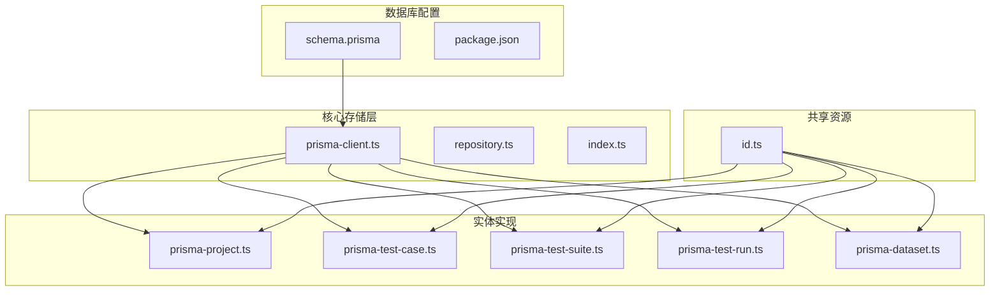
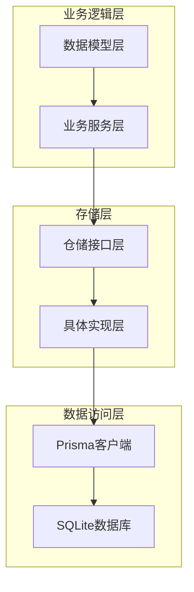
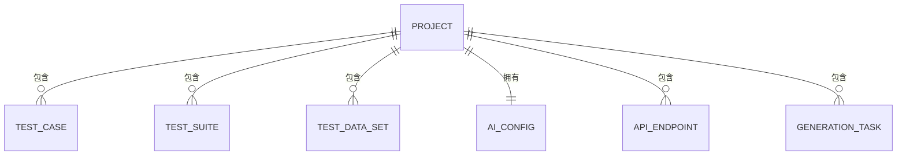
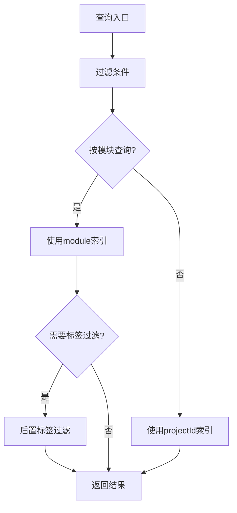
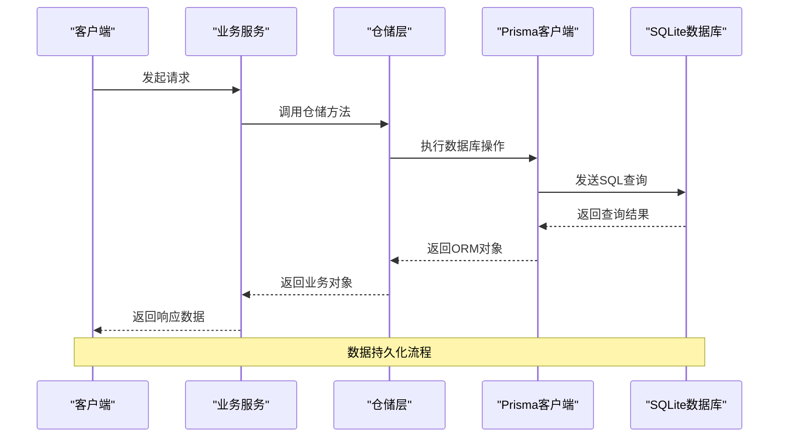
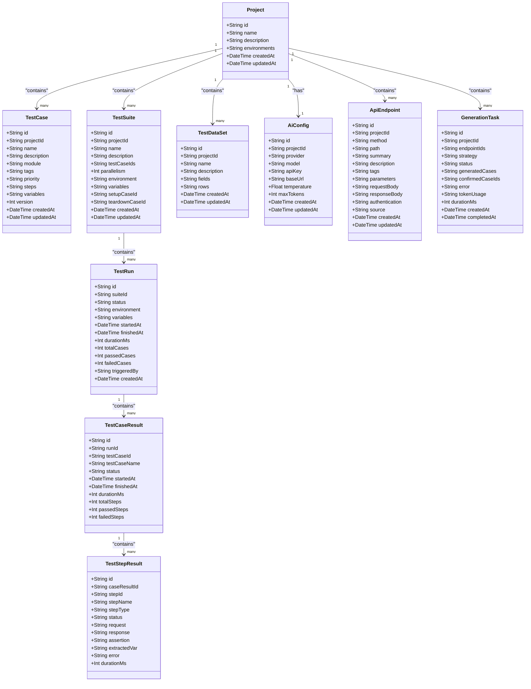

# 数据库Schema设计

<cite>
**本文档引用的文件**
- [schema.prisma](file://prisma/schema.prisma)
- [package.json](file://package.json)
- [prisma-client.ts](file://packages/core/src/store/prisma-client.ts)
- [prisma-project.ts](file://packages/core/src/store/prisma-project.ts)
- [prisma-test-case.ts](file://packages/core/src/store/prisma-test-case.ts)
- [prisma-test-suite.ts](file://packages/core/src/store/prisma-test-suite.ts)
- [prisma-test-run.ts](file://packages/core/src/store/prisma-test-run.ts)
- [prisma-dataset.ts](file://packages/core/src/store/prisma-dataset.ts)
- [repository.ts](file://packages/core/src/store/repository.ts)
- [index.ts](file://packages/core/src/store/index.ts)
- [id.ts](file://packages/shared/src/id.ts)
- [test-case.ts](file://packages/core/src/models/test-case.ts)
- [test-suite.ts](file://packages/core/src/models/test-suite.ts)
- [test-run.ts](file://packages/core/src/models/test-run.ts)
- [api-endpoint.ts](file://packages/ai/src/models/api-endpoint.ts)
- [ai-config.ts](file://packages/ai/src/models/ai-config.ts)
</cite>

## 目录
1. [简介](#简介)
2. [项目结构](#项目结构)
3. [核心组件](#核心组件)
4. [架构概览](#架构概览)
5. [详细组件分析](#详细组件分析)
6. [依赖分析](#依赖分析)
7. [性能考虑](#性能考虑)
8. [故障排除指南](#故障排除指南)
9. [结论](#结论)
10. [附录](#附录)

## 简介

本项目采用Prisma作为ORM框架，使用SQLite作为默认数据库，设计了一套完整的测试用例管理系统数据库Schema。该Schema支持测试生命周期管理、AI辅助测试生成、API端点管理等功能。

系统基于CUID生成器创建全局唯一标识符，通过JSON字段存储复杂的数据结构，实现了灵活的测试数据建模和高效的查询性能。

## 项目结构

项目采用Monorepo架构，数据库相关的核心文件位于以下位置：



**图表来源**
- [schema.prisma:1-196](file://prisma/schema.prisma#L1-L196)
- [prisma-client.ts:1-17](file://packages/core/src/store/prisma-client.ts#L1-L17)

**章节来源**
- [schema.prisma:1-196](file://prisma/schema.prisma#L1-L196)
- [package.json:1-31](file://package.json#L1-L31)

## 核心组件

### 数据库配置

系统使用SQLite作为默认数据库，通过环境变量配置数据库连接URL。Prisma客户端在应用启动时初始化，采用单例模式确保连接复用。

### 实体模型概览

系统包含7个核心实体模型，每个模型都遵循统一的命名约定和数据结构设计：

- **Project**: 项目基础信息和环境配置
- **TestCase**: 测试用例定义和执行步骤
- **TestSuite**: 测试套件和执行配置
- **TestRun**: 测试运行实例和结果统计
- **TestCaseResult**: 单个用例的执行结果
- **TestStepResult**: 步骤级执行结果和调试信息
- **TestDataSet**: 测试数据集和字段定义
- **AiConfig**: AI配置和认证信息
- **ApiEndpoint**: API端点定义和参数信息
- **GenerationTask**: AI生成任务和状态跟踪

**章节来源**
- [schema.prisma:10-196](file://prisma/schema.prisma#L10-L196)

## 架构概览

系统采用分层架构设计，从上到下分为业务逻辑层、存储层和数据访问层：



**图表来源**
- [repository.ts:1-53](file://packages/core/src/store/repository.ts#L1-L53)
- [prisma-client.ts:1-17](file://packages/core/src/store/prisma-client.ts#L1-L17)

## 详细组件分析

### Project实体设计

Project实体是系统的核心容器，负责管理测试相关的所有资源。

#### 字段定义与约束

| 字段名 | 类型 | 约束 | 默认值 | 描述 |
|--------|------|------|--------|------|
| id | String | @id | - | 主键，使用CUID生成 |
| name | String | - | - | 项目名称，必填 |
| description | String | - | null | 项目描述 |
| environments | String | - | "[]" | JSON数组，存储环境配置对象 |
| createdAt | DateTime | @default(now()) | now() | 创建时间 |
| updatedAt | DateTime | @updatedAt | - | 更新时间 |

#### 关系映射

Project实体与多个子实体建立一对多关系：
- 一个项目可包含多个测试用例
- 一个项目可包含多个测试套件  
- 一个项目可包含多个测试数据集
- 一个项目对应一个AI配置
- 一个项目可包含多个API端点
- 一个项目可包含多个生成任务

#### 索引策略



**图表来源**
- [schema.prisma:10-24](file://prisma/schema.prisma#L10-L24)

**章节来源**
- [schema.prisma:10-24](file://prisma/schema.prisma#L10-L24)
- [prisma-project.ts:6-15](file://packages/core/src/store/prisma-project.ts#L6-L15)

### TestCase实体设计

TestCase实体定义了完整的测试用例结构，支持复杂的测试步骤和变量管理。

#### 字段定义与约束

| 字段名 | 类型 | 约束 | 默认值 | 描述 |
|--------|------|------|--------|------|
| id | String | @id | - | 主键，使用CUID生成 |
| projectId | String | - | - | 外键，关联到Project |
| name | String | - | - | 用例名称，必填，长度1-200字符 |
| description | String | - | null | 用例描述 |
| module | String | @default("") | "" | 模块标识 |
| tags | String | @default("[]") | "[]" | JSON数组，标签列表 |
| priority | String | @default("medium") | "medium" | 优先级：critical/high/medium/low |
| steps | String | @default("[]") | "[]" | JSON数组，测试步骤定义 |
| variables | String | @default("{}") | "{}" | JSON对象，变量映射 |
| version | Int | @default(1) | 1 | 版本号，用于并发控制 |
| createdAt | DateTime | @default(now()) | now() | 创建时间 |
| updatedAt | DateTime | @updatedAt | - | 更新时间 |

#### 关系映射

TestCase与Project建立多对一关系，同时通过外键字段projectId维护引用完整性。

#### 索引策略



**图表来源**
- [schema.prisma:26-44](file://prisma/schema.prisma#L26-L44)

**章节来源**
- [schema.prisma:26-44](file://prisma/schema.prisma#L26-L44)
- [prisma-test-case.ts:6-21](file://packages/core/src/store/prisma-test-case.ts#L6-L21)

### TestSuite实体设计

TestSuite实体管理测试套件的组织和执行配置。

#### 字段定义与约束

| 字段名 | 类型 | 约束 | 默认值 | 描述 |
|--------|------|------|--------|------|
| id | String | @id | - | 主键，使用CUID生成 |
| projectId | String | - | - | 外键，关联到Project |
| name | String | - | - | 套件名称，必填，长度1-200字符 |
| description | String | - | null | 套件描述 |
| testCaseIds | String | @default("[]") | "[]" | JSON数组，包含的用例ID |
| parallelism | Int | @default(1) | 1 | 并行度设置 |
| environment | String | - | null | 环境配置 |
| variables | String | @default("{}") | "{}" | JSON对象，变量映射 |
| setupCaseId | String | - | null | 设置用例ID |
| teardownCaseId | String | - | null | 清理用例ID |
| createdAt | DateTime | @default(now()) | now() | 创建时间 |
| updatedAt | DateTime | @updatedAt | - | 更新时间 |

#### 关系映射

TestSuite与Project建立多对一关系，并与TestRun建立一对多关系。

#### 索引策略

**章节来源**
- [schema.prisma:46-64](file://prisma/schema.prisma#L46-L64)
- [prisma-test-suite.ts:6-21](file://packages/core/src/store/prisma-test-suite.ts#L6-L21)

### TestRun实体设计

TestRun实体跟踪测试运行的完整生命周期和执行结果。

#### 字段定义与约束

| 字段名 | 类型 | 约束 | 默认值 | 描述 |
|--------|------|------|--------|------|
| id | String | @id | - | 主键，使用CUID生成 |
| suiteId | String | - | - | 外键，关联到TestSuite |
| status | String | @default("pending") | "pending" | 运行状态 |
| environment | String | - | - | 执行环境 |
| variables | String | @default("{}") | "{}" | JSON对象，执行变量 |
| startedAt | DateTime | @default(now()) | now() | 开始时间 |
| finishedAt | DateTime | - | null | 结束时间 |
| durationMs | Int | - | null | 持续时间（毫秒） |
| totalCases | Int | @default(0) | 0 | 总用例数 |
| passedCases | Int | @default(0) | 0 | 通过用例数 |
| failedCases | Int | @default(0) | 0 | 失败用例数 |
| triggeredBy | String | @default("manual") | "manual" | 触发方式 |
| createdAt | DateTime | @default(now()) | now() | 创建时间 |

#### 关系映射

TestRun与TestSuite建立多对一关系，并与TestCaseResult建立一对多关系。

#### 索引策略

**章节来源**
- [schema.prisma:66-86](file://prisma/schema.prisma#L66-L86)
- [prisma-test-run.ts:11-28](file://packages/core/src/store/prisma-test-run.ts#L11-L28)

### TestCaseResult实体设计

TestCaseResult实体记录单个测试用例的执行结果和统计信息。

#### 字段定义与约束

| 字段名 | 类型 | 约束 | 默认值 | 描述 |
|--------|------|------|--------|------|
| id | String | @id | - | 主键，使用CUID生成 |
| runId | String | - | - | 外键，关联到TestRun |
| testCaseId | String | - | - | 关联的测试用例ID |
| testCaseName | String | - | - | 关联的测试用例名称 |
| status | String | @default("skipped") | "skipped" | 执行状态 |
| startedAt | DateTime | @default(now()) | now() | 开始时间 |
| finishedAt | DateTime | - | null | 结束时间 |
| durationMs | Int | - | null | 持续时间（毫秒） |
| totalSteps | Int | @default(0) | 0 | 总步骤数 |
| passedSteps | Int | @default(0) | 0 | 通过步骤数 |
| failedSteps | Int | @default(0) | 0 | 失败步骤数 |

#### 关系映射

TestCaseResult与TestRun建立多对一关系，并与TestStepResult建立一对多关系。

#### 索引策略

**章节来源**
- [schema.prisma:88-105](file://prisma/schema.prisma#L88-L105)
- [prisma-test-run.ts:30-45](file://packages/core/src/store/prisma-test-run.ts#L30-L45)

### TestStepResult实体设计

TestStepResult实体详细记录测试步骤的执行过程和结果。

#### 字段定义与约束

| 字段名 | 类型 | 约束 | 默认值 | 描述 |
|--------|------|------|--------|------|
| id | String | @id | - | 主键，使用CUID生成 |
| caseResultId | String | - | - | 外键，关联到TestCaseResult |
| stepId | String | - | - | 关联的步骤ID |
| stepName | String | - | - | 步骤名称 |
| stepType | String | - | - | 步骤类型 |
| status | String | @default("skipped") | "skipped" | 执行状态 |
| request | String | - | null | JSON对象，HTTP请求详情 |
| response | String | - | null | JSON对象，HTTP响应详情 |
| assertion | String | - | null | JSON对象，断言结果 |
| extractedVar | String | - | null | JSON对象，提取的变量 |
| error | String | - | null | JSON对象，错误信息 |
| durationMs | Int | @default(0) | 0 | 持续时间（毫秒） |

#### 关系映射

TestStepResult与TestCaseResult建立多对一关系。

#### 索引策略

**章节来源**
- [schema.prisma:107-124](file://prisma/schema.prisma#L107-L124)
- [prisma-test-run.ts:47-62](file://packages/core/src/store/prisma-test-run.ts#L47-L62)

### TestDataSet实体设计

TestDataSet实体管理测试数据集和字段定义。

#### 字段定义与约束

| 字段名 | 类型 | 约束 | 默认值 | 描述 |
|--------|------|------|--------|------|
| id | String | @id | - | 主键，使用CUID生成 |
| projectId | String | - | - | 外键，关联到Project |
| name | String | - | - | 数据集名称，必填，长度1-200字符 |
| description | String | - | null | 数据集描述 |
| fields | String | @default("[]") | "[]" | JSON数组，字段定义 |
| rows | String | @default("[]") | "[]" | JSON数组，数据行 |
| createdAt | DateTime | @default(now()) | now() | 创建时间 |
| updatedAt | DateTime | @updatedAt | - | 更新时间 |

#### 关系映射

TestDataSet与Project建立多对一关系。

#### 索引策略

**章节来源**
- [schema.prisma:126-139](file://prisma/schema.prisma#L126-L139)
- [prisma-dataset.ts:10-21](file://packages/core/src/store/prisma-dataset.ts#L10-L21)

### AiConfig实体设计

AiConfig实体管理AI配置和认证信息。

#### 字段定义与约束

| 字段名 | 类型 | 约束 | 默认值 | 描述 |
|--------|------|------|--------|------|
| id | String | @id | - | 主键，使用CUID生成 |
| projectId | String | @unique | - | 唯一键，关联到Project |
| provider | String | - | - | AI提供商：openai/anthropic/custom |
| model | String | - | - | 模型名称 |
| apiKey | String | - | - | 加密的API密钥 |
| baseUrl | String | - | null | 自定义API基础URL |
| temperature | Float | @default(0.7) | 0.7 | 采样温度 |
| maxTokens | Int | @default(4096) | 4096 | 最大令牌数 |
| createdAt | DateTime | @default(now()) | now() | 创建时间 |
| updatedAt | DateTime | @updatedAt | - | 更新时间 |

#### 关系映射

AiConfig与Project建立一对一关系。

#### 索引策略

**章节来源**
- [schema.prisma:141-154](file://prisma/schema.prisma#L141-L154)

### ApiEndpoint实体设计

ApiEndpoint实体管理API端点定义和参数信息。

#### 字段定义与约束

| 字段名 | 类型 | 约束 | 默认值 | 描述 |
|--------|------|------|--------|------|
| id | String | @id | - | 主键，使用CUID生成 |
| projectId | String | - | - | 外键，关联到Project |
| method | String | - | - | HTTP方法：GET/POST/PUT/PATCH/DELETE |
| path | String | - | - | API路径，支持路径参数 |
| summary | String | - | - | 端点摘要 |
| description | String | - | null | 详细描述 |
| tags | String | @default("[]") | "[]" | JSON数组，标签列表 |
| parameters | String | @default("[]") | "[]" | JSON数组，参数定义 |
| requestBody | String | - | null | JSON对象，请求体模式 |
| responseBody | String | - | null | JSON对象，响应体模式 |
| authentication | String | - | null | 认证方式：bearer/api-key/basic/none |
| source | String | @default("manual") | "manual" | 来源类型 |
| createdAt | DateTime | @default(now()) | now() | 创建时间 |
| updatedAt | DateTime | @updatedAt | - | 更新时间 |

#### 关系映射

ApiEndpoint与Project建立多对一关系。

#### 索引策略

**章节来源**
- [schema.prisma:156-175](file://prisma/schema.prisma#L156-L175)

### GenerationTask实体设计

GenerationTask实体管理AI生成任务和状态跟踪。

#### 字段定义与约束

| 字段名 | 类型 | 约束 | 默认值 | 描述 |
|--------|------|------|--------|------|
| id | String | @id | - | 主键，使用CUID生成 |
| projectId | String | - | - | 外键，关联到Project |
| endpointIds | String | @default("[]") | "[]" | JSON数组，关联的端点ID |
| strategy | String | - | - | 生成策略：happy_path/error_cases/auth_cases/comprehensive |
| status | String | @default("pending") | "pending" | 任务状态 |
| generatedCases | String | @default("[]") | "[]" | JSON数组，预览的生成用例 |
| confirmedCaseIds | String | @default("[]") | "[]" | JSON数组，确认的用例ID |
| error | String | - | null | 错误信息 |
| tokenUsage | String | - | null | JSON对象，令牌使用统计 |
| durationMs | Int | - | null | 持续时间（毫秒） |
| createdAt | DateTime | @default(now()) | now() | 创建时间 |
| completedAt | DateTime | - | null | 完成时间 |

#### 关系映射

GenerationTask与Project建立多对一关系。

#### 索引策略

**章节来源**
- [schema.prisma:177-195](file://prisma/schema.prisma#L177-L195)

## 依赖分析

系统采用清晰的依赖层次结构，确保各层之间的松耦合：

```mermaid
graph TB
subgraph "外部依赖"
PRISMA_CLIENT[@prisma/client]
ZOD[zod]
CUID[@paralleldrive/cuid2]
end
subgraph "核心层"
STORE[存储层]
MODELS[模型层]
SHARED[共享层]
end
subgraph "业务层"
CORE[核心业务]
AI[AI业务]
end
PRISMA_CLIENT --> STORE
ZOD --> MODELS
CUID --> SHARED
STORE --> CORE
MODELS --> CORE
SHARED --> CORE
STORE --> AI
MODELS --> AI
```

**图表来源**
- [package.json:27-28](file://package.json#L27-L28)
- [repository.ts:1-18](file://packages/core/src/store/repository.ts#L1-L18)

### 数据流图

系统中的主要数据流包括：



**图表来源**
- [prisma-client.ts:5-10](file://packages/core/src/store/prisma-client.ts#L5-L10)
- [prisma-project.ts:18-28](file://packages/core/src/store/prisma-project.ts#L18-L28)

**章节来源**
- [repository.ts:20-53](file://packages/core/src/store/repository.ts#L20-L53)
- [index.ts:1-7](file://packages/core/src/store/index.ts#L1-L7)

## 性能考虑

### 索引策略

系统在关键查询字段上建立了适当的索引以优化查询性能：

1. **主键索引**: 所有实体的主键自动创建唯一索引
2. **外键索引**: 在所有外键字段上创建索引
3. **常用查询字段索引**: 
   - TestCase: projectId, module
   - TestSuite: projectId
   - TestRun: suiteId, status
   - TestCaseResult: runId
   - TestStepResult: caseResultId
   - TestDataSet: projectId
   - GenerationTask: projectId, status

### JSON字段优化

系统大量使用JSON字段存储复杂数据结构，采用以下优化策略：

1. **最小化JSON存储**: 只存储必要的字段，避免冗余数据
2. **标准化数据格式**: 统一JSON数据结构，便于查询和解析
3. **后置过滤**: 对于SQLite不支持的JSON查询，采用后置过滤策略

### 连接池配置

Prisma客户端默认使用连接池管理数据库连接，支持以下配置选项：

- **connectionLimit**: 最大连接数
- **queueLimit**: 队列等待数量
- **acquireTimeout**: 获取连接超时时间
- **idleTimeout**: 连接空闲超时时间

### 查询优化

1. **批量操作**: 使用事务批量执行相关操作
2. **延迟加载**: 对于大型JSON字段采用延迟加载策略
3. **分页查询**: 对于大数据集采用分页查询避免内存溢出

## 故障排除指南

### 常见问题及解决方案

#### 数据库连接问题

**症状**: 应用启动时报数据库连接错误
**原因**: DATABASE_URL环境变量未正确设置或数据库文件权限问题
**解决方案**: 
1. 检查DATABASE_URL环境变量格式
2. 确认数据库文件存在且具有读写权限
3. 验证SQLite版本兼容性

#### JSON字段解析错误

**症状**: 查询时出现JSON解析异常
**原因**: JSON数据格式不符合预期或数据损坏
**解决方案**:
1. 验证JSON数据格式的有效性
2. 检查数据序列化和反序列化的正确性
3. 实施数据验证和清理机制

#### 并发更新冲突

**症状**: 更新操作失败或数据不一致
**原因**: 多个进程同时修改同一记录
**解决方案**:
1. 使用version字段实现乐观锁
2. 实施重试机制处理并发冲突
3. 采用事务保证操作原子性

**章节来源**
- [prisma-test-case.ts:101-126](file://packages/core/src/store/prisma-test-case.ts#L101-L126)
- [prisma-client.ts:12-17](file://packages/core/src/store/prisma-client.ts#L12-L17)

## 结论

本数据库Schema设计充分考虑了测试用例管理系统的特殊需求，通过合理的实体关系设计、灵活的JSON字段使用和完善的索引策略，实现了高效的数据存储和查询能力。

系统采用的架构模式确保了良好的可扩展性和维护性，为后续的功能扩展奠定了坚实的基础。通过实施相应的性能优化措施和故障排除方案，可以进一步提升系统的稳定性和可靠性。

## 附录

### 数据模型类图



**图表来源**
- [schema.prisma:10-196](file://prisma/schema.prisma#L10-L196)

### 数据库迁移策略

系统采用以下迁移策略确保数据一致性：

1. **版本管理**: 通过Prisma的迁移功能管理数据库结构变更
2. **向后兼容**: 新增字段时提供默认值，确保现有数据兼容
3. **数据转换**: 对于结构变更实施数据转换脚本
4. **备份策略**: 在执行重大变更前自动备份数据库

### SQLite配置最佳实践

1. **连接设置**: 合理配置连接池大小和超时参数
2. **事务处理**: 使用显式事务确保数据一致性
3. **索引优化**: 定期分析查询模式优化索引策略
4. **监控告警**: 实施数据库性能监控和异常告警机制