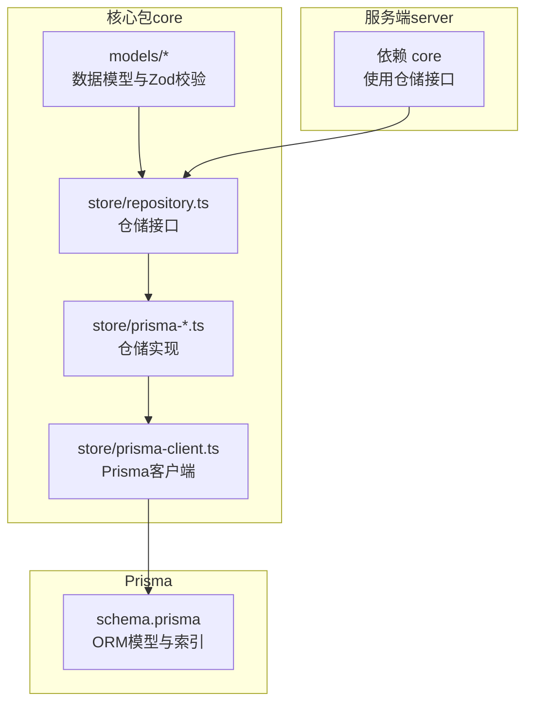
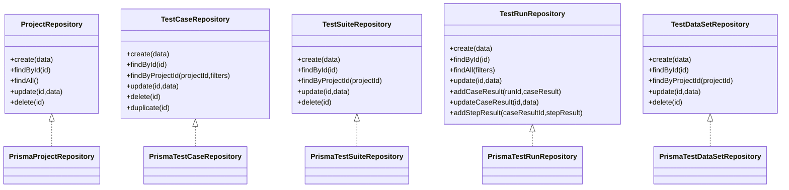

# 数据模型

<cite>
**本文引用的文件**
- [schema.prisma](file://prisma/schema.prisma)
- [prisma-client.ts](file://packages/core/src/store/prisma-client.ts)
- [repository.ts](file://packages/core/src/store/repository.ts)
- [prisma-project.ts](file://packages/core/src/store/prisma-project.ts)
- [prisma-test-case.ts](file://packages/core/src/store/prisma-test-case.ts)
- [prisma-test-suite.ts](file://packages/core/src/store/prisma-test-suite.ts)
- [prisma-test-run.ts](file://packages/core/src/store/prisma-test-run.ts)
- [prisma-dataset.ts](file://packages/core/src/store/prisma-dataset.ts)
- [project.ts](file://packages/core/src/models/project.ts)
- [test-case.ts](file://packages/core/src/models/test-case.ts)
- [test-suite.ts](file://packages/core/src/models/test-suite.ts)
- [test-run.ts](file://packages/core/src/models/test-run.ts)
- [test-dataset.ts](file://packages/core/src/models/test-dataset.ts)
- [package.json（服务端）](file://packages/server/package.json)
</cite>

## 目录
1. [简介](#简介)
2. [项目结构](#项目结构)
3. [核心组件](#核心组件)
4. [架构总览](#架构总览)
5. [详细组件分析](#详细组件分析)
6. [依赖分析](#依赖分析)
7. [性能考虑](#性能考虑)
8. [故障排查指南](#故障排查指南)
9. [结论](#结论)
10. [附录](#附录)

## 简介
本文件系统性梳理了本项目的“数据模型与架构”，围绕以下目标展开：
- 数据库实体关系设计、字段定义与数据类型
- 核心数据模型：Project、TestCase、TestSuite、TestRun 的结构与关系
- Prisma ORM 配置、数据访问层实现与仓储模式设计
- 数据模型图、索引策略与查询优化建议
- 数据验证规则、业务约束与数据完整性保障
- 数据迁移策略、版本管理与备份恢复机制

## 项目结构
本项目采用多包工作区组织，数据模型与访问层集中在 core 包中，Prisma 模型定义位于仓库根目录的 prisma 目录；服务端依赖 core 提供的数据模型与存储能力。



**图表来源**
- [schema.prisma](file://prisma/schema.prisma)
- [prisma-client.ts](file://packages/core/src/store/prisma-client.ts)
- [repository.ts](file://packages/core/src/store/repository.ts)
- [prisma-project.ts](file://packages/core/src/store/prisma-project.ts)
- [prisma-test-case.ts](file://packages/core/src/store/prisma-test-case.ts)
- [prisma-test-suite.ts](file://packages/core/src/store/prisma-test-suite.ts)
- [prisma-test-run.ts](file://packages/core/src/store/prisma-test-run.ts)
- [prisma-dataset.ts](file://packages/core/src/store/prisma-dataset.ts)
- [package.json（服务端）](file://packages/server/package.json)

**章节来源**
- [schema.prisma](file://prisma/schema.prisma)
- [prisma-client.ts](file://packages/core/src/store/prisma-client.ts)
- [repository.ts](file://packages/core/src/store/repository.ts)
- [package.json（服务端）](file://packages/server/package.json)

## 核心组件
- 数据模型层：以 Zod 定义强类型与校验规则，确保输入输出一致性与可预测性。
- 仓储接口层：统一抽象 CRUD 与聚合查询，隔离具体持久化实现。
- 仓储实现层：基于 Prisma ORM 实现各实体的读写、分页、过滤与关联加载。
- Prisma 客户端：单例化 PrismaClient，集中连接管理与生命周期控制。

**章节来源**
- [project.ts](file://packages/core/src/models/project.ts)
- [test-case.ts](file://packages/core/src/models/test-case.ts)
- [test-suite.ts](file://packages/core/src/models/test-suite.ts)
- [test-run.ts](file://packages/core/src/models/test-run.ts)
- [test-dataset.ts](file://packages/core/src/models/test-dataset.ts)
- [repository.ts](file://packages/core/src/store/repository.ts)
- [prisma-client.ts](file://packages/core/src/store/prisma-client.ts)

## 架构总览
下图展示数据模型在 Prisma 中的实体关系、字段与索引，以及仓储层如何通过 Prisma 访问这些实体。

```mermaid
erDiagram
PROJECT ||--o{ TEST_CASE : "拥有"
PROJECT ||--o{ TEST_SUITE : "拥有"
PROJECT ||--o{ TEST_DATA_SET : "拥有"
PROJECT ||--o{ AI_CONFIG : "拥有"
PROJECT ||--o{ API_ENDPOINT : "拥有"
PROJECT ||--o{ GENERATION_TASK : "拥有"
TEST_SUITE ||--o{ TEST_RUN : "包含"
TEST_RUN ||--o{ TEST_CASE_RESULT : "产生"
TEST_CASE_RESULT ||--o{ TEST_STEP_RESULT : "包含"
PROJECT {
string id PK
string name
string description
json environments
datetime createdAt
datetime updatedAt
}
TEST_CASE {
string id PK
string projectId FK
string name
string description
string module
json tags
string priority
json steps
json variables
int version
datetime createdAt
datetime updatedAt
}
TEST_SUITE {
string id PK
string projectId FK
string name
string description
json testCaseIds
int parallelism
string environment
json variables
string setupCaseId
string teardownCaseId
datetime createdAt
datetime updatedAt
}
TEST_RUN {
string id PK
string suiteId FK
string status
string environment
json variables
datetime startedAt
datetime finishedAt
int durationMs
int totalCases
int passedCases
int failedCases
string triggeredBy
datetime createdAt
}
TEST_CASE_RESULT {
string id PK
string runId FK
string testCaseId
string testCaseName
string status
datetime startedAt
datetime finishedAt
int durationMs
int totalSteps
int passedSteps
int failedSteps
}
TEST_STEP_RESULT {
string id PK
string caseResultId FK
string stepId
string stepName
string stepType
string status
json request
json response
json assertion
json extractedVar
json error
int durationMs
}
TEST_DATA_SET {
string id PK
string projectId FK
string name
string description
json fields
json rows
datetime createdAt
datetime updatedAt
}
AI_CONFIG {
string id PK
string projectId FK UK
string provider
string model
string apiKey
string baseUrl
float temperature
int maxTokens
datetime createdAt
datetime updatedAt
}
API_ENDPOINT {
string id PK
string projectId FK
string method
string path
string summary
string description
json tags
json parameters
json requestBody
json responseBody
string authentication
string source
datetime createdAt
datetime updatedAt
}
GENERATION_TASK {
string id PK
string projectId FK
json endpointIds
string strategy
string status
json generatedCases
json confirmedCaseIds
string error
json tokenUsage
int durationMs
datetime createdAt
datetime completedAt
}
```

**图表来源**
- [schema.prisma](file://prisma/schema.prisma)

## 详细组件分析

### Project（项目）
- 职责：承载测试环境、AI 配置、接口定义、用例与套件的上下文。
- 关键字段与类型：字符串标识、名称与描述、JSON 字符串表示的环境数组、时间戳。
- 约束与默认值：环境字段默认空数组；创建与更新时间自动维护。
- 业务关系：一对多关联到 TestCase、TestSuite、TestDataSet、AiConfig、ApiEndpoint、GenerationTask。
- 索引：无显式索引，但作为外键被隐式索引覆盖。

**章节来源**
- [schema.prisma](file://prisma/schema.prisma)
- [project.ts](file://packages/core/src/models/project.ts)
- [prisma-project.ts](file://packages/core/src/store/prisma-project.ts)

### TestCase（测试用例）
- 职责：描述单个测试场景，包含步骤、变量、优先级与标签。
- 关键字段与类型：字符串标识、所属项目、名称、描述、模块、JSON 表示的标签数组、优先级枚举、JSON 步骤数组、JSON 变量记录、版本号。
- 约束与默认值：模块与标签默认空、优先级默认中等、步骤默认空数组、变量默认空对象、版本默认 1。
- 查询能力：支持按模块前缀、优先级、关键词搜索、分页；标签过滤在应用侧进行（SQLite 不支持 JSON 数组原生查询）。
- 版本控制：每次更新递增版本号，便于审计与并发冲突检测。

**章节来源**
- [schema.prisma](file://prisma/schema.prisma)
- [test-case.ts](file://packages/core/src/models/test-case.ts)
- [prisma-test-case.ts](file://packages/core/src/store/prisma-test-case.ts)

### TestSuite（测试套件）
- 职责：编排多个用例、设置并行度、环境变量与初始化/收尾用例。
- 关键字段与类型：字符串标识、所属项目、名称、描述、JSON 表示的用例 ID 列表、并行度、环境、JSON 变量、setup/teardown 用例 ID。
- 约束与默认值：并行度默认 1；变量默认空对象；用例 ID 列表默认空数组。
- 关联：一对多关联到 TestRun。

**章节来源**
- [schema.prisma](file://prisma/schema.prisma)
- [test-suite.ts](file://packages/core/src/models/test-suite.ts)
- [prisma-test-suite.ts](file://packages/core/src/store/prisma-test-suite.ts)

### TestRun（测试运行）
- 职责：一次套件执行的实例，记录状态、计数与触发方式。
- 关键字段与类型：字符串标识、所属套件、状态枚举、环境、JSON 变量、开始/结束时间、耗时、用例总数与通过/失败计数、触发来源、创建时间。
- 约束与默认值：状态默认 pending、触发来源默认 manual；计数器默认 0。
- 关联：一对多关联到 TestCaseResult；支持包含加载结果及其步骤。

**章节来源**
- [schema.prisma](file://prisma/schema.prisma)
- [test-run.ts](file://packages/core/src/models/test-run.ts)
- [prisma-test-run.ts](file://packages/core/src/store/prisma-test-run.ts)

### TestCaseResult（用例结果）
- 职责：记录单个用例在某次运行中的执行结果与统计。
- 关键字段与类型：字符串标识、所属运行、用例标识与名称、状态、开始/结束时间、耗时、步骤总数与通过/失败计数。
- 关联：一对多关联到 TestStepResult。

**章节来源**
- [schema.prisma](file://prisma/schema.prisma)
- [test-run.ts](file://packages/core/src/models/test-run.ts)
- [prisma-test-run.ts](file://packages/core/src/store/prisma-test-run.ts)

### TestStepResult（步骤结果）
- 职责：记录单步执行的请求、响应、断言、变量提取、错误与耗时。
- 关键字段与类型：字符串标识、所属用例结果、步骤标识与名称、步骤类型、状态、JSON 请求/响应/断言/变量/错误、耗时。
- 关联：属于某个用例结果。

**章节来源**
- [schema.prisma](file://prisma/schema.prisma)
- [test-run.ts](file://packages/core/src/models/test-run.ts)
- [prisma-test-run.ts](file://packages/core/src/store/prisma-test-run.ts)

### TestDataSet（测试数据集）
- 职责：为用例提供结构化数据（字段定义与行数据）。
- 关键字段与类型：字符串标识、所属项目、名称、描述、JSON 字段定义数组、JSON 行数组。
- 约束与默认值：字段与行默认空数组。

**章节来源**
- [schema.prisma](file://prisma/schema.prisma)
- [test-dataset.ts](file://packages/core/src/models/test-dataset.ts)
- [prisma-dataset.ts](file://packages/core/src/store/prisma-dataset.ts)

### 其他实体
- AiConfig：项目级 AI 配置（提供方、模型、密钥、温度、最大 Token 等），一对一关联到 Project。
- ApiEndpoint：项目级接口定义（方法、路径、参数、认证等），一对一关联到 Project。
- GenerationTask：项目级生成任务（策略、状态、预览与确认用例、用量统计等），一对一关联到 Project。

**章节来源**
- [schema.prisma](file://prisma/schema.prisma)

## 依赖分析
- 仓储接口统一抽象 CRUD 与聚合查询，避免上层直接依赖 Prisma。
- 仓储实现通过 PrismaClient 访问数据库，负责 JSON 字段序列化/反序列化与分页统计。
- 服务端通过依赖注入或直接导入仓储接口使用数据访问能力。



**图表来源**
- [repository.ts](file://packages/core/src/store/repository.ts)
- [prisma-project.ts](file://packages/core/src/store/prisma-project.ts)
- [prisma-test-case.ts](file://packages/core/src/store/prisma-test-case.ts)
- [prisma-test-suite.ts](file://packages/core/src/store/prisma-test-suite.ts)
- [prisma-test-run.ts](file://packages/core/src/store/prisma-test-run.ts)
- [prisma-dataset.ts](file://packages/core/src/store/prisma-dataset.ts)

**章节来源**
- [repository.ts](file://packages/core/src/store/repository.ts)
- [prisma-client.ts](file://packages/core/src/store/prisma-client.ts)

## 性能考虑
- 索引策略
  - 已有索引：TestCase 的 projectId、module；TestSuite 的 projectId；TestRun 的 suiteId、status；TestCaseResult 的 runId；TestStepResult 的 caseResultId；TestDataSet 的 projectId；AiConfig 的 projectId（唯一）；GenerationTask 的 projectId、status。
  - 建议：如按模块/优先级/标签组合查询频繁，可在 TestCase 上增加复合索引；对 TestRun 的 status+createdAt 组合查询可考虑复合索引。
- 分页与统计
  - 仓储实现普遍采用分页 + count 并行查询，降低延迟与提升吞吐。
- JSON 字段处理
  - 多处 JSON 字段（steps、variables、parameters 等）在入库前序列化，在出库后反序列化，注意避免不必要的重复转换。
- 连接管理
  - 单例 PrismaClient 减少连接开销与资源泄漏风险。

**章节来源**
- [schema.prisma](file://prisma/schema.prisma)
- [prisma-test-case.ts](file://packages/core/src/store/prisma-test-case.ts)
- [prisma-test-run.ts](file://packages/core/src/store/prisma-test-run.ts)
- [prisma-client.ts](file://packages/core/src/store/prisma-client.ts)

## 故障排查指南
- 常见问题
  - JSON 字段解析异常：检查序列化/反序列化边界，确保入参与数据库字段一致。
  - SQLite JSON 查询限制：标签过滤在应用侧完成，避免期望原生 JSON 数组匹配。
  - 外键删除行为：所有关系均配置级联删除，删除父实体会级联删除子实体，请谨慎操作。
- 排查步骤
  - 核对 Prisma 模型与仓储映射是否一致。
  - 使用仓储接口的分页与过滤参数进行最小复现。
  - 检查 Prisma 客户端连接状态与日志。
- 监控建议
  - 对高频查询建立慢查询监控与重试策略。
  - 对 JSON 字段变更建立审计日志（可通过版本号与更新时间辅助定位）。

**章节来源**
- [schema.prisma](file://prisma/schema.prisma)
- [prisma-test-case.ts](file://packages/core/src/store/prisma-test-case.ts)
- [prisma-test-run.ts](file://packages/core/src/store/prisma-test-run.ts)
- [prisma-client.ts](file://packages/core/src/store/prisma-client.ts)

## 结论
本项目以清晰的仓储接口与 Prisma ORM 实现，构建了可扩展、可维护的数据层。通过 Zod 校验与 JSON 字段建模，兼顾灵活性与一致性。建议后续在热点查询上引入复合索引与缓存，并完善迁移与备份流程以保障生产稳定性。

## 附录

### 数据验证规则与业务约束
- Project：名称长度限制、环境数组结构校验。
- TestCase：名称长度限制、优先级枚举、步骤与变量结构校验、版本自增。
- TestSuite：名称长度限制、并行度最小值、setup/teardown 可空。
- TestRun：状态枚举、计数器非负、触发来源枚举。
- TestStepResult：请求/响应/断言/变量/错误结构校验、耗时非负。
- TestDataSet：字段类型枚举、行数据结构校验。

**章节来源**
- [project.ts](file://packages/core/src/models/project.ts)
- [test-case.ts](file://packages/core/src/models/test-case.ts)
- [test-suite.ts](file://packages/core/src/models/test-suite.ts)
- [test-run.ts](file://packages/core/src/models/test-run.ts)
- [test-dataset.ts](file://packages/core/src/models/test-dataset.ts)

### 数据完整性与一致性
- 外键约束与级联删除：确保父子关系一致。
- 默认值与必填：通过 Prisma 默认值与 Zod 必填约束共同保障。
- 版本号：用例更新时递增，便于审计与并发控制。

**章节来源**
- [schema.prisma](file://prisma/schema.prisma)
- [prisma-test-case.ts](file://packages/core/src/store/prisma-test-case.ts)

### 数据迁移、版本管理与备份恢复
- 迁移策略
  - 使用 Prisma Migrate 管理结构变更，遵循“不可破坏性”原则：新增列、添加默认值、避免删除列或修改列类型。
  - 对 JSON 字段变更，先在应用层兼容旧格式，再逐步迁移。
- 版本管理
  - 通过 Prisma 版本追踪与 Git 管理迁移脚本，确保团队协作一致性。
- 备份与恢复
  - SQLite 场景建议定期导出数据库文件；生产环境建议使用专用备份工具与快照策略。
  - 恢复时先回滚到稳定版本，再逐步应用迁移。

**章节来源**
- [schema.prisma](file://prisma/schema.prisma)