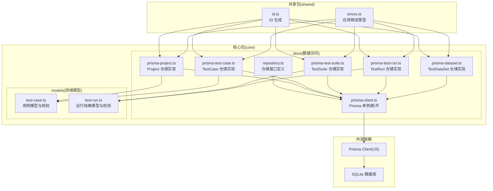
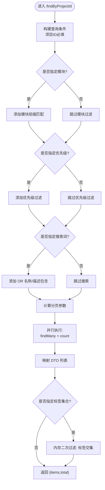
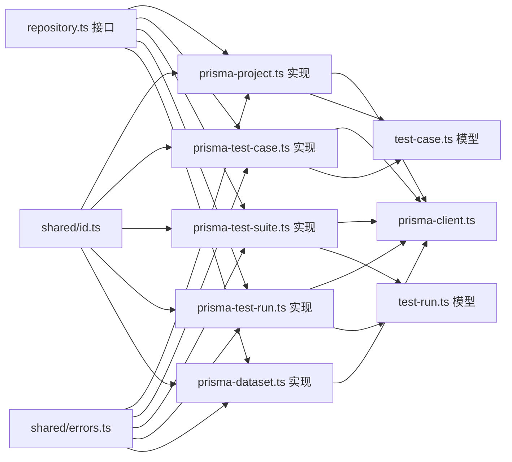
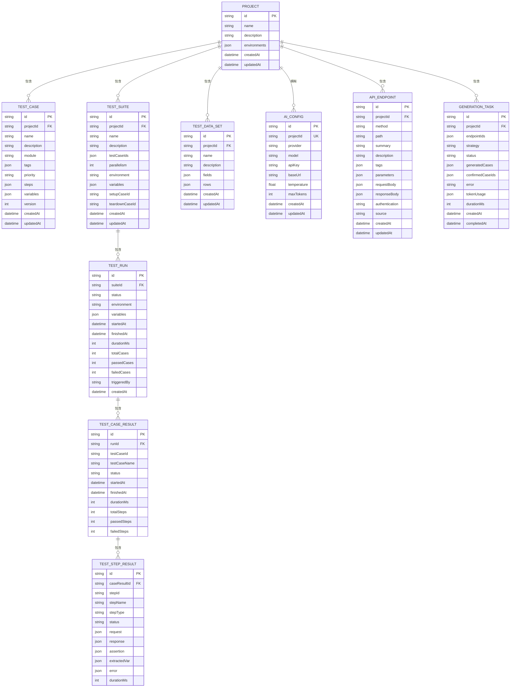

# 数据访问层

<cite>
**本文引用的文件**
- [packages/core/src/store/repository.ts](file://packages/core/src/store/repository.ts)
- [packages/core/src/store/prisma-client.ts](file://packages/core/src/store/prisma-client.ts)
- [packages/core/src/store/prisma-project.ts](file://packages/core/src/store/prisma-project.ts)
- [packages/core/src/store/prisma-test-case.ts](file://packages/core/src/store/prisma-test-case.ts)
- [packages/core/src/store/prisma-test-suite.ts](file://packages/core/src/store/prisma-test-suite.ts)
- [packages/core/src/store/prisma-test-run.ts](file://packages/core/src/store/prisma-test-run.ts)
- [packages/core/src/store/prisma-dataset.ts](file://packages/core/src/store/prisma-dataset.ts)
- [packages/core/src/models/test-case.ts](file://packages/core/src/models/test-case.ts)
- [packages/core/src/models/test-run.ts](file://packages/core/src/models/test-run.ts)
- [packages/shared/src/id.ts](file://packages/shared/src/id.ts)
- [packages/shared/src/errors.ts](file://packages/shared/src/errors.ts)
- [prisma/schema.prisma](file://prisma/schema.prisma)
</cite>

## 目录
1. [简介](#简介)
2. [项目结构](#项目结构)
3. [核心组件](#核心组件)
4. [架构总览](#架构总览)
5. [详细组件分析](#详细组件分析)
6. [依赖关系分析](#依赖关系分析)
7. [性能考量](#性能考量)
8. [故障排查指南](#故障排查指南)
9. [结论](#结论)
10. [附录](#附录)

## 简介
本文件系统性梳理数据访问层的设计与实现，围绕仓储模式（Repository Pattern）展开，覆盖接口定义、Prisma 客户端配置、CRUD 实现、查询优化、事务处理、数据映射与 DTO 转换、错误处理、并发与连接管理、缓存策略建议、一致性与异常恢复等主题。目标是帮助开发者在不深入源码细节的前提下，快速理解并正确使用数据访问层。

## 项目结构
数据访问层位于核心包 packages/core 的 store 目录中，采用“接口 + 具体实现”的分层设计，并通过 Prisma 生成的客户端进行数据库交互。模型定义位于 models 目录，ID 生成与错误类型分别来自 shared 包。



图表来源
- [packages/core/src/store/repository.ts:1-96](file://packages/core/src/store/repository.ts#L1-L96)
- [packages/core/src/store/prisma-client.ts:1-18](file://packages/core/src/store/prisma-client.ts#L1-L18)
- [packages/core/src/store/prisma-project.ts:1-58](file://packages/core/src/store/prisma-project.ts#L1-L58)
- [packages/core/src/store/prisma-test-case.ts:1-148](file://packages/core/src/store/prisma-test-case.ts#L1-L148)
- [packages/core/src/store/prisma-test-suite.ts:1-77](file://packages/core/src/store/prisma-test-suite.ts#L1-L77)
- [packages/core/src/store/prisma-test-run.ts:1-194](file://packages/core/src/store/prisma-test-run.ts#L1-L194)
- [packages/core/src/store/prisma-dataset.ts:1-69](file://packages/core/src/store/prisma-dataset.ts#L1-L69)
- [packages/core/src/models/test-case.ts:1-46](file://packages/core/src/models/test-case.ts#L1-L46)
- [packages/core/src/models/test-run.ts:1-118](file://packages/core/src/models/test-run.ts#L1-L118)
- [packages/shared/src/id.ts:1-6](file://packages/shared/src/id.ts#L1-L6)
- [packages/shared/src/errors.ts:1-25](file://packages/shared/src/errors.ts#L1-L25)

章节来源
- [packages/core/src/store/repository.ts:1-96](file://packages/core/src/store/repository.ts#L1-L96)
- [packages/core/src/store/prisma-client.ts:1-18](file://packages/core/src/store/prisma-client.ts#L1-L18)
- [packages/core/src/store/prisma-project.ts:1-58](file://packages/core/src/store/prisma-project.ts#L1-L58)
- [packages/core/src/store/prisma-test-case.ts:1-148](file://packages/core/src/store/prisma-test-case.ts#L1-L148)
- [packages/core/src/store/prisma-test-suite.ts:1-77](file://packages/core/src/store/prisma-test-suite.ts#L1-L77)
- [packages/core/src/store/prisma-test-run.ts:1-194](file://packages/core/src/store/prisma-test-run.ts#L1-L194)
- [packages/core/src/store/prisma-dataset.ts:1-69](file://packages/core/src/store/prisma-dataset.ts#L1-L69)
- [packages/core/src/models/test-case.ts:1-46](file://packages/core/src/models/test-case.ts#L1-L46)
- [packages/core/src/models/test-run.ts:1-118](file://packages/core/src/models/test-run.ts#L1-L118)
- [packages/shared/src/id.ts:1-6](file://packages/shared/src/id.ts#L1-L6)
- [packages/shared/src/errors.ts:1-25](file://packages/shared/src/errors.ts#L1-L25)

## 核心组件
- 仓储接口：统一定义 CRUD 与业务查询方法，隔离具体存储实现。
- Prisma 客户端：提供单例 PrismaClient 访问入口与断开连接能力。
- 领域模型与校验：使用 Zod 对输入输出进行强类型与结构校验。
- 数据映射：将 Prisma 行对象转换为领域 DTO，处理 JSON 字段解析与默认值。
- 错误模型：基于 AppError 派生的 NotFoundError、ValidationError 等，便于上层统一处理。

章节来源
- [packages/core/src/store/repository.ts:1-96](file://packages/core/src/store/repository.ts#L1-L96)
- [packages/core/src/store/prisma-client.ts:1-18](file://packages/core/src/store/prisma-client.ts#L1-L18)
- [packages/core/src/models/test-case.ts:1-46](file://packages/core/src/models/test-case.ts#L1-L46)
- [packages/core/src/models/test-run.ts:1-118](file://packages/core/src/models/test-run.ts#L1-L118)
- [packages/shared/src/errors.ts:1-25](file://packages/shared/src/errors.ts#L1-L25)

## 架构总览
数据访问层遵循仓储模式，通过接口抽象与具体实现分离，Prisma 提供 ORM 能力，模型层负责数据结构与约束校验，ID 生成与错误类型由共享模块提供。

```mermaid
classDiagram
class ProjectRepository {
+create(data) Promise~Project~
+findById(id) Promise~Project|null~
+findAll() Promise~Project[]~
+update(id,data) Promise~Project~
+delete(id) Promise~void~
}
class TestCaseRepository {
+create(data) Promise~TestCase~
+findById(id) Promise~TestCase|null~
+findByProjectId(projectId,filters) Promise~{items,total}~
+update(id,data) Promise~TestCase~
+delete(id) Promise~void~
+duplicate(id) Promise~TestCase~
}
class TestSuiteRepository {
+create(data) Promise~TestSuite~
+findById(id) Promise~TestSuite|null~
+findByProjectId(projectId) Promise~TestSuite[]~
+update(id,data) Promise~TestSuite~
+delete(id) Promise~void~
}
class TestRunRepository {
+create(data) Promise~TestRun~
+findById(id) Promise~TestRun|null~
+findAll(filters) Promise~{items,total}~
+update(id,data) Promise~TestRun~
+addCaseResult(runId,caseResult) Promise~TestCaseResult~
+updateCaseResult(id,data) Promise~TestCaseResult~
+addStepResult(caseResultId,stepResult) Promise~TestStepResult~
}
class TestDataSetRepository {
+create(data) Promise~TestDataSet~
+findById(id) Promise~TestDataSet|null~
+findByProjectId(projectId) Promise~TestDataSet[]~
+update(id,data) Promise~TestDataSet~
+delete(id) Promise~void~
}
class PrismaProjectRepository
class PrismaTestCaseRepository
class PrismaTestSuiteRepository
class PrismaTestRunRepository
class PrismaTestDataSetRepository
ProjectRepository <|.. PrismaProjectRepository
TestCaseRepository <|.. PrismaTestCaseRepository
TestSuiteRepository <|.. PrismaTestSuiteRepository
TestRunRepository <|.. PrismaTestRunRepository
TestDataSetRepository <|.. PrismaTestDataSetRepository
```

图表来源
- [packages/core/src/store/repository.ts:20-95](file://packages/core/src/store/repository.ts#L20-L95)
- [packages/core/src/store/prisma-project.ts:17-57](file://packages/core/src/store/prisma-project.ts#L17-L57)
- [packages/core/src/store/prisma-test-case.ts:23-147](file://packages/core/src/store/prisma-test-case.ts#L23-L147)
- [packages/core/src/store/prisma-test-suite.ts:23-76](file://packages/core/src/store/prisma-test-suite.ts#L23-L76)
- [packages/core/src/store/prisma-test-run.ts:64-193](file://packages/core/src/store/prisma-test-run.ts#L64-L193)
- [packages/core/src/store/prisma-dataset.ts:23-68](file://packages/core/src/store/prisma-dataset.ts#L23-L68)

## 详细组件分析

### 仓储接口定义
- ProjectRepository：支持创建、按 ID 查询、全量查询、更新、删除。
- TestCaseRepository：支持创建、按 ID 查询、按项目查询（含模块、标签、优先级、模糊搜索、分页）、更新、删除、复制。
- TestSuiteRepository：支持创建、按 ID 查询、按项目查询、更新、删除。
- TestRunRepository：支持创建、按 ID 查询（含关联结果嵌套加载）、分页查询、状态与统计字段更新、新增/更新用例结果、新增步骤结果。
- TestDataSetRepository：支持创建、按 ID 查询、按项目查询、更新、删除。

章节来源
- [packages/core/src/store/repository.ts:20-95](file://packages/core/src/store/repository.ts#L20-L95)

### Prisma 客户端配置与生命周期
- 单例 PrismaClient：首次调用时创建，后续复用，避免重复初始化带来的资源消耗。
- 断开连接：提供 disconnectPrisma 方法，用于优雅关闭数据库连接，适合服务退出或测试清理场景。

章节来源
- [packages/core/src/store/prisma-client.ts:1-18](file://packages/core/src/store/prisma-client.ts#L1-L18)

### 数据模型与 DTO 转换
- JSON 字段处理：对 environments、steps、variables、fields、rows 等 JSON 字段进行字符串与对象互转。
- 默认值与可选字段：映射函数中对空值进行兜底，确保 DTO 结构稳定。
- 嵌套关系：TestRun 的 caseResults 与 TestStepResult 的层级映射，保证上层消费结构清晰。

章节来源
- [packages/core/src/store/prisma-project.ts:6-15](file://packages/core/src/store/prisma-project.ts#L6-L15)
- [packages/core/src/store/prisma-test-case.ts:6-21](file://packages/core/src/store/prisma-test-case.ts#L6-L21)
- [packages/core/src/store/prisma-test-suite.ts:6-21](file://packages/core/src/store/prisma-test-suite.ts#L6-L21)
- [packages/core/src/store/prisma-test-run.ts:11-62](file://packages/core/src/store/prisma-test-run.ts#L11-L62)
- [packages/core/src/store/prisma-dataset.ts:10-21](file://packages/core/src/store/prisma-dataset.ts#L10-L21)

### CRUD 实现与查询优化

#### Project 仓储
- 创建：自动生成 ID，写入名称、描述、环境数组（JSON 序列化）。
- 查询：按 ID 唯一查询；全量查询按创建时间倒序。
- 更新：按需拼装更新字段，环境数组序列化后写回。
- 删除：按 ID 删除。

章节来源
- [packages/core/src/store/prisma-project.ts:17-57](file://packages/core/src/store/prisma-project.ts#L17-L57)

#### TestCase 仓储
- 创建：步骤列表自动补 ID 与顺序，序列化后写入；默认模块、优先级、变量为空对象。
- 查询：按项目过滤；支持模块前缀匹配、优先级过滤、名称/描述模糊匹配；分页读取与总数统计并行；标签过滤在内存中二次筛选（SQLite 不支持 JSON 数组原生查询）。
- 更新：版本号递增；仅更新传入字段；步骤列表重写时重新生成 ID 与顺序。
- 删除：按 ID 删除。
- 复制：基于现有用例创建新用例，保留除 ID 外的全部信息。



图表来源
- [packages/core/src/store/prisma-test-case.ts:52-99](file://packages/core/src/store/prisma-test-case.ts#L52-L99)

章节来源
- [packages/core/src/store/prisma-test-case.ts:23-147](file://packages/core/src/store/prisma-test-case.ts#L23-L147)

#### TestSuite 仓储
- 创建：序列化用例 ID 数组、变量对象；设置并行度默认值。
- 查询：按项目查询，按创建时间倒序。
- 更新：按需更新多个字段，变量与 ID 数组序列化。
- 删除：按 ID 删除。

章节来源
- [packages/core/src/store/prisma-test-suite.ts:23-76](file://packages/core/src/store/prisma-test-suite.ts#L23-L76)

#### TestRun 仓储
- 创建：生成运行记录，序列化变量对象。
- 查询：按 ID 查询并包含用例结果与步骤结果；分页查询支持套件与状态过滤。
- 更新：仅更新状态与统计类字段。
- 结果写入：新增用例结果与步骤结果，序列化请求/响应/断言/提取变量/错误等 JSON 字段。

章节来源
- [packages/core/src/store/prisma-test-run.ts:64-193](file://packages/core/src/store/prisma-test-run.ts#L64-L193)

#### TestDataSet 仓储
- 创建：序列化字段与行数据。
- 查询：按项目查询，按创建时间倒序。
- 更新：按需更新字段，JSON 字段序列化。
- 删除：按 ID 删除。

章节来源
- [packages/core/src/store/prisma-dataset.ts:23-68](file://packages/core/src/store/prisma-dataset.ts#L23-L68)

### 事务处理
- 当前实现未显式使用 Prisma 事务 API。若业务需要跨多表原子性操作，可在仓储实现中引入 Prisma 事务块，确保一致性。
- 建议：在需要强一致性的批量写入或状态切换场景，封装事务方法并在失败时回滚。

[本节为通用建议，不直接分析特定文件，故无章节来源]

### 数据映射与 DTO 转换
- 映射函数负责：
  - JSON 字段解析与序列化
  - 可选字段的空值兜底
  - 嵌套关系的扁平化/结构化
- 优势：屏蔽底层存储细节，向上层暴露稳定的领域模型。

章节来源
- [packages/core/src/store/prisma-project.ts:6-15](file://packages/core/src/store/prisma-project.ts#L6-L15)
- [packages/core/src/store/prisma-test-case.ts:6-21](file://packages/core/src/store/prisma-test-case.ts#L6-L21)
- [packages/core/src/store/prisma-test-suite.ts:6-21](file://packages/core/src/store/prisma-test-suite.ts#L6-L21)
- [packages/core/src/store/prisma-test-run.ts:11-62](file://packages/core/src/store/prisma-test-run.ts#L11-L62)
- [packages/core/src/store/prisma-dataset.ts:10-21](file://packages/core/src/store/prisma-dataset.ts#L10-L21)

### 错误处理机制
- 统一错误基类：AppError，支持业务码、HTTP 状态码与详情。
- 典型派生错误：NotFoundError（资源不存在）、ValidationError（参数校验失败）。
- 使用建议：在仓储层对“未找到”等场景抛出明确错误，便于上层路由/控制器捕获并返回一致的错误响应。

章节来源
- [packages/shared/src/errors.ts:1-25](file://packages/shared/src/errors.ts#L1-L25)

### 并发控制与连接池管理
- 连接管理：PrismaClient 单例复用，disconnectPrisma 在退出时断开，避免连接泄漏。
- 并发建议：在高并发场景下，结合 Prisma 的连接池配置与数据库层面的并发限制；仓储方法应保持幂等与无副作用，避免长事务占用连接。

章节来源
- [packages/core/src/store/prisma-client.ts:1-18](file://packages/core/src/store/prisma-client.ts#L1-L18)

### 缓存策略（建议）
- 读多写少场景：对高频查询结果（如按项目查询用例列表）增加应用层缓存，结合 TTL 与失效策略。
- 写后失效：写入成功后主动失效相关缓存键，保证最终一致性。
- 注意：当前实现未包含缓存逻辑，以上为架构建议。

[本节为通用建议，不直接分析特定文件，故无章节来源]

## 依赖关系分析



图表来源
- [packages/core/src/store/repository.ts:1-96](file://packages/core/src/store/repository.ts#L1-L96)
- [packages/core/src/store/prisma-project.ts:1-58](file://packages/core/src/store/prisma-project.ts#L1-L58)
- [packages/core/src/store/prisma-test-case.ts:1-148](file://packages/core/src/store/prisma-test-case.ts#L1-L148)
- [packages/core/src/store/prisma-test-suite.ts:1-77](file://packages/core/src/store/prisma-test-suite.ts#L1-L77)
- [packages/core/src/store/prisma-test-run.ts:1-194](file://packages/core/src/store/prisma-test-run.ts#L1-L194)
- [packages/core/src/store/prisma-dataset.ts:1-69](file://packages/core/src/store/prisma-dataset.ts#L1-L69)
- [packages/core/src/models/test-case.ts:1-46](file://packages/core/src/models/test-case.ts#L1-L46)
- [packages/core/src/models/test-run.ts:1-118](file://packages/core/src/models/test-run.ts#L1-L118)
- [packages/shared/src/id.ts:1-6](file://packages/shared/src/id.ts#L1-L6)
- [packages/shared/src/errors.ts:1-25](file://packages/shared/src/errors.ts#L1-L25)

## 性能考量
- 分页与并行：查询列表时同时执行查询与计数，减少往返次数。
- 索引利用：Prisma schema 已为关键字段建立索引（如项目外键、状态、模块等），仓储查询尽量命中这些索引。
- JSON 字段：对 SQLite 不支持原生 JSON 数组查询的场景，在内存中进行二次过滤，建议配合分页与更精确的 where 条件降低内存过滤成本。
- 写入批量化：批量插入/更新时尽量合并为一次事务，减少网络往返与锁竞争。
- 连接池：根据并发峰值合理配置 Prisma 连接池大小与超时，避免连接饥饿。

章节来源
- [packages/core/src/store/prisma-test-case.ts:81-99](file://packages/core/src/store/prisma-test-case.ts#L81-L99)
- [prisma/schema.prisma:42-44](file://prisma/schema.prisma#L42-L44)
- [prisma/schema.prisma:84-86](file://prisma/schema.prisma#L84-L86)
- [prisma/schema.prisma:138-139](file://prisma/schema.prisma#L138-L139)
- [prisma/schema.prisma:174-175](file://prisma/schema.prisma#L174-L175)
- [prisma/schema.prisma:194-195](file://prisma/schema.prisma#L194-L195)

## 故障排查指南
- “资源不存在”：在更新/删除/复制等操作前先查询是否存在，不存在时抛出 NotFoundError。
- 参数校验失败：在进入仓储前使用 Zod Schema 校验输入，出现错误时抛出 ValidationError。
- 连接问题：确认 PrismaClient 单例已初始化；在进程退出时调用 disconnectPrisma。
- JSON 解析异常：检查 JSON 字段是否被正确序列化/反序列化，避免空值导致解析失败。
- 查询性能差：确认 where 条件是否命中索引；减少不必要的内存过滤；适当调整分页大小。

章节来源
- [packages/core/src/store/prisma-test-case.ts:101-104](file://packages/core/src/store/prisma-test-case.ts#L101-L104)
- [packages/core/src/store/prisma-test-case.ts:132-135](file://packages/core/src/store/prisma-test-case.ts#L132-L135)
- [packages/shared/src/errors.ts:13-25](file://packages/shared/src/errors.ts#L13-L25)
- [packages/core/src/store/prisma-client.ts:12-17](file://packages/core/src/store/prisma-client.ts#L12-L17)

## 结论
该数据访问层以仓储模式为核心，结合 Prisma ORM 与 Zod 校验，实现了清晰的职责分离与稳定的领域模型。通过单例客户端、并行查询、索引利用与 JSON 字段映射，满足了当前业务的数据访问需求。建议在需要强一致性的场景引入事务，在读多写少场景引入缓存，并持续关注索引与查询计划的优化。

## 附录
- 数据库模型概览（部分关键模型与索引）



图表来源
- [prisma/schema.prisma:10-196](file://prisma/schema.prisma#L10-L196)