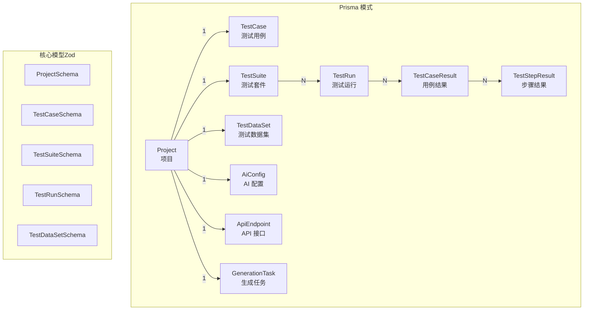
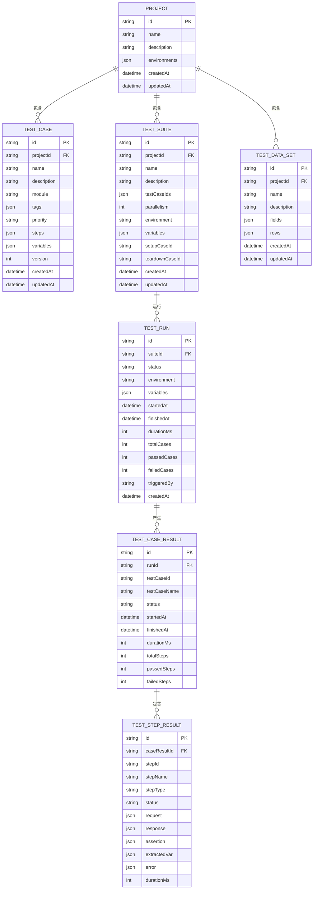
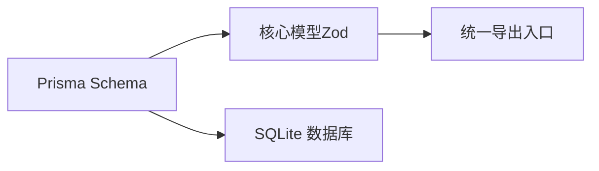

# 核心数据模型

<cite>
**本文档引用的文件**
- [schema.prisma](file://prisma/schema.prisma)
- [project.ts](file://packages/core/src/models/project.ts)
- [test-case.ts](file://packages/core/src/models/test-case.ts)
- [test-suite.ts](file://packages/core/src/models/test-suite.ts)
- [test-run.ts](file://packages/core/src/models/test-run.ts)
- [test-dataset.ts](file://packages/core/src/models/test-dataset.ts)
- [index.ts](file://packages/core/src/models/index.ts)
</cite>

## 目录
1. [简介](#简介)
2. [项目结构](#项目结构)
3. [核心组件](#核心组件)
4. [架构总览](#架构总览)
5. [详细组件分析](#详细组件分析)
6. [依赖分析](#依赖分析)
7. [性能考虑](#性能考虑)
8. [故障排除指南](#故障排除指南)
9. [结论](#结论)
10. [附录](#附录)

## 简介
本文件系统性地文档化了 AI 测试器项目的核心数据模型，重点覆盖 Project（项目）、TestCase（测试用例）、TestSuite（测试套件）、TestRun（测试运行）等核心实体。内容包括：
- 模型字段定义、数据类型与业务约束
- 实体间关联关系与级联删除策略
- 数据验证规则、默认值与字段约束
- 版本控制机制与数据演进策略
- 使用示例与最佳实践
- 扩展点与自定义字段实现方式

## 项目结构
核心数据模型由 Prisma Schema 定义持久化结构，并通过 TypeScript Zod Schema 提供运行时验证与类型推断。模型导出入口统一在核心包中集中导出。

图表来源
- [schema.prisma:10-196](file://prisma/schema.prisma#L10-L196)
- [project.ts:9-24](file://packages/core/src/models/project.ts#L9-L24)
- [test-case.ts:7-20](file://packages/core/src/models/test-case.ts#L7-L20)
- [test-suite.ts:3-16](file://packages/core/src/models/test-suite.ts#L3-L16)
- [test-run.ts:88-103](file://packages/core/src/models/test-run.ts#L88-L103)
- [test-dataset.ts:18-27](file://packages/core/src/models/test-dataset.ts#L18-L27)

章节来源
- [schema.prisma:10-196](file://prisma/schema.prisma#L10-L196)
- [index.ts:1-7](file://packages/core/src/models/index.ts#L1-L7)

## 核心组件
本节对核心实体进行逐项说明，涵盖字段、类型、默认值、约束与业务语义。

- Project（项目）
  - 字段与类型：标识符、名称、描述、环境配置数组（JSON）、时间戳
  - 默认值与约束：环境配置默认空数组；创建/更新时间自动维护
  - 关联关系：一对多到 TestCase、TestSuite、TestDataSet、AiConfig、ApiEndpoint、GenerationTask
  - 业务含义：承载测试域的上下文，包含环境变量与全局配置

- TestCase（测试用例）
  - 字段与类型：所属项目、名称、描述、模块、标签数组（JSON）、优先级、步骤数组（JSON）、变量映射（JSON）、版本号、时间戳
  - 默认值与约束：模块、标签、优先级、步骤、变量、版本默认值；名称长度限制；版本≥1
  - 关联关系：多对一到 Project；通过 TestRun 的结果间接关联 TestStepResult
  - 业务含义：最小可执行测试单元，支持步骤编排与变量注入

- TestSuite（测试套件）
  - 字段与类型：所属项目、名称、描述、用例 ID 数组（JSON）、并发度、环境、变量映射（JSON）、前置/后置用例 ID、时间戳
  - 默认值与约束：并发度≥1；默认空环境；变量默认空对象
  - 关联关系：多对一到 Project；一对多到 TestRun
  - 业务含义：组织与调度测试用例集合，支持并发与环境隔离

- TestRun（测试运行）
  - 字段与类型：所属套件、状态、环境、变量映射（JSON）、开始/结束时间、耗时、用例统计、触发来源、时间戳
  - 默认值与约束：状态默认 pending；触发来源默认 manual；计数与耗时非负
  - 关联关系：多对一到 TestSuite；一对多到 TestCaseResult
  - 业务含义：一次具体的执行实例，记录整体执行状态与统计

- TestCaseResult（用例结果）
  - 字段与类型：所属运行、用例 ID/名称、状态、步骤结果数组（JSON）、开始/结束时间、耗时、步骤统计
  - 默认值与约束：状态默认 skipped；计数与耗时非负
  - 关联关系：多对一到 TestRun；一对多到 TestStepResult
  - 业务含义：单个用例在某次运行中的执行结果快照

- TestStepResult（步骤结果）
  - 字段与类型：所属用例结果、步骤 ID/名称/类型、状态、请求/响应/断言/提取变量/错误信息（JSON）、耗时
  - 默认值与约束：状态默认 skipped；耗时≥0
  - 关联关系：多对一到 TestCaseResult
  - 业务含义：单步执行的详细日志与断言结果

- TestDataSet（测试数据集）
  - 字段与类型：所属项目、名称、描述、字段定义数组（JSON）、数据行数组（JSON）、时间戳
  - 默认值与约束：字段与行默认空数组；名称长度限制
  - 关联关系：多对一到 Project
  - 业务含义：为测试提供结构化数据源，支持多种字段类型

章节来源
- [schema.prisma:10-196](file://prisma/schema.prisma#L10-L196)
- [project.ts:9-24](file://packages/core/src/models/project.ts#L9-L24)
- [test-case.ts:7-20](file://packages/core/src/models/test-case.ts#L7-L20)
- [test-suite.ts:3-16](file://packages/core/src/models/test-suite.ts#L3-L16)
- [test-run.ts:88-103](file://packages/core/src/models/test-run.ts#L88-L103)
- [test-dataset.ts:18-27](file://packages/core/src/models/test-dataset.ts#L18-L27)

## 架构总览
下图展示核心实体之间的关系与级联删除策略（onDelete: Cascade），确保父实体删除时子实体同步清理。

图表来源
- [schema.prisma:10-196](file://prisma/schema.prisma#L10-L196)

## 详细组件分析

### Project（项目）模型
- 结构要点
  - 基本字段：id、name、description、environments（JSON 数组）
  - 时间戳：createdAt、updatedAt 自动维护
  - 关联：一对多到 TestCase、TestSuite、TestDataSet、AiConfig、ApiEndpoint、GenerationTask
- 数据验证与约束
  - 名称长度限制与必填校验
  - 环境数组默认空数组
- 使用示例与最佳实践
  - 在创建项目时预置 environments，便于后续用例/套件复用
  - 通过关联查询一次性加载项目下的所有用例与套件，减少 N+1 查询
- 扩展点
  - environments 支持任意键值对变量，可用于注入不同环境参数
- 版本控制
  - 项目本身不直接版本化，但 TestCase 的 version 字段用于用例演进追踪

章节来源
- [schema.prisma:10-24](file://prisma/schema.prisma#L10-L24)
- [project.ts:9-24](file://packages/core/src/models/project.ts#L9-L24)

### TestCase（测试用例）模型
- 结构要点
  - 基本字段：projectId、name、description、module、tags、priority、steps、variables、version
  - 时间戳：createdAt、updatedAt
  - 关联：多对一到 Project
- 数据验证与约束
  - 名称长度限制、模块默认空字符串、优先级枚举、版本≥1
  - steps/variables/tags 默认空结构，便于增量编辑
- 使用示例与最佳实践
  - 用例版本号递增以追踪变更历史
  - 将跨用例共享变量放入 Project.environments 或 TestSuite.variables
- 扩展点
  - steps 支持复杂步骤编排，variables 支持动态替换
- 版本控制
  - version 字段用于记录用例版本，配合生成/回滚策略

章节来源
- [schema.prisma:26-44](file://prisma/schema.prisma#L26-L44)
- [test-case.ts:7-20](file://packages/core/src/models/test-case.ts#L7-L20)

### TestSuite（测试套件）模型
- 结构要点
  - 基本字段：projectId、name、description、testCaseIds、parallelism、environment、variables、setupCaseId、teardownCaseId
  - 时间戳：createdAt、updatedAt
  - 关联：多对一到 Project；一对多到 TestRun
- 数据验证与约束
  - 并发度≥1，默认空环境；变量默认空对象
  - testCaseIds 作为 JSON 数组存储用例引用
- 使用示例与最佳实践
  - 通过 testCaseIds 组织用例顺序与分组
  - 利用 setupCaseId/teardownCaseId 实现环境准备与清理
- 扩展点
  - environment 可指向 Project.environments 中的环境条目
- 版本控制
  - 套件自身不直接版本化，可通过 TestRun 的统计与结果回溯行为变化

章节来源
- [schema.prisma:46-64](file://prisma/schema.prisma#L46-L64)
- [test-suite.ts:3-16](file://packages/core/src/models/test-suite.ts#L3-L16)

### TestRun（测试运行）模型
- 结构要点
  - 基本字段：suiteId、status、environment、variables、startedAt、finishedAt、durationMs、totalCases、passedCases、failedCases、triggeredBy
  - 关联：多对一到 TestSuite；一对多到 TestCaseResult
- 数据验证与约束
  - 状态枚举、触发来源枚举、计数与耗时非负
  - 变量默认空对象
- 使用示例与最佳实践
  - 运行结束后汇总 total/passed/failedCases，用于报告生成
  - triggeredBy 记录手动/API/MCP 触发来源，便于审计
- 扩展点
  - variables 可注入运行期参数，如重试次数、超时阈值等

章节来源
- [schema.prisma:66-86](file://prisma/schema.prisma#L66-L86)
- [test-run.ts:88-103](file://packages/core/src/models/test-run.ts#L88-L103)

### TestCaseResult（用例结果）模型
- 结构要点
  - 基本字段：runId、testCaseId、testCaseName、status、stepResults、startedAt、finishedAt、durationMs、totalSteps、passedSteps、failedSteps
  - 关联：多对一到 TestRun；一对多到 TestStepResult
- 数据验证与约束
  - 状态枚举、计数与耗时非负
  - stepResults 默认空数组
- 使用示例与最佳实践
  - 用例结果作为聚合视图，便于生成报表与趋势分析

章节来源
- [schema.prisma:88-105](file://prisma/schema.prisma#L88-L105)
- [test-run.ts:65-78](file://packages/core/src/models/test-run.ts#L65-L78)

### TestStepResult（步骤结果）模型
- 结构要点
  - 基本字段：caseResultId、stepId、stepName、stepType、status、request、response、assertion、extractedVar、error、durationMs
  - 关联：多对一到 TestCaseResult
- 数据验证与约束
  - 状态枚举、耗时≥0
  - 各结构字段为 JSON，便于灵活记录不同类型的步骤输出
- 使用示例与最佳实践
  - 步骤结果是调试与回放的关键证据链

章节来源
- [schema.prisma:107-124](file://prisma/schema.prisma#L107-L124)
- [test-run.ts:9-58](file://packages/core/src/models/test-run.ts#L9-L58)

### TestDataSet（测试数据集）模型
- 结构要点
  - 基本字段：projectId、name、description、fields（字段定义）、rows（数据行）、时间戳
  - 关联：多对一到 Project
- 数据验证与约束
  - 名称长度限制；fields/rows 默认空数组
- 使用示例与最佳实践
  - fields 定义结构化字段类型，rows 提供多行数据样本
- 扩展点
  - 支持自定义字段类型（如 email、uuid、date、custom）

章节来源
- [schema.prisma:126-139](file://prisma/schema.prisma#L126-L139)
- [test-dataset.ts:18-27](file://packages/core/src/models/test-dataset.ts#L18-L27)

## 依赖分析
- 外部依赖
  - Prisma 作为 ORM/模式定义工具，SQLite 作为默认数据库
  - Zod 用于运行时数据验证与类型推断
- 内部依赖
  - 核心模型导出统一入口，便于上层服务按需导入
- 关系耦合
  - 父子实体采用级联删除策略，保证数据一致性
  - 多对多通过 JSON 数组或外键字段间接表达，简化查询与扩展

图表来源
- [schema.prisma:1-8](file://prisma/schema.prisma#L1-L8)
- [index.ts:1-7](file://packages/core/src/models/index.ts#L1-L7)

章节来源
- [schema.prisma:1-8](file://prisma/schema.prisma#L1-L8)
- [index.ts:1-7](file://packages/core/src/models/index.ts#L1-L7)

## 性能考虑
- 索引策略
  - TestCase.module、TestSuite.projectId、TestRun.suiteId、TestRun.status 等常用过滤字段已建立索引，有助于提升查询性能
- JSON 字段的权衡
  - steps、variables、tags 等采用 JSON 存储，便于灵活扩展，但可能影响传统 SQL 聚合与索引效率
- 建议
  - 对高频查询字段（如 module、status）保持索引
  - 对大体量 JSON 字段（如 steps）避免深度嵌套，必要时拆分为子表或缓存

## 故障排除指南
- 常见问题
  - 删除 Project 后子实体未清理：确认 Prisma 模式中 onDelete: Cascade 已正确应用
  - 用例版本异常：检查 TestCase.version 是否递增，避免并发写入导致的竞态
  - 运行统计不一致：核对 TestRun.totalCases/passedCases/failedCases 与 TestCaseResult 的汇总逻辑
- 排查步骤
  - 使用 Prisma Studio 或 SQLite 客户端查看实体关系与数据完整性
  - 检查 Zod Schema 的验证报错，定位输入异常字段
- 最佳实践
  - 在业务层统一处理默认值与校验，避免直接绕过验证层
  - 对关键字段（如 status、durationMs）进行边界值测试

## 结论
本文件系统化梳理了 Project、TestCase、TestSuite、TestRun 等核心实体的结构设计、业务含义、关联关系与约束策略。通过 Prisma 的级联删除与 Zod 的运行时验证，项目在灵活性与一致性之间取得平衡。建议在实际使用中遵循版本控制与数据演进策略，结合索引与 JSON 字段的最佳实践，持续优化查询与写入性能。

## 附录
- 数据验证与默认值速览
  - Project：environments 默认空数组；createdAt/updatedAt 自动维护
  - TestCase：module/tags/priority/steps/variables/version 默认值；version≥1
  - TestSuite：parallelism≥1；variables 默认空对象
  - TestRun：status 默认 pending；triggeredBy 默认 manual；计数与耗时非负
  - TestCaseResult：status 默认 skipped；计数与耗时非负
  - TestStepResult：status 默认 skipped；durationMs 默认 0
  - TestDataSet：fields/rows 默认空数组
- 版本控制与演进
  - 用例版本通过 TestCase.version 字段追踪；建议在生成/回滚流程中同步更新
  - 套件与项目层面暂无显式版本字段，可通过运行结果与审计日志回溯行为变化