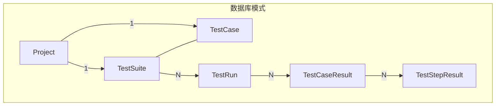
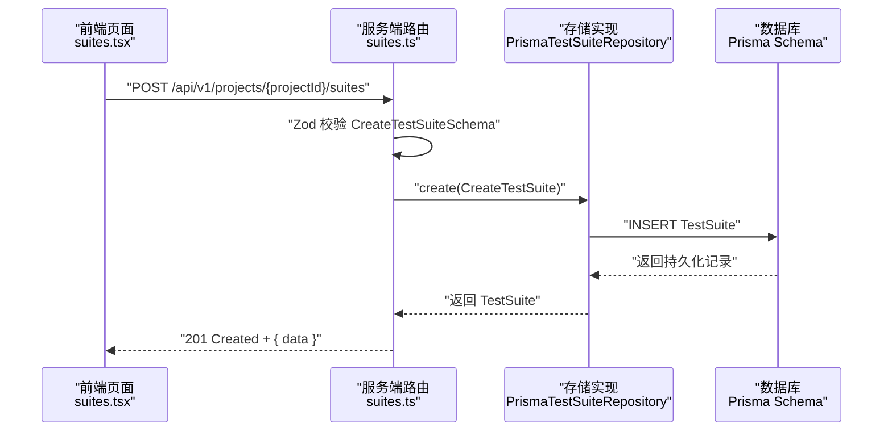
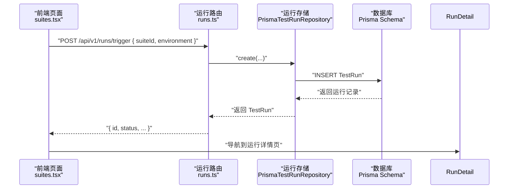
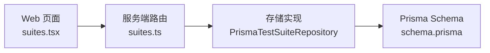
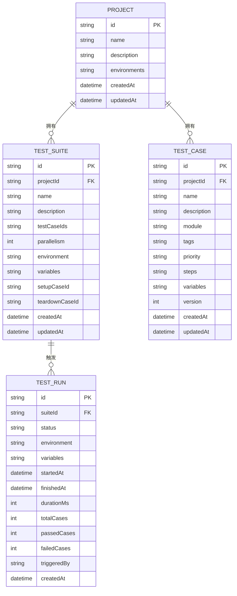

# 测试套件模型

<cite>
**本文引用的文件**
- [schema.prisma](file://prisma/schema.prisma)
- [test-suite.ts](file://packages/core/src/models/test-suite.ts)
- [prisma-test-suite.ts](file://packages/core/src/store/prisma-test-suite.ts)
- [suites.ts](file://packages/server/src/routes/suites.ts)
- [suites.tsx](file://packages/web/src/pages/suites.tsx)
- [test-run.ts](file://packages/core/src/models/test-run.ts)
- [prisma-test-run.ts](file://packages/core/src/store/prisma-test-run.ts)
- [runs.ts](file://packages/server/src/routes/runs.ts)
- [run-detail.tsx](file://packages/web/src/pages/run-detail.tsx)
- [runs.tsx](file://packages/web/src/pages/runs.tsx)
</cite>

## 目录
1. [简介](#简介)
2. [项目结构](#项目结构)
3. [核心组件](#核心组件)
4. [架构总览](#架构总览)
5. [详细组件分析](#详细组件分析)
6. [依赖分析](#依赖分析)
7. [性能考虑](#性能考虑)
8. [故障排查指南](#故障排查指南)
9. [结论](#结论)
10. [附录](#附录)

## 简介
本文件系统性地文档化测试套件（TestSuite）模型，覆盖数据结构、执行策略、关系与依赖、分组与排序、创建与管理流程、在测试编排中的作用以及性能优化策略，并补充套件模板与继承机制的实现建议。内容基于仓库中 Prisma 模式定义、核心模型与存储层、服务端路由以及 Web 前端页面的实际实现。

## 项目结构
围绕测试套件的核心文件分布如下：
- 数据模型与关系：Prisma schema 定义了 Project、TestSuite、TestCase、TestRun 及其关联
- 核心类型与校验：packages/core/src/models 下的 TestSuite 类型与 Zod 校验
- 存储实现：packages/core/src/store 下的 PrismaTestSuiteRepository 实现
- 服务端接口：packages/server/src/routes 下的套件路由
- 前端页面：packages/web/src/pages 下的套件列表与运行触发界面
- 执行模型与运行：TestRun 相关模型、存储与路由，以及运行详情页

图表来源
- [schema.prisma:10-64](file://prisma/schema.prisma#L10-L64)

章节来源
- [schema.prisma:10-64](file://prisma/schema.prisma#L10-L64)

## 核心组件
- TestSuite 数据模型：包含标识、所属项目、名称、描述、测试用例集合、并发度、环境、变量、前置/后置用例等字段
- TestSuite 类型与校验：使用 Zod 对创建/更新/查询进行强类型约束
- 存储实现：PrismaTestSuiteRepository 提供 CRUD 操作，负责 JSON 字段的序列化/反序列化
- 服务端路由：提供创建、查询、更新、删除套件的 REST 接口
- 前端页面：套件列表、编辑/新建对话框、运行触发对话框
- 执行模型：TestRun/TestRunResult 用于承载一次套件执行的运行状态与结果

章节来源
- [test-suite.ts:3-39](file://packages/core/src/models/test-suite.ts#L3-L39)
- [prisma-test-suite.ts:6-76](file://packages/core/src/store/prisma-test-suite.ts#L6-L76)
- [suites.ts:5-48](file://packages/server/src/routes/suites.ts#L5-L48)
- [suites.tsx:26-151](file://packages/web/src/pages/suites.tsx#L26-L151)

## 架构总览
下图展示了从 Web 前端到服务端再到存储层的整体调用链路，以及与数据库模式的映射关系。

图表来源
- [suites.ts:7-17](file://packages/server/src/routes/suites.ts#L7-L17)
- [prisma-test-suite.ts:24-40](file://packages/core/src/store/prisma-test-suite.ts#L24-L40)
- [test-suite.ts:18-28](file://packages/core/src/models/test-suite.ts#L18-L28)

## 详细组件分析

### TestSuite 数据模型与字段说明
- 标识与归属
  - id：唯一标识
  - projectId：所属项目
- 基本信息
  - name：套件名称，必填且长度限制
  - description：可选描述
- 关联与配置
  - testCaseIds：JSON 数组，存储被纳入的测试用例 ID 列表
  - parallelism：整数，最小为 1，默认 1；表示并发执行度
  - environment：可选环境名
  - variables：JSON 记录，键值对形式的变量
  - setupCaseId / teardownCaseId：可选前置/后置用例 ID
- 时间戳
  - createdAt / updatedAt：自动维护

字段复杂度与约束
- JSON 字段（testCaseIds、variables）采用字符串存储并在存储层进行序列化/反序列化
- 并发度 parallelism 强制为正整数，避免无效并发配置
- 名称长度限制与必填约束确保数据一致性

章节来源
- [schema.prisma:46-64](file://prisma/schema.prisma#L46-L64)
- [test-suite.ts:3-16](file://packages/core/src/models/test-suite.ts#L3-L16)
- [prisma-test-suite.ts:6-21](file://packages/core/src/store/prisma-test-suite.ts#L6-L21)

### TestSuite 执行策略配置
- 并发设置
  - parallelism：单次执行时的并发度，影响执行引擎的并发调度
- 环境与变量
  - environment：指定运行环境名，便于按环境隔离执行
  - variables：提供键值对变量，支持在执行上下文中注入
- 前置/后置用例
  - setupCaseId / teardownCaseId：分别在套件执行前与执行后运行，用于准备/清理环境

注意
- 重试机制与超时控制未在当前模型中直接体现；可在 TestRun 或执行引擎层面扩展

章节来源
- [test-suite.ts:9-13](file://packages/core/src/models/test-suite.ts#L9-L13)
- [prisma-test-suite.ts:31-36](file://packages/core/src/store/prisma-test-suite.ts#L31-L36)

### 套件与测试用例的关系与依赖管理
- 多对多关系
  - TestSuite 通过 testCaseIds 维护与 TestCase 的多对多关联
  - 该设计以 JSON 数组存储 ID，便于灵活组合与快速查询
- 依赖管理
  - 通过 setupCaseId / teardownCaseId 在套件级别声明前置/后置依赖
  - 执行顺序建议：先执行前置用例，再执行套件内用例，最后执行后置用例

章节来源
- [schema.prisma:18-19](file://prisma/schema.prisma#L18-L19)
- [schema.prisma:40-44](file://prisma/schema.prisma#L40-L44)
- [schema.prisma:55-56](file://prisma/schema.prisma#L55-L56)

### 分组与排序机制
- 分组
  - 套件按项目维度分组（projectId）
- 排序
  - 查询套件列表时按创建时间倒序排列（最新在前）

章节来源
- [prisma-test-suite.ts:47-52](file://packages/core/src/store/prisma-test-suite.ts#L47-L52)

### 创建、配置与管理流程（代码示例路径）
- 创建套件
  - 路由：POST /api/v1/projects/:projectId/suites
  - 校验：CreateTestSuiteSchema
  - 存储：PrismaTestSuiteRepository.create
  - 示例路径：[suites.ts:7-17](file://packages/server/src/routes/suites.ts#L7-L17)，[prisma-test-suite.ts:24-40](file://packages/core/src/store/prisma-test-suite.ts#L24-L40)
- 查询套件
  - 路由：GET /api/v1/projects/:projectId/suites
  - 存储：PrismaTestSuiteRepository.findByProjectId
  - 示例路径：[suites.ts:19-26](file://packages/server/src/routes/suites.ts#L19-L26)，[prisma-test-suite.ts:47-52](file://packages/core/src/store/prisma-test-suite.ts#L47-L52)
- 更新套件
  - 路由：PUT /api/v1/suites/:id
  - 校验：UpdateTestSuiteSchema
  - 存储：PrismaTestSuiteRepository.update
  - 示例路径：[suites.ts:36-41](file://packages/server/src/routes/suites.ts#L36-L41)，[prisma-test-suite.ts:55-71](file://packages/core/src/store/prisma-test-suite.ts#L55-L71)
- 删除套件
  - 路由：DELETE /api/v1/suites/:id
  - 存储：PrismaTestSuiteRepository.delete
  - 示例路径：[suites.ts:43-47](file://packages/server/src/routes/suites.ts#L43-L47)，[prisma-test-suite.ts:73-76](file://packages/core/src/store/prisma-test-suite.ts#L73-L76)

章节来源
- [suites.ts:5-48](file://packages/server/src/routes/suites.ts#L5-L48)
- [prisma-test-suite.ts:23-76](file://packages/core/src/store/prisma-test-suite.ts#L23-L76)

### 套件在测试编排中的作用与执行流程
- 触发执行
  - 前端通过运行对话框选择环境并触发执行
  - 路由：POST /api/v1/runs/trigger
  - 返回 TestRun 信息，前端跳转至运行详情页
- 执行结果
  - TestRun 记录运行状态、统计信息与关联的 TestCaseResult
  - 前端运行列表与详情页展示执行进度与结果

图表来源
- [runs.ts](file://packages/server/src/routes/runs.ts)
- [prisma-test-run.ts](file://packages/core/src/store/prisma-test-run.ts)
- [run-detail.tsx](file://packages/web/src/pages/run-detail.tsx)
- [runs.tsx](file://packages/web/src/pages/runs.tsx)

章节来源
- [suites.tsx:143-148](file://packages/web/src/pages/suites.tsx#L143-L148)
- [runs.ts](file://packages/server/src/routes/runs.ts)
- [prisma-test-run.ts](file://packages/core/src/store/prisma-test-run.ts)
- [run-detail.tsx](file://packages/web/src/pages/run-detail.tsx)
- [runs.tsx](file://packages/web/src/pages/runs.tsx)

### 套件模板与继承机制（实现建议）
当前仓库未提供“套件模板”与“套件继承”的直接实现。以下为可行的扩展方案：
- 套件模板
  - 新增 TemplateTestSuite 模型，包含模板元数据与默认配置
  - 提供“从模板创建套件”的接口，复制模板中的 testCaseIds、parallelism、environment、variables 等
- 套件继承
  - 在 TestSuite 中新增 parentSuiteId 字段，指向父级套件
  - 执行时合并父级与子级的变量、并发度等配置，优先使用子级覆盖
- 变更点
  - Prisma schema：新增模板与继承字段
  - 核心模型与存储：增加模板解析与继承合并逻辑
  - 服务端路由：新增模板 CRUD 与“基于模板创建套件”接口
  - 前端页面：新增模板管理与“从模板创建”入口

（本节为概念性建议，不对应具体源码文件）

## 依赖分析
- 组件耦合
  - Web 前端依赖服务端路由与 API
  - 服务端路由依赖存储层实现
  - 存储层依赖 Prisma schema 定义
- 外部依赖
  - Zod：类型与参数校验
  - Prisma：数据库访问与 ORM
  - Fastify：HTTP 服务框架

图表来源
- [suites.tsx:22-141](file://packages/web/src/pages/suites.tsx#L22-L141)
- [suites.ts:1-48](file://packages/server/src/routes/suites.ts#L1-L48)
- [prisma-test-suite.ts:1-76](file://packages/core/src/store/prisma-test-suite.ts#L1-L76)
- [schema.prisma:1-196](file://prisma/schema.prisma#L1-L196)

章节来源
- [suites.tsx:22-141](file://packages/web/src/pages/suites.tsx#L22-L141)
- [suites.ts:1-48](file://packages/server/src/routes/suites.ts#L1-L48)
- [prisma-test-suite.ts:1-76](file://packages/core/src/store/prisma-test-suite.ts#L1-L76)
- [schema.prisma:1-196](file://prisma/schema.prisma#L1-L196)

## 性能考虑
- 查询优化
  - 套件列表按项目过滤并按创建时间倒序，适合高频读取场景
  - 建议在项目维度建立索引（已存在）
- JSON 字段处理
  - testCaseIds、variables 为 JSON 字段，写入时序列化、读取时反序列化，避免复杂 JOIN 查询
  - 若用例数量增长，可考虑拆分中间表以提升查询效率
- 并发执行
  - parallelism 控制并发度，应结合资源与目标系统能力合理设置
- 缓存与批处理
  - 前端可缓存项目下的套件列表与用例列表，减少重复请求
  - 批量操作（如批量删除、批量更新）可减少网络往返

（本节为通用性能建议，不对应具体源码文件）

## 故障排查指南
- 常见错误与定位
  - 参数校验失败：检查 CreateTestSuiteSchema/UpdateTestSuiteSchema 的字段是否满足约束
  - 资源不存在：套件查询返回空或 404，确认 ID 与项目 ID 是否正确
  - JSON 解析异常：检查 testCaseIds、variables 的格式是否为合法 JSON
- 前端交互
  - 套件列表加载失败：确认项目上下文与权限
  - 运行触发失败：确认所选环境是否存在且有效
- 后端日志
  - 路由层打印请求参数与响应状态
  - 存储层捕获数据库异常并返回标准错误结构

章节来源
- [suites.ts:31-33](file://packages/server/src/routes/suites.ts#L31-L33)
- [prisma-test-suite.ts:6-21](file://packages/core/src/store/prisma-test-suite.ts#L6-L21)

## 结论
测试套件模型以简洁的 JSON 字段与清晰的并发配置为核心，配合严格的类型校验与存储层序列化，实现了灵活的用例组合与可控的执行策略。通过在 TestRun 体系中扩展重试与超时控制，可进一步完善执行稳定性。模板与继承机制可作为后续演进方向，以提升复用性与可维护性。

## 附录

### 数据模型图（代码级）

图表来源
- [schema.prisma:10-86](file://prisma/schema.prisma#L10-L86)