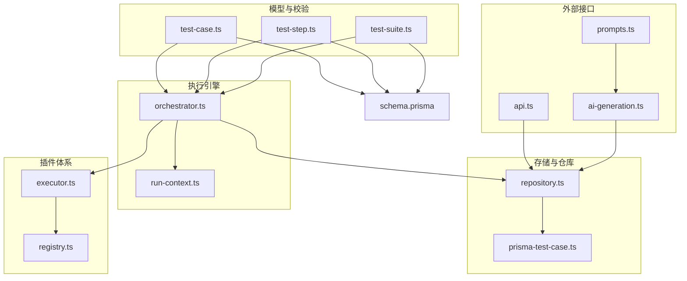
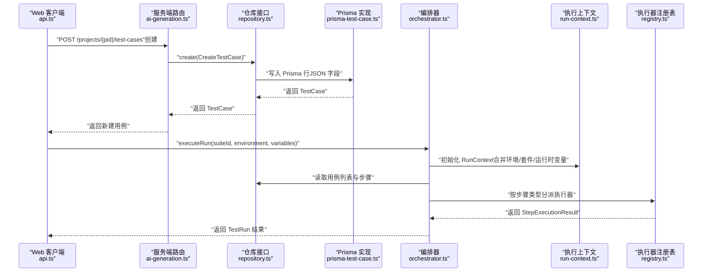
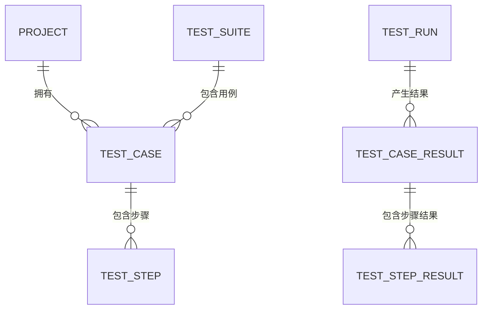
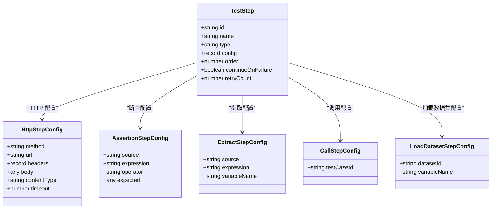
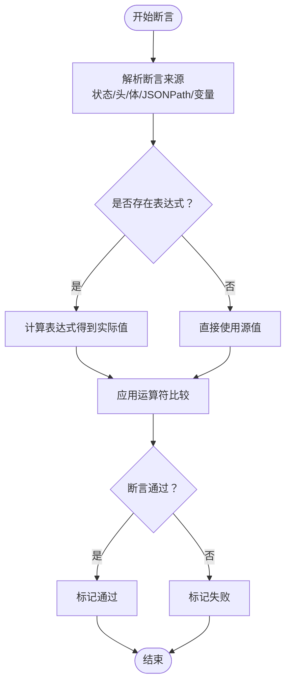
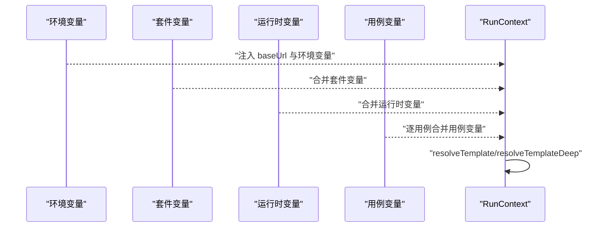
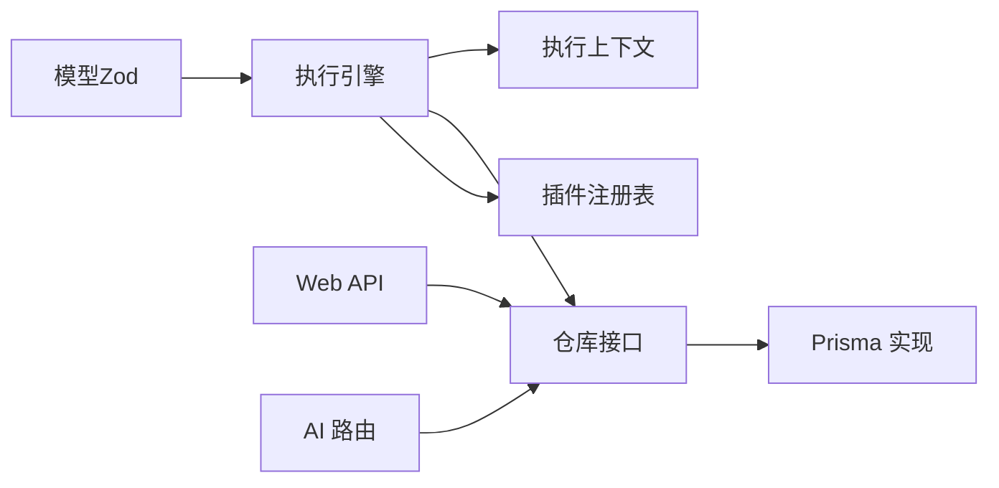

# 测试用例模型

<cite>
**本文引用的文件**
- [schema.prisma](file://prisma/schema.prisma)
- [test-case.ts](file://packages/core/src/models/test-case.ts)
- [test-step.ts](file://packages/core/src/models/test-step.ts)
- [test-suite.ts](file://packages/core/src/models/test-suite.ts)
- [orchestrator.ts](file://packages/core/src/engine/orchestrator.ts)
- [run-context.ts](file://packages/core/src/engine/run-context.ts)
- [repository.ts](file://packages/core/src/store/repository.ts)
- [prisma-test-case.ts](file://packages/core/src/store/prisma-test-case.ts)
- [executor.ts](file://packages/core/src/plugins/executor.ts)
- [registry.ts](file://packages/core/src/plugins/registry.ts)
- [api.ts](file://packages/web/src/lib/api.ts)
- [ai-generation.ts](file://packages/server/src/routes/ai-generation.ts)
- [prompts.ts](file://packages/ai/src/generation/prompts.ts)
</cite>

## 目录
1. [简介](#简介)
2. [项目结构](#项目结构)
3. [核心组件](#核心组件)
4. [架构总览](#架构总览)
5. [详细组件分析](#详细组件分析)
6. [依赖分析](#依赖分析)
7. [性能考虑](#性能考虑)
8. [故障排查指南](#故障排查指南)
9. [结论](#结论)
10. [附录](#附录)

## 简介
本文件系统性地文档化测试用例模型（TestCase）及其相关数据结构，覆盖以下主题：
- TestCase 实体结构：名称、模块、标签、优先级、步骤数组、变量映射、版本号等字段的语义与约束
- 测试步骤（TestStep）的数据结构与执行顺序：步骤类型、配置校验、排序与重试策略
- 断言规则（Assertion）的定义与验证逻辑：断言来源、表达式、运算符、期望值
- 变量替换机制与环境变量使用：模板语法、路径解析、变量合并层级
- 测试用例创建、编辑与执行的流程与示例路径
- 测试用例与项目、套件的关系：外键约束、索引、查询接口
- 测试用例模板与批量创建：AI生成预览到持久化的转换流程

## 项目结构
围绕测试用例模型的关键文件分布于以下模块：
- 数据模型与校验：packages/core/src/models
- 执行引擎与上下文：packages/core/src/engine
- 存储仓库与持久化：packages/core/src/store
- 插件注册与执行器：packages/core/src/plugins
- Web API 客户端封装：packages/web/src/lib/api.ts
- AI 生成路由与确认创建：packages/server/src/routes/ai-generation.ts
- AI 提示词构建：packages/ai/src/generation/prompts.ts
- 数据库 Schema：prisma/schema.prisma

图表来源
- [test-case.ts:1-45](file://packages/core/src/models/test-case.ts#L1-L45)
- [test-step.ts:1-102](file://packages/core/src/models/test-step.ts#L1-L102)
- [test-suite.ts:1-44](file://packages/core/src/models/test-suite.ts#L1-L44)
- [orchestrator.ts:1-170](file://packages/core/src/engine/orchestrator.ts#L1-L170)
- [run-context.ts:1-80](file://packages/core/src/engine/run-context.ts#L1-L80)
- [repository.ts:1-96](file://packages/core/src/store/repository.ts#L1-L96)
- [prisma-test-case.ts:98-147](file://packages/core/src/store/prisma-test-case.ts#L98-L147)
- [executor.ts:1-22](file://packages/core/src/plugins/executor.ts#L1-L22)
- [registry.ts:1-29](file://packages/core/src/plugins/registry.ts#L1-L29)
- [api.ts:149-165](file://packages/web/src/lib/api.ts#L149-L165)
- [ai-generation.ts:135-179](file://packages/server/src/routes/ai-generation.ts#L135-L179)
- [prompts.ts:1-35](file://packages/ai/src/generation/prompts.ts#L1-L35)
- [schema.prisma:26-44](file://prisma/schema.prisma#L26-L44)

章节来源
- [schema.prisma:26-44](file://prisma/schema.prisma#L26-L44)
- [test-case.ts:1-45](file://packages/core/src/models/test-case.ts#L1-L45)
- [test-step.ts:1-102](file://packages/core/src/models/test-step.ts#L1-L102)
- [test-suite.ts:1-44](file://packages/core/src/models/test-suite.ts#L1-L44)

## 核心组件
- 测试用例（TestCase）
  - 关键字段：id、projectId、name、description、module、tags、priority、steps、variables、version、createdAt、updatedAt
  - 校验规则：名称长度限制、模块默认空字符串、标签数组默认空数组、优先级枚举、步骤数组默认空数组、变量记录默认空对象、版本号整数且最小为1
  - 创建与更新分别有独立的 Zod 模式，确保输入约束一致
- 测试步骤（TestStep）
  - 步骤类型：HTTP、断言、提取、调用、加载数据集
  - 配置校验：按类型划分的配置模式（HTTP 方法、URL、头、体；断言来源/表达式/运算符/期望；提取来源/表达式/变量名；调用目标用例ID；数据集加载的变量名）
  - 执行控制：order 排序、continueOnFailure 继续失败、retryCount 重试次数
- 套件（TestSuite）
  - 关联多个用例ID、并行度、环境、套件级变量、setup/teardown 用例ID
- 执行上下文（RunContext）
  - 变量映射（Map）、模板解析（resolveTemplate/resolveTemplateDeep）、环境变量注入（baseUrl、environment.variables）

章节来源
- [test-case.ts:7-45](file://packages/core/src/models/test-case.ts#L7-L45)
- [test-step.ts:5-102](file://packages/core/src/models/test-step.ts#L5-L102)
- [test-suite.ts:3-44](file://packages/core/src/models/test-suite.ts#L3-L44)
- [run-context.ts:11-80](file://packages/core/src/engine/run-context.ts#L11-L80)

## 架构总览
下图展示从“创建/编辑”到“执行”的端到端流程，以及与数据库、仓库层、执行器的交互。

图表来源
- [api.ts:158-165](file://packages/web/src/lib/api.ts#L158-L165)
- [ai-generation.ts:147-179](file://packages/server/src/routes/ai-generation.ts#L147-L179)
- [repository.ts:28-45](file://packages/core/src/store/repository.ts#L28-L45)
- [prisma-test-case.ts:101-126](file://packages/core/src/store/prisma-test-case.ts#L101-L126)
- [orchestrator.ts:25-140](file://packages/core/src/engine/orchestrator.ts#L25-L140)
- [run-context.ts:18-54](file://packages/core/src/engine/run-context.ts#L18-L54)
- [registry.ts:13-23](file://packages/core/src/plugins/registry.ts#L13-L23)

## 详细组件分析

### 测试用例实体（TestCase）数据模型
- 字段与约束
  - 名称与描述：长度限制、可选描述
  - 模块与标签：默认空字符串与空数组
  - 优先级：枚举类型，缺省 medium
  - 步骤：数组，默认空数组；每个步骤含 id、name、type、config、order、continueOnFailure、retryCount
  - 变量：记录型映射，默认空对象
  - 版本：整数，最小为1，用于并发更新保护
- JSON 字段映射
  - tags、steps、variables 在数据库中以 JSON 存储，Prisma 层负责序列化/反序列化
- 关系与索引
  - 外键指向 Project，索引包含 projectId、module
- 创建/更新/删除/复制
  - 提供独立的 Zod 模式进行输入校验
  - 更新时自动递增版本号，步骤在持久化前补全 id 与 order

图表来源
- [schema.prisma:10-44](file://prisma/schema.prisma#L10-L44)
- [schema.prisma:46-64](file://prisma/schema.prisma#L46-L64)
- [schema.prisma:66-105](file://prisma/schema.prisma#L66-L105)

章节来源
- [test-case.ts:7-45](file://packages/core/src/models/test-case.ts#L7-L45)
- [prisma-test-case.ts:101-126](file://packages/core/src/store/prisma-test-case.ts#L101-L126)
- [schema.prisma:26-44](file://prisma/schema.prisma#L26-L44)

### 测试步骤（TestStep）数据结构与执行顺序
- 步骤类型与配置
  - HTTP：方法、URL、头、体、内容类型、超时
  - 断言：来源（状态、头、响应体、JSONPath、变量）、表达式、运算符、期望值
  - 提取：来源（响应体、JSONPath、头、状态、正则）、表达式、变量名
  - 调用：目标用例ID
  - 加载数据集：数据集ID、变量名
- 执行顺序
  - 按 order 升序排序执行
  - 支持 continueOnFailure 与 retryCount 控制失败策略
- 类型安全
  - 使用 Zod 的联合模式进行按类型校验

图表来源
- [test-step.ts:12-102](file://packages/core/src/models/test-step.ts#L12-L102)

章节来源
- [test-step.ts:5-102](file://packages/core/src/models/test-step.ts#L5-L102)
- [orchestrator.ts:154-155](file://packages/core/src/engine/orchestrator.ts#L154-L155)

### 断言规则与验证逻辑
- 断言来源（source）：状态码、头、响应体、JSONPath、变量
- 运算符（operator）：等于、不等于、包含、不包含、大于、大于等于、小于、小于等于、匹配、存在、不存在、类型为
- 验证流程
  - 解析表达式定位源值
  - 应用运算符比较期望值
  - 记录断言结果与实际值
- 执行器契约
  - 执行器返回的断言结果包含表达式、运算符、期望值、实际值与通过标记

图表来源
- [test-step.ts:21-43](file://packages/core/src/models/test-step.ts#L21-L43)
- [executor.ts:5-13](file://packages/core/src/plugins/executor.ts#L5-L13)

章节来源
- [test-step.ts:21-43](file://packages/core/src/models/test-step.ts#L21-L43)
- [executor.ts:5-13](file://packages/core/src/plugins/executor.ts#L5-L13)

### 变量替换机制与环境变量使用
- 模板语法
  - 使用双花括号 {{path.to.value}} 的模板语法
  - 支持深层路径访问（. 与 []），如 var.arr[0].field
- 解析过程
  - resolveTemplate：单字符串模板解析
  - resolveTemplateDeep：递归解析对象/数组中的模板
  - resolvePath：根据路径从变量映射中取值
- 变量来源与合并层级
  - 环境变量：baseUrl、environment.variables
  - 套件变量：TestSuite.variables
  - 运行时变量：executeRun 传入的 variables
  - 用例变量：TestCase.variables（逐个用例合并）
  - 合并顺序：环境 → 套件 → 运行时 → 用例（后者覆盖前者）

图表来源
- [run-context.ts:28-54](file://packages/core/src/engine/run-context.ts#L28-L54)
- [orchestrator.ts:34-69](file://packages/core/src/engine/orchestrator.ts#L34-L69)

章节来源
- [run-context.ts:35-78](file://packages/core/src/engine/run-context.ts#L35-L78)
- [orchestrator.ts:34-69](file://packages/core/src/engine/orchestrator.ts#L34-L69)

### 测试用例创建、编辑与执行（示例路径）
- 创建测试用例（Web 客户端）
  - 路径：packages/web/src/lib/api.ts
  - 示例调用：POST /projects/{projectId}/test-cases
  - 参数：CreateTestCase（包含 name、module、tags、priority、steps、variables 等）
- 编辑测试用例（Web 客户端）
  - 路径：packages/web/src/lib/api.ts
  - 示例调用：PUT /test-cases/{id}
  - 参数：UpdateTestCase（部分字段可选）
- AI 生成并确认创建
  - 路径：packages/server/src/routes/ai-generation.ts
  - 步骤：校验任务状态 → 选择预览项 → 构造 CreateTestCase → 逐条创建并记录已确认ID
- 执行测试套件
  - 路径：packages/core/src/engine/orchestrator.ts
  - 步骤：解析环境 → 合并变量 → 创建 TestRun → 执行 setup/用例/teardown → 记录结果

章节来源
- [api.ts:158-165](file://packages/web/src/lib/api.ts#L158-L165)
- [ai-generation.ts:147-179](file://packages/server/src/routes/ai-generation.ts#L147-L179)
- [orchestrator.ts:25-140](file://packages/core/src/engine/orchestrator.ts#L25-L140)

### 测试用例与项目、套件的关联关系
- 项目（Project）
  - 多个测试用例、套件、数据集、生成任务与其关联
- 套件（TestSuite）
  - 通过 testCaseIds 关联多个测试用例
  - 包含并行度、环境、套件级变量、setup/teardown 用例ID
- 执行结果
  - TestRun 关联 TestSuite
  - TestCaseResult 关联 TestRun 与 TestCase
  - TestStepResult 关联 TestCaseResult 与具体步骤

章节来源
- [schema.prisma:10-64](file://prisma/schema.prisma#L10-L64)
- [schema.prisma:66-124](file://prisma/schema.prisma#L66-L124)

### 测试用例模板与批量创建
- 模板来源
  - AI 生成：packages/ai/src/generation/prompts.ts 提供系统提示词，指导生成结构化用例
- 批量创建
  - 服务端路由：packages/server/src/routes/ai-generation.ts
  - 步骤：校验任务完成 → 选择预览索引 → 将 preview 映射为 CreateTestCase（补齐 order、continueOnFailure、retryCount）→ 逐条创建并更新 confirmedCaseIds

章节来源
- [prompts.ts:3-35](file://packages/ai/src/generation/prompts.ts#L3-L35)
- [ai-generation.ts:141-179](file://packages/server/src/routes/ai-generation.ts#L141-L179)

## 依赖分析
- 模型层
  - TestCase/Step/Suite 的 Zod 模式定义了输入约束
- 执行层
  - Orchestrator 负责执行顺序、变量合并、结果汇总
  - RunContext 提供模板解析与变量管理
  - PluginRegistry 管理执行器类型注册与获取
- 存储层
  - Repository 抽象出 CRUD 接口
  - Prisma 实现负责 JSON 字段的序列化与索引查询
- 外部接口
  - Web API 封装了客户端请求
  - AI 路由负责从生成任务到用例创建的桥接

图表来源
- [test-case.ts:7-45](file://packages/core/src/models/test-case.ts#L7-L45)
- [test-step.ts:74-102](file://packages/core/src/models/test-step.ts#L74-L102)
- [test-suite.ts:3-44](file://packages/core/src/models/test-suite.ts#L3-L44)
- [orchestrator.ts:17-23](file://packages/core/src/engine/orchestrator.ts#L17-L23)
- [run-context.ts:11-33](file://packages/core/src/engine/run-context.ts#L11-L33)
- [repository.ts:28-45](file://packages/core/src/store/repository.ts#L28-L45)
- [prisma-test-case.ts:101-126](file://packages/core/src/store/prisma-test-case.ts#L101-L126)
- [registry.ts:3-28](file://packages/core/src/plugins/registry.ts#L3-L28)
- [api.ts:158-165](file://packages/web/src/lib/api.ts#L158-L165)
- [ai-generation.ts:147-179](file://packages/server/src/routes/ai-generation.ts#L147-L179)

章节来源
- [repository.ts:1-96](file://packages/core/src/store/repository.ts#L1-L96)
- [prisma-test-case.ts:98-147](file://packages/core/src/store/prisma-test-case.ts#L98-L147)
- [registry.ts:1-29](file://packages/core/src/plugins/registry.ts#L1-L29)

## 性能考虑
- 步骤排序与执行
  - 每次执行前对步骤按 order 排序，建议在创建或更新时保证 order 唯一且连续，减少排序开销
- 变量解析
  - resolveTemplateDeep 对对象/数组递归解析，避免在高频场景中对大对象重复解析
- 并发与重试
  - 套件并行度由 TestSuite.parallelism 控制；单步重试由 retryCount 控制，注意避免过度重试导致的资源浪费
- 数据库存储
  - tags、steps、variables 为 JSON 字段，查询时尽量使用索引字段（如 module）或投影必要字段，避免全量 JSON 解析

## 故障排查指南
- 套件执行异常
  - 检查环境变量与合并顺序是否正确（环境 → 套件 → 运行时 → 用例）
  - 确认用例变量是否被正确注入（逐用例合并）
- 步骤执行失败
  - 查看 StepExecutionResult 中的 error 字段，定位具体错误信息
  - 检查断言表达式与运算符是否匹配源值类型
- 循环调用
  - Orchestrator 对调用深度设置了上限（默认 10），超过将抛出异常，检查是否存在循环调用
- 变量未替换
  - 确认模板语法为 {{var.path}}，路径拼写正确，变量已在 RunContext 中设置

章节来源
- [orchestrator.ts:147-149](file://packages/core/src/engine/orchestrator.ts#L147-L149)
- [executor.ts:5-13](file://packages/core/src/plugins/executor.ts#L5-L13)
- [run-context.ts:35-54](file://packages/core/src/engine/run-context.ts#L35-L54)

## 结论
测试用例模型通过清晰的字段定义、严格的输入校验与灵活的变量替换机制，实现了从创建、编辑到执行的完整闭环。结合执行引擎的顺序控制、断言验证与结果汇总，以及 AI 生成与批量创建能力，为 API 测试提供了高扩展性与可维护性的基础。建议在团队内统一变量命名规范与断言策略，并在 CI 中启用并行执行与重试策略，以提升整体测试效率与稳定性。

## 附录
- 关键实现路径参考
  - 创建用例（Web）：[packages/web/src/lib/api.ts:158-165](file://packages/web/src/lib/api.ts#L158-L165)
  - 更新用例（Server）：[packages/server/src/routes/test-cases.ts:47-52](file://packages/server/src/routes/test-cases.ts#L47-L52)
  - 删除与复制：[packages/server/src/routes/test-cases.ts:54-67](file://packages/server/src/routes/test-cases.ts#L54-L67)
  - AI 批量创建：[packages/server/src/routes/ai-generation.ts:147-179](file://packages/server/src/routes/ai-generation.ts#L147-L179)
  - 执行编排：[packages/core/src/engine/orchestrator.ts:25-140](file://packages/core/src/engine/orchestrator.ts#L25-L140)
  - 变量解析：[packages/core/src/engine/run-context.ts:35-78](file://packages/core/src/engine/run-context.ts#L35-L78)
  - 断言执行器契约：[packages/core/src/plugins/executor.ts:5-13](file://packages/core/src/plugins/executor.ts#L5-L13)
  - 插件注册表：[packages/core/src/plugins/registry.ts:13-23](file://packages/core/src/plugins/registry.ts#L13-L23)
  - 数据模型与 JSON 字段：[prisma/schema.prisma:26-44](file://prisma/schema.prisma#L26-L44)