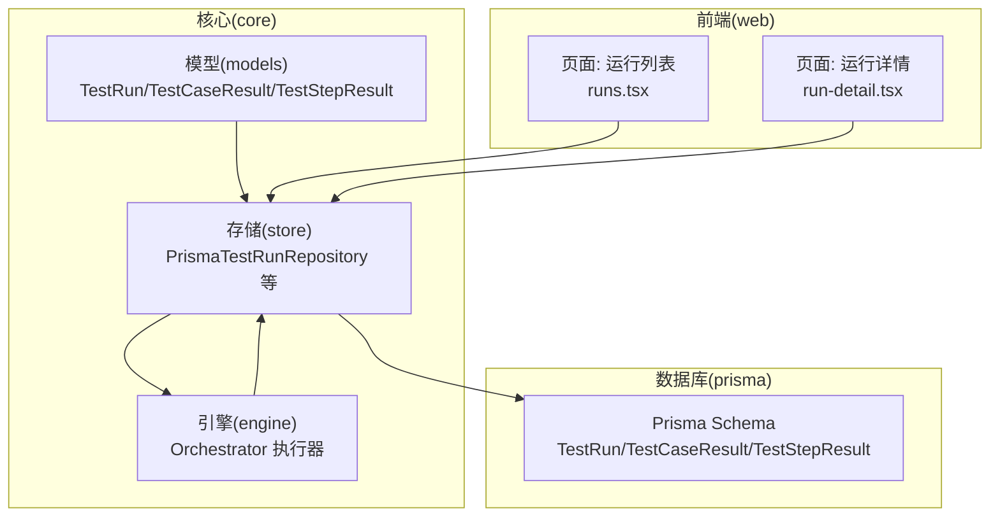
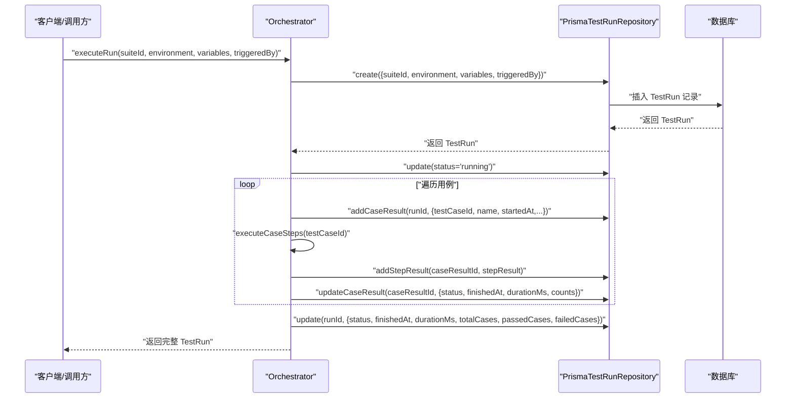
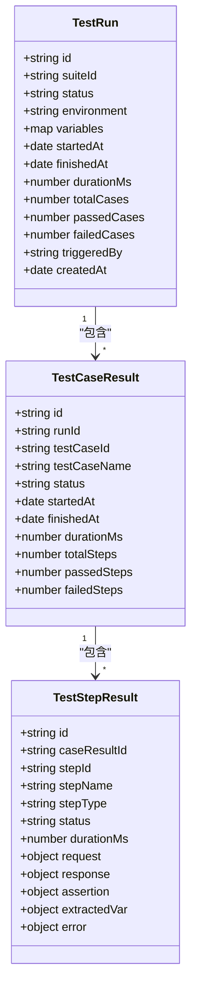
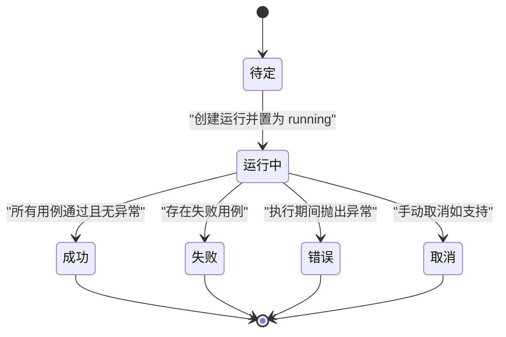
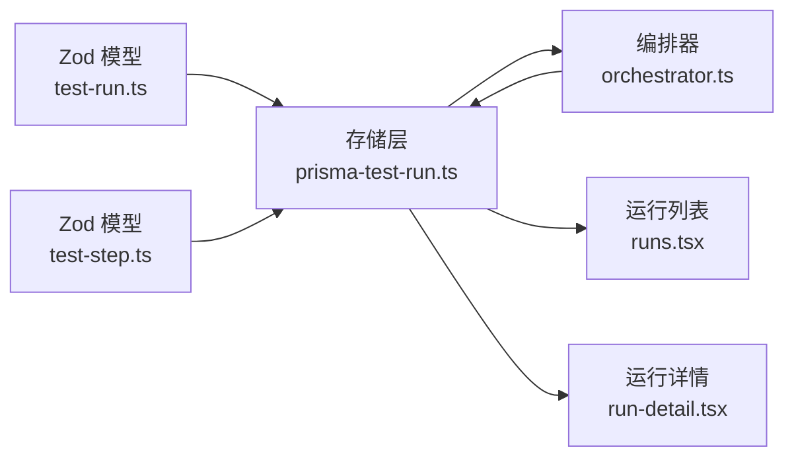

# 测试运行模型

<cite>
**本文引用的文件**   
- [schema.prisma](file://prisma/schema.prisma)
- [test-run.ts](file://packages/core/src/models/test-run.ts)
- [test-step.ts](file://packages/core/src/models/test-step.ts)
- [prisma-test-run.ts](file://packages/core/src/store/prisma-test-run.ts)
- [prisma-test-suite.ts](file://packages/core/src/store/prisma-test-suite.ts)
- [repository.ts](file://packages/core/src/store/repository.ts)
- [orchestrator.ts](file://packages/core/src/engine/orchestrator.ts)
- [runs.tsx](file://packages/web/src/pages/runs.tsx)
- [run-detail.tsx](file://packages/web/src/pages/run-detail.tsx)
- [specs-review-2026-04-24.md](file://docs/review-report/specs-review-2026-04-24.md)
</cite>

## 目录
1. [简介](#简介)
2. [项目结构](#项目结构)
3. [核心组件](#核心组件)
4. [架构总览](#架构总览)
5. [详细组件分析](#详细组件分析)
6. [依赖分析](#依赖分析)
7. [性能考量](#性能考量)
8. [故障排查指南](#故障排查指南)
9. [结论](#结论)
10. [附录](#附录)

## 简介
本文件围绕测试运行模型（TestRun）构建全面的数据模型与生命周期文档，涵盖运行状态、起止时间、结果统计等字段，解释状态转换与状态机设计，文档化执行结果的数据结构（步骤结果、错误信息、性能指标等），说明并行执行的协调机制与资源管理现状，并提供测试运行监控与状态查询的前端示例路径，解释运行历史记录与审计跟踪的实现方式，最后说明运行报告生成与结果分析的实现思路。

## 项目结构
本项目采用多包工作区结构，测试运行模型的核心位于 core 包中的模型、存储与引擎模块，数据库模型通过 Prisma 管理，Web 前端负责展示与交互。

图表来源
- [schema.prisma](file://prisma/schema.prisma)
- [prisma-test-run.ts](file://packages/core/src/store/prisma-test-run.ts)
- [orchestrator.ts](file://packages/core/src/engine/orchestrator.ts)
- [runs.tsx](file://packages/web/src/pages/runs.tsx)
- [run-detail.tsx](file://packages/web/src/pages/run-detail.tsx)

章节来源
- [schema.prisma](file://prisma/schema.prisma)
- [prisma-test-run.ts](file://packages/core/src/store/prisma-test-run.ts)
- [orchestrator.ts](file://packages/core/src/engine/orchestrator.ts)
- [runs.tsx](file://packages/web/src/pages/runs.tsx)
- [run-detail.tsx](file://packages/web/src/pages/run-detail.tsx)

## 核心组件
- TestRun：一次套件执行的完整运行记录，包含运行状态、环境、变量、起止时间、耗时、用例总数与通过/失败计数、触发来源等。
- TestCaseResult：单个用例在某次运行中的结果，包含步骤结果数组、起止时间、耗时、步骤总数与通过/失败计数。
- TestStepResult：单步执行结果，包含请求/响应、断言、提取变量、错误信息、耗时等。
- Orchestrator：编排器，负责创建运行、执行用例步骤、更新运行与用例结果、处理异常与状态转换。
- PrismaTestRunRepository：持久化层，负责 TestRun/TestCaseResult/TestStepResult 的创建、查询、更新。
- Web 页面：runs.tsx 与 run-detail.tsx 提供运行列表与详情展示，包含通过率、耗时、状态徽章等。

章节来源
- [test-run.ts](file://packages/core/src/models/test-run.ts)
- [test-step.ts](file://packages/core/src/models/test-step.ts)
- [prisma-test-run.ts](file://packages/core/src/store/prisma-test-run.ts)
- [orchestrator.ts](file://packages/core/src/engine/orchestrator.ts)
- [runs.tsx](file://packages/web/src/pages/runs.tsx)
- [run-detail.tsx](file://packages/web/src/pages/run-detail.tsx)

## 架构总览
下图展示了从“创建运行”到“执行步骤”再到“更新结果”的核心流程，以及数据在模型、存储与引擎之间的流转。

图表来源
- [orchestrator.ts](file://packages/core/src/engine/orchestrator.ts)
- [prisma-test-run.ts](file://packages/core/src/store/prisma-test-run.ts)

章节来源
- [orchestrator.ts](file://packages/core/src/engine/orchestrator.ts)
- [prisma-test-run.ts](file://packages/core/src/store/prisma-test-run.ts)

## 详细组件分析

### 数据模型与状态机
- TestRun 字段要点
  - 状态：pending → running → {passed|failed|error|cancelled}
  - 触发来源：manual/api/mcp
  - 统计：totalCases/passedCases/failedCases
  - 时间：startedAt/finishedAt/durationMs
  - 变量：environment 变量 + 套件变量 + 运行级变量合并
- TestCaseResult 字段要点
  - 状态：passed/failed/error/skipped
  - 统计：totalSteps/passedSteps/failedSteps
  - 时间：startedAt/finishedAt/durationMs
- TestStepResult 字段要点
  - 步骤类型：http/assertion/extract/call/load-dataset
  - 结果：status（passed/failed/error/skipped）
  - 性能：durationMs
  - 错误：error(message, stack)
  - HTTP：request/response（含响应时间）
  - 断言：assertion（表达式、运算符、期望/实际、是否通过）
  - 提取：extractedVar（变量名与值）

图表来源
- [test-run.ts](file://packages/core/src/models/test-run.ts)
- [test-step.ts](file://packages/core/src/models/test-step.ts)

章节来源
- [test-run.ts](file://packages/core/src/models/test-run.ts)
- [test-step.ts](file://packages/core/src/models/test-step.ts)

### TestRun 生命周期与状态机
- 状态转换
  - pending → running：创建运行并更新为 running
  - running → {passed|failed|error|cancelled}：根据用例执行结果与异常情况确定最终状态
- 关键事件
  - setupCaseId：在执行用例前运行一次
  - teardownCaseId：在所有用例完成后运行一次
  - 事件发射：case:start/case:complete/run:complete，便于前端或外部监听

图表来源
- [orchestrator.ts](file://packages/core/src/engine/orchestrator.ts)
- [test-run.ts](file://packages/core/src/models/test-run.ts)

章节来源
- [orchestrator.ts](file://packages/core/src/engine/orchestrator.ts)
- [test-run.ts](file://packages/core/src/models/test-run.ts)

### 执行结果的数据结构
- TestStepResult
  - 请求/响应：HTTP 步骤包含 method/url/headers/body/responseTimeMs 等
  - 断言：operator/expression/expected/actual/passed
  - 提取：variableName/value
  - 错误：message/stack
  - 耗时：durationMs
- TestCaseResult
  - 聚合步骤结果，统计 total/passed/failed 步骤数与用例耗时
- TestRun
  - 聚合用例结果，统计 total/passed/failed 用例数与整体耗时

章节来源
- [test-step.ts](file://packages/core/src/models/test-step.ts)
- [test-run.ts](file://packages/core/src/models/test-run.ts)

### 并行执行的协调机制与资源管理
- 当前实现
  - 套件级 parallelism 字段存在于 TestSuite 模型中，但编排器在执行时按顺序遍历用例，未体现并发调度
  - RunContext 使用共享上下文，未见隔离策略与锁机制
- 风险与建议
  - 评审指出“缺少并发控制”，建议在后续实现中引入任务队列、并发池与上下文隔离，避免变量竞争与状态污染
  - 对于递归调用（call 步骤），已设置最大调用深度以防止栈溢出

章节来源
- [prisma-test-suite.ts](file://packages/core/src/store/prisma-test-suite.ts)
- [orchestrator.ts](file://packages/core/src/engine/orchestrator.ts)
- [specs-review-2026-04-24.md](file://docs/review-report/specs-review-2026-04-24.md)

### 测试运行监控与状态查询（前端示例）
- 运行列表页 runs.tsx
  - 展示状态徽章、环境、用例总数/通过数/失败数、通过率、耗时、触发来源、创建时间
  - 支持分页与按状态过滤
- 运行详情页 run-detail.tsx
  - 展示 TestRun 摘要卡片（总数/通过/失败/通过率）
  - 展示每个用例的结果卡片，展开查看步骤明细
  - 步骤明细包含请求/响应/断言/错误等标签页

章节来源
- [runs.tsx](file://packages/web/src/pages/runs.tsx)
- [run-detail.tsx](file://packages/web/src/pages/run-detail.tsx)

### 运行历史记录与审计跟踪
- 数据库层面
  - TestRun/TestCaseResult/TestStepResult 三者均具备 createdAt 字段，可用于排序与筛选
  - TestRun 表包含 createdAt、finishedAt、durationMs 等时间维度字段，便于历史查询
- 审计维度
  - 触发来源（manual/api/mcp）可用于区分自动化与人工触发
  - 环境与变量合并记录，便于回溯执行上下文
- 查询接口
  - PrismaTestRunRepository 提供按 suiteId/status 分页查询，支持 orderBy createdAt desc

章节来源
- [schema.prisma](file://prisma/schema.prisma)
- [prisma-test-run.ts](file://packages/core/src/store/prisma-test-run.ts)

### 报告生成与结果分析
- 前端展示
  - 通过 runs.tsx 与 run-detail.tsx 展示通过率、耗时、步骤明细，形成基础报告视图
- 后端聚合
  - Orchestrator 在运行结束时计算 total/passed/failed 用例数与总耗时，并更新 TestRun
  - 按用例维度计算 passed/failed 步骤数与耗时，更新 TestCaseResult
- 扩展建议
  - 可在存储层增加导出接口，输出 CSV/JSON 报告
  - 可引入指标收集（如平均/中位数响应时间、失败分布）用于趋势分析

章节来源
- [orchestrator.ts](file://packages/core/src/engine/orchestrator.ts)
- [prisma-test-run.ts](file://packages/core/src/store/prisma-test-run.ts)
- [runs.tsx](file://packages/web/src/pages/runs.tsx)
- [run-detail.tsx](file://packages/web/src/pages/run-detail.tsx)

## 依赖分析
- 模型依赖
  - TestRun/TestCaseResult/TestStepResult 由 Zod 定义，确保数据结构与约束
- 存储依赖
  - PrismaTestRunRepository 依赖 Prisma 客户端，负责 CRUD 与 JSON 字段解析/序列化
- 引擎依赖
  - Orchestrator 依赖插件注册表、仓库接口与 RunContext，负责执行流程与状态转换
- 前端依赖
  - runs.tsx 与 run-detail.tsx 依赖 API 与本地状态，渲染运行列表与详情

图表来源
- [test-run.ts](file://packages/core/src/models/test-run.ts)
- [test-step.ts](file://packages/core/src/models/test-step.ts)
- [prisma-test-run.ts](file://packages/core/src/store/prisma-test-run.ts)
- [orchestrator.ts](file://packages/core/src/engine/orchestrator.ts)
- [runs.tsx](file://packages/web/src/pages/runs.tsx)
- [run-detail.tsx](file://packages/web/src/pages/run-detail.tsx)

章节来源
- [test-run.ts](file://packages/core/src/models/test-run.ts)
- [test-step.ts](file://packages/core/src/models/test-step.ts)
- [prisma-test-run.ts](file://packages/core/src/store/prisma-test-run.ts)
- [orchestrator.ts](file://packages/core/src/engine/orchestrator.ts)
- [runs.tsx](file://packages/web/src/pages/runs.tsx)
- [run-detail.tsx](file://packages/web/src/pages/run-detail.tsx)

## 性能考量
- 数据库查询
  - TestRun 列表按 createdAt 降序分页查询，支持按 suiteId/status 过滤
  - 详情查询包含 caseResults 与 stepResults 的预加载，注意大数据量下的查询成本
- 执行性能
  - 步骤重试机制通过 retryCount 控制，避免瞬时失败导致整条用例失败
  - 每步执行记录 durationMs，便于定位慢步骤
- 前端渲染
  - 详情页按需展开步骤明细，减少初始渲染压力

章节来源
- [prisma-test-run.ts](file://packages/core/src/store/prisma-test-run.ts)
- [orchestrator.ts](file://packages/core/src/engine/orchestrator.ts)
- [run-detail.tsx](file://packages/web/src/pages/run-detail.tsx)

## 故障排查指南
- 常见问题
  - 运行状态长时间停留在 pending 或 running：检查创建运行与更新状态的流程是否成功
  - 用例结果为空：确认 addCaseResult 与 addStepResult 是否被正确调用
  - 步骤报错：查看 TestStepResult.error 的 message/stack 字段
  - 并发冲突：若启用并行，需关注 RunContext 隔离与变量竞争
- 排查步骤
  - 通过 runs.tsx 查看运行状态与通过率
  - 通过 run-detail.tsx 查看具体用例与步骤的错误详情
  - 在 Orchestrator 中定位状态更新与异常捕获点

章节来源
- [runs.tsx](file://packages/web/src/pages/runs.tsx)
- [run-detail.tsx](file://packages/web/src/pages/run-detail.tsx)
- [prisma-test-run.ts](file://packages/core/src/store/prisma-test-run.ts)
- [orchestrator.ts](file://packages/core/src/engine/orchestrator.ts)

## 结论
本测试运行模型以清晰的数据结构与状态机为核心，结合编排器的执行流程与存储层的持久化能力，实现了从运行创建、用例执行、步骤结果记录到最终状态更新的完整闭环。前端提供了直观的运行列表与详情视图，便于监控与审计。当前实现未包含并发调度与上下文隔离，评审已提出风险与改进建议，后续可在保证数据一致性的前提下引入并发控制与资源管理策略。

## 附录
- 关键实现路径参考
  - 创建运行与状态更新：[executeRun](file://packages/core/src/engine/orchestrator.ts)
  - 添加用例结果与步骤结果：[addCaseResult/addStepResult](file://packages/core/src/store/prisma-test-run.ts)
  - 查询运行列表与详情：[findAll/findById](file://packages/core/src/store/prisma-test-run.ts)
  - 前端运行列表与详情：[runs.tsx](file://packages/web/src/pages/runs.tsx)、[run-detail.tsx](file://packages/web/src/pages/run-detail.tsx)
  - 数据模型定义：[test-run.ts](file://packages/core/src/models/test-run.ts)、[test-step.ts](file://packages/core/src/models/test-step.ts)
  - 数据库模型：[schema.prisma](file://prisma/schema.prisma)