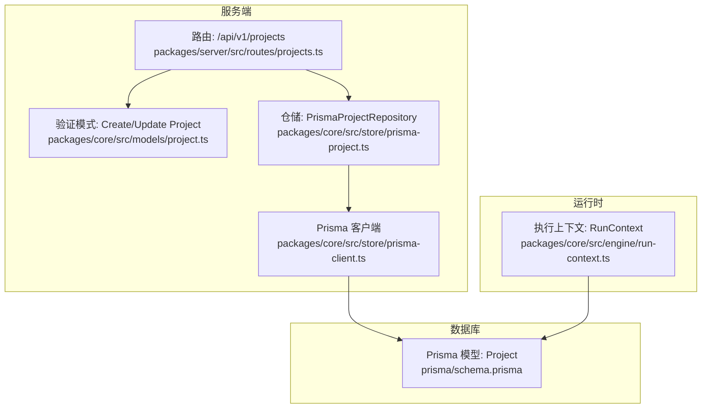
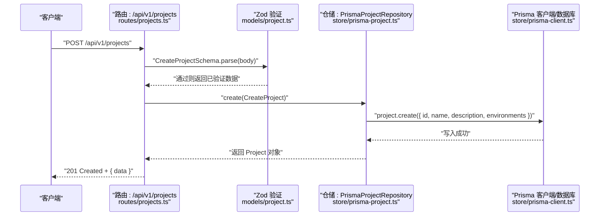
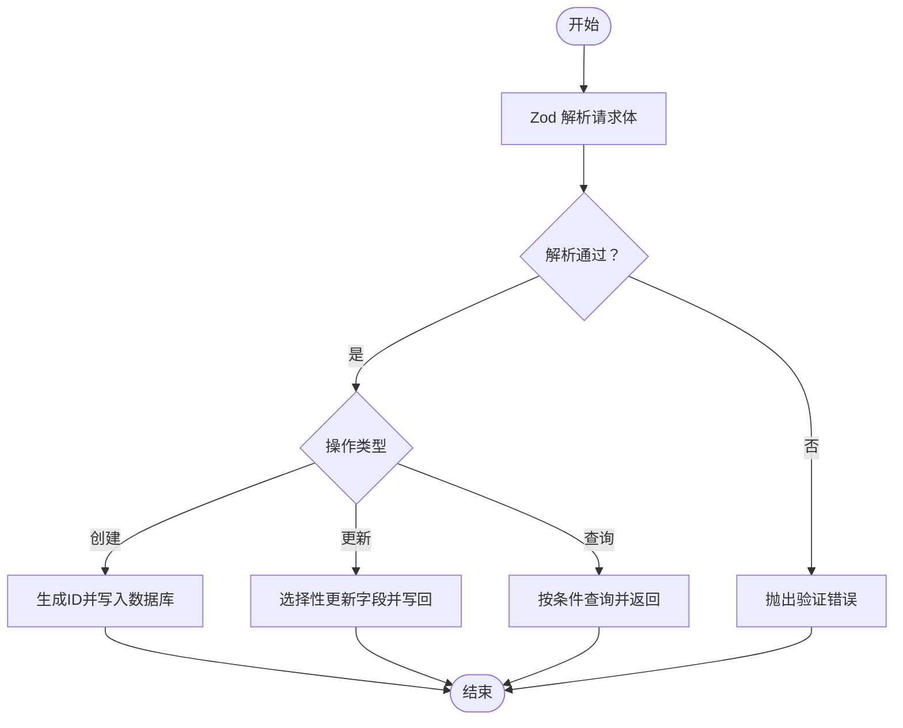
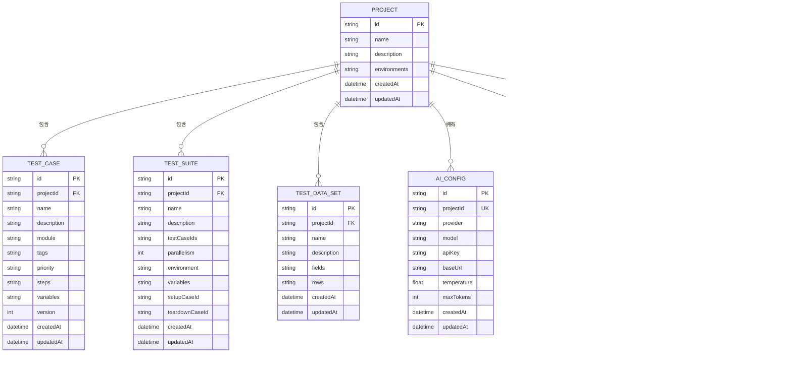
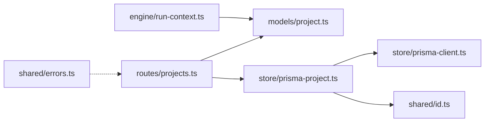

# 项目模型

<cite>
**本文引用的文件**
- [packages/core/src/models/project.ts](file://packages/core/src/models/project.ts)
- [prisma/schema.prisma](file://prisma/schema.prisma)
- [packages/core/src/store/prisma-project.ts](file://packages/core/src/store/prisma-project.ts)
- [packages/server/src/routes/projects.ts](file://packages/server/src/routes/projects.ts)
- [packages/core/src/engine/run-context.ts](file://packages/core/src/engine/run-context.ts)
- [packages/shared/src/errors.ts](file://packages/shared/src/errors.ts)
- [packages/shared/src/id.ts](file://packages/shared/src/id.ts)
- [packages/core/src/store/prisma-client.ts](file://packages/core/src/store/prisma-client.ts)
</cite>

## 目录
1. [简介](#简介)
2. [项目结构](#项目结构)
3. [核心组件](#核心组件)
4. [架构总览](#架构总览)
5. [详细组件分析](#详细组件分析)
6. [依赖关系分析](#依赖关系分析)
7. [性能考量](#性能考量)
8. [故障排查指南](#故障排查指南)
9. [结论](#结论)
10. [附录](#附录)

## 简介
本文件聚焦于“项目模型”的数据结构与验证体系，系统性阐述以下内容：
- Project 实体的字段定义、约束与默认值
- EnvironmentSchema 的嵌套结构、字段语义与验证规则
- CreateProjectSchema 与 UpdateProjectSchema 的差异与使用场景
- 项目创建、更新、查询的调用流程与错误处理
- Zod 验证模式的实现原理与错误传播路径
- 项目模型在系统中的角色以及与其它实体（测试用例、测试套件、接口端点、生成任务等）的关系

## 项目结构
围绕“项目模型”，本仓库的关键文件分布如下：
- 核心验证与类型：packages/core/src/models/project.ts
- 数据库模型定义：prisma/schema.prisma
- 仓储层（Prisma）：packages/core/src/store/prisma-project.ts
- 路由与控制器：packages/server/src/routes/projects.ts
- 运行时环境变量注入：packages/core/src/engine/run-context.ts
- 错误类型与通用工具：packages/shared/src/errors.ts、packages/shared/src/id.ts、packages/core/src/store/prisma-client.ts

图表来源
- [packages/server/src/routes/projects.ts:1-40](file://packages/server/src/routes/projects.ts#L1-L40)
- [packages/core/src/models/project.ts:1-30](file://packages/core/src/models/project.ts#L1-L30)
- [packages/core/src/store/prisma-project.ts:1-58](file://packages/core/src/store/prisma-project.ts#L1-L58)
- [packages/core/src/store/prisma-client.ts:1-18](file://packages/core/src/store/prisma-client.ts#L1-L18)
- [prisma/schema.prisma:10-24](file://prisma/schema.prisma#L10-L24)

章节来源
- [packages/server/src/routes/projects.ts:1-40](file://packages/server/src/routes/projects.ts#L1-L40)
- [packages/core/src/models/project.ts:1-30](file://packages/core/src/models/project.ts#L1-L30)
- [prisma/schema.prisma:10-24](file://prisma/schema.prisma#L10-L24)

## 核心组件
- Project 实体（数据库模型）
  - 字段与约束
    - id: 字符串主键
    - name: 非空字符串，最大长度限制
    - description: 可选字符串
    - environments: JSON 字符串，默认为空数组；存储一组环境配置对象
    - createdAt/updatedAt: 时间戳，默认值与自动更新
  - 关系
    - 一对多：Project → TestCase/TestSuite/TestDataSet/AiConfig/ApiEndpoint/GenerationTask
- EnvironmentSchema（Zod 模式）
  - name: 非空字符串
  - baseUrl: URL 格式校验
  - variables: 记录类型（字符串到字符串），默认空对象
- ProjectSchema（Zod 模式）
  - 包含 Project 实体全部字段，且包含 createdAt/updatedAt 的日期类型校验
- CreateProjectSchema（Zod 模式）
  - 必填字段：name、environments（默认空数组）
  - 可选字段：description
- UpdateProjectSchema（Zod 模式）
  - 基于 CreateProjectSchema 使用 partial()，表示所有字段均为可选

章节来源
- [prisma/schema.prisma:10-24](file://prisma/schema.prisma#L10-L24)
- [packages/core/src/models/project.ts:3-24](file://packages/core/src/models/project.ts#L3-L24)

## 架构总览
下图展示从 HTTP 请求到数据库持久化的完整链路，以及运行时对环境变量的使用。

图表来源
- [packages/server/src/routes/projects.ts:8-12](file://packages/server/src/routes/projects.ts#L8-L12)
- [packages/core/src/models/project.ts:18-22](file://packages/core/src/models/project.ts#L18-L22)
- [packages/core/src/store/prisma-project.ts:18-28](file://packages/core/src/store/prisma-project.ts#L18-L28)
- [packages/core/src/store/prisma-client.ts:5-10](file://packages/core/src/store/prisma-client.ts#L5-L10)

## 详细组件分析

### Project 实体与数据库模型
- 字段定义与约束
  - id: 主键，字符串
  - name: 非空，最大长度限制
  - description: 可选
  - environments: JSON 字符串，默认“[]”，用于存储一组环境对象
  - createdAt/updatedAt: 默认值与自动更新
- 关系
  - 与 TestCase/TestSuite/TestDataSet/AiConfig/ApiEndpoint/GenerationTask 建立一对多关系
- JSON 存储策略
  - environments 以 JSON 字符串形式存储，读取时解析，写入时序列化

章节来源
- [prisma/schema.prisma:10-24](file://prisma/schema.prisma#L10-L24)
- [packages/core/src/store/prisma-project.ts:6-15](file://packages/core/src/store/prisma-project.ts#L6-L15)

### EnvironmentSchema 嵌套结构与验证规则
- 字段与规则
  - name: 非空字符串
  - baseUrl: URL 格式校验
  - variables: 记录类型（字符串到字符串），默认空对象
- 使用场景
  - 作为 Project.environments 数组元素，用于运行时注入 baseUrl 与变量
  - 在执行上下文中被注入到变量映射中，供模板渲染与请求拼装使用

章节来源
- [packages/core/src/models/project.ts:3-7](file://packages/core/src/models/project.ts#L3-L7)
- [packages/core/src/engine/run-context.ts:28-32](file://packages/core/src/engine/run-context.ts#L28-L32)

### CreateProjectSchema 与 UpdateProjectSchema 的差异与使用场景
- CreateProjectSchema
  - 必填：name、environments（默认空数组）
  - 可选：description
  - 场景：创建新项目时的输入校验
- UpdateProjectSchema
  - 基于 CreateProjectSchema 使用 partial()，所有字段均为可选
  - 场景：部分字段更新（如仅更新名称或环境列表）

章节来源
- [packages/core/src/models/project.ts:18-24](file://packages/core/src/models/project.ts#L18-L24)

### 项目创建、更新与查询流程
- 创建流程
  - 路由接收请求体，使用 CreateProjectSchema 解析
  - 仓储层生成 id，序列化 environments，写入数据库
  - 返回 201 与创建后的项目对象
- 查询流程
  - 列表：按创建时间倒序返回
  - 单个：按 id 查找，不存在返回 404
- 更新流程
  - 使用 UpdateProjectSchema 解析请求体
  - 仓储层仅更新传入的字段，并序列化 environments 后写入

图表来源
- [packages/server/src/routes/projects.ts:8-32](file://packages/server/src/routes/projects.ts#L8-L32)
- [packages/core/src/store/prisma-project.ts:18-52](file://packages/core/src/store/prisma-project.ts#L18-L52)
- [packages/core/src/models/project.ts:18-24](file://packages/core/src/models/project.ts#L18-L24)

章节来源
- [packages/server/src/routes/projects.ts:8-32](file://packages/server/src/routes/projects.ts#L8-L32)
- [packages/core/src/store/prisma-project.ts:18-52](file://packages/core/src/store/prisma-project.ts#L18-L52)

### Zod 验证模式实现原理与错误处理机制
- 实现原理
  - 使用 z.object 定义结构化模式，结合 .min/.max/.url/.record/.partial 等方法表达约束
  - parse() 方法在运行时对输入进行严格校验，失败时抛出异常
- 错误处理
  - 路由层直接调用 parse() 并将错误透传给上层框架处理
  - 未捕获的解析异常通常会被统一的错误中间件转换为标准响应
  - 项目内还提供了通用错误类型（如 AppError、ValidationError、NotFoundError），便于在业务层进行更细粒度的错误建模与传播

章节来源
- [packages/core/src/models/project.ts:3-24](file://packages/core/src/models/project.ts#L3-L24)
- [packages/server/src/routes/projects.ts:9,29](file://packages/server/src/routes/projects.ts#L9,L29)
- [packages/shared/src/errors.ts:1-25](file://packages/shared/src/errors.ts#L1-L25)

### 项目模型在系统中的作用与关联实体
- 角色定位
  - 项目是测试域的核心容器，承载测试用例、测试套件、数据集、AI 配置、接口端点与生成任务等资源
- 关联关系
  - 与 TestCase：一对多，每个用例属于一个项目
  - 与 TestSuite：一对多，每个套件属于一个项目
  - 与 TestDataSet：一对多，每个数据集属于一个项目
  - 与 AiConfig：一对一，每个项目最多一个 AI 配置
  - 与 ApiEndpoint：一对多，每个端点属于一个项目
  - 与 GenerationTask：一对多，每个任务属于一个项目
- 运行时影响
  - 环境变量（baseUrl 与 variables）在执行上下文中被注入，用于模板渲染与请求构造

图表来源
- [prisma/schema.prisma:10-196](file://prisma/schema.prisma#L10-L196)

章节来源
- [prisma/schema.prisma:10-196](file://prisma/schema.prisma#L10-L196)

## 依赖关系分析
- 路由层依赖验证模式（Create/Update Project）
- 仓储层依赖 Prisma 客户端与共享 ID 工具
- 执行上下文依赖环境配置（Environment）进行变量注入
- 错误类型为统一错误处理提供基础

图表来源
- [packages/server/src/routes/projects.ts:1-40](file://packages/server/src/routes/projects.ts#L1-L40)
- [packages/core/src/models/project.ts:1-30](file://packages/core/src/models/project.ts#L1-L30)
- [packages/core/src/store/prisma-project.ts:1-58](file://packages/core/src/store/prisma-project.ts#L1-L58)
- [packages/core/src/store/prisma-client.ts:1-18](file://packages/core/src/store/prisma-client.ts#L1-L18)
- [packages/shared/src/id.ts:1-6](file://packages/shared/src/id.ts#L1-L6)
- [packages/core/src/engine/run-context.ts:1-41](file://packages/core/src/engine/run-context.ts#L1-L41)
- [packages/shared/src/errors.ts:1-25](file://packages/shared/src/errors.ts#L1-L25)

章节来源
- [packages/server/src/routes/projects.ts:1-40](file://packages/server/src/routes/projects.ts#L1-L40)
- [packages/core/src/store/prisma-project.ts:1-58](file://packages/core/src/store/prisma-project.ts#L1-L58)
- [packages/core/src/engine/run-context.ts:1-41](file://packages/core/src/engine/run-context.ts#L1-L41)
- [packages/shared/src/errors.ts:1-25](file://packages/shared/src/errors.ts#L1-L25)

## 性能考量
- JSON 字段序列化/反序列化
  - environments 以 JSON 字符串存储，读写涉及序列化/反序列化，建议控制数组规模与层级深度
- 查询排序
  - 列表查询按 createdAt 倒序，适合分页与增量拉取
- ID 生成
  - 使用基于 cuid2 的生成器，具备去重与可预测性优势，适合分布式场景

## 故障排查指南
- 常见问题
  - 输入不符合 Zod 模式：检查 name 长度、environments 结构、baseUrl 是否为合法 URL
  - 404 未找到：确认项目 id 是否正确，或是否已被删除
  - 更新无效：确保传入了需要更新的字段，否则不会写入数据库
- 排查步骤
  - 在路由层确认 parse() 是否抛错
  - 在仓储层确认 JSON 序列化是否成功
  - 在数据库层确认 environments 字段是否为有效 JSON

章节来源
- [packages/server/src/routes/projects.ts:21-24](file://packages/server/src/routes/projects.ts#L21-L24)
- [packages/core/src/store/prisma-project.ts:40-52](file://packages/core/src/store/prisma-project.ts#L40-L52)
- [packages/shared/src/errors.ts:13-18](file://packages/shared/src/errors.ts#L13-L18)

## 结论
项目模型通过严格的 Zod 验证与 Prisma 的 JSON 字段设计，实现了对“项目”这一核心实体的强约束与灵活扩展。EnvironmentSchema 为运行时注入提供了清晰的结构边界；Create/Update Schema 的分离使创建与更新场景职责明确。结合统一的错误类型与仓储层的 JSON 处理，系统在保证数据一致性的同时，也兼顾了可维护性与可扩展性。

## 附录
- 代码示例路径（不展示具体代码）
  - 创建项目
    - 路由入口：[packages/server/src/routes/projects.ts:8-12](file://packages/server/src/routes/projects.ts#L8-L12)
    - 验证模式：[packages/core/src/models/project.ts:18-22](file://packages/core/src/models/project.ts#L18-L22)
    - 仓储实现：[packages/core/src/store/prisma-project.ts:18-28](file://packages/core/src/store/prisma-project.ts#L18-L28)
  - 更新项目
    - 路由入口：[packages/server/src/routes/projects.ts:28-32](file://packages/server/src/routes/projects.ts#L28-L32)
    - 验证模式：[packages/core/src/models/project.ts:24](file://packages/core/src/models/project.ts#L24)
    - 仓储实现：[packages/core/src/store/prisma-project.ts:40-52](file://packages/core/src/store/prisma-project.ts#L40-L52)
  - 查询项目
    - 列表：[packages/server/src/routes/projects.ts:14-18](file://packages/server/src/routes/projects.ts#L14-L18)
    - 单个：[packages/server/src/routes/projects.ts:20-25](file://packages/server/src/routes/projects.ts#L20-L25)
  - 运行时环境变量注入
    - 注入逻辑：[packages/core/src/engine/run-context.ts:28-32](file://packages/core/src/engine/run-context.ts#L28-L32)