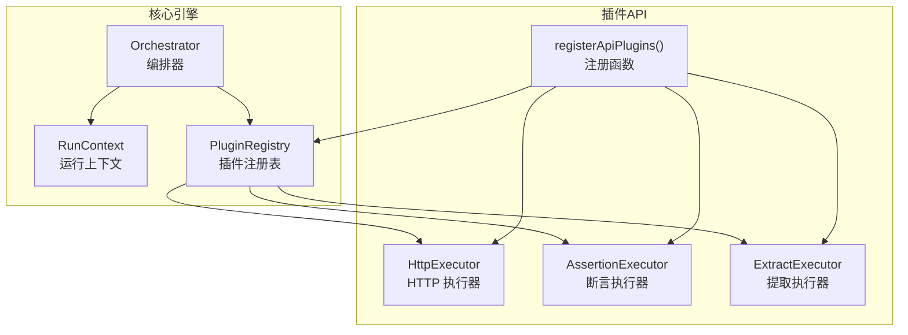
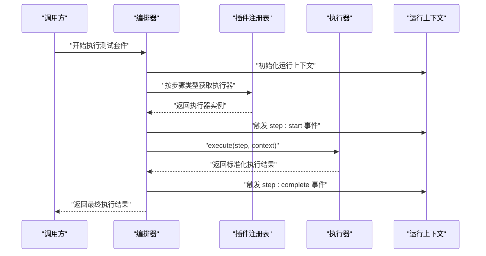
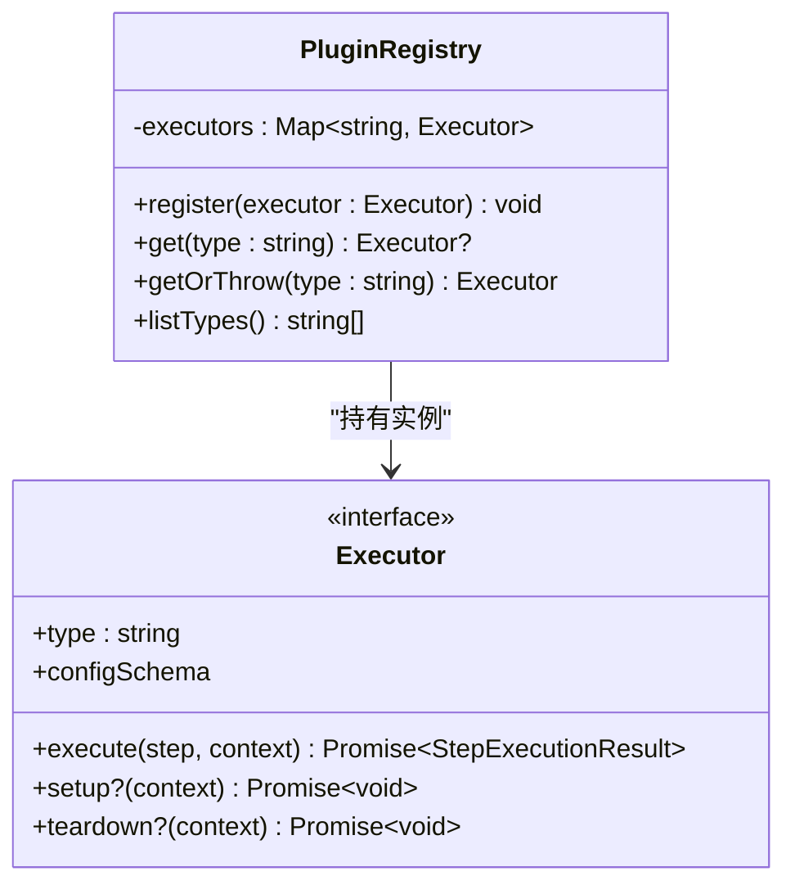
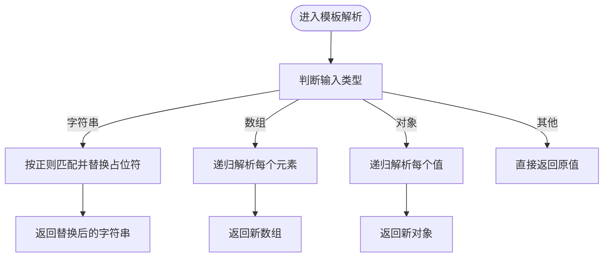
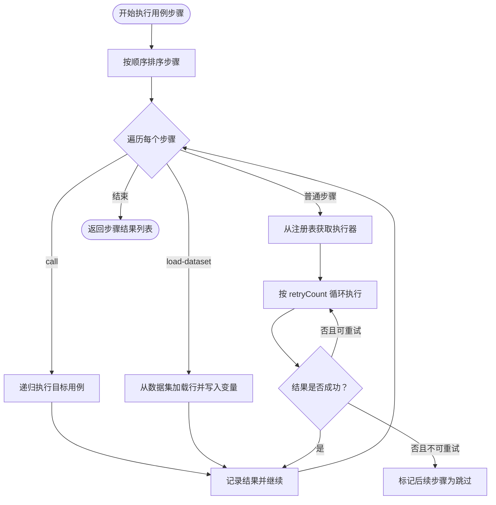
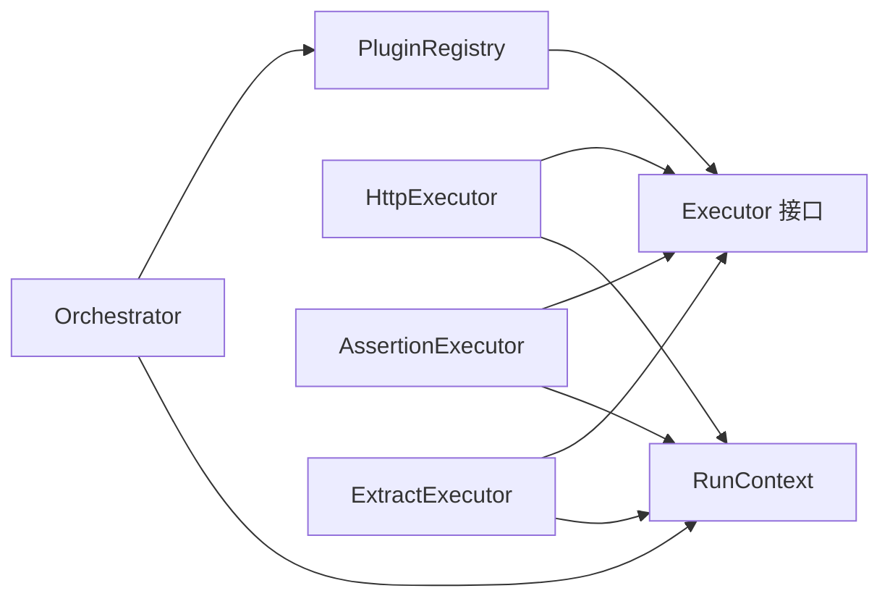

# 插件系统

<cite>
**本文引用的文件**
- [packages/plugin-api/src/index.ts](file://packages/plugin-api/src/index.ts)
- [packages/plugin-api/src/http-executor.ts](file://packages/plugin-api/src/http-executor.ts)
- [packages/plugin-api/src/assertions.ts](file://packages/plugin-api/src/assertions.ts)
- [packages/plugin-api/src/extractors.ts](file://packages/plugin-api/src/extractors.ts)
- [packages/core/src/plugins/index.ts](file://packages/core/src/plugins/index.ts)
- [packages/core/src/plugins/registry.ts](file://packages/core/src/plugins/registry.ts)
- [packages/core/src/plugins/executor.ts](file://packages/core/src/plugins/executor.ts)
- [packages/core/src/engine/orchestrator.ts](file://packages/core/src/engine/orchestrator.ts)
- [packages/core/src/engine/run-context.ts](file://packages/core/src/engine/run-context.ts)
- [packages/core/src/models/test-step.ts](file://packages/core/src/models/test-step.ts)
</cite>

## 目录
1. [简介](#简介)
2. [项目结构](#项目结构)
3. [核心组件](#核心组件)
4. [架构总览](#架构总览)
5. [详细组件分析](#详细组件分析)
6. [依赖关系分析](#依赖关系分析)
7. [性能考量](#性能考量)
8. [故障排查指南](#故障排查指南)
9. [结论](#结论)
10. [附录：插件开发指南与示例](#附录插件开发指南与示例)

## 简介
本文件系统性阐述插件系统的整体设计与实现，重点覆盖以下方面：
- PluginRegistry 的设计与职责边界：注册、查找、类型安全与动态发现能力
- 执行器模式（Executor）的接口定义、生命周期钩子与错误处理策略
- 插件注册表的管理功能：注册、查找、校验与卸载（可用性）
- 插件与核心引擎的集成：依赖注入、事件通信、状态同步与模板解析
- 插件开发指南：接口实现、最佳实践、调试方法
- 典型插件示例与使用场景

## 项目结构
插件系统由“核心引擎”和“插件API”两部分组成：
- 核心引擎位于 packages/core，负责测试编排、运行上下文、步骤执行与结果聚合
- 插件API位于 packages/plugin-api，提供默认插件（HTTP 请求、断言、提取变量）及注册入口

图表来源
- [packages/core/src/engine/orchestrator.ts:1-296](file://packages/core/src/engine/orchestrator.ts#L1-L296)
- [packages/core/src/engine/run-context.ts:1-80](file://packages/core/src/engine/run-context.ts#L1-L80)
- [packages/core/src/plugins/registry.ts:1-29](file://packages/core/src/plugins/registry.ts#L1-L29)
- [packages/plugin-api/src/index.ts:1-15](file://packages/plugin-api/src/index.ts#L1-L15)
- [packages/plugin-api/src/http-executor.ts:1-95](file://packages/plugin-api/src/http-executor.ts#L1-L95)
- [packages/plugin-api/src/assertions.ts:1-112](file://packages/plugin-api/src/assertions.ts#L1-L112)
- [packages/plugin-api/src/extractors.ts:1-68](file://packages/plugin-api/src/extractors.ts#L1-L68)

章节来源
- [packages/core/src/plugins/index.ts:1-3](file://packages/core/src/plugins/index.ts#L1-L3)
- [packages/plugin-api/src/index.ts:1-15](file://packages/plugin-api/src/index.ts#L1-L15)

## 核心组件
- 插件注册表（PluginRegistry）
  - 职责：维护执行器映射，提供注册、查找、类型列表查询
  - 关键点：按 type 唯一注册；重复注册抛出异常；未注册时提供可用类型提示
- 执行器接口（Executor）
  - 必备字段：type（字符串）、configSchema（Zod 模式）
  - 必备方法：execute(step, context) 返回标准化执行结果
  - 可选生命周期：setup(context)、teardown(context)
- 运行上下文（RunContext）
  - 提供环境变量、模板解析（单层与深拷贝）、事件发射器、上一次响应缓存
- 编排器（Orchestrator）
  - 负责测试套件执行、用例编排、步骤调度、重试与失败中断、事件通知、结果持久化

章节来源
- [packages/core/src/plugins/registry.ts:1-29](file://packages/core/src/plugins/registry.ts#L1-L29)
- [packages/core/src/plugins/executor.ts:1-23](file://packages/core/src/plugins/executor.ts#L1-L23)
- [packages/core/src/engine/run-context.ts:1-80](file://packages/core/src/engine/run-context.ts#L1-L80)
- [packages/core/src/engine/orchestrator.ts:1-296](file://packages/core/src/engine/orchestrator.ts#L1-L296)

## 架构总览
插件系统采用“注册表 + 执行器”的解耦架构：
- 注册表集中管理所有执行器实例
- 编排器通过注册表按步骤类型动态分发执行
- 执行器仅关注自身配置校验与业务逻辑，不感知编排细节
- 运行上下文贯穿执行全程，承载变量、模板解析与事件

图表来源
- [packages/core/src/engine/orchestrator.ts:240-266](file://packages/core/src/engine/orchestrator.ts#L240-L266)
- [packages/core/src/plugins/registry.ts:13-23](file://packages/core/src/plugins/registry.ts#L13-L23)
- [packages/core/src/engine/run-context.ts:1-80](file://packages/core/src/engine/run-context.ts#L1-L80)

## 详细组件分析

### 插件注册表（PluginRegistry）
- 设计要点
  - 使用 Map 以 type 为键存储执行器实例，确保类型唯一性
  - 注册时检查重复，避免覆盖已有实现
  - 提供 get/getOrThrow/listTypes，支持安全访问与动态发现
- 类图

图表来源
- [packages/core/src/plugins/registry.ts:1-29](file://packages/core/src/plugins/registry.ts#L1-L29)
- [packages/core/src/plugins/executor.ts:1-23](file://packages/core/src/plugins/executor.ts#L1-L23)

章节来源
- [packages/core/src/plugins/registry.ts:1-29](file://packages/core/src/plugins/registry.ts#L1-L29)

### 执行器接口（Executor）与生命周期
- 接口定义
  - type：执行器标识，用于注册表索引
  - configSchema：每类执行器的配置校验模式
  - execute：核心执行方法，返回标准化结果对象
  - setup/teardown：可选生命周期钩子，便于资源准备与清理
- 结果模型（StepExecutionResult）
  - 统一的状态枚举：passed、failed、error、skipped
  - 包含请求/响应元信息、断言/提取结果、错误信息与耗时

章节来源
- [packages/core/src/plugins/executor.ts:1-23](file://packages/core/src/plugins/executor.ts#L1-L23)

### 运行上下文（RunContext）
- 能力
  - 环境变量与初始变量的合并与存储
  - 模板解析：支持 {{var}}、{{obj.key}}、{{arr[0].key}} 等路径表达式
  - 深度模板解析：对对象/数组递归替换
  - 事件发射器：供编排器监听 step:start/complete、run:complete 等事件
  - 上次响应缓存：为断言/提取等后续步骤提供数据源
- 流程图（模板解析）

图表来源
- [packages/core/src/engine/run-context.ts:35-54](file://packages/core/src/engine/run-context.ts#L35-L54)

章节来源
- [packages/core/src/engine/run-context.ts:1-80](file://packages/core/src/engine/run-context.ts#L1-L80)

### 编排器（Orchestrator）与插件协作
- 职责
  - 解析环境、合并变量、创建测试运行记录并更新状态
  - 执行用例前/后置步骤（setupCaseId/teardownCaseId）
  - 驱动步骤执行：普通步骤通过注册表分发到对应执行器；call 步骤递归执行；load-dataset 步骤加载数据集到变量
  - 处理重试、失败中断、事件通知与结果持久化
- 关键流程（步骤执行）

图表来源
- [packages/core/src/engine/orchestrator.ts:142-294](file://packages/core/src/engine/orchestrator.ts#L142-L294)

章节来源
- [packages/core/src/engine/orchestrator.ts:1-296](file://packages/core/src/engine/orchestrator.ts#L1-L296)

### 默认插件实现

#### HTTP 执行器（HttpExecutor）
- 功能
  - 基于 undici 发起 HTTP 请求
  - 支持模板解析 URL/头/体，设置 Content-Type
  - 记录响应状态、头、体与耗时，并缓存到 RunContext
  - 异常捕获并返回标准化错误结果
- 关键点
  - 使用 HttpStepConfigSchema 校验配置
  - 通过 RunContext.resolveTemplateDeep 完成深度模板替换
  - 将响应写入 context.lastResponse，供后续断言/提取使用

章节来源
- [packages/plugin-api/src/http-executor.ts:1-95](file://packages/plugin-api/src/http-executor.ts#L1-L95)
- [packages/core/src/models/test-step.ts:12-19](file://packages/core/src/models/test-step.ts#L12-L19)

#### 断言执行器（AssertionExecutor）
- 功能
  - 支持多种断言源：状态码、头、响应体、JSONPath、变量
  - 支持多种断言运算符：等于/不等于、包含/不包含、数值比较、正则匹配、存在性、类型判断
  - 将断言结果写入 StepExecutionResult.assertion
- 关键点
  - 从 RunContext.lastResponse 或变量中解析实际值
  - 对表达式进行严格校验，未知源或运算符会抛出错误

章节来源
- [packages/plugin-api/src/assertions.ts:1-112](file://packages/plugin-api/src/assertions.ts#L1-L112)
- [packages/core/src/models/test-step.ts:36-43](file://packages/core/src/models/test-step.ts#L36-L43)

#### 提取执行器（ExtractExecutor）
- 功能
  - 支持从状态码、头、响应体、JSONPath、正则中抽取值
  - 将提取值写入 RunContext.variables，供后续步骤使用
- 关键点
  - 从 RunContext.lastResponse 获取上下文数据
  - 对无响应或表达式缺失的情况抛出明确错误

章节来源
- [packages/plugin-api/src/extractors.ts:1-68](file://packages/plugin-api/src/extractors.ts#L1-L68)
- [packages/core/src/models/test-step.ts:45-51](file://packages/core/src/models/test-step.ts#L45-L51)

#### 插件注册入口（registerApiPlugins）
- 功能
  - 将默认插件（HTTP、断言、提取）注册到传入的 PluginRegistry
  - 作为外部应用集成插件系统的统一入口

章节来源
- [packages/plugin-api/src/index.ts:1-15](file://packages/plugin-api/src/index.ts#L1-L15)

## 依赖关系分析
- 模块耦合
  - Orchestrator 依赖 PluginRegistry 与 RunContext，不直接依赖具体执行器实现，体现良好解耦
  - 执行器仅依赖核心模型与运行上下文，保持纯业务逻辑
- 外部依赖
  - 插件API 使用 undici 发送 HTTP 请求
  - 核心模型使用 Zod 进行配置校验
- 可能的循环依赖
  - 当前结构清晰，无明显循环导入

图表来源
- [packages/core/src/engine/orchestrator.ts:1-23](file://packages/core/src/engine/orchestrator.ts#L1-L23)
- [packages/core/src/plugins/registry.ts:1-11](file://packages/core/src/plugins/registry.ts#L1-L11)
- [packages/plugin-api/src/http-executor.ts:1-9](file://packages/plugin-api/src/http-executor.ts#L1-L9)
- [packages/plugin-api/src/assertions.ts:1-9](file://packages/plugin-api/src/assertions.ts#L1-L9)
- [packages/plugin-api/src/extractors.ts:1-9](file://packages/plugin-api/src/extractors.ts#L1-L9)

章节来源
- [packages/core/src/engine/orchestrator.ts:1-23](file://packages/core/src/engine/orchestrator.ts#L1-L23)
- [packages/core/src/plugins/registry.ts:1-11](file://packages/core/src/plugins/registry.ts#L1-L11)
- [packages/plugin-api/src/http-executor.ts:1-9](file://packages/plugin-api/src/http-executor.ts#L1-L9)
- [packages/plugin-api/src/assertions.ts:1-9](file://packages/plugin-api/src/assertions.ts#L1-L9)
- [packages/plugin-api/src/extractors.ts:1-9](file://packages/plugin-api/src/extractors.ts#L1-L9)

## 性能考量
- 执行器并发与超时
  - HTTP 执行器内置超时控制，建议根据目标服务特性调整配置
- 重试策略
  - 编排器支持按 retryCount 重试，注意幂等性与副作用
- 模板解析
  - 深度模板解析在大对象上可能带来开销，建议合理拆分与缓存
- 事件风暴
  - 高频事件（如 step:start/complete）应避免在监听器中执行阻塞操作

## 故障排查指南
- “未找到执行器”
  - 症状：按步骤类型无法获取执行器
  - 排查：确认已调用 registerApiPlugins 或自定义注册入口；核对 type 是否一致
- “重复注册”
  - 症状：注册相同 type 抛错
  - 排查：检查是否多次注册同一执行器实例
- “配置校验失败”
  - 症状：执行时报配置错误
  - 排查：对照各执行器的 configSchema（HTTP/断言/提取），确保字段完整与类型正确
- “断言/提取无数据”
  - 症状：断言或提取步骤报“无响应/无变量”
  - 排查：确认前置 HTTP 步骤已成功执行并写入 lastResponse；确认变量名拼写一致
- “事件未触发”
  - 症状：监听不到 step:start/complete 等事件
  - 排查：确认 RunContext.eventEmitter 已正确传递给执行器；监听器绑定时机

章节来源
- [packages/core/src/plugins/registry.ts:7-22](file://packages/core/src/plugins/registry.ts#L7-L22)
- [packages/core/src/engine/orchestrator.ts:240-266](file://packages/core/src/engine/orchestrator.ts#L240-L266)
- [packages/core/src/models/test-step.ts:12-51](file://packages/core/src/models/test-step.ts#L12-L51)

## 结论
该插件系统通过“注册表 + 执行器”的模式实现了高度解耦与可扩展性：
- 注册表提供类型安全与动态发现
- 执行器专注于单一职责，具备可选生命周期钩子
- 编排器与运行上下文承担协调与状态管理
- 默认插件覆盖常见测试场景，同时保留扩展空间

## 附录：插件开发指南与示例

### 开发步骤
- 实现 Executor 接口
  - 定义 type 与 configSchema
  - 实现 execute(step, context)，返回标准化结果
  - 如需资源准备/清理，实现 setup/teardown
- 在应用启动阶段注册插件
  - 通过 registerApiPlugins 或自定义注册函数将执行器注册到 PluginRegistry
- 在测试步骤中使用
  - 将步骤类型设为你的执行器 type，配置符合 configSchema
- 调试与验证
  - 利用 RunContext.eventEmitter 观察事件流
  - 使用日志输出关键中间态（如解析后的 URL/头/体）

### 最佳实践
- 幂等性
  - 尽量使执行器可重入，避免副作用累积
- 错误分类
  - 明确区分“失败”与“错误”，前者表示断言不满足，后者表示异常
- 配置健壮性
  - 使用 Zod 模式进行严格校验，提供清晰的错误信息
- 可观测性
  - 在关键节点发出事件，便于监控与排障

### 使用场景示例（描述性）
- HTTP 场景
  - 发送请求 → 提取 Token → 断言状态码/头/体 → 下一步复用变量
- 数据驱动
  - load-dataset 加载多行数据 → call 递归执行 → 断言每条数据的指标
- 条件与回退
  - 多个候选执行器（如不同认证方式）通过注册表动态选择