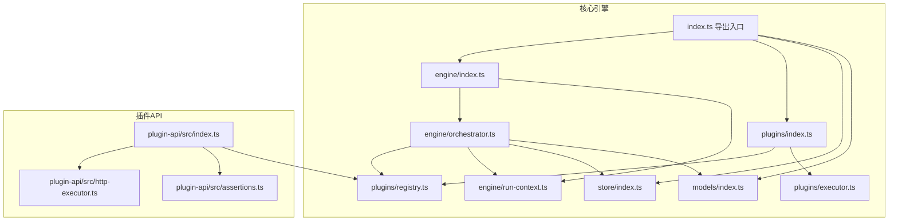
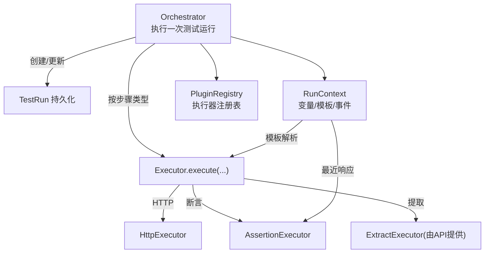
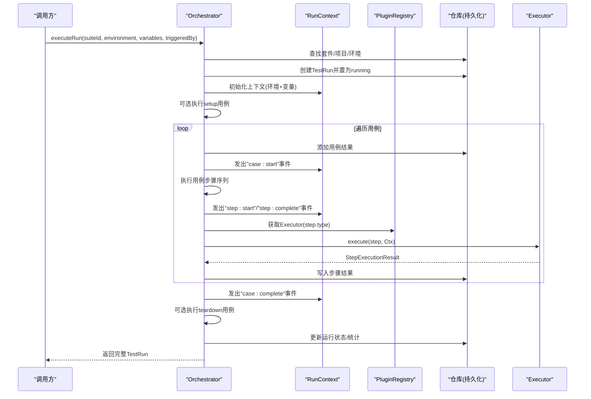
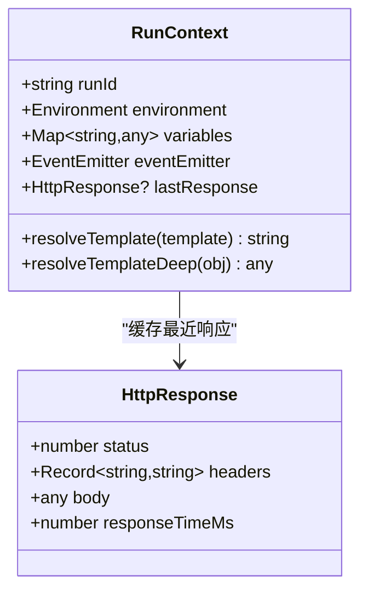
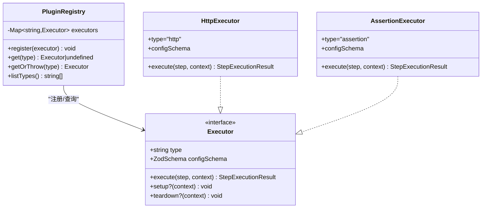
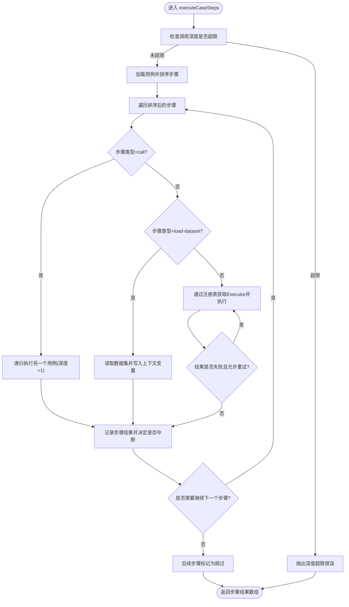
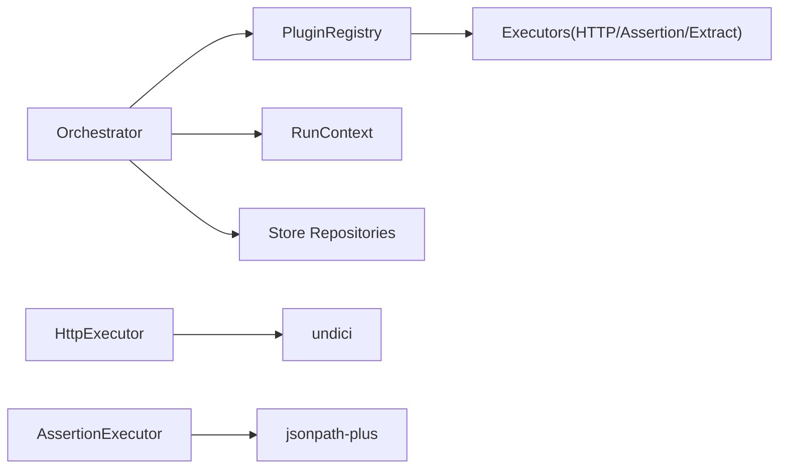

# 核心引擎

<cite>
**本文引用的文件**
- [packages/core/src/index.ts](file://packages/core/src/index.ts)
- [packages/core/src/engine/index.ts](file://packages/core/src/engine/index.ts)
- [packages/core/src/engine/orchestrator.ts](file://packages/core/src/engine/orchestrator.ts)
- [packages/core/src/engine/run-context.ts](file://packages/core/src/engine/run-context.ts)
- [packages/core/src/plugins/index.ts](file://packages/core/src/plugins/index.ts)
- [packages/core/src/plugins/registry.ts](file://packages/core/src/plugins/registry.ts)
- [packages/core/src/plugins/executor.ts](file://packages/core/src/plugins/executor.ts)
- [packages/core/src/store/index.ts](file://packages/core/src/store/index.ts)
- [packages/core/src/models/index.ts](file://packages/core/src/models/index.ts)
- [packages/plugin-api/src/index.ts](file://packages/plugin-api/src/index.ts)
- [packages/plugin-api/src/http-executor.ts](file://packages/plugin-api/src/http-executor.ts)
- [packages/plugin-api/src/assertions.ts](file://packages/plugin-api/src/assertions.ts)
</cite>

## 目录
1. [简介](#简介)
2. [项目结构](#项目结构)
3. [核心组件](#核心组件)
4. [架构总览](#架构总览)
5. [详细组件分析](#详细组件分析)
6. [依赖关系分析](#依赖关系分析)
7. [性能考量](#性能考量)
8. [故障排查指南](#故障排查指南)
9. [结论](#结论)
10. [附录](#附录)

## 简介
本文件为“核心引擎”模块的技术文档，聚焦以下目标：
- 测试执行编排器（Orchestrator）的架构与实现：测试流程协调、步骤执行、失败中断与重试、状态管理与事件通知。
- 运行上下文管理器（RunContext）：变量解析、模板替换、生命周期与上下文传递。
- 插件系统：插件注册表、执行器接口、插件生命周期钩子与默认插件集合。
- 使用模式与API调用方式：如何注册插件、如何组织测试套件与用例、如何配置步骤与变量。
- 性能优化、错误处理策略与调试技巧。

## 项目结构
核心引擎位于 packages/core，围绕“编排器 + 上下文 + 插件 + 存储 + 模型”构建；插件API位于 packages/plugin-api，提供HTTP、断言、提取等默认执行器，并通过注册函数统一注入到注册表。

图表来源
- [packages/core/src/index.ts:1-5](file://packages/core/src/index.ts#L1-L5)
- [packages/core/src/engine/index.ts:1-3](file://packages/core/src/engine/index.ts#L1-L3)
- [packages/core/src/plugins/index.ts:1-3](file://packages/core/src/plugins/index.ts#L1-L3)
- [packages/core/src/store/index.ts:1-8](file://packages/core/src/store/index.ts#L1-L8)
- [packages/core/src/models/index.ts:1-7](file://packages/core/src/models/index.ts#L1-L7)
- [packages/plugin-api/src/index.ts:1-15](file://packages/plugin-api/src/index.ts#L1-L15)
- [packages/plugin-api/src/http-executor.ts:1-95](file://packages/plugin-api/src/http-executor.ts#L1-L95)
- [packages/plugin-api/src/assertions.ts:1-112](file://packages/plugin-api/src/assertions.ts#L1-L112)

章节来源
- [packages/core/src/index.ts:1-5](file://packages/core/src/index.ts#L1-L5)
- [packages/core/src/engine/index.ts:1-3](file://packages/core/src/engine/index.ts#L1-L3)
- [packages/core/src/plugins/index.ts:1-3](file://packages/core/src/plugins/index.ts#L1-L3)
- [packages/core/src/store/index.ts:1-8](file://packages/core/src/store/index.ts#L1-L8)
- [packages/core/src/models/index.ts:1-7](file://packages/core/src/models/index.ts#L1-L7)
- [packages/plugin-api/src/index.ts:1-15](file://packages/plugin-api/src/index.ts#L1-L15)

## 核心组件
- 编排器（Orchestrator）
  - 负责：执行一次完整的测试运行（含setup/teardown）、按序执行用例、收集步骤结果、更新运行状态、发出事件。
  - 关键点：环境变量合并、用例级变量覆盖、步骤重试、失败中断、深度限制防止循环调用。
- 运行上下文（RunContext）
  - 负责：环境注入、变量映射、模板解析（字符串/深拷贝）、事件发射器、最近响应缓存。
- 插件注册表（PluginRegistry）
  - 负责：执行器注册、查询、类型列表、缺失类型报错。
- 执行器接口（Executor）
  - 负责：定义步骤执行契约（type、configSchema、execute），可选setup/teardown生命周期钩子。
- 默认插件（plugin-api）
  - 提供HTTP请求、断言、变量提取等执行器，并通过注册函数集中注册。

章节来源
- [packages/core/src/engine/orchestrator.ts:17-296](file://packages/core/src/engine/orchestrator.ts#L17-L296)
- [packages/core/src/engine/run-context.ts:11-80](file://packages/core/src/engine/run-context.ts#L11-L80)
- [packages/core/src/plugins/registry.ts:3-29](file://packages/core/src/plugins/registry.ts#L3-L29)
- [packages/core/src/plugins/executor.ts:5-23](file://packages/core/src/plugins/executor.ts#L5-L23)
- [packages/plugin-api/src/index.ts:10-15](file://packages/plugin-api/src/index.ts#L10-L15)
- [packages/plugin-api/src/http-executor.ts:7-95](file://packages/plugin-api/src/http-executor.ts#L7-L95)
- [packages/plugin-api/src/assertions.ts:7-112](file://packages/plugin-api/src/assertions.ts#L7-L112)

## 架构总览
核心引擎采用“编排器驱动 + 插件执行器 + 上下文共享”的分层架构。编排器负责控制流与状态持久化，插件执行器负责具体步骤的业务逻辑，上下文在两者之间传递数据与事件。

图表来源
- [packages/core/src/engine/orchestrator.ts:25-140](file://packages/core/src/engine/orchestrator.ts#L25-L140)
- [packages/core/src/engine/run-context.ts:35-78](file://packages/core/src/engine/run-context.ts#L35-L78)
- [packages/core/src/plugins/registry.ts:13-23](file://packages/core/src/plugins/registry.ts#L13-L23)
- [packages/plugin-api/src/index.ts:10-15](file://packages/plugin-api/src/index.ts#L10-L15)
- [packages/plugin-api/src/http-executor.ts:11-93](file://packages/plugin-api/src/http-executor.ts#L11-L93)
- [packages/plugin-api/src/assertions.ts:11-40](file://packages/plugin-api/src/assertions.ts#L11-L40)

## 详细组件分析

### 编排器（Orchestrator）
职责与流程
- 接收套件ID、环境名、可选变量与触发来源，解析项目环境并合并变量层级（环境 → 套件 → 运行时）。
- 创建测试运行记录并置为运行中，初始化RunContext。
- 可选执行setup用例，随后遍历套件中的用例，逐个执行其步骤序列。
- 步骤执行支持：
  - call：递归执行另一个用例，受最大调用深度限制。
  - load-dataset：将数据集行数组注入上下文变量。
  - 其他类型：通过PluginRegistry查找对应Executor执行，支持重试与失败中断。
- 收集每个用例的步骤结果，计算用例状态，更新用例与运行记录。
- 可选执行teardown用例，最终更新运行记录状态并发出完成事件。

关键实现要点
- 变量合并顺序与优先级：环境变量、套件变量、运行时变量逐层覆盖。
- 失败中断策略：当步骤配置不允许继续失败时，后续步骤标记为跳过。
- 重试机制：根据步骤retryCount进行最多N次尝试，直到成功或最后一次失败。
- 深度限制：防止递归调用导致无限循环。
- 事件通知：在用例开始/结束、步骤开始/结束阶段发出事件，便于外部监听。

图表来源
- [packages/core/src/engine/orchestrator.ts:25-140](file://packages/core/src/engine/orchestrator.ts#L25-L140)
- [packages/core/src/plugins/registry.ts:13-23](file://packages/core/src/plugins/registry.ts#L13-L23)

章节来源
- [packages/core/src/engine/orchestrator.ts:17-296](file://packages/core/src/engine/orchestrator.ts#L17-L296)

### 运行上下文（RunContext）
职责与能力
- 环境注入：将baseUrl与环境变量写入内部Map。
- 变量解析：支持模板语法{{path.to.value}}，支持数组索引与嵌套字段访问。
- 深度模板解析：对对象/数组进行递归模板替换。
- 事件发射：提供EventEmitter实例，供编排器发布事件。
- 最近响应缓存：保存上一次HTTP响应，供断言/提取步骤使用。

图表来源
- [packages/core/src/engine/run-context.ts:11-80](file://packages/core/src/engine/run-context.ts#L11-L80)

章节来源
- [packages/core/src/engine/run-context.ts:11-80](file://packages/core/src/engine/run-context.ts#L11-L80)

### 插件系统（注册表与执行器）
插件注册表
- 注册：按type唯一注册，重复注册会抛出异常。
- 查询：安全获取或抛出可用类型列表。
- 列表：返回已注册的执行器类型集合。

执行器接口
- 必填属性：type（唯一标识）、configSchema（Zod校验）。
- 必填方法：execute(step, context)。
- 可选生命周期：setup(context)、teardown(context)。

默认插件（plugin-api）
- HTTP执行器：基于undici发起请求，自动解析JSON响应，填充上下文最近响应。
- 断言执行器：支持多种源（状态码、头、体、JSONPath、变量）与运算符（等于/不等/包含/正则/比较/存在/类型等）。
- 提取执行器：从响应中提取值并写回上下文变量（由API提供）。

图表来源
- [packages/core/src/plugins/registry.ts:3-29](file://packages/core/src/plugins/registry.ts#L3-L29)
- [packages/core/src/plugins/executor.ts:15-23](file://packages/core/src/plugins/executor.ts#L15-L23)
- [packages/plugin-api/src/http-executor.ts:7-95](file://packages/plugin-api/src/http-executor.ts#L7-L95)
- [packages/plugin-api/src/assertions.ts:7-112](file://packages/plugin-api/src/assertions.ts#L7-L112)

章节来源
- [packages/core/src/plugins/registry.ts:3-29](file://packages/core/src/plugins/registry.ts#L3-L29)
- [packages/core/src/plugins/executor.ts:5-23](file://packages/core/src/plugins/executor.ts#L5-L23)
- [packages/plugin-api/src/index.ts:10-15](file://packages/plugin-api/src/index.ts#L10-L15)
- [packages/plugin-api/src/http-executor.ts:7-95](file://packages/plugin-api/src/http-executor.ts#L7-L95)
- [packages/plugin-api/src/assertions.ts:7-112](file://packages/plugin-api/src/assertions.ts#L7-L112)

### 步骤执行算法（Orchestrator.executeCaseSteps）
该算法负责单个用例内步骤的顺序执行与控制流。

图表来源
- [packages/core/src/engine/orchestrator.ts:142-294](file://packages/core/src/engine/orchestrator.ts#L142-L294)

章节来源
- [packages/core/src/engine/orchestrator.ts:142-294](file://packages/core/src/engine/orchestrator.ts#L142-L294)

### 使用模式与API调用方式
- 注册插件
  - 在应用启动时，通过注册函数将默认插件批量注册到PluginRegistry。
  - 示例路径：[packages/plugin-api/src/index.ts:10-15](file://packages/plugin-api/src/index.ts#L10-L15)
- 组织测试套件与用例
  - 通过仓库接口读取/写入TestSuite/TestRun/TestStep等实体，Orchestrator负责编排。
  - 示例路径：[packages/core/src/store/index.ts:1-8](file://packages/core/src/store/index.ts#L1-L8)
- 配置步骤与变量
  - 步骤配置通过Zod Schema校验，支持重试、失败后继续、模板变量等。
  - 变量解析支持{{baseUrl}}、{{vars.xxx}}、{{dataset[0].field}}等。
  - 示例路径：[packages/core/src/engine/run-context.ts:35-78](file://packages/core/src/engine/run-context.ts#L35-L78)
- 触发执行
  - 调用Orchestrator.executeRun(suiteId, environment, variables?, triggeredBy?)，返回完整TestRun。
  - 示例路径：[packages/core/src/engine/orchestrator.ts:25-140](file://packages/core/src/engine/orchestrator.ts#L25-L140)

章节来源
- [packages/plugin-api/src/index.ts:10-15](file://packages/plugin-api/src/index.ts#L10-L15)
- [packages/core/src/store/index.ts:1-8](file://packages/core/src/store/index.ts#L1-L8)
- [packages/core/src/engine/run-context.ts:35-78](file://packages/core/src/engine/run-context.ts#L35-L78)
- [packages/core/src/engine/orchestrator.ts:25-140](file://packages/core/src/engine/orchestrator.ts#L25-L140)

## 依赖关系分析
- 编排器依赖
  - PluginRegistry：按步骤类型查找执行器。
  - RunContext：传递变量、模板解析、事件与最近响应。
  - 各类仓库：TestSuite/TestRun/TestStep/TestDataSet/Project的持久化操作。
- 插件API依赖
  - @ai-tester/core：共享类型、Schema与上下文。
  - undici：HTTP执行器依赖。
- 模块导出
  - 核心入口统一导出模型、存储、插件与引擎。

图表来源
- [packages/core/src/engine/orchestrator.ts:1-7](file://packages/core/src/engine/orchestrator.ts#L1-L7)
- [packages/plugin-api/src/http-executor.ts:1-6](file://packages/plugin-api/src/http-executor.ts#L1-L6)
- [packages/plugin-api/src/assertions.ts:1-6](file://packages/plugin-api/src/assertions.ts#L1-L6)

章节来源
- [packages/core/src/engine/orchestrator.ts:1-7](file://packages/core/src/engine/orchestrator.ts#L1-L7)
- [packages/plugin-api/src/http-executor.ts:1-6](file://packages/plugin-api/src/http-executor.ts#L1-L6)
- [packages/plugin-api/src/assertions.ts:1-6](file://packages/plugin-api/src/assertions.ts#L1-L6)

## 性能考量
- 并发与并行
  - 当前实现为串行顺序执行步骤，未内置并发调度。若需提升吞吐，可在步骤粒度引入并发池与队列，注意避免对共享资源（如上下文变量）的竞争。
- 重试策略
  - 步骤级重试仅在失败时进行，建议对瞬时性错误（网络抖动）有效；对幂等性要求高的步骤更适用。
- 模板解析
  - 深度模板解析对大对象/数组有额外开销，建议仅在必要时启用，或对热点路径做缓存。
- HTTP执行
  - 默认超时时间可配置；建议结合断路器与指数退避策略以增强鲁棒性。
- 数据集加载
  - 大数据集一次性注入变量可能造成内存压力，建议按批次或按需加载。

## 故障排查指南
- 常见错误与定位
  - “未找到套件/用例/数据集”：检查ID是否正确，以及仓库实现是否返回空。
  - “无执行器注册”：确认已通过注册函数注册默认插件，或自定义插件已正确注册。
  - “深度超限”：检查是否存在循环call用例，调整调用深度阈值或重构用例结构。
  - “模板解析失败”：检查变量名拼写与作用域，确保变量已在上下文中设置。
- 事件监听
  - 通过RunContext.eventEmitter监听“case:start/complete”、“step:start/complete”，辅助观测执行进度与问题定位。
- 日志与追踪
  - 在Executor.execute中捕获异常并记录错误信息与请求/响应摘要，便于快速定位失败步骤。

章节来源
- [packages/core/src/engine/orchestrator.ts:147-149](file://packages/core/src/engine/orchestrator.ts#L147-L149)
- [packages/core/src/plugins/registry.ts:17-23](file://packages/core/src/plugins/registry.ts#L17-L23)
- [packages/core/src/engine/run-context.ts:26-33](file://packages/core/src/engine/run-context.ts#L26-L33)

## 结论
核心引擎通过清晰的分层设计实现了高扩展性的测试执行框架：编排器负责流程与状态，上下文承载数据与事件，插件体系提供可插拔的能力扩展。默认插件覆盖了HTTP请求、断言与变量提取等常见场景，结合模板解析与重试机制，能够满足多样化的测试需求。未来可在并发执行、资源隔离与可观测性方面进一步增强。

## 附录
- 关键API参考
  - 注册插件：[packages/plugin-api/src/index.ts:10-15](file://packages/plugin-api/src/index.ts#L10-L15)
  - 执行一次运行：[packages/core/src/engine/orchestrator.ts:25-140](file://packages/core/src/engine/orchestrator.ts#L25-L140)
  - 步骤执行算法：[packages/core/src/engine/orchestrator.ts:142-294](file://packages/core/src/engine/orchestrator.ts#L142-L294)
  - 上下文模板解析：[packages/core/src/engine/run-context.ts:35-78](file://packages/core/src/engine/run-context.ts#L35-L78)
  - 插件注册表：[packages/core/src/plugins/registry.ts:3-29](file://packages/core/src/plugins/registry.ts#L3-L29)
  - 执行器接口：[packages/core/src/plugins/executor.ts:5-23](file://packages/core/src/plugins/executor.ts#L5-L23)
  - HTTP执行器：[packages/plugin-api/src/http-executor.ts:11-93](file://packages/plugin-api/src/http-executor.ts#L11-L93)
  - 断言执行器：[packages/plugin-api/src/assertions.ts:11-112](file://packages/plugin-api/src/assertions.ts#L11-L112)