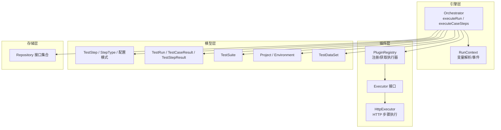
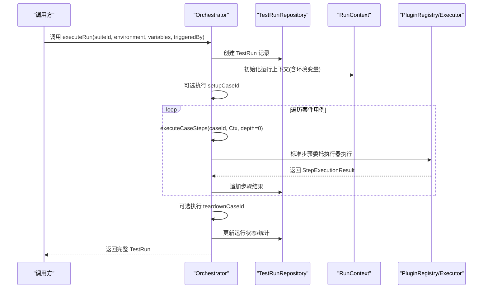
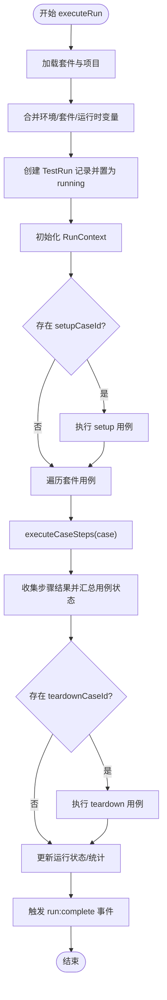
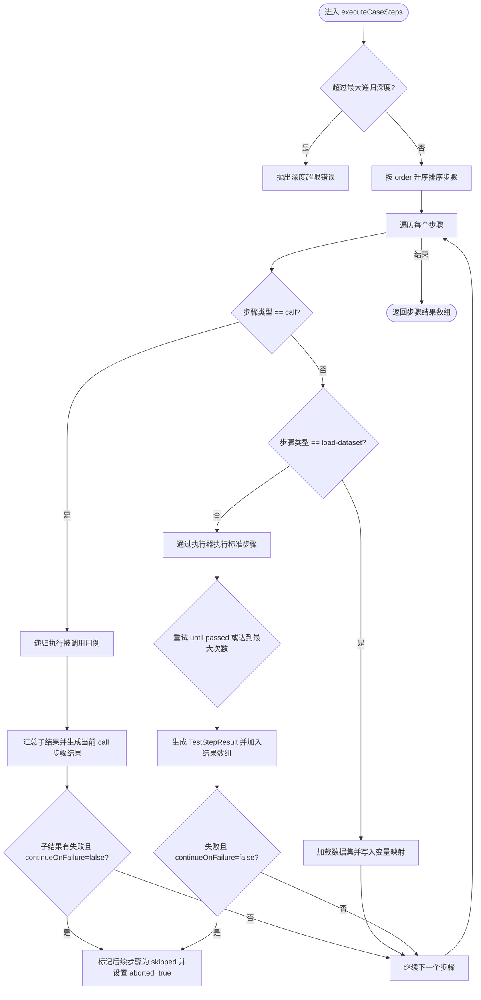
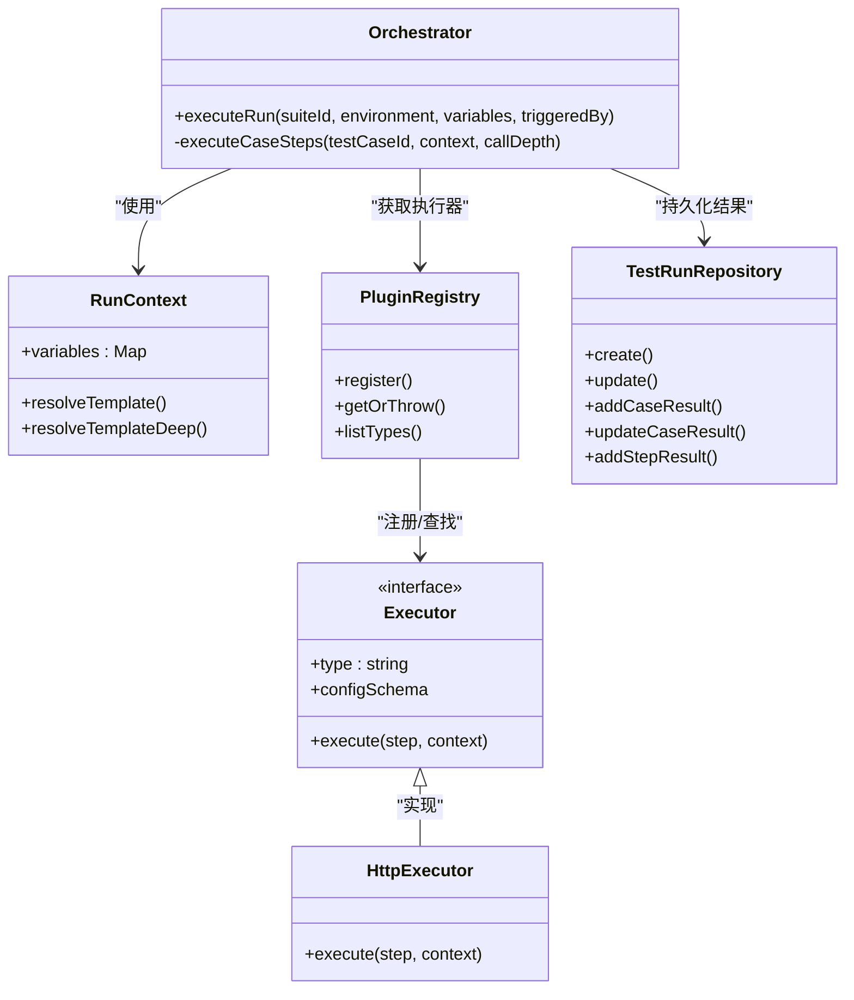

# 测试执行编排器

<cite>
**本文引用的文件**
- [packages/core/src/engine/orchestrator.ts](file://packages/core/src/engine/orchestrator.ts)
- [packages/core/src/engine/run-context.ts](file://packages/core/src/engine/run-context.ts)
- [packages/core/src/plugins/registry.ts](file://packages/core/src/plugins/registry.ts)
- [packages/core/src/plugins/executor.ts](file://packages/core/src/plugins/executor.ts)
- [packages/plugin-api/src/http-executor.ts](file://packages/plugin-api/src/http-executor.ts)
- [packages/core/src/models/test-step.ts](file://packages/core/src/models/test-step.ts)
- [packages/core/src/models/test-run.ts](file://packages/core/src/models/test-run.ts)
- [packages/core/src/models/project.ts](file://packages/core/src/models/project.ts)
- [packages/core/src/models/test-suite.ts](file://packages/core/src/models/test-suite.ts)
- [packages/core/src/store/repository.ts](file://packages/core/src/store/repository.ts)
</cite>

## 目录
1. [简介](#简介)
2. [项目结构](#项目结构)
3. [核心组件](#核心组件)
4. [架构总览](#架构总览)
5. [详细组件分析](#详细组件分析)
6. [依赖关系分析](#依赖关系分析)
7. [性能考量](#性能考量)
8. [故障排查指南](#故障排查指南)
9. [结论](#结论)
10. [附录：使用示例与配置](#附录使用示例与配置)

## 简介
本文件面向“测试执行编排器”的技术文档，系统阐述其核心架构、执行流程、并行策略与状态管理，并深入解析以下关键方法的实现原理与行为：
- executeRun：套件执行、环境变量合并、运行上下文创建、用例遍历与结果收集
- executeCaseSteps：递归执行机制（call 步骤）、数据集加载、标准执行器调用、重试与中断控制

同时给出错误处理策略、重试机制、中断控制逻辑、环境变量优先级、执行顺序控制以及性能优化建议。

## 项目结构
该编排器位于 packages/core 包中，围绕引擎、插件、模型与存储仓库四个层面组织：
- 引擎层：编排器与运行上下文
- 插件层：执行器注册表与具体执行器（如 HTTP）
- 模型层：测试步骤、用例、套件、运行、数据集等类型与校验
- 存储层：对各类实体进行持久化的仓库接口

图表来源
- [packages/core/src/engine/orchestrator.ts:17-296](file://packages/core/src/engine/orchestrator.ts#L17-L296)
- [packages/core/src/engine/run-context.ts:11-80](file://packages/core/src/engine/run-context.ts#L11-L80)
- [packages/core/src/plugins/registry.ts:3-29](file://packages/core/src/plugins/registry.ts#L3-L29)
- [packages/core/src/plugins/executor.ts:15-23](file://packages/core/src/plugins/executor.ts#L15-L23)
- [packages/plugin-api/src/http-executor.ts:7-95](file://packages/plugin-api/src/http-executor.ts#L7-L95)
- [packages/core/src/models/test-step.ts:1-102](file://packages/core/src/models/test-step.ts#L1-L102)
- [packages/core/src/models/test-run.ts:1-118](file://packages/core/src/models/test-run.ts#L1-L118)
- [packages/core/src/models/project.ts:1-30](file://packages/core/src/models/project.ts#L1-L30)
- [packages/core/src/models/test-suite.ts:1-44](file://packages/core/src/models/test-suite.ts#L1-L44)
- [packages/core/src/store/repository.ts:55-87](file://packages/core/src/store/repository.ts#L55-L87)

章节来源
- [packages/core/src/engine/orchestrator.ts:17-296](file://packages/core/src/engine/orchestrator.ts#L17-L296)
- [packages/core/src/engine/run-context.ts:11-80](file://packages/core/src/engine/run-context.ts#L11-L80)
- [packages/core/src/plugins/registry.ts:3-29](file://packages/core/src/plugins/registry.ts#L3-L29)
- [packages/core/src/plugins/executor.ts:15-23](file://packages/core/src/plugins/executor.ts#L15-L23)
- [packages/plugin-api/src/http-executor.ts:7-95](file://packages/plugin-api/src/http-executor.ts#L7-L95)
- [packages/core/src/models/test-step.ts:1-102](file://packages/core/src/models/test-step.ts#L1-L102)
- [packages/core/src/models/test-run.ts:1-118](file://packages/core/src/models/test-run.ts#L1-L118)
- [packages/core/src/models/project.ts:1-30](file://packages/core/src/models/project.ts#L1-L30)
- [packages/core/src/models/test-suite.ts:1-44](file://packages/core/src/models/test-suite.ts#L1-L44)
- [packages/core/src/store/repository.ts:55-87](file://packages/core/src/store/repository.ts#L55-L87)

## 核心组件
- 编排器（Orchestrator）：负责套件级执行调度、环境变量合并、运行上下文构建、用例遍历、结果聚合与最终状态更新；内部通过递归执行单个用例的所有步骤。
- 运行上下文（RunContext）：维护运行时变量映射、模板解析能力、事件发射器与最近一次响应对象，供执行器读取。
- 执行器注册表（PluginRegistry）：集中注册与按类型检索执行器，提供缺失时的友好报错。
- 执行器（Executor）：统一的步骤执行接口，支持 setup/teardown 生命周期钩子与按类型校验的配置模式。
- 具体执行器（如 HttpExecutor）：基于 undici 发起 HTTP 请求，解析响应并写入上下文，返回标准化执行结果。
- 模型与校验：对步骤类型、配置、运行状态、用例/套件/项目结构进行强类型约束与运行时校验。
- 存储仓库（Repository）：抽象出对项目、用例、套件、运行、数据集的 CRUD 与结果追加操作。

章节来源
- [packages/core/src/engine/orchestrator.ts:17-296](file://packages/core/src/engine/orchestrator.ts#L17-L296)
- [packages/core/src/engine/run-context.ts:11-80](file://packages/core/src/engine/run-context.ts#L11-L80)
- [packages/core/src/plugins/registry.ts:3-29](file://packages/core/src/plugins/registry.ts#L3-L29)
- [packages/core/src/plugins/executor.ts:15-23](file://packages/core/src/plugins/executor.ts#L15-L23)
- [packages/plugin-api/src/http-executor.ts:7-95](file://packages/plugin-api/src/http-executor.ts#L7-L95)
- [packages/core/src/models/test-step.ts:1-102](file://packages/core/src/models/test-step.ts#L1-L102)
- [packages/core/src/models/test-run.ts:1-118](file://packages/core/src/models/test-run.ts#L1-L118)
- [packages/core/src/store/repository.ts:55-87](file://packages/core/src/store/repository.ts#L55-L87)

## 架构总览
编排器在执行一次套件运行时，遵循如下主流程：
- 解析项目环境，合并环境变量、套件变量与运行时变量，创建运行记录并置为运行中
- 可选执行 setup 用例
- 遍历套件中的每个用例，逐个执行其步骤序列，收集步骤结果并汇总用例状态
- 可选执行 teardown 用例
- 更新运行状态与统计信息，触发完成事件

图表来源
- [packages/core/src/engine/orchestrator.ts:25-140](file://packages/core/src/engine/orchestrator.ts#L25-L140)
- [packages/core/src/store/repository.ts:55-87](file://packages/core/src/store/repository.ts#L55-L87)
- [packages/core/src/plugins/registry.ts:3-29](file://packages/core/src/plugins/registry.ts#L3-L29)
- [packages/core/src/plugins/executor.ts:15-23](file://packages/core/src/plugins/executor.ts#L15-L23)

章节来源
- [packages/core/src/engine/orchestrator.ts:25-140](file://packages/core/src/engine/orchestrator.ts#L25-L140)
- [packages/core/src/store/repository.ts:55-87](file://packages/core/src/store/repository.ts#L55-L87)

## 详细组件分析

### executeRun 方法：套件执行与状态管理
- 输入参数与环境变量合并
  - 从项目中解析指定名称的环境配置，若不存在则以传入环境名构造默认环境
  - 合并优先级：环境变量 → 套件变量 → 运行时变量
- 运行上下文创建
  - 使用合并后的变量初始化 RunContext，并预置 baseUrl 与环境变量键值
- 套件执行流程
  - 可选执行 setup 用例
  - 遍历套件用例列表，逐个执行 executeCaseSteps 并统计通过/失败用例数
  - 可选执行 teardown 用例
- 结果收集与状态更新
  - 用例维度：计算步骤通过/失败数量，写入用例结果并触发事件
  - 运行维度：更新最终状态、耗时、用例总数与统计信息，触发完成事件
- 错误处理
  - 捕获异常后将运行状态置为 error 并抛出

图表来源
- [packages/core/src/engine/orchestrator.ts:25-140](file://packages/core/src/engine/orchestrator.ts#L25-L140)

章节来源
- [packages/core/src/engine/orchestrator.ts:25-140](file://packages/core/src/engine/orchestrator.ts#L25-L140)
- [packages/core/src/engine/run-context.ts:18-33](file://packages/core/src/engine/run-context.ts#L18-L33)
- [packages/core/src/models/project.ts:3-7](file://packages/core/src/models/project.ts#L3-L7)
- [packages/core/src/models/test-suite.ts:9-13](file://packages/core/src/models/test-suite.ts#L9-L13)
- [packages/core/src/store/repository.ts:55-87](file://packages/core/src/store/repository.ts#L55-L87)

### executeCaseSteps 方法：递归执行与控制流
- 递归深度限制
  - 通过 callDepth 参数限制最大递归深度，防止循环调用导致栈溢出
- 步骤排序与顺序控制
  - 对用例内步骤按 order 字段升序执行，确保严格顺序
- 中断控制（continueOnFailure）
  - 当某一步骤失败且 continueOnFailure 为 false 时，标记后续步骤为跳过（skipped），并设置 aborted 标志
- call 步骤（递归调用）
  - 读取被调用用例 ID，递归执行 executeCaseSteps，将子结果汇总为当前 call 步骤的结果
  - 若子结果存在失败或错误，则当前 call 步骤标记为失败；否则为通过
  - 若子结果失败且 continueOnFailure 为 false，则触发中断
- load-dataset 步骤
  - 加载数据集并将 rows 写入 RunContext 的变量映射，变量名为配置中指定的名称
  - 成功时返回包含提取变量摘要的步骤结果
- 标准执行器步骤（http/assertion/extract 等）
  - 通过 PluginRegistry 获取对应执行器并执行
  - 支持重试：retryCount + 1 次尝试，直到成功或达到最大次数
  - 每次执行前后触发 step:start/step:complete 事件
  - 失败或错误时记录错误信息，必要时触发中断

图表来源
- [packages/core/src/engine/orchestrator.ts:142-296](file://packages/core/src/engine/orchestrator.ts#L142-L296)
- [packages/core/src/plugins/registry.ts:13-23](file://packages/core/src/plugins/registry.ts#L13-L23)
- [packages/core/src/plugins/executor.ts:5-22](file://packages/core/src/plugins/executor.ts#L5-L22)

章节来源
- [packages/core/src/engine/orchestrator.ts:142-296](file://packages/core/src/engine/orchestrator.ts#L142-L296)
- [packages/core/src/models/test-step.ts:74-91](file://packages/core/src/models/test-step.ts#L74-L91)

### 运行上下文（RunContext）：变量解析与事件
- 变量存储
  - 使用 Map 存储键值对，便于动态覆盖与查询
  - 预置 baseUrl 与环境变量，保证执行器可直接使用
- 模板解析
  - 支持字符串模板 {{path.to.var}} 的解析，支持嵌套路径与数组索引
  - 提供深解析 resolveTemplateDeep，用于对象/数组的递归替换
- 事件机制
  - 通过 EventEmitter 在步骤开始/完成、用例开始/完成、运行完成时发出事件，便于外部监听与扩展

章节来源
- [packages/core/src/engine/run-context.ts:11-80](file://packages/core/src/engine/run-context.ts#L11-L80)

### 执行器注册表与执行器接口
- 注册表
  - 维护 type → Executor 映射，提供 getOrThrow 以在缺失时给出可用类型列表
- 执行器接口
  - 统一的 type 与 configSchema 定义
  - execute(step, context) 返回标准化的 StepExecutionResult
  - 可选 setup/teardown 生命周期钩子

章节来源
- [packages/core/src/plugins/registry.ts:3-29](file://packages/core/src/plugins/registry.ts#L3-L29)
- [packages/core/src/plugins/executor.ts:15-23](file://packages/core/src/plugins/executor.ts#L15-L23)

### HTTP 执行器示例
- 配置解析
  - 使用 HttpStepConfigSchema 校验请求方法、URL、头、体、内容类型与超时
- 模板替换
  - 对 URL、头、体进行模板解析，确保变量注入
- 请求执行
  - 使用 undici 发送请求，设置超时信号
  - 解析响应体（JSON/文本），扁平化响应头
  - 将响应写入 RunContext.lastResponse，供断言/提取步骤使用
- 结果返回
  - 成功时返回 passed，失败时返回 error 并携带请求与错误信息

章节来源
- [packages/plugin-api/src/http-executor.ts:7-95](file://packages/plugin-api/src/http-executor.ts#L7-L95)
- [packages/core/src/models/test-step.ts:12-19](file://packages/core/src/models/test-step.ts#L12-L19)

### 数据模型与状态
- 步骤类型与配置
  - 支持 http、assertion、extract、call、load-dataset
  - 每种类型拥有独立的配置模式与校验规则
- 运行状态
  - 支持 pending、running、passed、failed、error、cancelled
- 用例/运行结果
  - 统一的 Schema 定义了请求/响应、断言、提取变量、错误与耗时字段

章节来源
- [packages/core/src/models/test-step.ts:5-91](file://packages/core/src/models/test-step.ts#L5-L91)
- [packages/core/src/models/test-run.ts:6-118](file://packages/core/src/models/test-run.ts#L6-L118)

## 依赖关系分析
- 组件耦合
  - Orchestrator 依赖 PluginRegistry、各仓库接口与 RunContext
  - 执行器通过注册表被动态发现与调用，降低编排器与具体执行器的耦合
- 关键依赖链
  - executeRun → TestRunRepository（创建/更新）→ 存储持久化
  - executeCaseSteps → PluginRegistry → Executor.execute → 存储（追加步骤结果）
  - RunContext → 模板解析 → 执行器输入

图表来源
- [packages/core/src/engine/orchestrator.ts:17-296](file://packages/core/src/engine/orchestrator.ts#L17-L296)
- [packages/core/src/engine/run-context.ts:11-80](file://packages/core/src/engine/run-context.ts#L11-L80)
- [packages/core/src/plugins/registry.ts:3-29](file://packages/core/src/plugins/registry.ts#L3-L29)
- [packages/core/src/plugins/executor.ts:15-23](file://packages/core/src/plugins/executor.ts#L15-L23)
- [packages/plugin-api/src/http-executor.ts:7-95](file://packages/plugin-api/src/http-executor.ts#L7-L95)
- [packages/core/src/store/repository.ts:55-87](file://packages/core/src/store/repository.ts#L55-L87)

章节来源
- [packages/core/src/engine/orchestrator.ts:17-296](file://packages/core/src/engine/orchestrator.ts#L17-L296)
- [packages/core/src/plugins/registry.ts:3-29](file://packages/core/src/plugins/registry.ts#L3-L29)
- [packages/plugin-api/src/http-executor.ts:7-95](file://packages/plugin-api/src/http-executor.ts#L7-L95)
- [packages/core/src/store/repository.ts:55-87](file://packages/core/src/store/repository.ts#L55-L87)

## 性能考量
- 步骤顺序与中断
  - 严格按 order 执行，避免并发带来的竞态；当 continueOnFailure=false 时尽早跳过后续步骤，减少无效工作
- 重试策略
  - retryCount 控制最大尝试次数，建议仅对易受瞬时因素影响的步骤启用，避免无谓的资源消耗
- 模板解析
  - resolveTemplateDeep 会对复杂对象进行深遍历，建议在配置中尽量减少不必要的深层嵌套
- 执行器选择
  - 对于高延迟请求，合理设置超时与重试；避免在单个步骤中进行大量同步阻塞操作
- 存储写入
  - 步骤结果逐条写入，建议在批量场景下评估写入频率与数据库压力

[本节为通用性能建议，不直接分析具体文件]

## 故障排查指南
- 常见错误与定位
  - “套件未找到”：检查 suiteId 是否正确，确认项目与套件关联
  - “执行器类型未注册”：确认已通过 PluginRegistry.register 注册对应执行器
  - “数据集未找到”：检查 load-dataset 步骤的 datasetId
  - “递归深度超限”：检查 call 步骤是否存在循环引用
- 错误处理与重试
  - executeCaseSteps 对标准步骤采用最多 retryCount+1 次重试，失败时记录 error 并触发中断（若 continueOnFailure=false）
  - executeRun 捕获异常后将运行状态置为 error 并抛出
- 中断控制
  - 任一步骤失败且 continueOnFailure=false 时，后续步骤被标记为 skipped 并停止继续执行

章节来源
- [packages/core/src/engine/orchestrator.ts:25-140](file://packages/core/src/engine/orchestrator.ts#L25-L140)
- [packages/core/src/engine/orchestrator.ts:142-296](file://packages/core/src/engine/orchestrator.ts#L142-L296)
- [packages/core/src/plugins/registry.ts:17-23](file://packages/core/src/plugins/registry.ts#L17-L23)

## 结论
该测试执行编排器以清晰的职责分离实现了从套件到步骤的全链路执行与状态管理。通过严格的变量合并策略、模板解析能力、可插拔的执行器体系与完善的事件机制，既保证了可扩展性，也提供了良好的可观测性与可控性。结合递归深度限制、中断控制与重试策略，能够在复杂测试场景中稳定地产出可追溯的执行结果。

[本节为总结性内容，不直接分析具体文件]

## 附录：使用示例与配置

### 环境变量优先级
- 合并顺序：环境变量 → 套件变量 → 运行时变量
- 合并后写入 RunContext，可通过模板 {{varName}} 在 URL、头、体中使用

章节来源
- [packages/core/src/engine/orchestrator.ts:34-48](file://packages/core/src/engine/orchestrator.ts#L34-L48)
- [packages/core/src/engine/run-context.ts:28-33](file://packages/core/src/engine/run-context.ts#L28-L33)
- [packages/core/src/models/project.ts:3-7](file://packages/core/src/models/project.ts#L3-L7)
- [packages/core/src/models/test-suite.ts:10-11](file://packages/core/src/models/test-suite.ts#L10-L11)

### 执行顺序控制
- 步骤按 order 升序执行，确保确定性
- 用例按套件中 testCaseIds 列表顺序执行

章节来源
- [packages/core/src/engine/orchestrator.ts:154-155](file://packages/core/src/engine/orchestrator.ts#L154-L155)
- [packages/core/src/models/test-suite.ts](file://packages/core/src/models/test-suite.ts#L8)

### 重试与中断
- 标准步骤：最多 retryCount+1 次尝试，直至成功或达到上限
- call 步骤：子结果存在失败或错误即视为失败；若 continueOnFailure=false 则中断后续步骤
- load-dataset 步骤：失败时记录错误并中断（若 continueOnFailure=false）

章节来源
- [packages/core/src/engine/orchestrator.ts:242-266](file://packages/core/src/engine/orchestrator.ts#L242-L266)
- [packages/core/src/engine/orchestrator.ts:173-203](file://packages/core/src/engine/orchestrator.ts#L173-L203)
- [packages/core/src/engine/orchestrator.ts:205-237](file://packages/core/src/engine/orchestrator.ts#L205-L237)
- [packages/core/src/models/test-step.ts:80-81](file://packages/core/src/models/test-step.ts#L80-L81)

### 使用示例（步骤说明）
- 执行一次套件运行
  - 调用 executeRun(suiteId, environment, variables?, triggeredBy?)
  - 观察 run:complete 事件获取最终状态
- 在步骤中使用变量
  - 在 URL/头/体中使用 {{varName}} 模板语法
  - 通过 load-dataset 步骤将数据集 rows 注入变量
- 递归调用其他用例
  - 使用 call 步骤配置被调用用例 ID，注意避免循环引用
- 断言与提取
  - 使用 assertion/extract 步骤配合上一步执行器输出进行断言与变量提取

章节来源
- [packages/core/src/engine/orchestrator.ts:25-140](file://packages/core/src/engine/orchestrator.ts#L25-L140)
- [packages/core/src/engine/run-context.ts:35-54](file://packages/core/src/engine/run-context.ts#L35-L54)
- [packages/plugin-api/src/http-executor.ts:11-95](file://packages/plugin-api/src/http-executor.ts#L11-L95)