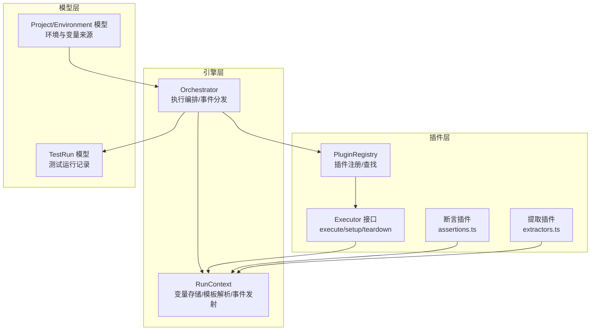
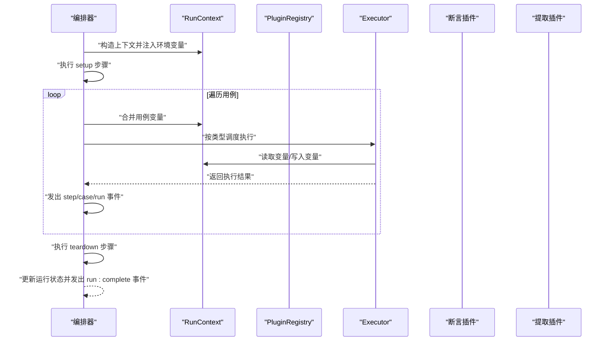
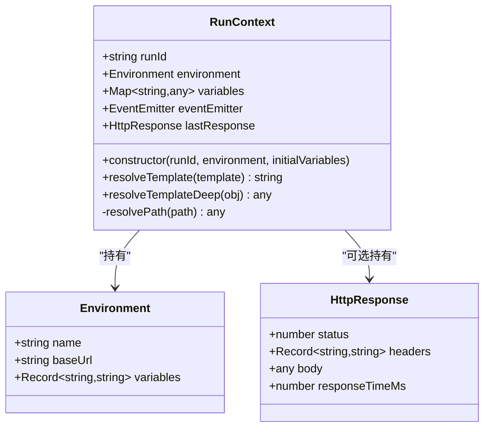
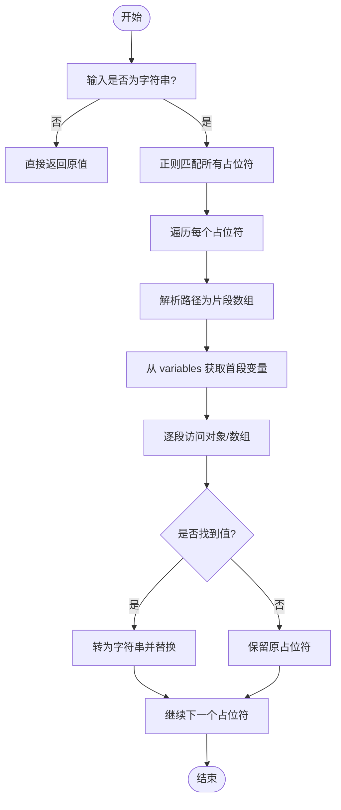
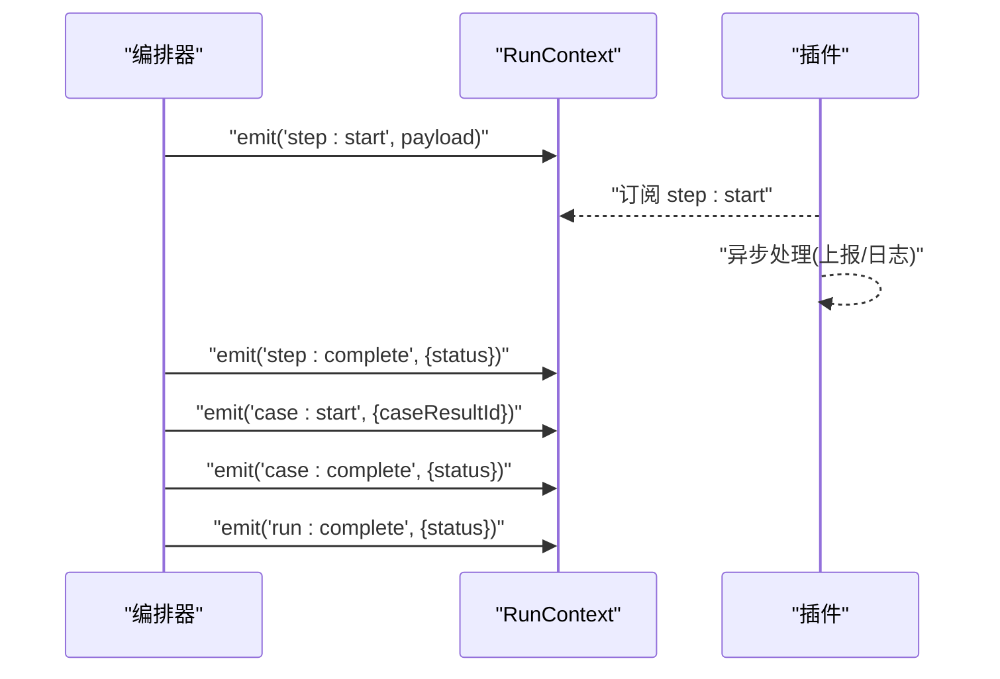
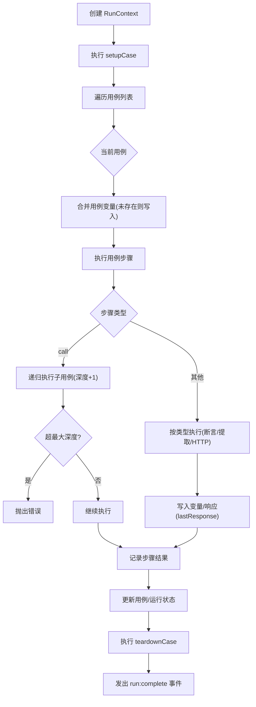
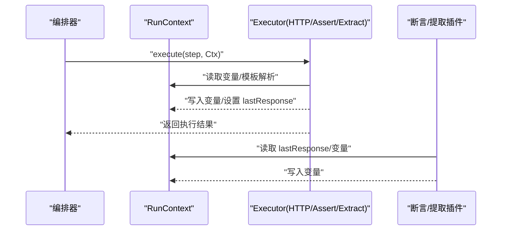
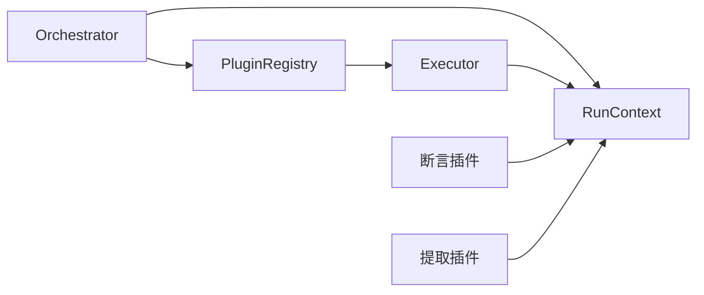

# 运行上下文管理

<cite>
**本文引用的文件**
- [packages/core/src/engine/run-context.ts](file://packages/core/src/engine/run-context.ts)
- [packages/core/src/engine/orchestrator.ts](file://packages/core/src/engine/orchestrator.ts)
- [packages/core/src/plugins/executor.ts](file://packages/core/src/plugins/executor.ts)
- [packages/core/src/plugins/registry.ts](file://packages/core/src/plugins/registry.ts)
- [packages/plugin-api/src/assertions.ts](file://packages/plugin-api/src/assertions.ts)
- [packages/plugin-api/src/extractors.ts](file://packages/plugin-api/src/extractors.ts)
- [packages/core/src/models/test-run.ts](file://packages/core/src/models/test-run.ts)
- [packages/core/src/models/project.ts](file://packages/core/src/models/project.ts)
</cite>

## 目录
1. [简介](#简介)
2. [项目结构](#项目结构)
3. [核心组件](#核心组件)
4. [架构总览](#架构总览)
5. [详细组件分析](#详细组件分析)
6. [依赖分析](#依赖分析)
7. [性能考量](#性能考量)
8. [故障排查指南](#故障排查指南)
9. [结论](#结论)
10. [附录：使用示例与最佳实践](#附录使用示例与最佳实践)

## 简介
本文件围绕运行上下文管理器进行系统化技术文档编写，重点阐述 RunContext 类的设计理念与实现细节，包括：
- 变量存储机制与模板解析算法（作用域链、优先级、动态更新）
- 事件发射器集成与事件传播机制
- 生命周期管理与在测试执行中的传递方式（父子上下文与嵌套调用）
- 在断言与提取等插件中的使用范式
- 性能优化建议与调试技巧
- 具体的 API 使用路径与最佳实践

## 项目结构
本项目的运行时执行由“编排器”驱动，通过 RunContext 在整个执行生命周期中贯穿“环境变量注入、变量解析、事件通知、结果回填”。关键模块如下：
- engine/run-context.ts：运行上下文定义与变量解析
- engine/orchestrator.ts：测试套件执行编排，负责创建上下文、分发步骤、触发事件
- plugins/executor.ts 与 plugins/registry.ts：插件执行接口与注册表
- plugin-api/src/assertions.ts 与 plugin-api/src/extractors.ts：断言与提取插件对 RunContext 的使用
- models/test-run.ts 与 models/project.ts：测试运行与项目/环境模型

图表来源
- [packages/core/src/engine/run-context.ts:11-80](file://packages/core/src/engine/run-context.ts#L11-L80)
- [packages/core/src/engine/orchestrator.ts:17-296](file://packages/core/src/engine/orchestrator.ts#L17-L296)
- [packages/core/src/plugins/executor.ts:15-23](file://packages/core/src/plugins/executor.ts#L15-L23)
- [packages/core/src/plugins/registry.ts:3-29](file://packages/core/src/plugins/registry.ts#L3-L29)
- [packages/plugin-api/src/assertions.ts:42-64](file://packages/plugin-api/src/assertions.ts#L42-L64)
- [packages/plugin-api/src/extractors.ts:11-34](file://packages/plugin-api/src/extractors.ts#L11-L34)
- [packages/core/src/models/test-run.ts:88-118](file://packages/core/src/models/test-run.ts#L88-L118)
- [packages/core/src/models/project.ts:3-27](file://packages/core/src/models/project.ts#L3-L27)

章节来源
- [packages/core/src/engine/run-context.ts:11-80](file://packages/core/src/engine/run-context.ts#L11-L80)
- [packages/core/src/engine/orchestrator.ts:17-296](file://packages/core/src/engine/orchestrator.ts#L17-L296)
- [packages/core/src/plugins/executor.ts:15-23](file://packages/core/src/plugins/executor.ts#L15-L23)
- [packages/core/src/plugins/registry.ts:3-29](file://packages/core/src/plugins/registry.ts#L3-L29)
- [packages/plugin-api/src/assertions.ts:42-64](file://packages/plugin-api/src/assertions.ts#L42-L64)
- [packages/plugin-api/src/extractors.ts:11-34](file://packages/plugin-api/src/extractors.ts#L11-L34)
- [packages/core/src/models/test-run.ts:88-118](file://packages/core/src/models/test-run.ts#L88-L118)
- [packages/core/src/models/project.ts:3-27](file://packages/core/src/models/project.ts#L3-L27)

## 核心组件
- RunContext：持有 runId、environment、variables、eventEmitter 与 lastResponse；提供模板解析与深拷贝解析能力；预填充环境变量（baseUrl 与自定义变量）。
- Orchestrator：创建 RunContext，按顺序执行 setup/case/teardown；在关键节点发出事件；维护最大递归深度以避免循环调用。
- Executor/PluginRegistry：插件接口与注册表，供编排器按步骤类型调度执行。
- 断言/提取插件：从 RunContext 读取 lastResponse 或变量，完成断言与变量抽取。

章节来源
- [packages/core/src/engine/run-context.ts:11-80](file://packages/core/src/engine/run-context.ts#L11-L80)
- [packages/core/src/engine/orchestrator.ts:17-296](file://packages/core/src/engine/orchestrator.ts#L17-L296)
- [packages/core/src/plugins/executor.ts:15-23](file://packages/core/src/plugins/executor.ts#L15-L23)
- [packages/core/src/plugins/registry.ts:3-29](file://packages/core/src/plugins/registry.ts#L3-L29)
- [packages/plugin-api/src/assertions.ts:42-64](file://packages/plugin-api/src/assertions.ts#L42-L64)
- [packages/plugin-api/src/extractors.ts:11-34](file://packages/plugin-api/src/extractors.ts#L11-L34)

## 架构总览
下图展示了从编排器到插件执行再到上下文变量与事件的交互流程。

图表来源
- [packages/core/src/engine/orchestrator.ts:25-140](file://packages/core/src/engine/orchestrator.ts#L25-L140)
- [packages/core/src/plugins/registry.ts:13-23](file://packages/core/src/plugins/registry.ts#L13-L23)
- [packages/plugin-api/src/assertions.ts:42-64](file://packages/plugin-api/src/assertions.ts#L42-L64)
- [packages/plugin-api/src/extractors.ts:11-34](file://packages/plugin-api/src/extractors.ts#L11-L34)

## 详细组件分析

### RunContext 类设计与实现
- 设计理念
  - 将“变量存储”“模板解析”“事件发射”“最近响应”整合为统一上下文对象，贯穿执行全链路。
  - 使用 Map 存储变量，便于动态增删与 O(1) 查找；同时预置环境变量，确保模板解析可用。
  - 采用事件发射器进行解耦，使编排器与插件可订阅关键生命周期事件。
- 关键字段与方法
  - 字段：runId、environment、variables(Map)、eventEmitter(EventEmitter)、lastResponse?
  - 方法：resolveTemplate、resolveTemplateDeep、resolvePath（私有）
- 变量解析算法
  - 支持形如 {{var}}、{{obj.field}}、{{arr[0].field}} 的路径表达式。
  - 解析过程：将路径按 . 与 [ ] 分割，首段作为变量名从 Map 中取值，后续逐段访问对象或数组，遇到不匹配则返回未定义。
  - 模板解析：对字符串进行正则替换，若解析不到值则保留原占位符。
  - 深度解析：对对象/数组递归应用模板解析，保持结构不变。
- 生命周期与事件
  - 编排器在关键节点发出事件（如 step:start/complete、case:start/complete、run:complete），插件可通过事件感知执行状态。
- 最近响应 lastResponse
  - 插件可读取该字段用于断言与提取，断言插件会基于该响应计算实际值。

图表来源
- [packages/core/src/engine/run-context.ts:4-33](file://packages/core/src/engine/run-context.ts#L4-L33)
- [packages/core/src/models/project.ts:3-7](file://packages/core/src/models/project.ts#L3-L7)

章节来源
- [packages/core/src/engine/run-context.ts:11-80](file://packages/core/src/engine/run-context.ts#L11-L80)

### 变量解析算法详解
- 作用域链
  - 优先从 RunContext.variables 中查找变量名；随后按路径逐层访问对象/数组。
- 优先级处理
  - 编排器在创建 RunContext 前已将环境变量、套件变量、运行时变量合并，RunContext 仅负责最终解析。
- 动态变量更新
  - 提取插件在执行后将新值写入 RunContext.variables，供后续步骤使用。
- 错误与回退
  - 若路径不存在，解析返回未定义；模板解析中未命中时保留原始占位符，避免破坏配置。

图表来源
- [packages/core/src/engine/run-context.ts:35-78](file://packages/core/src/engine/run-context.ts#L35-L78)

章节来源
- [packages/core/src/engine/run-context.ts:35-78](file://packages/core/src/engine/run-context.ts#L35-L78)

### 事件系统工作原理
- 事件类型
  - step:start、step:complete、case:start、case:complete、run:complete
- 监听器注册
  - RunContext.eventEmitter 为 Node.js EventEmitter 实例，插件与外部组件可订阅上述事件。
- 异步事件传播
  - 编排器在执行前/后同步发出事件；插件可异步处理（如上报、持久化），不影响主流程。
- 事件负载
  - 包含 stepId/stepName、caseResultId、runId、状态等关键信息，便于追踪。

图表来源
- [packages/core/src/engine/orchestrator.ts:83-129](file://packages/core/src/engine/orchestrator.ts#L83-L129)

章节来源
- [packages/core/src/engine/orchestrator.ts:83-129](file://packages/core/src/engine/orchestrator.ts#L83-L129)

### 上下文在测试执行中的传递机制
- 父子上下文关系
  - 编排器创建 RunContext 后，在每个用例执行期间复用同一上下文实例，保证变量跨步骤共享。
- 嵌套调用处理
  - 对于 call 步骤，编排器通过递归调用 executeCaseSteps 并增加调用深度；当超过最大深度时抛出错误，防止循环调用导致栈溢出。
- 变量合并策略
  - 环境变量 → 套件变量 → 运行时变量，后者覆盖前者同名键。

图表来源
- [packages/core/src/engine/orchestrator.ts:25-140](file://packages/core/src/engine/orchestrator.ts#L25-L140)
- [packages/core/src/engine/orchestrator.ts:142-294](file://packages/core/src/engine/orchestrator.ts#L142-L294)

章节来源
- [packages/core/src/engine/orchestrator.ts:25-140](file://packages/core/src/engine/orchestrator.ts#L25-L140)
- [packages/core/src/engine/orchestrator.ts:142-294](file://packages/core/src/engine/orchestrator.ts#L142-L294)

### 插件与 RunContext 的协作
- 断言插件
  - 从 RunContext.lastResponse 读取状态码、头、响应体或 JSONPath 结果；也可读取 RunContext.variables 中的变量。
- 提取插件
  - 从 RunContext.lastResponse 读取数据，将提取值写入 RunContext.variables，供后续步骤使用。
- 执行器接口
  - Executor.execute(step, context) 是插件与 RunContext 的唯一契约；插件可读取/写入变量、设置 lastResponse。

图表来源
- [packages/core/src/plugins/executor.ts:15-23](file://packages/core/src/plugins/executor.ts#L15-L23)
- [packages/plugin-api/src/assertions.ts:42-64](file://packages/plugin-api/src/assertions.ts#L42-L64)
- [packages/plugin-api/src/extractors.ts:11-34](file://packages/plugin-api/src/extractors.ts#L11-L34)

章节来源
- [packages/core/src/plugins/executor.ts:15-23](file://packages/core/src/plugins/executor.ts#L15-L23)
- [packages/plugin-api/src/assertions.ts:42-64](file://packages/plugin-api/src/assertions.ts#L42-L64)
- [packages/plugin-api/src/extractors.ts:11-34](file://packages/plugin-api/src/extractors.ts#L11-L34)

## 依赖分析
- 组件耦合
  - RunContext 与 Orchestrator 单向依赖：编排器创建上下文并传递给插件。
  - 插件通过 PluginRegistry 注册，编排器按类型查找执行器。
  - 断言/提取插件依赖 RunContext 的 lastResponse 与 variables。
- 外部依赖
  - Node.js EventEmitter 用于事件系统。
  - JSONPath 用于断言插件的 JSONPath 表达式求值。

图表来源
- [packages/core/src/engine/orchestrator.ts:17-296](file://packages/core/src/engine/orchestrator.ts#L17-L296)
- [packages/core/src/plugins/registry.ts:3-29](file://packages/core/src/plugins/registry.ts#L3-L29)
- [packages/core/src/plugins/executor.ts:15-23](file://packages/core/src/plugins/executor.ts#L15-L23)
- [packages/plugin-api/src/assertions.ts:42-64](file://packages/plugin-api/src/assertions.ts#L42-L64)
- [packages/plugin-api/src/extractors.ts:11-34](file://packages/plugin-api/src/extractors.ts#L11-L34)

章节来源
- [packages/core/src/engine/orchestrator.ts:17-296](file://packages/core/src/engine/orchestrator.ts#L17-L296)
- [packages/core/src/plugins/registry.ts:3-29](file://packages/core/src/plugins/registry.ts#L3-L29)
- [packages/core/src/plugins/executor.ts:15-23](file://packages/core/src/plugins/executor.ts#L15-L23)
- [packages/plugin-api/src/assertions.ts:42-64](file://packages/plugin-api/src/assertions.ts#L42-L64)
- [packages/plugin-api/src/extractors.ts:11-34](file://packages/plugin-api/src/extractors.ts#L11-L34)

## 性能考量
- 变量访问
  - 使用 Map 存储变量，查找为 O(1)，适合高频读取场景。
- 模板解析
  - 正则替换与字符串遍历为线性复杂度；建议避免在大对象上频繁深解析。
- 事件开销
  - 事件发射为同步调用，插件内应避免阻塞操作；必要时使用微任务或后台线程处理。
- 递归深度控制
  - 编排器限制最大调用深度，防止过深嵌套导致内存与栈压力。

## 故障排查指南
- 变量未解析
  - 检查变量名是否存在于 RunContext.variables；确认路径拼写与层级。
  - 若占位符仍保留，检查模板是否正确、变量是否在当前步骤前被提取。
- 循环调用/栈溢出
  - 观察报错信息是否提示“超出最大调用深度”，定位 call 步骤是否存在自引用。
- 事件未触发
  - 确认插件是否在正确的生命周期阶段订阅事件；检查事件名称与负载字段。
- lastResponse 为空
  - 确认执行步骤是否为 HTTP 类型且成功返回；断言/提取插件需在有响应时使用。

章节来源
- [packages/core/src/engine/orchestrator.ts:147-149](file://packages/core/src/engine/orchestrator.ts#L147-L149)
- [packages/plugin-api/src/assertions.ts:42-64](file://packages/plugin-api/src/assertions.ts#L42-L64)
- [packages/plugin-api/src/extractors.ts:11-34](file://packages/plugin-api/src/extractors.ts#L11-L34)

## 结论
RunContext 作为执行期的核心载体，将变量、事件与响应整合在同一对象中，既满足了模板解析与变量动态更新的需求，又通过事件系统实现了编排器与插件的松耦合。结合编排器的变量合并策略与递归深度控制，可在复杂测试场景中稳定地传递上下文并保障执行安全。

## 附录：使用示例与最佳实践
- 创建与初始化
  - 通过编排器创建 RunContext，自动注入环境变量与初始变量。
  - 参考路径：[packages/core/src/engine/orchestrator.ts:25-48](file://packages/core/src/engine/orchestrator.ts#L25-L48)
- 模板解析
  - 在配置中使用形如 {{var}}、{{obj.field}}、{{arr[0].sub}} 的占位符，RunContext 会在执行前解析。
  - 参考路径：[packages/core/src/engine/run-context.ts:35-54](file://packages/core/src/engine/run-context.ts#L35-L54)
- 写入变量
  - 使用提取插件将响应数据写入 RunContext.variables，供后续步骤使用。
  - 参考路径：[packages/plugin-api/src/extractors.ts:11-34](file://packages/plugin-api/src/extractors.ts#L11-L34)
- 读取变量与 lastResponse
  - 断言插件从 RunContext.lastResponse 与 variables 中读取数据进行断言。
  - 参考路径：[packages/plugin-api/src/assertions.ts:42-64](file://packages/plugin-api/src/assertions.ts#L42-L64)
- 订阅事件
  - 在插件或外部组件中订阅 step/start、step/complete、case/start、case/complete、run/complete 等事件。
  - 参考路径：[packages/core/src/engine/orchestrator.ts:83-129](file://packages/core/src/engine/orchestrator.ts#L83-L129)
- 最佳实践
  - 避免在模板中使用不存在的变量名，或在提取失败时显式设置默认值。
  - 控制 call 步骤的嵌套层级，防止超过最大深度。
  - 将耗时操作放入后台线程，避免阻塞事件发射与执行流程。