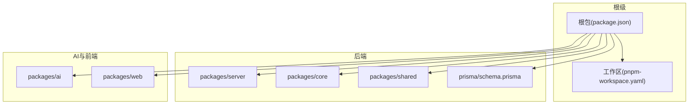
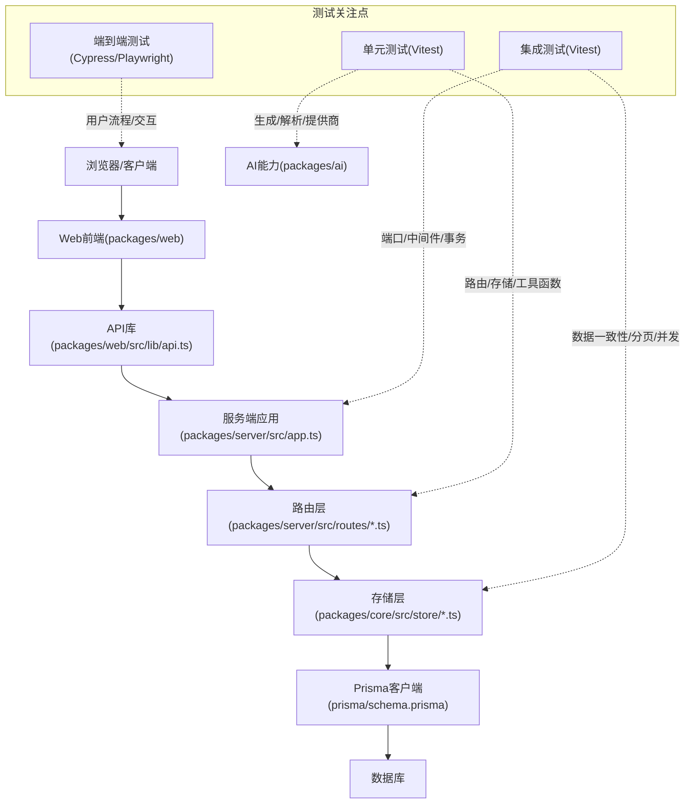
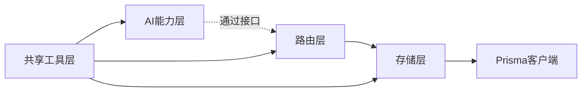

# 测试策略

<cite>
**本文引用的文件**
- [package.json](file://package.json)
- [pnpm-workspace.yaml](file://pnpm-workspace.yaml)
- [packages/core/src/store/prisma-test-suite.ts](file://packages/core/src/store/prisma-test-suite.ts)
- [packages/core/src/store/prisma-test-run.ts](file://packages/core/src/store/prisma-test-run.ts)
- [packages/core/src/models/index.ts](file://packages/core/src/models/index.ts)
- [packages/server/src/routes/suites.ts](file://packages/server/src/routes/suites.ts)
- [packages/server/src/routes/test-cases.ts](file://packages/server/src/routes/test-cases.ts)
- [packages/server/src/routes/runs.ts](file://packages/server/src/routes/runs.ts)
- [packages/server/src/routes/datasets.ts](file://packages/server/src/routes/datasets.ts)
- [packages/server/src/routes/projects.ts](file://packages/server/src/routes/projects.ts)
- [packages/server/src/app.ts](file://packages/server/src/app.ts)
- [packages/web/vite.config.ts](file://packages/web/vite.config.ts)
- [packages/web/src/lib/api.ts](file://packages/web/src/lib/api.ts)
- [packages/web/src/pages/suites.tsx](file://packages/web/src/pages/suites.tsx)
- [packages/web/src/pages/runs.tsx](file://packages/web/src/pages/runs.tsx)
- [packages/web/src/pages/test-cases.tsx](file://packages/web/src/pages/test-cases.tsx)
- [packages/web/src/components/ui/button.tsx](file://packages/web/src/components/ui/button.tsx)
- [packages/web/src/components/ui/dialog.tsx](file://packages/web/src/components/ui/dialog.tsx)
- [packages/web/src/components/layout/sidebar.tsx](file://packages/web/src/components/layout/sidebar.tsx)
- [packages/ai/src/generation/generator.ts](file://packages/ai/src/generation/generator.ts)
- [packages/ai/src/providers/openai-provider.ts](file://packages/ai/src/providers/openai-provider.ts)
- [packages/ai/src/parsers/curl-parser.ts](file://packages/ai/src/parsers/curl-parser.ts)
- [packages/ai/src/parsers/openapi-parser.ts](file://packages/ai/src/parsers/openapi-parser.ts)
- [packages/shared/src/errors.ts](file://packages/shared/src/errors.ts)
- [packages/shared/src/logger.ts](file://packages/shared/src/logger.ts)
- [prisma/schema.prisma](file://prisma/schema.prisma)
</cite>

## 目录
1. [引言](#引言)
2. [项目结构](#项目结构)
3. [核心组件](#核心组件)
4. [架构总览](#架构总览)
5. [详细组件分析](#详细组件分析)
6. [依赖分析](#依赖分析)
7. [性能考虑](#性能考虑)
8. [故障排查指南](#故障排查指南)
9. [结论](#结论)
10. [附录](#附录)

## 引言
本测试策略文档面向AI测试器项目的整体测试体系，覆盖单元测试、集成测试与端到端测试的实施方法；明确Vitest配置与测试框架选择、Mock策略；梳理核心模块（服务端路由、数据库存储、AI生成与解析、Web组件）的测试覆盖范围、用例设计与断言策略；给出API测试、数据库测试与前端组件测试的具体实现建议；并包含测试数据管理、测试环境配置与持续集成设置思路，以及性能测试、安全测试与兼容性测试的实施方案。

## 项目结构
项目采用Monorepo结构，使用pnpm工作区组织多个包：核心引擎与存储（core）、AI能力（ai）、服务端（server）、共享工具（shared）、Web前端（web）。根级脚本统一执行构建、开发、类型检查与测试；Vitest作为测试运行器被引入。

**图示来源**
- [package.json:1-31](file://package.json#L1-L31)
- [pnpm-workspace.yaml:1-3](file://pnpm-workspace.yaml#L1-L3)

**章节来源**
- [package.json:1-31](file://package.json#L1-L31)
- [pnpm-workspace.yaml:1-3](file://pnpm-workspace.yaml#L1-L3)

## 核心组件
- 服务端路由层：提供套件、用例、运行、数据集与项目等REST接口，负责请求校验、参数过滤与响应封装。
- 数据库存储层：基于Prisma访问模型，提供测试套件、测试运行、数据集等实体的增删改查与聚合查询。
- AI能力层：生成器、解析器与提供商工厂构成AI生成与协议解析链路。
- 共享工具层：错误与日志抽象，便于在各包中复用。
- 前端UI层：页面组件与通用UI组件，通过API库调用后端服务。

**章节来源**
- [packages/server/src/routes/suites.ts](file://packages/server/src/routes/suites.ts)
- [packages/server/src/routes/test-cases.ts](file://packages/server/src/routes/test-cases.ts)
- [packages/server/src/routes/runs.ts](file://packages/server/src/routes/runs.ts)
- [packages/server/src/routes/datasets.ts](file://packages/server/src/routes/datasets.ts)
- [packages/server/src/routes/projects.ts](file://packages/server/src/routes/projects.ts)
- [packages/core/src/store/prisma-test-suite.ts:42-76](file://packages/core/src/store/prisma-test-suite.ts#L42-L76)
- [packages/core/src/store/prisma-test-run.ts:91-131](file://packages/core/src/store/prisma-test-run.ts#L91-L131)
- [packages/ai/src/generation/generator.ts](file://packages/ai/src/generation/generator.ts)
- [packages/ai/src/parsers/curl-parser.ts](file://packages/ai/src/parsers/curl-parser.ts)
- [packages/ai/src/parsers/openapi-parser.ts](file://packages/ai/src/parsers/openapi-parser.ts)
- [packages/shared/src/errors.ts](file://packages/shared/src/errors.ts)
- [packages/shared/src/logger.ts](file://packages/shared/src/logger.ts)

## 架构总览
下图展示从浏览器到服务端再到数据库的典型请求路径，以及测试关注点分布：

**图示来源**
- [packages/web/src/lib/api.ts](file://packages/web/src/lib/api.ts)
- [packages/server/src/app.ts](file://packages/server/src/app.ts)
- [packages/server/src/routes/suites.ts](file://packages/server/src/routes/suites.ts)
- [packages/core/src/store/prisma-test-suite.ts:42-76](file://packages/core/src/store/prisma-test-suite.ts#L42-L76)
- [prisma/schema.prisma](file://prisma/schema.prisma)

## 详细组件分析

### 单元测试策略
- 测试范围
  - 路由层：对输入参数进行校验、状态码与响应结构断言；对异常分支进行错误处理验证。
  - 存储层：对查询、更新、删除等操作进行断言；对JSON字段序列化/反序列化进行验证。
  - AI层：对生成器、解析器与提供商工厂进行行为断言；对外部API调用进行Mock。
  - 共享层：对错误类与日志工具进行行为断言。
- Mock策略
  - 使用Vitest的内置Mock能力对Prisma客户端、HTTP客户端与外部服务进行隔离。
  - 对异步操作使用定时器Mock或Promise Mock，确保可重复性与可控性。
- 断言策略
  - 使用结构化断言（如对象键存在性、数组长度、数值范围）与状态码断言相结合。
  - 对副作用（如写入数据库）通过Mock返回值控制，避免真实写入。

**章节来源**
- [packages/server/src/routes/suites.ts](file://packages/server/src/routes/suites.ts)
- [packages/core/src/store/prisma-test-suite.ts:42-76](file://packages/core/src/store/prisma-test-suite.ts#L42-L76)
- [packages/core/src/store/prisma-test-run.ts:91-131](file://packages/core/src/store/prisma-test-run.ts#L91-L131)
- [packages/ai/src/generation/generator.ts](file://packages/ai/src/generation/generator.ts)
- [packages/ai/src/parsers/curl-parser.ts](file://packages/ai/src/parsers/curl-parser.ts)
- [packages/ai/src/parsers/openapi-parser.ts](file://packages/ai/src/parsers/openapi-parser.ts)
- [packages/shared/src/errors.ts](file://packages/shared/src/errors.ts)
- [packages/shared/src/logger.ts](file://packages/shared/src/logger.ts)

### 集成测试策略
- 测试范围
  - 完整请求链路：从前端API调用到服务端路由、存储层与数据库。
  - 并发与事务：模拟多并发场景下的数据一致性与锁竞争。
  - 分页与聚合：对分页查询、统计聚合与排序进行验证。
- Mock策略
  - 保留Prisma客户端真实连接，但使用内存数据库或测试专用数据库实例。
  - 对外部AI提供商接口进行Mock，保证测试稳定性与可重复性。
- 断言策略
  - 对数据库最终状态进行快照式断言。
  - 对响应体结构、分页字段与总数进行断言。

**章节来源**
- [packages/server/src/app.ts](file://packages/server/src/app.ts)
- [packages/server/src/routes/runs.ts](file://packages/server/src/routes/runs.ts)
- [packages/core/src/store/prisma-test-run.ts:91-131](file://packages/core/src/store/prisma-test-run.ts#L91-L131)
- [prisma/schema.prisma](file://prisma/schema.prisma)

### 端到端测试策略
- 测试范围
  - 用户操作流：从登录到创建项目、编写用例、执行运行、查看报告的完整流程。
  - 组件交互：按钮点击、表单提交、模态框弹出、表格筛选与分页。
- Mock策略
  - 对外部AI服务与第三方接口进行Mock，确保测试不依赖网络。
  - 对浏览器本地存储与会话进行隔离。
- 断言策略
  - 对页面元素可见性、禁用状态与文本内容进行断言。
  - 对路由跳转与URL变化进行断言。

**章节来源**
- [packages/web/vite.config.ts](file://packages/web/vite.config.ts)
- [packages/web/src/lib/api.ts](file://packages/web/src/lib/api.ts)
- [packages/web/src/pages/suites.tsx](file://packages/web/src/pages/suites.tsx)
- [packages/web/src/pages/runs.tsx](file://packages/web/src/pages/runs.tsx)
- [packages/web/src/pages/test-cases.tsx](file://packages/web/src/pages/test-cases.tsx)
- [packages/web/src/components/ui/button.tsx](file://packages/web/src/components/ui/button.tsx)
- [packages/web/src/components/ui/dialog.tsx](file://packages/web/src/components/ui/dialog.tsx)
- [packages/web/src/components/layout/sidebar.tsx](file://packages/web/src/components/layout/sidebar.tsx)

### API测试（服务端）
- 设计要点
  - 覆盖所有路由：套件、用例、运行、数据集、项目等。
  - 参数校验：缺失参数、非法类型、越界值、空字符串等边界条件。
  - 错误处理：业务异常与系统异常的响应结构与状态码。
- 断言策略
  - 对HTTP状态码、Content-Type与响应体结构进行断言。
  - 对分页字段（如page、pageSize、total）进行断言。
- 示例断言路径
  - [packages/server/src/routes/suites.ts](file://packages/server/src/routes/suites.ts)
  - [packages/server/src/routes/test-cases.ts](file://packages/server/src/routes/test-cases.ts)
  - [packages/server/src/routes/runs.ts](file://packages/server/src/routes/runs.ts)
  - [packages/server/src/routes/datasets.ts](file://packages/server/src/routes/datasets.ts)
  - [packages/server/src/routes/projects.ts](file://packages/server/src/routes/projects.ts)

**章节来源**
- [packages/server/src/routes/suites.ts](file://packages/server/src/routes/suites.ts)
- [packages/server/src/routes/test-cases.ts](file://packages/server/src/routes/test-cases.ts)
- [packages/server/src/routes/runs.ts](file://packages/server/src/routes/runs.ts)
- [packages/server/src/routes/datasets.ts](file://packages/server/src/routes/datasets.ts)
- [packages/server/src/routes/projects.ts](file://packages/server/src/routes/projects.ts)

### 数据库测试（Prisma）
- 设计要点
  - 基础CRUD：对测试套件与测试运行的增删改查进行断言。
  - 复杂查询：对分页、排序、条件过滤与聚合进行断言。
  - JSON字段：对变量、环境等JSON字段的序列化/反序列化进行断言。
- 断言策略
  - 对返回实体的字段完整性进行断言。
  - 对总数与分页结果进行断言。
- 示例断言路径
  - [packages/core/src/store/prisma-test-suite.ts:42-76](file://packages/core/src/store/prisma-test-suite.ts#L42-L76)
  - [packages/core/src/store/prisma-test-run.ts:91-131](file://packages/core/src/store/prisma-test-run.ts#L91-L131)
  - [packages/core/src/models/index.ts:1-6](file://packages/core/src/models/index.ts#L1-L6)
  - [prisma/schema.prisma](file://prisma/schema.prisma)

**章节来源**
- [packages/core/src/store/prisma-test-suite.ts:42-76](file://packages/core/src/store/prisma-test-suite.ts#L42-L76)
- [packages/core/src/store/prisma-test-run.ts:91-131](file://packages/core/src/store/prisma-test-run.ts#L91-L131)
- [packages/core/src/models/index.ts:1-6](file://packages/core/src/models/index.ts#L1-L6)
- [prisma/schema.prisma](file://prisma/schema.prisma)

### 前端组件测试
- 设计要点
  - UI组件：按钮、对话框、侧边栏等基础组件的行为与渲染断言。
  - 页面组件：套件列表、运行列表、用例列表等页面的数据加载与交互断言。
  - API交互：对API库的调用进行Mock，断言请求参数与响应处理。
- 断言策略
  - 对DOM元素的存在性、可见性与属性进行断言。
  - 对事件回调与状态变更进行断言。
- 示例断言路径
  - [packages/web/src/components/ui/button.tsx](file://packages/web/src/components/ui/button.tsx)
  - [packages/web/src/components/ui/dialog.tsx](file://packages/web/src/components/ui/dialog.tsx)
  - [packages/web/src/components/layout/sidebar.tsx](file://packages/web/src/components/layout/sidebar.tsx)
  - [packages/web/src/pages/suites.tsx](file://packages/web/src/pages/suites.tsx)
  - [packages/web/src/pages/runs.tsx](file://packages/web/src/pages/runs.tsx)
  - [packages/web/src/pages/test-cases.tsx](file://packages/web/src/pages/test-cases.tsx)
  - [packages/web/src/lib/api.ts](file://packages/web/src/lib/api.ts)

**章节来源**
- [packages/web/src/components/ui/button.tsx](file://packages/web/src/components/ui/button.tsx)
- [packages/web/src/components/ui/dialog.tsx](file://packages/web/src/components/ui/dialog.tsx)
- [packages/web/src/components/layout/sidebar.tsx](file://packages/web/src/components/layout/sidebar.tsx)
- [packages/web/src/pages/suites.tsx](file://packages/web/src/pages/suites.tsx)
- [packages/web/src/pages/runs.tsx](file://packages/web/src/pages/runs.tsx)
- [packages/web/src/pages/test-cases.tsx](file://packages/web/src/pages/test-cases.tsx)
- [packages/web/src/lib/api.ts](file://packages/web/src/lib/api.ts)

### AI能力测试
- 设计要点
  - 生成器：对提示词策略、输出格式与错误回退进行断言。
  - 解析器：对curl与OpenAPI解析结果进行断言。
  - 提供商工厂：对不同提供商的初始化与调用进行断言。
- Mock策略
  - 对外部AI服务进行HTTP请求Mock，返回稳定响应。
- 断言策略
  - 对生成结果的结构与字段进行断言。
  - 对解析结果的协议字段与参数进行断言。
- 示例断言路径
  - [packages/ai/src/generation/generator.ts](file://packages/ai/src/generation/generator.ts)
  - [packages/ai/src/parsers/curl-parser.ts](file://packages/ai/src/parsers/curl-parser.ts)
  - [packages/ai/src/parsers/openapi-parser.ts](file://packages/ai/src/parsers/openapi-parser.ts)
  - [packages/ai/src/providers/openai-provider.ts](file://packages/ai/src/providers/openai-provider.ts)

**章节来源**
- [packages/ai/src/generation/generator.ts](file://packages/ai/src/generation/generator.ts)
- [packages/ai/src/parsers/curl-parser.ts](file://packages/ai/src/parsers/curl-parser.ts)
- [packages/ai/src/parsers/openapi-parser.ts](file://packages/ai/src/parsers/openapi-parser.ts)
- [packages/ai/src/providers/openai-provider.ts](file://packages/ai/src/providers/openai-provider.ts)

## 依赖分析
- 组件耦合
  - 路由层依赖存储层；存储层依赖Prisma客户端；AI层独立于路由与存储，通过接口解耦。
  - 共享层为跨包复用的错误与日志抽象，降低耦合度。
- 外部依赖
  - Vitest用于单元与集成测试；Prisma用于数据库访问；Web端使用Vite与React生态。
- 潜在循环依赖
  - 当前结构清晰，未见直接循环依赖；建议通过接口与抽象进一步降低间接耦合。

**图示来源**
- [packages/server/src/routes/suites.ts](file://packages/server/src/routes/suites.ts)
- [packages/core/src/store/prisma-test-suite.ts:42-76](file://packages/core/src/store/prisma-test-suite.ts#L42-L76)
- [prisma/schema.prisma](file://prisma/schema.prisma)
- [packages/shared/src/errors.ts](file://packages/shared/src/errors.ts)
- [packages/shared/src/logger.ts](file://packages/shared/src/logger.ts)

**章节来源**
- [packages/server/src/routes/suites.ts](file://packages/server/src/routes/suites.ts)
- [packages/core/src/store/prisma-test-suite.ts:42-76](file://packages/core/src/store/prisma-test-suite.ts#L42-L76)
- [packages/shared/src/errors.ts](file://packages/shared/src/errors.ts)
- [packages/shared/src/logger.ts](file://packages/shared/src/logger.ts)

## 性能考虑
- 单元测试
  - 避免真实IO，使用Mock与内存数据库；对热点路径进行基准测试与回归对比。
- 集成测试
  - 使用轻量级测试数据库；对批量写入与复杂查询进行压力测试与超时控制。
- 端到端测试
  - 控制并发与重试次数；对慢速网络场景进行模拟；对关键页面的首屏时间进行监控。
- 建议
  - 在CI中区分快速测试与性能测试阶段；对关键指标建立阈值告警。

## 故障排查指南
- 常见问题
  - 测试失败不稳定：检查Mock是否正确清理；确认时钟与随机数种子固定。
  - 数据库测试污染：确保每个测试用例使用独立的测试数据库实例或事务回滚。
  - 外部服务不可用：确认Mock已正确拦截请求；检查超时与重试策略。
- 排查步骤
  - 启用详细日志与断言输出；逐步缩小问题范围；使用最小可复现用例定位。
- 相关断言与错误处理
  - [packages/shared/src/errors.ts](file://packages/shared/src/errors.ts)
  - [packages/shared/src/logger.ts](file://packages/shared/src/logger.ts)

**章节来源**
- [packages/shared/src/errors.ts](file://packages/shared/src/errors.ts)
- [packages/shared/src/logger.ts](file://packages/shared/src/logger.ts)

## 结论
本测试策略以Vitest为核心，结合单元、集成与端到端三层测试，覆盖服务端路由、数据库存储、AI能力与前端组件。通过Mock隔离外部依赖、通过结构化断言保障质量，并在CI中分层执行以提升效率。建议后续完善性能、安全与兼容性专项测试，持续优化测试覆盖率与稳定性。

## 附录

### Vitest配置与测试框架选择
- 配置要点
  - 使用Vitest默认配置即可满足大多数场景；如需扩展，可在各包内新增vitest.config.ts。
  - 对Web前端，结合Vite配置与测试环境变量；对服务端，结合Express/Koa中间件与端口绑定。
- Mock策略
  - 使用Vitest的vi.spyOn、vi.mock与vi.fn进行函数与模块Mock；对全局时钟与随机数进行控制。
- 断言库
  - 建议使用expect风格断言；对复杂对象使用深度比较与部分匹配。

**章节来源**
- [packages/web/vite.config.ts](file://packages/web/vite.config.ts)
- [package.json:14-22](file://package.json#L14-L22)

### 测试数据管理
- 设计要点
  - 使用测试专用数据库实例或内存数据库；对种子数据进行版本化管理。
  - 对敏感数据进行脱敏或使用Mock；对时间戳与ID进行可控生成。
- 管理方式
  - 在测试前准备数据，在测试后清理或回滚；对共享数据使用命名空间隔离。

**章节来源**
- [prisma/schema.prisma](file://prisma/schema.prisma)

### 测试环境配置
- 开发环境
  - 使用本地数据库与Mock外部服务；启用调试日志与断点支持。
- CI环境
  - 使用容器化数据库；对测试报告与覆盖率进行收集与上传。
- 变量与密钥
  - 使用环境变量注入；对敏感信息进行加密存储与解密注入。

**章节来源**
- [package.json:6-12](file://package.json#L6-L12)

### 持续集成设置
- 流水线阶段
  - 安装依赖与类型检查；运行单元测试；运行集成测试；运行端到端测试；收集覆盖率与报告。
- 缓存与并发
  - 对依赖缓存与测试缓存进行优化；合理分配并发任务以缩短总时长。
- 报告与告警
  - 将测试报告与覆盖率上传至平台；对失败与波动建立告警机制。

**章节来源**
- [package.json:6-12](file://package.json#L6-L12)

### 性能测试、安全测试与兼容性测试
- 性能测试
  - 关键接口的吞吐量与延迟；数据库查询的慢查询识别；前端关键路径的渲染时间。
- 安全测试
  - 输入验证与SQL注入防护；认证与授权边界；敏感信息泄露检测。
- 兼容性测试
  - 不同浏览器与Node版本的适配；API向后兼容性；数据库迁移的兼容性验证。

[本节为通用指导，无需具体文件来源]