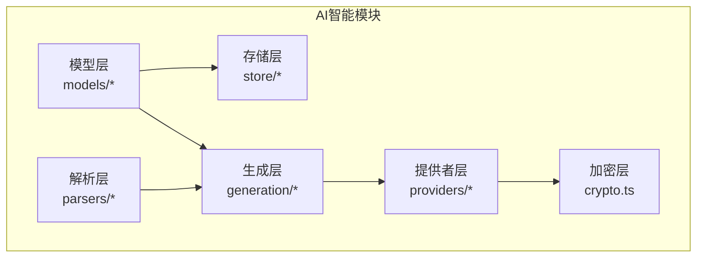
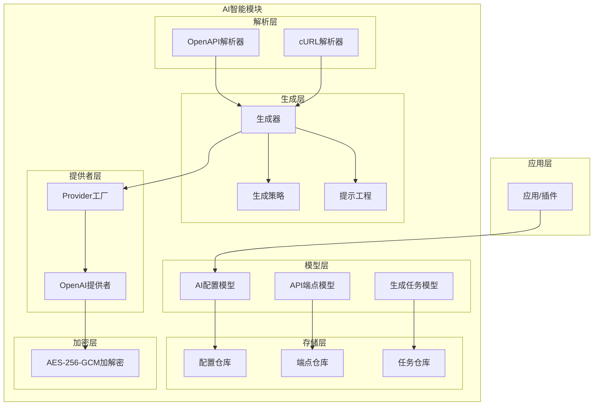
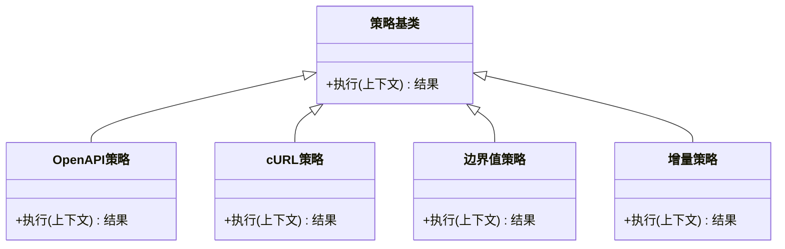
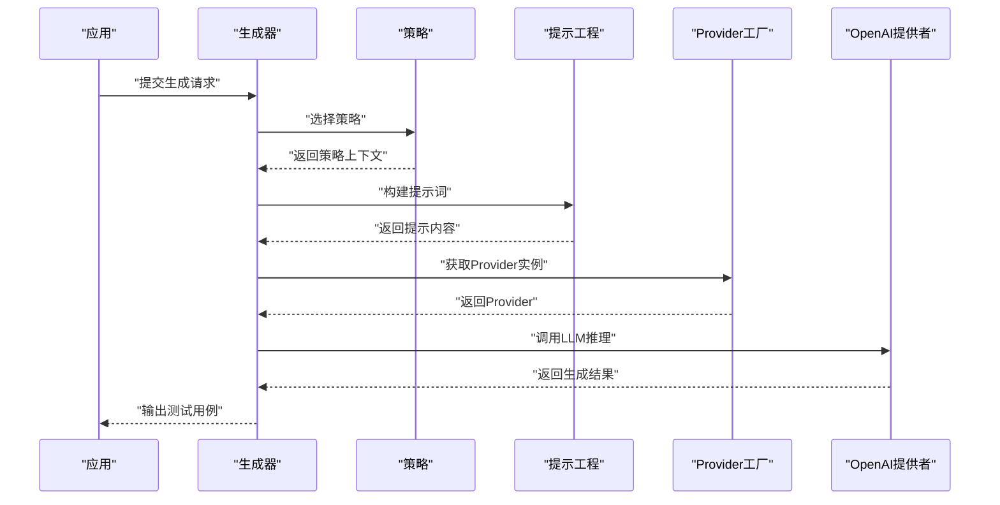
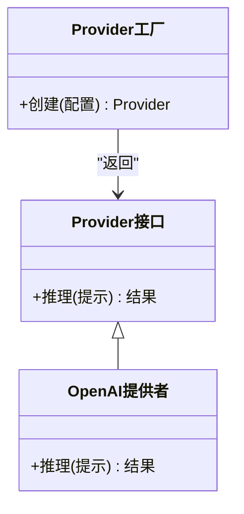
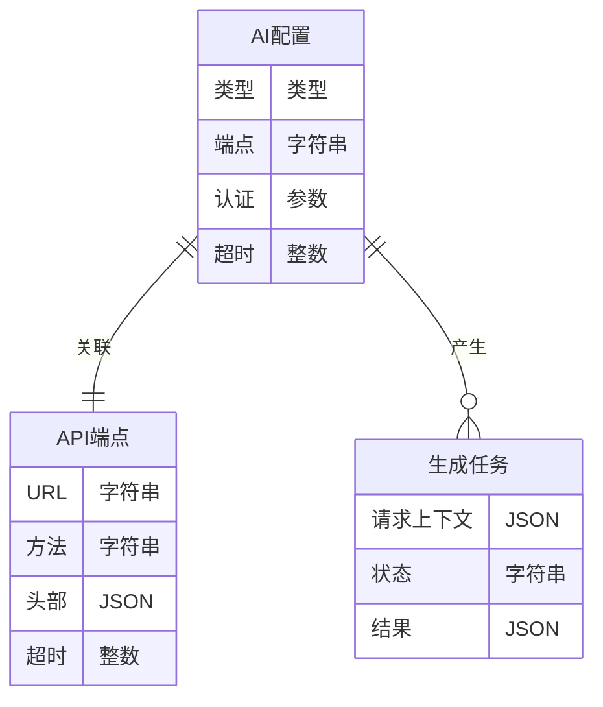
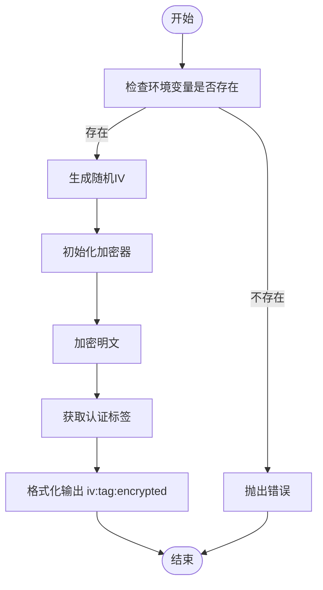
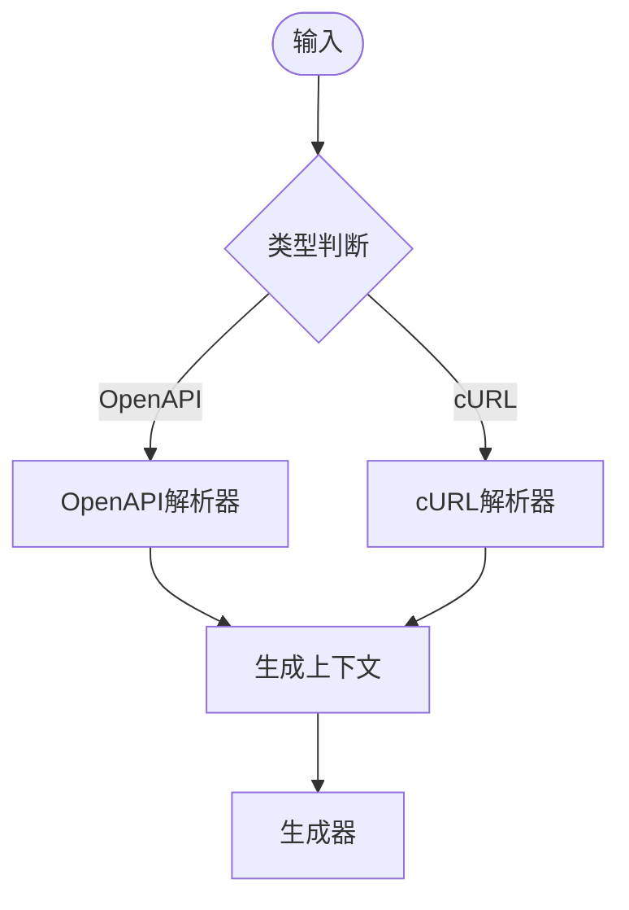
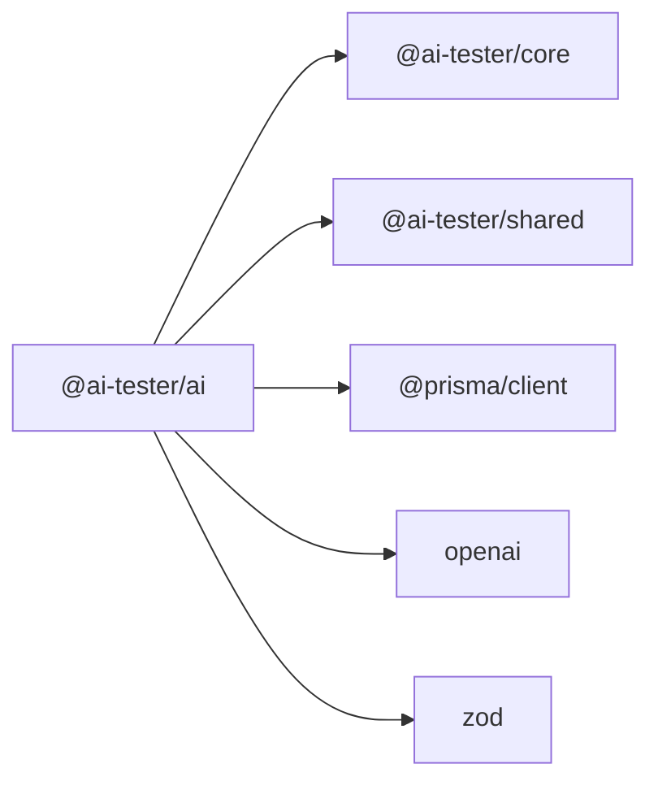

# AI智能架构

<cite>
**本文档引用的文件**
- [packages/ai/package.json](file://packages/ai/package.json)
- [packages/ai/src/index.ts](file://packages/ai/src/index.ts)
- [packages/ai/src/models/index.ts](file://packages/ai/src/models/index.ts)
- [packages/ai/src/store/index.ts](file://packages/ai/src/store/index.ts)
- [packages/ai/src/providers/index.ts](file://packages/ai/src/providers/index.ts)
- [packages/ai/src/generation/index.ts](file://packages/ai/src/generation/index.ts)
- [packages/ai/src/parsers/index.ts](file://packages/ai/src/parsers/index.ts)
- [packages/ai/src/crypto.ts](file://packages/ai/src/crypto.ts)
</cite>

## 目录
1. [简介](#简介)
2. [项目结构](#项目结构)
3. [核心组件](#核心组件)
4. [架构总览](#架构总览)
5. [详细组件分析](#详细组件分析)
6. [依赖关系分析](#依赖关系分析)
7. [性能考虑](#性能考虑)
8. [故障排除指南](#故障排除指南)
9. [结论](#结论)
10. [附录](#附录)

## 简介
本架构文档聚焦于AI智能模块，系统性阐述以下方面：AI配置管理、测试用例生成器、AI提供者（Provider）集成；解释生成策略模式、提示工程与LLM集成的技术实现；文档化Provider工厂的设计模式、多提供商支持与动态切换机制；说明AI配置的数据模型、加密存储与安全传输方案；并提供AI工作流程图、生成策略图与提供商架构图。最后总结质量控制、错误处理与性能优化策略。

## 项目结构
AI智能模块位于packages/ai目录，采用按功能域分层的组织方式：
- 模型层：定义AI配置、API端点、生成任务等数据模型
- 存储层：封装配置与任务的持久化与查询接口
- 提供者层：抽象与实现不同AI服务提供商（如OpenAI）
- 生成层：策略、提示词与生成器
- 解析层：对OpenAPI、cURL等输入进行解析
- 加密层：API密钥的加解密与脱敏

**图表来源**
- [packages/ai/src/index.ts:1-7](file://packages/ai/src/index.ts#L1-L7)
- [packages/ai/src/models/index.ts:1-4](file://packages/ai/src/models/index.ts#L1-L4)
- [packages/ai/src/store/index.ts:1-5](file://packages/ai/src/store/index.ts#L1-L5)
- [packages/ai/src/providers/index.ts:1-4](file://packages/ai/src/providers/index.ts#L1-L4)
- [packages/ai/src/generation/index.ts:1-4](file://packages/ai/src/generation/index.ts#L1-L4)
- [packages/ai/src/parsers/index.ts:1-4](file://packages/ai/src/parsers/index.ts#L1-L4)
- [packages/ai/src/crypto.ts:1-58](file://packages/ai/src/crypto.ts#L1-L58)

**章节来源**
- [packages/ai/src/index.ts:1-7](file://packages/ai/src/index.ts#L1-L7)
- [packages/ai/src/models/index.ts:1-4](file://packages/ai/src/models/index.ts#L1-L4)
- [packages/ai/src/store/index.ts:1-5](file://packages/ai/src/store/index.ts#L1-L5)
- [packages/ai/src/providers/index.ts:1-4](file://packages/ai/src/providers/index.ts#L1-L4)
- [packages/ai/src/generation/index.ts:1-4](file://packages/ai/src/generation/index.ts#L1-L4)
- [packages/ai/src/parsers/index.ts:1-4](file://packages/ai/src/parsers/index.ts#L1-L4)
- [packages/ai/src/crypto.ts:1-58](file://packages/ai/src/crypto.ts#L1-L58)

## 核心组件
- 模型与数据层
  - AI配置模型：封装提供商类型、端点、认证参数等
  - API端点模型：封装HTTP端点、请求头、超时等
  - 生成任务模型：封装生成请求、状态、结果等
- 存储与仓库
  - 配置仓库：提供配置的增删改查与分页查询
  - API端点仓库：提供端点的CRUD与校验
  - 生成任务仓库：提供任务的创建、更新与查询
- 提供者与工厂
  - Provider接口：统一LLM调用契约
  - OpenAI Provider：具体实现
  - Provider工厂：根据配置动态选择与实例化Provider
- 生成策略与提示工程
  - 策略集合：按场景定义的生成策略
  - 提示词模板：可参数化的提示工程
  - 生成器：编排策略、提示与Provider执行
- 输入解析
  - OpenAPI解析器：从OpenAPI规范提取API信息
  - cURL解析器：从cURL命令提取请求细节
- 安全与加密
  - AES-256-GCM加解密：用于API密钥的存储与传输
  - 脱敏显示：对敏感信息进行掩码展示

**章节来源**
- [packages/ai/src/models/index.ts:1-4](file://packages/ai/src/models/index.ts#L1-L4)
- [packages/ai/src/store/index.ts:1-5](file://packages/ai/src/store/index.ts#L1-L5)
- [packages/ai/src/providers/index.ts:1-4](file://packages/ai/src/providers/index.ts#L1-L4)
- [packages/ai/src/generation/index.ts:1-4](file://packages/ai/src/generation/index.ts#L1-L4)
- [packages/ai/src/parsers/index.ts:1-4](file://packages/ai/src/parsers/index.ts#L1-L4)
- [packages/ai/src/crypto.ts:1-58](file://packages/ai/src/crypto.ts#L1-L58)

## 架构总览
AI智能模块以“模型-存储-生成-提供者-解析-加密”为主线，形成清晰的分层架构。生成层通过策略与提示工程对接提供者层，解析层为生成层提供输入，存储层为模型层提供持久化能力，加密层贯穿提供者与存储，保障密钥安全。

**图表来源**
- [packages/ai/src/models/index.ts:1-4](file://packages/ai/src/models/index.ts#L1-L4)
- [packages/ai/src/store/index.ts:1-5](file://packages/ai/src/store/index.ts#L1-L5)
- [packages/ai/src/generation/index.ts:1-4](file://packages/ai/src/generation/index.ts#L1-L4)
- [packages/ai/src/providers/index.ts:1-4](file://packages/ai/src/providers/index.ts#L1-L4)
- [packages/ai/src/parsers/index.ts:1-4](file://packages/ai/src/parsers/index.ts#L1-L4)
- [packages/ai/src/crypto.ts:1-58](file://packages/ai/src/crypto.ts#L1-L58)

## 详细组件分析

### 生成策略模式
生成策略模式将“如何生成测试用例”的算法族抽象为独立对象，便于扩展与组合。策略包括但不限于：
- 基于OpenAPI的参数化策略
- 基于cURL的请求还原策略
- 基于规则的边界值与异常场景策略
- 基于上下文的增量策略

**图表来源**
- [packages/ai/src/generation/index.ts:1-4](file://packages/ai/src/generation/index.ts#L1-L4)

**章节来源**
- [packages/ai/src/generation/index.ts:1-4](file://packages/ai/src/generation/index.ts#L1-L4)

### 提示工程与LLM集成
提示工程通过参数化模板与上下文拼接，生成高质量的指令。LLM集成通过Provider抽象屏蔽底层差异，支持OpenAI等多提供商。

**图表来源**
- [packages/ai/src/generation/index.ts:1-4](file://packages/ai/src/generation/index.ts#L1-L4)
- [packages/ai/src/providers/index.ts:1-4](file://packages/ai/src/providers/index.ts#L1-L4)

**章节来源**
- [packages/ai/src/generation/index.ts:1-4](file://packages/ai/src/generation/index.ts#L1-L4)
- [packages/ai/src/providers/index.ts:1-4](file://packages/ai/src/providers/index.ts#L1-L4)

### Provider工厂与多提供商支持
Provider工厂根据配置动态选择合适的Provider实例，支持OpenAI等提供商，并提供统一的调用接口。

**图表来源**
- [packages/ai/src/providers/index.ts:1-4](file://packages/ai/src/providers/index.ts#L1-L4)

**章节来源**
- [packages/ai/src/providers/index.ts:1-4](file://packages/ai/src/providers/index.ts#L1-L4)

### AI配置的数据模型
AI配置模型包含提供商类型、端点、认证参数、超时等字段；API端点模型包含URL、方法、头部、超时等；生成任务模型包含请求上下文、状态、结果等。

**图表来源**
- [packages/ai/src/models/index.ts:1-4](file://packages/ai/src/models/index.ts#L1-L4)

**章节来源**
- [packages/ai/src/models/index.ts:1-4](file://packages/ai/src/models/index.ts#L1-L4)

### 加密存储与安全传输
使用AES-256-GCM对API密钥进行加解密，格式为“iv:tag:encrypted”。同时提供密钥脱敏显示，避免在日志中泄露敏感信息。

**图表来源**
- [packages/ai/src/crypto.ts:1-58](file://packages/ai/src/crypto.ts#L1-L58)

**章节来源**
- [packages/ai/src/crypto.ts:1-58](file://packages/ai/src/crypto.ts#L1-L58)

### 输入解析器
解析层负责将外部输入转换为生成器可用的上下文：
- OpenAPI解析器：从OpenAPI规范提取路径、参数、响应等
- cURL解析器：从cURL命令提取URL、方法、头部、体等

**图表来源**
- [packages/ai/src/parsers/index.ts:1-4](file://packages/ai/src/parsers/index.ts#L1-L4)

**章节来源**
- [packages/ai/src/parsers/index.ts:1-4](file://packages/ai/src/parsers/index.ts#L1-L4)

## 依赖关系分析
AI模块依赖核心与共享包，并引入第三方库：
- @ai-tester/core：通用能力与协议
- @ai-tester/shared：共享工具与类型
- @prisma/client：数据库客户端
- openai：OpenAI SDK
- zod：Schema校验

**图表来源**
- [packages/ai/package.json:21-32](file://packages/ai/package.json#L21-L32)

**章节来源**
- [packages/ai/package.json:1-34](file://packages/ai/package.json#L1-L34)

## 性能考虑
- 缓存与复用：Provider实例与连接池复用，减少初始化开销
- 批量化：批量提交生成请求，降低网络往返
- 超时与重试：为LLM调用设置合理超时与指数退避重试
- 分页与限流：存储层支持分页与并发限制，避免过载
- 压缩与传输：在安全前提下尽量减少传输体积

## 故障排除指南
- Provider不可用：检查配置中的提供商类型与端点是否正确，确认工厂创建逻辑
- 密钥错误：确认环境变量存在且格式正确，检查加解密流程
- 解析失败：核对输入格式（OpenAPI或cURL），确保解析器版本兼容
- 生成异常：查看策略与提示工程的上下文拼接，定位问题片段
- 存储异常：检查Prisma模型与迁移，确认权限与连接字符串

## 结论
AI智能模块通过清晰的分层与抽象，实现了从配置管理、输入解析到生成策略与Provider集成的完整闭环。结合加密与安全传输，确保了密钥与数据的安全性。建议后续扩展更多Provider与策略，完善质量评估与可观测性指标。

## 附录
- 术语
  - Provider：AI服务提供方的抽象实现
  - 策略：生成测试用例的具体算法族
  - 提示工程：将业务需求转化为LLM可理解的指令
  - 加密存储：对敏感信息进行加密后持久化
- 最佳实践
  - 使用工厂模式实现多Provider动态切换
  - 将提示工程参数化，提升复用性
  - 对生成结果进行Schema校验与后处理
  - 在生产环境启用严格的密钥轮换与审计