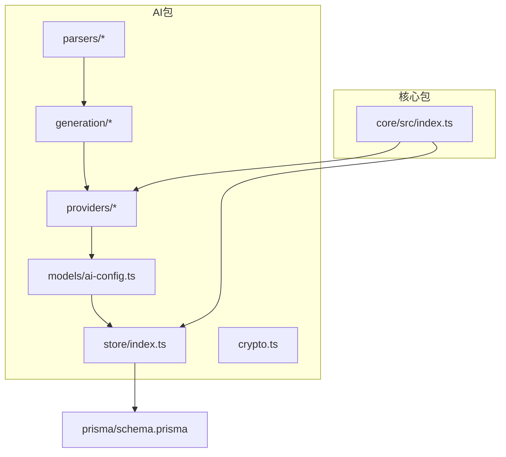
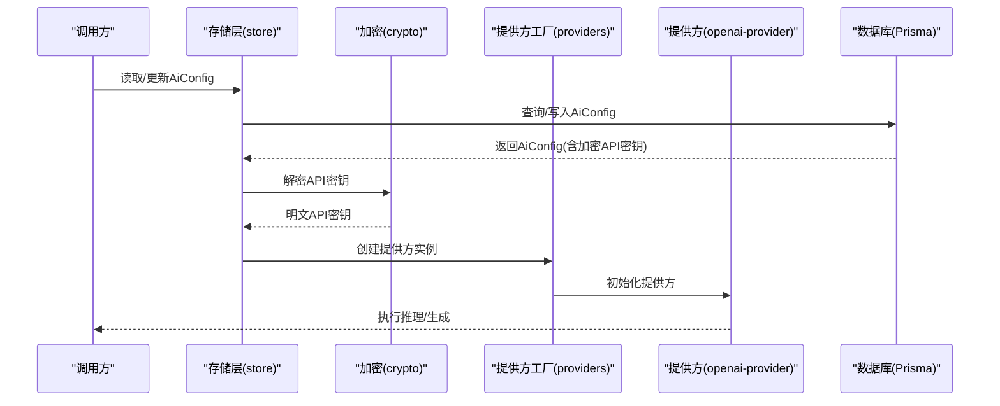
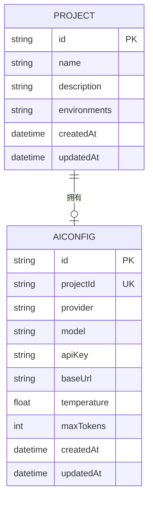
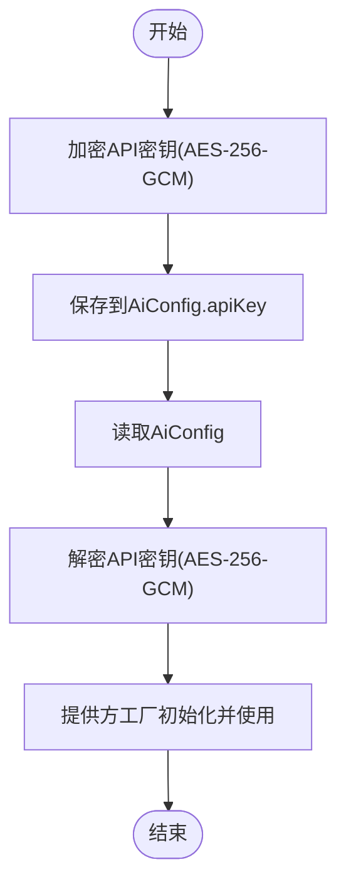
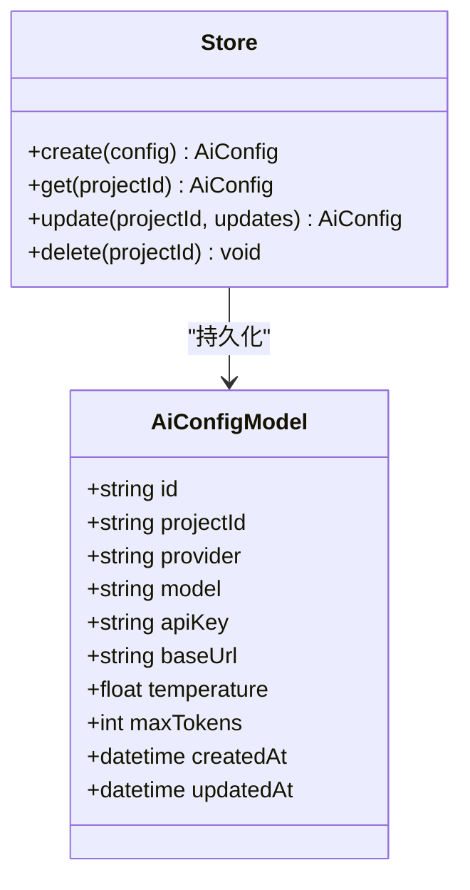
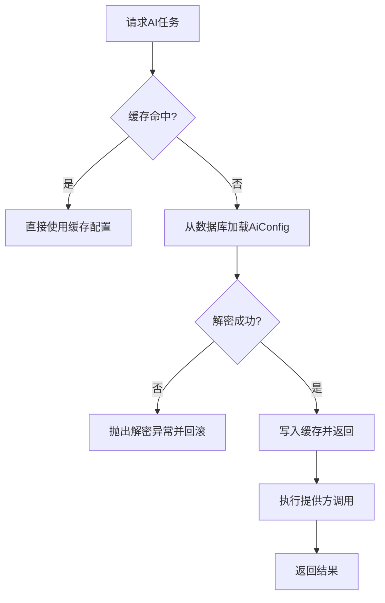
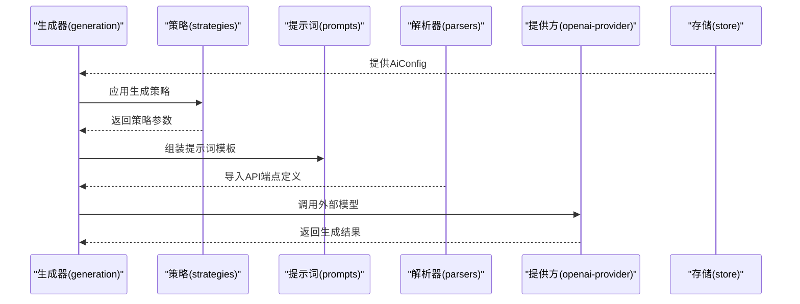
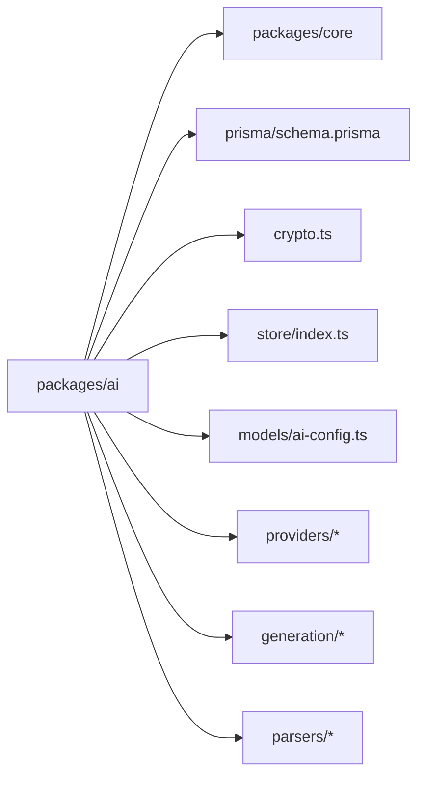

# AI配置管理

<cite>
**本文引用的文件**
- [schema.prisma](file://prisma/schema.prisma)
- [packages/ai/src/index.ts](file://packages/ai/src/index.ts)
- [packages/ai/src/models/ai-config.ts](file://packages/ai/src/models/ai-config.ts)
- [packages/ai/src/store/index.ts](file://packages/ai/src/store/index.ts)
- [packages/ai/src/crypto.ts](file://packages/ai/src/crypto.ts)
- [packages/ai/src/providers/index.ts](file://packages/ai/src/providers/index.ts)
- [packages/ai/src/providers/openai-provider.ts](file://packages/ai/src/providers/openai-provider.ts)
- [packages/ai/src/providers/provider-factory.ts](file://packages/ai/src/providers/provider-factory.ts)
- [packages/ai/src/generation/generator.ts](file://packages/ai/src/generation/generator.ts)
- [packages/ai/src/generation/strategies.ts](file://packages/ai/src/generation/strategies.ts)
- [packages/ai/src/generation/prompts.ts](file://packages/ai/src/generation/prompts.ts)
- [packages/ai/src/parsers/index.ts](file://packages/ai/src/parsers/index.ts)
- [packages/ai/src/parsers/openapi-parser.ts](file://packages/ai/src/parsers/openapi-parser.ts)
- [packages/ai/src/parsers/curl-parser.ts](file://packages/ai/src/parsers/curl-parser.ts)
- [packages/core/src/index.ts](file://packages/core/src/index.ts)
</cite>

## 目录
1. [简介](#简介)
2. [项目结构](#项目结构)
3. [核心组件](#核心组件)
4. [架构总览](#架构总览)
5. [详细组件分析](#详细组件分析)
6. [依赖关系分析](#依赖关系分析)
7. [性能考虑](#性能考虑)
8. [故障排查指南](#故障排查指南)
9. [结论](#结论)
10. [附录](#附录)

## 简介
本文件面向“AI配置管理系统”，聚焦以下目标：
- 数据模型设计：提供商类型、API密钥、端点URL与参数配置
- 加密存储与解密流程、安全传输方案
- Prisma仓储模式：CRUD、数据验证与约束
- 配置加载、缓存与失效策略
- 验证规则、默认值与错误处理
- 最佳实践与安全建议

该系统以多包工作区组织，核心AI能力位于 packages/ai，数据库模型定义于 prisma/schema.prisma。

## 项目结构
- 工作区采用 pnpm workspace，核心包包括 ai、core、plugin-api、server、shared、web。
- AI配置相关代码集中在 packages/ai，包含模型、存储、加密、提供方工厂、生成器与解析器等模块。
- 数据层通过 Prisma 定义，AiConfig 模型承载项目级AI配置（含加密API密钥）。

图表来源
- [packages/ai/src/index.ts:1-7](file://packages/ai/src/index.ts#L1-L7)
- [packages/ai/src/models/ai-config.ts](file://packages/ai/src/models/ai-config.ts)
- [packages/ai/src/store/index.ts](file://packages/ai/src/store/index.ts)
- [packages/ai/src/crypto.ts](file://packages/ai/src/crypto.ts)
- [packages/ai/src/providers/index.ts:1-4](file://packages/ai/src/providers/index.ts#L1-L4)
- [packages/ai/src/generation/index.ts:1-4](file://packages/ai/src/generation/index.ts#L1-L4)
- [packages/ai/src/parsers/index.ts](file://packages/ai/src/parsers/index.ts)
- [packages/core/src/index.ts:1-5](file://packages/core/src/index.ts#L1-L5)
- [prisma/schema.prisma:141-154](file://prisma/schema.prisma#L141-L154)

章节来源
- [packages/ai/src/index.ts:1-7](file://packages/ai/src/index.ts#L1-L7)
- [packages/core/src/index.ts:1-5](file://packages/core/src/index.ts#L1-L5)
- [prisma/schema.prisma:141-154](file://prisma/schema.prisma#L141-L154)

## 核心组件
- 数据模型（Prisma）
  - AiConfig：项目唯一AI配置，字段包含提供商、模型、加密API密钥、基础URL、温度、最大Token等；提供createdAt/updatedAt时间戳。
  - Project：与AiConfig一对一关联，保证每个项目仅有一份AI配置。
- 存储与仓储
  - store/index.ts：封装Prisma客户端访问，提供配置的增删改查、查询与事务支持。
- 加密与解密
  - crypto.ts：提供对敏感字段（如API密钥）的加密与解密能力，使用AEAD（AES-256-GCM）。
- 提供方与工厂
  - providers/provider-factory.ts：根据AiConfig.provider选择具体提供方实现。
  - providers/openai-provider.ts：示例提供方实现，负责调用外部模型服务。
- 生成与解析
  - generation/generator.ts、strategies.ts、prompts.ts：基于配置生成测试用例或提示词。
  - parsers/openapi-parser.ts、curl-parser.ts：从OpenAPI或CURL导入API端点定义，辅助配置生成。

章节来源
- [prisma/schema.prisma:141-154](file://prisma/schema.prisma#L141-L154)
- [packages/ai/src/store/index.ts](file://packages/ai/src/store/index.ts)
- [packages/ai/src/crypto.ts](file://packages/ai/src/crypto.ts)
- [packages/ai/src/providers/provider-factory.ts](file://packages/ai/src/providers/provider-factory.ts)
- [packages/ai/src/providers/openai-provider.ts](file://packages/ai/src/providers/openai-provider.ts)
- [packages/ai/src/generation/generator.ts](file://packages/ai/src/generation/generator.ts)
- [packages/ai/src/generation/strategies.ts](file://packages/ai/src/generation/strategies.ts)
- [packages/ai/src/generation/prompts.ts](file://packages/ai/src/generation/prompts.ts)
- [packages/ai/src/parsers/openapi-parser.ts](file://packages/ai/src/parsers/openapi-parser.ts)
- [packages/ai/src/parsers/curl-parser.ts](file://packages/ai/src/parsers/curl-parser.ts)

## 架构总览
AI配置管理贯穿“模型-存储-加密-提供方-生成-解析”链路，核心交互如下：

图表来源
- [packages/ai/src/store/index.ts](file://packages/ai/src/store/index.ts)
- [packages/ai/src/crypto.ts](file://packages/ai/src/crypto.ts)
- [packages/ai/src/providers/provider-factory.ts](file://packages/ai/src/providers/provider-factory.ts)
- [packages/ai/src/providers/openai-provider.ts](file://packages/ai/src/providers/openai-provider.ts)
- [prisma/schema.prisma:141-154](file://prisma/schema.prisma#L141-L154)

## 详细组件分析

### 数据模型与约束（Prisma）
- 关键字段与默认值
  - provider：字符串，取值范围由上层逻辑约束（例如 openai、anthropic、custom），用于选择提供方工厂。
  - model：字符串，表示具体模型名称。
  - apiKey：字符串，存储为加密文本（AES-256-GCM），读取时需解密。
  - baseUrl：可选字符串，自定义兼容OpenAI的端点。
  - temperature：浮点数，默认0.7；maxTokens：整数，默认4096。
  - createdAt/updatedAt：自动维护。
- 外键与唯一性
  - AiConfig.projectId → Project.id，且AiConfig.projectId唯一，确保项目级唯一配置。
  - Project与AiConfig一对一关联。
- JSON字段
  - Project.environments、ApiEndpoint.parameters、ApiEndpoint.requestBody/responseBody等采用JSON字符串存储，便于灵活扩展。

图表来源
- [prisma/schema.prisma:10-24](file://prisma/schema.prisma#L10-L24)
- [prisma/schema.prisma:141-154](file://prisma/schema.prisma#L141-L154)

章节来源
- [prisma/schema.prisma:10-24](file://prisma/schema.prisma#L10-L24)
- [prisma/schema.prisma:141-154](file://prisma/schema.prisma#L141-L154)

### 加密存储与解密流程
- 存储策略
  - API密钥在入库前进行AEAD加密（AES-256-GCM），以字符串形式保存在AiConfig.apiKey中。
- 解密流程
  - 读取AiConfig后，调用解密函数将加密文本还原为明文API密钥，随后传递给提供方工厂初始化对应提供方。
- 安全传输
  - 在服务端内部流转时保持明文；对外接口不直接暴露原始密钥，仅在必要时以最小化上下文传入提供方执行调用。
  - 建议在传输层启用TLS，避免中间人攻击。

图表来源
- [packages/ai/src/crypto.ts](file://packages/ai/src/crypto.ts)
- [packages/ai/src/store/index.ts](file://packages/ai/src/store/index.ts)
- [packages/ai/src/providers/provider-factory.ts](file://packages/ai/src/providers/provider-factory.ts)

章节来源
- [packages/ai/src/crypto.ts](file://packages/ai/src/crypto.ts)
- [packages/ai/src/store/index.ts](file://packages/ai/src/store/index.ts)
- [packages/ai/src/providers/provider-factory.ts](file://packages/ai/src/providers/provider-factory.ts)

### Prisma仓储模式（CRUD、验证与约束）
- CRUD操作
  - 新增：校验provider/model/temperature/maxTokens等字段合法性，生成唯一projectId并写入AiConfig。
  - 查询：按projectId查询唯一配置；支持分页与索引（createdAt/updatedAt）。
  - 更新：部分字段可更新（如baseUrl、temperature、maxTokens），保持projectId不变。
  - 删除：删除项目时，Prisma通过Cascade删除关联AiConfig。
- 数据验证与约束
  - 默认值：temperature默认0.7，maxTokens默认4096；JSON字段默认空数组或空对象。
  - 唯一性：AiConfig.projectId唯一，防止重复配置。
  - 外键约束：AiConfig.projectId → Project.id，保证数据一致性。
- 错误处理
  - 典型异常：违反唯一性、外键缺失、字段类型不匹配、解密失败等。
  - 建议：在DAO层统一捕获Prisma错误，转换为业务异常并返回标准化错误码与消息。

图表来源
- [prisma/schema.prisma:141-154](file://prisma/schema.prisma#L141-L154)
- [packages/ai/src/store/index.ts](file://packages/ai/src/store/index.ts)

章节来源
- [prisma/schema.prisma:141-154](file://prisma/schema.prisma#L141-L154)
- [packages/ai/src/store/index.ts](file://packages/ai/src/store/index.ts)

### 配置加载、缓存与失效策略
- 加载策略
  - 按需加载：仅在需要执行AI任务时加载AiConfig；避免全局常驻内存。
  - 缓存键：以projectId为键，结合provider/model组合作为缓存标识。
- 缓存实现
  - 内存缓存：使用LRU或TTL缓存最近使用的配置，减少数据库访问。
  - 失效策略：监听配置变更事件（如更新AiConfig），主动淘汰对应缓存项。
- 失效场景
  - 配置被更新或删除时立即失效。
  - 解密失败或提供方不可用时触发重试与降级。
- 复用策略
  - 同一进程内复用已解密的明文密钥，避免重复解密开销。

图表来源
- [packages/ai/src/store/index.ts](file://packages/ai/src/store/index.ts)
- [packages/ai/src/crypto.ts](file://packages/ai/src/crypto.ts)
- [packages/ai/src/providers/provider-factory.ts](file://packages/ai/src/providers/provider-factory.ts)

章节来源
- [packages/ai/src/store/index.ts](file://packages/ai/src/store/index.ts)
- [packages/ai/src/crypto.ts](file://packages/ai/src/crypto.ts)
- [packages/ai/src/providers/provider-factory.ts](file://packages/ai/src/providers/provider-factory.ts)

### 配置验证规则、默认值与错误处理
- 验证规则
  - provider：必须为受支持的枚举值（如openai、anthropic、custom）。
  - model：非空且符合提供方要求的格式。
  - temperature：0~1区间；maxTokens：正整数且不超过提供方上限。
  - baseUrl：可选，若提供需为有效URL。
  - apiKey：必填，加密存储，解密后方可使用。
- 默认值
  - temperature=0.7；maxTokens=4096；parameters/requestBody/responseBody等JSON字段默认为空数组/空对象。
- 错误处理
  - 字段非法：返回参数校验错误。
  - 解密失败：返回解密异常并记录审计日志。
  - 外部调用失败：重试有限次数并记录错误，最终返回业务错误码。

章节来源
- [prisma/schema.prisma:141-154](file://prisma/schema.prisma#L141-L154)
- [packages/ai/src/store/index.ts](file://packages/ai/src/store/index.ts)
- [packages/ai/src/crypto.ts](file://packages/ai/src/crypto.ts)

### 生成与解析（与配置联动）
- 生成器
  - generator.ts：根据AiConfig与策略strategies.ts生成测试用例或提示词模板prompts.ts。
- 解析器
  - parsers/openapi-parser.ts、curl-parser.ts：从外部来源导入API端点，辅助生成更贴合实际的测试场景。
- 与提供方协作
  - provider-factory.ts：依据AiConfig.provider选择具体提供方实现，openai-provider.ts负责调用外部模型服务。

图表来源
- [packages/ai/src/generation/generator.ts](file://packages/ai/src/generation/generator.ts)
- [packages/ai/src/generation/strategies.ts](file://packages/ai/src/generation/strategies.ts)
- [packages/ai/src/generation/prompts.ts](file://packages/ai/src/generation/prompts.ts)
- [packages/ai/src/parsers/openapi-parser.ts](file://packages/ai/src/parsers/openapi-parser.ts)
- [packages/ai/src/parsers/curl-parser.ts](file://packages/ai/src/parsers/curl-parser.ts)
- [packages/ai/src/providers/openai-provider.ts](file://packages/ai/src/providers/openai-provider.ts)
- [packages/ai/src/store/index.ts](file://packages/ai/src/store/index.ts)

章节来源
- [packages/ai/src/generation/generator.ts](file://packages/ai/src/generation/generator.ts)
- [packages/ai/src/generation/strategies.ts](file://packages/ai/src/generation/strategies.ts)
- [packages/ai/src/generation/prompts.ts](file://packages/ai/src/generation/prompts.ts)
- [packages/ai/src/parsers/openapi-parser.ts](file://packages/ai/src/parsers/openapi-parser.ts)
- [packages/ai/src/parsers/curl-parser.ts](file://packages/ai/src/parsers/curl-parser.ts)
- [packages/ai/src/providers/openai-provider.ts](file://packages/ai/src/providers/openai-provider.ts)
- [packages/ai/src/store/index.ts](file://packages/ai/src/store/index.ts)

## 依赖关系分析
- 包间依赖
  - packages/ai：核心AI能力，依赖Prisma模型与加密模块。
  - packages/core：提供引擎、插件与通用模型，间接依赖AI存储与提供方。
- 模块内依赖
  - models依赖store；store依赖Prisma；crypto独立但被store与提供方使用。
  - providers由factory统一调度；generation与parsers为上层应用层。

图表来源
- [packages/ai/src/index.ts:1-7](file://packages/ai/src/index.ts#L1-L7)
- [packages/core/src/index.ts:1-5](file://packages/core/src/index.ts#L1-L5)
- [prisma/schema.prisma:141-154](file://prisma/schema.prisma#L141-L154)
- [packages/ai/src/crypto.ts](file://packages/ai/src/crypto.ts)
- [packages/ai/src/store/index.ts](file://packages/ai/src/store/index.ts)
- [packages/ai/src/models/ai-config.ts](file://packages/ai/src/models/ai-config.ts)
- [packages/ai/src/providers/index.ts:1-4](file://packages/ai/src/providers/index.ts#L1-L4)
- [packages/ai/src/generation/index.ts:1-4](file://packages/ai/src/generation/index.ts#L1-L4)
- [packages/ai/src/parsers/index.ts](file://packages/ai/src/parsers/index.ts)

章节来源
- [packages/ai/src/index.ts:1-7](file://packages/ai/src/index.ts#L1-L7)
- [packages/core/src/index.ts:1-5](file://packages/core/src/index.ts#L1-L5)
- [prisma/schema.prisma:141-154](file://prisma/schema.prisma#L141-L154)

## 性能考虑
- 数据库访问
  - 使用索引与分页，避免全表扫描；对频繁查询的projectId建立索引。
- 缓存优化
  - 对热点配置启用本地缓存，设置合理TTL与容量限制；缓存失效采用写后失效策略。
- 加密成本
  - 解密仅在必要时进行，避免重复解密；对同一进程内的多次调用复用明文密钥。
- 并发控制
  - 在高并发场景下，对AiConfig更新加锁或使用乐观锁，避免竞态条件。

## 故障排查指南
- 常见问题
  - 解密失败：检查密钥是否正确加密、密钥材料是否一致、环境变量是否正确。
  - 提供方不可用：检查baseUrl、网络连通性、限流与配额。
  - 违反唯一性：确认AiConfig.projectId是否重复。
- 排查步骤
  - 核对AiConfig字段：provider、model、temperature、maxTokens、baseUrl。
  - 查看数据库状态：确认AiConfig存在且未被删除。
  - 检查加密流程：确认入库前加密、读取后解密均成功。
  - 观察缓存状态：确认缓存命中与失效策略正常。

章节来源
- [packages/ai/src/crypto.ts](file://packages/ai/src/crypto.ts)
- [packages/ai/src/store/index.ts](file://packages/ai/src/store/index.ts)
- [prisma/schema.prisma:141-154](file://prisma/schema.prisma#L141-L154)

## 结论
本系统通过清晰的数据模型、严格的加密存储与解密流程、完善的Prisma仓储模式以及合理的缓存与失效策略，实现了项目级AI配置的可靠管理。配合提供方工厂与生成/解析链路，能够高效地支撑测试用例生成与执行。建议在生产环境中强化密钥轮换、审计日志与监控告警，持续提升安全性与可观测性。

## 附录
- 最佳实践
  - 密钥管理：使用KMS或硬件安全模块（HSM）保护密钥材料；定期轮换密钥。
  - 配置治理：对provider/model等关键字段进行白名单校验；对温度与Token上限进行阈值控制。
  - 可观测性：记录配置变更审计日志；对解密与外部调用进行埋点与告警。
  - 安全传输：强制启用TLS；限制密钥暴露面；对敏感日志脱敏。
- 安全建议
  - 仅在必要时解密密钥；避免在日志中输出明文密钥。
  - 对数据库访问进行最小权限控制；对API端点与模型调用增加速率限制。
  - 定期审查提供方可用性与合规性，确保配置与外部服务一致。