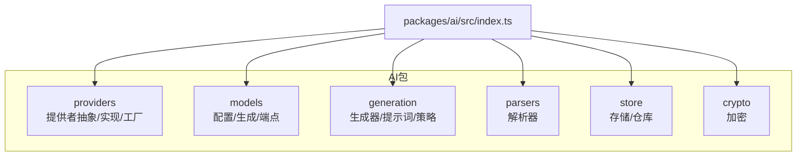
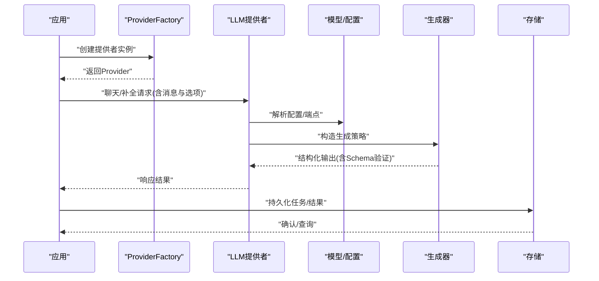
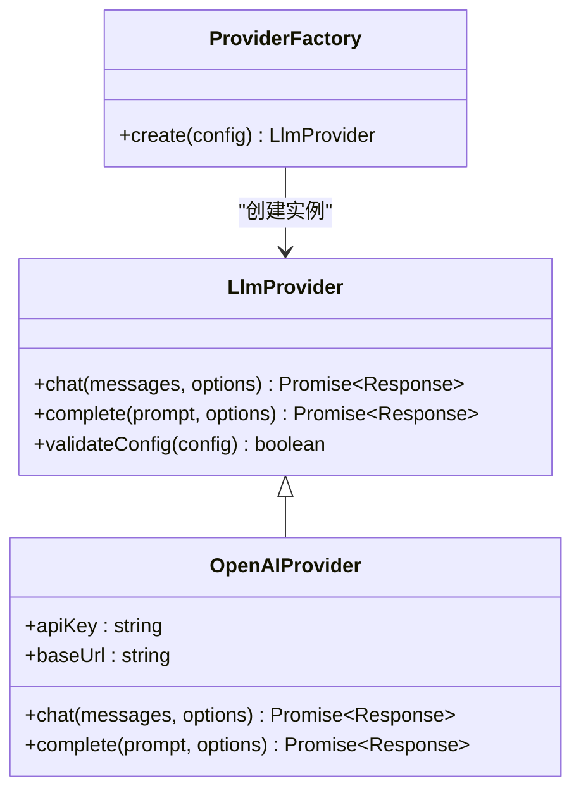
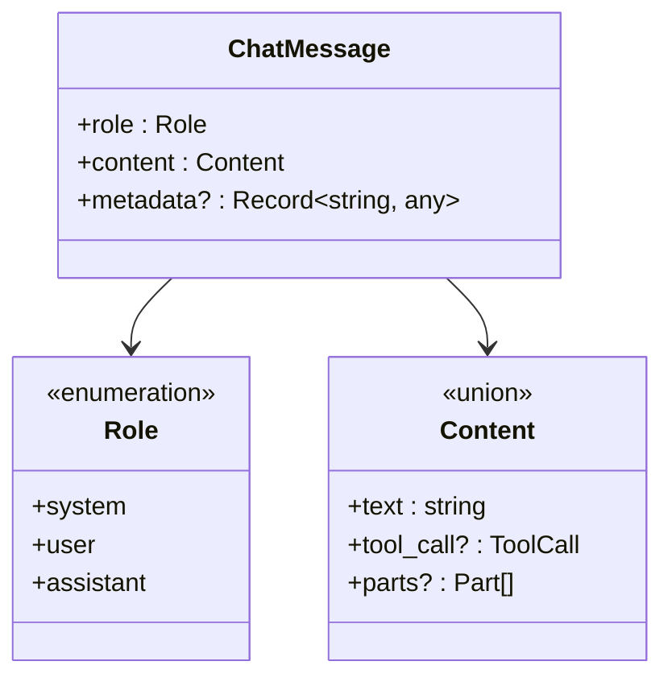
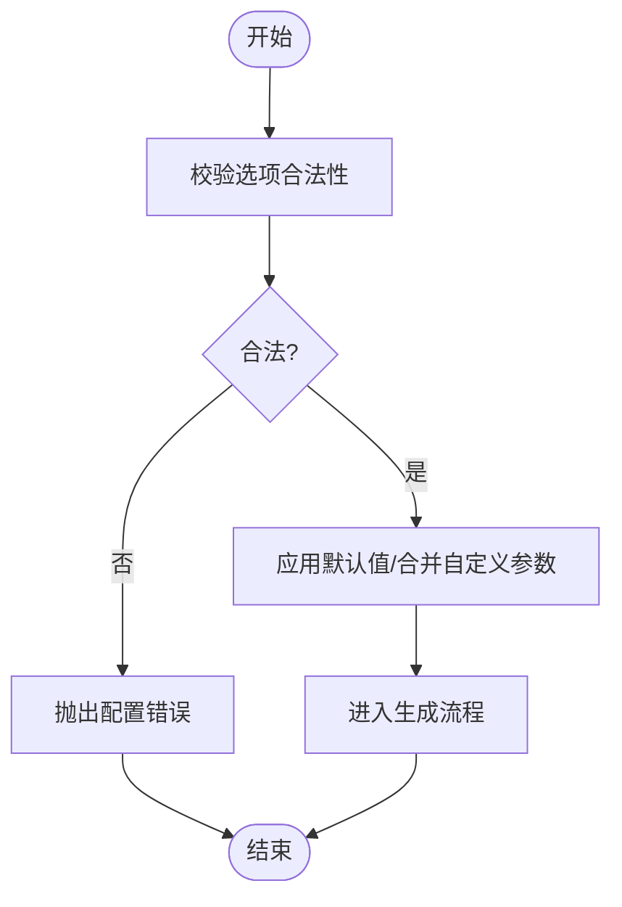
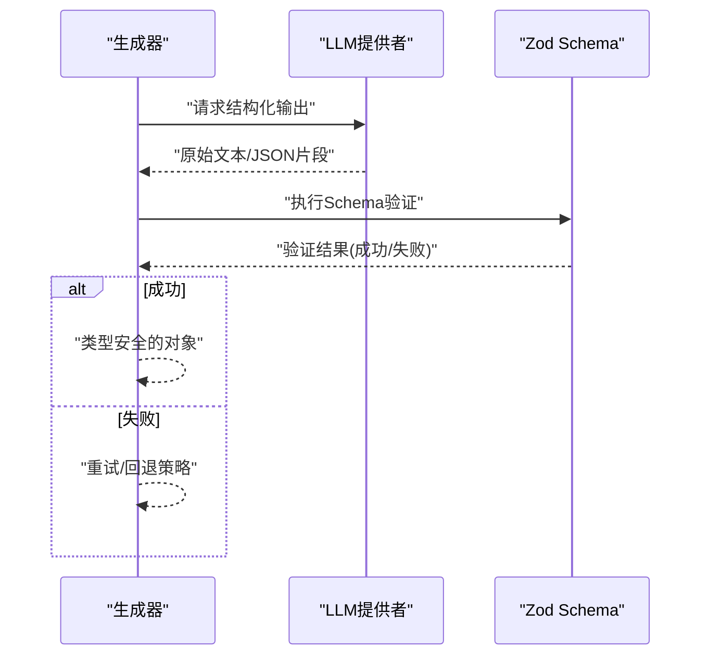
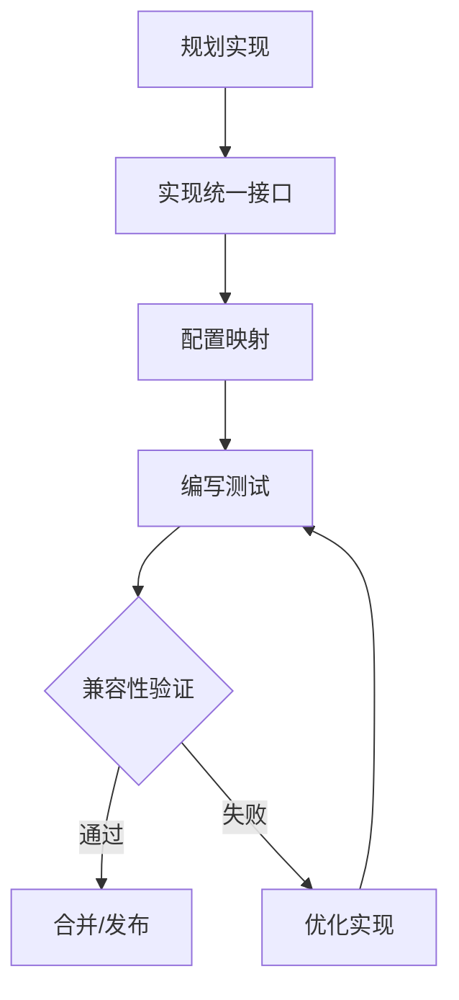
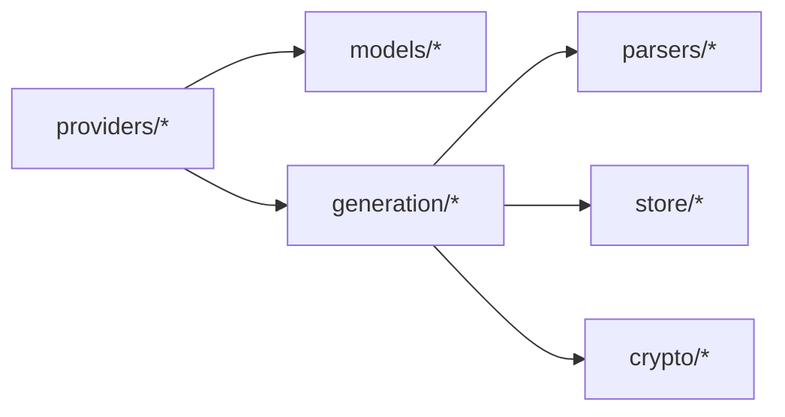

# LLM提供者接口设计

<cite>
**本文档引用的文件**
- [packages/ai/src/index.ts](file://packages/ai/src/index.ts)
- [packages/ai/src/providers/index.ts](file://packages/ai/src/providers/index.ts)
- [packages/ai/src/providers/types.ts](file://packages/ai/src/providers/types.ts)
- [packages/ai/src/providers/openai-provider.ts](file://packages/ai/src/providers/openai-provider.ts)
- [packages/ai/src/providers/provider-factory.ts](file://packages/ai/src/providers/provider-factory.ts)
- [packages/ai/src/models/index.ts](file://packages/ai/src/models/index.ts)
- [packages/ai/src/models/ai-config.ts](file://packages/ai/src/models/ai-config.ts)
- [packages/ai/src/models/generation.ts](file://packages/ai/src/models/generation.ts)
- [packages/ai/src/models/api-endpoint.ts](file://packages/ai/src/models/api-endpoint.ts)
- [packages/ai/src/generation/index.ts](file://packages/ai/src/generation/index.ts)
- [packages/ai/src/generation/generator.ts](file://packages/ai/src/generation/generator.ts)
- [packages/ai/src/generation/prompts.ts](file://packages/ai/src/generation/prompts.ts)
- [packages/ai/src/generation/strategies.ts](file://packages/ai/src/generation/strategies.ts)
- [packages/ai/src/parsers/index.ts](file://packages/ai/src/parsers/index.ts)
- [packages/ai/src/parsers/types.ts](file://packages/ai/src/parsers/types.ts)
- [packages/ai/src/parsers/openapi-parser.ts](file://packages/ai/src/parsers/openapi-parser.ts)
- [packages/ai/src/parsers/curl-parser.ts](file://packages/ai/src/parsers/curl-parser.ts)
- [packages/ai/src/store/index.ts](file://packages/ai/src/store/index.ts)
- [packages/ai/src/store/prisma-ai-config.ts](file://packages/ai/src/store/prisma-ai-config.ts)
- [packages/ai/src/store/prisma-api-endpoint.ts](file://packages/ai/src/store/prisma-api-endpoint.ts)
- [packages/ai/src/store/prisma-generation-task.ts](file://packages/ai/src/store/prisma-generation-task.ts)
- [packages/ai/src/store/repository.ts](file://packages/ai/src/store/repository.ts)
- [packages/ai/src/crypto.ts](file://packages/ai/src/crypto.ts)
</cite>

## 目录
1. [引言](#引言)
2. [项目结构](#项目结构)
3. [核心组件](#核心组件)
4. [架构总览](#架构总览)
5. [详细组件分析](#详细组件分析)
6. [依赖关系分析](#依赖关系分析)
7. [性能考量](#性能考量)
8. [故障排除指南](#故障排除指南)
9. [结论](#结论)
10. [附录](#附录)

## 引言
本技术文档围绕LLM提供者接口设计展开，系统阐述了统一的接口抽象、消息类型结构、选项配置设计、结构化输出模式以及扩展指南。目标是帮助开发者在不改变上层调用方式的前提下，快速接入新的LLM提供商，并确保类型安全与行为一致性。

## 项目结构
该仓库采用多包工作区组织，其中与LLM提供者相关的核心位于 `packages/ai` 包中。主要模块划分如下：
- providers：提供者抽象、具体实现（如OpenAI）与工厂
- models：配置、生成任务与API端点等模型定义
- generation：生成器、提示词与策略
- parsers：解析器（OpenAPI、CURL）
- store：持久化存储与仓库抽象
- crypto：加密工具

**图表来源**
- [packages/ai/src/index.ts:1-7](file://packages/ai/src/index.ts#L1-L7)
- [packages/ai/src/providers/index.ts:1-4](file://packages/ai/src/providers/index.ts#L1-L4)
- [packages/ai/src/models/index.ts:1-4](file://packages/ai/src/models/index.ts#L1-L4)
- [packages/ai/src/generation/index.ts:1-4](file://packages/ai/src/generation/index.ts#L1-L4)
- [packages/ai/src/parsers/index.ts:1-4](file://packages/ai/src/parsers/index.ts#L1-L4)
- [packages/ai/src/store/index.ts](file://packages/ai/src/store/index.ts)

**章节来源**
- [packages/ai/src/index.ts:1-7](file://packages/ai/src/index.ts#L1-L7)
- [packages/ai/src/providers/index.ts:1-4](file://packages/ai/src/providers/index.ts#L1-L4)
- [packages/ai/src/models/index.ts:1-4](file://packages/ai/src/models/index.ts#L1-L4)
- [packages/ai/src/generation/index.ts:1-4](file://packages/ai/src/generation/index.ts#L1-L4)
- [packages/ai/src/parsers/index.ts:1-4](file://packages/ai/src/parsers/index.ts#L1-L4)
- [packages/ai/src/store/index.ts](file://packages/ai/src/store/index.ts)

## 核心组件
本节聚焦于LLM提供者接口设计的关键要素：统一接口抽象、消息类型、选项配置与结构化输出。

- 统一接口抽象
  - 提供者抽象通过类型定义约束方法签名、参数与返回值，确保不同提供商实现的一致性。
  - 工厂负责根据配置选择合适的提供者实例，屏蔽底层差异。
  - 具体实现以OpenAI为例，展示如何遵循统一抽象进行对接。

- 消息类型结构
  - ChatMessage包含角色枚举、内容格式与可选元数据，用于承载对话历史与上下文信息。
  - 角色枚举通常涵盖系统、用户与助手三类，便于标准化消息路由与处理。

- 选项配置设计
  - LlmOptions提供温度、最大令牌数等通用参数；同时支持自定义扩展字段，满足特定提供商的差异化需求。
  - 配置应与模型能力匹配，避免无效或冲突设置。

- 结构化输出模式
  - 通过Zod Schema集成实现类型推断与运行时验证，保证输出符合预期结构。
  - 与生成器配合，将自然语言输出转换为强类型数据对象。

**章节来源**
- [packages/ai/src/providers/types.ts](file://packages/ai/src/providers/types.ts)
- [packages/ai/src/providers/provider-factory.ts](file://packages/ai/src/providers/provider-factory.ts)
- [packages/ai/src/providers/openai-provider.ts](file://packages/ai/src/providers/openai-provider.ts)
- [packages/ai/src/models/generation.ts](file://packages/ai/src/models/generation.ts)
- [packages/ai/src/generation/generator.ts](file://packages/ai/src/generation/generator.ts)

## 架构总览
下图展示了从应用到LLM提供者的整体调用链路，以及与模型、生成器和存储的交互关系：

**图表来源**
- [packages/ai/src/providers/provider-factory.ts](file://packages/ai/src/providers/provider-factory.ts)
- [packages/ai/src/providers/types.ts](file://packages/ai/src/providers/types.ts)
- [packages/ai/src/models/ai-config.ts](file://packages/ai/src/models/ai-config.ts)
- [packages/ai/src/models/generation.ts](file://packages/ai/src/models/generation.ts)
- [packages/ai/src/generation/generator.ts](file://packages/ai/src/generation/generator.ts)
- [packages/ai/src/store/prisma-generation-task.ts](file://packages/ai/src/store/prisma-generation-task.ts)

## 详细组件分析

### LLM提供者接口抽象
- 设计要点
  - 统一方法签名：面向聊天与补全的请求接口，明确输入输出契约。
  - 参数规范：消息列表、选项配置、回调钩子等。
  - 返回值约定：结构化响应对象，包含内容、元数据与统计信息。
  - 错误处理：标准化异常类型与错误码，便于上层统一处理。
- 扩展要求
  - 实现必须遵循统一接口，确保工厂与上层调用无感知切换。
  - 对标OpenAI风格的响应结构，保持兼容性。

**图表来源**
- [packages/ai/src/providers/types.ts](file://packages/ai/src/providers/types.ts)
- [packages/ai/src/providers/openai-provider.ts](file://packages/ai/src/providers/openai-provider.ts)
- [packages/ai/src/providers/provider-factory.ts](file://packages/ai/src/providers/provider-factory.ts)

**章节来源**
- [packages/ai/src/providers/types.ts](file://packages/ai/src/providers/types.ts)
- [packages/ai/src/providers/openai-provider.ts](file://packages/ai/src/providers/openai-provider.ts)
- [packages/ai/src/providers/provider-factory.ts](file://packages/ai/src/providers/provider-factory.ts)

### ChatMessage消息类型
- 结构定义
  - 角色枚举：系统、用户、助手等，用于区分消息来源。
  - 内容格式：文本、工具调用、分段流式内容等，适配多模态场景。
  - 元数据支持：时间戳、来源标识、追踪ID等，便于审计与调试。
- 使用建议
  - 严格遵循角色枚举，避免跨提供商的语义偏差。
  - 在流式场景中，合理拆分内容块，确保顺序与完整性。

**图表来源**
- [packages/ai/src/models/generation.ts](file://packages/ai/src/models/generation.ts)

**章节来源**
- [packages/ai/src/models/generation.ts](file://packages/ai/src/models/generation.ts)

### LlmOptions选项配置
- 设计理念
  - 温度控制：影响采样多样性，需与模型能力匹配。
  - 令牌限制：最大输出长度与上下文窗口的平衡。
  - 自定义参数：保留扩展字段，兼容不同提供商的独有特性。
- 最佳实践
  - 默认值应覆盖主流模型的推荐范围。
  - 对非法组合进行预校验，提前失败以减少后端开销。

**图表来源**
- [packages/ai/src/models/generation.ts](file://packages/ai/src/models/generation.ts)

**章节来源**
- [packages/ai/src/models/generation.ts](file://packages/ai/src/models/generation.ts)

### 结构化输出接口与Zod集成
- 设计模式
  - 生成器接收Schema定义，将LLM输出映射为强类型对象。
  - 运行时验证失败时，支持重试、回退或抛错策略。
- 类型推断与验证
  - 利用Schema进行编译期类型推断，运行期进行深度验证。
  - 支持嵌套结构、数组与可选字段的递归校验。

**图表来源**
- [packages/ai/src/generation/generator.ts](file://packages/ai/src/generation/generator.ts)
- [packages/ai/src/models/generation.ts](file://packages/ai/src/models/generation.ts)

**章节来源**
- [packages/ai/src/generation/generator.ts](file://packages/ai/src/generation/generator.ts)
- [packages/ai/src/models/generation.ts](file://packages/ai/src/models/generation.ts)

### 接口扩展指南
- 新提供商实现步骤
  - 实现统一接口：提供聊天与补全方法，遵循参数与返回值约定。
  - 配置解析：将通用选项映射到提供商特有参数。
  - 错误映射：将提供商错误转换为统一异常类型。
  - 测试覆盖：单元测试与集成测试，确保行为一致。
- 兼容性考虑
  - 保持消息角色与内容格式的最小公分母。
  - 对流式输出提供统一的事件/回调抽象。
  - 端点与鉴权方式的可插拔设计。

**图表来源**
- [packages/ai/src/providers/types.ts](file://packages/ai/src/providers/types.ts)
- [packages/ai/src/providers/openai-provider.ts](file://packages/ai/src/providers/openai-provider.ts)
- [packages/ai/src/providers/provider-factory.ts](file://packages/ai/src/providers/provider-factory.ts)

**章节来源**
- [packages/ai/src/providers/types.ts](file://packages/ai/src/providers/types.ts)
- [packages/ai/src/providers/openai-provider.ts](file://packages/ai/src/providers/openai-provider.ts)
- [packages/ai/src/providers/provider-factory.ts](file://packages/ai/src/providers/provider-factory.ts)

## 依赖关系分析
- 模块耦合
  - providers对models与generation存在直接依赖，确保配置与生成流程的衔接。
  - generation对parsers与store存在间接依赖，用于解析外部规范与持久化结果。
- 外部依赖
  - Zod用于Schema验证（在生成器中使用）。
  - 存储层基于Prisma，提供类型安全的数据访问。

**图表来源**
- [packages/ai/src/providers/index.ts](file://packages/ai/src/providers/index.ts)
- [packages/ai/src/models/index.ts](file://packages/ai/src/models/index.ts)
- [packages/ai/src/generation/index.ts](file://packages/ai/src/generation/index.ts)
- [packages/ai/src/parsers/index.ts](file://packages/ai/src/parsers/index.ts)
- [packages/ai/src/store/index.ts](file://packages/ai/src/store/index.ts)
- [packages/ai/src/crypto.ts](file://packages/ai/src/crypto.ts)

**章节来源**
- [packages/ai/src/providers/index.ts](file://packages/ai/src/providers/index.ts)
- [packages/ai/src/models/index.ts](file://packages/ai/src/models/index.ts)
- [packages/ai/src/generation/index.ts](file://packages/ai/src/generation/index.ts)
- [packages/ai/src/parsers/index.ts](file://packages/ai/src/parsers/index.ts)
- [packages/ai/src/store/index.ts](file://packages/ai/src/store/index.ts)
- [packages/ai/src/crypto.ts](file://packages/ai/src/crypto.ts)

## 性能考量
- 请求批量化与并发控制：对多个提供者实例进行限流与队列管理，避免资源争用。
- 缓存策略：对常用配置与Schema验证结果进行缓存，降低重复计算。
- 超时与重试：为网络请求设置合理超时与指数退避重试，提升稳定性。
- 日志与监控：记录关键指标（延迟、错误率、吞吐量），辅助容量规划与问题定位。

## 故障排除指南
- 常见问题
  - 配置不合法：检查温度、最大令牌数与提供商特有参数的组合是否有效。
  - 消息格式错误：确认角色枚举与内容格式符合统一约定。
  - Schema验证失败：核对输出结构与Schema定义，必要时启用宽松模式或回退策略。
- 定位手段
  - 启用详细日志，捕获请求与响应摘要。
  - 使用存储层查询历史任务，复现问题场景。
  - 对比不同提供商的响应差异，缩小问题范围。

**章节来源**
- [packages/ai/src/providers/types.ts](file://packages/ai/src/providers/types.ts)
- [packages/ai/src/generation/generator.ts](file://packages/ai/src/generation/generator.ts)
- [packages/ai/src/store/prisma-generation-task.ts](file://packages/ai/src/store/prisma-generation-task.ts)

## 结论
通过统一的接口抽象、严谨的消息类型与选项配置设计，以及与Zod的结构化输出集成，本系统实现了对多提供商的透明接入与一致行为。遵循扩展指南与最佳实践，可在保证类型安全与性能的前提下，快速集成新的LLM提供者并维持生态兼容性。

## 附录
- 相关文件索引
  - 提供者与工厂：[packages/ai/src/providers/types.ts](file://packages/ai/src/providers/types.ts)，[packages/ai/src/providers/provider-factory.ts](file://packages/ai/src/providers/provider-factory.ts)，[packages/ai/src/providers/openai-provider.ts](file://packages/ai/src/providers/openai-provider.ts)
  - 模型与配置：[packages/ai/src/models/ai-config.ts](file://packages/ai/src/models/ai-config.ts)，[packages/ai/src/models/generation.ts](file://packages/ai/src/models/generation.ts)，[packages/ai/src/models/api-endpoint.ts](file://packages/ai/src/models/api-endpoint.ts)
  - 生成与解析：[packages/ai/src/generation/generator.ts](file://packages/ai/src/generation/generator.ts)，[packages/ai/src/generation/prompts.ts](file://packages/ai/src/generation/prompts.ts)，[packages/ai/src/generation/strategies.ts](file://packages/ai/src/generation/strategies.ts)，[packages/ai/src/parsers/openapi-parser.ts](file://packages/ai/src/parsers/openapi-parser.ts)，[packages/ai/src/parsers/curl-parser.ts](file://packages/ai/src/parsers/curl-parser.ts)
  - 存储与仓库：[packages/ai/src/store/prisma-ai-config.ts](file://packages/ai/src/store/prisma-ai-config.ts)，[packages/ai/src/store/prisma-api-endpoint.ts](file://packages/ai/src/store/prisma-api-endpoint.ts)，[packages/ai/src/store/prisma-generation-task.ts](file://packages/ai/src/store/prisma-generation-task.ts)，[packages/ai/src/store/repository.ts](file://packages/ai/src/store/repository.ts)
  - 加密工具：[packages/ai/src/crypto.ts](file://packages/ai/src/crypto.ts)