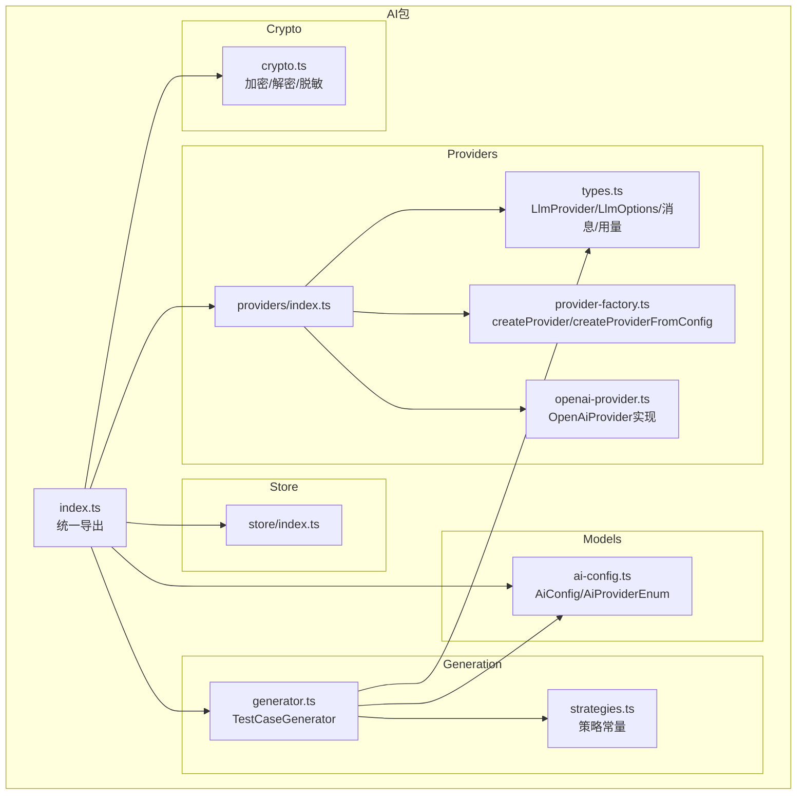
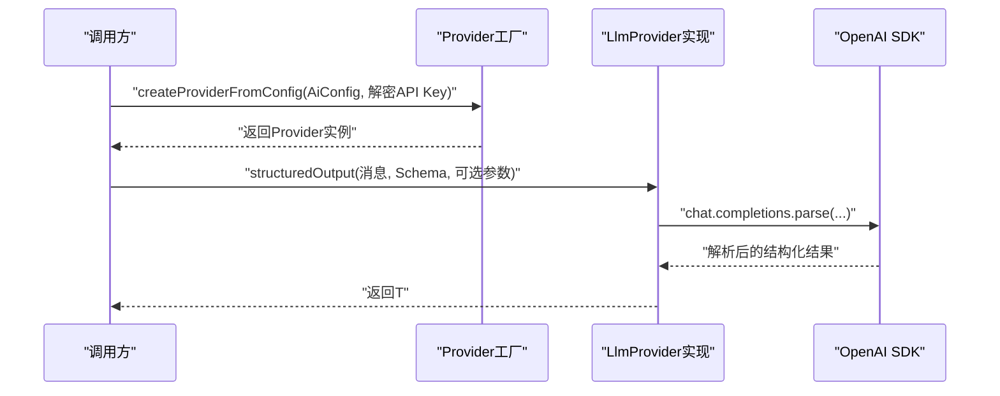
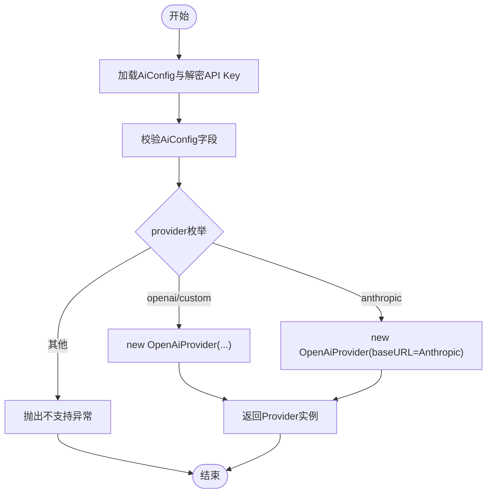
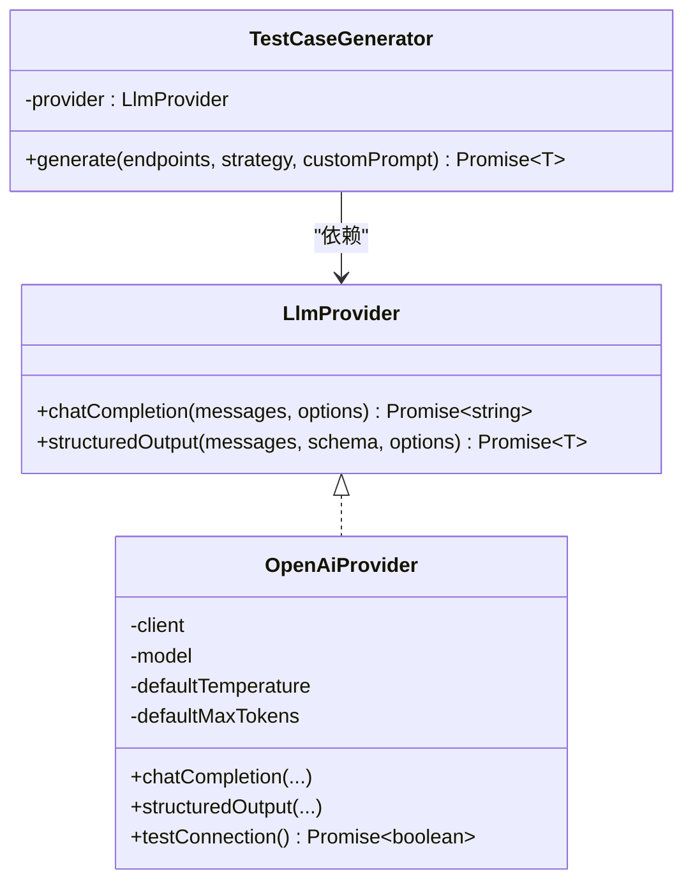
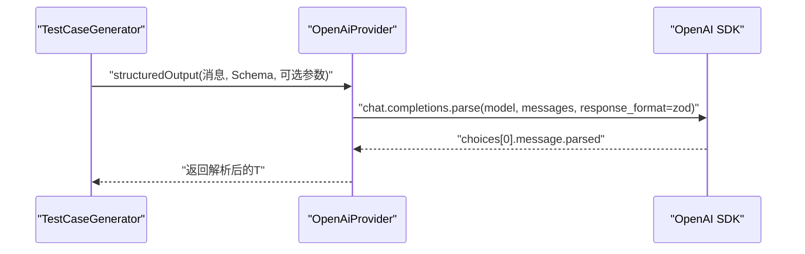
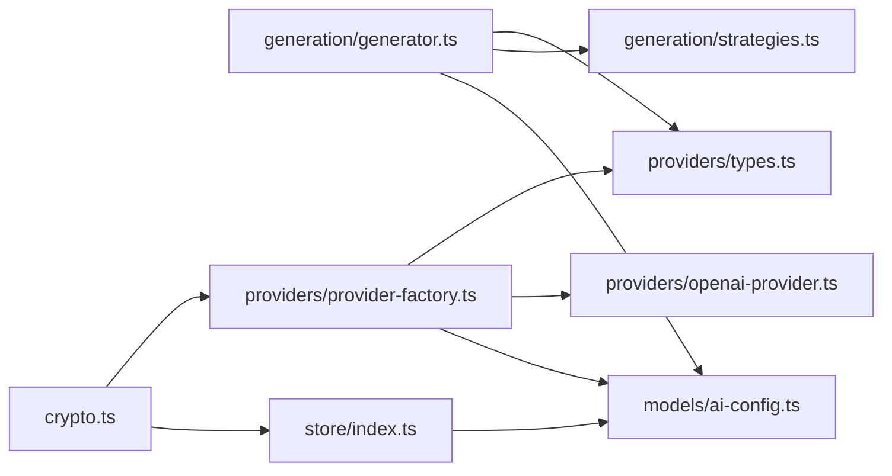

# LLM提供者集成

<cite>
**本文档引用的文件**
- [packages/ai/src/index.ts](file://packages/ai/src/index.ts)
- [packages/ai/src/providers/index.ts](file://packages/ai/src/providers/index.ts)
- [packages/ai/src/providers/types.ts](file://packages/ai/src/providers/types.ts)
- [packages/ai/src/providers/provider-factory.ts](file://packages/ai/src/providers/provider-factory.ts)
- [packages/ai/src/providers/openai-provider.ts](file://packages/ai/src/providers/openai-provider.ts)
- [packages/ai/src/models/ai-config.ts](file://packages/ai/src/models/ai-config.ts)
- [packages/ai/src/generation/generator.ts](file://packages/ai/src/generation/generator.ts)
- [packages/ai/src/generation/strategies.ts](file://packages/ai/src/generation/strategies.ts)
- [packages/ai/src/store/index.ts](file://packages/ai/src/store/index.ts)
- [packages/ai/src/crypto.ts](file://packages/ai/src/crypto.ts)
</cite>

## 目录
1. [简介](#简介)
2. [项目结构](#项目结构)
3. [核心组件](#核心组件)
4. [架构总览](#架构总览)
5. [详细组件分析](#详细组件分析)
6. [依赖关系分析](#依赖关系分析)
7. [性能考虑](#性能考虑)
8. [故障排查指南](#故障排查指南)
9. [结论](#结论)
10. [附录](#附录)

## 简介
本文件面向“LLM提供者集成系统”，聚焦以下目标：
- Provider工厂的设计模式：动态提供商创建、类型安全的工厂方法与扩展机制
- 多提供商支持：OpenAI集成、接口抽象与统一调用协议
- 抽象接口设计：结构化输出方法、参数配置与响应处理
- 生命周期管理、连接池优化与错误重试机制
- 提供商切换策略、性能监控与成本控制方案

该系统通过统一的Provider接口屏蔽不同后端差异，使用工厂按配置动态创建具体Provider实例；在生成流程中，统一以结构化输出方式消费LLM能力，结合策略体系与提示词工程完成测试用例生成。

## 项目结构
- 核心模块位于 packages/ai/src 下，采用按功能域分层组织：
  - providers：提供者抽象与实现（工厂、类型定义、OpenAI实现）
  - models：配置与数据模型（AiConfig等）
  - generation：生成器与策略、提示词构建
  - store：存储仓库与持久化适配
  - crypto：密钥加解密与脱敏
  - index导出：对外统一入口

图表来源
- [packages/ai/src/index.ts:1-7](file://packages/ai/src/index.ts#L1-L7)
- [packages/ai/src/providers/index.ts:1-4](file://packages/ai/src/providers/index.ts#L1-L4)
- [packages/ai/src/providers/types.ts:1-35](file://packages/ai/src/providers/types.ts#L1-L35)
- [packages/ai/src/providers/provider-factory.ts:1-56](file://packages/ai/src/providers/provider-factory.ts#L1-L56)
- [packages/ai/src/providers/openai-provider.ts:1-79](file://packages/ai/src/providers/openai-provider.ts#L1-L79)
- [packages/ai/src/models/ai-config.ts:1-34](file://packages/ai/src/models/ai-config.ts#L1-L34)
- [packages/ai/src/generation/generator.ts:1-57](file://packages/ai/src/generation/generator.ts#L1-L57)
- [packages/ai/src/generation/strategies.ts:1-50](file://packages/ai/src/generation/strategies.ts#L1-L50)
- [packages/ai/src/store/index.ts:1-5](file://packages/ai/src/store/index.ts#L1-L5)
- [packages/ai/src/crypto.ts:1-58](file://packages/ai/src/crypto.ts#L1-L58)

章节来源
- [packages/ai/src/index.ts:1-7](file://packages/ai/src/index.ts#L1-L7)
- [packages/ai/src/providers/index.ts:1-4](file://packages/ai/src/providers/index.ts#L1-L4)

## 核心组件
- Provider接口与类型
  - LlmProvider：定义通用聊天补全与结构化输出能力
  - LlmOptions：温度、最大令牌数等可选参数
  - ChatMessage：角色与内容的消息体
  - LlmUsage/LlmResponse：用量统计与响应封装
- 工厂与配置
  - ProviderFactoryInput：工厂输入参数
  - createProvider：根据AiProvider枚举创建具体Provider
  - createProviderFromConfig：从AiConfig与解密后的API Key创建Provider
- OpenAI实现
  - OpenAiProvider：基于OpenAI SDK实现，支持chatCompletion与structuredOutput
  - 连通性测试方法testConnection
- 配置模型
  - AiProviderEnum：支持openai、anthropic、custom
  - AiConfig/创建/更新Schema：含provider、model、baseUrl、temperature、maxTokens等
- 生成器与策略
  - TestCaseGenerator：统一调用Provider进行结构化输出
  - STRATEGIES：内置策略集合（happy_path、error_cases、auth_cases、comprehensive）

章节来源
- [packages/ai/src/providers/types.ts:1-35](file://packages/ai/src/providers/types.ts#L1-L35)
- [packages/ai/src/providers/provider-factory.ts:1-56](file://packages/ai/src/providers/provider-factory.ts#L1-L56)
- [packages/ai/src/providers/openai-provider.ts:1-79](file://packages/ai/src/providers/openai-provider.ts#L1-L79)
- [packages/ai/src/models/ai-config.ts:1-34](file://packages/ai/src/models/ai-config.ts#L1-L34)
- [packages/ai/src/generation/generator.ts:1-57](file://packages/ai/src/generation/generator.ts#L1-L57)
- [packages/ai/src/generation/strategies.ts:1-50](file://packages/ai/src/generation/strategies.ts#L1-L50)

## 架构总览
系统通过Provider抽象屏蔽底层差异，工厂按配置创建Provider实例；生成器以统一接口消费结构化输出能力，结合策略与提示词工程完成测试用例生成。

图表来源
- [packages/ai/src/providers/provider-factory.ts:42-55](file://packages/ai/src/providers/provider-factory.ts#L42-L55)
- [packages/ai/src/providers/openai-provider.ts:45-63](file://packages/ai/src/providers/openai-provider.ts#L45-L63)
- [packages/ai/src/generation/generator.ts:45-52](file://packages/ai/src/generation/generator.ts#L45-L52)

## 详细组件分析

### Provider工厂与扩展机制
- 设计要点
  - 类型安全：AiProviderEnum约束可用提供商标识，工厂switch分支覆盖已知值
  - 动态创建：根据AiConfig.provider与model等参数创建具体Provider
  - 扩展友好：新增提供商标号时，在工厂switch中添加新分支；保持LlmProvider接口不变
  - Anthropic兼容：通过自定义baseURL将Anthropic接入OpenAI兼容路径
- 关键流程
  - 输入校验：AiConfigSchema确保provider/model/baseUrl/temperature/maxTokens合法
  - 工厂映射：createProvider映射到OpenAiProvider或新增实现
  - 统一入口：createProviderFromConfig将AiConfig与解密API Key组合为ProviderFactoryInput

图表来源
- [packages/ai/src/providers/provider-factory.ts:14-39](file://packages/ai/src/providers/provider-factory.ts#L14-L39)
- [packages/ai/src/models/ai-config.ts:5-26](file://packages/ai/src/models/ai-config.ts#L5-L26)

章节来源
- [packages/ai/src/providers/provider-factory.ts:1-56](file://packages/ai/src/providers/provider-factory.ts#L1-L56)
- [packages/ai/src/models/ai-config.ts:1-34](file://packages/ai/src/models/ai-config.ts#L1-L34)

### 接口抽象与统一调用协议
- LlmProvider接口
  - chatCompletion：自由文本对话补全
  - structuredOutput：基于Zod Schema的结构化输出，自动解析并验证
- 调用协议
  - 消息格式：ChatMessage(role/content)
  - 参数传递：LlmOptions(temperature/maxTokens)，可覆盖Provider默认值
  - 响应封装：LlmResponse(content/usage?)
- 生成器集成
  - TestCaseGenerator通过provider.structuredOutput消费能力
  - 使用STRATEGIES与提示词构建函数生成系统/用户提示

图表来源
- [packages/ai/src/providers/types.ts:13-23](file://packages/ai/src/providers/types.ts#L13-L23)
- [packages/ai/src/providers/openai-provider.ts:14-79](file://packages/ai/src/providers/openai-provider.ts#L14-L79)
- [packages/ai/src/generation/generator.ts:20-56](file://packages/ai/src/generation/generator.ts#L20-L56)

章节来源
- [packages/ai/src/providers/types.ts:1-35](file://packages/ai/src/providers/types.ts#L1-L35)
- [packages/ai/src/providers/openai-provider.ts:1-79](file://packages/ai/src/providers/openai-provider.ts#L1-L79)
- [packages/ai/src/generation/generator.ts:1-57](file://packages/ai/src/generation/generator.ts#L1-L57)

### OpenAI集成与结构化输出
- 实现细节
  - 构造函数：初始化OpenAI客户端，设置model与默认参数
  - chatCompletion：调用chat.completions.create，提取choices[0].message.content
  - structuredOutput：调用beta.chat.completions.parse，使用zodResponseFormat绑定Schema并返回parsed
  - 连通性测试：testConnection通过一次短请求验证服务可达性
- 错误处理
  - 对空响应与无结构化输出场景抛出明确错误，便于上层捕获与重试

图表来源
- [packages/ai/src/providers/openai-provider.ts:45-63](file://packages/ai/src/providers/openai-provider.ts#L45-L63)
- [packages/ai/src/generation/generator.ts:45-52](file://packages/ai/src/generation/generator.ts#L45-L52)

章节来源
- [packages/ai/src/providers/openai-provider.ts:1-79](file://packages/ai/src/providers/openai-provider.ts#L1-L79)
- [packages/ai/src/generation/generator.ts:1-57](file://packages/ai/src/generation/generator.ts#L1-L57)

### 多提供商支持与扩展点
- 当前支持
  - openai：直接使用OpenAI SDK
  - anthropic：通过自定义baseURL走OpenAI兼容路径
  - custom：自定义baseURL，便于接入其他兼容服务
- 扩展建议
  - 新增提供商标号：在AiProviderEnum与工厂switch中添加
  - 新增实现类：实现LlmProvider接口，注入对应SDK客户端
  - 保持统一：遵循LlmOptions与ChatMessage约定，确保生成器无需改动

章节来源
- [packages/ai/src/providers/provider-factory.ts:14-39](file://packages/ai/src/providers/provider-factory.ts#L14-L39)
- [packages/ai/src/models/ai-config.ts:3-3](file://packages/ai/src/models/ai-config.ts#L3-L3)

### 生命周期管理、连接池与重试
- 生命周期
  - Provider实例由工厂创建并注入到生成器；调用完成后由调用方负责销毁或复用
- 连接池
  - OpenAI SDK内部维护HTTP连接池；可通过baseURL与SDK配置进行优化
- 重试机制
  - 当前未内置重试逻辑；可在调用方包装provider方法，对网络/超时/服务不可达错误进行指数退避重试

章节来源
- [packages/ai/src/providers/openai-provider.ts:20-28](file://packages/ai/src/providers/openai-provider.ts#L20-L28)

### 性能监控与成本控制
- 监控指标
  - LlmUsage：promptTokens/completionTokens/totalTokens，可用于成本与性能追踪
- 成本控制
  - 通过maxTokens限制单次输出长度，避免过度消耗
  - 在工厂与配置层统一设置默认maxTokens，生成器可按需覆盖
  - 结合策略选择与提示词精简，降低token使用

章节来源
- [packages/ai/src/providers/types.ts:25-29](file://packages/ai/src/providers/types.ts#L25-L29)
- [packages/ai/src/providers/openai-provider.ts:30-43](file://packages/ai/src/providers/openai-provider.ts#L30-L43)

### 提供商切换策略
- 切换依据
  - 通过AiConfig.provider与baseUrl动态切换至不同后端
  - Anthropic通过自定义baseURL接入，无需修改上层调用
- 策略建议
  - 将不同供应商的默认参数、限额与超时配置集中管理
  - 在工厂层增加路由规则（如按项目/环境/成本预算）实现自动切换

章节来源
- [packages/ai/src/providers/provider-factory.ts:26-35](file://packages/ai/src/providers/provider-factory.ts#L26-L35)
- [packages/ai/src/models/ai-config.ts:10-13](file://packages/ai/src/models/ai-config.ts#L10-L13)

## 依赖关系分析
- 模块耦合
  - generation依赖providers(types与具体实现)
  - providers依赖models(AiConfig与枚举)
  - store提供持久化能力（与AI配置相关）
  - crypto用于API Key加解密与脱敏
- 导出与入口
  - packages/ai/src/index.ts统一导出各子模块，便于外部按需引入

图表来源
- [packages/ai/src/generation/generator.ts:1-11](file://packages/ai/src/generation/generator.ts#L1-L11)
- [packages/ai/src/providers/provider-factory.ts:1-3](file://packages/ai/src/providers/provider-factory.ts#L1-L3)
- [packages/ai/src/store/index.ts:1-5](file://packages/ai/src/store/index.ts#L1-L5)
- [packages/ai/src/crypto.ts:1-58](file://packages/ai/src/crypto.ts#L1-L58)

章节来源
- [packages/ai/src/index.ts:1-7](file://packages/ai/src/index.ts#L1-L7)
- [packages/ai/src/providers/index.ts:1-4](file://packages/ai/src/providers/index.ts#L1-L4)

## 性能考虑
- Token控制
  - 在构造Provider时设置合理默认maxTokens；在生成器中按策略覆盖
- 并发与连接
  - 利用SDK连接池；避免频繁创建Provider实例
- 输出解析
  - structuredOutput依赖Schema解析，建议在调用方缓存Schema编译结果
- 日志与观测
  - 记录每次调用的prompt/completion token与耗时，用于成本与性能分析

## 故障排查指南
- 常见问题
  - API Key无效：检查解密流程与环境变量；使用maskApiKey进行安全显示
  - 空响应：chatCompletion/structuredOutput均对空结果抛错，确认模型与消息格式
  - 不支持的提供商标识：AiProviderEnum未包含该值，需在枚举与工厂中补充
- 诊断步骤
  - testConnection快速验证连通性
  - 查看AiConfig字段是否符合Schema要求
  - 检查baseURL与网络访问权限

章节来源
- [packages/ai/src/providers/openai-provider.ts:66-77](file://packages/ai/src/providers/openai-provider.ts#L66-L77)
- [packages/ai/src/models/ai-config.ts:5-26](file://packages/ai/src/models/ai-config.ts#L5-L26)
- [packages/ai/src/crypto.ts:52-57](file://packages/ai/src/crypto.ts#L52-L57)

## 结论
本系统通过Provider抽象与工厂模式实现了对多提供商的统一接入，OpenAI作为首个实现，具备结构化输出与连通性测试能力。生成器以统一接口消费LLM能力，结合策略与提示词工程完成测试用例生成。未来可在工厂层扩展更多提供商、在调用方增加重试与熔断、完善监控与成本控制策略，以满足更复杂的生产需求。

## 附录
- 数据模型概览（简化）
  - AiConfig：id、projectId、provider、model、apiKey、baseUrl、temperature、maxTokens、createdAt、updatedAt
  - LlmUsage：promptTokens、completionTokens、totalTokens
  - LlmResponse：content、usage?

章节来源
- [packages/ai/src/models/ai-config.ts:5-33](file://packages/ai/src/models/ai-config.ts#L5-L33)
- [packages/ai/src/providers/types.ts:25-34](file://packages/ai/src/providers/types.ts#L25-L34)